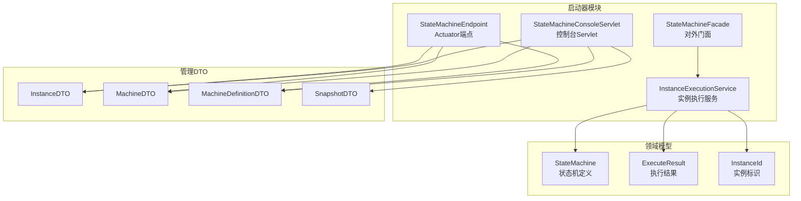
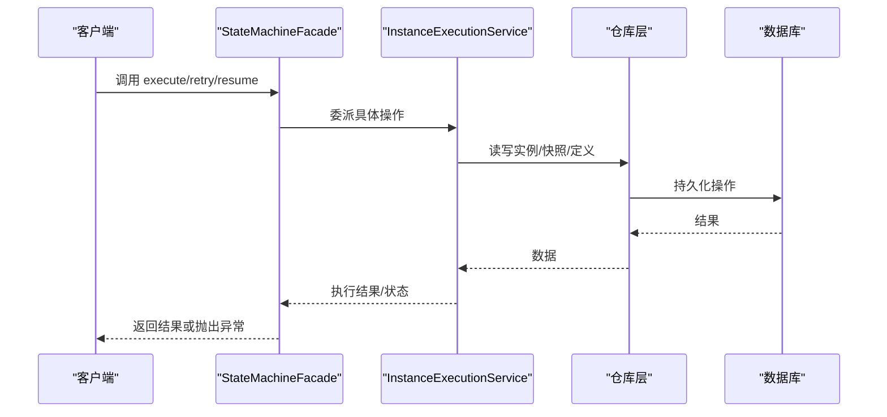
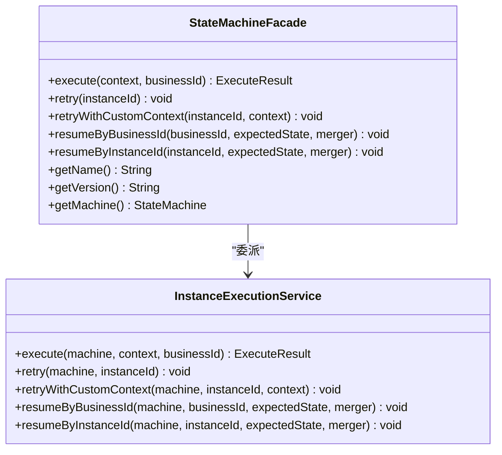
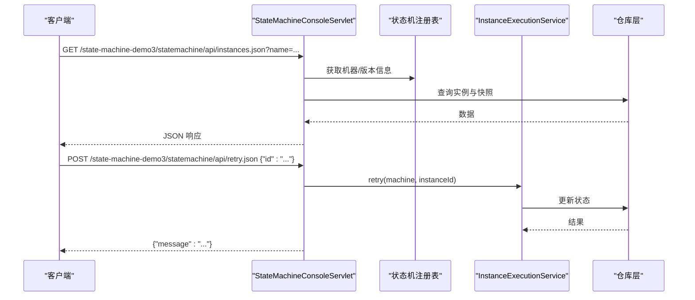
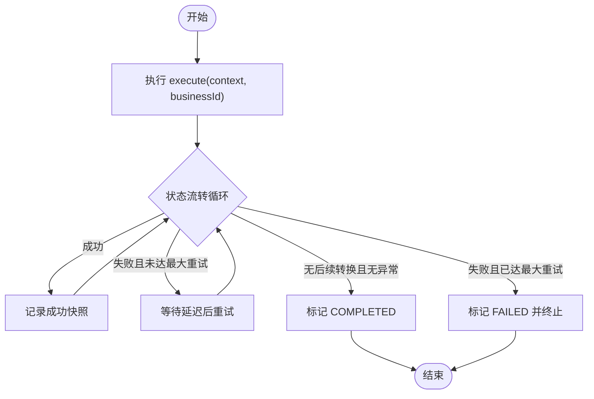
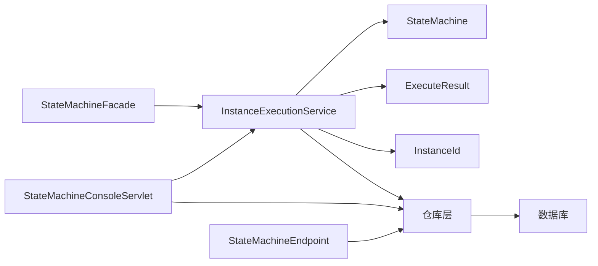

# API参考

<cite>
**本文引用的文件**
- [StateMachineFacade.java](file://state-machine-boot-starter/src/main/java/cn/chedejun/statemachine/interfaces/StateMachineFacade.java)
- [InstanceExecutionService.java](file://state-machine-boot-starter/src/main/java/cn/chedejun/statemachine/application/InstanceExecutionService.java)
- [StateMachineEndpoint.java](file://state-machine-boot-starter/src/main/java/cn/chedejun/statemachine/management/StateMachineEndpoint.java)
- [StateMachineConsoleServlet.java](file://state-machine-boot-starter/src/main/java/cn/chedejun/statemachine/management/StateMachineConsoleServlet.java)
- [ExecuteResult.java](file://state-machine-boot-starter/src/main/java/cn/chedejun/statemachine/core/ExecuteResult.java)
- [InstanceDTO.java](file://state-machine-boot-starter/src/main/java/cn/chedejun/statemachine/management/dto/InstanceDTO.java)
- [MachineDTO.java](file://state-machine-boot-starter/src/main/java/cn/chedejun/statemachine/management/dto/MachineDTO.java)
- [MachineDefinitionDTO.java](file://state-machine-boot-starter/src/main/java/cn/chedejun/statemachine/management/dto/MachineDefinitionDTO.java)
- [SnapshotDTO.java](file://state-machine-boot-starter/src/main/java/cn/chedejun/statemachine/management/dto/SnapshotDTO.java)
- [InstanceId.java](file://state-machine-boot-starter/src/main/java/cn/chedejun/statemachine/domain/shared/InstanceId.java)
- [StateMachine.java](file://state-machine-boot-starter/src/main/java/cn/chedejun/statemachine/domain/engine/StateMachine.java)
- [README.md](file://state-machine-boot-starter/README.md)
- [index.html](file://state-machine-boot-starter/src/main/resources/console/index.html)
- [StateMachineIntegrationTest.java](file://state-machine-boot-starter/src/test/java/cn/chedejun/statemachine/integration/StateMachineIntegrationTest.java)
- [pom.xml](file://state-machine-boot-starter/pom.xml)
- [application.yml](file://state-machine-demo/src/main/resources/application.yml)
- [CLAUDE.md](file://CLAUDE.md)
</cite>

## 更新摘要
**所做更改**
- 更新了演示应用上下文路径从 `/state-machine-demo` 更改为 `/state-machine-demo3`
- 更新了版本信息从 1.0.1-jdk8.release 升级到 1.0.2-jdk8.release
- 更新了控制台访问路径和示例应用启动说明
- 更新了REST API端点规范中的上下文路径

## 目录
1. [简介](#简介)
2. [项目结构](#项目结构)
3. [核心组件](#核心组件)
4. [架构总览](#架构总览)
5. [详细组件分析](#详细组件分析)
6. [依赖关系分析](#依赖关系分析)
7. [性能与可靠性](#性能与可靠性)
8. [故障排查指南](#故障排查指南)
9. [结论](#结论)
10. [附录](#附录)

## 简介
本API参考面向使用状态机引擎的客户端与集成方，覆盖以下内容：
- StateMachineFacade公共接口：execute、retry、retryWithCustomContext、resumeByBusinessId、resumeByInstanceId 的参数、返回值与异常行为
- REST API端点规范：HTTP方法、URL模式、请求/响应格式、状态码
- DTO数据模型：字段含义、类型与约束
- 使用模式与最佳实践：执行、重试、挂起/恢复、查询
- 版本兼容性与迁移建议
- 客户端集成指引

**更新** 版本已升级至1.0.2-jdk8.release，演示应用上下文路径已更新为/state-machine-demo3

## 项目结构
本项目采用"启动器 + 示例 + 管理控制台"的结构组织，核心模块位于 state-machine-boot-starter 中，包含应用服务、领域模型、管理端点与控制台Servlet。

**图表来源**
- [StateMachineFacade.java:16-51](file://state-machine-boot-starter/src/main/java/cn/chedejun/statemachine/interfaces/StateMachineFacade.java#L16-L51)
- [InstanceExecutionService.java:25-41](file://state-machine-boot-starter/src/main/java/cn/chedejun/statemachine/application/InstanceExecutionService.java#L25-L41)
- [StateMachineEndpoint.java:22-38](file://state-machine-boot-starter/src/main/java/cn/chedejun/statemachine/management/StateMachineEndpoint.java#L22-L38)
- [StateMachineConsoleServlet.java:39-61](file://state-machine-boot-starter/src/main/java/cn/chedejun/statemachine/management/StateMachineConsoleServlet.java#L39-L61)
- [StateMachine.java:19-48](file://state-machine-boot-starter/src/main/java/cn/chedejun/statemachine/domain/engine/StateMachine.java#L19-L48)
- [ExecuteResult.java:16-37](file://state-machine-boot-starter/src/main/java/cn/chedejun/statemachine/core/ExecuteResult.java#L16-L37)
- [InstanceId.java:6-16](file://state-machine-boot-starter/src/main/java/cn/chedejun/statemachine/domain/shared/InstanceId.java#L6-L16)

**章节来源**
- [README.md:1-65](file://state-machine-boot-starter/README.md#L1-L65)
- [pom.xml:8](file://state-machine-boot-starter/pom.xml#L8)

## 核心组件
- StateMachineFacade：对外门面，封装执行、重试、恢复等操作，委托给 InstanceExecutionService
- InstanceExecutionService：核心执行引擎，负责实例创建、状态流转、动作执行、重试与快照记录
- StateMachineEndpoint：Spring Boot Actuator端点，提供机器与定义查询、失败实例重试提示
- StateMachineConsoleServlet：基于Servlet的Web控制台与REST API，提供机器、版本、实例、快照查询与重试/恢复操作
- ExecuteResult：执行结果载体，包含实例ID、状态机名称/版本、当前状态、业务ID、错误信息与创建时间
- DTO集合：用于管理端与控制台的序列化输出

**章节来源**
- [StateMachineFacade.java:16-51](file://state-machine-boot-starter/src/main/java/cn/chedejun/statemachine/interfaces/StateMachineFacade.java#L16-L51)
- [InstanceExecutionService.java:25-41](file://state-machine-boot-starter/src/main/java/cn/chedejun/statemachine/application/InstanceExecutionService.java#L25-L41)
- [StateMachineEndpoint.java:22-38](file://state-machine-boot-starter/src/main/java/cn/chedejun/statemachine/management/StateMachineEndpoint.java#L22-L38)
- [StateMachineConsoleServlet.java:39-61](file://state-machine-boot-starter/src/main/java/cn/chedejun/statemachine/management/StateMachineConsoleServlet.java#L39-L61)
- [ExecuteResult.java:16-37](file://state-machine-boot-starter/src/main/java/cn/chedejun/statemachine/core/ExecuteResult.java#L16-L37)

## 架构总览
下图展示客户端调用门面、服务层与持久化之间的交互，以及管理端点与控制台的访问路径。

**图表来源**
- [StateMachineFacade.java:26-46](file://state-machine-boot-starter/src/main/java/cn/chedejun/statemachine/interfaces/StateMachineFacade.java#L26-L46)
- [InstanceExecutionService.java:43-114](file://state-machine-boot-starter/src/main/java/cn/chedejun/statemachine/application/InstanceExecutionService.java#L43-L114)

## 详细组件分析

### StateMachineFacade 接口参考
- 方法：execute、retry、retryWithCustomContext、resumeByBusinessId、resumeByInstanceId、getName、getVersion、getMachine
- 参数与返回值
  - execute(context, businessId): 返回 ExecuteResult
  - retry(instanceId): 无返回，仅触发重试
  - retryWithCustomContext(instanceId, context): 无返回，携带新上下文重试
  - resumeByBusinessId(businessId, expectedState, contextMerger): 无返回，按业务ID恢复
  - resumeByInstanceId(instanceId, expectedState, contextMerger): 无返回，按实例ID恢复
  - 其他：返回字符串或内部状态机引用
- 异常处理
  - 当实例不存在、状态不匹配、未处于可重试状态、无失败快照等场景抛出 StateMachineException 或等效异常
  - 重试中断会抛出带中断标记的异常

**图表来源**
- [StateMachineFacade.java:16-51](file://state-machine-boot-starter/src/main/java/cn/chedejun/statemachine/interfaces/StateMachineFacade.java#L16-L51)
- [InstanceExecutionService.java:43-114](file://state-machine-boot-starter/src/main/java/cn/chedejun/statemachine/application/InstanceExecutionService.java#L43-L114)

**章节来源**
- [StateMachineFacade.java:26-46](file://state-machine-boot-starter/src/main/java/cn/chedejun/statemachine/interfaces/StateMachineFacade.java#L26-L46)
- [InstanceExecutionService.java:74-114](file://state-machine-boot-starter/src/main/java/cn/chedejun/statemachine/application/InstanceExecutionService.java#L74-L114)

### REST API 规范

#### 控制台Servlet端点
- 基础路径：/state-machine-demo3/statemachine/api/*
- 内容类型：application/json；字符集 UTF-8
- 访问方式：GET/POST

1) 获取机器列表
- 方法：GET
- 路径：/state-machine-demo3/statemachine/api/machines.json
- 查询参数：无
- 响应：数组，元素为 MachineDTO
- 状态码：200 成功；500 服务器错误

2) 获取指定机器版本
- 方法：GET
- 路径：/state-machine-demo3/statemachine/api/versions.json
- 查询参数：name（必填）
- 响应：数组，元素为 MachineDefinitionDTO
- 状态码：200 成功；400 参数缺失；500 服务器错误

3) 分页查询实例
- 方法：GET
- 路径：/state-machine-demo3/statemachine/api/instances.json
- 查询参数：
  - name（必填）
  - status：RUNNING/COMPLETED/FAILED/SUSPENDED（可选）
  - businessId（可选）
  - instanceId（可选）
  - page（默认0，可选）
  - size（默认20，上限200，可选）
- 响应：包含 total/page/size/instances 的对象，instances为 InstanceDTO[]
- 状态码：200 成功；400 参数无效；500 服务器错误

4) 获取实例详情
- 方法：GET
- 路径：/state-machine-demo3/statemachine/api/instance.json
- 查询参数：id（必填）
- 响应：包含 instance（InstanceDTO）与 snapshots（SnapshotDTO[]）
- 状态码：200 成功；400 参数缺失；404 实例不存在；500 服务器错误

5) 恢复挂起实例
- 方法：POST
- 路径：/state-machine-demo3/statemachine/api/resume.json
- 请求体：id（必填）、expectedCurrentState（必填）、contextJson（可选）
- 响应：包含 success/message/currentState 的对象
- 状态码：200 成功；400 参数缺失；500 服务器错误

6) 重试失败实例
- 方法：POST
- 路径：/state-machine-demo3/statemachine/api/retry.json
- 请求体：id（必填）
- 响应：包含 message 的对象
- 状态码：200 成功；400 参数缺失；500 服务器错误

**图表来源**
- [StateMachineConsoleServlet.java:113-158](file://state-machine-boot-starter/src/main/java/cn/chedejun/statemachine/management/StateMachineConsoleServlet.java#L113-L158)
- [StateMachineConsoleServlet.java:197-245](file://state-machine-boot-starter/src/main/java/cn/chedejun/statemachine/management/StateMachineConsoleServlet.java#L197-L245)
- [StateMachineConsoleServlet.java:321-348](file://state-machine-boot-starter/src/main/java/cn/chedejun/statemachine/management/StateMachineConsoleServlet.java#L321-L348)

**章节来源**
- [StateMachineConsoleServlet.java:65-108](file://state-machine-boot-starter/src/main/java/cn/chedejun/statemachine/management/StateMachineConsoleServlet.java#L65-L108)
- [StateMachineConsoleServlet.java:113-158](file://state-machine-boot-starter/src/main/java/cn/chedejun/statemachine/management/StateMachineConsoleServlet.java#L113-L158)
- [StateMachineConsoleServlet.java:197-245](file://state-machine-boot-starter/src/main/java/cn/chedejun/statemachine/management/StateMachineConsoleServlet.java#L197-L245)
- [StateMachineConsoleServlet.java:270-348](file://state-machine-boot-starter/src/main/java/cn/chedejun/statemachine/management/StateMachineConsoleServlet.java#L270-L348)

#### Actuator 端点
- 端点ID：state-machines
- 访问方式：GET
- 路径：/actuator/state-machines
- 响应：
  - listMachines：List<MachineDTO>
  - getVersions(name)：List<MachineDefinitionDTO>
- 注意：该端点返回"失败实例计数"等统计，但不直接重试失败实例

**章节来源**
- [StateMachineEndpoint.java:22-38](file://state-machine-boot-starter/src/main/java/cn/chedejun/statemachine/management/StateMachineEndpoint.java#L22-L38)
- [StateMachineEndpoint.java:40-79](file://state-machine-boot-starter/src/main/java/cn/chedejun/statemachine/management/StateMachineEndpoint.java#L40-L79)

### DTO 数据模型

#### ExecuteResult
- 字段：instanceId、machineName、definitionVersion、currentState、status、errorMessage、businessId、createdAt
- 用途：execute完成后返回给调用方，便于业务系统直接使用

**章节来源**
- [ExecuteResult.java:16-37](file://state-machine-boot-starter/src/main/java/cn/chedejun/statemachine/core/ExecuteResult.java#L16-L37)

#### MachineDTO
- 字段：name、versionCount、runningInstances、failedInstances
- 用途：控制台/管理端展示机器概览

**章节来源**
- [MachineDTO.java:6-17](file://state-machine-boot-starter/src/main/java/cn/chedejun/statemachine/management/dto/MachineDTO.java#L6-L17)

#### MachineDefinitionDTO
- 字段：id、name、version、states、transitions、retryPolicy、registeredAt
- 用途：展示状态机定义详情（状态、转换、重试策略）

**章节来源**
- [MachineDefinitionDTO.java:9-28](file://state-machine-boot-starter/src/main/java/cn/chedejun/statemachine/management/dto/MachineDefinitionDTO.java#L9-L28)

#### InstanceDTO
- 字段：id、machineName、definitionVersion、currentState、status、businessId、retryCount、errorMessage、createdAt、updatedAt
- 用途：实例列表与详情展示

**章节来源**
- [InstanceDTO.java:7-32](file://state-machine-boot-starter/src/main/java/cn/chedejun/statemachine/management/dto/InstanceDTO.java#L7-L32)

#### SnapshotDTO
- 字段：id、stateName、input、output、status、errorMessage、attempt、snapshotType、executedAt
- 用途：展示执行快照（节点与路由）

**章节来源**
- [SnapshotDTO.java:7-30](file://state-machine-boot-starter/src/main/java/cn/chedejun/statemachine/management/dto/SnapshotDTO.java#L7-L30)

### 使用模式与示例

- 执行流程
  - 客户端准备上下文，调用 facade.execute(context, businessId)
  - 服务端创建实例、持久化定义、进入执行循环，记录快照
  - 返回 ExecuteResult，包含最终状态与实例ID

- 失败重试
  - 对于 FAILED 实例，先检查是否可重试（服务端限制）
  - 可通过控制台Servlet的 /state-machine-demo3/statemachine/api/retry.json 或 Actuator端点进行重试
  - 重试时可选择从上次失败快照恢复或携带新上下文

- 挂起/恢复
  - 当状态为 SUSPENDED 时，使用 resumeByBusinessId 或 resumeByInstanceId
  - 恢复前需校验 expectedState 与当前状态一致
  - 可通过控制台Servlet的 /state-machine-demo3/statemachine/api/resume.json 提交 contextJson 进行上下文合并

- 查询与监控
  - 使用 /state-machine-demo3/statemachine/api/machines.json、/state-machine-demo3/statemachine/api/versions.json、/state-machine-demo3/statemachine/api/instances.json、/state-machine-demo3/statemachine/api/instance.json
  - 控制台页面提供可视化流程图与快照时间线

**图表来源**
- [InstanceExecutionService.java:158-193](file://state-machine-boot-starter/src/main/java/cn/chedejun/statemachine/application/InstanceExecutionService.java#L158-L193)
- [InstanceExecutionService.java:200-237](file://state-machine-boot-starter/src/main/java/cn/chedejun/statemachine/application/InstanceExecutionService.java#L200-L237)

**章节来源**
- [README.md:17-49](file://state-machine-boot-starter/README.md#L17-L49)
- [StateMachineIntegrationTest.java:225-253](file://state-machine-boot-starter/src/test/java/cn/chedejun/statemachine/integration/StateMachineIntegrationTest.java#L225-L253)
- [StateMachineIntegrationTest.java:304-371](file://state-machine-boot-starter/src/test/java/cn/chedejun/statemachine/integration/StateMachineIntegrationTest.java#L304-L371)

## 依赖关系分析

**图表来源**
- [StateMachineFacade.java:16-24](file://state-machine-boot-starter/src/main/java/cn/chedejun/statemachine/interfaces/StateMachineFacade.java#L16-L24)
- [InstanceExecutionService.java:25-41](file://state-machine-boot-starter/src/main/java/cn/chedejun/statemachine/application/InstanceExecutionService.java#L25-L41)
- [StateMachine.java:19-48](file://state-machine-boot-starter/src/main/java/cn/chedejun/statemachine/domain/engine/StateMachine.java#L19-L48)
- [ExecuteResult.java:16-37](file://state-machine-boot-starter/src/main/java/cn/chedejun/statemachine/core/ExecuteResult.java#L16-L37)
- [InstanceId.java:6-16](file://state-machine-boot-starter/src/main/java/cn/chedejun/statemachine/domain/shared/InstanceId.java#L6-L16)
- [StateMachineConsoleServlet.java:39-61](file://state-machine-boot-starter/src/main/java/cn/chedejun/statemachine/management/StateMachineConsoleServlet.java#L39-L61)
- [StateMachineEndpoint.java:22-38](file://state-machine-boot-starter/src/main/java/cn/chedejun/statemachine/management/StateMachineEndpoint.java#L22-L38)

**章节来源**
- [StateMachineFacade.java:16-24](file://state-machine-boot-starter/src/main/java/cn/chedejun/statemachine/interfaces/StateMachineFacade.java#L16-L24)
- [InstanceExecutionService.java:25-41](file://state-machine-boot-starter/src/main/java/cn/chedejun/statemachine/application/InstanceExecutionService.java#L25-L41)

## 性能与可靠性
- 重试策略
  - 支持指数退避等策略，最大重试次数受状态机定义控制
  - 重试间隔通过策略计算，避免频繁轮询
- 快照与持久化
  - 节点执行与路由均记录快照，便于审计与恢复
  - 路由快照与节点快照区分，路由快照记录目标状态
- 并发与一致性
  - 恢复时通过原子更新保证状态变更一致性
  - 执行循环设置最大迭代次数，防止无限循环

**章节来源**
- [InstanceExecutionService.java:200-237](file://state-machine-boot-starter/src/main/java/cn/chedejun/statemachine/application/InstanceExecutionService.java#L200-L237)
- [InstanceExecutionService.java:119-152](file://state-machine-boot-starter/src/main/java/cn/chedejun/statemachine/application/InstanceExecutionService.java#L119-L152)

## 故障排查指南
- 常见异常与定位
  - 实例不存在：检查实例ID格式与有效性
  - 状态不匹配：确认 expectedState 与当前状态一致
  - 非 FAILED 实例不可重试：仅对 FAILED 实例允许重试
  - 无失败快照：重试前需存在失败快照
- 日志与诊断
  - 服务端记录状态执行失败、序列化/反序列化异常、重试中断等日志
  - 控制台页面展示快照时间线，便于定位失败节点
- 重试与恢复
  - 使用控制台Servlet的 /state-machine-demo3/statemachine/api/retry.json 或 Actuator端点进行重试
  - 恢复时可通过 contextJson 合并上下文，或使用空上下文继续

**章节来源**
- [InstanceExecutionService.java:79-114](file://state-machine-boot-starter/src/main/java/cn/chedejun/statemachine/application/InstanceExecutionService.java#L79-L114)
- [InstanceExecutionService.java:119-152](file://state-machine-boot-starter/src/main/java/cn/chedejun/statemachine/application/InstanceExecutionService.java#L119-L152)
- [StateMachineConsoleServlet.java:321-348](file://state-machine-boot-starter/src/main/java/cn/chedejun/statemachine/management/StateMachineConsoleServlet.java#L321-L348)

## 结论
本API参考提供了从门面到执行服务、从REST端点到管理DTO的完整视图，涵盖执行、重试、挂起/恢复、查询与监控等核心能力。客户端可依据本文档对接控制台Servlet或Actuator端点，并结合 ExecuteResult 与DTO完成业务集成。

**更新** 版本1.0.2-jdk8.release现已可用，演示应用通过/state-machine-demo3上下文路径提供控制台访问，确保与现有集成的兼容性。

## 附录

### API 版本兼容性与迁移指南
- 门面签名向后兼容
  - execute、retry、resume 签名保持不变，内部委派至 InstanceExecutionService
- Actuator端点
  - 仅提供机器与版本查询、失败实例重试提示，不直接重试
  - 如需重试，请使用控制台Servlet的 /state-machine-demo3/statemachine/api/retry.json
- 控制台页面
  - 通过 /state-machine-demo3/statemachine/ 访问，提供流程图、实例列表与快照时间线
  - 页面与API保持一致的字段与语义
- 版本升级
  - 从1.0.1-jdk8.release升级到1.0.2-jdk8.release无需代码修改
  - 仅影响演示应用的上下文路径配置

**章节来源**
- [StateMachineFacade.java:12-15](file://state-machine-boot-starter/src/main/java/cn/chedejun/statemachine/interfaces/StateMachineFacade.java#L12-L15)
- [StateMachineEndpoint.java:71-78](file://state-machine-boot-starter/src/main/java/cn/chedejun/statemachine/management/StateMachineEndpoint.java#L71-L78)
- [index.html:1-665](file://state-machine-boot-starter/src/main/resources/console/index.html#L1-L665)
- [pom.xml:8](file://state-machine-boot-starter/pom.xml#L8)
- [application.yml:4](file://state-machine-demo/src/main/resources/application.yml#L4)
- [CLAUDE.md:162](file://CLAUDE.md#L162)

### 客户端集成指引

#### 控制台访问
- 访问地址：http://localhost:8081/state-machine-demo3/statemachine/
- 端口配置：在application.yml中设置server.port: 8081
- 上下文路径：server.servlet.context-path: /state-machine-demo3

#### API调用示例
- 获取机器列表：GET http://localhost:8081/state-machine-demo3/statemachine/api/machines.json
- 分页查询实例：GET http://localhost:8081/state-machine-demo3/statemachine/api/instances.json?name=your-machine-name&page=0&size=20
- 重试失败实例：POST http://localhost:8081/state-machine-demo3/statemachine/api/retry.json

**章节来源**
- [application.yml:1-27](file://state-machine-demo/src/main/resources/application.yml#L1-L27)
- [CLAUDE.md:159-163](file://CLAUDE.md#L159-L163)