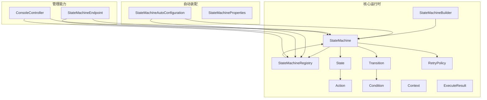
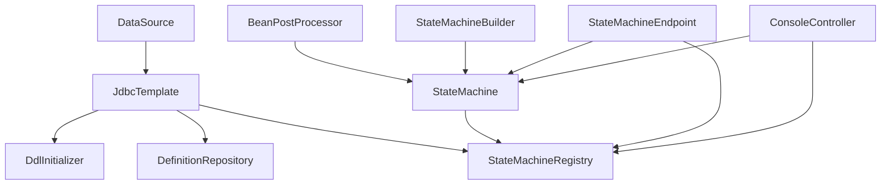
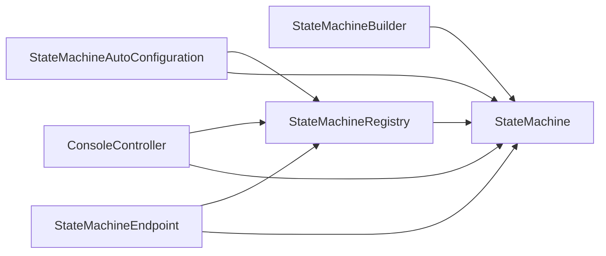

# API参考

<cite>
**本文引用的文件**
- [StateMachine.java](file://src/main/java/cn/chedejun/statemachine/core/StateMachine.java)
- [StateMachineBuilder.java](file://src/main/java/cn/chedejun/statemachine/core/StateMachineBuilder.java)
- [ConsoleController.java](file://src/main/java/cn/chedejun/statemachine/management/ConsoleController.java)
- [StateMachineEndpoint.java](file://src/main/java/cn/chedejun/statemachine/management/StateMachineEndpoint.java)
- [StateMachineRegistry.java](file://src/main/java/cn/chedejun/statemachine/core/StateMachineRegistry.java)
- [Action.java](file://src/main/java/cn/chedejun/statemachine/core/Action.java)
- [Condition.java](file://src/main/java/cn/chedejun/statemachine/core/Condition.java)
- [State.java](file://src/main/java/cn/chedejun/statemachine/core/State.java)
- [Transition.java](file://src/main/java/cn/chedejun/statemachine/core/Transition.java)
- [RetryPolicy.java](file://src/main/java/cn/chedejun/statemachine/core/RetryPolicy.java)
- [Context.java](file://src/main/java/cn/chedejun/statemachine/core/Context.java)
- [ExecuteResult.java](file://src/main/java/cn/chedejun/statemachine/core/ExecuteResult.java)
- [StateMachineAutoConfiguration.java](file://src/main/java/cn/chedejun/statemachine/autoconfigure/StateMachineAutoConfiguration.java)
- [StateMachineProperties.java](file://src/main/java/cn/chedejun/statemachine/autoconfigure/StateMachineProperties.java)
- [README.md](file://README.md)
</cite>

## 目录
1. [简介](#简介)
2. [项目结构](#项目结构)
3. [核心组件](#核心组件)
4. [架构总览](#架构总览)
5. [详细组件分析](#详细组件分析)
6. [依赖分析](#依赖分析)
7. [性能考虑](#性能考虑)
8. [故障排查指南](#故障排查指南)
9. [结论](#结论)
10. [附录](#附录)

## 简介
本文件为状态机启动器的完整API参考文档，覆盖核心类与管理端点的公共接口定义、参数说明、返回值、使用示例、异常与错误码、版本兼容性与废弃策略、最佳实践与注意事项。目标读者包括后端开发者、运维人员与集成工程师。

## 项目结构
- 核心运行时：状态机模型、构建器、注册表、动作与条件接口、重试策略、上下文与执行结果。
- 自动装配与配置：基于Spring Boot的自动配置、属性配置类。
- 管理能力：Actuator端点与Web控制台控制器，提供状态机清单、版本查询、实例查询、重试控制与可视化界面。

**图表来源**
- [StateMachine.java:11-196](file://src/main/java/cn/chedejun/statemachine/core/StateMachine.java#L11-L196)
- [StateMachineBuilder.java:8-53](file://src/main/java/cn/chedejun/statemachine/core/StateMachineBuilder.java#L8-L53)
- [StateMachineRegistry.java:9-73](file://src/main/java/cn/chedejun/statemachine/core/StateMachineRegistry.java#L9-L73)
- [Action.java:3-12](file://src/main/java/cn/chedejun/statemachine/core/Action.java#L3-L12)
- [Condition.java:3-7](file://src/main/java/cn/chedejun/statemachine/core/Condition.java#L3-L7)
- [State.java:3-16](file://src/main/java/cn/chedejun/statemachine/core/State.java#L3-L16)
- [Transition.java:3-20](file://src/main/java/cn/chedejun/statemachine/core/Transition.java#L3-L20)
- [RetryPolicy.java:5-45](file://src/main/java/cn/chedejun/statemachine/core/RetryPolicy.java#L5-L45)
- [Context.java:6-24](file://src/main/java/cn/chedejun/statemachine/core/Context.java#L6-L24)
- [ExecuteResult.java:14-23](file://src/main/java/cn/chedejun/statemachine/core/ExecuteResult.java#L14-L23)
- [StateMachineAutoConfiguration.java:22-80](file://src/main/java/cn/chedejun/statemachine/autoconfigure/StateMachineAutoConfiguration.java#L22-L80)
- [StateMachineProperties.java:5-35](file://src/main/java/cn/chedejun/statemachine/autoconfigure/StateMachineProperties.java#L5-L35)
- [StateMachineEndpoint.java:16-73](file://src/main/java/cn/chedejun/statemachine/management/StateMachineEndpoint.java#L16-L73)
- [ConsoleController.java:15-106](file://src/main/java/cn/chedejun/statemachine/management/ConsoleController.java#L15-L106)

**章节来源**
- [StateMachine.java:11-196](file://src/main/java/cn/chedejun/statemachine/core/StateMachine.java#L11-L196)
- [StateMachineBuilder.java:8-53](file://src/main/java/cn/chedejun/statemachine/core/StateMachineBuilder.java#L8-L53)
- [StateMachineAutoConfiguration.java:22-80](file://src/main/java/cn/chedejun/statemachine/autoconfigure/StateMachineAutoConfiguration.java#L22-L80)
- [StateMachineProperties.java:5-35](file://src/main/java/cn/chedejun/statemachine/autoconfigure/StateMachineProperties.java#L5-L35)
- [StateMachineEndpoint.java:16-73](file://src/main/java/cn/chedejun/statemachine/management/StateMachineEndpoint.java#L16-L73)
- [ConsoleController.java:15-106](file://src/main/java/cn/chedejun/statemachine/management/ConsoleController.java#L15-L106)

## 核心组件
本节对关键API进行分门别类的说明，包含方法签名、参数、返回值、异常与使用要点。

- StateMachine
  - 负责状态机执行、重试、持久化与状态推进。
  - 关键方法
    - execute(context)
      - 参数：context 上下文对象
      - 返回：ExecuteResult 执行结果
      - 异常：初始化缺失或状态异常抛出状态机异常
      - 示例路径：[README示例:42-49](file://README.md#L42-L49)
    - execute(context, targetState)
    - execute(context, startState, targetState)
    - retry(instanceId, context)
      - 仅允许对“FAILED”实例重试，需传入新上下文
    - retry(instanceId)
      - 仅允许对“FAILED”实例重试，自动从首个快照反序列化上下文
    - 访问器：getName, getVersion, getStates, getTransitions, getRetryPolicy
    - 注入器：setJdbcTemplate, setRegistry
  - 复杂度与行为
    - 单次执行最多迭代状态数×(最大尝试次数+1)+1，避免无限循环
    - 每个状态执行成功写入快照“SUCCESS”，失败按重试策略延迟重试
  - 错误与异常
    - 未初始化：抛出状态机异常
    - 状态不存在：抛出状态机异常（状态未找到）
    - 超过最大迭代：抛出状态机异常
    - 非FAILED实例重试：抛出状态机异常
  - 使用建议
    - 在构建阶段设置合适的重试策略
    - 对可能失败的外部调用在Action中捕获并记录，以便快照保留错误信息

- StateMachineBuilder
  - 构建状态机定义，支持链式配置
  - 关键方法
    - builder(name) 静态工厂
    - state(name, action) 添加状态
    - transition(from, to) / transition(from, to, condition) 添加转移
    - retryPolicy(policy) 设置重试策略
    - contextClass(clazz) 指定上下文类型
    - build() 生成StateMachine并注册到注册表
  - 版本号
    - 自动生成版本号“vN”，N为递增计数
  - 使用建议
    - 在Spring环境中，自动装配会注入JdbcTemplate与注册表，无需手动设置

- StateMachineRegistry
  - 维护状态机定义与实例元数据，负责序列化定义并持久化
  - 关键方法
    - register(machine) 注册并持久化定义
    - getLatest(name) 获取最新版本
    - getVersions(name) 获取指定名称的所有版本
    - getMachineNames() 获取已注册机器名集合
    - getAllDefinitions() 获取全部定义
  - 行为
    - 若定义已存在则不重复持久化
    - 将状态、转移、重试策略序列化为JSON保存

- Action 与 Condition
  - Action<C>：执行业务逻辑，结果通过上下文写入，自动记录快照
  - Condition<C>：测试条件，决定是否触发转移

- State 与 Transition
  - State：封装状态名与动作
  - Transition：封装from、to与条件

- RetryPolicy
  - 提供指数退避策略，可配置最大尝试次数、初始延迟、最大延迟与退避因子
  - 工厂与构建器：exponentialBackoff()、none()、Builder

- Context 与 ExecuteResult
  - Context：键值存储的上下文容器，支持类型安全读取
  - ExecuteResult：执行结果记录，包含实例ID、机器名、版本、当前状态、状态码、错误信息与创建时间

**章节来源**
- [StateMachine.java:37-196](file://src/main/java/cn/chedejun/statemachine/core/StateMachine.java#L37-L196)
- [StateMachineBuilder.java:20-53](file://src/main/java/cn/chedejun/statemachine/core/StateMachineBuilder.java#L20-L53)
- [StateMachineRegistry.java:20-73](file://src/main/java/cn/chedejun/statemachine/core/StateMachineRegistry.java#L20-L73)
- [Action.java:3-12](file://src/main/java/cn/chedejun/statemachine/core/Action.java#L3-L12)
- [Condition.java:3-7](file://src/main/java/cn/chedejun/statemachine/core/Condition.java#L3-L7)
- [State.java:3-16](file://src/main/java/cn/chedejun/statemachine/core/State.java#L3-L16)
- [Transition.java:3-20](file://src/main/java/cn/chedejun/statemachine/core/Transition.java#L3-L20)
- [RetryPolicy.java:5-45](file://src/main/java/cn/chedejun/statemachine/core/RetryPolicy.java#L5-L45)
- [Context.java:6-24](file://src/main/java/cn/chedejun/statemachine/core/Context.java#L6-L24)
- [ExecuteResult.java:14-23](file://src/main/java/cn/chedejun/statemachine/core/ExecuteResult.java#L14-L23)

## 架构总览
状态机启动器通过自动配置在Spring容器中完成DDL初始化、定义仓库、注册表与Bean后处理器装配。状态机Bean在后处理阶段被注入Jdbc模板与注册表，并自动注册到注册表。管理端点与控制台控制器依赖注册表与Jdbc模板提供查询与重试能力。

**图表来源**
- [StateMachineAutoConfiguration.java:26-80](file://src/main/java/cn/chedejun/statemachine/autoconfigure/StateMachineAutoConfiguration.java#L26-L80)
- [StateMachineRegistry.java:9-73](file://src/main/java/cn/chedejun/statemachine/core/StateMachineRegistry.java#L9-L73)
- [StateMachineBuilder.java:8-53](file://src/main/java/cn/chedejun/statemachine/core/StateMachineBuilder.java#L8-L53)
- [StateMachine.java:11-196](file://src/main/java/cn/chedejun/statemachine/core/StateMachine.java#L11-L196)
- [StateMachineEndpoint.java:16-73](file://src/main/java/cn/chedejun/statemachine/management/StateMachineEndpoint.java#L16-L73)
- [ConsoleController.java:15-106](file://src/main/java/cn/chedejun/statemachine/management/ConsoleController.java#L15-L106)

**章节来源**
- [StateMachineAutoConfiguration.java:26-80](file://src/main/java/cn/chedejun/statemachine/autoconfigure/StateMachineAutoConfiguration.java#L26-L80)

## 详细组件分析

### StateMachine 类API
- 方法清单与说明
  - execute(context)
    - 描述：执行状态机，从首个状态开始，直至无后续状态或达到目标状态
    - 参数：context 上下文
    - 返回：ExecuteResult
    - 异常：未初始化、状态不存在、超限
  - execute(context, targetState)
  - execute(context, startState, targetState)
  - retry(instanceId, context)
    - 描述：对失败实例重试，需提供新上下文
    - 参数：instanceId 实例ID；context 新上下文
    - 返回：无
    - 异常：实例不存在、非FAILED状态
  - retry(instanceId)
    - 描述：对失败实例重试，自动从首个快照读取上下文
    - 参数：instanceId 实例ID
    - 返回：无
    - 异常：同上
  - 访问器与注入器
    - getName(), getVersion(), getStates(), getTransitions(), getRetryPolicy()
    - setJdbcTemplate(jdbcTemplate), setRegistry(registry)

- 使用示例
  - 定义与执行：参见[README示例:19-49](file://README.md#L19-L49)

- 最佳实践
  - 在Action中对可恢复异常进行捕获并记录，便于快照保留错误信息
  - 合理设置重试策略，避免过长阻塞

**章节来源**
- [StateMachine.java:37-196](file://src/main/java/cn/chedejun/statemachine/core/StateMachine.java#L37-L196)
- [README.md:19-49](file://README.md#L19-L49)

### StateMachineBuilder 类API
- 方法清单与说明
  - builder(name) 静态工厂
  - state(name, action) 添加状态
  - transition(from, to) / transition(from, to, condition) 添加转移
  - retryPolicy(policy) 设置重试策略
  - contextClass(clazz) 指定上下文类型
  - build() 生成StateMachine并注册到注册表

- 版本号规则
  - 自动生成“vN”版本号，N为全局递增计数

- 最佳实践
  - 在Spring环境中无需手动设置JdbcTemplate与注册表，自动装配会完成注入

**章节来源**
- [StateMachineBuilder.java:20-53](file://src/main/java/cn/chedejun/statemachine/core/StateMachineBuilder.java#L20-L53)

### StateMachineRegistry 类API
- 方法清单与说明
  - register(machine) 注册并持久化定义
  - getLatest(name) 获取最新版本
  - getVersions(name) 获取指定名称的所有版本
  - getMachineNames() 获取已注册机器名集合
  - getAllDefinitions() 获取全部定义

- 数据持久化
  - 将状态、转移、重试策略序列化为JSON保存至定义仓库

**章节来源**
- [StateMachineRegistry.java:20-73](file://src/main/java/cn/chedejun/statemachine/core/StateMachineRegistry.java#L20-L73)

### ConsoleController 类API
- 控制台入口
  - GET /statemachine
  - GET /statemachine/ 重定向至静态首页

- 接口清单
  - GET /statemachine/api/machines
    - 返回：机器清单（名称、版本数量、运行中实例数、失败实例数）
  - GET /statemachine/api/machines/{name}/versions
    - 返回：指定机器的所有版本定义（包含状态、转移、重试策略）
  - GET /statemachine/api/machines/{name}/instances
    - 查询参数：status（可选）、page（默认0）、size（默认20）
    - 返回：实例列表与总数、页码、大小
  - GET /statemachine/api/instances/{id}
    - 返回：实例详情与快照列表
  - POST /statemachine/api/instances/{id}/retry
    - 返回：重试执行结果消息或错误提示

- 最佳实践
  - 使用分页查询大规模实例列表
  - 通过状态筛选快速定位问题实例

**章节来源**
- [ConsoleController.java:19-106](file://src/main/java/cn/chedejun/statemachine/management/ConsoleController.java#L19-L106)

### StateMachineEndpoint 类API
- Actuator端点
  - 端点ID：state-machines

- 接口清单
  - GET /actuator/state-machines
    - 返回：机器清单（名称、版本数量、运行中实例数、失败实例数）
  - GET /actuator/state-machines/{name}
    - 返回：指定机器的所有版本定义
  - POST /actuator/state-machines/{name}/{instanceId}
    - 描述：将失败实例重置为RUNNING，随后需调用状态机的retry方法重新执行
    - 返回：操作结果消息

- 最佳实践
  - 与ConsoleController配合使用，统一管理状态机实例与重试

**章节来源**
- [StateMachineEndpoint.java:16-73](file://src/main/java/cn/chedejun/statemachine/management/StateMachineEndpoint.java#L16-L73)

### 辅助类型与接口
- Action<C>
  - 函数式接口，执行业务逻辑，结果通过上下文写入
- Condition<C>
  - 函数式接口，测试条件以决定转移
- State<C>
  - 封装状态名与动作
- Transition<C>
  - 封装from、to与条件
- RetryPolicy
  - 指数退避策略，支持构建器配置
- Context
  - 上下文容器，支持类型安全读取
- ExecuteResult
  - 执行结果记录

**章节来源**
- [Action.java:3-12](file://src/main/java/cn/chedejun/statemachine/core/Action.java#L3-L12)
- [Condition.java:3-7](file://src/main/java/cn/chedejun/statemachine/core/Condition.java#L3-L7)
- [State.java:3-16](file://src/main/java/cn/chedejun/statemachine/core/State.java#L3-L16)
- [Transition.java:3-20](file://src/main/java/cn/chedejun/statemachine/core/Transition.java#L3-L20)
- [RetryPolicy.java:5-45](file://src/main/java/cn/chedejun/statemachine/core/RetryPolicy.java#L5-L45)
- [Context.java:6-24](file://src/main/java/cn/chedejun/statemachine/core/Context.java#L6-L24)
- [ExecuteResult.java:14-23](file://src/main/java/cn/chedejun/statemachine/core/ExecuteResult.java#L14-L23)

## 依赖分析
- 组件耦合
  - StateMachine 依赖注册表、JdbcTemplate、ObjectMapper、实例与快照仓库
  - StateMachineBuilder 依赖注册表与JdbcTemplate（自动装配时注入）
  - ConsoleController 与 StateMachineEndpoint 依赖注册表与Jdbc模板
  - 自动配置通过BeanPostProcessor向StateMachine注入依赖并注册
- 外部依赖
  - Spring JDBC、Spring Boot Actuator、Jackson

**图表来源**
- [StateMachineAutoConfiguration.java:44-56](file://src/main/java/cn/chedejun/statemachine/autoconfigure/StateMachineAutoConfiguration.java#L44-L56)
- [StateMachineRegistry.java:9-73](file://src/main/java/cn/chedejun/statemachine/core/StateMachineRegistry.java#L9-L73)
- [ConsoleController.java:15-106](file://src/main/java/cn/chedejun/statemachine/management/ConsoleController.java#L15-L106)
- [StateMachineEndpoint.java:16-73](file://src/main/java/cn/chedejun/statemachine/management/StateMachineEndpoint.java#L16-L73)

**章节来源**
- [StateMachineAutoConfiguration.java:44-56](file://src/main/java/cn/chedejun/statemachine/autoconfigure/StateMachineAutoConfiguration.java#L44-L56)

## 性能考虑
- 执行复杂度
  - 单次执行最多迭代上限由状态数与重试次数决定，避免无限循环
- 序列化开销
  - 上下文与定义采用JSON序列化，建议保持上下文精简
- 并发与一致性
  - 注册表内部使用并发映射，注册与查询为O(1)平均复杂度
- I/O优化
  - 使用JdbcTemplate批量查询与更新，建议结合分页与索引优化

[本节为通用指导，无需特定文件来源]

## 故障排查指南
- 常见异常与错误码
  - 未初始化：状态机未注入Jdbc模板或注册表，抛出状态机异常
  - 状态未找到：执行过程中找不到对应状态，抛出状态机异常
  - 超过最大迭代：执行超过预设上限，抛出状态机异常
  - 非FAILED实例重试：仅允许对FAILED实例重试，否则抛出状态机异常
- 控制台与端点
  - 通过ConsoleController与StateMachineEndpoint查看实例状态、快照与重试
  - 使用GET /actuator/state-machines/{name}/{instanceId}将失败实例重置为RUNNING，再调用状态机retry方法

**章节来源**
- [StateMachine.java:83-136](file://src/main/java/cn/chedejun/statemachine/core/StateMachine.java#L83-L136)
- [ConsoleController.java:91-104](file://src/main/java/cn/chedejun/statemachine/management/ConsoleController.java#L91-L104)
- [StateMachineEndpoint.java:62-71](file://src/main/java/cn/chedejun/statemachine/management/StateMachineEndpoint.java#L62-L71)

## 结论
该状态机启动器提供从定义、执行、持久化到管理的完整能力，具备良好的扩展性与可观测性。通过合理的重试策略与上下文设计，可在生产环境稳定运行。建议在集成时遵循本文的最佳实践与注意事项，确保系统的可靠性与可维护性。

[本节为总结，无需特定文件来源]

## 附录

### 版本兼容性与废弃策略
- 版本号
  - 状态机版本自动生成“vN”，N为全局递增计数
- 兼容性
  - 默认启用管理端点与控制台，可通过配置开关禁用
- 废弃策略
  - 当前版本未声明废弃API；未来版本如需变更，将在发布说明中明确

**章节来源**
- [StateMachineBuilder.java:40-51](file://src/main/java/cn/chedejun/statemachine/core/StateMachineBuilder.java#L40-L51)
- [StateMachineProperties.java:5-35](file://src/main/java/cn/chedejun/statemachine/autoconfigure/StateMachineProperties.java#L5-L35)

### 配置项参考
- state-machine.ddl-auto：DDL初始化策略，默认“update”
- state-machine.management.enabled：是否启用管理端点，默认true
- state-machine.console.enabled：是否启用控制台，默认true
- state-machine.retry.*：默认重试策略参数（最大尝试次数、初始延迟、最大延迟、退避因子）

**章节来源**
- [StateMachineProperties.java:7-35](file://src/main/java/cn/chedejun/statemachine/autoconfigure/StateMachineProperties.java#L7-L35)

### 使用示例路径
- 定义与执行：[README示例:19-49](file://README.md#L19-L49)
- 控制台访问：[README控制台说明:51-54](file://README.md#L51-L54)

**章节来源**
- [README.md:19-54](file://README.md#L19-L54)