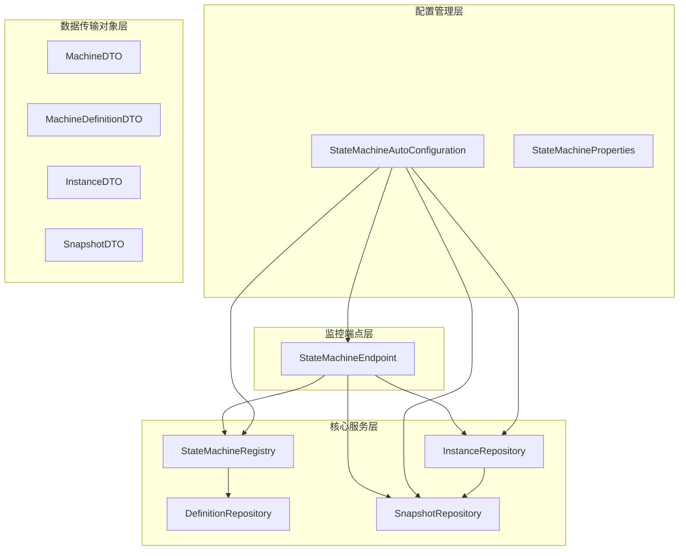
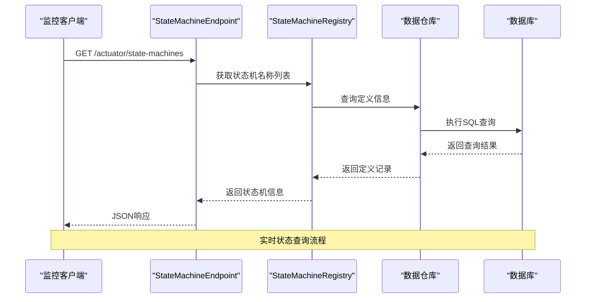
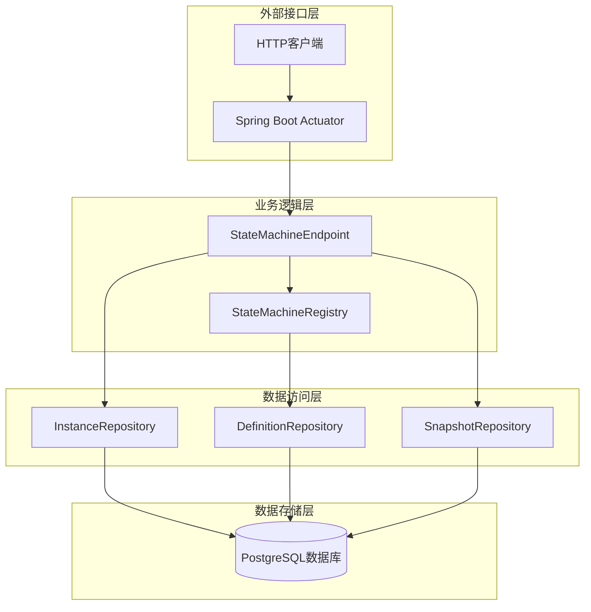
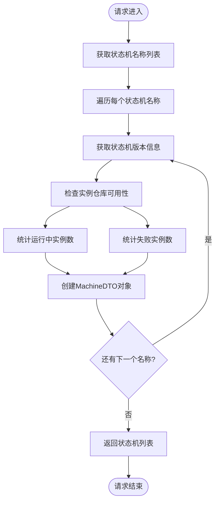
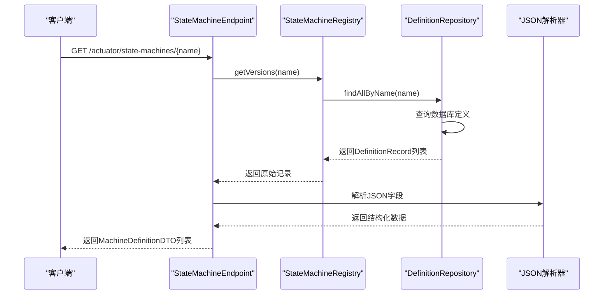
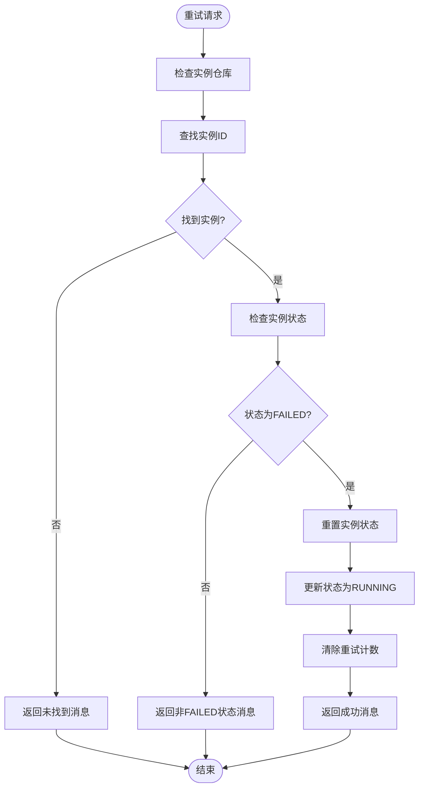
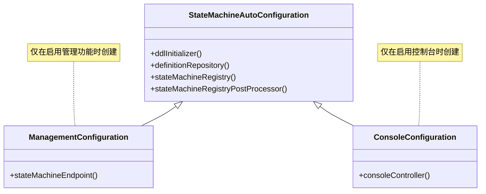
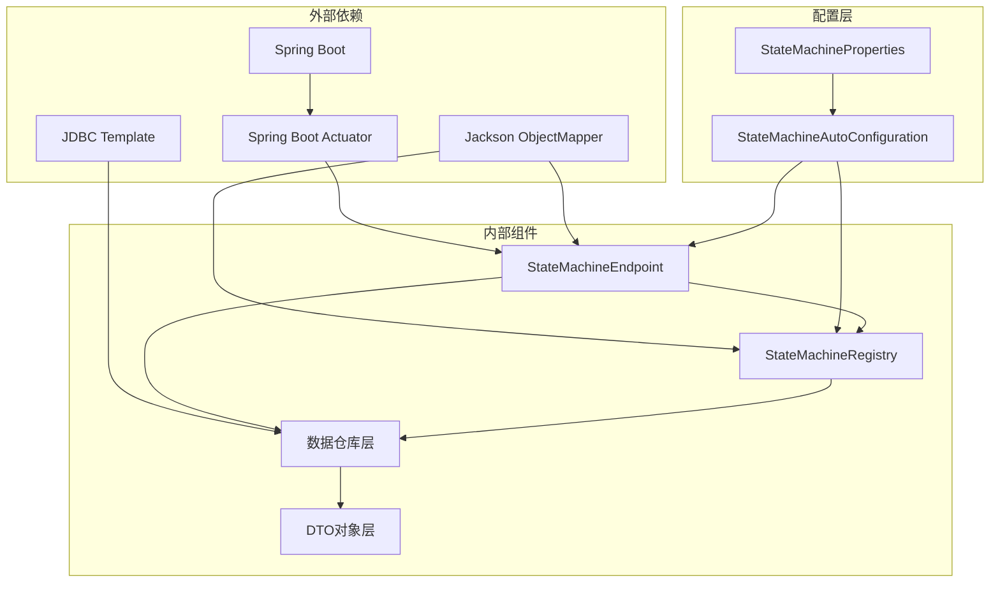

# Actuator监控API

<cite>
**本文档引用的文件**
- [StateMachineEndpoint.java](file://src/main/java/cn/chedejun/statemachine/management/StateMachineEndpoint.java)
- [StateMachineAutoConfiguration.java](file://src/main/java/cn/chedejun/statemachine/autoconfigure/StateMachineAutoConfiguration.java)
- [StateMachineProperties.java](file://src/main/java/cn/chedejun/statemachine/autoconfigure/StateMachineProperties.java)
- [StateMachineRegistry.java](file://src/main/java/cn/chedejun/statemachine/core/StateMachineRegistry.java)
- [InstanceRepository.java](file://src/main/java/cn/chedejun/statemachine/persistence/InstanceRepository.java)
- [DefinitionRepository.java](file://src/main/java/cn/chedejun/statemachine/persistence/DefinitionRepository.java)
- [SnapshotRepository.java](file://src/main/java/cn/chedejun/statemachine/persistence/SnapshotRepository.java)
- [MachineDTO.java](file://src/main/java/cn/chedejun/statemachine/management/dto/MachineDTO.java)
- [MachineDefinitionDTO.java](file://src/main/java/cn/chedejun/statemachine/management/dto/MachineDefinitionDTO.java)
- [InstanceDTO.java](file://src/main/java/cn/chedejun/statemachine/management/dto/InstanceDTO.java)
- [SnapshotDTO.java](file://src/main/java/cn/chedejun/statemachine/management/dto/SnapshotDTO.java)
- [application.yml](file://demo/src/main/resources/application.yml)
- [README.md](file://README.md)
</cite>

## 目录
1. [简介](#简介)
2. [项目结构](#项目结构)
3. [核心组件](#核心组件)
4. [架构概览](#架构概览)
5. [详细组件分析](#详细组件分析)
6. [依赖关系分析](#依赖关系分析)
7. [性能考虑](#性能考虑)
8. [故障排除指南](#故障排除指南)
9. [结论](#结论)
10. [附录](#附录)

## 简介

Actuator监控API是Spring Boot状态机扩展项目中的核心监控功能模块。该模块提供了完整的状态机生命周期监控能力，包括状态机健康检查、实例状态查询、统计信息获取等功能。通过Spring Boot Actuator端点，用户可以实时监控状态机实例的运行状态、执行统计和性能指标。

本监控API基于Spring Boot Actuator框架构建，使用自定义的`@Endpoint`注解创建了名为`state-machines`的监控端点。该端点提供了对状态机注册表、实例管理和定义存储的全面访问能力。

## 项目结构

状态机监控系统采用分层架构设计，主要包含以下核心模块：

**图表来源**
- [StateMachineEndpoint.java:16-73](file://src/main/java/cn/chedejun/statemachine/management/StateMachineEndpoint.java#L16-L73)
- [StateMachineAutoConfiguration.java:26-80](file://src/main/java/cn/chedejun/statemachine/autoconfigure/StateMachineAutoConfiguration.java#L26-L80)

**章节来源**
- [StateMachineEndpoint.java:1-73](file://src/main/java/cn/chedejun/statemachine/management/StateMachineEndpoint.java#L1-L73)
- [StateMachineAutoConfiguration.java:1-80](file://src/main/java/cn/chedejun/statemachine/autoconfigure/StateMachineAutoConfiguration.java#L1-L80)

## 核心组件

### 状态机监控端点

`StateMachineEndpoint`是监控系统的核心组件，它实现了Spring Boot Actuator的`@Endpoint`注解，提供了以下主要功能：

- **状态机列表查询**：获取所有已注册状态机的基本信息
- **状态机版本查询**：获取指定状态机的所有版本定义
- **实例重试操作**：对失败的状态机实例进行重试处理

### 数据传输对象

系统使用多个DTO类来标准化监控数据的传输格式：

- **MachineDTO**：状态机基本信息（名称、版本数量、运行实例数、失败实例数）
- **MachineDefinitionDTO**：状态机定义详情（状态列表、转换规则、重试策略）
- **InstanceDTO**：状态机实例信息（实例ID、当前状态、错误信息等）
- **SnapshotDTO**：执行快照信息（状态执行详情、输入输出、执行结果）

**章节来源**
- [MachineDTO.java:1-3](file://src/main/java/cn/chedejun/statemachine/management/dto/MachineDTO.java#L1-L3)
- [MachineDefinitionDTO.java:1-8](file://src/main/java/cn/chedejun/statemachine/management/dto/MachineDefinitionDTO.java#L1-L8)
- [InstanceDTO.java:1-6](file://src/main/java/cn/chedejun/statemachine/management/dto/InstanceDTO.java#L1-L6)
- [SnapshotDTO.java:1-5](file://src/main/java/cn/chedejun/statemachine/management/dto/SnapshotDTO.java#L1-L5)

## 架构概览

监控系统采用分层架构，确保了良好的可维护性和扩展性：

**图表来源**
- [StateMachineEndpoint.java:32-43](file://src/main/java/cn/chedejun/statemachine/management/StateMachineEndpoint.java#L32-L43)
- [StateMachineRegistry.java:57-65](file://src/main/java/cn/chedejun/statemachine/core/StateMachineRegistry.java#L57-L65)

### 系统架构图

**图表来源**
- [StateMachineAutoConfiguration.java:58-68](file://src/main/java/cn/chedejun/statemachine/autoconfigure/StateMachineAutoConfiguration.java#L58-L68)
- [StateMachineEndpoint.java:18-30](file://src/main/java/cn/chedejun/statemachine/management/StateMachineEndpoint.java#L18-L30)

## 详细组件分析

### 状态机监控端点实现

`StateMachineEndpoint`类实现了三个主要的监控操作：

#### 1. 状态机列表查询

**图表来源**
- [StateMachineEndpoint.java:32-43](file://src/main/java/cn/chedejun/statemachine/management/StateMachineEndpoint.java#L32-L43)

#### 2. 状态机版本查询

该功能用于获取指定状态机的所有版本定义，包括状态列表、转换规则和重试策略：

**图表来源**
- [StateMachineEndpoint.java:45-60](file://src/main/java/cn/chedejun/statemachine/management/StateMachineEndpoint.java#L45-L60)
- [StateMachineRegistry.java:63-65](file://src/main/java/cn/chedejun/statemachine/core/StateMachineRegistry.java#L63-L65)

#### 3. 实例重试操作

该功能允许对失败的状态机实例进行重试处理：

**图表来源**
- [StateMachineEndpoint.java:62-71](file://src/main/java/cn/chedejun/statemachine/management/StateMachineEndpoint.java#L62-L71)

**章节来源**
- [StateMachineEndpoint.java:16-73](file://src/main/java/cn/chedejun/statemachine/management/StateMachineEndpoint.java#L16-L73)

### 自动配置机制

系统通过`StateMachineAutoConfiguration`类实现了智能的自动配置：

**图表来源**
- [StateMachineAutoConfiguration.java:58-79](file://src/main/java/cn/chedejun/statemachine/autoconfigure/StateMachineAutoConfiguration.java#L58-L79)

**章节来源**
- [StateMachineAutoConfiguration.java:26-80](file://src/main/java/cn/chedejun/statemachine/autoconfigure/StateMachineAutoConfiguration.java#L26-L80)

### 数据持久化层

系统使用四个核心仓库类来管理不同类型的数据：

#### 实例仓库 (`InstanceRepository`)

负责状态机实例的生命周期管理：
- 创建新实例
- 更新实例状态
- 统计实例数量
- 查询实例历史

#### 定义仓库 (`DefinitionRepository`)

管理状态机定义的持久化：
- 存储状态机定义
- 按名称和版本查询
- 管理状态和转换信息

#### 快照仓库 (`SnapshotRepository`)

记录状态机执行的详细快照：
- 保存状态执行详情
- 追踪输入输出
- 记录执行结果和错误信息

**章节来源**
- [InstanceRepository.java:1-66](file://src/main/java/cn/chedejun/statemachine/persistence/InstanceRepository.java#L1-L66)
- [DefinitionRepository.java:1-78](file://src/main/java/cn/chedejun/statemachine/persistence/DefinitionRepository.java#L1-L78)
- [SnapshotRepository.java:1-55](file://src/main/java/cn/chedejun/statemachine/persistence/SnapshotRepository.java#L1-L55)

## 依赖关系分析

### 组件依赖图

**图表来源**
- [StateMachineEndpoint.java:3-14](file://src/main/java/cn/chedejun/statemachine/management/StateMachineEndpoint.java#L3-L14)
- [StateMachineAutoConfiguration.java:3-21](file://src/main/java/cn/chedejun/statemachine/autoconfigure/StateMachineAutoConfiguration.java#L3-L21)

### 关键依赖关系

1. **Spring Boot Actuator集成**：通过`@Endpoint`注解实现监控端点
2. **JDBC数据访问**：使用`JdbcTemplate`进行数据库操作
3. **JSON序列化**：使用`ObjectMapper`处理状态机定义的JSON存储
4. **自动配置机制**：根据条件注解动态启用功能

**章节来源**
- [StateMachineEndpoint.java:9-30](file://src/main/java/cn/chedejun/statemachine/management/StateMachineEndpoint.java#L9-L30)
- [StateMachineAutoConfiguration.java:58-68](file://src/main/java/cn/chedejun/statemachine/autoconfigure/StateMachineAutoConfiguration.java#L58-L68)

## 性能考虑

### 查询优化策略

1. **索引优化**：在状态机实例表上建立适当的索引以提高查询性能
2. **批量操作**：对于大量状态机的查询，考虑使用分页机制
3. **缓存策略**：可以考虑缓存常用的状态机定义信息
4. **连接池管理**：合理配置数据库连接池参数

### 监控指标建议

1. **响应时间**：监控各个端点的平均响应时间
2. **错误率**：跟踪查询失败的频率
3. **并发度**：监控同时进行的查询数量
4. **数据库负载**：监控数据库的查询压力

## 故障排除指南

### 常见问题及解决方案

#### 1. 监控端点不可用

**症状**：访问`/actuator/state-machines`返回404错误

**可能原因**：
- Spring Boot Actuator未正确配置
- 管理功能被禁用
- 数据源未配置

**解决方法**：
- 检查`application.yml`中的暴露配置
- 确认`state-machine.management.enabled=true`
- 验证数据库连接配置

#### 2. 实例仓库不可用

**症状**：重试操作返回"Instance repository not available"

**可能原因**：
- 数据库连接失败
- 表结构未初始化
- 权限不足

**解决方法**：
- 检查数据库连接字符串
- 确认DDL初始化设置
- 验证数据库权限

#### 3. JSON解析错误

**症状**：状态机定义查询返回空列表或解析异常

**可能原因**：
- 数据库中存储的JSON格式不正确
- 序列化/反序列化过程出错

**解决方法**：
- 检查数据库中的JSON字段格式
- 验证状态机定义的序列化过程

**章节来源**
- [application.yml:18-23](file://demo/src/main/resources/application.yml#L18-L23)
- [StateMachineEndpoint.java:62-71](file://src/main/java/cn/chedejun/statemachine/management/StateMachineEndpoint.java#L62-L71)

## 结论

Actuator监控API为Spring Boot状态机扩展提供了完整的监控解决方案。通过精心设计的架构和清晰的职责分离，该系统能够有效地监控状态机的运行状态、执行统计和性能指标。

主要优势包括：
- **完整的监控覆盖**：从状态机定义到实例执行的全生命周期监控
- **灵活的配置**：支持按需启用管理功能
- **标准化的数据格式**：使用DTO对象确保数据传输的一致性
- **易于集成**：遵循Spring Boot Actuator标准，便于与其他监控系统集成

## 附录

### API参考文档

#### 端点配置

| 配置项 | 默认值 | 描述 |
|--------|--------|------|
| `state-machine.management.enabled` | `true` | 启用状态机管理功能 |
| `management.endpoints.web.exposure.include` | `health` | 暴露的Actuator端点 |

#### 端点URL模式

- **GET** `/actuator/state-machines` - 获取所有状态机列表
- **GET** `/actuator/state-machines/{name}` - 获取指定状态机的版本列表
- **POST** `/actuator/state-machines/{name}/{instanceId}` - 重试失败的实例

#### 响应格式

所有响应均采用JSON格式，包含以下标准字段：
- `timestamp`: 响应时间戳
- `status`: HTTP状态码
- `error`: 错误信息（如有）
- `message`: 业务消息
- `path`: 请求路径

**章节来源**
- [application.yml:18-23](file://demo/src/main/resources/application.yml#L18-L23)
- [README.md:55-65](file://README.md#L55-L65)