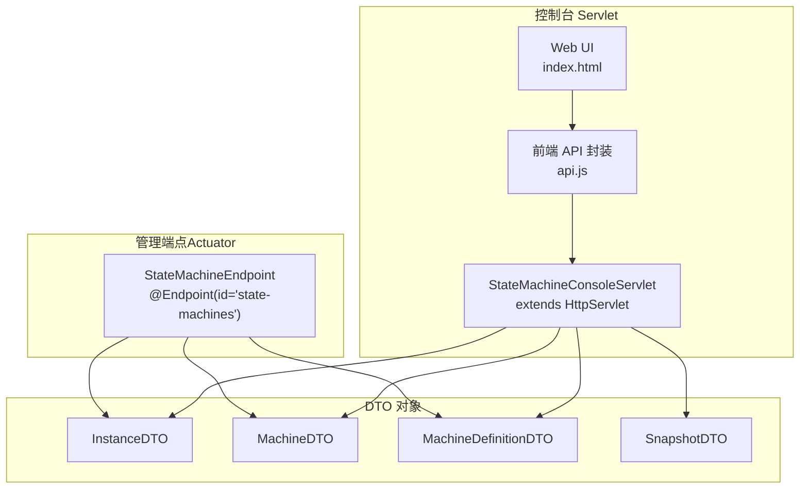
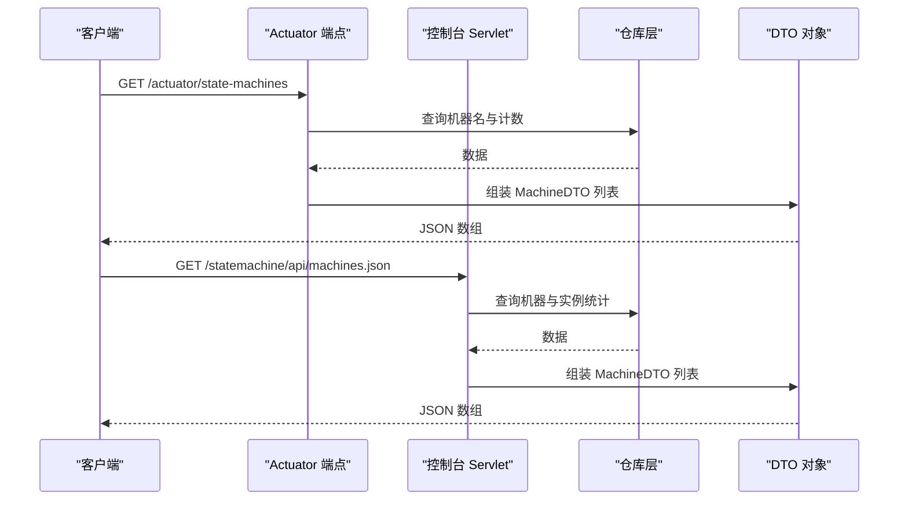
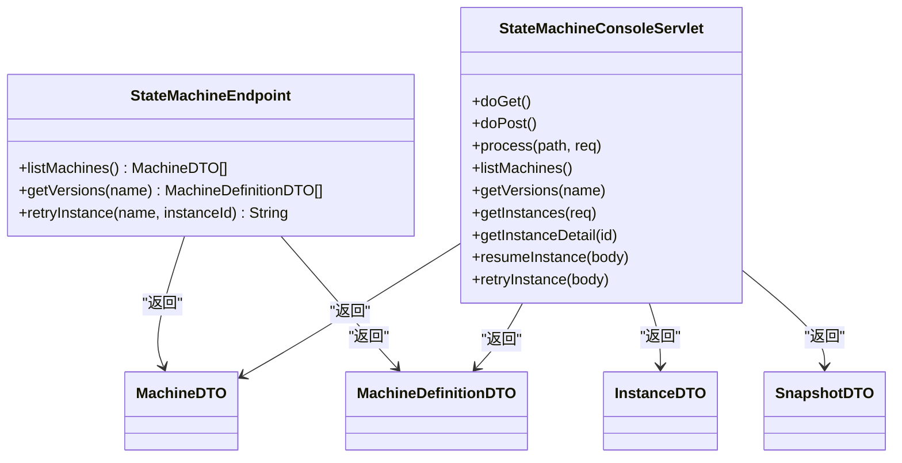

# REST API

<cite>
**本文档引用的文件**
- [StateMachineEndpoint.java](file://state-machine-boot-starter/src/main/java/cn/chedejun/statemachine/management/StateMachineEndpoint.java)
- [StateMachineConsoleServlet.java](file://state-machine-boot-starter/src/main/java/cn/chedejun/statemachine/management/StateMachineConsoleServlet.java)
- [InstanceDTO.java](file://state-machine-boot-starter/src/main/java/cn/chedejun/statemachine/management/dto/InstanceDTO.java)
- [MachineDTO.java](file://state-machine-boot-starter/src/main/java/cn/chedejun/statemachine/management/dto/MachineDTO.java)
- [MachineDefinitionDTO.java](file://state-machine-boot-starter/src/main/java/cn/chedejun/statemachine/management/dto/MachineDefinitionDTO.java)
- [SnapshotDTO.java](file://state-machine-boot-starter/src/main/java/cn/chedejun/statemachine/management/dto/SnapshotDTO.java)
- [InstanceStatus.java](file://state-machine-boot-starter/src/main/java/cn/chedejun/statemachine/domain/shared/InstanceStatus.java)
- [ExecutionStatus.java](file://state-machine-boot-starter/src/main/java/cn/chedejun/statemachine/domain/shared/ExecutionStatus.java)
- [StateMachineAutoConfiguration.java](file://state-machine-boot-starter/src/main/java/cn/chedejun/statemachine/autoconfigure/StateMachineAutoConfiguration.java)
- [application.yml](file://state-machine-boot-starter/src/test/resources/application.yml)
- [api.js](file://state-machine-boot-starter/src/main/resources/console/js/api.js)
- [index.html](file://state-machine-boot-starter/src/main/resources/console/index.html)
</cite>

## 目录
1. [简介](#简介)
2. [项目结构](#项目结构)
3. [核心组件](#核心组件)
4. [架构总览](#架构总览)
5. [详细组件分析](#详细组件分析)
6. [依赖关系分析](#依赖关系分析)
7. [性能考量](#性能考量)
8. [故障排查指南](#故障排查指南)
9. [结论](#结论)
10. [附录](#附录)

## 简介
本文件面向使用者与集成者，系统化梳理状态机管理相关的 REST API，覆盖 Actuator 端点与控制台 Servlet 提供的 HTTP 接口，详述各端点的 URL 模式、HTTP 方法、请求参数、响应格式与状态码；同时解释 InstanceDTO、MachineDTO、MachineDefinitionDTO、SnapshotDTO 等 DTO 的 JSON 结构与字段语义，并提供 curl 与 Postman 示例、安全与版本策略建议。

## 项目结构
- 管理端点（Actuator）：通过 @Endpoint(id="state-machines") 暴露只读查询能力，适合与 Spring Boot Actuator 集成。
- 控制台 Servlet：原生 HttpServlet 实现，提供 Web UI 与一组扁平化的 .json API，无需依赖 Spring MVC。
- DTO 层：用于序列化返回数据，统一对外输出结构。

图表来源
- [StateMachineEndpoint.java:22-79](file://state-machine-boot-starter/src/main/java/cn/chedejun/statemachine/management/StateMachineEndpoint.java#L22-L79)
- [StateMachineConsoleServlet.java:39-420](file://state-machine-boot-starter/src/main/java/cn/chedejun/statemachine/management/StateMachineConsoleServlet.java#L39-L420)
- [InstanceDTO.java:7-55](file://state-machine-boot-starter/src/main/java/cn/chedejun/statemachine/management/dto/InstanceDTO.java#L7-L55)
- [MachineDTO.java:6-34](file://state-machine-boot-starter/src/main/java/cn/chedejun/statemachine/management/dto/MachineDTO.java#L6-L34)
- [MachineDefinitionDTO.java:9-49](file://state-machine-boot-starter/src/main/java/cn/chedejun/statemachine/management/dto/MachineDefinitionDTO.java#L9-L49)
- [SnapshotDTO.java:7-52](file://state-machine-boot-starter/src/main/java/cn/chedejun/statemachine/management/dto/SnapshotDTO.java#L7-L52)

章节来源
- [StateMachineEndpoint.java:22-79](file://state-machine-boot-starter/src/main/java/cn/chedejun/statemachine/management/StateMachineEndpoint.java#L22-L79)
- [StateMachineConsoleServlet.java:39-420](file://state-machine-boot-starter/src/main/java/cn/chedejun/statemachine/management/StateMachineConsoleServlet.java#L39-L420)

## 核心组件
- StateMachineEndpoint：基于 Spring Boot Actuator 的只读端点，提供机器清单与定义版本查询，以及实例重试提示。
- StateMachineConsoleServlet：原生 Servlet，提供 Web UI 与一组 .json API，支持实例查询、详情、重试、恢复等操作。
- DTO：标准化输出结构，便于前后端契约稳定。

章节来源
- [StateMachineEndpoint.java:22-79](file://state-machine-boot-starter/src/main/java/cn/chedejun/statemachine/management/StateMachineEndpoint.java#L22-L79)
- [StateMachineConsoleServlet.java:39-420](file://state-machine-boot-starter/src/main/java/cn/chedejun/statemachine/management/StateMachineConsoleServlet.java#L39-L420)
- [InstanceDTO.java:7-55](file://state-machine-boot-starter/src/main/java/cn/chedejun/statemachine/management/dto/InstanceDTO.java#L7-L55)
- [MachineDTO.java:6-34](file://state-machine-boot-starter/src/main/java/cn/chedejun/statemachine/management/dto/MachineDTO.java#L6-L34)
- [MachineDefinitionDTO.java:9-49](file://state-machine-boot-starter/src/main/java/cn/chedejun/statemachine/management/dto/MachineDefinitionDTO.java#L9-L49)
- [SnapshotDTO.java:7-52](file://state-machine-boot-starter/src/main/java/cn/chedejun/statemachine/management/dto/SnapshotDTO.java#L7-L52)

## 架构总览
- Actuator 端点：通过 @Endpoint 暴露，适合与 Actuator 集成，仅提供只读查询。
- 控制台 Servlet：独立于 Spring MVC，通过 ServletRegistrationBean 注册，提供 Web UI 与 API。
- 自动装配：根据配置开关启用管理端点与控制台。

图表来源
- [StateMachineEndpoint.java:40-51](file://state-machine-boot-starter/src/main/java/cn/chedejun/statemachine/management/StateMachineEndpoint.java#L40-L51)
- [StateMachineConsoleServlet.java:113-116](file://state-machine-boot-starter/src/main/java/cn/chedejun/statemachine/management/StateMachineConsoleServlet.java#L113-L116)

章节来源
- [StateMachineAutoConfiguration.java:111-147](file://state-machine-boot-starter/src/main/java/cn/chedejun/statemachine/autoconfigure/StateMachineAutoConfiguration.java#L111-L147)

## 详细组件分析

### Actuator 端点：/actuator/state-machines
- 端点 ID：state-machines
- 启用条件：当存在 Actuator 且配置 state-machine.management.enabled=true 时启用
- 访问方式：通过 Actuator 管理端点访问

1) GET /actuator/state-machines
- 功能：列出所有已注册状态机的基本信息（名称、版本数量、运行中/失败实例计数）
- 返回：数组，元素为 MachineDTO
- 状态码：200 成功；若未启用或无数据则为空数组

2) GET /actuator/state-machines/{name}
- 功能：查询指定状态机的所有定义版本（含状态、转换、重试策略）
- 路径参数：name（状态机名称）
- 返回：数组，元素为 MachineDefinitionDTO
- 状态码：200 成功；解析失败时返回空列表

3) POST /actuator/state-machines/{name}/{instanceId}
- 功能：提示重试实例（非执行）。若实例存在且状态为 FAILED，则返回提示信息
- 路径参数：name（状态机名称）、instanceId（实例 ID）
- 返回：字符串提示
- 状态码：200 成功；实例不存在或状态不为 FAILED 时返回相应提示

章节来源
- [StateMachineEndpoint.java:40-79](file://state-machine-boot-starter/src/main/java/cn/chedejun/statemachine/management/StateMachineEndpoint.java#L40-L79)
- [StateMachineAutoConfiguration.java:111-123](file://state-machine-boot-starter/src/main/java/cn/chedejun/statemachine/autoconfigure/StateMachineAutoConfiguration.java#L111-L123)

### 控制台 Servlet：/statemachine/*
- 默认映射：/statemachine/*
- 启用条件：存在 Servlet API 且配置 state-machine.console.enabled=true
- 访问方式：直接通过 HTTP 访问

1) GET /statemachine/api/machines.json
- 功能：机器概览（名称、版本数、运行中/失败/挂起实例数）
- 返回：数组，元素为 MachineDTO
- 状态码：200 成功；404 未找到；500 异常时返回错误 JSON

2) GET /statemachine/api/versions.json?name={name}
- 功能：查询指定状态机的定义版本（状态、转换、重试策略）
- 查询参数：name（必填）
- 返回：数组，元素为 MachineDefinitionDTO
- 状态码：200 成功；参数缺失或异常时返回错误 JSON

3) GET /statemachine/api/instances.json?name={name}&status={status}&businessId={businessId}&instanceId={instanceId}&page={page}&size={size}
- 功能：分页查询实例列表，支持按状态、业务 ID、实例 ID 过滤
- 查询参数：
  - name（必填）
  - status（可选，枚举：RUNNING、SUSPENDED、COMPLETED、FAILED）
  - businessId（可选）
  - instanceId（可选）
  - page（可选，默认 0）
  - size（可选，默认 20，最大 200）
- 返回：对象，包含 instances（数组，元素为 InstanceDTO）、total、page、size
- 状态码：200 成功；参数缺失或异常时返回错误 JSON

4) GET /statemachine/api/instance.json?id={id}
- 功能：查询实例详情及执行快照
- 查询参数：id（必填）
- 返回：对象，包含 instance（InstanceDTO）、snapshots（数组，元素为 SnapshotDTO）
- 状态码：200 成功；参数缺失或异常时返回错误 JSON

5) POST /statemachine/api/retry.json
- 功能：重试失败实例（非 Actuator 端点）
- 请求体：JSON，包含 id（必填）
- 返回：JSON，包含 message 字段
- 状态码：200 成功；异常时返回错误 JSON

6) POST /statemachine/api/resume.json
- 功能：恢复挂起实例（非 Actuator 端点）
- 请求体：JSON，包含 id（必填）、expectedCurrentState（必填）、contextJson（可选）
- 返回：JSON，包含 success、message、currentState（可选）
- 状态码：200 成功；异常时返回错误 JSON

章节来源
- [StateMachineConsoleServlet.java:65-108](file://state-machine-boot-starter/src/main/java/cn/chedejun/statemachine/management/StateMachineConsoleServlet.java#L65-L108)
- [StateMachineConsoleServlet.java:113-126](file://state-machine-boot-starter/src/main/java/cn/chedejun/statemachine/management/StateMachineConsoleServlet.java#L113-L126)
- [StateMachineConsoleServlet.java:129-158](file://state-machine-boot-starter/src/main/java/cn/chedejun/statemachine/management/StateMachineConsoleServlet.java#L129-L158)
- [StateMachineConsoleServlet.java:162-195](file://state-machine-boot-starter/src/main/java/cn/chedejun/statemachine/management/StateMachineConsoleServlet.java#L162-L195)
- [StateMachineConsoleServlet.java:197-245](file://state-machine-boot-starter/src/main/java/cn/chedejun/statemachine/management/StateMachineConsoleServlet.java#L197-L245)
- [StateMachineConsoleServlet.java:247-268](file://state-machine-boot-starter/src/main/java/cn/chedejun/statemachine/management/StateMachineConsoleServlet.java#L247-L268)
- [StateMachineConsoleServlet.java:321-348](file://state-machine-boot-starter/src/main/java/cn/chedejun/statemachine/management/StateMachineConsoleServlet.java#L321-L348)
- [StateMachineAutoConfiguration.java:126-147](file://state-machine-boot-starter/src/main/java/cn/chedejun/statemachine/autoconfigure/StateMachineAutoConfiguration.java#L126-L147)

### DTO 对象定义与字段说明

- MachineDTO
  - 字段：name（字符串）、versionCount（整数）、runningInstances（长整型）、failedInstances（长整型）
  - 用途：概览页面与列表展示

- MachineDefinitionDTO
  - 字段：id（字符串）、name（字符串）、version（字符串）、states（对象数组）、transitions（对象数组）、retryPolicy（对象）、registeredAt（时间戳）
  - 用途：流程定义详情展示与导出

- InstanceDTO
  - 字段：id（字符串）、machineName（字符串）、definitionVersion（字符串）、currentState（字符串）、status（字符串）、businessId（字符串）、retryCount（整数）、errorMessage（字符串）、createdAt（时间戳）、updatedAt（时间戳）
  - 用途：实例列表与详情展示

- SnapshotDTO
  - 字段：id（字符串）、stateName（字符串）、input（字符串）、output（字符串）、status（字符串）、errorMessage（字符串）、attempt（整数）、snapshotType（字符串）、executedAt（时间戳）
  - 用途：实例执行快照与轨迹展示

章节来源
- [MachineDTO.java:6-34](file://state-machine-boot-starter/src/main/java/cn/chedejun/statemachine/management/dto/MachineDTO.java#L6-L34)
- [MachineDefinitionDTO.java:9-49](file://state-machine-boot-starter/src/main/java/cn/chedejun/statemachine/management/dto/MachineDefinitionDTO.java#L9-L49)
- [InstanceDTO.java:7-55](file://state-machine-boot-starter/src/main/java/cn/chedejun/statemachine/management/dto/InstanceDTO.java#L7-L55)
- [SnapshotDTO.java:7-52](file://state-machine-boot-starter/src/main/java/cn/chedejun/statemachine/management/dto/SnapshotDTO.java#L7-L52)

### API 调用示例

- Actuator 端点（示例）
  - 获取机器列表
    - curl -X GET http://HOST:PORT/actuator/state-machines
  - 获取指定机器的定义版本
    - curl -X GET "http://HOST:PORT/actuator/state-machines/{name}"
  - 重试实例提示
    - curl -X POST "http://HOST:PORT/actuator/state-machines/{name}/{instanceId}"

- 控制台 Servlet（示例）
  - 获取机器列表
    - curl -X GET http://HOST:PORT/statemachine/api/machines.json
  - 获取定义版本
    - curl -X GET "http://HOST:PORT/statemachine/api/versions.json?name=ORDER"
  - 分页查询实例
    - curl -X GET "http://HOST:PORT/statemachine/api/instances.json?name=ORDER&page=0&size=20"
  - 查询实例详情
    - curl -X GET "http://HOST:PORT/statemachine/api/instance.json?id=INST_ID"
  - 重试实例
    - curl -X POST http://HOST:PORT/statemachine/api/retry.json -H "Content-Type: application/json" -d '{"id":"INST_ID"}'
  - 恢复挂起实例
    - curl -X POST http://HOST:PORT/statemachine/api/resume.json -H "Content-Type: application/json" -d '{"id":"INST_ID","expectedCurrentState":"STATE_NAME","contextJson":"{\\"key\\":\\"value\\"}"}'

- Postman 集合要点
  - 将上述 curl 中的 HOST:PORT 替换为实际地址
  - 控制台 API 使用相对路径（如 api/machines.json），可在任意上下文路径下工作
  - 注意控制台 API 的查询参数与请求体格式

章节来源
- [api.js:1-34](file://state-machine-boot-starter/src/main/resources/console/js/api.js#L1-L34)
- [index.html:172-231](file://state-machine-boot-starter/src/main/resources/console/index.html#L172-L231)

## 依赖关系分析

图表来源
- [StateMachineEndpoint.java:40-79](file://state-machine-boot-starter/src/main/java/cn/chedejun/statemachine/management/StateMachineEndpoint.java#L40-L79)
- [StateMachineConsoleServlet.java:162-268](file://state-machine-boot-starter/src/main/java/cn/chedejun/statemachine/management/StateMachineConsoleServlet.java#L162-L268)

章节来源
- [StateMachineEndpoint.java:22-79](file://state-machine-boot-starter/src/main/java/cn/chedejun/statemachine/management/StateMachineEndpoint.java#L22-L79)
- [StateMachineConsoleServlet.java:39-420](file://state-machine-boot-starter/src/main/java/cn/chedejun/statemachine/management/StateMachineConsoleServlet.java#L39-L420)

## 性能考量
- 控制台 Servlet 对分页参数有上限保护（最大 size=200），避免一次性返回过多数据。
- 实例查询支持多条件过滤，建议合理使用 status/businessId/instanceId 减少结果集。
- Actuator 端点为只读查询，适合监控场景；若需高并发，建议结合缓存或降级策略。

章节来源
- [StateMachineConsoleServlet.java:42](file://state-machine-boot-starter/src/main/java/cn/chedejun/statemachine/management/StateMachineConsoleServlet.java#L42)
- [StateMachineConsoleServlet.java:205-207](file://state-machine-boot-starter/src/main/java/cn/chedejun/statemachine/management/StateMachineConsoleServlet.java#L205-L207)

## 故障排查指南
- 通用错误响应
  - 控制台 API 在异常时返回 JSON，包含 error 或 success/error 字段
  - 常见错误：参数缺失、实例不存在、状态非法、解析失败
- 状态码参考
  - 控制台 API：200 成功；404 未找到；500 异常
  - Actuator 端点：200 成功；无数据时为空数组
- 建议排查步骤
  - 确认端点是否启用（management.enabled、console.enabled）
  - 检查请求参数是否完整与合法（status 枚举值）
  - 查看日志中的错误堆栈定位问题

章节来源
- [StateMachineConsoleServlet.java:93-98](file://state-machine-boot-starter/src/main/java/cn/chedejun/statemachine/management/StateMachineConsoleServlet.java#L93-L98)
- [StateMachineConsoleServlet.java:153-158](file://state-machine-boot-starter/src/main/java/cn/chedejun/statemachine/management/StateMachineConsoleServlet.java#L153-L158)
- [StateMachineConsoleServlet.java:177-180](file://state-machine-boot-starter/src/main/java/cn/chedejun/statemachine/management/StateMachineConsoleServlet.java#L177-L180)
- [StateMachineConsoleServlet.java:200-201](file://state-machine-boot-starter/src/main/java/cn/chedejun/statemachine/management/StateMachineConsoleServlet.java#L200-L201)
- [StateMachineConsoleServlet.java:248-254](file://state-machine-boot-starter/src/main/java/cn/chedejun/statemachine/management/StateMachineConsoleServlet.java#L248-L254)
- [StateMachineConsoleServlet.java:324-329](file://state-machine-boot-starter/src/main/java/cn/chedejun/statemachine/management/StateMachineConsoleServlet.java#L324-L329)

## 结论
- Actuator 端点提供简洁的只读查询能力，适合与 Actuator 生态集成。
- 控制台 Servlet 提供更丰富的 API 与 Web UI，便于运维与调试。
- DTO 结构清晰，字段语义明确，便于前后端协作与版本演进。

## 附录

### 安全与认证授权
- Actuator 端点：遵循 Spring Boot Actuator 的安全策略，建议通过 Actuator 的暴露与安全配置进行限制。
- 控制台 Servlet：默认无内置鉴权，建议在网关或反向代理层进行访问控制，或结合应用自身安全机制。

章节来源
- [application.yml:8-14](file://state-machine-boot-starter/src/test/resources/application.yml#L8-L14)

### 限流策略
- 建议在网关或反向代理层对 /statemachine/api/* 与 /actuator/state-machines 设置限流，防止高频查询造成数据库压力。
- 控制台 API 已内置最大分页大小保护，仍建议配合限流策略。

### 版本管理与向后兼容
- 当前 API 采用扁平 .json 路径风格，便于在不同上下文路径下工作。
- DTO 字段保持稳定，建议在新增字段时保持向后兼容，避免破坏现有调用方。
- 若未来扩展 API，建议通过新增端点或版本化路径维持兼容性。