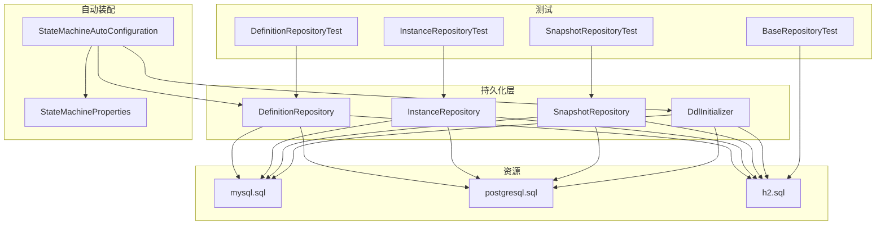
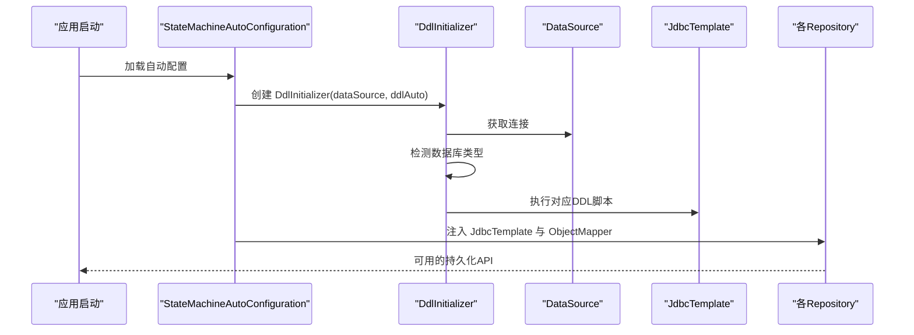
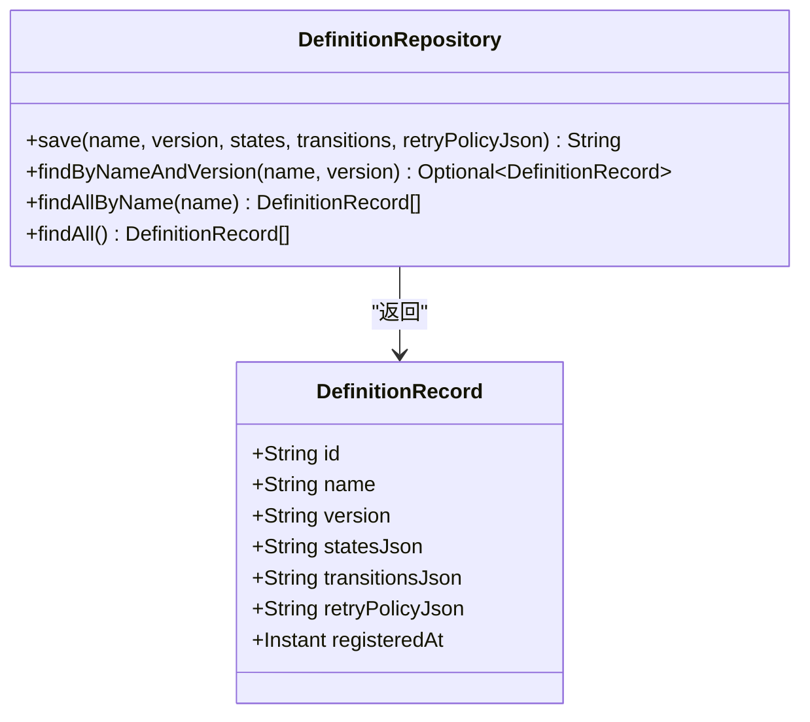
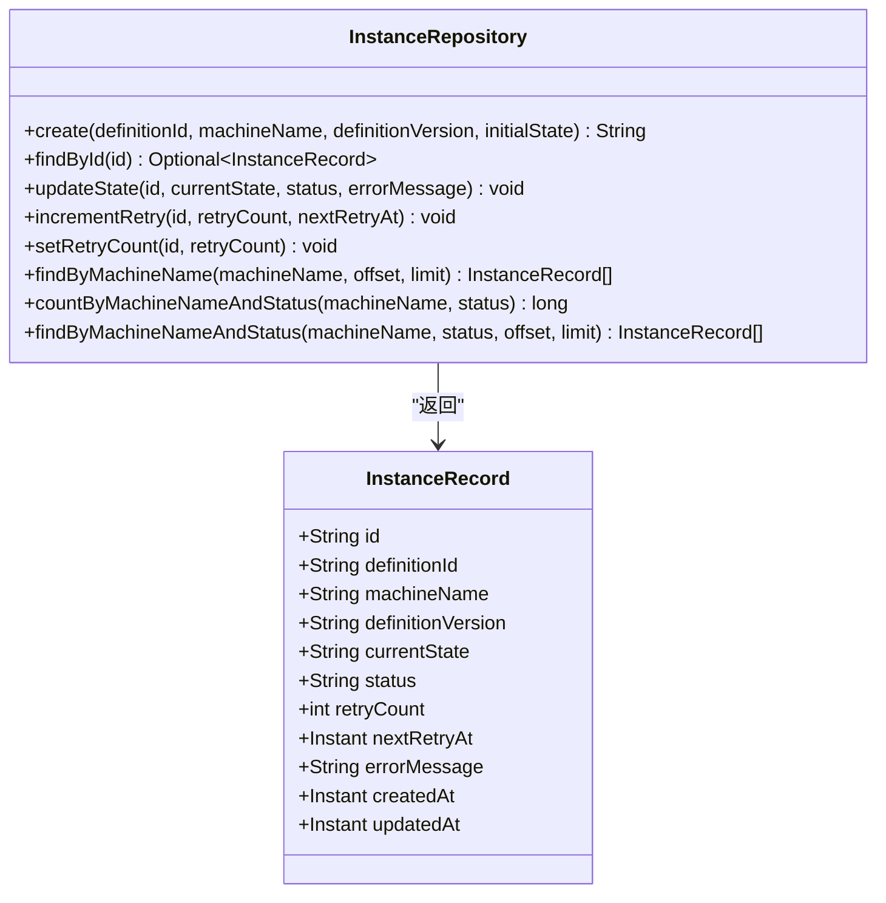
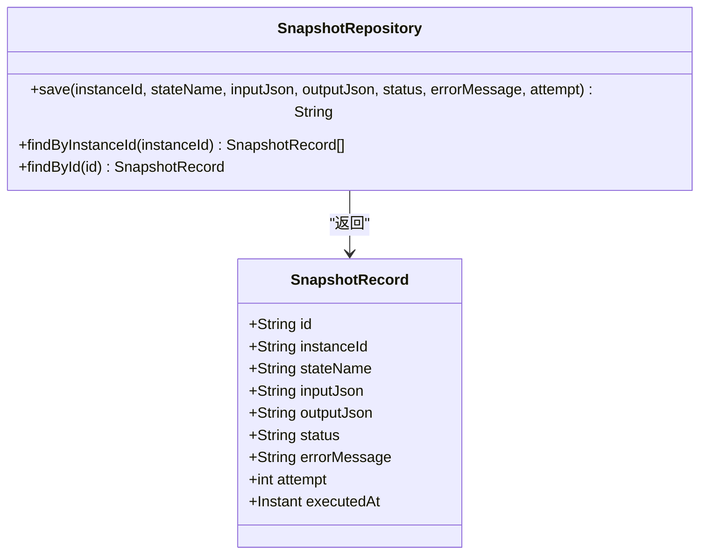
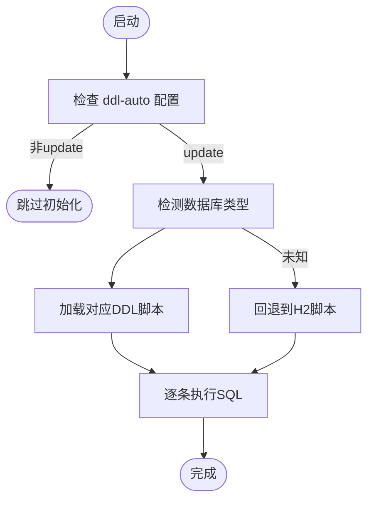
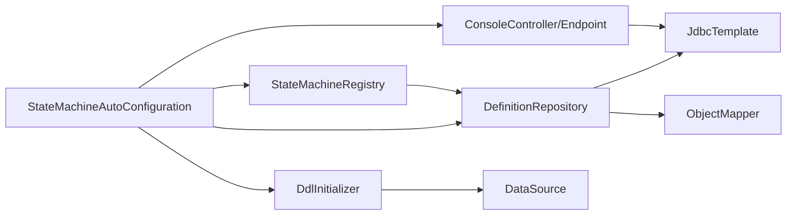

# 持久化API

<cite>
**本文引用的文件**
- [DefinitionRepository.java](file://src/main/java/cn/chedejun/statemachine/persistence/DefinitionRepository.java)
- [InstanceRepository.java](file://src/main/java/cn/chedejun/statemachine/persistence/InstanceRepository.java)
- [SnapshotRepository.java](file://src/main/java/cn/chedejun/statemachine/persistence/SnapshotRepository.java)
- [DdlInitializer.java](file://src/main/java/cn/chedejun/statemachine/persistence/DdlInitializer.java)
- [mysql.sql](file://src/main/resources/ddl/mysql.sql)
- [postgresql.sql](file://src/main/resources/ddl/postgresql.sql)
- [h2.sql](file://src/main/resources/ddl/h2.sql)
- [BaseRepositoryTest.java](file://src/test/java/cn/chedejun/statemachine/persistence/BaseRepositoryTest.java)
- [DefinitionRepositoryTest.java](file://src/test/java/cn/chedejun/statemachine/persistence/DefinitionRepositoryTest.java)
- [InstanceRepositoryTest.java](file://src/test/java/cn/chedejun/statemachine/persistence/InstanceRepositoryTest.java)
- [SnapshotRepositoryTest.java](file://src/test/java/cn/chedejun/statemachine/persistence/SnapshotRepositoryTest.java)
- [StateMachineAutoConfiguration.java](file://src/main/java/cn/chedejun/statemachine/autoconfigure/StateMachineAutoConfiguration.java)
- [StateMachineProperties.java](file://src/main/java/cn/chedejun/statemachine/autoconfigure/StateMachineProperties.java)
- [MachineDefinitionDTO.java](file://src/main/java/cn/chedejun/statemachine/management/dto/MachineDefinitionDTO.java)
- [InstanceDTO.java](file://src/main/java/cn/chedejun/statemachine/management/dto/InstanceDTO.java)
- [SnapshotDTO.java](file://src/main/java/cn/chedejun/statemachine/management/dto/SnapshotDTO.java)
</cite>

## 目录
1. [简介](#简介)
2. [项目结构](#项目结构)
3. [核心组件](#核心组件)
4. [架构总览](#架构总览)
5. [详细组件分析](#详细组件分析)
6. [依赖分析](#依赖分析)
7. [性能考虑](#性能考虑)
8. [故障排查指南](#故障排查指南)
9. [结论](#结论)
10. [附录](#附录)

## 简介
本文件系统性梳理状态机持久化API，覆盖数据访问层四大核心组件：DefinitionRepository（定义仓储）、InstanceRepository（实例仓储）、SnapshotRepository（快照仓储）与 DdlInitializer（DDL初始化器）。文档从API接口、数据模型、数据库表结构与索引设计、DDL初始化脚本使用与数据库兼容性、事务与连接管理、到性能优化策略进行完整说明，并通过测试用例路径展示典型用法。

## 项目结构
围绕持久化API的关键文件组织如下：
- persistence 层：定义、实例、快照与DDL初始化
- resources/ddl：为不同数据库提供建表脚本
- test：基于内存数据库的集成测试，验证API行为
- autoconfigure：Spring Boot自动装配，负责Bean创建与DDL初始化触发
- management/dto：对外暴露的DTO模型（用于管理端/控制台）

图表来源
- [DefinitionRepository.java:1-78](file://src/main/java/cn/chedejun/statemachine/persistence/DefinitionRepository.java#L1-L78)
- [InstanceRepository.java:1-66](file://src/main/java/cn/chedejun/statemachine/persistence/InstanceRepository.java#L1-L66)
- [SnapshotRepository.java:1-55](file://src/main/java/cn/chedejun/statemachine/persistence/SnapshotRepository.java#L1-L55)
- [DdlInitializer.java:1-54](file://src/main/java/cn/chedejun/statemachine/persistence/DdlInitializer.java#L1-L54)
- [mysql.sql:1-18](file://src/main/resources/ddl/mysql.sql#L1-L18)
- [postgresql.sql:1-18](file://src/main/resources/ddl/postgresql.sql#L1-L18)
- [h2.sql:1-18](file://src/main/resources/ddl/h2.sql#L1-L18)
- [StateMachineAutoConfiguration.java:1-80](file://src/main/java/cn/chedejun/statemachine/autoconfigure/StateMachineAutoConfiguration.java#L1-L80)
- [StateMachineProperties.java:1-35](file://src/main/java/cn/chedejun/statemachine/autoconfigure/StateMachineProperties.java#L1-L35)
- [BaseRepositoryTest.java:1-35](file://src/test/java/cn/chedejun/statemachine/persistence/BaseRepositoryTest.java#L1-L35)
- [DefinitionRepositoryTest.java:1-50](file://src/test/java/cn/chedejun/statemachine/persistence/DefinitionRepositoryTest.java#L1-L50)
- [InstanceRepositoryTest.java:1-52](file://src/test/java/cn/chedejun/statemachine/persistence/InstanceRepositoryTest.java#L1-L52)
- [SnapshotRepositoryTest.java:1-46](file://src/test/java/cn/chedejun/statemachine/persistence/SnapshotRepositoryTest.java#L1-L46)

章节来源
- [StateMachineAutoConfiguration.java:22-41](file://src/main/java/cn/chedejun/statemachine/autoconfigure/StateMachineAutoConfiguration.java#L22-L41)
- [StateMachineProperties.java:7-16](file://src/main/java/cn/chedejun/statemachine/autoconfigure/StateMachineProperties.java#L7-L16)

## 核心组件
本节概述四个数据访问组件的职责与关键API。

- DefinitionRepository：负责状态机定义的保存、查询与版本管理，内部以JSON存储状态与转换信息。
- InstanceRepository：负责状态机实例的创建、状态更新、重试计数与分页查询。
- SnapshotRepository：负责状态执行快照的保存与查询，支持按实例ID排序与错误信息记录。
- DdlInitializer：根据数据源自动检测数据库类型并执行对应DDL脚本，支持update模式下的自动建表。

章节来源
- [DefinitionRepository.java:15-78](file://src/main/java/cn/chedejun/statemachine/persistence/DefinitionRepository.java#L15-L78)
- [InstanceRepository.java:11-66](file://src/main/java/cn/chedejun/statemachine/persistence/InstanceRepository.java#L11-L66)
- [SnapshotRepository.java:11-55](file://src/main/java/cn/chedejun/statemachine/persistence/SnapshotRepository.java#L11-L55)
- [DdlInitializer.java:9-54](file://src/main/java/cn/chedejun/statemachine/persistence/DdlInitializer.java#L9-L54)

## 架构总览
下图展示持久化层与自动装配、测试之间的交互关系，以及DDL初始化如何在启动时被触发。

图表来源
- [StateMachineAutoConfiguration.java:28-41](file://src/main/java/cn/chedejun/statemachine/autoconfigure/StateMachineAutoConfiguration.java#L28-L41)
- [DdlInitializer.java:20-43](file://src/main/java/cn/chedejun/statemachine/persistence/DdlInitializer.java#L20-L43)

## 详细组件分析

### DefinitionRepository（定义仓储）
- 职责
  - 保存状态机定义（名称、版本、状态列表、转换列表、重试策略），返回生成的定义ID
  - 按名称+版本查找定义
  - 按名称列出所有版本
  - 列出全部定义（带排序）
- 关键API
  - save(name, version, states, transitions, retryPolicyJson) → 返回定义ID
  - findByNameAndVersion(name, version) → Optional<DefinitionRecord>
  - findAllByName(name) → List<DefinitionRecord>
  - findAll() → List<DefinitionRecord>
- 数据模型（DefinitionRecord）
  - 字段：id、name、version、statesJson、transitionsJson、retryPolicyJson、registeredAt
- JSON字段说明
  - statesJson：状态节点集合的JSON序列化
  - transitionsJson：转换规则集合的JSON序列化
  - retryPolicyJson：重试策略的JSON序列化
- 错误处理
  - JSON序列化失败抛出运行时异常
  - 查询不到时返回空Optional
- 复杂度
  - save：单条插入，时间复杂度O(1)
  - findByNameAndVersion：基于唯一索引，期望O(1)
  - findAllByName/findAll：需扫描或按索引排序，取决于数据库实现
- 使用示例（测试）
  - [DefinitionRepositoryTest.java:15-26](file://src/test/java/cn/chedejun/statemachine/persistence/DefinitionRepositoryTest.java#L15-L26)

图表来源
- [DefinitionRepository.java:24-76](file://src/main/java/cn/chedejun/statemachine/persistence/DefinitionRepository.java#L24-L76)

章节来源
- [DefinitionRepository.java:24-76](file://src/main/java/cn/chedejun/statemachine/persistence/DefinitionRepository.java#L24-L76)
- [DefinitionRepositoryTest.java:15-48](file://src/test/java/cn/chedejun/statemachine/persistence/DefinitionRepositoryTest.java#L15-L48)

### InstanceRepository（实例仓储）
- 职责
  - 创建实例（指定定义ID、机器名、版本、初始状态）
  - 按ID查询实例
  - 更新当前状态、状态码与错误信息
  - 增加重试次数与下次重试时间（同时恢复为RUNNING）
  - 设置重试次数
  - 分页查询实例（按机器名过滤）
  - 统计实例数量（可按状态过滤）
- 关键API
  - create(definitionId, machineName, definitionVersion, initialState) → 实例ID
  - findById(id) → Optional<InstanceRecord>
  - updateState(id, currentState, status, errorMessage) → void
  - incrementRetry(id, retryCount, nextRetryAt) → void
  - setRetryCount(id, retryCount) → void
  - findByMachineName(machineName, offset, limit) → List<InstanceRecord>
  - countByMachineNameAndStatus(machineName, status) → long
  - findByMachineNameAndStatus(machineName, status, offset, limit) → List<InstanceRecord>
- 数据模型（InstanceRecord）
  - 字段：id、definitionId、machineName、definitionVersion、currentState、status、retryCount、nextRetryAt、errorMessage、createdAt、updatedAt
- 状态与重试
  - status默认为RUNNING；当调用incrementRetry后仍保持RUNNING
  - nextRetryAt为空表示未计划重试
- 分页与排序
  - 基于created_at倒序，LIMIT/OFFSET实现分页
- 使用示例（测试）
  - [InstanceRepositoryTest.java:12-49](file://src/test/java/cn/chedejun/statemachine/persistence/InstanceRepositoryTest.java#L12-L49)

图表来源
- [InstanceRepository.java:15-64](file://src/main/java/cn/chedejun/statemachine/persistence/InstanceRepository.java#L15-L64)

章节来源
- [InstanceRepository.java:15-64](file://src/main/java/cn/chedejun/statemachine/persistence/InstanceRepository.java#L15-L64)
- [InstanceRepositoryTest.java:12-50](file://src/test/java/cn/chedejun/statemachine/persistence/InstanceRepositoryTest.java#L12-L50)

### SnapshotRepository（快照仓储）
- 职责
  - 保存状态执行快照（输入、输出、状态、错误信息、尝试次数）
  - 按实例ID查询快照（按执行时间与尝试次数排序）
  - 按ID查询快照详情
- 关键API
  - save(instanceId, stateName, inputJson, outputJson, status, errorMessage, attempt) → 快照ID
  - findByInstanceId(instanceId) → List<SnapshotRecord>
  - findById(id) → SnapshotRecord
- 数据模型（SnapshotRecord）
  - 字段：id、instanceId、stateName、inputJson、outputJson、status、errorMessage、attempt、executedAt
- 排序规则
  - 先按执行时间升序，再按尝试次数升序
- 使用示例（测试）
  - [SnapshotRepositoryTest.java:13-44](file://src/test/java/cn/chedejun/statemachine/persistence/SnapshotRepositoryTest.java#L13-L44)

图表来源
- [SnapshotRepository.java:15-53](file://src/main/java/cn/chedejun/statemachine/persistence/SnapshotRepository.java#L15-L53)

章节来源
- [SnapshotRepository.java:15-53](file://src/main/java/cn/chedejun/statemachine/persistence/SnapshotRepository.java#L15-L53)
- [SnapshotRepositoryTest.java:13-44](file://src/test/java/cn/chedejun/statemachine/persistence/SnapshotRepositoryTest.java#L13-L44)

### DdlInitializer（DDL初始化器）
- 职责
  - 在启动时根据数据源自动检测数据库类型（MySQL、PostgreSQL、默认H2）
  - 读取对应DDL脚本并逐条执行
  - 支持通过配置项控制是否自动初始化（update模式）
- 关键逻辑
  - 检测数据库类型：通过连接元数据URL判断
  - 资源加载：优先加载目标数据库脚本，不存在则回退到H2
  - 初始化开关：仅当配置为update时执行
- 配置项
  - state-machine.ddl-auto：默认update，可设为其他值禁用自动初始化
- 异常处理
  - 初始化失败抛出运行时异常并记录错误日志

图表来源
- [DdlInitializer.java:20-43](file://src/main/java/cn/chedejun/statemachine/persistence/DdlInitializer.java#L20-L43)
- [StateMachineProperties.java:7-13](file://src/main/java/cn/chedejun/statemachine/autoconfigure/StateMachineProperties.java#L7-L13)

章节来源
- [DdlInitializer.java:20-43](file://src/main/java/cn/chedejun/statemachine/persistence/DdlInitializer.java#L20-L43)
- [StateMachineAutoConfiguration.java:28-31](file://src/main/java/cn/chedejun/statemachine/autoconfigure/StateMachineAutoConfiguration.java#L28-L31)
- [StateMachineProperties.java:7-13](file://src/main/java/cn/chedejun/statemachine/autoconfigure/StateMachineProperties.java#L7-L13)

## 依赖分析
- 自动装配对持久化层的依赖
  - DdlInitializer依赖DataSource与配置项
  - DefinitionRepository依赖JdbcTemplate与ObjectMapper
  - StateMachineRegistry依赖DefinitionRepository
  - 控制台与管理端依赖JdbcTemplate
- 测试对持久化层的依赖
  - BaseRepositoryTest使用内存H2数据库，手动执行DDL脚本
  - 各Repository测试验证API行为

图表来源
- [StateMachineAutoConfiguration.java:28-78](file://src/main/java/cn/chedejun/statemachine/autoconfigure/StateMachineAutoConfiguration.java#L28-L78)

章节来源
- [StateMachineAutoConfiguration.java:28-78](file://src/main/java/cn/chedejun/statemachine/autoconfigure/StateMachineAutoConfiguration.java#L28-L78)
- [BaseRepositoryTest.java:22-27](file://src/test/java/cn/chedejun/statemachine/persistence/BaseRepositoryTest.java#L22-L27)

## 性能考虑
- 表与索引
  - 定义表：name+version组合唯一索引，便于按名称版本精确查找
  - 实例表：按machine_name过滤，建议在该列建立索引以提升分页与统计查询性能
  - 快照表：按instance_id排序，建议在该列建立索引以加速查询
- JSON字段
  - MySQL使用JSON，PostgreSQL使用JSONB，H2使用CLOB；JSONB通常具备更好的查询与存储性能
- 分页与排序
  - 实例查询使用LIMIT/OFFSET，建议结合索引与合理offset策略避免深度分页
- 连接与事务
  - 建议在业务层统一使用Spring声明式事务，确保状态更新原子性
  - 对高频查询场景可考虑只读事务与连接池优化
- 序列化
  - 定义与快照中的JSON序列化由ObjectMapper完成，建议缓存常用定义并复用ObjectMapper实例

[本节为通用性能指导，不直接分析具体文件]

## 故障排查指南
- DDL初始化失败
  - 现象：启动时报错提示无法初始化表
  - 排查：确认数据源可用、DDL脚本存在且语法正确；检查数据库类型识别是否准确
  - 参考
    - [DdlInitializer.java:39-42](file://src/main/java/cn/chedejun/statemachine/persistence/DdlInitializer.java#L39-L42)
    - [StateMachineAutoConfiguration.java:28-31](file://src/main/java/cn/chedejun/statemachine/autoconfigure/StateMachineAutoConfiguration.java#L28-L31)
- JSON序列化异常
  - 现象：保存定义或快照时报序列化错误
  - 排查：检查传入对象是否可被ObjectMapper序列化；确认JSON字符串格式
  - 参考
    - [DefinitionRepository.java:28-33](file://src/main/java/cn/chedejun/statemachine/persistence/DefinitionRepository.java#L28-L33)
    - [SnapshotRepository.java:19-29](file://src/main/java/cn/chedejun/statemachine/persistence/SnapshotRepository.java#L19-L29)
- 查询结果为空
  - 现象：按名称版本查找定义、按机器名查询实例为空
  - 排查：确认名称、版本、机器名拼写一致；确认数据已正确插入
  - 参考
    - [DefinitionRepositoryTest.java:28-30](file://src/test/java/cn/chedejun/statemachine/persistence/DefinitionRepositoryTest.java#L28-L30)
    - [InstanceRepositoryTest.java:37-42](file://src/test/java/cn/chedejun/statemachine/persistence/InstanceRepositoryTest.java#L37-L42)
- 快照顺序异常
  - 现象：按实例查询快照顺序不符合预期
  - 排查：确认executed_at与attempt字段是否正确设置；测试中验证了先按时间再按尝试次数排序
  - 参考
    - [SnapshotRepositoryTest.java:32-44](file://src/test/java/cn/chedejun/statemachine/persistence/SnapshotRepositoryTest.java#L32-L44)

章节来源
- [DdlInitializer.java:39-42](file://src/main/java/cn/chedejun/statemachine/persistence/DdlInitializer.java#L39-L42)
- [DefinitionRepository.java:28-33](file://src/main/java/cn/chedejun/statemachine/persistence/DefinitionRepository.java#L28-L33)
- [SnapshotRepository.java:19-29](file://src/main/java/cn/chedejun/statemachine/persistence/SnapshotRepository.java#L19-L29)
- [DefinitionRepositoryTest.java:28-30](file://src/test/java/cn/chedejun/statemachine/persistence/DefinitionRepositoryTest.java#L28-L30)
- [InstanceRepositoryTest.java:37-42](file://src/test/java/cn/chedejun/statemachine/persistence/InstanceRepositoryTest.java#L37-L42)
- [SnapshotRepositoryTest.java:32-44](file://src/test/java/cn/chedejun/statemachine/persistence/SnapshotRepositoryTest.java#L32-L44)

## 结论
本持久化API以轻量JDBC为核心，提供状态机定义、实例与快照的完整数据存取能力。通过自动装配与DDL初始化器，可在多种数据库上快速落地。配合合理的索引与分页策略，可满足生产环境的查询与写入需求。测试用例覆盖了主要使用场景，便于二次开发与扩展。

[本节为总结性内容，不直接分析具体文件]

## 附录

### 数据库表结构与索引设计
- state_machine_definitions
  - 主键：id
  - 唯一索引：name+version
  - JSON字段：states、transitions、retry_policy（MySQL为JSON，PostgreSQL为JSONB，H2为CLOB）
- state_machine_instances
  - 主键：id
  - 建议索引：machine_name（用于分页与统计）
  - 时间戳：created_at、updated_at
  - 状态：status（默认RUNNING），重试相关：retry_count、next_retry_at
- state_machine_snapshots
  - 主键：id
  - 建议索引：instance_id（用于按实例查询）
  - JSON字段：input、output（MySQL为JSON，PostgreSQL为JSONB，H2为CLOB）
  - 排序：executed_at、attempt

章节来源
- [mysql.sql:1-18](file://src/main/resources/ddl/mysql.sql#L1-L18)
- [postgresql.sql:1-18](file://src/main/resources/ddl/postgresql.sql#L1-L18)
- [h2.sql:1-18](file://src/main/resources/ddl/h2.sql#L1-L18)

### DDL初始化脚本使用方法
- 自动模式
  - 当配置state-machine.ddl-auto为update时，启动时自动检测数据库类型并执行对应DDL
  - 若找不到目标脚本，回退到H2脚本
- 手动模式
  - 将对应数据库脚本导入至目标数据库，确保表结构与索引存在后再启动应用
- 兼容性
  - MySQL：使用JSON字段与CURRENT_TIMESTAMP
  - PostgreSQL：使用JSONB与CURRENT_TIMESTAMP
  - H2：使用CLOB与唯一约束

章节来源
- [DdlInitializer.java:20-43](file://src/main/java/cn/chedejun/statemachine/persistence/DdlInitializer.java#L20-L43)
- [mysql.sql:1-18](file://src/main/resources/ddl/mysql.sql#L1-L18)
- [postgresql.sql:1-18](file://src/main/resources/ddl/postgresql.sql#L1-L18)
- [h2.sql:1-18](file://src/main/resources/ddl/h2.sql#L1-L18)

### DTO模型（对外）
- MachineDefinitionDTO：对外展示的状态机定义模型
- InstanceDTO：对外展示的实例模型
- SnapshotDTO：对外展示的快照模型

章节来源
- [MachineDefinitionDTO.java:5-7](file://src/main/java/cn/chedejun/statemachine/management/dto/MachineDefinitionDTO.java#L5-L7)
- [InstanceDTO.java:3-5](file://src/main/java/cn/chedejun/statemachine/management/dto/InstanceDTO.java#L3-L5)
- [SnapshotDTO.java:3-4](file://src/main/java/cn/chedejun/statemachine/management/dto/SnapshotDTO.java#L3-L4)

### 测试用例参考路径
- DefinitionRepository
  - 保存与查找：[DefinitionRepositoryTest.java:15-26](file://src/test/java/cn/chedejun/statemachine/persistence/DefinitionRepositoryTest.java#L15-L26)
  - 按名称查询版本：[DefinitionRepositoryTest.java:32-37](file://src/test/java/cn/chedejun/statemachine/persistence/DefinitionRepositoryTest.java#L32-L37)
  - 全量查询：[DefinitionRepositoryTest.java:39-43](file://src/test/java/cn/chedejun/statemachine/persistence/DefinitionRepositoryTest.java#L39-L43)
  - 唯一约束冲突：[DefinitionRepositoryTest.java:45-48](file://src/test/java/cn/chedejun/statemachine/persistence/DefinitionRepositoryTest.java#L45-L48)
- InstanceRepository
  - 创建与状态更新：[InstanceRepositoryTest.java:12-27](file://src/test/java/cn/chedejun/statemachine/persistence/InstanceRepositoryTest.java#L12-L27)
  - 重试计数与下次重试：[InstanceRepositoryTest.java:29-35](file://src/test/java/cn/chedejun/statemachine/persistence/InstanceRepositoryTest.java#L29-L35)
  - 分页查询与统计：[InstanceRepositoryTest.java:37-50](file://src/test/java/cn/chedejun/statemachine/persistence/InstanceRepositoryTest.java#L37-L50)
- SnapshotRepository
  - 保存与按ID查询：[SnapshotRepositoryTest.java:13-21](file://src/test/java/cn/chedejun/statemachine/persistence/SnapshotRepositoryTest.java#L13-L21)
  - 错误信息记录：[SnapshotRepositoryTest.java:23-30](file://src/test/java/cn/chedejun/statemachine/persistence/SnapshotRepositoryTest.java#L23-L30)
  - 排序验证：[SnapshotRepositoryTest.java:32-44](file://src/test/java/cn/chedejun/statemachine/persistence/SnapshotRepositoryTest.java#L32-L44)
- 基础测试
  - 内存数据库与DDL执行：[BaseRepositoryTest.java:22-27](file://src/test/java/cn/chedejun/statemachine/persistence/BaseRepositoryTest.java#L22-L27)