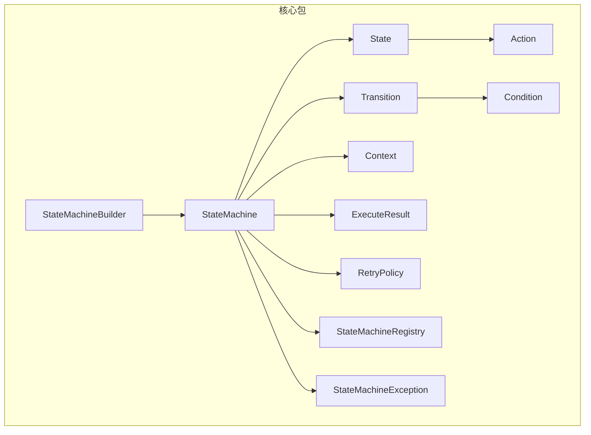
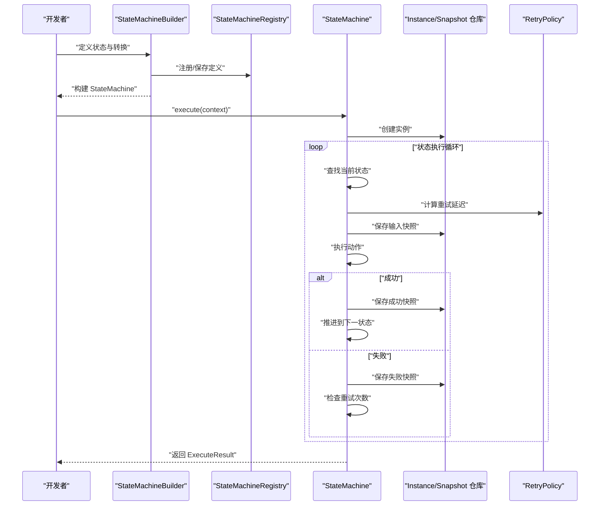
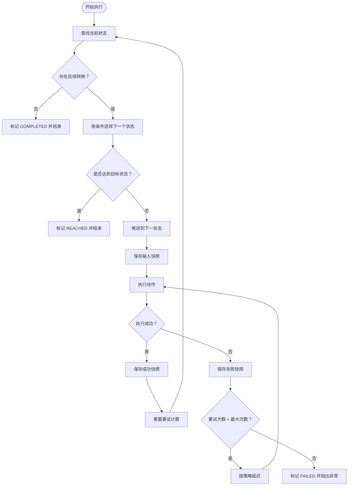
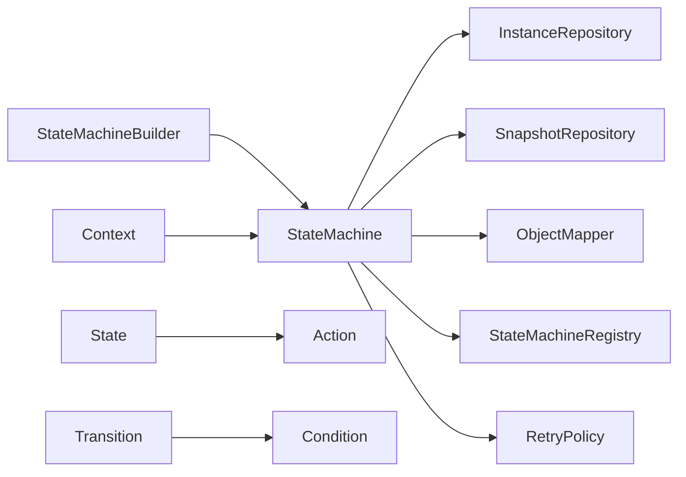

# 核心API

<cite>
**本文引用的文件**
- [StateMachine.java](file://src/main/java/cn/chedejun/statemachine/core/StateMachine.java)
- [StateMachineBuilder.java](file://src/main/java/cn/chedejun/statemachine/core/StateMachineBuilder.java)
- [State.java](file://src/main/java/cn/chedejun/statemachine/core/State.java)
- [Transition.java](file://src/main/java/cn/chedejun/statemachine/core/Transition.java)
- [Action.java](file://src/main/java/cn/chedejun/statemachine/core/Action.java)
- [Condition.java](file://src/main/java/cn/chedejun/statemachine/core/Condition.java)
- [Context.java](file://src/main/java/cn/chedejun/statemachine/core/Context.java)
- [ExecuteResult.java](file://src/main/java/cn/chedejun/statemachine/core/ExecuteResult.java)
- [RetryPolicy.java](file://src/main/java/cn/chedejun/statemachine/core/RetryPolicy.java)
- [StateMachineRegistry.java](file://src/main/java/cn/chedejun/statemachine/core/StateMachineRegistry.java)
- [StateMachineException.java](file://src/main/java/cn/chedejun/statemachine/core/StateMachineException.java)
- [OrderConfig.java](file://demo/src/main/java/cn/chedejun/demo/config/OrderConfig.java)
- [OrderContext.java](file://demo/src/main/java/cn/chedejun/demo/statemachine/OrderContext.java)
- [OutboundContext.java](file://demo/src/main/java/cn/chedejun/demo/statemachine/OutboundContext.java)
- [README.md](file://README.md)
- [StateMachineBuilderTest.java](file://src/test/java/cn/chedejun/statemachine/core/StateMachineBuilderTest.java)
</cite>

## 目录
1. [简介](#简介)
2. [项目结构](#项目结构)
3. [核心组件](#核心组件)
4. [架构总览](#架构总览)
5. [详细组件分析](#详细组件分析)
6. [依赖分析](#依赖分析)
7. [性能考虑](#性能考虑)
8. [故障排查指南](#故障排查指南)
9. [结论](#结论)
10. [附录](#附录)

## 简介
本文件面向使用者与开发者，系统性梳理状态机核心API，覆盖 StateMachine、StateMachineBuilder、State、Transition、Action、Condition、Context 以及 ExecuteResult 的完整接口与行为说明；阐述 DSL 构建器的流畅式设计与使用模式；解释状态定义、转换条件、动作执行、泛型上下文类型与序列化处理；并给出状态转换逻辑与执行结果数据结构的深入解析。

## 项目结构
核心API位于 cn.chedejun.statemachine.core 包中，围绕“定义-构建-执行-持久化-重试-注册”闭环展开。演示与测试分别位于 demo 与 test 模块，便于理解真实用法与验证行为。

图表来源
- [StateMachine.java:11-196](file://src/main/java/cn/chedejun/statemachine/core/StateMachine.java#L11-L196)
- [StateMachineBuilder.java:8-53](file://src/main/java/cn/chedejun/statemachine/core/StateMachineBuilder.java#L8-L53)
- [State.java:3-16](file://src/main/java/cn/chedejun/statemachine/core/State.java#L3-L16)
- [Transition.java:3-20](file://src/main/java/cn/chedejun/statemachine/core/Transition.java#L3-L20)
- [Action.java:3-12](file://src/main/java/cn/chedejun/statemachine/core/Action.java#L3-L12)
- [Condition.java:1-7](file://src/main/java/cn/chedejun/statemachine/core/Condition.java#L1-L7)
- [Context.java:6-24](file://src/main/java/cn/chedejun/statemachine/core/Context.java#L6-L24)
- [ExecuteResult.java:14-23](file://src/main/java/cn/chedejun/statemachine/core/ExecuteResult.java#L14-L23)
- [RetryPolicy.java:5-45](file://src/main/java/cn/chedejun/statemachine/core/RetryPolicy.java#L5-L45)
- [StateMachineRegistry.java:9-73](file://src/main/java/cn/chedejun/statemachine/core/StateMachineRegistry.java#L9-L73)
- [StateMachineException.java:3-19](file://src/main/java/cn/chedejun/statemachine/core/StateMachineException.java#L3-L19)

章节来源
- [StateMachine.java:11-196](file://src/main/java/cn/chedejun/statemachine/core/StateMachine.java#L11-L196)
- [StateMachineBuilder.java:8-53](file://src/main/java/cn/chedejun/statemachine/core/StateMachineBuilder.java#L8-L53)

## 核心组件
- StateMachine：状态机执行引擎，负责实例创建、状态推进、重试策略、快照与持久化、结果汇总。
- StateMachineBuilder：DSL 构建器，提供流畅式 API 定义状态与转换，并可配置重试策略、上下文类型、注册与数据库模板。
- State：状态节点，封装名称与动作。
- Transition：状态转换，封装起点、终点与条件。
- Action：动作接口，执行业务逻辑并将结果写入上下文。
- Condition：条件接口，基于上下文判断是否允许转换。
- Context：默认上下文容器，提供键值存取与映射转换。
- ExecuteResult：执行结果数据载体，包含实例ID、机器名、版本、当前状态、状态码与错误信息等。
- RetryPolicy：重试策略，支持指数退避、最大尝试次数与延迟上限。
- StateMachineRegistry：状态机注册中心，负责定义入库与版本管理。
- StateMachineException：异常体系，细分找不到状态、无匹配转换、终端状态等场景。

章节来源
- [StateMachine.java:11-196](file://src/main/java/cn/chedejun/statemachine/core/StateMachine.java#L11-L196)
- [StateMachineBuilder.java:8-53](file://src/main/java/cn/chedejun/statemachine/core/StateMachineBuilder.java#L8-L53)
- [State.java:3-16](file://src/main/java/cn/chedejun/statemachine/core/State.java#L3-L16)
- [Transition.java:3-20](file://src/main/java/cn/chedejun/statemachine/core/Transition.java#L3-L20)
- [Action.java:3-12](file://src/main/java/cn/chedejun/statemachine/core/Action.java#L3-L12)
- [Condition.java:1-7](file://src/main/java/cn/chedejun/statemachine/core/Condition.java#L1-L7)
- [Context.java:6-24](file://src/main/java/cn/chedejun/statemachine/core/Context.java#L6-L24)
- [ExecuteResult.java:14-23](file://src/main/java/cn/chedejun/statemachine/core/ExecuteResult.java#L14-L23)
- [RetryPolicy.java:5-45](file://src/main/java/cn/chedejun/statemachine/core/RetryPolicy.java#L5-L45)
- [StateMachineRegistry.java:9-73](file://src/main/java/cn/chedejun/statemachine/core/StateMachineRegistry.java#L9-L73)
- [StateMachineException.java:3-19](file://src/main/java/cn/chedejun/statemachine/core/StateMachineException.java#L3-L19)

## 架构总览
下图展示状态机从构建到执行的关键交互：构建器装配状态与转换，注册中心保存定义，执行引擎通过数据库模板进行实例与快照持久化，并在失败时按重试策略重试。

图表来源
- [StateMachineBuilder.java:40-51](file://src/main/java/cn/chedejun/statemachine/core/StateMachineBuilder.java#L40-L51)
- [StateMachineRegistry.java:21-49](file://src/main/java/cn/chedejun/statemachine/core/StateMachineRegistry.java#L21-L49)
- [StateMachine.java:40-136](file://src/main/java/cn/chedejun/statemachine/core/StateMachine.java#L40-L136)
- [RetryPolicy.java:26-30](file://src/main/java/cn/chedejun/statemachine/core/RetryPolicy.java#L26-L30)

## 详细组件分析

### StateMachine
- 角色定位：状态机执行核心，封装名称、版本、状态列表、转换列表、重试策略与上下文类型；负责实例创建、执行循环、重试、快照与结果汇总。
- 关键方法
  - 构造与初始化
    - execute(context)
    - execute(context, targetState)
    - execute(context, startState, targetState)
    - retry(instanceId, context)
    - retry(instanceId)
  - 查询与元信息
    - getName()
    - getVersion()
    - getStates()
    - getTransitions()
    - getRetryPolicy()
  - 内部执行循环 executeLoop：推进状态、记录快照、应用重试策略、更新实例状态、终止条件判定。
  - 序列化与反序列化：serialize/deserialize，支持泛型上下文类与默认 Context。
  - 定义解析：resolveDefinitionId，结合注册中心版本映射。
- 行为要点
  - 实例状态枚举：COMPLETED（自然完成）、REACHED（到达目标状态）、FAILED（失败）。
  - 最大迭代限制：避免无限循环。
  - 快照记录：输入JSON、输出JSON、状态、错误信息、尝试次数。
- 使用示例路径
  - [README.md:19-49](file://README.md#L19-L49)
  - [OrderConfig.java:18-46](file://demo/src/main/java/cn/chedejun/demo/config/OrderConfig.java#L18-L46)

章节来源
- [StateMachine.java:11-196](file://src/main/java/cn/chedejun/statemachine/core/StateMachine.java#L11-L196)

### StateMachineBuilder
- 角色定位：DSL 构建器，提供流畅式 API 定义状态与转换，设置重试策略、上下文类型、JDBC 模板与注册中心。
- 关键方法
  - builder(name)：静态工厂
  - state(name, action)
  - transition(from, to)
  - transition(from, to, condition)
  - retryPolicy(policy)
  - contextClass(clazz)
  - build()：生成 StateMachine 并注册到注册中心（如已注入）。
- 设计要点
  - 版本自增：使用原子计数器生成版本号。
  - 默认上下文：若未显式设置，回退到默认 Context。
  - 注册与持久化：注入 JdbcTemplate 后自动初始化仓库与对象映射器。
- 使用示例路径
  - [README.md:19-37](file://README.md#L19-L37)
  - [OrderConfig.java:20-46](file://demo/src/main/java/cn/chedejun/demo/config/OrderConfig.java#L20-L46)

章节来源
- [StateMachineBuilder.java:8-53](file://src/main/java/cn/chedejun/statemachine/core/StateMachineBuilder.java#L8-L53)

### State
- 角色定位：状态节点，包含名称与动作。
- 关键方法
  - getName()
  - getAction()

章节来源
- [State.java:3-16](file://src/main/java/cn/chedejun/statemachine/core/State.java#L3-L16)

### Transition
- 角色定位：状态转换，包含起点、终点与条件。
- 关键方法
  - getFrom()
  - getTo()
  - getCondition()

章节来源
- [Transition.java:3-20](file://src/main/java/cn/chedejun/statemachine/core/Transition.java#L3-L20)

### Action
- 角色定位：动作接口，执行业务逻辑，结果通过上下文写入，自动记录到快照。
- 关键方法
  - execute(context)：抛出异常即视为失败，触发重试。

章节来源
- [Action.java:3-12](file://src/main/java/cn/chedejun/statemachine/core/Action.java#L3-L12)

### Condition
- 角色定位：条件接口，基于上下文判断是否允许转换。
- 关键方法
  - test(context)：返回布尔值决定是否允许转换。

章节来源
- [Condition.java:1-7](file://src/main/java/cn/chedejun/statemachine/core/Condition.java#L1-L7)

### Context
- 角色定位：默认上下文容器，提供键值存取、判空、映射转换与静态工厂。
- 关键方法
  - get(key)：泛型读取
  - put(key, value)：链式写入
  - containsKey(key)
  - toMap()
  - fromMap(map)

章节来源
- [Context.java:6-24](file://src/main/java/cn/chedejun/statemachine/core/Context.java#L6-L24)

### ExecuteResult
- 角色定位：执行结果数据载体，包含实例ID、机器名、版本、当前状态、状态码与错误信息等。
- 字段
  - instanceId
  - machineName
  - definitionVersion
  - currentState
  - status
  - errorMessage
  - createdAt

章节来源
- [ExecuteResult.java:14-23](file://src/main/java/cn/chedejun/statemachine/core/ExecuteResult.java#L14-L23)

### RetryPolicy
- 角色定位：重试策略，支持指数退避、最大尝试次数、初始延迟、最大延迟与退避因子。
- 关键方法
  - exponentialBackoff()：静态工厂
  - none()：禁用重试
  - getMaxAttempts()
  - getInitialDelayMs()
  - getMaxDelayMs()
  - getBackoffFactor()
  - getDelayForAttempt(attempt)：按尝试次数计算延迟
- Builder
  - maxAttempts(v)
  - initialDelay(d, u)
  - maxDelay(d, u)
  - backoffFactor(f)
  - build()

章节来源
- [RetryPolicy.java:5-45](file://src/main/java/cn/chedejun/statemachine/core/RetryPolicy.java#L5-L45)

### StateMachineRegistry
- 角色定位：状态机注册中心，负责将状态机定义持久化到 DefinitionRepository，并维护内存中的机器映射。
- 关键方法
  - register(machine)：保存定义并放入内存映射
  - getLatest(name)：获取最新版本
  - getMachineNames()：列出所有机器名
  - getVersions(name)：查询某机器的所有版本
  - getAllDefinitions()：查询全部定义

章节来源
- [StateMachineRegistry.java:9-73](file://src/main/java/cn/chedejun/statemachine/core/StateMachineRegistry.java#L9-L73)

### 异常体系
- StateMachineException：基础异常
  - NoMatchingTransitionException：无匹配转换
  - StateNotFoundException：状态不存在
  - TerminalStateException：实例处于终端状态

章节来源
- [StateMachineException.java:3-19](file://src/main/java/cn/chedejun/statemachine/core/StateMachineException.java#L3-L19)

### 泛型上下文与序列化
- 泛型上下文
  - StateMachine<C>、StateMachineBuilder<C>、State<C>、Transition<C> 均以 C 作为上下文类型参数。
  - 构建器可通过 contextClass(Class<C>) 指定上下文类型；若未指定则使用默认 Context。
- 序列化
  - StateMachine 内部使用 ObjectMapper 将上下文序列化为 JSON 存储到快照与实例记录中。
  - 反序列化优先尝试目标上下文类型，失败时回退到默认 Context。

章节来源
- [StateMachine.java:151-160](file://src/main/java/cn/chedejun/statemachine/core/StateMachine.java#L151-L160)
- [StateMachineBuilder.java:43-44](file://src/main/java/cn/chedejun/statemachine/core/StateMachineBuilder.java#L43-L44)
- [Context.java:6-24](file://src/main/java/cn/chedejun/statemachine/core/Context.java#L6-L24)

### 状态转换逻辑与执行流程
- 转换选择
  - 遍历所有转换，筛选 from 与当前状态一致的转换；
  - 若转换无条件或条件为真，则进入目标状态。
- 终止条件
  - 无后续转换：COMPLETED
  - 指定目标状态且到达：REACHED
- 执行循环
  - 记录输入快照
  - 执行动作
  - 成功：记录成功快照，推进状态
  - 失败：记录失败快照，按重试策略延时后重试，超过最大次数则标记 FAILED

图表来源
- [StateMachine.java:83-136](file://src/main/java/cn/chedejun/statemachine/core/StateMachine.java#L83-L136)

## 依赖分析
- 组件内聚与耦合
  - StateMachine 对外仅依赖 JdbcTemplate、ObjectMapper、InstanceRepository、SnapshotRepository 与注册中心；内部通过 ensureInitialized 保证运行期初始化。
  - StateMachineBuilder 仅在 build 时装配 StateMachine 并可选注册。
  - Action/Condition 为纯函数式接口，低耦合高内聚。
- 外部依赖点
  - 数据库：JdbcTemplate 提供 SQL 执行能力。
  - 序列化：ObjectMapper 负责 JSON 序列化/反序列化。
  - Spring 环境：通过自动配置与注册中心集成。

图表来源
- [StateMachineBuilder.java:40-51](file://src/main/java/cn/chedejun/statemachine/core/StateMachineBuilder.java#L40-L51)
- [StateMachine.java:21-26](file://src/main/java/cn/chedejun/statemachine/core/StateMachine.java#L21-L26)
- [State.java:3-16](file://src/main/java/cn/chedejun/statemachine/core/State.java#L3-L16)
- [Transition.java:3-20](file://src/main/java/cn/chedejun/statemachine/core/Transition.java#L3-L20)
- [Action.java:3-12](file://src/main/java/cn/chedejun/statemachine/core/Action.java#L3-L12)
- [Condition.java:1-7](file://src/main/java/cn/chedejun/statemachine/core/Condition.java#L1-L7)
- [Context.java:6-24](file://src/main/java/cn/chedejun/statemachine/core/Context.java#L6-L24)
- [RetryPolicy.java:5-45](file://src/main/java/cn/chedejun/statemachine/core/RetryPolicy.java#L5-L45)
- [StateMachineRegistry.java:9-73](file://src/main/java/cn/chedejun/statemachine/core/StateMachineRegistry.java#L9-L73)

## 性能考虑
- 最大迭代限制：防止无限循环导致资源耗尽。
- 快照与持久化：频繁 IO 可能成为瓶颈，建议合理设置重试策略与批量操作。
- 序列化成本：上下文序列化/反序列化开销随数据量增长，建议控制上下文大小或分片存储。
- 线程安全：注册中心使用并发映射，构建器版本计数器为原子类型，整体线程安全可控。

## 故障排查指南
- 初始化异常
  - 现象：执行时报“未初始化”。
  - 排查：确认已注入 JdbcTemplate，或在构建时传入。
  - 参考：[StateMachine.java:178-180](file://src/main/java/cn/chedejun/statemachine/core/StateMachine.java#L178-L180)
- 状态不存在
  - 现象：抛出“状态不存在”异常。
  - 排查：检查状态名称拼写与是否在构建阶段声明。
  - 参考：[StateMachine.java:91-92](file://src/main/java/cn/chedejun/statemachine/core/StateMachine.java#L91-L92)
- 无匹配转换
  - 现象：抛出“无匹配转换”异常。
  - 排查：检查条件表达式与上下文字段是否满足。
  - 参考：[StateMachineException.java:7-9](file://src/main/java/cn/chedejun/statemachine/core/StateMachineException.java#L7-L9)
- 终端状态不可重试
  - 现象：对已完成或失败实例调用重试。
  - 排查：仅对 FAILED 状态实例允许重试。
  - 参考：[StateMachine.java:54-55](file://src/main/java/cn/chedejun/statemachine/core/StateMachine.java#L54-L55)
- 重试中断
  - 现象：重试等待被中断。
  - 排查：捕获中断异常并恢复线程中断状态。
  - 参考：[StateMachine.java:107-110](file://src/main/java/cn/chedejun/statemachine/core/StateMachine.java#L107-L110)

章节来源
- [StateMachine.java:178-180](file://src/main/java/cn/chedejun/statemachine/core/StateMachine.java#L178-L180)
- [StateMachineException.java:7-17](file://src/main/java/cn/chedejun/statemachine/core/StateMachineException.java#L7-L17)

## 结论
该状态机核心API以简洁的 DSL 构建器与清晰的执行模型为核心，配合可配置的重试策略、完善的快照与持久化机制，能够稳定支撑复杂业务流程编排。通过泛型上下文与默认 Context 的组合，既满足强类型需求，又兼顾易用性。建议在生产环境中结合注册中心与管理控制台，实现定义治理与可观测性。

## 附录

### 使用示例与最佳实践
- 快速开始
  - 定义状态机：参考 [README.md:19-37](file://README.md#L19-L37)
  - 执行与重试：参考 [README.md:40-49](file://README.md#L40-L49)
- 自定义上下文
  - 继承 Context 并添加领域字段：参考 [OrderContext.java:8-34](file://demo/src/main/java/cn/chedejun/demo/statemachine/OrderContext.java#L8-L34)、[OutboundContext.java:8-43](file://demo/src/main/java/cn/chedejun/demo/statemachine/OutboundContext.java#L8-L43)
  - 在构建器中指定上下文类型：参考 [OrderConfig.java:20-22](file://demo/src/main/java/cn/chedejun/demo/config/OrderConfig.java#L20-L22)
- 条件与动作
  - 使用 Condition 进行分支：参考 [OrderConfig.java:30-38](file://demo/src/main/java/cn/chedejun/demo/config/OrderConfig.java#L30-L38)
  - 使用 Action 执行业务逻辑：参考 [OrderConfig.java:48-79](file://demo/src/main/java/cn/chedejun/demo/config/OrderConfig.java#L48-L79)
- 验证行为
  - 单元测试覆盖构建、执行、目标状态与完成状态：参考 [StateMachineBuilderTest.java:30-121](file://src/test/java/cn/chedejun/statemachine/core/StateMachineBuilderTest.java#L30-L121)