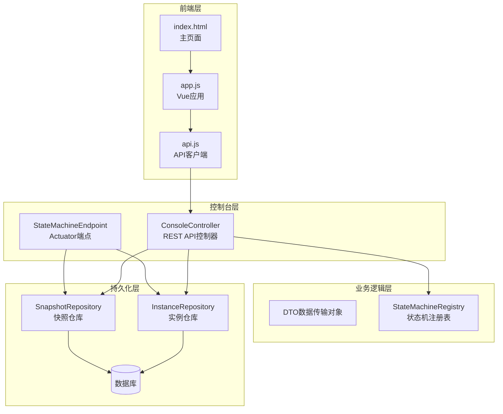
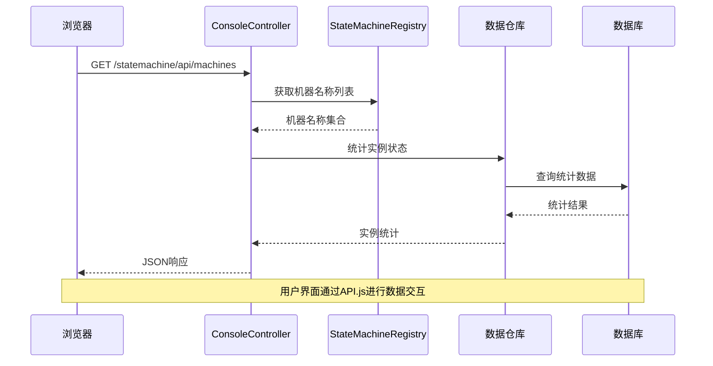
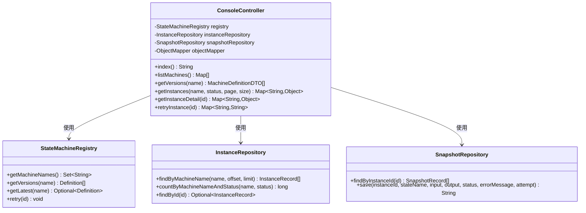
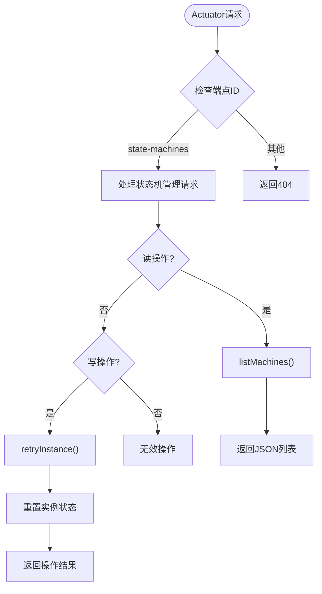
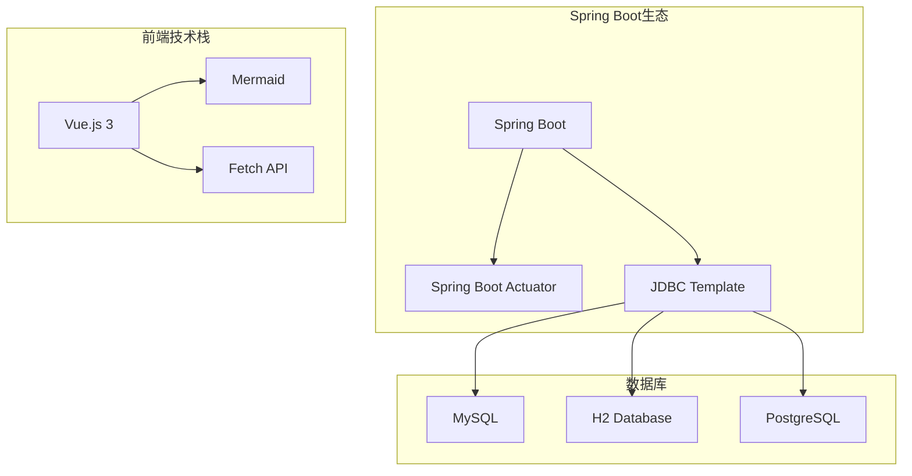
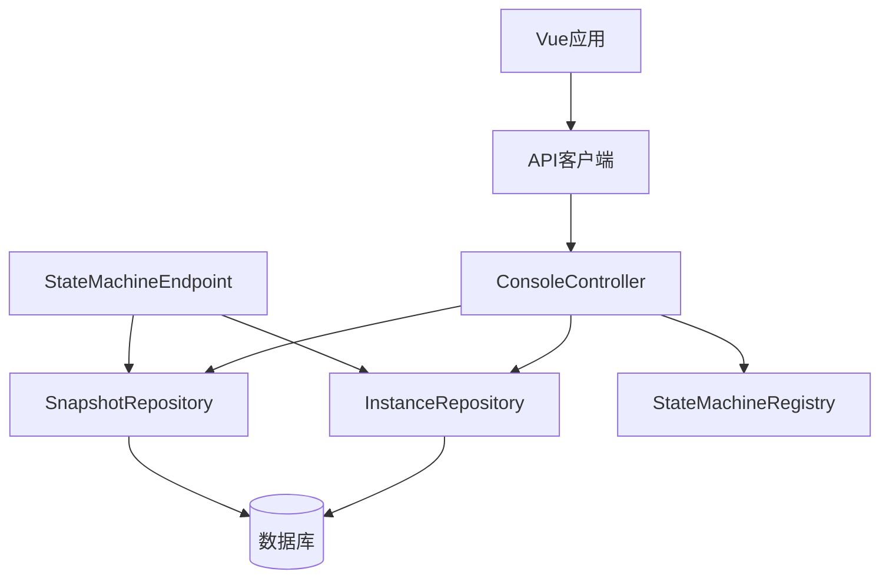

# 管理控制台API

<cite>
**本文档引用的文件**
- [ConsoleController.java](file://src/main/java/cn/chedejun/statemachine/management/ConsoleController.java)
- [StateMachineEndpoint.java](file://src/main/java/cn/chedejun/statemachine/management/StateMachineEndpoint.java)
- [InstanceDTO.java](file://src/main/java/cn/chedejun/statemachine/management/dto/InstanceDTO.java)
- [MachineDTO.java](file://src/main/java/cn/chedejun/statemachine/management/dto/MachineDTO.java)
- [MachineDefinitionDTO.java](file://src/main/java/cn/chedejun/statemachine/management/dto/MachineDefinitionDTO.java)
- [SnapshotDTO.java](file://src/main/java/cn/chedejun/statemachine/management/dto/SnapshotDTO.java)
- [InstanceRepository.java](file://src/main/java/cn/chedejun/statemachine/persistence/InstanceRepository.java)
- [SnapshotRepository.java](file://src/main/java/cn/chedejun/statemachine/persistence/SnapshotRepository.java)
- [mysql.sql](file://src/main/resources/ddl/mysql.sql)
- [api.js](file://src/main/resources/static/statemachine/js/api.js)
- [app.js](file://src/main/resources/static/statemachine/js/app.js)
- [index.html](file://src/main/resources/static/statemachine/index.html)
- [README.md](file://README.md)
</cite>

## 目录
1. [简介](#简介)
2. [项目结构](#项目结构)
3. [核心组件](#核心组件)
4. [架构概览](#架构概览)
5. [详细组件分析](#详细组件分析)
6. [API参考](#api参考)
7. [数据传输对象](#数据传输对象)
8. [前端使用指南](#前端使用指南)
9. [依赖分析](#依赖分析)
10. [性能考虑](#性能考虑)
11. [故障排除指南](#故障排除指南)
12. [结论](#结论)

## 简介

本项目是一个基于Spring Boot的状态机管理控制台，提供了完整的状态机实例管理、执行监控和故障处理功能。系统包含RESTful API接口、Web控制台界面以及JavaScript前端交互层，支持状态机的可视化展示、实例监控和重试操作。

## 项目结构

项目采用分层架构设计，主要包含以下模块：



**图表来源**
- [ConsoleController.java:15-32](file://src/main/java/cn/chedejun/statemachine/management/ConsoleController.java#L15-L32)
- [StateMachineEndpoint.java:16-30](file://src/main/java/cn/chedejun/statemachine/management/StateMachineEndpoint.java#L16-L30)

**章节来源**
- [ConsoleController.java:1-106](file://src/main/java/cn/chedejun/statemachine/management/ConsoleController.java#L1-L106)
- [StateMachineEndpoint.java:1-73](file://src/main/java/cn/chedejun/statemachine/management/StateMachineEndpoint.java#L1-L73)

## 核心组件

### 控制器组件

系统包含两个主要的控制器组件：

1. **ConsoleController**: 提供Web控制台使用的REST API接口
2. **StateMachineEndpoint**: 提供Spring Boot Actuator集成的管理端点

### 数据传输对象

系统定义了四个核心的数据传输对象：

1. **InstanceDTO**: 实例信息传输对象
2. **MachineDTO**: 机器信息传输对象  
3. **MachineDefinitionDTO**: 机器定义传输对象
4. **SnapshotDTO**: 快照信息传输对象

### 持久化组件

1. **InstanceRepository**: 实例数据访问层
2. **SnapshotRepository**: 快照数据访问层

**章节来源**
- [ConsoleController.java:15-32](file://src/main/java/cn/chedejun/statemachine/management/ConsoleController.java#L15-L32)
- [InstanceDTO.java:1-6](file://src/main/java/cn/chedejun/statemachine/management/dto/InstanceDTO.java#L1-L6)
- [MachineDTO.java:1-3](file://src/main/java/cn/chedejun/statemachine/management/dto/MachineDTO.java#L1-L3)

## 架构概览

系统采用MVC架构模式，结合Spring Boot的自动配置特性：



**图表来源**
- [ConsoleController.java:34-43](file://src/main/java/cn/chedejun/statemachine/management/ConsoleController.java#L34-L43)
- [api.js:1-11](file://src/main/resources/static/statemachine/js/api.js#L1-L11)

**章节来源**
- [ConsoleController.java:15-106](file://src/main/java/cn/chedejun/statemachine/management/ConsoleController.java#L15-L106)
- [app.js:82-116](file://src/main/resources/static/statemachine/js/app.js#L82-L116)

## 详细组件分析

### ConsoleController 分析

ConsoleController是系统的核心REST API控制器，负责处理Web控制台的所有HTTP请求。

#### 主要功能

1. **状态机列表管理**: 提供状态机的基本信息和运行状态统计
2. **状态机版本查询**: 返回指定状态机的所有版本定义
3. **实例管理**: 支持实例列表查询、详情查看和重试操作
4. **Web界面路由**: 提供静态页面的路由转发

#### 类关系图



**图表来源**
- [ConsoleController.java:23-32](file://src/main/java/cn/chedejun/statemachine/management/ConsoleController.java#L23-L32)
- [InstanceRepository.java:11-13](file://src/main/java/cn/chedejun/statemachine/persistence/InstanceRepository.java#L11-L13)
- [SnapshotRepository.java:11-13](file://src/main/java/cn/chedejun/statemachine/persistence/SnapshotRepository.java#L11-L13)

**章节来源**
- [ConsoleController.java:15-106](file://src/main/java/cn/chedejun/statemachine/management/ConsoleController.java#L15-L106)

### StateMachineEndpoint 分析

StateMachineEndpoint提供Spring Boot Actuator集成的管理端点，支持更底层的系统管理操作。

#### 主要功能

1. **机器列表查询**: 通过Actuator端点获取状态机列表
2. **版本定义获取**: 返回指定状态机的版本定义
3. **实例重试**: 重置失败的实例状态并准备重新执行

#### 端点配置



**图表来源**
- [StateMachineEndpoint.java:16-30](file://src/main/java/cn/chedejun/statemachine/management/StateMachineEndpoint.java#L16-L30)

**章节来源**
- [StateMachineEndpoint.java:16-73](file://src/main/java/cn/chedejun/statemachine/management/StateMachineEndpoint.java#L16-L73)

### 数据访问层分析

#### InstanceRepository

InstanceRepository负责状态机实例的持久化操作，包含以下核心方法：

1. **创建实例**: 初始化新实例的状态为RUNNING
2. **查询操作**: 支持按ID、状态和机器名的多种查询
3. **更新操作**: 更新实例状态、重试信息等
4. **统计查询**: 提供实例状态统计功能

#### SnapshotRepository

SnapshotRepository负责状态机执行快照的持久化，支持：

1. **保存快照**: 记录每个状态的执行输入、输出和结果
2. **查询快照**: 按实例ID查询所有执行快照
3. **JSON存储**: 支持JSON格式的输入输出数据存储

**章节来源**
- [InstanceRepository.java:11-66](file://src/main/java/cn/chedejun/statemachine/persistence/InstanceRepository.java#L11-L66)
- [SnapshotRepository.java:11-55](file://src/main/java/cn/chedejun/statemachine/persistence/SnapshotRepository.java#L11-L55)

## API参考

### 基础URL

所有API请求的基础URL为：`/statemachine/api/`

### 状态机管理接口

#### 获取状态机列表

- **方法**: GET
- **路径**: `/machines`
- **功能**: 获取所有已注册状态机的基本信息和运行状态统计
- **响应**: JSON数组，每个元素包含状态机名称、版本数量、运行中实例数、失败实例数

#### 获取状态机版本列表

- **方法**: GET  
- **路径**: `/machines/{name}/versions`
- **参数**: 
  - `name`: 状态机名称（路径参数）
- **功能**: 获取指定状态机的所有版本定义
- **响应**: JSON数组，包含版本ID、名称、版本号、状态列表、转换列表、重试策略等

### 实例管理接口

#### 获取实例列表

- **方法**: GET
- **路径**: `/machines/{name}/instances`
- **参数**:
  - `name`: 状态机名称（路径参数）
  - `status`: 实例状态过滤（可选查询参数）
  - `page`: 页码，默认0（可选查询参数）
  - `size`: 每页大小，默认20（可选查询参数）
- **功能**: 获取指定状态机的实例列表，支持分页和状态过滤
- **响应**: 包含实例数组、总数、页码、大小的对象

#### 获取实例详情

- **方法**: GET
- **路径**: `/instances/{id}`
- **参数**:
  - `id`: 实例ID（路径参数）
- **功能**: 获取实例的详细信息和所有执行快照
- **响应**: 包含实例信息和快照列表的对象

#### 重试实例

- **方法**: POST
- **路径**: `/instances/{id}/retry`
- **参数**:
  - `id`: 实例ID（路径参数）
- **功能**: 对失败的实例执行重试操作
- **响应**: 包含操作结果的消息对象

### Web界面路由

#### 控制台首页

- **方法**: GET
- **路径**: `/` 或 `/statemachine`
- **功能**: 转发到Web控制台首页
- **响应**: HTML页面

**章节来源**
- [ConsoleController.java:19-104](file://src/main/java/cn/chedejun/statemachine/management/ConsoleController.java#L19-L104)

## 数据传输对象

### InstanceDTO

实例信息传输对象，用于表示状态机实例的完整信息：

| 字段名 | 类型 | 描述 | 必需 |
|--------|------|------|------|
| id | String | 实例唯一标识符 | 是 |
| machineName | String | 状态机名称 | 是 |
| definitionVersion | String | 状态机定义版本 | 是 |
| currentState | String | 当前状态名称 | 是 |
| status | String | 实例执行状态 | 是 |
| retryCount | Integer | 重试次数 | 是 |
| errorMessage | String | 错误信息 | 否 |
| createdAt | Instant | 创建时间 | 是 |
| updatedAt | Instant | 最后更新时间 | 是 |

### MachineDTO

机器信息传输对象，用于表示状态机的基本信息：

| 字段名 | 类型 | 描述 | 必需 |
|--------|------|------|------|
| name | String | 状态机名称 | 是 |
| versionCount | Integer | 版本数量 | 是 |
| runningInstances | Long | 运行中实例数 | 是 |
| failedInstances | Long | 失败实例数 | 是 |

### MachineDefinitionDTO

机器定义传输对象，用于表示状态机的完整定义：

| 字段名 | 类型 | 描述 | 必需 |
|--------|------|------|------|
| id | String | 定义唯一标识符 | 是 |
| name | String | 状态机名称 | 是 |
| version | String | 版本号 | 是 |
| states | List<Map<String, Object>> | 状态列表 | 是 |
| transitions | List<Map<String, Object>> | 转换列表 | 是 |
| retryPolicy | Map<String, Object> | 重试策略配置 | 是 |
| registeredAt | Instant | 注册时间 | 是 |

### SnapshotDTO

快照信息传输对象，用于表示状态机执行过程中的快照：

| 字段名 | 类型 | 描述 | 必需 |
|--------|------|------|------|
| id | String | 快照唯一标识符 | 是 |
| stateName | String | 状态名称 | 是 |
| input | String | 输入JSON数据 | 是 |
| output | String | 输出JSON数据 | 是 |
| status | String | 执行状态 | 是 |
| errorMessage | String | 错误信息 | 否 |
| attempt | Integer | 尝试次数 | 是 |
| executedAt | Instant | 执行时间 | 是 |

**章节来源**
- [InstanceDTO.java:1-6](file://src/main/java/cn/chedejun/statemachine/management/dto/InstanceDTO.java#L1-L6)
- [MachineDTO.java:1-3](file://src/main/java/cn/chedejun/statemachine/management/dto/MachineDTO.java#L1-L3)
- [MachineDefinitionDTO.java:1-8](file://src/main/java/cn/chedejun/statemachine/management/dto/MachineDefinitionDTO.java#L1-L8)
- [SnapshotDTO.java:1-5](file://src/main/java/cn/chedejun/statemachine/management/dto/SnapshotDTO.java#L1-L5)

## 前端使用指南

### JavaScript API使用

系统提供了专门的JavaScript API客户端，简化前端与后端的交互：

#### API客户端方法

```javascript
const API = {
    // 获取状态机列表
    async getMachines() { /* 实现 */ },
    
    // 获取状态机版本列表
    async getVersions(name) { /* 实现 */ },
    
    // 获取实例列表
    async getInstances(name, status = '', page = 0, size = 20) { /* 实现 */ },
    
    // 获取实例详情
    async getInstanceDetail(id) { /* 实现 */ },
    
    // 重试实例
    async retryInstance(id) { /* 实现 */ }
};
```

#### Vue.js 应用集成

前端使用Vue.js构建，主要功能包括：

1. **路由管理**: 支持概览、状态机详情、实例列表、实例详情四种视图
2. **实时数据**: 自动刷新实例状态和统计数据
3. **状态可视化**: 使用Mermaid图表展示状态机流程
4. **用户交互**: 支持实例筛选、重试操作等

#### 使用示例

```javascript
// 加载状态机列表
async function loadMachines() {
    const machines = await API.getMachines();
    // 处理返回的数据
}

// 查看状态机实例
async function loadMachineInstances() {
    const instances = (await API.getInstances('order-process', '', 0, 20)).instances;
    // 显示实例列表
}

// 重试失败的实例
async function retryFailedInstance(id) {
    await API.retryInstance(id);
    // 刷新实例详情
}
```

**章节来源**
- [api.js:1-12](file://src/main/resources/static/statemachine/js/api.js#L1-L12)
- [app.js:82-132](file://src/main/resources/static/statemachine/js/app.js#L82-L132)
- [index.html:1-347](file://src/main/resources/static/statemachine/index.html#L1-L347)

## 依赖分析

### 外部依赖

系统主要依赖以下外部组件：



### 内部依赖关系



**图表来源**
- [ConsoleController.java:23-32](file://src/main/java/cn/chedejun/statemachine/management/ConsoleController.java#L23-L32)
- [StateMachineEndpoint.java:18-30](file://src/main/java/cn/chedejun/statemachine/management/StateMachineEndpoint.java#L18-L30)

**章节来源**
- [ConsoleController.java:1-106](file://src/main/java/cn/chedejun/statemachine/management/ConsoleController.java#L1-L106)
- [StateMachineEndpoint.java:1-73](file://src/main/java/cn/chedejun/statemachine/management/StateMachineEndpoint.java#L1-L73)

## 性能考虑

### 数据库优化

1. **索引设计**: 数据库表已建立适当的索引以支持高频查询
2. **分页查询**: 实例列表查询支持分页，避免大量数据传输
3. **JSON字段**: 使用JSON类型存储状态机定义，提高灵活性

### 缓存策略

1. **内存缓存**: 状态机注册表在内存中维护，减少数据库查询
2. **前端缓存**: Vue应用使用响应式数据绑定，减少DOM操作
3. **懒加载**: 图表渲染采用懒加载机制，提升页面性能

### 并发处理

1. **线程安全**: 控制器方法设计为无状态，支持并发访问
2. **事务管理**: 数据库操作使用Spring事务管理
3. **连接池**: 使用Spring Boot自动配置的数据库连接池

## 故障排除指南

### 常见问题及解决方案

#### API请求失败

**症状**: 前端无法获取数据或出现网络错误

**可能原因**:
1. 服务器未启动或端口被占用
2. CORS跨域问题
3. 数据库连接异常

**解决方法**:
1. 检查服务器日志确认服务状态
2. 验证数据库连接配置
3. 检查防火墙设置

#### 实例重试失败

**症状**: 调用重试接口后实例状态未改变

**可能原因**:
1. 实例不存在
2. 实例状态不是FAILED
3. 状态机注册表中找不到对应定义

**解决方法**:
1. 验证实例ID的有效性
2. 检查实例当前状态
3. 确认状态机已正确注册

#### 前端页面空白

**症状**: 控制台页面无法正常显示

**可能原因**:
1. JavaScript文件加载失败
2. Vue.js依赖未正确引入
3. 浏览器兼容性问题

**解决方法**:
1. 检查浏览器开发者工具的网络面板
2. 验证CDN资源可用性
3. 清除浏览器缓存

**章节来源**
- [ConsoleController.java:91-104](file://src/main/java/cn/chedejun/statemachine/management/ConsoleController.java#L91-L104)
- [app.js:129-132](file://src/main/resources/static/statemachine/js/app.js#L129-L132)

## 结论

本管理控制台API提供了完整且易用的状态机管理解决方案，具有以下特点：

1. **完整的功能覆盖**: 包含状态机管理、实例监控、故障处理等核心功能
2. **清晰的API设计**: RESTful风格的接口设计，易于理解和使用
3. **丰富的前端体验**: 基于Vue.js的现代化Web界面，支持实时数据展示
4. **良好的扩展性**: 模块化设计便于功能扩展和定制
5. **完善的错误处理**: 提供详细的错误信息和故障排除指导

系统适合用于生产环境的状态机监控和管理需求，为开发者提供了直观、高效的状态机生命周期管理工具。