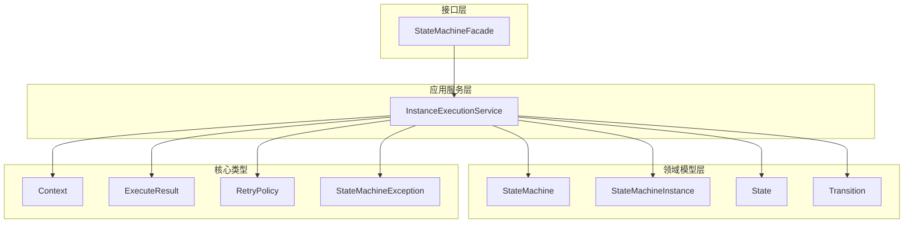
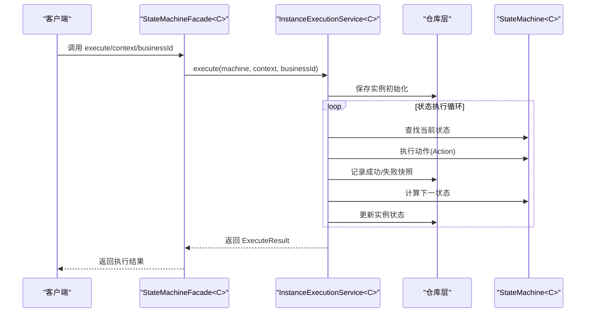
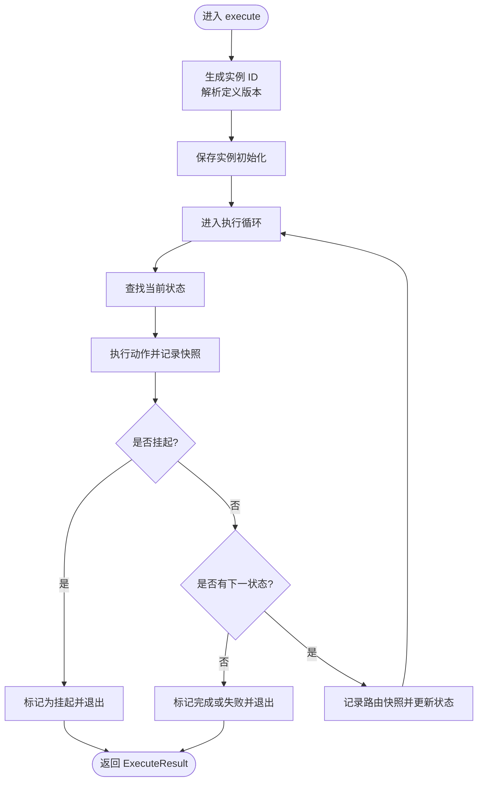
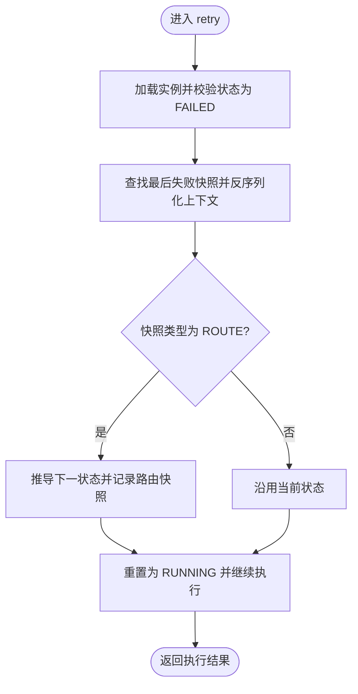
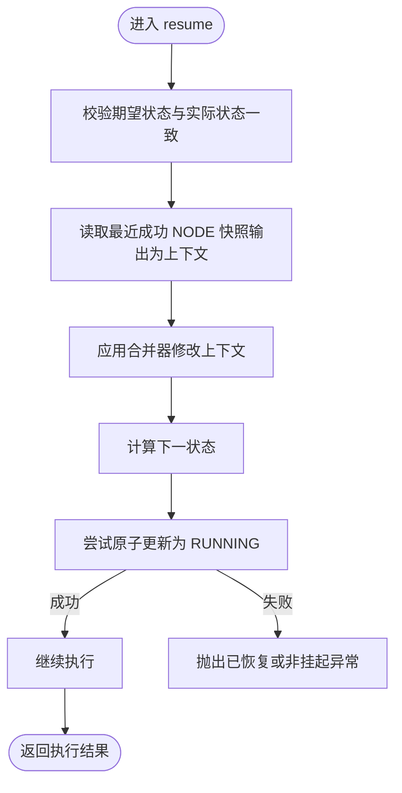
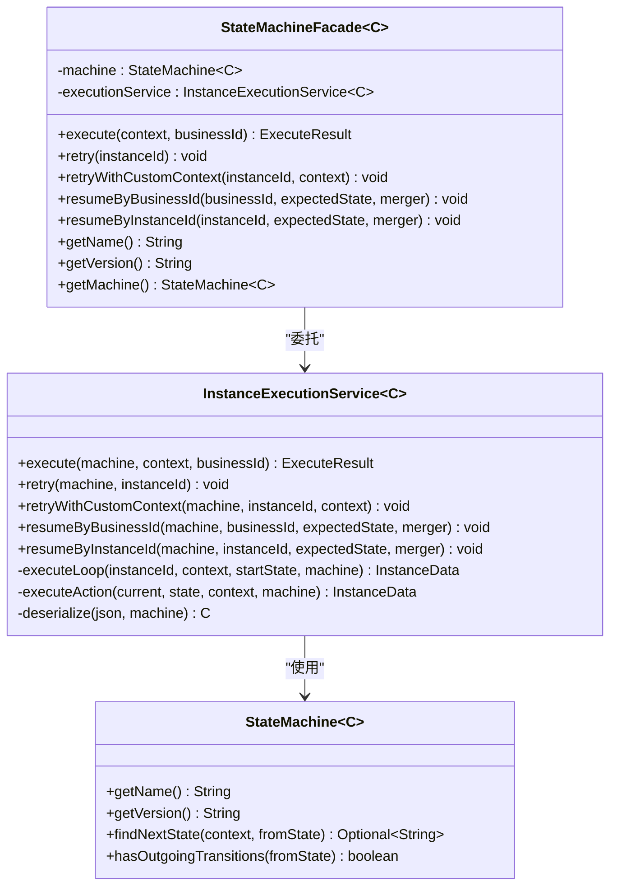
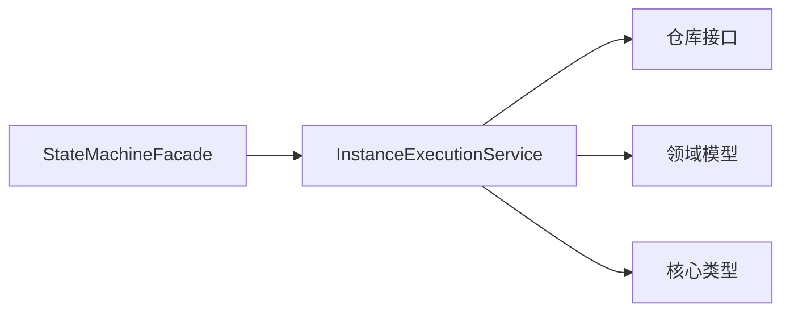

# 门面接口

<cite>
**本文引用的文件**
- [StateMachineFacade.java](file://state-machine-boot-starter/src/main/java/cn/chedejun/statemachine/interfaces/StateMachineFacade.java)
- [InstanceExecutionService.java](file://state-machine-boot-starter/src/main/java/cn/chedejun/statemachine/application/InstanceExecutionService.java)
- [ExecuteResult.java](file://state-machine-boot-starter/src/main/java/cn/chedejun/statemachine/core/ExecuteResult.java)
- [StateMachine.java](file://state-machine-boot-starter/src/main/java/cn/chedejun/statemachine/domain/engine/StateMachine.java)
- [Context.java](file://state-machine-boot-starter/src/main/java/cn/chedejun/statemachine/core/Context.java)
- [OrderContext.java](file://state-machine-demo/src/main/java/cn/chedejun/demo/statemachine/OrderContext.java)
- [OutboundContext.java](file://state-machine-demo/src/main/java/cn/chedejun/demo/statemachine/OutboundContext.java)
- [StateMachineException.java](file://state-machine-boot-starter/src/main/java/cn/chedejun/statemachine/core/StateMachineException.java)
- [StateMachineIntegrationTest.java](file://state-machine-boot-starter/src/test/java/cn/chedejun/statemachine/integration/StateMachineIntegrationTest.java)
- [StateMachineAutoConfiguration.java](file://state-machine-boot-starter/src/main/java/cn/chedejun/statemachine/autoconfigure/StateMachineAutoConfiguration.java)
- [RetryPolicy.java](file://state-machine-boot-starter/src/main/java/cn/chedejun/statemachine/core/RetryPolicy.java)
</cite>

## 目录
1. [简介](#简介)
2. [项目结构](#项目结构)
3. [核心组件](#核心组件)
4. [架构总览](#架构总览)
5. [详细组件分析](#详细组件分析)
6. [依赖分析](#依赖分析)
7. [性能考虑](#性能考虑)
8. [故障排查指南](#故障排查指南)
9. [结论](#结论)
10. [附录](#附录)

## 简介
本文件面向使用者与维护者，系统性梳理门面接口 StateMachineFacade 的完整 API 文档。重点覆盖以下方法：
- execute：同步执行状态机实例
- retry：基于上次失败快照重试
- retryWithCustomContext：带自定义上下文的重试
- resumeByBusinessId：按业务标识恢复挂起实例
- resumeByInstanceId：按实例标识恢复挂起实例

同时说明：
- 泛型参数 C 的使用方式与上下文传递机制
- 方法间调用关系与执行流程
- 异常处理策略与常见错误场景
- 向后兼容性与版本演进要点
- 实战示例与最佳实践

## 项目结构
围绕门面接口的相关模块与职责划分如下：
- 接口层：StateMachineFacade 提供对外统一入口，保持 execute/retry/resume 签名稳定
- 应用服务层：InstanceExecutionService 实现具体执行、重试、恢复逻辑
- 领域模型层：StateMachine、StateMachineInstance、State、Transition 等
- 核心类型：Context、ExecuteResult、RetryPolicy、StateMachineException
- 示例与测试：演示不同上下文类型与集成用法

图表来源
- [StateMachineFacade.java:16-51](file://state-machine-boot-starter/src/main/java/cn/chedejun/statemachine/interfaces/StateMachineFacade.java#L16-L51)
- [InstanceExecutionService.java:25-295](file://state-machine-boot-starter/src/main/java/cn/chedejun/statemachine/application/InstanceExecutionService.java#L25-L295)
- [StateMachine.java:19-76](file://state-machine-boot-starter/src/main/java/cn/chedejun/statemachine/domain/engine/StateMachine.java#L19-L76)
- [Context.java:6-23](file://state-machine-boot-starter/src/main/java/cn/chedejun/statemachine/core/Context.java#L6-L23)
- [ExecuteResult.java:16-57](file://state-machine-boot-starter/src/main/java/cn/chedejun/statemachine/core/ExecuteResult.java#L16-L57)
- [RetryPolicy.java:5-44](file://state-machine-boot-starter/src/main/java/cn/chedejun/statemachine/core/RetryPolicy.java#L5-L44)
- [StateMachineException.java:3-18](file://state-machine-boot-starter/src/main/java/cn/chedejun/statemachine/core/StateMachineException.java#L3-L18)

章节来源
- [StateMachineFacade.java:16-51](file://state-machine-boot-starter/src/main/java/cn/chedejun/statemachine/interfaces/StateMachineFacade.java#L16-L51)
- [InstanceExecutionService.java:25-295](file://state-machine-boot-starter/src/main/java/cn/chedejun/statemachine/application/InstanceExecutionService.java#L25-L295)

## 核心组件
- StateMachineFacade<C>：对外门面，持有 StateMachine<C> 与 InstanceExecutionService<C>，负责将业务请求委托给应用服务层
- InstanceExecutionService<C>：核心执行引擎，封装实例创建、状态流转、动作执行、快照记录、重试与恢复逻辑
- ExecuteResult：执行结果载体，包含实例 ID、机器名称、版本、当前状态、状态码、错误信息、业务标识、创建时间等
- Context：通用上下文容器，支持键值存取；OrderContext/OutboundContext 等业务上下文扩展该基类
- RetryPolicy：重试策略，支持指数退避、最大尝试次数、初始延迟、最大延迟与退避因子
- StateMachineException：状态机异常体系，细分多种异常类型

章节来源
- [StateMachineFacade.java:16-51](file://state-machine-boot-starter/src/main/java/cn/chedejun/statemachine/interfaces/StateMachineFacade.java#L16-L51)
- [InstanceExecutionService.java:25-295](file://state-machine-boot-starter/src/main/java/cn/chedejun/statemachine/application/InstanceExecutionService.java#L25-L295)
- [ExecuteResult.java:16-57](file://state-machine-boot-starter/src/main/java/cn/chedejun/statemachine/core/ExecuteResult.java#L16-L57)
- [Context.java:6-23](file://state-machine-boot-starter/src/main/java/cn/chedejun/statemachine/core/Context.java#L6-L23)
- [RetryPolicy.java:5-44](file://state-machine-boot-starter/src/main/java/cn/chedejun/statemachine/core/RetryPolicy.java#L5-L44)
- [StateMachineException.java:3-18](file://state-machine-boot-starter/src/main/java/cn/chedejun/statemachine/core/StateMachineException.java#L3-L18)

## 架构总览
下图展示从门面到应用服务再到领域模型与基础设施的整体调用链路。

图表来源
- [StateMachineFacade.java:26-28](file://state-machine-boot-starter/src/main/java/cn/chedejun/statemachine/interfaces/StateMachineFacade.java#L26-L28)
- [InstanceExecutionService.java:43-58](file://state-machine-boot-starter/src/main/java/cn/chedejun/statemachine/application/InstanceExecutionService.java#L43-L58)
- [InstanceExecutionService.java:158-193](file://state-machine-boot-starter/src/main/java/cn/chedejun/statemachine/application/InstanceExecutionService.java#L158-L193)

## 详细组件分析

### StateMachineFacade 类 API 详解
- 泛型参数 C：代表上下文类型，用于承载执行过程中的业务数据与状态
- 关键字段
  - machine：领域状态机实例，携带状态、转换、重试策略与上下文类型
  - executionService：应用服务实例，封装执行、重试、恢复等核心逻辑
- 公共方法
  - execute(context, businessId): 同步执行状态机实例，返回执行结果
  - retry(instanceId): 基于最后一次失败快照重试，使用原上下文
  - retryWithCustomContext(instanceId, context): 使用自定义上下文重试
  - resumeByBusinessId(businessId, expectedState, merger): 按业务标识恢复挂起实例
  - resumeByInstanceId(instanceId, expectedState, merger): 按实例标识恢复挂起实例
  - 辅助方法：getName()/getVersion()/getMachine()

章节来源
- [StateMachineFacade.java:16-51](file://state-machine-boot-starter/src/main/java/cn/chedejun/statemachine/interfaces/StateMachineFacade.java#L16-L51)

#### execute(context, businessId)
- 参数
  - context：业务上下文，类型为 C，通常为 OrderContext/OutboundContext 等
  - businessId：业务标识字符串，用于实例与业务数据关联
- 返回值
  - ExecuteResult：包含实例 ID、机器名称、版本、当前状态、状态码、错误信息、业务标识、创建时间
- 异常
  - 当状态不存在或无匹配转换时抛出 StateMachineException 或其子类
- 使用场景
  - 首次执行完整流程，如订单处理、出库流程
- 执行流程
  - 生成实例 ID，解析定义版本，保存实例初始化
  - 进入执行循环：查找状态、执行动作、记录快照、计算下一状态、更新实例状态
  - 返回最终执行结果

章节来源
- [StateMachineFacade.java:26-28](file://state-machine-boot-starter/src/main/java/cn/chedejun/statemachine/interfaces/StateMachineFacade.java#L26-L28)
- [InstanceExecutionService.java:43-58](file://state-machine-boot-starter/src/main/java/cn/chedejun/statemachine/application/InstanceExecutionService.java#L43-L58)
- [InstanceExecutionService.java:158-193](file://state-machine-boot-starter/src/main/java/cn/chedejun/statemachine/application/InstanceExecutionService.java#L158-L193)
- [ExecuteResult.java:16-57](file://state-machine-boot-starter/src/main/java/cn/chedejun/statemachine/core/ExecuteResult.java#L16-L57)

#### retry(instanceId)
- 参数
  - instanceId：失败实例的标识
- 行为
  - 校验实例状态必须为 FAILED
  - 查找最后一条失败快照，反序列化得到原上下文
  - 若快照类型为 ROUTE，则根据状态机规则推导下一状态并记录路由快照
  - 将实例重置为 RUNNING 并继续执行
- 异常
  - 非 FAILED 状态抛出异常
  - 未找到失败快照抛出异常
  - 无匹配转换抛出异常
- 使用场景
  - 自动重试失败节点，无需修改上下文

章节来源
- [StateMachineFacade.java:30-32](file://state-machine-boot-starter/src/main/java/cn/chedejun/statemachine/interfaces/StateMachineFacade.java#L30-L32)
- [InstanceExecutionService.java:79-114](file://state-machine-boot-starter/src/main/java/cn/chedejun/statemachine/application/InstanceExecutionService.java#L79-L114)

#### retryWithCustomContext(instanceId, context)
- 参数
  - instanceId：失败实例的标识
  - context：自定义上下文，类型为 C
- 行为
  - 校验实例存在并加载
  - 将实例重置为 RUNNING，并以新上下文从原状态继续执行
- 异常
  - 实例不存在抛出异常
- 使用场景
  - 上下文变更后重试，如修正库存、金额等

章节来源
- [StateMachineFacade.java:34-36](file://state-machine-boot-starter/src/main/java/cn/chedejun/statemachine/interfaces/StateMachineFacade.java#L34-L36)
- [InstanceExecutionService.java:74-77](file://state-machine-boot-starter/src/main/java/cn/chedejun/statemachine/application/InstanceExecutionService.java#L74-L77)

#### resumeByBusinessId(businessId, expectedState, merger)
- 参数
  - businessId：业务标识
  - expectedState：期望的挂起点名称
  - merger：上下文合并器，对恢复时提取的上下文进行二次修改
- 行为
  - 根据业务标识查找实例，校验状态与期望一致
  - 读取最近一次成功的 NODE 快照输出作为上下文，应用 merger 修改
  - 计算下一状态并尝试原子更新实例为 RUNNING，随后继续执行
- 异常
  - 未找到实例抛出异常
  - 状态不匹配抛出异常
  - 无法继续流转且无出边则标记完成，否则标记失败
- 使用场景
  - 人工干预或外部条件满足后恢复流程

章节来源
- [StateMachineFacade.java:38-41](file://state-machine-boot-starter/src/main/java/cn/chedejun/statemachine/interfaces/StateMachineFacade.java#L38-L41)
- [InstanceExecutionService.java:60-72](file://state-machine-boot-starter/src/main/java/cn/chedejun/statemachine/application/InstanceExecutionService.java#L60-L72)
- [InstanceExecutionService.java:119-152](file://state-machine-boot-starter/src/main/java/cn/chedejun/statemachine/application/InstanceExecutionService.java#L119-L152)

#### resumeByInstanceId(instanceId, expectedState, merger)
- 参数
  - instanceId：实例标识
  - expectedState：期望的挂起点名称
  - merger：上下文合并器
- 行为
  - 与按业务标识恢复类似，但直接通过实例 ID 获取
- 异常
  - 实例不存在、状态不匹配、已恢复或非挂起状态等抛出异常
- 使用场景
  - 精确控制特定实例的恢复

章节来源
- [StateMachineFacade.java:43-46](file://state-machine-boot-starter/src/main/java/cn/chedejun/statemachine/interfaces/StateMachineFacade.java#L43-L46)
- [InstanceExecutionService.java:68-72](file://state-machine-boot-starter/src/main/java/cn/chedejun/statemachine/application/InstanceExecutionService.java#L68-L72)
- [InstanceExecutionService.java:119-152](file://state-machine-boot-starter/src/main/java/cn/chedejun/statemachine/application/InstanceExecutionService.java#L119-L152)

#### 辅助方法
- getName()/getVersion()：获取状态机名称与版本
- getMachine()：获取底层 StateMachine 实例

章节来源
- [StateMachineFacade.java:48-51](file://state-machine-boot-starter/src/main/java/cn/chedejun/statemachine/interfaces/StateMachineFacade.java#L48-L51)

### 执行流程与算法

#### execute 同步执行流程

图表来源
- [InstanceExecutionService.java:43-58](file://state-machine-boot-starter/src/main/java/cn/chedejun/statemachine/application/InstanceExecutionService.java#L43-L58)
- [InstanceExecutionService.java:158-193](file://state-machine-boot-starter/src/main/java/cn/chedejun/statemachine/application/InstanceExecutionService.java#L158-L193)

#### retry 重试流程

图表来源
- [InstanceExecutionService.java:79-114](file://state-machine-boot-starter/src/main/java/cn/chedejun/statemachine/application/InstanceExecutionService.java#L79-L114)

#### resume 恢复流程

图表来源
- [InstanceExecutionService.java:60-72](file://state-machine-boot-starter/src/main/java/cn/chedejun/statemachine/application/InstanceExecutionService.java#L60-L72)
- [InstanceExecutionService.java:119-152](file://state-machine-boot-starter/src/main/java/cn/chedejun/statemachine/application/InstanceExecutionService.java#L119-L152)

### 类关系图

图表来源
- [StateMachineFacade.java:16-51](file://state-machine-boot-starter/src/main/java/cn/chedejun/statemachine/interfaces/StateMachineFacade.java#L16-L51)
- [InstanceExecutionService.java:25-295](file://state-machine-boot-starter/src/main/java/cn/chedejun/statemachine/application/InstanceExecutionService.java#L25-L295)
- [StateMachine.java:19-76](file://state-machine-boot-starter/src/main/java/cn/chedejun/statemachine/domain/engine/StateMachine.java#L19-L76)

## 依赖分析
- 低耦合高内聚：门面仅持有应用服务引用，应用服务再组合仓库与领域模型，职责清晰
- 可替换性：通过 Spring 自动装配，可替换仓库实现与序列化器
- 循环依赖：无直接循环依赖，调用方向自上而下

图表来源
- [StateMachineFacade.java:16-51](file://state-machine-boot-starter/src/main/java/cn/chedejun/statemachine/interfaces/StateMachineFacade.java#L16-L51)
- [InstanceExecutionService.java:25-295](file://state-machine-boot-starter/src/main/java/cn/chedejun/statemachine/application/InstanceExecutionService.java#L25-L295)

章节来源
- [StateMachineAutoConfiguration.java:32-147](file://state-machine-boot-starter/src/main/java/cn/chedejun/statemachine/autoconfigure/StateMachineAutoConfiguration.java#L32-L147)

## 性能考虑
- 快照与实例更新：执行循环中频繁写入快照与更新实例状态，建议合理设置重试策略，避免过长执行时间
- 序列化开销：上下文序列化/反序列化可能成为瓶颈，建议控制上下文大小与复杂度
- 原子更新：恢复时采用原子更新避免并发冲突，减少额外查询
- 重试策略：指数退避可降低瞬时压力，但需结合业务 SLA 调整最大尝试次数与延迟上限

## 故障排查指南
- 常见异常
  - 状态不存在：StateMachineException.StateNotFoundException
  - 无匹配转换：StateMachineException.NoMatchingTransitionException
  - 实例处于终止状态：StateMachineException.TerminalStateException
  - 实例不存在：应用服务内部抛出异常
- 排查步骤
  - 检查实例状态与期望状态是否一致
  - 核对业务标识与实例绑定关系
  - 确认上下文序列化/反序列化是否正确
  - 查看快照表中最后失败快照与路由快照
- 单元测试参考
  - 集成测试覆盖了成功流程、失败重试、挂起恢复、状态不匹配等场景

章节来源
- [StateMachineException.java:3-18](file://state-machine-boot-starter/src/main/java/cn/chedejun/statemachine/core/StateMachineException.java#L3-L18)
- [InstanceExecutionService.java:166-170](file://state-machine-boot-starter/src/main/java/cn/chedejun/statemachine/application/InstanceExecutionService.java#L166-L170)
- [InstanceExecutionService.java:119-152](file://state-machine-boot-starter/src/main/java/cn/chedejun/statemachine/application/InstanceExecutionService.java#L119-L152)
- [StateMachineIntegrationTest.java:418-468](file://state-machine-boot-starter/src/test/java/cn/chedejun/statemachine/integration/StateMachineIntegrationTest.java#L418-L468)

## 结论
StateMachineFacade 提供了简洁稳定的门面 API，屏蔽了状态机执行细节，便于业务侧快速接入。配合 InstanceExecutionService 的重试与恢复能力，可覆盖大多数生产场景。建议：
- 明确上下文设计，避免过大或嵌套过深
- 合理配置重试策略，平衡可靠性与性能
- 在挂起恢复前严格校验期望状态，确保一致性
- 通过测试用例覆盖关键路径，保障稳定性

## 附录

### 泛型参数 C 与上下文传递
- C 为上下文类型参数，由 StateMachine 指定
- Context 为基础上下文容器，支持键值存取
- OrderContext/OutboundContext 展示了业务上下文的扩展方式
- 上下文在执行循环中被序列化存储为快照输入/输出，恢复时反序列化并允许 merger 再次修改

章节来源
- [StateMachine.java:29-48](file://state-machine-boot-starter/src/main/java/cn/chedejun/statemachine/domain/engine/StateMachine.java#L29-L48)
- [Context.java:6-23](file://state-machine-boot-starter/src/main/java/cn/chedejun/statemachine/core/Context.java#L6-L23)
- [OrderContext.java:10-98](file://state-machine-demo/src/main/java/cn/chedejun/demo/statemachine/OrderContext.java#L10-L98)
- [OutboundContext.java:8-42](file://state-machine-demo/src/main/java/cn/chedejun/demo/statemachine/OutboundContext.java#L8-L42)
- [InstanceExecutionService.java:247-260](file://state-machine-boot-starter/src/main/java/cn/chedejun/statemachine/application/InstanceExecutionService.java#L247-L260)

### 重试策略与退避
- RetryPolicy 支持指数退避，可通过构建器配置最大尝试次数、初始延迟、最大延迟与退避因子
- 应用服务在执行动作失败时按策略延时并重试，超过上限后标记失败

章节来源
- [RetryPolicy.java:5-44](file://state-machine-boot-starter/src/main/java/cn/chedejun/statemachine/core/RetryPolicy.java#L5-L44)
- [InstanceExecutionService.java:200-237](file://state-machine-boot-starter/src/main/java/cn/chedejun/statemachine/application/InstanceExecutionService.java#L200-L237)

### 向后兼容性与版本演进
- 门面层保持 execute/retry/resume 签名稳定，便于升级
- 版本号来自 StateMachine，定义持久化至定义表，支持多版本并存
- 自动配置通过 BeanPostProcessor 注册状态机与门面，简化接入

章节来源
- [StateMachineFacade.java:12-15](file://state-machine-boot-starter/src/main/java/cn/chedejun/statemachine/interfaces/StateMachineFacade.java#L12-L15)
- [StateMachine.java:43-48](file://state-machine-boot-starter/src/main/java/cn/chedejun/statemachine/domain/engine/StateMachine.java#L43-L48)
- [StateMachineAutoConfiguration.java:72-109](file://state-machine-boot-starter/src/main/java/cn/chedejun/statemachine/autoconfigure/StateMachineAutoConfiguration.java#L72-L109)

### 使用示例（路径指引）
- 同步执行
  - [StateMachineIntegrationTest.java:227-253](file://state-machine-boot-starter/src/test/java/cn/chedejun/statemachine/integration/StateMachineIntegrationTest.java#L227-L253)
- 失败重试
  - [StateMachineIntegrationTest.java:277-288](file://state-machine-boot-starter/src/test/java/cn/chedejun/statemachine/integration/StateMachineIntegrationTest.java#L277-L288)
  - [StateMachineIntegrationTest.java:292-300](file://state-machine-boot-starter/src/test/java/cn/chedejun/statemachine/integration/StateMachineIntegrationTest.java#L292-L300)
- 挂起恢复
  - [StateMachineIntegrationTest.java:398-414](file://state-machine-boot-starter/src/test/java/cn/chedejun/statemachine/integration/StateMachineIntegrationTest.java#L398-L414)
  - [StateMachineIntegrationTest.java:418-427](file://state-machine-boot-starter/src/test/java/cn/chedejun/statemachine/integration/StateMachineIntegrationTest.java#L418-L427)
  - [StateMachineIntegrationTest.java:431-445](file://state-machine-boot-starter/src/test/java/cn/chedejun/statemachine/integration/StateMachineIntegrationTest.java#L431-L445)