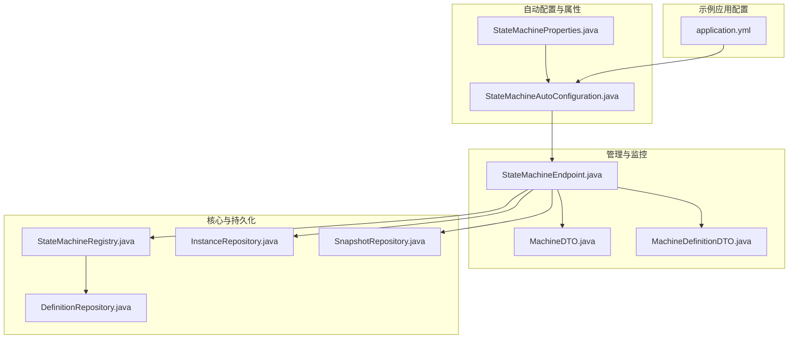
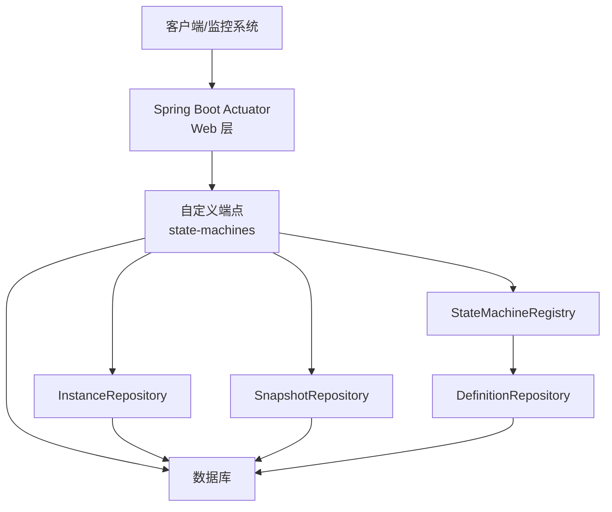
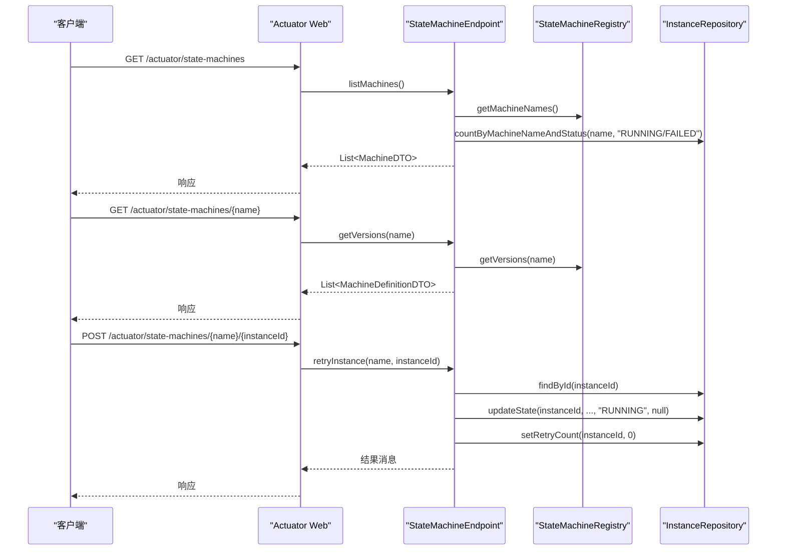
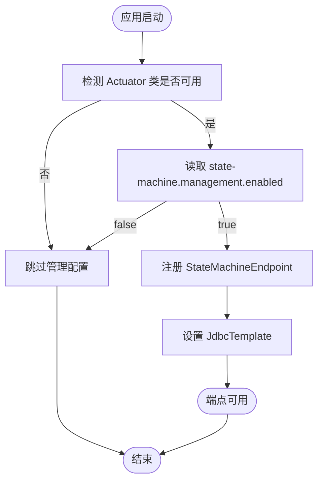
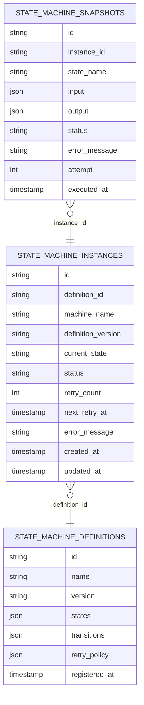
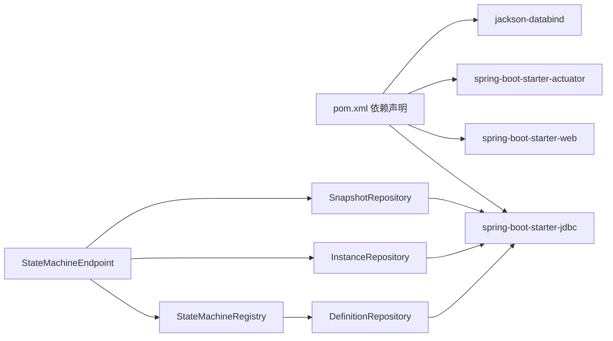

# Actuator监控

<cite>
**本文引用的文件**
- [StateMachineEndpoint.java](file://src/main/java/cn/chedejun/statemachine/management/StateMachineEndpoint.java)
- [StateMachineAutoConfiguration.java](file://src/main/java/cn/chedejun/statemachine/autoconfigure/StateMachineAutoConfiguration.java)
- [StateMachineProperties.java](file://src/main/java/cn/chedejun/statemachine/autoconfigure/StateMachineProperties.java)
- [MachineDTO.java](file://src/main/java/cn/chedejun/statemachine/management/dto/MachineDTO.java)
- [MachineDefinitionDTO.java](file://src/main/java/cn/chedejun/statemachine/management/dto/MachineDefinitionDTO.java)
- [InstanceDTO.java](file://src/main/java/cn/chedejun/statemachine/management/dto/InstanceDTO.java)
- [SnapshotDTO.java](file://src/main/java/cn/chedejun/statemachine/management/dto/SnapshotDTO.java)
- [StateMachineRegistry.java](file://src/main/java/cn/chedejun/statemachine/core/StateMachineRegistry.java)
- [DefinitionRepository.java](file://src/main/java/cn/chedejun/statemachine/persistence/DefinitionRepository.java)
- [InstanceRepository.java](file://src/main/java/cn/chedejun/statemachine/persistence/InstanceRepository.java)
- [SnapshotRepository.java](file://src/main/java/cn/chedejun/statemachine/persistence/SnapshotRepository.java)
- [application.yml](file://demo/src/main/resources/application.yml)
- [pom.xml](file://pom.xml)
- [README.md](file://README.md)
</cite>

## 目录
1. [简介](#简介)
2. [项目结构](#项目结构)
3. [核心组件](#核心组件)
4. [架构总览](#架构总览)
5. [详细组件分析](#详细组件分析)
6. [依赖分析](#依赖分析)
7. [性能考量](#性能考量)
8. [故障排查指南](#故障排查指南)
9. [结论](#结论)
10. [附录](#附录)

## 简介
本文件系统性阐述状态机监控能力，重点围绕 Spring Boot Actuator 的集成与扩展，说明如何通过自定义端点暴露状态机运行时信息，并提供状态机健康度量、实例统计与重试操作等监控能力。内容涵盖：
- 监控端点的启用与暴露方式
- 状态机健康检查与实时状态查询
- StateMachineEndpoint 的实现原理与指标含义
- 监控数据解读与告警配置建议
- 与 Spring Boot Actuator 的集成与自定义扩展
- 生产环境监控最佳实践与性能指标收集

## 项目结构
该项目采用模块化组织：核心状态机逻辑、持久化层、管理与控制台、自动装配与属性配置。Actuator 相关监控以自定义端点形式提供，配合自动配置按需启用。

图表来源
- [StateMachineAutoConfiguration.java:58-68](file://src/main/java/cn/chedejun/statemachine/autoconfigure/StateMachineAutoConfiguration.java#L58-L68)
- [StateMachineEndpoint.java:16-30](file://src/main/java/cn/chedejun/statemachine/management/StateMachineEndpoint.java#L16-L30)
- [StateMachineRegistry.java:9-18](file://src/main/java/cn/chedejun/statemachine/core/StateMachineRegistry.java#L9-L18)
- [DefinitionRepository.java:15-22](file://src/main/java/cn/chedejun/statemachine/persistence/DefinitionRepository.java#L15-L22)
- [InstanceRepository.java:11-13](file://src/main/java/cn/chedejun/statemachine/persistence/InstanceRepository.java#L11-L13)
- [SnapshotRepository.java:11-13](file://src/main/java/cn/chedejun/statemachine/persistence/SnapshotRepository.java#L11-L13)
- [application.yml:18-23](file://demo/src/main/resources/application.yml#L18-L23)

章节来源
- [StateMachineAutoConfiguration.java:22-80](file://src/main/java/cn/chedejun/statemachine/autoconfigure/StateMachineAutoConfiguration.java#L22-L80)
- [StateMachineEndpoint.java:16-73](file://src/main/java/cn/chedejun/statemachine/management/StateMachineEndpoint.java#L16-L73)
- [application.yml:18-23](file://demo/src/main/resources/application.yml#L18-L23)

## 核心组件
- 自定义端点 StateMachineEndpoint：通过 @Endpoint(id="state-machines") 暴露读写操作，提供状态机清单、版本详情、实例重试等能力。
- 管理配置 StateMachineAutoConfiguration：在检测到 Actuator 存在且属性开启时，注册 StateMachineEndpoint；同时注入 JdbcTemplate 供仓库层使用。
- DTO 对象：MachineDTO、MachineDefinitionDTO、InstanceDTO、SnapshotDTO 提供标准化输出结构。
- 注册表与仓库：StateMachineRegistry 负责状态机注册与版本管理；DefinitionRepository/InstanceRepository/SnapshotRepository 提供持久化读写。

章节来源
- [StateMachineEndpoint.java:16-73](file://src/main/java/cn/chedejun/statemachine/management/StateMachineEndpoint.java#L16-L73)
- [StateMachineAutoConfiguration.java:58-68](file://src/main/java/cn/chedejun/statemachine/autoconfigure/StateMachineAutoConfiguration.java#L58-L68)
- [MachineDTO.java:1-3](file://src/main/java/cn/chedejun/statemachine/management/dto/MachineDTO.java#L1-L3)
- [MachineDefinitionDTO.java:1-8](file://src/main/java/cn/chedejun/statemachine/management/dto/MachineDefinitionDTO.java#L1-L8)
- [InstanceDTO.java:1-6](file://src/main/java/cn/chedejun/statemachine/management/dto/InstanceDTO.java#L1-L6)
- [SnapshotDTO.java:1-5](file://src/main/java/cn/chedejun/statemachine/management/dto/SnapshotDTO.java#L1-L5)
- [StateMachineRegistry.java:9-73](file://src/main/java/cn/chedejun/statemachine/core/StateMachineRegistry.java#L9-L73)
- [DefinitionRepository.java:15-78](file://src/main/java/cn/chedejun/statemachine/persistence/DefinitionRepository.java#L15-L78)
- [InstanceRepository.java:11-66](file://src/main/java/cn/chedejun/statemachine/persistence/InstanceRepository.java#L11-L66)
- [SnapshotRepository.java:11-55](file://src/main/java/cn/chedejun/statemachine/persistence/SnapshotRepository.java#L11-L55)

## 架构总览
下图展示 Actuator 监控端点与状态机运行时的关系：端点依赖注册表与仓库层，通过 JdbcTemplate 访问数据库，返回结构化的监控数据。

图表来源
- [StateMachineEndpoint.java:16-30](file://src/main/java/cn/chedejun/statemachine/management/StateMachineEndpoint.java#L16-L30)
- [StateMachineRegistry.java:9-18](file://src/main/java/cn/chedejun/statemachine/core/StateMachineRegistry.java#L9-L18)
- [DefinitionRepository.java:15-22](file://src/main/java/cn/chedejun/statemachine/persistence/DefinitionRepository.java#L15-L22)
- [InstanceRepository.java:11-13](file://src/main/java/cn/chedejun/statemachine/persistence/InstanceRepository.java#L11-L13)
- [SnapshotRepository.java:11-13](file://src/main/java/cn/chedejun/statemachine/persistence/SnapshotRepository.java#L11-L13)

## 详细组件分析

### 自定义端点：StateMachineEndpoint
- 端点 ID：state-machines
- 读操作：
  - 列出所有状态机：返回名称、版本数、运行中实例数、失败实例数
  - 获取指定状态机版本：解析存储的 JSON 字段为结构化对象，包含状态、转换、重试策略等
- 写操作：
  - 重试实例：将失败实例重置为运行中并清零重试计数，提示后续调用业务重试接口

图表来源
- [StateMachineEndpoint.java:32-71](file://src/main/java/cn/chedejun/statemachine/management/StateMachineEndpoint.java#L32-L71)
- [StateMachineRegistry.java:57-65](file://src/main/java/cn/chedejun/statemachine/core/StateMachineRegistry.java#L57-L65)
- [InstanceRepository.java:23-38](file://src/main/java/cn/chedejun/statemachine/persistence/InstanceRepository.java#L23-L38)

章节来源
- [StateMachineEndpoint.java:16-73](file://src/main/java/cn/chedejun/statemachine/management/StateMachineEndpoint.java#L16-L73)

### 管理配置与自动装配
- 条件注解：
  - @ConditionalOnClass(org.springframework.boot.actuate.endpoint.annotation.Endpoint.class)：仅当 Actuator 可用时启用
  - @ConditionalOnProperty(prefix = "state-machine.management", name = "enabled", havingValue = "true", matchIfMissing = true)：默认启用
- 注入与初始化：
  - 注册 StateMachineEndpoint 并设置 JdbcTemplate，以便仓库层可用
  - 通过 BeanPostProcessor 将已创建的状态机注入模板与注册表，并完成注册

图表来源
- [StateMachineAutoConfiguration.java:58-68](file://src/main/java/cn/chedejun/statemachine/autoconfigure/StateMachineAutoConfiguration.java#L58-L68)
- [StateMachineAutoConfiguration.java:44-56](file://src/main/java/cn/chedejun/statemachine/autoconfigure/StateMachineAutoConfiguration.java#L44-L56)

章节来源
- [StateMachineAutoConfiguration.java:22-80](file://src/main/java/cn/chedejun/statemachine/autoconfigure/StateMachineAutoConfiguration.java#L22-L80)
- [StateMachineProperties.java:32-33](file://src/main/java/cn/chedejun/statemachine/autoconfigure/StateMachineProperties.java#L32-L33)

### 数据模型与监控指标
- MachineDTO：状态机名称、版本数量、运行中实例数、失败实例数
- MachineDefinitionDTO：版本定义的结构化视图（状态、转换、重试策略等）
- 实例与快照：通过仓库层统计与查询，支撑实时状态与历史轨迹

图表来源
- [DefinitionRepository.java:24-46](file://src/main/java/cn/chedejun/statemachine/persistence/DefinitionRepository.java#L24-L46)
- [InstanceRepository.java:15-21](file://src/main/java/cn/chedejun/statemachine/persistence/InstanceRepository.java#L15-L21)
- [SnapshotRepository.java:15-31](file://src/main/java/cn/chedejun/statemachine/persistence/SnapshotRepository.java#L15-L31)

章节来源
- [MachineDTO.java:1-3](file://src/main/java/cn/chedejun/statemachine/management/dto/MachineDTO.java#L1-L3)
- [MachineDefinitionDTO.java:1-8](file://src/main/java/cn/chedejun/statemachine/management/dto/MachineDefinitionDTO.java#L1-L8)
- [InstanceDTO.java:1-6](file://src/main/java/cn/chedejun/statemachine/management/dto/InstanceDTO.java#L1-L6)
- [SnapshotDTO.java:1-5](file://src/main/java/cn/chedejun/statemachine/management/dto/SnapshotDTO.java#L1-L5)
- [DefinitionRepository.java:68-76](file://src/main/java/cn/chedejun/statemachine/persistence/DefinitionRepository.java#L68-L76)
- [InstanceRepository.java:53-60](file://src/main/java/cn/chedejun/statemachine/persistence/InstanceRepository.java#L53-L60)
- [SnapshotRepository.java:45-50](file://src/main/java/cn/chedejun/statemachine/persistence/SnapshotRepository.java#L45-L50)

### 与 Spring Boot Actuator 的集成
- 端点暴露：通过 application.yml 中的 management.endpoints.web.exposure.include 指定暴露 state-machines 与 health
- Actuator 依赖：pom.xml 中引入 spring-boot-starter-actuator，确保端点可用
- 控制台集成：console.enabled=true 时提供前端控制台页面，便于可视化查看

章节来源
- [application.yml:18-23](file://demo/src/main/resources/application.yml#L18-L23)
- [pom.xml:46-47](file://pom.xml#L46-L47)
- [StateMachineAutoConfiguration.java:70-78](file://src/main/java/cn/chedejun/statemachine/autoconfigure/StateMachineAutoConfiguration.java#L70-L78)

### 监控指标解读与告警建议
- 运行中实例数与失败实例数：
  - 健康度：失败实例占比过高或持续增长，可能指示异常或阻塞
  - 告警阈值：失败实例数超过基线一定比例、或连续周期内未下降
- 版本变更与定义一致性：
  - 版本数量变化频繁可能影响稳定性，建议对版本升级进行告警
- 重试策略与延迟：
  - 重试次数与下次重试时间可作为弹性与恢复能力的参考
- 建议的告警维度：
  - 失败实例总数、失败率、平均恢复时间、重试次数分布、错误类型分布

章节来源
- [StateMachineEndpoint.java:32-43](file://src/main/java/cn/chedejun/statemachine/management/StateMachineEndpoint.java#L32-L43)
- [InstanceRepository.java:44-47](file://src/main/java/cn/chedejun/statemachine/persistence/InstanceRepository.java#L44-L47)

### 自定义监控扩展
- 扩展端点：可新增读/写操作，如导出实例详情、批量重试、状态迁移追踪
- 指标采集：结合 Actuator 的指标体系，增加自定义 Meter 或使用 Micrometer 报告运行时指标
- 前端控制台：利用现有 ConsoleController 与静态资源，扩展更多可视化视图

章节来源
- [StateMachineAutoConfiguration.java:70-78](file://src/main/java/cn/chedejun/statemachine/autoconfigure/StateMachineAutoConfiguration.java#L70-L78)

## 依赖分析
- 外部依赖：
  - Spring Boot Starter JDBC/Web/Actuator：提供数据库访问、Web 服务与监控端点
  - Jackson：序列化/反序列化状态机定义中的 JSON 字段
- 内部依赖：
  - 端点依赖注册表与仓库层；注册表依赖定义仓库；仓库层依赖 JdbcTemplate

图表来源
- [pom.xml:33-67](file://pom.xml#L33-L67)
- [StateMachineEndpoint.java:16-30](file://src/main/java/cn/chedejun/statemachine/management/StateMachineEndpoint.java#L16-L30)
- [StateMachineRegistry.java:9-18](file://src/main/java/cn/chedejun/statemachine/core/StateMachineRegistry.java#L9-L18)
- [DefinitionRepository.java:15-22](file://src/main/java/cn/chedejun/statemachine/persistence/DefinitionRepository.java#L15-L22)
- [InstanceRepository.java:11-13](file://src/main/java/cn/chedejun/statemachine/persistence/InstanceRepository.java#L11-L13)
- [SnapshotRepository.java:11-13](file://src/main/java/cn/chedejun/statemachine/persistence/SnapshotRepository.java#L11-L13)

章节来源
- [pom.xml:33-67](file://pom.xml#L33-L67)

## 性能考量
- 查询优化：
  - 对实例表按 machine_name 与 status 建立索引，提升统计与分页查询效率
  - 对定义表按 name/version 排序查询，避免全表扫描
- 序列化成本：
  - 定义 JSON 字段的解析与序列化开销可控，但应避免在高频路径重复解析
- 并发与一致性：
  - 注册表使用并发容器，避免多线程竞争；更新实例状态时使用原子 SQL，保证一致性
- 监控开销：
  - 端点读操作为轻量查询，写操作（重试）仅做必要字段更新，整体开销较低

章节来源
- [InstanceRepository.java:44-51](file://src/main/java/cn/chedejun/statemachine/persistence/InstanceRepository.java#L44-L51)
- [DefinitionRepository.java:60-66](file://src/main/java/cn/chedejun/statemachine/persistence/DefinitionRepository.java#L60-L66)
- [StateMachineRegistry.java:12](file://src/main/java/cn/chedejun/statemachine/core/StateMachineRegistry.java#L12)
- [StateMachineEndpoint.java:62-71](file://src/main/java/cn/chedejun/statemachine/management/StateMachineEndpoint.java#L62-L71)

## 故障排查指南
- 端点不可用：
  - 确认已引入 Actuator 依赖并在配置中暴露 state-machines
  - 检查 state-machine.management.enabled 是否为 true
- 数据为空或不一致：
  - 核查数据库连接与表结构是否正确初始化
  - 确认状态机注册成功，定义记录存在
- 重试失败：
  - 确认实例状态为 FAILED，否则无法重试
  - 重试后需调用业务层的 retry 接口并传入新上下文

章节来源
- [application.yml:18-23](file://demo/src/main/resources/application.yml#L18-L23)
- [pom.xml:46-47](file://pom.xml#L46-L47)
- [StateMachineAutoConfiguration.java:58-68](file://src/main/java/cn/chedejun/statemachine/autoconfigure/StateMachineAutoConfiguration.java#L58-L68)
- [StateMachineEndpoint.java:62-71](file://src/main/java/cn/chedejun/statemachine/management/StateMachineEndpoint.java#L62-L71)

## 结论
该实现通过 Spring Boot Actuator 的自定义端点，提供了状态机的健康度量与实时状态查询能力。端点设计简洁、职责清晰，结合注册表与仓库层实现了从定义到实例的完整监控闭环。建议在生产环境中配合完善的告警策略与日志追踪，持续优化查询与序列化性能，并按需扩展更多可视化与导出能力。

## 附录
- 快速上手与配置参考见项目 README
- 示例应用配置展示了端点暴露与管理开关

章节来源
- [README.md:55-65](file://README.md#L55-L65)
- [application.yml:11-16](file://demo/src/main/resources/application.yml#L11-L16)