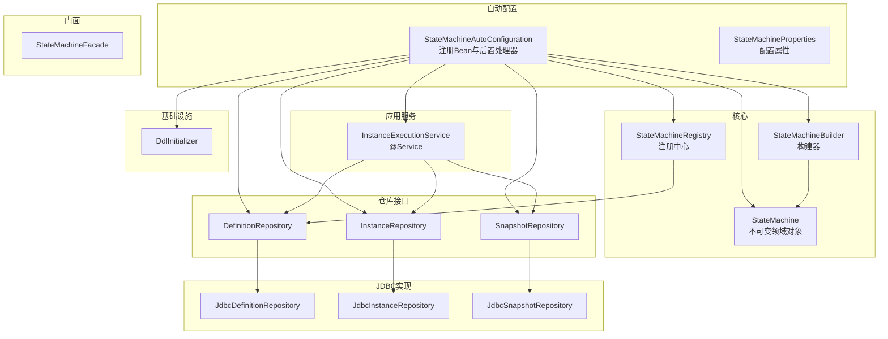
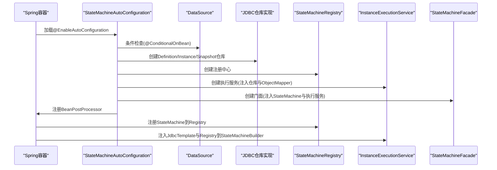
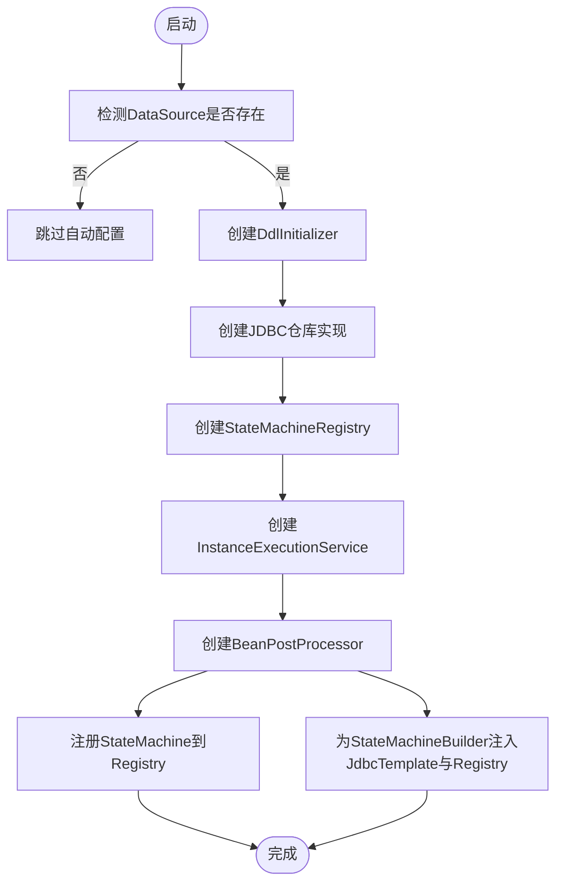
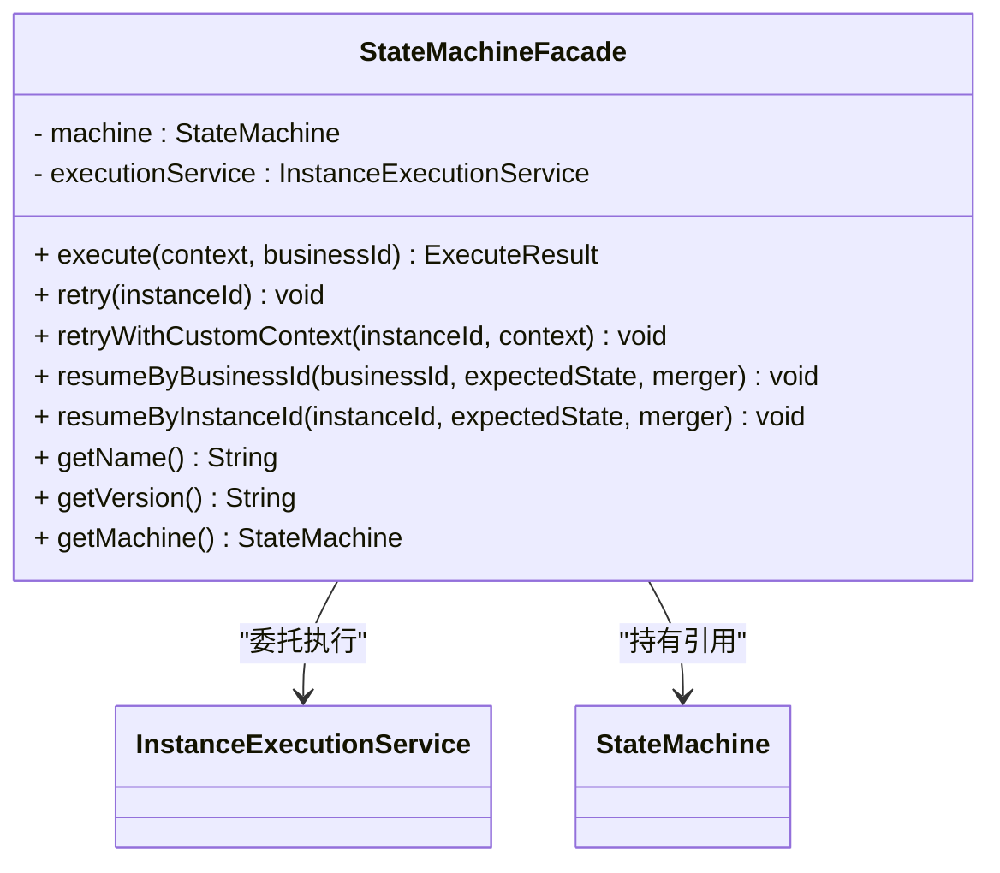
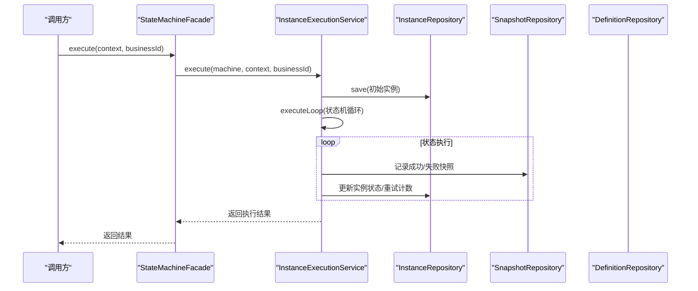
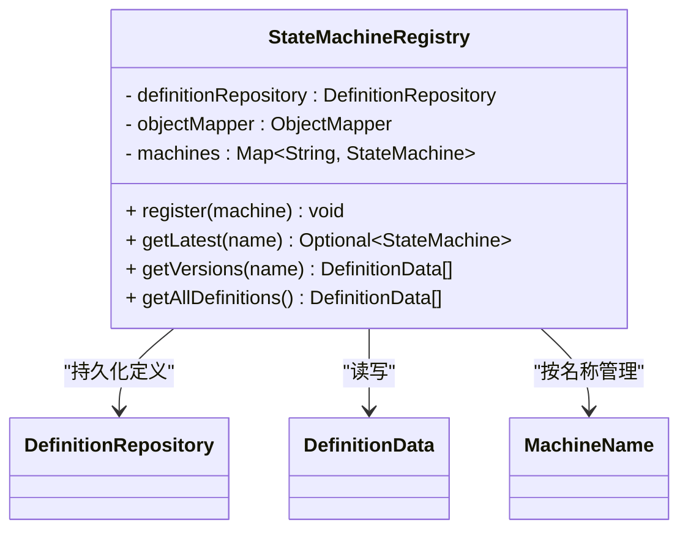
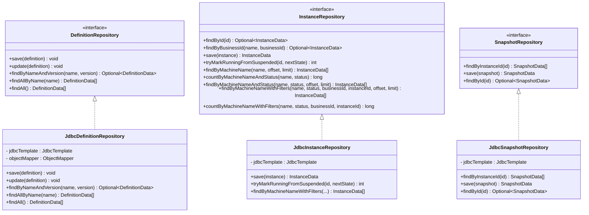
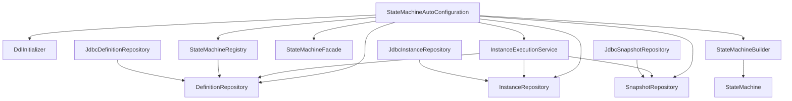

# Bean注册与管理

<cite>
**本文档引用的文件**
- [StateMachineAutoConfiguration.java](file://state-machine-boot-starter/src/main/java/cn/chedejun/statemachine/autoconfigure/StateMachineAutoConfiguration.java)
- [StateMachineProperties.java](file://state-machine-boot-starter/src/main/java/cn/chedejun/statemachine/autoconfigure/StateMachineProperties.java)
- [StateMachineFacade.java](file://state-machine-boot-starter/src/main/java/cn/chedejun/statemachine/interfaces/StateMachineFacade.java)
- [InstanceExecutionService.java](file://state-machine-boot-starter/src/main/java/cn/chedejun/statemachine/application/InstanceExecutionService.java)
- [StateMachineRegistry.java](file://state-machine-boot-starter/src/main/java/cn/chedejun/statemachine/core/StateMachineRegistry.java)
- [StateMachineBuilder.java](file://state-machine-boot-starter/src/main/java/cn/chedejun/statemachine/core/StateMachineBuilder.java)
- [DefinitionRepository.java](file://state-machine-boot-starter/src/main/java/cn/chedejun/statemachine/domain/repository/DefinitionRepository.java)
- [InstanceRepository.java](file://state-machine-boot-starter/src/main/java/cn/chedejun/statemachine/domain/repository/InstanceRepository.java)
- [SnapshotRepository.java](file://state-machine-boot-starter/src/main/java/cn/chedejun/statemachine/domain/repository/SnapshotRepository.java)
- [JdbcDefinitionRepository.java](file://state-machine-boot-starter/src/main/java/cn/chedejun/statemachine/infrastructure/persistence/JdbcDefinitionRepository.java)
- [JdbcInstanceRepository.java](file://state-machine-boot-starter/src/main/java/cn/chedejun/statemachine/infrastructure/persistence/JdbcInstanceRepository.java)
- [JdbcSnapshotRepository.java](file://state-machine-boot-starter/src/main/java/cn/chedejun/statemachine/infrastructure/persistence/JdbcSnapshotRepository.java)
- [StateMachine.java](file://state-machine-boot-starter/src/main/java/cn/chedejun/statemachine/domain/engine/StateMachine.java)
- [DdlInitializer.java](file://state-machine-boot-starter/src/main/java/cn/chedejun/statemachine/persistence/DdlInitializer.java)
- [spring.factories](file://state-machine-boot-starter/src/main/resources/META-INF/spring.factories)
- [application.yml](file://state-machine-boot-starter/src/test/resources/application.yml)
- [application.yml](file://state-machine-demo/src/main/resources/application.yml)
</cite>

## 目录
1. [简介](#简介)
2. [项目结构](#项目结构)
3. [核心组件](#核心组件)
4. [架构总览](#架构总览)
5. [详细组件分析](#详细组件分析)
6. [依赖关系分析](#依赖关系分析)
7. [性能考虑](#性能考虑)
8. [故障排除指南](#故障排除指南)
9. [结论](#结论)
10. [附录](#附录)

## 简介
本文件系统性阐述状态机Boot Starter中的Bean注册与管理机制，重点覆盖以下内容：
- 自动配置中各类Bean的注册流程与条件
- 关键Bean（如StateMachineFacade、InstanceExecutionService、Repository接口实现等）的创建、作用域、生命周期与依赖关系
- 自定义Bean注册与扩展替换的最佳实践
- Bean覆盖与替换机制及调试方法

## 项目结构
该项目采用模块化设计，核心自动配置位于boot-starter模块，通过Spring Factories机制进行自动装配。关键目录与职责如下：
- autoconfigure：自动配置类与属性绑定
- application：应用服务层（如执行服务）
- core：核心模型与构建器
- domain：领域模型与仓库接口
- infrastructure/persistence：基于JDBC的仓库实现
- interfaces：对外门面接口
- management：管理端点与控制台
- persistence：DDL初始化
- resources/META-INF：Spring Factories声明

图表来源
- [StateMachineAutoConfiguration.java:32-149](file://state-machine-boot-starter/src/main/java/cn/chedejun/statemachine/autoconfigure/StateMachineAutoConfiguration.java#L32-L149)
- [StateMachineProperties.java:1-42](file://state-machine-boot-starter/src/main/java/cn/chedejun/statemachine/autoconfigure/StateMachineProperties.java#L1-L42)
- [InstanceExecutionService.java:24-41](file://state-machine-boot-starter/src/main/java/cn/chedejun/statemachine/application/InstanceExecutionService.java#L24-L41)
- [StateMachineRegistry.java:17-27](file://state-machine-boot-starter/src/main/java/cn/chedejun/statemachine/core/StateMachineRegistry.java#L17-L27)
- [StateMachineBuilder.java:9-24](file://state-machine-boot-starter/src/main/java/cn/chedejun/statemachine/core/StateMachineBuilder.java#L9-L24)
- [DefinitionRepository.java:1-16](file://state-machine-boot-starter/src/main/java/cn/chedejun/statemachine/domain/repository/DefinitionRepository.java#L1-L16)
- [InstanceRepository.java:1-26](file://state-machine-boot-starter/src/main/java/cn/chedejun/statemachine/domain/repository/InstanceRepository.java#L1-L26)
- [SnapshotRepository.java:1-16](file://state-machine-boot-starter/src/main/java/cn/chedejun/statemachine/domain/repository/SnapshotRepository.java#L1-L16)
- [JdbcDefinitionRepository.java:18-27](file://state-machine-boot-starter/src/main/java/cn/chedejun/statemachine/infrastructure/persistence/JdbcDefinitionRepository.java#L18-L27)
- [JdbcInstanceRepository.java:16-20](file://state-machine-boot-starter/src/main/java/cn/chedejun/statemachine/infrastructure/persistence/JdbcInstanceRepository.java#L16-L20)
- [JdbcSnapshotRepository.java:18-23](file://state-machine-boot-starter/src/main/java/cn/chedejun/statemachine/infrastructure/persistence/JdbcSnapshotRepository.java#L18-L23)
- [StateMachine.java:19-41](file://state-machine-boot-starter/src/main/java/cn/chedejun/statemachine/domain/engine/StateMachine.java#L19-L41)
- [DdlInitializer.java:11-20](file://state-machine-boot-starter/src/main/java/cn/chedejun/statemachine/persistence/DdlInitializer.java#L11-L20)

章节来源
- [spring.factories:1-3](file://state-machine-boot-starter/src/main/resources/META-INF/spring.factories#L1-L3)
- [StateMachineAutoConfiguration.java:32-149](file://state-machine-boot-starter/src/main/java/cn/chedejun/statemachine/autoconfigure/StateMachineAutoConfiguration.java#L32-L149)

## 核心组件
本节概述自动配置中注册的关键Bean及其职责与依赖。

- DdlInitializer
  - 条件：存在DataSource
  - 作用：根据配置的DDL策略初始化数据库表结构
  - 依赖：DataSource、StateMachineProperties
- Repository接口实现
  - DefinitionRepository → JdbcDefinitionRepository
  - InstanceRepository → JdbcInstanceRepository
  - SnapshotRepository → JdbcSnapshotRepository
  - 作用：持久化状态机定义、实例与快照数据
  - 依赖：JdbcTemplate、ObjectMapper
- StateMachineRegistry
  - 作用：注册状态机定义到数据库，并维护内存映射
  - 依赖：DefinitionRepository
- InstanceExecutionService
  - 角色：@Service，负责实例执行、重试、恢复等核心流程
  - 依赖：InstanceRepository、SnapshotRepository、DefinitionRepository、ObjectMapper
- StateMachineBuilder
  - 作用：构建不可变的StateMachine实例，并在后置处理器中注入JdbcTemplate与Registry
- BeanPostProcessor（自动配置内嵌）
  - 注册StateMachine到Registry
  - 为StateMachineBuilder注入JdbcTemplate与Registry
- StateMachineFacade
  - 作用：对外门面，委托给InstanceExecutionService执行操作

章节来源
- [StateMachineAutoConfiguration.java:39-109](file://state-machine-boot-starter/src/main/java/cn/chedejun/statemachine/autoconfigure/StateMachineAutoConfiguration.java#L39-L109)
- [InstanceExecutionService.java:24-41](file://state-machine-boot-starter/src/main/java/cn/chedejun/statemachine/application/InstanceExecutionService.java#L24-L41)
- [StateMachineRegistry.java:17-27](file://state-machine-boot-starter/src/main/java/cn/chedejun/statemachine/core/StateMachineRegistry.java#L17-L27)
- [StateMachineFacade.java:16-24](file://state-machine-boot-starter/src/main/java/cn/chedejun/statemachine/interfaces/StateMachineFacade.java#L16-L24)

## 架构总览
下图展示Bean注册与装配的总体流程，包括自动配置触发条件、Bean创建与依赖注入关系。

图表来源
- [StateMachineAutoConfiguration.java:32-149](file://state-machine-boot-starter/src/main/java/cn/chedejun/statemachine/autoconfigure/StateMachineAutoConfiguration.java#L32-L149)
- [spring.factories:1-3](file://state-machine-boot-starter/src/main/resources/META-INF/spring.factories#L1-L3)

## 详细组件分析

### 自动配置与Bean注册流程
- 触发条件
  - 存在JdbcTemplate类（@ConditionalOnClass）
  - 存在DataSource Bean（@ConditionalOnBean）
  - 在数据源自动配置之后加载（@AutoConfigureAfter）
- 关键Bean创建
  - DdlInitializer：按配置初始化表结构
  - 三个Repository实现：JdbcDefinitionRepository、JdbcInstanceRepository、JdbcSnapshotRepository
  - StateMachineRegistry：注册状态机定义并维护内存映射
  - InstanceExecutionService：核心执行服务
  - BeanPostProcessor：注册StateMachine到Registry；为StateMachineBuilder注入JdbcTemplate与Registry
- 管理与控制台
  - ManagementConfiguration：条件启用Actuator端点
  - ConsoleConfiguration：条件启用Web控制台Servlet

图表来源
- [StateMachineAutoConfiguration.java:32-109](file://state-machine-boot-starter/src/main/java/cn/chedejun/statemachine/autoconfigure/StateMachineAutoConfiguration.java#L32-L109)

章节来源
- [StateMachineAutoConfiguration.java:32-149](file://state-machine-boot-starter/src/main/java/cn/chedejun/statemachine/autoconfigure/StateMachineAutoConfiguration.java#L32-L149)

### StateMachineFacade
- 作用：对外门面，封装执行、重试、恢复等操作，委托给InstanceExecutionService
- 依赖：StateMachine、InstanceExecutionService
- 生命周期：由Spring容器管理，作为普通Bean使用

图表来源
- [StateMachineFacade.java:16-51](file://state-machine-boot-starter/src/main/java/cn/chedejun/statemachine/interfaces/StateMachineFacade.java#L16-L51)
- [InstanceExecutionService.java:24-41](file://state-machine-boot-starter/src/main/java/cn/chedejun/statemachine/application/InstanceExecutionService.java#L24-L41)
- [StateMachine.java:19-41](file://state-machine-boot-starter/src/main/java/cn/chedejun/statemachine/domain/engine/StateMachine.java#L19-L41)

章节来源
- [StateMachineFacade.java:16-51](file://state-machine-boot-starter/src/main/java/cn/chedejun/statemachine/interfaces/StateMachineFacade.java#L16-L51)

### InstanceExecutionService
- 角色：@Service，核心执行引擎
- 职责：实例创建、执行循环、重试、恢复、错误处理
- 依赖：InstanceRepository、SnapshotRepository、DefinitionRepository、ObjectMapper
- 关键流程：生成实例ID → 保存初始实例 → 执行循环（状态查找→执行Action→路由→写入快照）→ 根据结果更新实例状态

图表来源
- [StateMachineFacade.java:26-28](file://state-machine-boot-starter/src/main/java/cn/chedejun/statemachine/interfaces/StateMachineFacade.java#L26-L28)
- [InstanceExecutionService.java:43-58](file://state-machine-boot-starter/src/main/java/cn/chedejun/statemachine/application/InstanceExecutionService.java#L43-L58)
- [InstanceRepository.java:10-12](file://state-machine-boot-starter/src/main/java/cn/chedejun/statemachine/domain/repository/InstanceRepository.java#L10-L12)
- [SnapshotRepository.java:11-13](file://state-machine-boot-starter/src/main/java/cn/chedejun/statemachine/domain/repository/SnapshotRepository.java#L11-L13)
- [DefinitionRepository.java:10-11](file://state-machine-boot-starter/src/main/java/cn/chedejun/statemachine/domain/repository/DefinitionRepository.java#L10-L11)

章节来源
- [InstanceExecutionService.java:24-296](file://state-machine-boot-starter/src/main/java/cn/chedejun/statemachine/application/InstanceExecutionService.java#L24-L296)

### StateMachineRegistry
- 作用：将状态机定义序列化并持久化到数据库，同时维护内存映射
- 依赖：DefinitionRepository、ObjectMapper
- 版本管理：按名称与版本维护最新定义

图表来源
- [StateMachineRegistry.java:17-113](file://state-machine-boot-starter/src/main/java/cn/chedejun/statemachine/core/StateMachineRegistry.java#L17-L113)
- [DefinitionRepository.java:9-15](file://state-machine-boot-starter/src/main/java/cn/chedejun/statemachine/domain/repository/DefinitionRepository.java#L9-L15)

章节来源
- [StateMachineRegistry.java:17-113](file://state-machine-boot-starter/src/main/java/cn/chedejun/statemachine/core/StateMachineRegistry.java#L17-L113)

### Repository接口与JDBC实现
- DefinitionRepository/JdbcDefinitionRepository
  - 支持MySQL/PostgreSQL JSON类型差异处理
  - 提供按名称/版本查询与全量列表
- InstanceRepository/JdbcInstanceRepository
  - 实现UPSERT（主键冲突时更新），避免并发竞态
  - 提供CAS式原子恢复（从SUSPENDED改为RUNNING）
- SnapshotRepository/JdbcSnapshotRepository
  - 统一JSON字段处理，适配不同数据库

图表来源
- [DefinitionRepository.java:9-15](file://state-machine-boot-starter/src/main/java/cn/chedejun/statemachine/domain/repository/DefinitionRepository.java#L9-L15)
- [JdbcDefinitionRepository.java:18-118](file://state-machine-boot-starter/src/main/java/cn/chedejun/statemachine/infrastructure/persistence/JdbcDefinitionRepository.java#L18-L118)
- [InstanceRepository.java:9-25](file://state-machine-boot-starter/src/main/java/cn/chedejun/statemachine/domain/repository/InstanceRepository.java#L9-L25)
- [JdbcInstanceRepository.java:16-163](file://state-machine-boot-starter/src/main/java/cn/chedejun/statemachine/infrastructure/persistence/JdbcInstanceRepository.java#L16-L163)
- [SnapshotRepository.java:11-15](file://state-machine-boot-starter/src/main/java/cn/chedejun/statemachine/domain/repository/SnapshotRepository.java#L11-L15)
- [JdbcSnapshotRepository.java:18-106](file://state-machine-boot-starter/src/main/java/cn/chedejun/statemachine/infrastructure/persistence/JdbcSnapshotRepository.java#L18-L106)

章节来源
- [JdbcDefinitionRepository.java:18-118](file://state-machine-boot-starter/src/main/java/cn/chedejun/statemachine/infrastructure/persistence/JdbcDefinitionRepository.java#L18-L118)
- [JdbcInstanceRepository.java:16-163](file://state-machine-boot-starter/src/main/java/cn/chedejun/statemachine/infrastructure/persistence/JdbcInstanceRepository.java#L16-L163)
- [JdbcSnapshotRepository.java:18-106](file://state-machine-boot-starter/src/main/java/cn/chedejun/statemachine/infrastructure/persistence/JdbcSnapshotRepository.java#L18-L106)

### Bean作用域、生命周期与依赖关系
- 作用域
  - DdlInitializer：单例（默认）
  - Repository实现：单例（默认）
  - StateMachineRegistry：单例（默认）
  - InstanceExecutionService：@Service，默认单例
  - StateMachineFacade：普通Bean，默认单例
  - StateMachineBuilder：构建器，通常作为临时对象使用
- 生命周期
  - 自动配置在容器启动阶段按条件创建Bean
  - BeanPostProcessor在Bean初始化后执行，完成额外注入与注册
- 依赖关系
  - 执行服务依赖三个仓库接口与ObjectMapper
  - 注册中心依赖定义仓库
  - JDBC实现依赖JdbcTemplate与ObjectMapper

章节来源
- [StateMachineAutoConfiguration.java:39-109](file://state-machine-boot-starter/src/main/java/cn/chedejun/statemachine/autoconfigure/StateMachineAutoConfiguration.java#L39-L109)
- [InstanceExecutionService.java:24-41](file://state-machine-boot-starter/src/main/java/cn/chedejun/statemachine/application/InstanceExecutionService.java#L24-L41)
- [StateMachineRegistry.java:17-27](file://state-machine-boot-starter/src/main/java/cn/chedejun/statemachine/core/StateMachineRegistry.java#L17-L27)

### 自定义Bean注册与扩展替换最佳实践
- 替换仓库实现
  - 提供自定义实现并声明为@Bean，Spring会以相同类型覆盖默认实现
  - 注意保持与接口一致的方法签名与行为
- 自定义执行服务
  - 通过声明@Bean覆盖默认的InstanceExecutionService
  - 确保注入相同的依赖（仓库与ObjectMapper）
- 自定义门面
  - 可以声明自定义StateMachineFacade以改变对外API或增强功能
- 配置属性
  - 使用StateMachineProperties调整DDL策略、重试策略、管理端点与控制台开关

章节来源
- [StateMachineProperties.java:5-41](file://state-machine-boot-starter/src/main/java/cn/chedejun/statemachine/autoconfigure/StateMachineProperties.java#L5-L41)
- [StateMachineAutoConfiguration.java:39-109](file://state-machine-boot-starter/src/main/java/cn/chedejun/statemachine/autoconfigure/StateMachineAutoConfiguration.java#L39-L109)

### Bean覆盖与替换机制
- Spring基于类型与名称的覆盖规则
  - 当用户显式声明同类型的@Bean时，优先使用用户定义的Bean
  - 自动配置中的@Bean方法不会重复创建已存在的Bean
- 实践建议
  - 为自定义实现提供明确的@Bean名称，便于调试与定位
  - 保持与默认实现一致的依赖注入契约，避免破坏自动配置

章节来源
- [StateMachineAutoConfiguration.java:39-109](file://state-machine-boot-starter/src/main/java/cn/chedejun/statemachine/autoconfigure/StateMachineAutoConfiguration.java#L39-L109)

## 依赖关系分析
下图展示核心Bean之间的依赖关系与耦合度。

图表来源
- [StateMachineAutoConfiguration.java:39-109](file://state-machine-boot-starter/src/main/java/cn/chedejun/statemachine/autoconfigure/StateMachineAutoConfiguration.java#L39-L109)
- [InstanceExecutionService.java:30-41](file://state-machine-boot-starter/src/main/java/cn/chedejun/statemachine/application/InstanceExecutionService.java#L30-L41)
- [StateMachineRegistry.java:17-27](file://state-machine-boot-starter/src/main/java/cn/chedejun/statemachine/core/StateMachineRegistry.java#L17-L27)
- [JdbcDefinitionRepository.java:18-27](file://state-machine-boot-starter/src/main/java/cn/chedejun/statemachine/infrastructure/persistence/JdbcDefinitionRepository.java#L18-L27)
- [JdbcInstanceRepository.java:16-20](file://state-machine-boot-starter/src/main/java/cn/chedejun/statemachine/infrastructure/persistence/JdbcInstanceRepository.java#L16-L20)
- [JdbcSnapshotRepository.java:18-23](file://state-machine-boot-starter/src/main/java/cn/chedejun/statemachine/infrastructure/persistence/JdbcSnapshotRepository.java#L18-L23)
- [StateMachineBuilder.java:9-24](file://state-machine-boot-starter/src/main/java/cn/chedejun/statemachine/core/StateMachineBuilder.java#L9-L24)
- [StateMachine.java:19-41](file://state-machine-boot-starter/src/main/java/cn/chedejun/statemachine/domain/engine/StateMachine.java#L19-L41)

章节来源
- [StateMachineAutoConfiguration.java:39-109](file://state-machine-boot-starter/src/main/java/cn/chedejun/statemachine/autoconfigure/StateMachineAutoConfiguration.java#L39-L109)

## 性能考虑
- UPSERT优化：JdbcInstanceRepository通过一次SQL实现插入/更新，减少并发竞态与往返开销
- 原子恢复：CAS式更新确保从SUSPENDED到RUNNING的原子性
- JSON处理：针对PostgreSQL与MySQL分别设置合适的类型，避免字符集与二义性问题
- 序列化/反序列化：统一使用ObjectMapper，注意异常处理与降级

## 故障排除指南
- 无法创建Bean
  - 检查是否存在DataSource与JdbcTemplate类
  - 确认自动配置类被正确加载（spring.factories）
- 数据库表缺失
  - 检查state-machine.ddl-auto配置
  - 查看DdlInitializer日志输出
- 执行异常
  - 查看InstanceExecutionService日志，关注状态执行失败与重试次数
  - 检查快照表记录，定位最后一次失败的快照
- 控制台/端点不可用
  - 确认管理端点与控制台开关已启用
  - 检查Actuator与Servlet相关依赖

章节来源
- [application.yml:8-14](file://state-machine-boot-starter/src/test/resources/application.yml#L8-L14)
- [application.yml:11-22](file://state-machine-demo/src/main/resources/application.yml#L11-L22)
- [DdlInitializer.java:22-44](file://state-machine-boot-starter/src/main/java/cn/chedejun/statemachine/persistence/DdlInitializer.java#L22-L44)
- [InstanceExecutionService.java:214-235](file://state-machine-boot-starter/src/main/java/cn/chedejun/statemachine/application/InstanceExecutionService.java#L214-L235)

## 结论
该自动配置通过条件化的Bean注册与BeanPostProcessor实现了对状态机核心组件的无缝装配。开发者可通过声明自定义Bean覆盖默认实现，结合配置属性灵活定制DDL策略、重试策略与管理功能。遵循本文的最佳实践与故障排除方法，可在保证一致性的同时实现高度可扩展的状态机执行框架。

## 附录
- 配置项参考
  - state-machine.ddl-auto：DDL初始化策略
  - state-machine.retry.*：重试策略参数
  - state-machine.management.enabled：管理端点开关
  - state-machine.console.enabled/urlPattern：控制台开关与映射路径

章节来源
- [StateMachineProperties.java:5-41](file://state-machine-boot-starter/src/main/java/cn/chedejun/statemachine/autoconfigure/StateMachineProperties.java#L5-L41)
- [application.yml:8-14](file://state-machine-boot-starter/src/test/resources/application.yml#L8-L14)
- [application.yml:11-22](file://state-machine-demo/src/main/resources/application.yml#L11-L22)