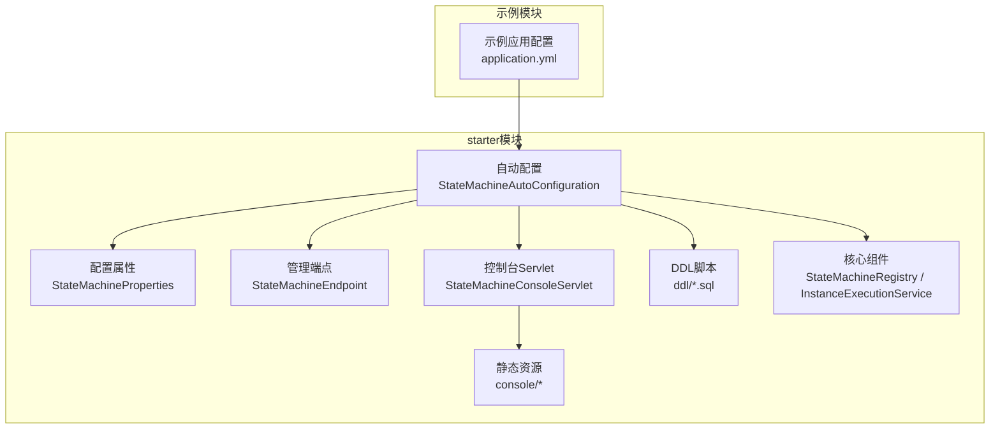
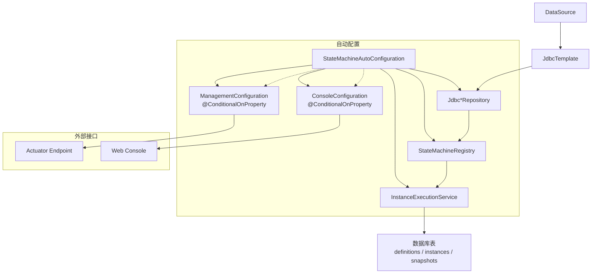
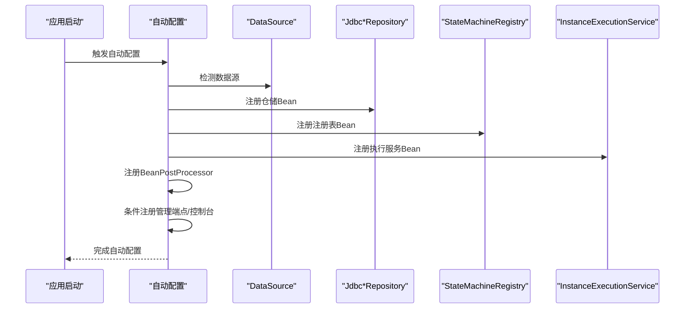
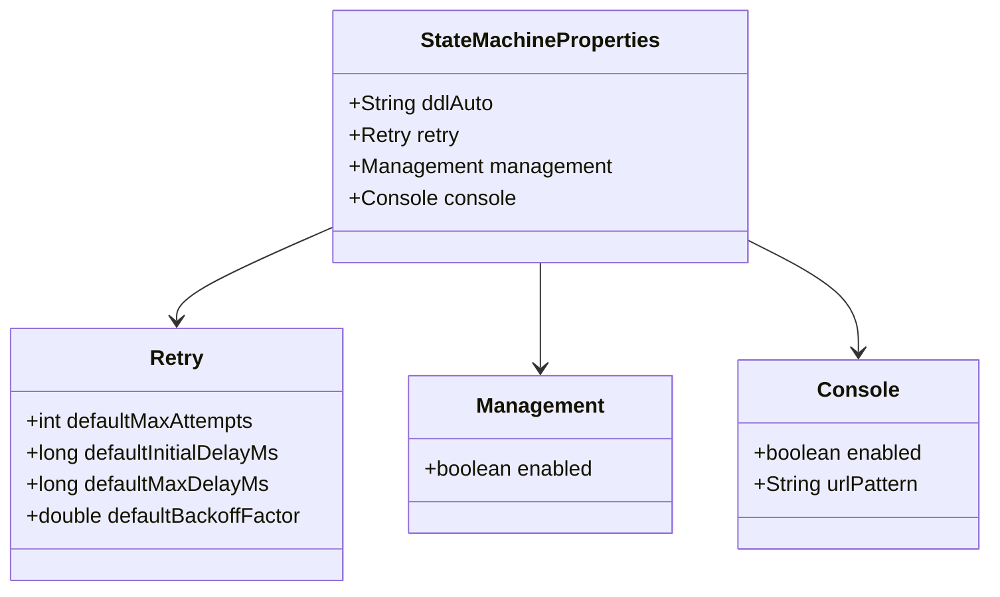
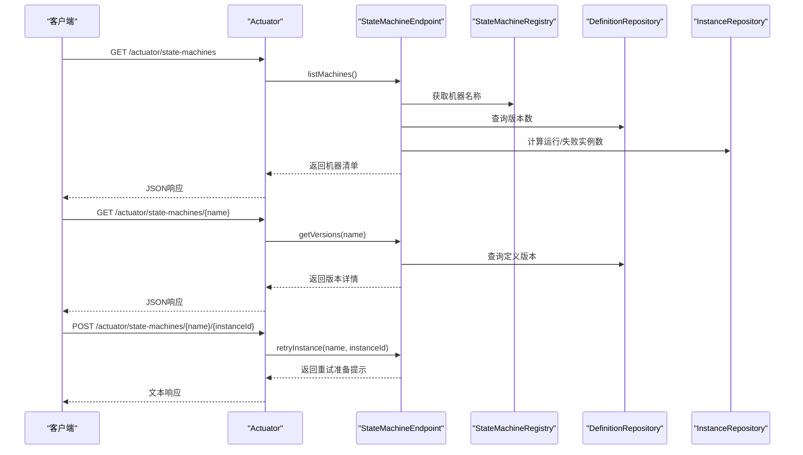
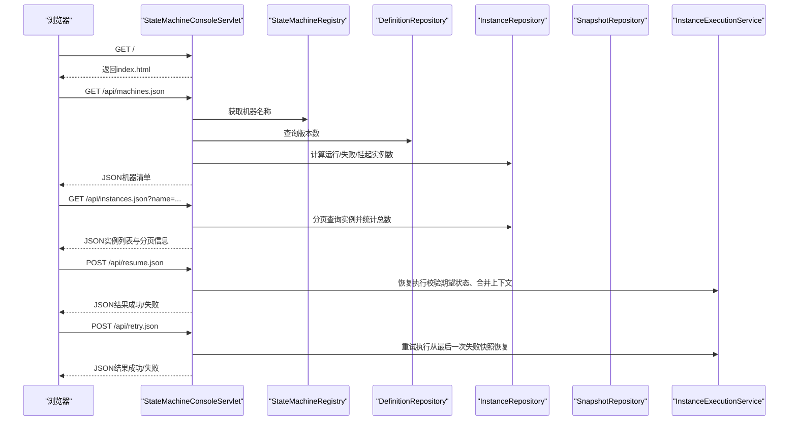
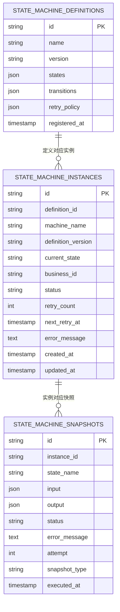
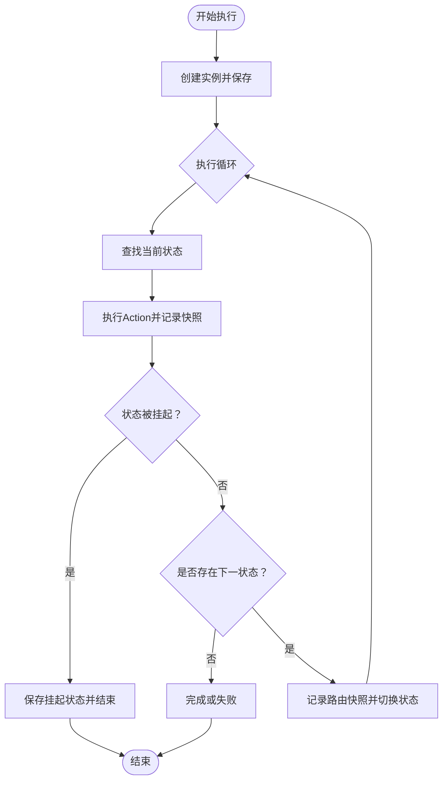
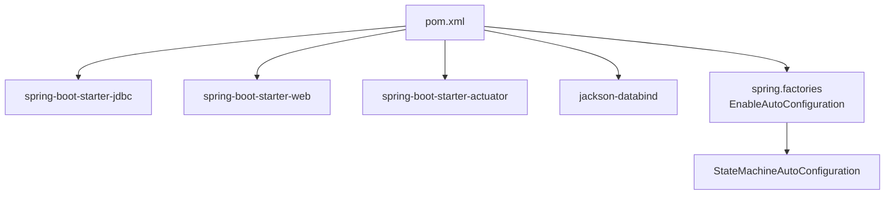

# Spring Boot集成

<cite>
**本文档引用的文件**
- [StateMachineAutoConfiguration.java](file://state-machine-boot-starter/src/main/java/cn/chedejun/statemachine/autoconfigure/StateMachineAutoConfiguration.java)
- [StateMachineProperties.java](file://state-machine-boot-starter/src/main/java/cn/chedejun/statemachine/autoconfigure/StateMachineProperties.java)
- [spring.factories](file://state-machine-boot-starter/src/main/resources/META-INF/spring.factories)
- [StateMachineEndpoint.java](file://state-machine-boot-starter/src/main/java/cn/chedejun/statemachine/management/StateMachineEndpoint.java)
- [StateMachineConsoleServlet.java](file://state-machine-boot-starter/src/main/java/cn/chedejun/statemachine/management/StateMachineConsoleServlet.java)
- [index.html](file://state-machine-boot-starter/src/main/resources/console/index.html)
- [app.js](file://state-machine-boot-starter/src/main/resources/console/js/app.js)
- [StateMachineRegistry.java](file://state-machine-boot-starter/src/main/java/cn/chedejun/statemachine/core/StateMachineRegistry.java)
- [DefinitionRepository.java](file://state-machine-boot-starter/src/main/java/cn/chedejun/statemachine/domain/repository/DefinitionRepository.java)
- [StateMachineFacade.java](file://state-machine-boot-starter/src/main/java/cn/chedejun/statemachine/interfaces/StateMachineFacade.java)
- [InstanceExecutionService.java](file://state-machine-boot-starter/src/main/java/cn/chedejun/statemachine/application/InstanceExecutionService.java)
- [mysql.sql](file://state-machine-boot-starter/src/main/resources/ddl/mysql.sql)
- [application.yml（测试）](file://state-machine-boot-starter/src/test/resources/application.yml)
- [application.yml（演示）](file://state-machine-boot-starter/src/main/resources/application.yml)
- [pom.xml](file://state-machine-boot-starter/pom.xml)
</cite>

## 目录
1. [简介](#简介)
2. [项目结构](#项目结构)
3. [核心组件](#核心组件)
4. [架构总览](#架构总览)
5. [详细组件分析](#详细组件分析)
6. [依赖分析](#依赖分析)
7. [性能考虑](#性能考虑)
8. [故障排查指南](#故障排查指南)
9. [结论](#结论)
10. [附录](#附录)

## 简介
本项目提供一个基于Spring Boot的状态机工作流工具，具备重试、快照与管理控制台能力。通过自动配置机制，结合条件注解与Bean注册流程，实现对数据库、Actuator端点与Web控制台的按需启用。配置属性集中于状态机命名空间，涵盖DDL初始化策略、重试策略、管理端点开关与控制台开关及URL模式等。

## 项目结构
- starter模块提供自动配置、管理端点、控制台Servlet与静态资源、DDL脚本以及核心领域模型与应用服务。
- 示例模块演示如何在Spring Boot应用中启用数据库、状态机管理端点与控制台，并展示日志级别与暴露端点配置。

**图表来源**
- [StateMachineAutoConfiguration.java:32-149](file://state-machine-boot-starter/src/main/java/cn/chedejun/statemachine/autoconfigure/StateMachineAutoConfiguration.java#L32-L149)
- [StateMachineProperties.java:1-42](file://state-machine-boot-starter/src/main/java/cn/chedejun/statemachine/autoconfigure/StateMachineProperties.java#L1-L42)
- [StateMachineEndpoint.java:1-80](file://state-machine-boot-starter/src/main/java/cn/chedejun/statemachine/management/StateMachineEndpoint.java#L1-L80)
- [StateMachineConsoleServlet.java:1-420](file://state-machine-boot-starter/src/main/java/cn/chedejun/statemachine/management/StateMachineConsoleServlet.java#L1-L420)
- [index.html:1-665](file://state-machine-boot-starter/src/main/resources/console/index.html#L1-L665)
- [mysql.sql:1-19](file://state-machine-boot-starter/src/main/resources/ddl/mysql.sql#L1-L19)
- [application.yml（演示）:1-27](file://state-machine-boot-starter/src/main/resources/application.yml#L1-L27)

**章节来源**
- [pom.xml:1-182](file://state-machine-boot-starter/pom.xml#L1-L182)

## 核心组件
- 自动配置类负责在满足条件时注册仓储、执行服务、注册表、管理端点与控制台Servlet，并通过BeanPostProcessor完成对用户自定义状态机与门面的装配。
- 配置属性类提供命名空间下的DDL策略、重试策略、管理端点与控制台的开关与URL模式。
- 管理端点提供状态机清单、定义版本、实例统计与重试入口。
- 控制台Servlet提供Web UI与REST API，支持实例查询、详情、恢复与重试。
- 核心服务负责实例执行、重试、恢复与快照记录，配合注册表持久化状态机定义。

**章节来源**
- [StateMachineAutoConfiguration.java:32-149](file://state-machine-boot-starter/src/main/java/cn/chedejun/statemachine/autoconfigure/StateMachineAutoConfiguration.java#L32-L149)
- [StateMachineProperties.java:1-42](file://state-machine-boot-starter/src/main/java/cn/chedejun/statemachine/autoconfigure/StateMachineProperties.java#L1-L42)
- [StateMachineEndpoint.java:1-80](file://state-machine-boot-starter/src/main/java/cn/chedejun/statemachine/management/StateMachineEndpoint.java#L1-L80)
- [StateMachineConsoleServlet.java:1-420](file://state-machine-boot-starter/src/main/java/cn/chedejun/statemachine/management/StateMachineConsoleServlet.java#L1-L420)
- [StateMachineRegistry.java:1-114](file://state-machine-boot-starter/src/main/java/cn/chedejun/statemachine/core/StateMachineRegistry.java#L1-L114)
- [InstanceExecutionService.java:1-296](file://state-machine-boot-starter/src/main/java/cn/chedejun/statemachine/application/InstanceExecutionService.java#L1-L296)

## 架构总览
自动配置在数据源可用时激活，按需注册管理端点与控制台Servlet；通过BeanPostProcessor将JdbcTemplate与注册表注入到用户自定义的状态机构建器与门面中；同时将用户自定义的状态机实例注册到注册表并持久化其定义。

**图表来源**
- [StateMachineAutoConfiguration.java:32-149](file://state-machine-boot-starter/src/main/java/cn/chedejun/statemachine/autoconfigure/StateMachineAutoConfiguration.java#L32-L149)
- [mysql.sql:1-19](file://state-machine-boot-starter/src/main/resources/ddl/mysql.sql#L1-L19)

## 详细组件分析

### 自动配置与Bean注册流程
- 条件注解与触发顺序
  - @ConditionalOnClass(JdbcTemplate.class)：确保JDBC Starter存在才进行自动配置。
  - @AutoConfigureAfter(DataSourceAutoConfiguration.class)：确保数据源已配置。
  - @EnableConfigurationProperties(StateMachineProperties.class)：启用配置绑定。
  - @ConditionalOnBean(DataSource.class)：仅在存在DataSource时注册仓储与执行相关Bean。
  - 管理端点与控制台Servlet分别受state-machine.management.enabled与state-machine.console.enabled控制，默认开启。
- Bean注册要点
  - DdlInitializer：根据state-machine.ddl-auto初始化DDL。
  - 仓储：JdbcDefinitionRepository、JdbcInstanceRepository、JdbcSnapshotRepository。
  - 注册表：StateMachineRegistry，负责将状态机定义持久化。
  - 执行服务：InstanceExecutionService，封装实例执行、重试、恢复与快照。
  - BeanPostProcessor：
    - 将JdbcTemplate与注册表注入到用户自定义的StateMachineBuilder。
    - 将门面类（StateMachineFacade）标记为已处理。
  - 另一个BeanPostProcessor：将用户自定义的状态机实例注册到注册表。
- 管理端点与控制台
  - 管理端点：@Endpoint(id="state-machines")，提供状态机清单、定义版本与实例重试。
  - 控制台Servlet：动态注册，映射至state-machine.console.url-pattern，默认"/statemachine/*"。

**图表来源**
- [StateMachineAutoConfiguration.java:32-149](file://state-machine-boot-starter/src/main/java/cn/chedejun/statemachine/autoconfigure/StateMachineAutoConfiguration.java#L32-L149)

**章节来源**
- [StateMachineAutoConfiguration.java:32-149](file://state-machine-boot-starter/src/main/java/cn/chedejun/statemachine/autoconfigure/StateMachineAutoConfiguration.java#L32-L149)

### 配置属性（StateMachineProperties）
- 命名空间：state-machine
- 关键项
  - ddlAuto：DDL初始化策略，默认"update"。
  - retry：重试策略
    - defaultMaxAttempts：默认最大重试次数，默认3。
    - defaultInitialDelayMs：初始延迟毫秒，默认1000。
    - defaultMaxDelayMs：最大延迟毫秒，默认30000。
    - defaultBackoffFactor：退避因子，默认2.0。
  - management：管理端点
    - enabled：是否启用，默认true。
  - console：控制台
    - enabled：是否启用，默认true。
    - urlPattern：URL映射模式，默认"/statemachine/*"。

**图表来源**
- [StateMachineProperties.java:1-42](file://state-machine-boot-starter/src/main/java/cn/chedejun/statemachine/autoconfigure/StateMachineProperties.java#L1-L42)

**章节来源**
- [StateMachineProperties.java:1-42](file://state-machine-boot-starter/src/main/java/cn/chedejun/statemachine/autoconfigure/StateMachineProperties.java#L1-L42)

### Actuator端点实现与监控指标
- 端点定义
  - @Endpoint(id = "state-machines")：暴露REST端点。
- 读操作
  - GET /actuator/state-machines：返回所有状态机名称、版本数、运行中/失败实例计数。
  - GET /actuator/state-machines/{name}：返回指定状态机的所有定义版本，包含状态、转换与重试策略JSON。
- 写操作
  - POST /actuator/state-machines/{name}/{instanceId}：对失败实例进行重试准备提示（返回重置为RUNNING的提示与后续调用建议）。
- 监控指标
  - 端点本身不直接生成指标，但可结合Spring Boot Actuator的通用指标与日志进行监控。
  - 建议在生产环境通过暴露端点与日志级别控制，结合外部监控系统采集。

**图表来源**
- [StateMachineEndpoint.java:1-80](file://state-machine-boot-starter/src/main/java/cn/chedejun/statemachine/management/StateMachineEndpoint.java#L1-L80)

**章节来源**
- [StateMachineEndpoint.java:1-80](file://state-machine-boot-starter/src/main/java/cn/chedejun/statemachine/management/StateMachineEndpoint.java#L1-L80)

### Web控制台实现与交互
- 控制台Servlet
  - 提供Web UI与REST API，支持状态机列表、版本详情、实例查询、实例详情、恢复与重试。
  - 支持分页与过滤（状态、业务ID、实例ID），最大分页大小限制。
  - 静态资源托管（HTML/CSS/JS），并设置缓存头。
- 前端交互
  - 使用Vue.js与Mermaid渲染流程图，支持树形/文本两种上下文编辑模式，支持JSON合并与复制。
  - 支持抽屉式实例详情与时间线展示，区分ROUTE与NODE快照类型。

**图表来源**
- [StateMachineConsoleServlet.java:1-420](file://state-machine-boot-starter/src/main/java/cn/chedejun/statemachine/management/StateMachineConsoleServlet.java#L1-L420)
- [index.html:1-665](file://state-machine-boot-starter/src/main/resources/console/index.html#L1-L665)
- [app.js:1-848](file://state-machine-boot-starter/src/main/resources/console/js/app.js#L1-L848)

**章节来源**
- [StateMachineConsoleServlet.java:1-420](file://state-machine-boot-starter/src/main/java/cn/chedejun/statemachine/management/StateMachineConsoleServlet.java#L1-L420)
- [index.html:1-665](file://state-machine-boot-starter/src/main/resources/console/index.html#L1-L665)
- [app.js:1-848](file://state-machine-boot-starter/src/main/resources/console/js/app.js#L1-L848)

### 数据模型与DDL
- 表结构
  - state_machine_definitions：存储状态机定义（名称、版本、状态JSON、转换JSON、重试策略JSON、注册时间）。
  - state_machine_instances：存储实例（定义ID、机器名、当前状态、业务ID、状态、重试次数、下次重试时间、错误信息、时间戳）。
  - state_machine_snapshots：存储执行快照（实例ID、状态名、输入输出JSON、状态、错误信息、尝试次数、快照类型、执行时间）。
- 初始化策略
  - 通过state-machine.ddl-auto控制（如update），自动创建或更新表结构。

**图表来源**
- [mysql.sql:1-19](file://state-machine-boot-starter/src/main/resources/ddl/mysql.sql#L1-L19)

**章节来源**
- [mysql.sql:1-19](file://state-machine-boot-starter/src/main/resources/ddl/mysql.sql#L1-L19)

### 核心服务与执行流程
- 执行服务
  - execute：创建实例、保存初始状态、进入执行循环。
  - resumeByBusinessId/resumeByInstanceId：从挂起状态恢复，合并上下文并继续执行。
  - retry/retryWithCustomContext：从最后一次失败快照恢复，支持自定义上下文。
  - executeLoop：核心循环，查找状态→执行Action→路由到下一状态，记录快照与状态变更。
  - executeAction：执行单个状态动作，记录成功/失败快照，按重试策略等待后重试。
- 注册表
  - register：序列化状态机定义（状态、转换、重试策略），写入定义表并缓存实例。
  - getLatest：按版本号选择最新定义。
- 门面
  - StateMachineFacade：对外提供execute/retry/resume签名，内部委托给执行服务。

**图表来源**
- [InstanceExecutionService.java:1-296](file://state-machine-boot-starter/src/main/java/cn/chedejun/statemachine/application/InstanceExecutionService.java#L1-L296)
- [StateMachineRegistry.java:1-114](file://state-machine-boot-starter/src/main/java/cn/chedejun/statemachine/core/StateMachineRegistry.java#L1-L114)
- [StateMachineFacade.java:1-52](file://state-machine-boot-starter/src/main/java/cn/chedejun/statemachine/interfaces/StateMachineFacade.java#L1-L52)

**章节来源**
- [InstanceExecutionService.java:1-296](file://state-machine-boot-starter/src/main/java/cn/chedejun/statemachine/application/InstanceExecutionService.java#L1-L296)
- [StateMachineRegistry.java:1-114](file://state-machine-boot-starter/src/main/java/cn/chedejun/statemachine/core/StateMachineRegistry.java#L1-L114)
- [StateMachineFacade.java:1-52](file://state-machine-boot-starter/src/main/java/cn/chedejun/statemachine/interfaces/StateMachineFacade.java#L1-L52)

## 依赖分析
- 自动配置入口
  - spring.factories中声明EnableAutoConfiguration指向自动配置类，实现条件加载。
- 外部依赖
  - Spring Boot Starter JDBC/Web/Actuator可选依赖，用于启用JdbcTemplate、Web容器与Actuator端点。
- 版本与打包
  - Spring Boot 2.7.18，JDK 1.8兼容，支持发布到中央仓库。

**图表来源**
- [pom.xml:1-182](file://state-machine-boot-starter/pom.xml#L1-L182)
- [spring.factories:1-3](file://state-machine-boot-starter/src/main/resources/META-INF/spring.factories#L1-L3)

**章节来源**
- [pom.xml:1-182](file://state-machine-boot-starter/pom.xml#L1-L182)
- [spring.factories:1-3](file://state-machine-boot-starter/src/main/resources/META-INF/spring.factories#L1-L3)

## 性能考虑
- 分页与过滤：控制台实例查询支持分页与多维过滤，建议合理设置页面大小与筛选条件，避免一次性拉取大量数据。
- 快照类型：区分ROUTE与NODE快照，减少不必要的上下文序列化开销。
- 重试策略：合理设置最大重试次数与退避因子，避免频繁重试导致数据库压力。
- 日志级别：生产环境建议降低JDBC相关日志级别，避免I/O瓶颈。

## 故障排查指南
- 管理端点不可用
  - 检查state-machine.management.enabled与Actuator暴露配置，确认端点ID为state-machines。
- 控制台无法访问
  - 检查state-machine.console.enabled与urlPattern，确认Servlet已注册且映射路径正确。
- 数据库DDL未生效
  - 检查state-machine.ddl-auto与数据库权限，确认DDL脚本已执行。
- 实例重试失败
  - 确认实例状态为FAILED，检查最后一次失败快照是否存在，核对重试策略配置。
- 恢复执行异常
  - 确认期望状态与实例当前状态一致，检查上下文JSON格式与合并逻辑。

**章节来源**
- [application.yml（演示）:18-27](file://state-machine-boot-starter/src/main/resources/application.yml#L18-L27)
- [application.yml（测试）:1-14](file://state-machine-boot-starter/src/test/resources/application.yml#L1-L14)
- [StateMachineAutoConfiguration.java:111-147](file://state-machine-boot-starter/src/main/java/cn/chedejun/statemachine/autoconfigure/StateMachineAutoConfiguration.java#L111-L147)
- [InstanceExecutionService.java:74-114](file://state-machine-boot-starter/src/main/java/cn/chedejun/statemachine/application/InstanceExecutionService.java#L74-L114)

## 结论
该Spring Boot集成通过自动配置与条件注解实现了对数据库、管理端点与Web控制台的按需启用，配置属性覆盖DDL策略、重试策略与开关项。结合注册表与执行服务，提供了完整的状态机生命周期管理能力。建议在生产环境中合理配置DDL策略、重试参数与日志级别，并通过Actuator与控制台进行监控与运维。

## 附录

### 配置示例（数据库、Web控制台、自定义Bean注册）
- 数据库连接
  - 在application.yml中配置spring.datasource.*。
- 启用管理端点
  - 在management.endpoints.web.exposure.include中添加state-machines。
- 启用Web控制台
  - state-machine.console.enabled=true，默认映射"/statemachine/*"。
- 自定义Bean注册
  - 自定义状态机构建器（实现StateMachineBuilder）与状态机实例（实现StateMachine）将被自动识别并注入JdbcTemplate与注册表。
  - 门面类（StateMachineFacade）将被标记为已处理，便于对外提供兼容接口。

**章节来源**
- [application.yml（演示）:1-27](file://state-machine-boot-starter/src/main/resources/application.yml#L1-L27)
- [StateMachineAutoConfiguration.java:72-109](file://state-machine-boot-starter/src/main/java/cn/chedejun/statemachine/autoconfigure/StateMachineAutoConfiguration.java#L72-L109)
- [StateMachineProperties.java:32-40](file://state-machine-boot-starter/src/main/java/cn/chedejun/statemachine/autoconfigure/StateMachineProperties.java#L32-L40)

### 微服务架构部署与集成指导
- 服务拆分
  - 将状态机服务作为独立微服务，通过HTTP或消息队列与其他服务交互。
- 配置中心
  - 将state-machine.*与数据库连接信息纳入配置中心统一管理。
- 监控与告警
  - 暴露Actuator端点并接入Prometheus/Grafana，关注实例状态与错误率。
- 安全加固
  - 限制/state-machines端点访问，结合Spring Security或网关鉴权。
- 数据库治理
  - 使用只读副本查询实例与定义，写操作集中在主库，避免跨库事务。