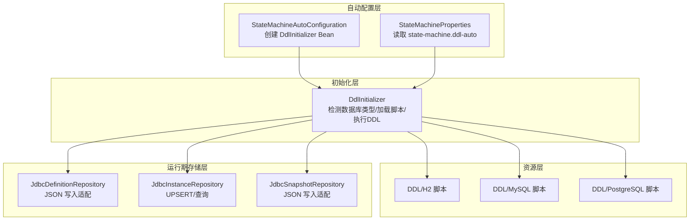
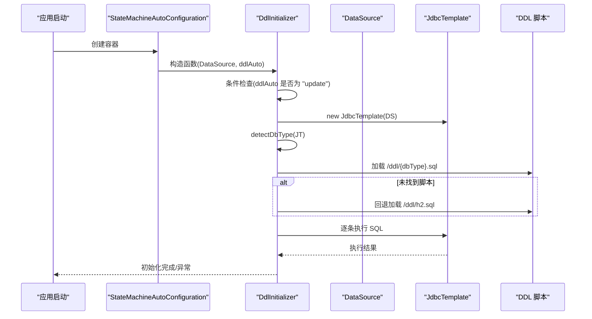
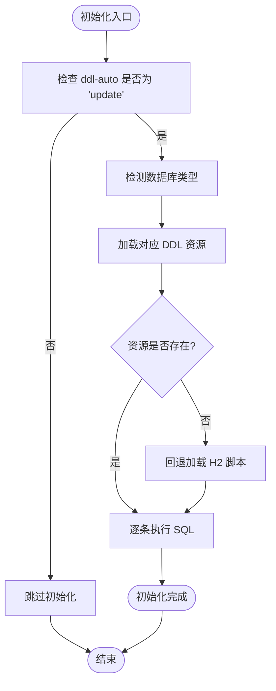
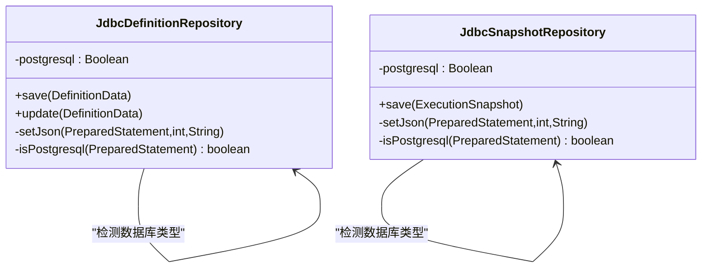
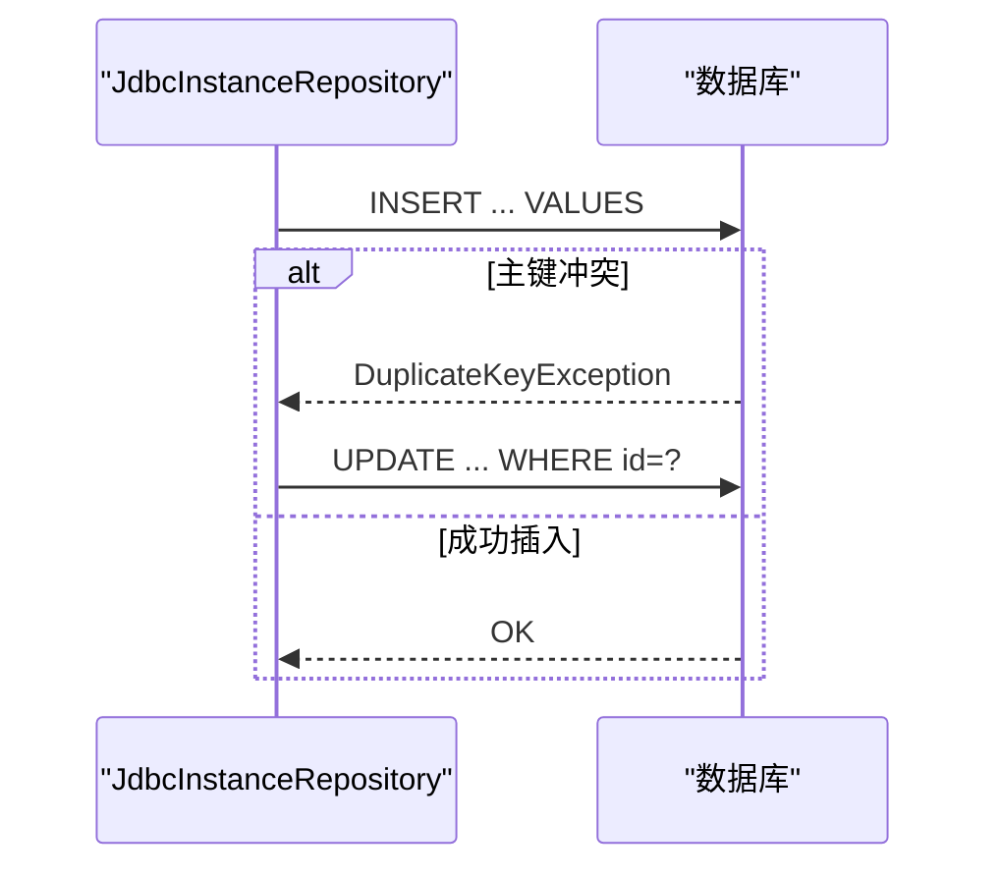
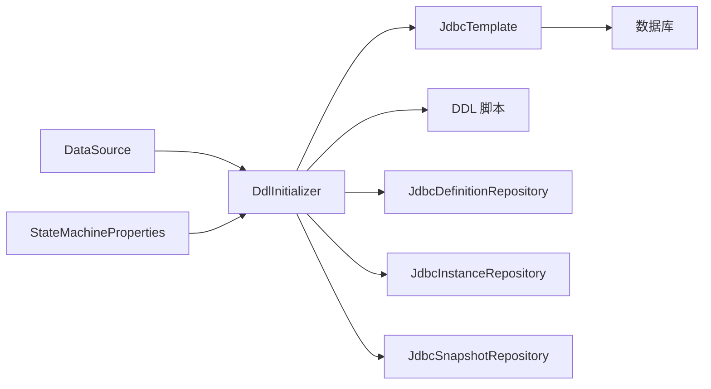

# 数据库初始化

<cite>
**本文引用的文件**
- [DdlInitializer.java](file://state-machine-boot-starter/src/main/java/cn/chedejun/statemachine/persistence/DdlInitializer.java)
- [StateMachineAutoConfiguration.java](file://state-machine-boot-starter/src/main/java/cn/chedejun/statemachine/autoconfigure/StateMachineAutoConfiguration.java)
- [StateMachineProperties.java](file://state-machine-boot-starter/src/main/java/cn/chedejun/statemachine/autoconfigure/StateMachineProperties.java)
- [h2.sql](file://state-machine-boot-starter/src/main/resources/ddl/h2.sql)
- [mysql.sql](file://state-machine-boot-starter/src/main/resources/ddl/mysql.sql)
- [postgresql.sql](file://state-machine-boot-starter/src/main/resources/ddl/postgresql.sql)
- [JdbcDefinitionRepository.java](file://state-machine-boot-starter/src/main/java/cn/chedejun/statemachine/infrastructure/persistence/JdbcDefinitionRepository.java)
- [JdbcInstanceRepository.java](file://state-machine-boot-starter/src/main/java/cn/chedejun/statemachine/infrastructure/persistence/JdbcInstanceRepository.java)
- [JdbcSnapshotRepository.java](file://state-machine-boot-starter/src/main/java/cn/chedejun/statemachine/infrastructure/persistence/JdbcSnapshotRepository.java)
- [application.yml](file://state-machine-boot-starter/src/test/resources/application.yml)
- [StateMachineIntegrationTest.java](file://state-machine-boot-starter/src/test/java/cn/chedejun/statemachine/integration/StateMachineIntegrationTest.java)
</cite>

## 目录
1. [简介](#简介)
2. [项目结构](#项目结构)
3. [核心组件](#核心组件)
4. [架构总览](#架构总览)
5. [详细组件分析](#详细组件分析)
6. [依赖关系分析](#依赖关系分析)
7. [性能考虑](#性能考虑)
8. [故障排查指南](#故障排查指南)
9. [结论](#结论)
10. [附录](#附录)

## 简介
本文档聚焦于状态机模块的数据库初始化机制，系统性阐述 DdlInitializer 类的实现原理与工作机制，涵盖：
- DDL 脚本的加载、执行与错误处理
- 支持的数据库类型（H2/MySQL/PostgreSQL）及对应 SQL 脚本差异
- 初始化触发时机与条件检查
- 数据库配置最佳实践（连接池、性能优化）
- 升级与迁移指导方案
- 自定义 DDL 脚本与扩展数据库类型的方法

## 项目结构
围绕数据库初始化的关键文件组织如下：
- 自动配置：负责在满足条件时创建 DdlInitializer Bean，并注入配置属性
- 初始化器：根据数据源 URL 动态选择对应数据库类型的 DDL 脚本并执行
- SQL 脚本：按数据库类型提供建表语句，确保字段类型与 JSON 存储兼容
- JDBC 仓库：在运行期对 JSON 字段进行数据库类型适配写入



图表来源
- [StateMachineAutoConfiguration.java:39-42](file://state-machine-boot-starter/src/main/java/cn/chedejun/statemachine/autoconfigure/StateMachineAutoConfiguration.java#L39-L42)
- [DdlInitializer.java:22-45](file://state-machine-boot-starter/src/main/java/cn/chedejun/statemachine/persistence/DdlInitializer.java#L22-L45)
- [h2.sql:1-19](file://state-machine-boot-starter/src/main/resources/ddl/h2.sql#L1-L19)
- [mysql.sql:1-19](file://state-machine-boot-starter/src/main/resources/ddl/mysql.sql#L1-L19)
- [postgresql.sql:1-19](file://state-machine-boot-starter/src/main/resources/ddl/postgresql.sql#L1-L19)
- [JdbcDefinitionRepository.java:83-93](file://state-machine-boot-starter/src/main/java/cn/chedejun/statemachine/infrastructure/persistence/JdbcDefinitionRepository.java#L83-L93)
- [JdbcInstanceRepository.java:47-87](file://state-machine-boot-starter/src/main/java/cn/chedejun/statemachine/infrastructure/persistence/JdbcInstanceRepository.java#L47-L87)
- [JdbcSnapshotRepository.java:33-51](file://state-machine-boot-starter/src/main/java/cn/chedejun/statemachine/infrastructure/persistence/JdbcSnapshotRepository.java#L33-L51)

章节来源
- [StateMachineAutoConfiguration.java:32-42](file://state-machine-boot-starter/src/main/java/cn/chedejun/statemachine/autoconfigure/StateMachineAutoConfiguration.java#L32-L42)
- [DdlInitializer.java:11-66](file://state-machine-boot-starter/src/main/java/cn/chedejun/statemachine/persistence/DdlInitializer.java#L11-L66)

## 核心组件
- DdlInitializer：负责在应用启动阶段按需执行数据库初始化，基于数据源 URL 自动识别数据库类型并加载对应 DDL 脚本。
- StateMachineAutoConfiguration：Spring Boot 自动配置类，在存在 DataSource 且满足条件时创建 DdlInitializer Bean，并注入 state-machine.ddl-auto 属性。
- StateMachineProperties：绑定 state-machine 命名空间下的配置项，其中 ddl-auto 控制是否自动执行 DDL 初始化。
- DDL 脚本：分别提供 H2、MySQL、PostgreSQL 的建表语句，确保 JSON 字段类型与各数据库特性匹配。

章节来源
- [DdlInitializer.java:11-66](file://state-machine-boot-starter/src/main/java/cn/chedejun/statemachine/persistence/DdlInitializer.java#L11-L66)
- [StateMachineAutoConfiguration.java:32-42](file://state-machine-boot-starter/src/main/java/cn/chedejun/statemachine/autoconfigure/StateMachineAutoConfiguration.java#L32-L42)
- [StateMachineProperties.java:6-16](file://state-machine-boot-starter/src/main/java/cn/chedejun/statemachine/autoconfigure/StateMachineProperties.java#L6-L16)
- [h2.sql:1-19](file://state-machine-boot-starter/src/main/resources/ddl/h2.sql#L1-L19)
- [mysql.sql:1-19](file://state-machine-boot-starter/src/main/resources/ddl/mysql.sql#L1-L19)
- [postgresql.sql:1-19](file://state-machine-boot-starter/src/main/resources/ddl/postgresql.sql#L1-L19)

## 架构总览
DdlInitializer 在 Spring 容器启动时被创建，其构造函数会立即触发初始化逻辑。初始化过程包含以下关键步骤：
- 条件判断：仅当 state-machine.ddl-auto 等于 "update" 时才执行
- 数据库类型检测：从 DataSource 连接元数据中提取 URL 并判定类型
- 资源加载：按数据库类型加载对应 DDL 脚本；若找不到则回退到 H2 脚本
- 脚本执行：逐条拆分并执行 SQL 语句
- 错误处理：捕获异常并抛出运行时异常，记录日志



图表来源
- [StateMachineAutoConfiguration.java:39-42](file://state-machine-boot-starter/src/main/java/cn/chedejun/statemachine/autoconfigure/StateMachineAutoConfiguration.java#L39-L42)
- [DdlInitializer.java:22-45](file://state-machine-boot-starter/src/main/java/cn/chedejun/statemachine/persistence/DdlInitializer.java#L22-L45)

## 详细组件分析

### DdlInitializer 实现机制
- 触发时机：作为 Bean 在容器启动时由自动配置类创建，构造函数内即调用 initialize 方法
- 条件检查：仅当 state-machine.ddl-auto 等于 "update" 时执行初始化
- 数据库类型检测：通过连接 URL 包含关键字判断（mysql、postgresql/postgres），默认回退到 H2
- 资源加载：使用类路径资源加载 /ddl/{dbType}.sql，不存在时回退到 /ddl/h2.sql
- 脚本执行：读取脚本内容，按分号拆分并逐条执行
- 错误处理：捕获异常并记录错误日志，随后抛出运行时异常



图表来源
- [DdlInitializer.java:22-45](file://state-machine-boot-starter/src/main/java/cn/chedejun/statemachine/persistence/DdlInitializer.java#L22-L45)

章节来源
- [DdlInitializer.java:11-66](file://state-machine-boot-starter/src/main/java/cn/chedejun/statemachine/persistence/DdlInitializer.java#L11-L66)
- [StateMachineAutoConfiguration.java:39-42](file://state-machine-boot-starter/src/main/java/cn/chedejun/statemachine/autoconfigure/StateMachineAutoConfiguration.java#L39-L42)
- [StateMachineProperties.java:12](file://state-machine-boot-starter/src/main/java/cn/chedejun/statemachine/autoconfigure/StateMachineProperties.java#L12)

### 支持的数据库类型与脚本差异
- H2：使用 CLOB 存储 JSON 字段，时间戳默认值与唯一约束
- MySQL：使用 JSON 存储，TEXT/BLOB 字段用于错误信息，时间戳默认值与更新行为
- PostgreSQL：使用 JSONB 存储，TEXT 字段用于错误信息，时间戳默认值

```mermaid
erDiagram
STATE_MACHINE_DEFINITIONS {
varchar id PK
varchar name
varchar version
json/jsonb states
json/jsonb transitions
json/jsonb retry_policy
timestamp registered_at
}
STATE_MACHINE_INSTANCES {
varchar id PK
varchar definition_id
varchar machine_name
varchar definition_version
varchar current_state
varchar business_id
varchar status
int retry_count
timestamp next_retry_at
text error_message
timestamp created_at
timestamp updated_at
}
STATE_MACHINE_SNAPSHOTS {
varchar id PK
varchar instance_id
varchar state_name
json/jsonb input
json/jsonb output
varchar status
text error_message
int attempt
varchar snapshot_type
timestamp executed_at
}
```

图表来源
- [h2.sql:1-19](file://state-machine-boot-starter/src/main/resources/ddl/h2.sql#L1-L19)
- [mysql.sql:1-19](file://state-machine-boot-starter/src/main/resources/ddl/mysql.sql#L1-L19)
- [postgresql.sql:1-19](file://state-machine-boot-starter/src/main/resources/ddl/postgresql.sql#L1-L19)

章节来源
- [h2.sql:1-19](file://state-machine-boot-starter/src/main/resources/ddl/h2.sql#L1-L19)
- [mysql.sql:1-19](file://state-machine-boot-starter/src/main/resources/ddl/mysql.sql#L1-L19)
- [postgresql.sql:1-19](file://state-machine-boot-starter/src/main/resources/ddl/postgresql.sql#L1-L19)

### 运行期 JSON 字段适配
JdbcDefinitionRepository 与 JdbcSnapshotRepository 在写入 JSON 字段时会根据数据库类型进行差异化处理：
- PostgreSQL：使用 Types.OTHER 或 setObject 将字符串 JSON 写入 JSON/JSONB 列
- 其他数据库：直接 setString 写入 JSON 列，避免二进制字符集问题



图表来源
- [JdbcDefinitionRepository.java:83-106](file://state-machine-boot-starter/src/main/java/cn/chedejun/statemachine/infrastructure/persistence/JdbcDefinitionRepository.java#L83-L106)
- [JdbcSnapshotRepository.java:63-83](file://state-machine-boot-starter/src/main/java/cn/chedejun/statemachine/infrastructure/persistence/JdbcSnapshotRepository.java#L63-L83)

章节来源
- [JdbcDefinitionRepository.java:83-106](file://state-machine-boot-starter/src/main/java/cn/chedejun/statemachine/infrastructure/persistence/JdbcDefinitionRepository.java#L83-L106)
- [JdbcSnapshotRepository.java:63-83](file://state-machine-boot-starter/src/main/java/cn/chedejun/statemachine/infrastructure/persistence/JdbcSnapshotRepository.java#L63-L83)

### UPSERT 与并发控制
JdbcInstanceRepository 使用“插入失败则更新”的策略实现原子化 upsert，避免先查后写的并发竞态：
- 插入主键冲突时，执行更新语句，包含 next_retry_at 与 error_message 的可空处理
- 提供按机器名与状态的查询与计数接口，支持分页与过滤



图表来源
- [JdbcInstanceRepository.java:47-87](file://state-machine-boot-starter/src/main/java/cn/chedejun/statemachine/infrastructure/persistence/JdbcInstanceRepository.java#L47-L87)

章节来源
- [JdbcInstanceRepository.java:47-87](file://state-machine-boot-starter/src/main/java/cn/chedejun/statemachine/infrastructure/persistence/JdbcInstanceRepository.java#L47-L87)

## 依赖关系分析
- DdlInitializer 依赖 DataSource 与 StateMachineProperties
- 自动配置类在存在 DataSource 时创建 DdlInitializer Bean
- 运行期仓库依赖 JdbcTemplate 与 Jackson ObjectMapper



图表来源
- [StateMachineAutoConfiguration.java:39-42](file://state-machine-boot-starter/src/main/java/cn/chedejun/statemachine/autoconfigure/StateMachineAutoConfiguration.java#L39-L42)
- [DdlInitializer.java:22-45](file://state-machine-boot-starter/src/main/java/cn/chedejun/statemachine/persistence/DdlInitializer.java#L22-L45)

章节来源
- [StateMachineAutoConfiguration.java:32-42](file://state-machine-boot-starter/src/main/java/cn/chedejun/statemachine/autoconfigure/StateMachineAutoConfiguration.java#L32-L42)
- [DdlInitializer.java:11-66](file://state-machine-boot-starter/src/main/java/cn/chedejun/statemachine/persistence/DdlInitializer.java#L11-L66)

## 性能考虑
- 初始化执行成本：DDL 脚本通常较小，执行开销低；仅在应用启动时执行一次
- JSON 写入优化：针对 PostgreSQL 使用 Types.OTHER 或 setObject，其他数据库使用 setString，避免字符集与二进制问题
- UPSERT 策略：减少并发场景下的查询-更新竞争，提升写入吞吐
- 连接池建议：生产环境推荐使用 HikariCP，合理设置最大连接数、最小空闲连接、连接超时等参数，避免连接泄漏
- SQL 分号拆分：当前实现按分号拆分执行，建议确保脚本中每条语句独立且幂等，避免重复执行导致的约束冲突

[本节为通用性能建议，不直接分析具体文件]

## 故障排查指南
- 初始化未执行
  - 检查 state-machine.ddl-auto 是否设置为 "update"
  - 确认存在 DataSource Bean
- 数据库类型识别失败
  - 确认连接 URL 包含 mysql、postgresql 或 postgres 关键字
  - 若 URL 不包含上述关键字，将回退到 H2 脚本
- 脚本加载失败
  - 确认 /ddl/{dbType}.sql 资源存在
  - 若不存在，系统会回退到 /ddl/h2.sql
- 执行异常
  - 查看日志中的错误堆栈，定位具体 SQL 语句
  - 确保数据库用户具备创建表权限
- 运行期 JSON 写入异常
  - 检查数据库类型检测逻辑与 JSON 字段类型是否匹配
  - 确认 ObjectMapper 正确序列化为 JSON 字符串

章节来源
- [DdlInitializer.java:22-45](file://state-machine-boot-starter/src/main/java/cn/chedejun/statemachine/persistence/DdlInitializer.java#L22-L45)
- [JdbcDefinitionRepository.java:83-106](file://state-machine-boot-starter/src/main/java/cn/chedejun/statemachine/infrastructure/persistence/JdbcDefinitionRepository.java#L83-L106)
- [JdbcSnapshotRepository.java:63-83](file://state-machine-boot-starter/src/main/java/cn/chedejun/statemachine/infrastructure/persistence/JdbcSnapshotRepository.java#L63-L83)

## 结论
DdlInitializer 通过简单而稳健的设计实现了数据库初始化的自动化：基于数据源 URL 的类型检测、按需加载对应 DDL 脚本、逐条执行与完善的错误处理。配合运行期的 JSON 字段适配与 UPSERT 策略，确保了在多数据库环境下的兼容性与可靠性。生产环境中建议严格控制 ddl-auto 的使用范围，并结合连接池与监控体系保障稳定性。

[本节为总结性内容，不直接分析具体文件]

## 附录

### 数据库初始化触发时机与条件
- 触发时机：应用启动时，自动配置类创建 DdlInitializer Bean
- 条件检查：仅当 state-machine.ddl-auto 等于 "update" 时执行
- 依赖条件：存在 DataSource Bean

章节来源
- [StateMachineAutoConfiguration.java:39-42](file://state-machine-boot-starter/src/main/java/cn/chedejun/statemachine/autoconfigure/StateMachineAutoConfiguration.java#L39-L42)
- [StateMachineProperties.java:12](file://state-machine-boot-starter/src/main/java/cn/chedejun/statemachine/autoconfigure/StateMachineProperties.java#L12)

### 数据库配置最佳实践
- 连接池：优先使用 HikariCP，合理设置连接池大小与超时参数
- 连接参数：确保驱动类名正确，字符集与时区设置一致
- 权限：确保数据库用户具备创建表与索引的权限
- 监控：开启慢查询与连接池监控，定期巡检

[本节为通用实践建议，不直接分析具体文件]

### 升级与迁移指导
- 版本演进：在新增列或修改约束时，建议采用“添加列 + 数据迁移 + 修改默认值/约束”的渐进式策略
- 兼容性：保持 JSON 字段类型与数据库特性一致（PostgreSQL 使用 JSONB，MySQL 使用 JSON，H2 使用 CLOB）
- 回滚策略：保留历史版本定义，必要时通过状态机版本管理进行回滚

[本节为通用迁移建议，不直接分析具体文件]

### 自定义 DDL 脚本与扩展数据库类型
- 新增脚本：在资源目录下新增 /ddl/{newDbType}.sql，遵循现有字段命名与类型规范
- 类型检测：扩展 DdlInitializer.detectDbType 逻辑，增加新数据库类型的识别规则
- 运行期适配：如新数据库对 JSON 存储有特殊要求，可在 JdbcDefinitionRepository 与 JdbcSnapshotRepository 中补充相应适配逻辑
- 测试验证：编写集成测试，覆盖新数据库类型下的建表、写入与查询流程

章节来源
- [DdlInitializer.java:57-64](file://state-machine-boot-starter/src/main/java/cn/chedejun/statemachine/persistence/DdlInitializer.java#L57-L64)
- [JdbcDefinitionRepository.java:83-106](file://state-machine-boot-starter/src/main/java/cn/chedejun/statemachine/infrastructure/persistence/JdbcDefinitionRepository.java#L83-L106)
- [JdbcSnapshotRepository.java:63-83](file://state-machine-boot-starter/src/main/java/cn/chedejun/statemachine/infrastructure/persistence/JdbcSnapshotRepository.java#L63-L83)