# 自动配置机制

<cite>
**本文档引用的文件**
- [spring.factories](file://state-machine-boot-starter/src/main/resources/META-INF/spring.factories)
- [StateMachineAutoConfiguration.java](file://state-machine-boot-starter/src/main/java/cn/chedejun/statemachine/autoconfigure/StateMachineAutoConfiguration.java)
- [StateMachineProperties.java](file://state-machine-boot-starter/src/main/java/cn/chedejun/statemachine/autoconfigure/StateMachineProperties.java)
- [DdlInitializer.java](file://state-machine-boot-starter/src/main/java/cn/chedejun/statemachine/persistence/DdlInitializer.java)
- [StateMachineEndpoint.java](file://state-machine-boot-starter/src/main/java/cn/chedejun/statemachine/management/StateMachineEndpoint.java)
- [StateMachineConsoleServlet.java](file://state-machine-boot-starter/src/main/java/cn/chedejun/statemachine/management/StateMachineConsoleServlet.java)
- [pom.xml](file://state-machine-boot-starter/pom.xml)
- [application.yml](file://state-machine-demo/src/main/resources/application.yml)
- [OrderConfig.java](file://state-machine-demo/src/main/java/cn/chedejun/demo/config/OrderConfig.java)
- [mysql.sql](file://state-machine-boot-starter/src/main/resources/ddl/mysql.sql)
- [h2.sql](file://state-machine-boot-starter/src/main/resources/ddl/h2.sql)
</cite>

## 目录
1. [简介](#简介)
2. [项目结构](#项目结构)
3. [核心组件](#核心组件)
4. [架构概览](#架构概览)
5. [详细组件分析](#详细组件分析)
6. [依赖关系分析](#依赖关系分析)
7. [性能考虑](#性能考虑)
8. [故障排除指南](#故障排除指南)
9. [结论](#结论)
10. [附录](#附录)

## 简介

本文档深入解析Spring Boot自动配置机制在状态机项目中的实现，重点涵盖以下方面：

- Spring Boot自动配置的工作原理和触发机制
- spring.factories文件的作用和EnableAutoConfiguration注解机制
- StateMachineAutoConfiguration类的完整实现分析
- @ConditionalOnMissingBean等条件注解的使用策略
- Bean条件注册逻辑和优先级机制
- 自定义自动配置的最佳实践和扩展方法
- 配置类的加载顺序和依赖关系分析

该状态机框架提供了完整的Spring Boot集成能力，包括数据持久化、管理控制台和Actuator端点等功能的自动配置。

## 项目结构

状态机项目采用标准的Spring Boot Starter结构，主要包含以下模块：

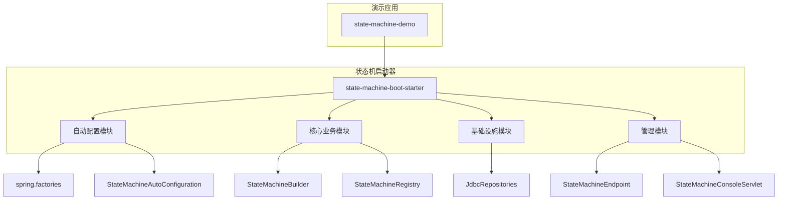

**图表来源**
- [pom.xml:1-182](file://state-machine-boot-starter/pom.xml#L1-L182)
- [spring.factories:1-3](file://state-machine-boot-starter/src/main/resources/META-INF/spring.factories#L1-L3)

**章节来源**
- [pom.xml:1-182](file://state-machine-boot-starter/pom.xml#L1-L182)
- [spring.factories:1-3](file://state-machine-boot-starter/src/main/resources/META-INF/spring.factories#L1-L3)

## 核心组件

### 自动配置入口

Spring Boot自动配置的核心入口是`spring.factories`文件，它声明了自动配置类：

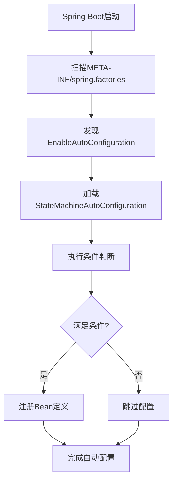

**图表来源**
- [spring.factories:1-3](file://state-machine-boot-starter/src/main/resources/META-INF/spring.factories#L1-L3)

### 条件注解体系

自动配置类使用了多层次的条件注解来控制Bean的注册：

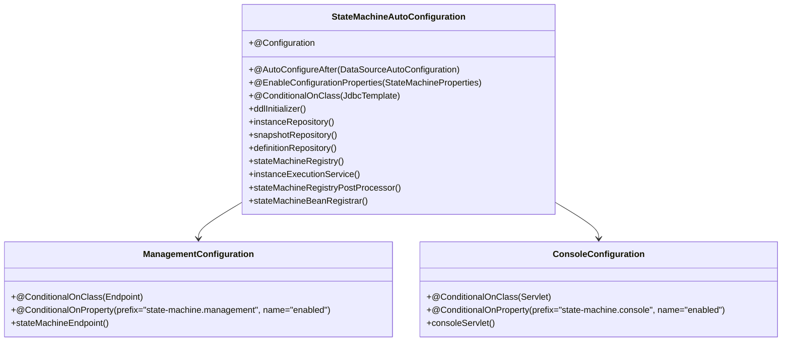

**图表来源**
- [StateMachineAutoConfiguration.java:32-149](file://state-machine-boot-starter/src/main/java/cn/chedejun/statemachine/autoconfigure/StateMachineAutoConfiguration.java#L32-L149)

**章节来源**
- [StateMachineAutoConfiguration.java:32-149](file://state-machine-boot-starter/src/main/java/cn/chedejun/statemachine/autoconfigure/StateMachineAutoConfiguration.java#L32-L149)

## 架构概览

状态机自动配置的整体架构如下：

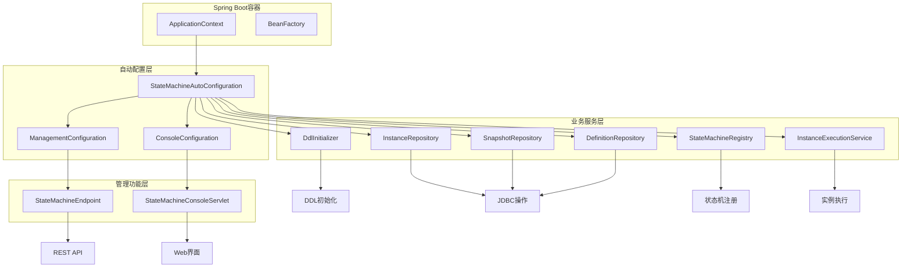

**图表来源**
- [StateMachineAutoConfiguration.java:32-149](file://state-machine-boot-starter/src/main/java/cn/chedejun/statemachine/autoconfigure/StateMachineAutoConfiguration.java#L32-L149)
- [DdlInitializer.java:11-66](file://state-machine-boot-starter/src/main/java/cn/chedejun/statemachine/persistence/DdlInitializer.java#L11-L66)

## 详细组件分析

### StateMachineAutoConfiguration类深度解析

#### 类层次结构

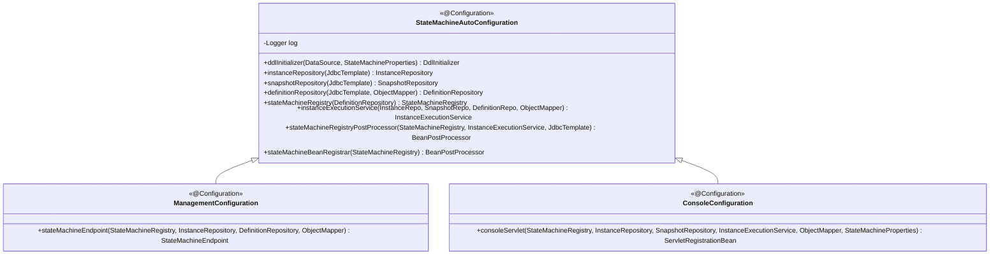

**图表来源**
- [StateMachineAutoConfiguration.java:32-149](file://state-machine-boot-starter/src/main/java/cn/chedejun/statemachine/autoconfigure/StateMachineAutoConfiguration.java#L32-L149)

#### 条件注册逻辑

自动配置的核心在于精确的条件判断，确保只有在满足特定环境条件时才注册相应的Bean：

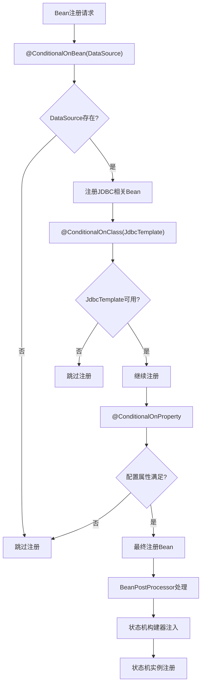

**图表来源**
- [StateMachineAutoConfiguration.java:39-93](file://state-machine-boot-starter/src/main/java/cn/chedejun/statemachine/autoconfigure/StateMachineAutoConfiguration.java#L39-L93)

#### Bean注册序列

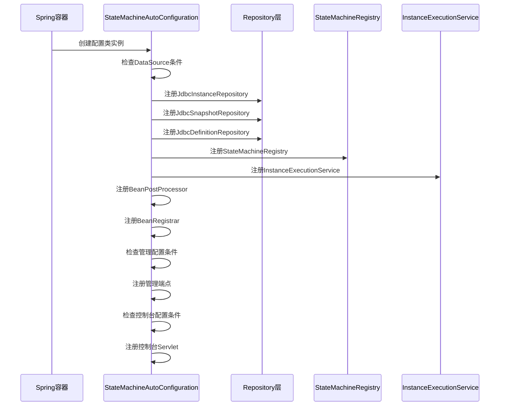

**图表来源**
- [StateMachineAutoConfiguration.java:39-147](file://state-machine-boot-starter/src/main/java/cn/chedejun/statemachine/autoconfigure/StateMachineAutoConfiguration.java#L39-L147)

**章节来源**
- [StateMachineAutoConfiguration.java:32-149](file://state-machine-boot-starter/src/main/java/cn/chedejun/statemachine/autoconfigure/StateMachineAutoConfiguration.java#L32-L149)

### 配置属性管理

#### StateMachineProperties结构

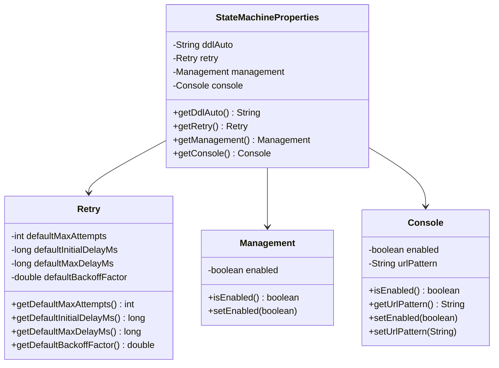

**图表来源**
- [StateMachineProperties.java:5-42](file://state-machine-boot-starter/src/main/java/cn/chedejun/statemachine/autoconfigure/StateMachineProperties.java#L5-L42)

#### 配置属性验证流程

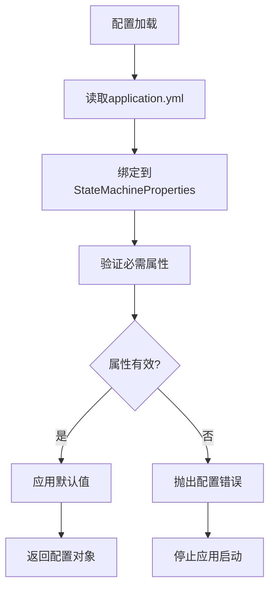

**图表来源**
- [StateMachineProperties.java:5-42](file://state-machine-boot-starter/src/main/java/cn/chedejun/statemachine/autoconfigure/StateMachineProperties.java#L5-L42)

**章节来源**
- [StateMachineProperties.java:1-42](file://state-machine-boot-starter/src/main/java/cn/chedejun/statemachine/autoconfigure/StateMachineProperties.java#L1-L42)

### 数据库初始化机制

#### DdlInitializer实现

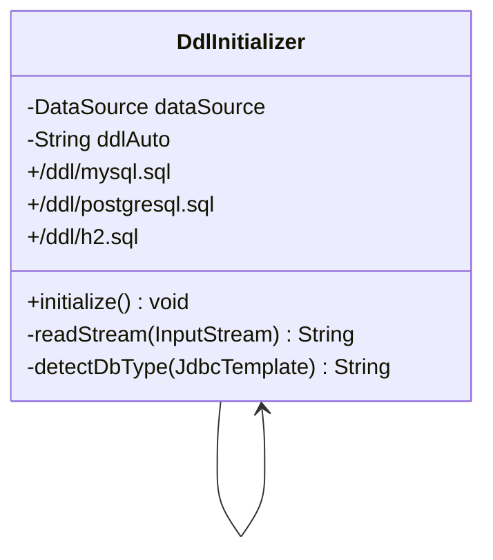

**图表来源**
- [DdlInitializer.java:11-66](file://state-machine-boot-starter/src/main/java/cn/chedejun/statemachine/persistence/DdlInitializer.java#L11-L66)

#### 数据库检测和初始化流程

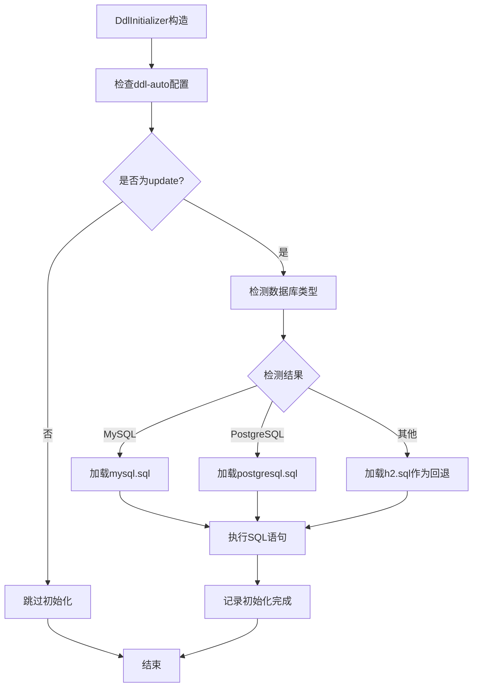

**图表来源**
- [DdlInitializer.java:22-45](file://state-machine-boot-starter/src/main/java/cn/chedejun/statemachine/persistence/DdlInitializer.java#L22-L45)

**章节来源**
- [DdlInitializer.java:1-66](file://state-machine-boot-starter/src/main/java/cn/chedejun/statemachine/persistence/DdlInitializer.java#L1-L66)

### 管理功能实现

#### Actuator端点设计

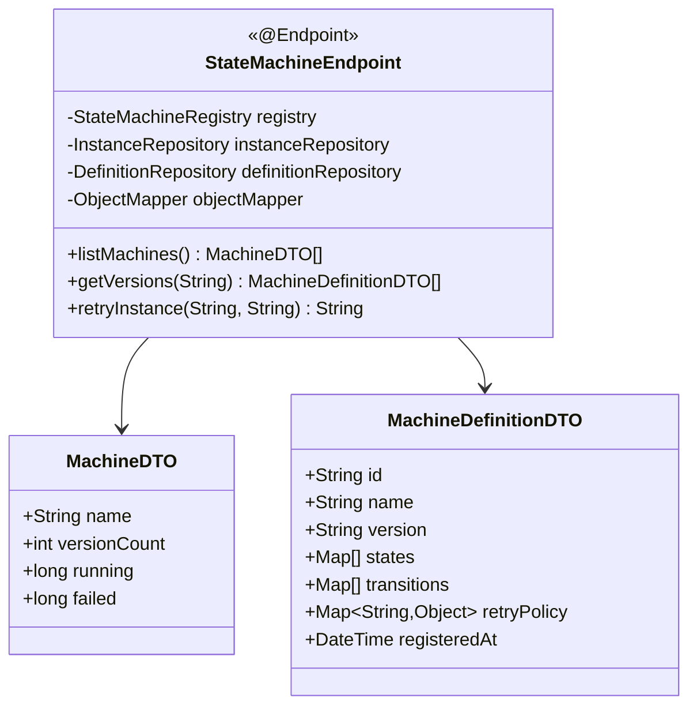

**图表来源**
- [StateMachineEndpoint.java:22-80](file://state-machine-boot-starter/src/main/java/cn/chedejun/statemachine/management/StateMachineEndpoint.java#L22-L80)

#### Web控制台架构

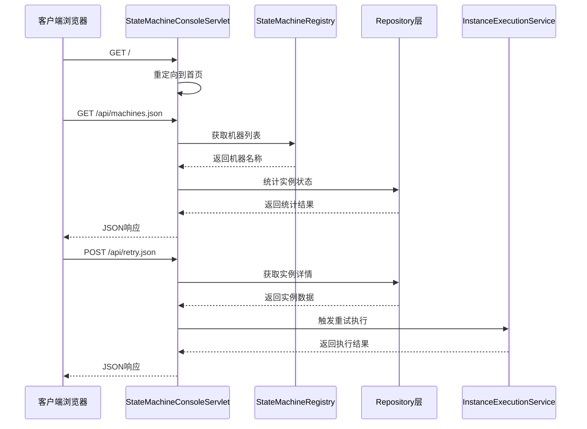

**图表来源**
- [StateMachineConsoleServlet.java:113-158](file://state-machine-boot-starter/src/main/java/cn/chedejun/statemachine/management/StateMachineConsoleServlet.java#L113-L158)

**章节来源**
- [StateMachineEndpoint.java:1-80](file://state-machine-boot-starter/src/main/java/cn/chedejun/statemachine/management/StateMachineEndpoint.java#L1-L80)
- [StateMachineConsoleServlet.java:1-420](file://state-machine-boot-starter/src/main/java/cn/chedejun/statemachine/management/StateMachineConsoleServlet.java#L1-L420)

## 依赖关系分析

### Maven依赖结构

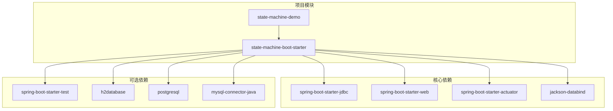

**图表来源**
- [pom.xml:57-98](file://state-machine-boot-starter/pom.xml#L57-L98)

### 运行时依赖链

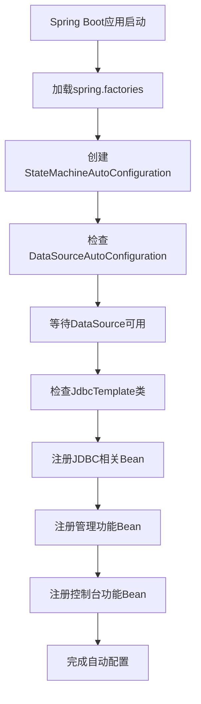

**图表来源**
- [StateMachineAutoConfiguration.java:32-36](file://state-machine-boot-starter/src/main/java/cn/chedejun/statemachine/autoconfigure/StateMachineAutoConfiguration.java#L32-L36)

**章节来源**
- [pom.xml:57-98](file://state-machine-boot-starter/pom.xml#L57-L98)
- [StateMachineAutoConfiguration.java:32-36](file://state-machine-boot-starter/src/main/java/cn/chedejun/statemachine/autoconfigure/StateMachineAutoConfiguration.java#L32-L36)

## 性能考虑

### Bean注册优化

自动配置通过条件注解实现了智能的Bean注册，避免了不必要的Bean创建：

- **延迟初始化**: 仅在DataSource存在时才创建JDBC相关的Bean
- **按需加载**: 管理端点和控制台仅在相应配置启用时注册
- **类型安全**: 使用`@ConditionalOnClass`确保运行时类可用性

### 数据库初始化性能

- **DDL脚本缓存**: 初始化时一次性加载并执行所有DDL语句
- **数据库类型检测**: 通过JDBC URL检测数据库类型，避免多次尝试
- **回退机制**: 当特定数据库脚本缺失时自动回退到H2脚本

### 内存使用优化

- **Repository模式**: 使用JDBC模板进行数据库操作，减少内存占用
- **流式处理**: 控制台Servlet支持分页查询，限制单次查询的数据量
- **JSON序列化**: 使用Jackson进行高效的JSON序列化和反序列化

## 故障排除指南

### 常见问题诊断

#### 自动配置未生效

**症状**: 状态机相关Bean未被注册

**可能原因**:
1. 缺少DataSource配置
2. spring.factories文件未正确放置
3. 条件注解不满足

**解决方案**:
1. 检查DataSource配置是否正确
2. 确认spring.factories位于META-INF目录
3. 验证条件注解的依赖项是否存在

#### 数据库初始化失败

**症状**: 启动时出现DDL初始化错误

**可能原因**:
1. 数据库连接失败
2. 缺少对应数据库的DDL脚本
3. SQL语法错误

**解决方案**:
1. 检查数据库连接信息
2. 确认DDL脚本文件存在
3. 查看具体SQL错误信息

#### 管理端点不可访问

**症状**: /actuator/state-machines端点返回404

**可能原因**:
1. spring-boot-starter-actuator未添加
2. 端点未启用
3. 权限配置问题

**解决方案**:
1. 添加actuator依赖
2. 在application.yml中启用端点
3. 检查安全配置

**章节来源**
- [DdlInitializer.java:41-44](file://state-machine-boot-starter/src/main/java/cn/chedejun/statemachine/persistence/DdlInitializer.java#L41-L44)
- [application.yml:18-27](file://state-machine-demo/src/main/resources/application.yml#L18-L27)

## 结论

Spring Boot自动配置机制在状态机项目中展现了优雅的设计理念：

1. **条件驱动**: 通过多层次的条件注解确保Bean的精确注册
2. **按需加载**: 仅在满足特定条件时才初始化相关功能
3. **类型安全**: 使用类存在性检查避免运行时错误
4. **配置灵活**: 通过属性配置控制功能的启用和行为

StateMachineAutoConfiguration类作为核心组件，成功地将复杂的业务逻辑封装在简洁的自动配置中，为开发者提供了开箱即用的状态机解决方案。其设计充分体现了Spring Boot的"约定优于配置"原则，既保证了易用性，又保持了足够的灵活性。

## 附录

### 配置参考

#### 基础配置

```yaml
state-machine:
  ddl-auto: update          # DDL初始化策略
  management:
    enabled: true           # 启用管理端点
  console:
    enabled: true           # 启用控制台
    url-pattern: /statemachine/*  # 控制台URL模式
```

#### 高级配置

```yaml
state-machine:
  retry:
    default-max-attempts: 3
    default-initial-delay-ms: 1000
    default-max-delay-ms: 30000
    default-backoff-factor: 2.0
```

### 最佳实践

1. **合理使用条件注解**: 根据实际需求选择合适的条件组合
2. **配置分离**: 将不同环境的配置分离到不同的配置文件中
3. **监控和日志**: 启用适当的日志级别以便于调试
4. **测试覆盖**: 为自定义配置编写单元测试和集成测试