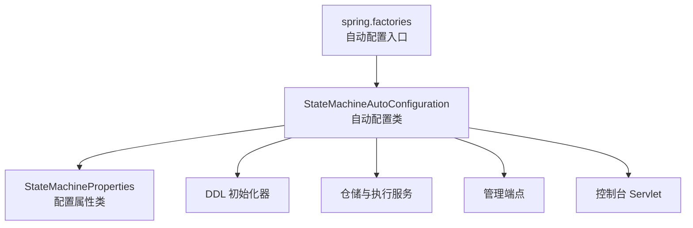
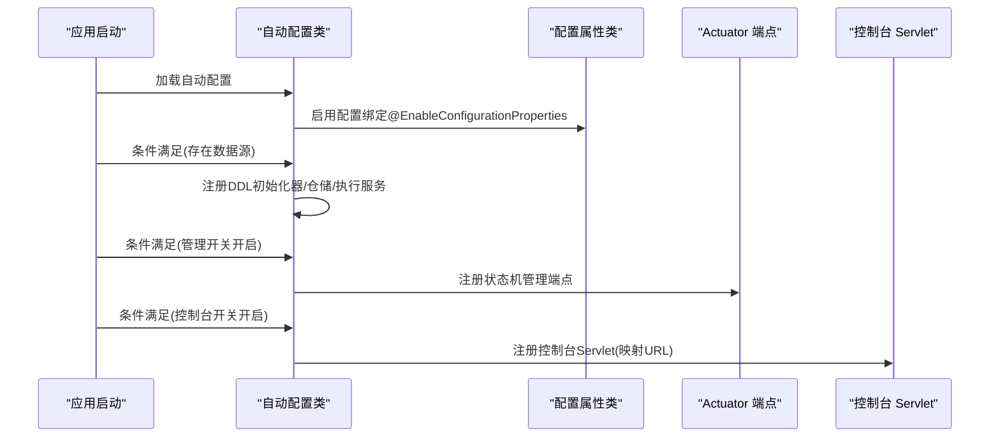
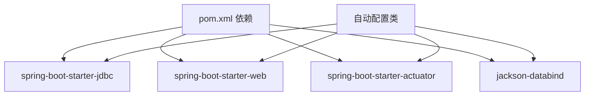

# 配置属性管理

<cite>
**本文档引用的文件**
- [StateMachineProperties.java](file://state-machine-boot-starter/src/main/java/cn/chedejun/statemachine/autoconfigure/StateMachineProperties.java)
- [StateMachineAutoConfiguration.java](file://state-machine-boot-starter/src/main/java/cn/chedejun/statemachine/autoconfigure/StateMachineAutoConfiguration.java)
- [spring.factories](file://state-machine-boot-starter/src/main/resources/META-INF/spring.factories)
- [application.yml（测试）](file://state-machine-boot-starter/src/test/resources/application.yml)
- [application.yml（演示）](file://state-machine-demo/src/main/resources/application.yml)
- [StateMachineEndpoint.java](file://state-machine-boot-starter/src/main/java/cn/chedejun/statemachine/management/StateMachineEndpoint.java)
- [StateMachineConsoleServlet.java](file://state-machine-boot-starter/src/main/java/cn/chedejun/statemachine/management/StateMachineConsoleServlet.java)
- [pom.xml](file://state-machine-boot-starter/pom.xml)
</cite>

## 目录
1. [简介](#简介)
2. [项目结构](#项目结构)
3. [核心组件](#核心组件)
4. [架构总览](#架构总览)
5. [详细组件分析](#详细组件分析)
6. [依赖分析](#依赖分析)
7. [性能考虑](#性能考虑)
8. [故障排除指南](#故障排除指南)
9. [结论](#结论)
10. [附录](#附录)

## 简介
本文件系统性阐述状态机启动器的配置属性管理机制，重点围绕 StateMachineProperties 类的设计与实现，解释其配置项的语义、默认值与验证规则；说明 application.yml 与 application.properties 的配置示例；解析配置绑定机制与类型安全验证；并给出完整的配置参数清单（含数据库连接、Web 控制台、Actuator 端点等），以及配置优先级与覆盖规则说明。

## 项目结构
该模块采用 Spring Boot 自动配置模式，通过 @ConfigurationProperties 绑定前缀为 state-machine 的外部配置，结合 EnableAutoConfiguration 与 spring.factories 完成自动装配。

图表来源
- [spring.factories:1-3](file://state-machine-boot-starter/src/main/resources/META-INF/spring.factories#L1-L3)
- [StateMachineAutoConfiguration.java:32-149](file://state-machine-boot-starter/src/main/java/cn/chedejun/statemachine/autoconfigure/StateMachineAutoConfiguration.java#L32-L149)
- [StateMachineProperties.java:5-41](file://state-machine-boot-starter/src/main/java/cn/chedejun/statemachine/autoconfigure/StateMachineProperties.java#L5-L41)

章节来源
- [spring.factories:1-3](file://state-machine-boot-starter/src/main/resources/META-INF/spring.factories#L1-L3)
- [StateMachineAutoConfiguration.java:32-149](file://state-machine-boot-starter/src/main/java/cn/chedejun/statemachine/autoconfigure/StateMachineAutoConfiguration.java#L32-L149)

## 核心组件
- StateMachineProperties：定义 state-machine 前缀下的全部配置项，支持嵌套子对象（Retry、Management、Console）。
- StateMachineAutoConfiguration：启用配置绑定、条件加载相关 Bean、按开关控制管理端点与控制台 Servlet 的注册。
- spring.factories：声明自动配置类，使 Spring Boot 在启动时自动发现并应用。

章节来源
- [StateMachineProperties.java:5-41](file://state-machine-boot-starter/src/main/java/cn/chedejun/statemachine/autoconfigure/StateMachineProperties.java#L5-L41)
- [StateMachineAutoConfiguration.java:32-149](file://state-machine-boot-starter/src/main/java/cn/chedejun/statemachine/autoconfigure/StateMachineAutoConfiguration.java#L32-L149)
- [spring.factories:1-3](file://state-machine-boot-starter/src/main/resources/META-INF/spring.factories#L1-L3)

## 架构总览
配置属性绑定与自动装配的关键流程如下：

图表来源
- [StateMachineAutoConfiguration.java:32-149](file://state-machine-boot-starter/src/main/java/cn/chedejun/statemachine/autoconfigure/StateMachineAutoConfiguration.java#L32-L149)
- [StateMachineProperties.java:5-41](file://state-machine-boot-starter/src/main/java/cn/chedejun/statemachine/autoconfigure/StateMachineProperties.java#L5-L41)

## 详细组件分析

### StateMachineProperties 设计与实现
- 前缀绑定：使用 @ConfigurationProperties(prefix = "state-machine") 将外部配置映射到该类。
- 主要配置项：
  - ddlAuto：DDL 行为，默认值为 "update"，用于初始化或迁移数据库结构。
  - retry：重试策略默认值（嵌套对象）
    - defaultMaxAttempts：默认最大重试次数
    - defaultInitialDelayMs：初始延迟（毫秒）
    - defaultMaxDelayMs：最大延迟（毫秒）
    - defaultBackoffFactor：退避因子
  - management：管理端点开关
    - enabled：是否启用 Actuator 端点，默认 true
  - console：Web 控制台开关与映射
    - enabled：是否启用控制台，默认 true
    - urlPattern：控制台映射路径，默认 "/statemachine/*"

- 验证规则与约束
  - 字段均为简单类型（String、int、long、double、boolean），Spring Boot 默认进行基本类型转换与校验。
  - 未在代码中显式添加 JSR-303 注解，因此不进行运行时字段级约束校验。
  - urlPattern 仅作字符串处理，建议遵循 Servlet 映射规范。

- 与自动配置的交互
  - AutoConfiguration 通过 @EnableConfigurationProperties(StateMachineProperties.class) 启用绑定。
  - 控制台与管理端点的启用由 @ConditionalOnProperty 基于 state-machine.management.enabled 与 state-machine.console.enabled 判定，默认开启。

章节来源
- [StateMachineProperties.java:5-41](file://state-machine-boot-starter/src/main/java/cn/chedejun/statemachine/autoconfigure/StateMachineProperties.java#L5-L41)
- [StateMachineAutoConfiguration.java:32-149](file://state-machine-boot-starter/src/main/java/cn/chedejun/statemachine/autoconfigure/StateMachineAutoConfiguration.java#L32-L149)

### 配置绑定机制与类型安全验证
- 绑定机制
  - 通过 @EnableConfigurationProperties 启用对 StateMachineProperties 的绑定。
  - Spring Boot 在容器启动时扫描 @ConfigurationProperties 并将外部配置映射到属性类。
- 类型安全
  - 由于字段为基本类型与简单对象，Spring Boot 默认进行类型转换（如整数、布尔、字符串）。
  - 未使用 JSR-303 注解，因此不进行运行时字段级约束校验（例如范围检查）。
- 自动配置中的使用
  - AutoConfiguration 从 StateMachineProperties 获取 ddlAuto、console.urlPattern 等值，用于 Bean 创建与注册。

章节来源
- [StateMachineAutoConfiguration.java:32-149](file://state-machine-boot-starter/src/main/java/cn/chedejun/statemachine/autoconfigure/StateMachineAutoConfiguration.java#L32-L149)
- [StateMachineProperties.java:5-41](file://state-machine-boot-starter/src/main/java/cn/chedejun/statemachine/autoconfigure/StateMachineProperties.java#L5-L41)

### 配置示例（application.yml）
- 测试环境示例
  - 包含数据源配置与 state-machine 下的 ddl-auto、management.enabled、console.enabled。
- 演示环境示例
  - 包含 server.port、context-path、数据源配置，以及 state-machine 下的管理与控制台开关。

章节来源
- [application.yml（测试）:1-14](file://state-machine-boot-starter/src/test/resources/application.yml#L1-L14)
- [application.yml（演示）:1-27](file://state-machine-demo/src/main/resources/application.yml#L1-L27)

### 配置参数清单
- 数据库连接（Spring Boot 默认）
  - spring.datasource.url：数据库连接地址
  - spring.datasource.username：用户名
  - spring.datasource.password：密码
  - spring.datasource.driver-class-name：驱动类名
- 状态机配置（state-machine 前缀）
  - state-machine.ddl-auto：DDL 行为（如 update）
  - state-machine.management.enabled：是否启用管理端点（默认 true）
  - state-machine.console.enabled：是否启用控制台（默认 true）
  - state-machine.console.url-pattern：控制台映射路径（默认 "/statemachine/*"）
  - state-machine.retry.default-max-attempts：默认最大重试次数（默认 3）
  - state-machine.retry.default-initial-delay-ms：初始延迟（毫秒，默认 1000）
  - state-machine.retry.default-max-delay-ms：最大延迟（毫秒，默认 30000）
  - state-machine.retry.default-backoff-factor：退避因子（默认 2.0）

章节来源
- [application.yml（测试）:1-14](file://state-machine-boot-starter/src/test/resources/application.yml#L1-L14)
- [application.yml（演示）:1-27](file://state-machine-demo/src/main/resources/application.yml#L1-L27)
- [StateMachineProperties.java:7-40](file://state-machine-boot-starter/src/main/java/cn/chedejun/statemachine/autoconfigure/StateMachineProperties.java#L7-L40)

### 配置优先级与覆盖规则
- Spring Boot 配置优先级（从高到低）
  1) 命令行参数
  2) SPRING_APPLICATION_JSON
  3) 环境变量
  4) application-{profile}.yml / application-{profile}.properties
  5) application.yml / application.properties
  6) @PropertySource
  7) 默认属性
- 覆盖规则
  - 同一层级后加载的配置会覆盖先前的同名键值。
  - profile 相关配置（如 application-dev.yml）优先于 application.yml。
  - 若未设置 state-machine.management.enabled 或 state-machine.console.enabled，则按默认值启用。
  - 若未设置 state-machine.console.url-pattern，则使用默认值 "/statemachine/*"。

章节来源
- [StateMachineAutoConfiguration.java:113-146](file://state-machine-boot-starter/src/main/java/cn/chedejun/statemachine/autoconfigure/StateMachineAutoConfiguration.java#L113-L146)
- [StateMachineProperties.java:32-40](file://state-machine-boot-starter/src/main/java/cn/chedejun/statemachine/autoconfigure/StateMachineProperties.java#L32-L40)

### 管理端点与控制台集成
- 管理端点（Actuator）
  - 当 state-machine.management.enabled 为 true 且存在 Actuator 依赖时，注册 /actuator/state-machines 端点。
  - 提供读取状态机列表、版本详情、实例统计与重试操作等能力。
- Web 控制台
  - 当 state-machine.console.enabled 为 true 且存在 Servlet 依赖时，注册 StateMachineConsoleServlet，并映射到 urlPattern。
  - 提供 Web UI 与 REST API（列出机器、版本、实例等）。

章节来源
- [StateMachineAutoConfiguration.java:111-147](file://state-machine-boot-starter/src/main/java/cn/chedejun/statemachine/autoconfigure/StateMachineAutoConfiguration.java#L111-L147)
- [StateMachineEndpoint.java:22-79](file://state-machine-boot-starter/src/main/java/cn/chedejun/statemachine/management/StateMachineEndpoint.java#L22-L79)
- [StateMachineConsoleServlet.java:39-200](file://state-machine-boot-starter/src/main/java/cn/chedejun/statemachine/management/StateMachineConsoleServlet.java#L39-L200)

## 依赖分析
- 自动配置入口
  - spring.factories 声明 EnableAutoConfiguration=StateMachineAutoConfiguration。
- 运行时依赖
  - spring-boot-starter-jdbc：JDBC 支持与数据源自动配置。
  - spring-boot-starter-web：Web 支持（用于控制台 Servlet）。
  - spring-boot-starter-actuator：Actuator 端点支持（用于管理端点）。
  - jackson-databind：JSON 序列化支持（用于 DTO 与日志输出）。

图表来源
- [pom.xml:57-98](file://state-machine-boot-starter/pom.xml#L57-L98)
- [StateMachineAutoConfiguration.java:32-149](file://state-machine-boot-starter/src/main/java/cn/chedejun/statemachine/autoconfigure/StateMachineAutoConfiguration.java#L32-L149)

章节来源
- [pom.xml:57-98](file://state-machine-boot-starter/pom.xml#L57-L98)
- [StateMachineAutoConfiguration.java:32-149](file://state-machine-boot-starter/src/main/java/cn/chedejun/statemachine/autoconfigure/StateMachineAutoConfiguration.java#L32-L149)

## 性能考虑
- 控制台与管理端点的启用仅在存在相应依赖与开关开启时生效，避免不必要的开销。
- 控制台 Servlet 采用 ServletRegistrationBean 动态注册，减少对 MVC 的耦合。
- 管理端点与控制台均依赖仓储层查询，建议在生产环境合理设置数据库连接池与索引，避免高并发下的查询压力。

## 故障排除指南
- 管理端点未出现
  - 检查 state-machine.management.enabled 是否为 true。
  - 确认已引入 spring-boot-starter-actuator。
  - 确认 Actuator 暴露配置允许访问 /actuator/state-machines。
- 控制台未显示
  - 检查 state-machine.console.enabled 是否为 true。
  - 确认已引入 spring-boot-starter-web。
  - 检查 urlPattern 是否被其他路由占用。
- 数据库初始化问题
  - 检查 spring.datasource.* 配置是否正确。
  - 确认 state-machine.ddl-auto 设置符合预期（如 update、validate、none 等）。
- 配置未生效
  - 确认配置文件位于正确的路径与 profile。
  - 检查是否存在更高优先级的配置覆盖了当前值。

章节来源
- [StateMachineAutoConfiguration.java:111-147](file://state-machine-boot-starter/src/main/java/cn/chedejun/statemachine/autoconfigure/StateMachineAutoConfiguration.java#L111-L147)
- [application.yml（演示）:18-27](file://state-machine-demo/src/main/resources/application.yml#L18-L27)

## 结论
StateMachineProperties 通过简洁的嵌套结构提供了对 DDL 行为、重试策略、管理端点与 Web 控制台的统一配置入口。配合 Spring Boot 的自动配置与类型安全绑定，开发者可以以最小成本启用状态机功能，并根据需要灵活调整行为与暴露方式。建议在生产环境中明确设置数据库连接、端点暴露与控制台映射，同时关注性能与安全配置。

## 附录

### 配置参数对照表
- 数据库连接
  - spring.datasource.url
  - spring.datasource.username
  - spring.datasource.password
  - spring.datasource.driver-class-name
- 状态机配置
  - state-machine.ddl-auto
  - state-machine.management.enabled
  - state-machine.console.enabled
  - state-machine.console.url-pattern
  - state-machine.retry.default-max-attempts
  - state-machine.retry.default-initial-delay-ms
  - state-machine.retry.default-max-delay-ms
  - state-machine.retry.default-backoff-factor

章节来源
- [application.yml（测试）:1-14](file://state-machine-boot-starter/src/test/resources/application.yml#L1-L14)
- [application.yml（演示）:1-27](file://state-machine-demo/src/main/resources/application.yml#L1-L27)
- [StateMachineProperties.java:7-40](file://state-machine-boot-starter/src/main/java/cn/chedejun/statemachine/autoconfigure/StateMachineProperties.java#L7-L40)