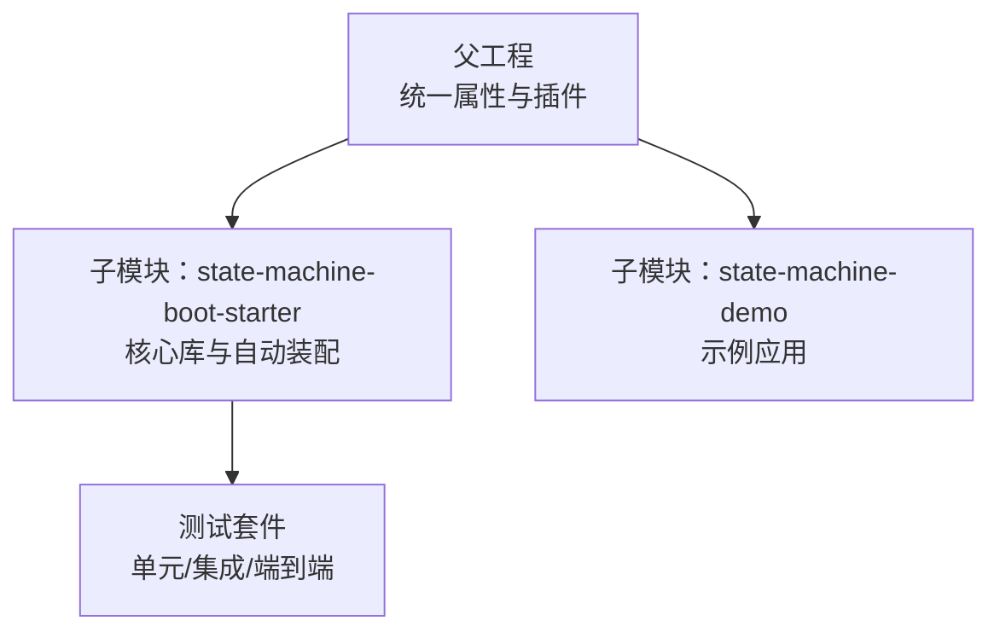
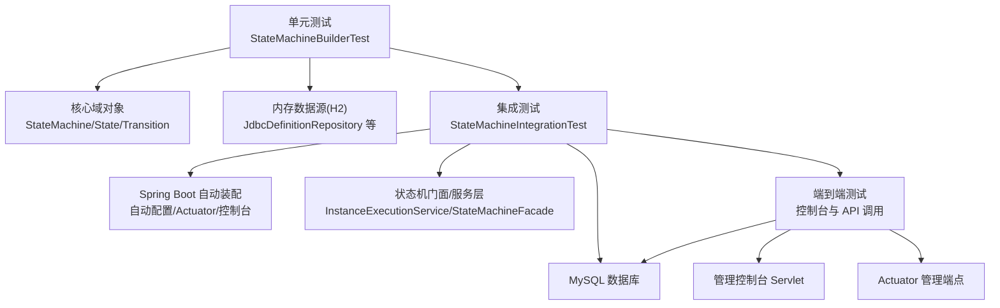
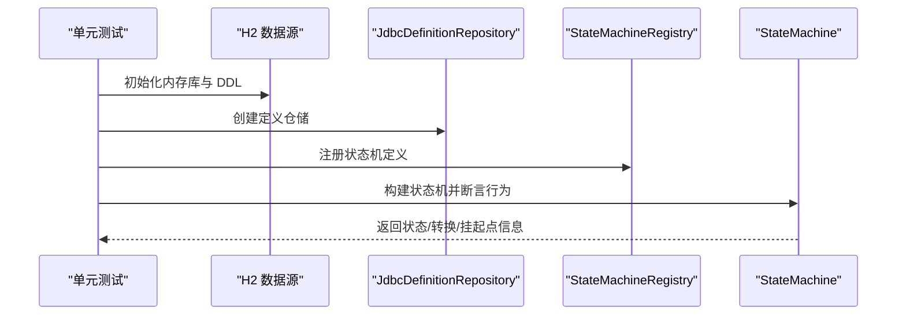
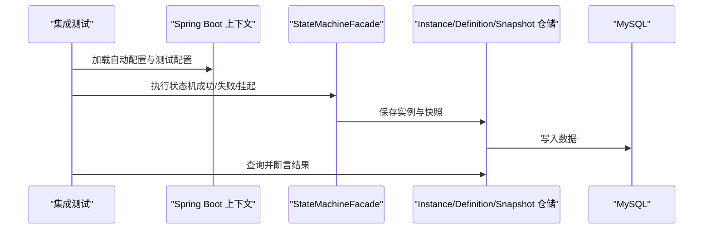
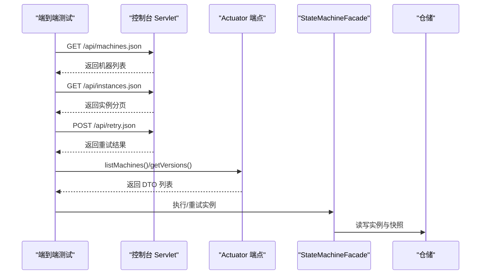
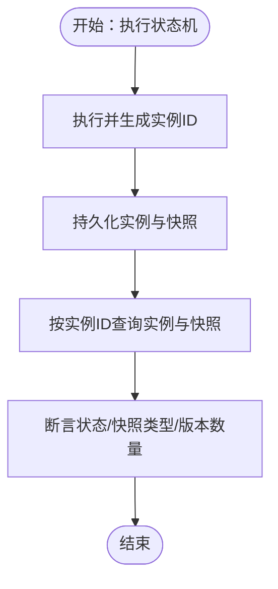
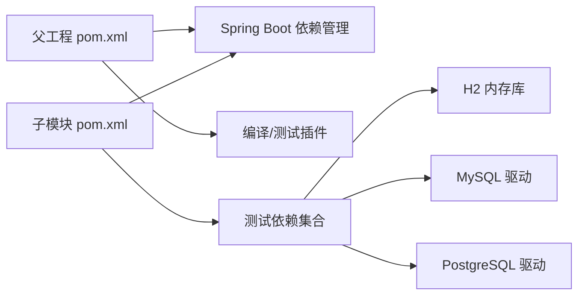

# 开发者指南

<cite>
**本文引用的文件**
- [pom.xml](file://pom.xml)
- [state-machine-boot-starter/pom.xml](file://state-machine-boot-starter/pom.xml)
- [state-machine-boot-starter/README.md](file://state-machine-boot-starter/README.md)
- [state-machine-boot-starter/src/test/java/cn/chedejun/statemachine/core/StateMachineBuilderTest.java](file://state-machine-boot-starter/src/test/java/cn/chedejun/statemachine/core/StateMachineBuilderTest.java)
- [state-machine-boot-starter/src/test/java/cn/chedejun/statemachine/integration/StateMachineIntegrationTest.java](file://state-machine-boot-starter/src/test/java/cn/chedejun/statemachine/integration/StateMachineIntegrationTest.java)
- [state-machine-boot-starter/src/test/resources/application.yml](file://state-machine-boot-starter/src/test/resources/application.yml)
- [openspec/config.yaml](file://openspec/config.yaml)
</cite>

## 目录
1. [简介](#简介)
2. [项目结构](#项目结构)
3. [核心组件](#核心组件)
4. [架构总览](#架构总览)
5. [详细组件分析](#详细组件分析)
6. [依赖分析](#依赖分析)
7. [性能考虑](#性能考虑)
8. [故障排查指南](#故障排查指南)
9. [结论](#结论)
10. [附录](#附录)

## 简介
本指南面向开源贡献者与维护者，系统阐述本项目的测试策略与测试金字塔组织方式（单元测试、集成测试、端到端测试），贡献流程（分支管理、提交规范、代码审查）、开发环境搭建与 IDE 配置建议、发布流程与版本管理策略，以及代码质量标准与静态分析工具配置建议。文档内容均基于仓库现有文件与测试实现进行归纳总结，确保可操作性与一致性。

## 项目结构
本项目采用多模块 Maven 结构：
- 父工程：统一版本、Java 版本属性、依赖管理与通用插件配置
- 子模块：
  - state-machine-boot-starter：核心库与 Spring Boot 自动装配
  - state-machine-demo：示例应用，演示如何使用状态机

图表来源
- [pom.xml:1-96](file://pom.xml#L1-L96)
- [state-machine-boot-starter/pom.xml:1-182](file://state-machine-boot-starter/pom.xml#L1-L182)

章节来源
- [pom.xml:1-96](file://pom.xml#L1-L96)
- [state-machine-boot-starter/pom.xml:1-182](file://state-machine-boot-starter/pom.xml#L1-L182)

## 核心组件
- 测试框架：JUnit 5（@SpringBootTest、@Test、@BeforeEach 等）
- 测试运行器：Maven Surefire 插件（版本在父工程中统一配置）
- 数据源与持久化：H2 内存库用于单元测试；MySQL 用于集成测试（测试资源中配置了远程 MySQL 连接）
- 自动装配与端点：通过 Spring Boot 自动装配加载状态机相关 Bean，并提供管理控制台与 Actuator 端点

章节来源
- [pom.xml:76-94](file://pom.xml#L76-L94)
- [state-machine-boot-starter/pom.xml:100-130](file://state-machine-boot-starter/pom.xml#L100-L130)
- [state-machine-boot-starter/src/test/java/cn/chedejun/statemachine/core/StateMachineBuilderTest.java:1-163](file://state-machine-boot-starter/src/test/java/cn/chedejun/statemachine/core/StateMachineBuilderTest.java#L1-L163)
- [state-machine-boot-starter/src/test/java/cn/chedejun/statemachine/integration/StateMachineIntegrationTest.java:1-483](file://state-machine-boot-starter/src/test/java/cn/chedejun/statemachine/integration/StateMachineIntegrationTest.java#L1-L483)
- [state-machine-boot-starter/src/test/resources/application.yml:1-14](file://state-machine-boot-starter/src/test/resources/application.yml#L1-L14)

## 架构总览
下图展示了从“单元测试”到“集成测试再到端到端测试”的测试金字塔结构，以及测试所依赖的数据源与自动装配能力：

图表来源
- [state-machine-boot-starter/src/test/java/cn/chedejun/statemachine/core/StateMachineBuilderTest.java:18-33](file://state-machine-boot-starter/src/test/java/cn/chedejun/statemachine/core/StateMachineBuilderTest.java#L18-L33)
- [state-machine-boot-starter/src/test/java/cn/chedejun/statemachine/integration/StateMachineIntegrationTest.java:58-69](file://state-machine-boot-starter/src/test/java/cn/chedejun/statemachine/integration/StateMachineIntegrationTest.java#L58-L69)
- [state-machine-boot-starter/src/test/resources/application.yml:1-14](file://state-machine-boot-starter/src/test/resources/application.yml#L1-L14)

## 详细组件分析

### 单元测试：核心构建与行为验证
- 目标：验证状态机构建、状态与转换定义、挂起点行为、路由失败时的错误信息等核心逻辑
- 数据源：H2 内存库，DDL 由资源脚本初始化
- 关键断言：状态数量、转换数量、挂起点标记、失败时可用路径提示等

图表来源
- [state-machine-boot-starter/src/test/java/cn/chedejun/statemachine/core/StateMachineBuilderTest.java:22-33](file://state-machine-boot-starter/src/test/java/cn/chedejun/statemachine/core/StateMachineBuilderTest.java#L22-L33)
- [state-machine-boot-starter/src/test/java/cn/chedejun/statemachine/core/StateMachineBuilderTest.java:35-83](file://state-machine-boot-starter/src/test/java/cn/chedejun/statemachine/core/StateMachineBuilderTest.java#L35-L83)
- [state-machine-boot-starter/src/test/java/cn/chedejun/statemachine/core/StateMachineBuilderTest.java:85-124](file://state-machine-boot-starter/src/test/java/cn/chedejun/statemachine/core/StateMachineBuilderTest.java#L85-L124)
- [state-machine-boot-starter/src/test/java/cn/chedejun/statemachine/core/StateMachineBuilderTest.java:126-161](file://state-machine-boot-starter/src/test/java/cn/chedejun/statemachine/core/StateMachineBuilderTest.java#L126-L161)

章节来源
- [state-machine-boot-starter/src/test/java/cn/chedejun/statemachine/core/StateMachineBuilderTest.java:1-163](file://state-machine-boot-starter/src/test/java/cn/chedejun/statemachine/core/StateMachineBuilderTest.java#L1-L163)

### 集成测试：自动装配、持久化与重试机制
- 目标：验证自动装配是否正确加载 Bean、配置项绑定、状态机定义入库、实例与快照持久化、失败重试记录、挂起/恢复流程
- 数据源：MySQL（测试资源中配置了远程连接参数）
- 关键断言：定义入库、实例状态、快照类型与顺序、失败快照状态、重试计数、挂起/恢复后状态变化

图表来源
- [state-machine-boot-starter/src/test/java/cn/chedejun/statemachine/integration/StateMachineIntegrationTest.java:58-69](file://state-machine-boot-starter/src/test/java/cn/chedejun/statemachine/integration/StateMachineIntegrationTest.java#L58-L69)
- [state-machine-boot-starter/src/test/java/cn/chedejun/statemachine/integration/StateMachineIntegrationTest.java:225-253](file://state-machine-boot-starter/src/test/java/cn/chedejun/statemachine/integration/StateMachineIntegrationTest.java#L225-L253)
- [state-machine-boot-starter/src/test/java/cn/chedejun/statemachine/integration/StateMachineIntegrationTest.java:275-300](file://state-machine-boot-starter/src/test/java/cn/chedejun/statemachine/integration/StateMachineIntegrationTest.java#L275-L300)
- [state-machine-boot-starter/src/test/java/cn/chedejun/statemachine/integration/StateMachineIntegrationTest.java:396-414](file://state-machine-boot-starter/src/test/java/cn/chedejun/statemachine/integration/StateMachineIntegrationTest.java#L396-L414)

章节来源
- [state-machine-boot-starter/src/test/java/cn/chedejun/statemachine/integration/StateMachineIntegrationTest.java:1-483](file://state-machine-boot-starter/src/test/java/cn/chedejun/statemachine/integration/StateMachineIntegrationTest.java#L1-L483)
- [state-machine-boot-starter/src/test/resources/application.yml:1-14](file://state-machine-boot-starter/src/test/resources/application.yml#L1-L14)

### 端到端测试：控制台与 API
- 目标：验证管理控制台 Servlet 与 Actuator 端点的可用性，以及控制台 API 的机器列表、版本查询、实例查询、重试等接口
- 方法：通过 MockHttpServletRequest/Response 调用控制台 Servlet，或调用 Actuator 端点方法
- 关键断言：返回数据非空、状态码与字段值匹配、实例详情包含快照

图表来源
- [state-machine-boot-starter/src/test/java/cn/chedejun/statemachine/integration/StateMachineIntegrationTest.java:304-371](file://state-machine-boot-starter/src/test/java/cn/chedejun/statemachine/integration/StateMachineIntegrationTest.java#L304-L371)
- [state-machine-boot-starter/src/test/java/cn/chedejun/statemachine/integration/StateMachineIntegrationTest.java:374-392](file://state-machine-boot-starter/src/test/java/cn/chedejun/statemachine/integration/StateMachineIntegrationTest.java#L374-L392)

章节来源
- [state-machine-boot-starter/src/test/java/cn/chedejun/statemachine/integration/StateMachineIntegrationTest.java:304-371](file://state-machine-boot-starter/src/test/java/cn/chedejun/statemachine/integration/StateMachineIntegrationTest.java#L304-L371)
- [state-machine-boot-starter/src/test/java/cn/chedejun/statemachine/integration/StateMachineIntegrationTest.java:374-392](file://state-machine-boot-starter/src/test/java/cn/chedejun/statemachine/integration/StateMachineIntegrationTest.java#L374-L392)

### 测试流程与断言要点（流程图）
以下流程图概括了“成功执行—持久化—查询—断言”的典型流程：

图表来源
- [state-machine-boot-starter/src/test/java/cn/chedejun/statemachine/integration/StateMachineIntegrationTest.java:225-271](file://state-machine-boot-starter/src/test/java/cn/chedejun/statemachine/integration/StateMachineIntegrationTest.java#L225-L271)

## 依赖分析
- 父工程统一 Java 版本与编译插件，子模块继承 Spring Boot 依赖管理
- 测试依赖：JUnit 5、Spring Boot Starter Test、H2、MySQL、PostgreSQL
- 测试运行：Maven Surefire 插件负责测试执行

图表来源
- [pom.xml:27-74](file://pom.xml#L27-L74)
- [state-machine-boot-starter/pom.xml:45-98](file://state-machine-boot-starter/pom.xml#L45-L98)
- [pom.xml:76-94](file://pom.xml#L76-L94)

章节来源
- [pom.xml:1-96](file://pom.xml#L1-L96)
- [state-machine-boot-starter/pom.xml:1-182](file://state-machine-boot-starter/pom.xml#L1-L182)

## 性能考虑
- 单元测试优先：使用内存数据库（H2）减少 IO 延迟，提升测试速度
- 集成测试聚焦关键路径：仅对核心业务流程（执行、重试、挂起/恢复、控制台 API）进行端到端验证
- 数据清理：每个测试前清理相关表，避免跨用例干扰
- 并发与超时：重试策略使用指数退避，避免频繁轮询造成压力

## 故障排查指南
- 控制台不可用：确认自动装配已启用且控制台与管理端点开关开启
- 数据库连接异常：检查测试配置中的 JDBC URL、用户名与密码
- 快照类型不一致：确认 DDL 中新增列的兼容处理逻辑
- 挂起/恢复异常：确认当前状态与期望状态一致，且实例处于 SUSPENDED 状态

章节来源
- [state-machine-boot-starter/src/test/resources/application.yml:1-14](file://state-machine-boot-starter/src/test/resources/application.yml#L1-L14)
- [state-machine-boot-starter/src/test/java/cn/chedejun/statemachine/integration/StateMachineIntegrationTest.java:472-481](file://state-machine-boot-starter/src/test/java/cn/chedejun/statemachine/integration/StateMachineIntegrationTest.java#L472-L481)

## 结论
本项目以“单元测试为基础、集成测试为核心、端到端测试为出口”的金字塔式测试策略，覆盖了状态机构建、执行、持久化、重试、挂起/恢复与管理控制台的关键场景。通过明确的测试组织与断言策略，保证了核心功能的稳定性与可维护性。建议贡献者遵循本文档的流程与规范，确保新增或修改的功能具备充分的测试覆盖。

## 附录

### 贡献流程与规范
- 分支管理
  - 主干分支：master/main（受保护，变更通过 Pull Request 合并）
  - 功能分支：feature/<描述>，修复分支：fix/<描述>，发布分支：release/<版本号>
- 提交规范
  - 使用约定式提交（如 feat/fix/docs/chore），并在 PR 描述中说明变更动机、影响范围与测试要点
- 代码审查
  - 至少一名维护者审查，关注测试覆盖率、边界条件、错误处理与性能影响
- 变更驱动
  - 采用 Openspec 规范驱动的变更提案与任务拆分，保持设计与实现的一致性

章节来源
- [openspec/config.yaml:1-21](file://openspec/config.yaml#L1-L21)

### 开发环境搭建与 IDE 配置建议
- JDK 与 Maven
  - 使用 Java 8（与项目属性一致），确保 Maven 编译插件版本与目标版本匹配
- 数据库
  - 单元测试使用 H2 内存库；集成测试可使用本地 MySQL 或 Docker 容器
- IDE 推荐
  - IntelliJ IDEA：启用 JUnit 5 运行器、Maven 视图、Spring Boot Dashboard
  - Lombok 支持：若使用 Lombok，请在 IDE 中启用注解处理器
- 运行测试
  - 在 IDE 中直接运行单测/集成测试；或使用 Maven 命令执行测试生命周期

章节来源
- [pom.xml:13-20](file://pom.xml#L13-L20)
- [state-machine-boot-starter/pom.xml:36-43](file://state-machine-boot-starter/pom.xml#L36-L43)
- [state-machine-boot-starter/src/test/resources/application.yml:1-14](file://state-machine-boot-starter/src/test/resources/application.yml#L1-L14)

### 发布流程与版本管理策略
- 版本号
  - 当前子模块版本包含 JDK8 兼容标识，发布时建议遵循语义化版本（MAJOR.MINOR.PATCH）
- 发布配置
  - 使用 Central Portal 发布插件（替代传统 deploy 插件），配合 release profile 生成源码与 Javadoc
  - GPG 签名在 verify 阶段执行，确保制品完整性
- 发布步骤
  - 在 release 分支上打标签并构建，执行 verify 与签名，随后手动触发发布
  - 发布前确保所有测试通过，文档更新，变更日志完善

章节来源
- [state-machine-boot-starter/pom.xml:117-128](file://state-machine-boot-starter/pom.xml#L117-L128)
- [state-machine-boot-starter/pom.xml:132-180](file://state-machine-boot-starter/pom.xml#L132-L180)

### 代码质量标准与静态分析工具配置建议
- 代码风格
  - 统一使用项目既定的 Java 版本与编码（UTF-8），保持命名与包结构一致
- 静态分析
  - 建议引入 SpotBugs/FindBugs、PMD、Checkstyle 或 SonarQube，结合 Maven 插件在 CI 中执行
  - 对关键模块（核心域与持久化层）设置阈值与规则集
- 测试覆盖率
  - 使用 JaCoCo 在 CI 中统计覆盖率，要求核心模块达到一定阈值后再允许合并

[本节为通用实践建议，不直接分析具体文件，故无章节来源]

### 示例与快速开始
- 快速开始与配置参考：参见子模块 README 中的依赖、配置与控制台访问说明

章节来源
- [state-machine-boot-starter/README.md:1-65](file://state-machine-boot-starter/README.md#L1-L65)