# 实例恢复机制

<cite>
**本文档引用的文件**
- [ExecutionSnapshot.java](file://state-machine-boot-starter/src/main/java/cn/chedejun/statemachine/domain/snapshot/ExecutionSnapshot.java)
- [SnapshotData.java](file://state-machine-boot-starter/src/main/java/cn/chedejun/statemachine/domain/data/SnapshotData.java)
- [InstanceExecutionService.java](file://state-machine-boot-starter/src/main/java/cn/chedejun/statemachine/application/InstanceExecutionService.java)
- [SnapshotRepository.java](file://state-machine-boot-starter/src/main/java/cn/chedejun/statemachine/domain/repository/SnapshotRepository.java)
- [JdbcSnapshotRepository.java](file://state-machine-boot-starter/src/main/java/cn/chedejun/statemachine/infrastructure/persistence/JdbcSnapshotRepository.java)
- [StateMachineInstance.java](file://state-machine-boot-starter/src/main/java/cn/chedejun/statemachine/domain/instance/StateMachineInstance.java)
- [InstanceStatus.java](file://state-machine-boot-starter/src/main/java/cn/chedejun/statemachine/domain/shared/InstanceStatus.java)
- [ExecutionStatus.java](file://state-machine-boot-starter/src/main/java/cn/chedejun/statemachine/domain/shared/ExecutionStatus.java)
- [StateMachineFacade.java](file://state-machine-boot-starter/src/main/java/cn/chedejun/statemachine/interfaces/StateMachineFacade.java)
- [StateMachineConsoleServlet.java](file://state-machine-boot-starter/src/main/java/cn/chedejun/statemachine/management/StateMachineConsoleServlet.java)
- [mysql.sql](file://state-machine-boot-starter/src/main/resources/ddl/mysql.sql)
- [postgresql.sql](file://state-machine-boot-starter/src/main/resources/ddl/postgresql.sql)
- [StateMachineIntegrationTest.java](file://state-machine-boot-starter/src/test/java/cn/chedejun/statemachine/integration/StateMachineIntegrationTest.java)
- [RetryPolicy.java](file://state-machine-boot-starter/src/main/java/cn/chedejun/statemachine/core/RetryPolicy.java)
</cite>

## 更新摘要
**所做更改**
- 新增了从FAILED状态通过advance操作进行恢复的完整功能说明
- 添加了ADVANCE快照类型的详细说明和使用场景
- 更新了恢复策略章节以包含advance功能
- 新增了advance操作的异常处理和最佳实践
- 扩展了故障排除指南以涵盖advance相关问题

## 目录
1. [简介](#简介)
2. [项目结构](#项目结构)
3. [核心组件](#核心组件)
4. [架构概览](#架构概览)
5. [详细组件分析](#详细组件分析)
6. [依赖分析](#依赖分析)
7. [性能考虑](#性能考虑)
8. [故障排除指南](#故障排除指南)
9. [结论](#结论)

## 简介

本文件详细阐述了状态机实例恢复机制的设计与实现。该机制允许在系统中断或异常情况下，基于持久化的快照数据重新构建实例状态，恢复上下文数据，并准确定位执行指针，从而实现可靠的状态机执行恢复。**更新**：新增了从FAILED状态通过advance操作进行恢复的新能力，允许用户用新的Action替代原失败的Action执行，实现更灵活的实例推进机制。

## 项目结构

状态机项目采用分层架构设计，核心模块包括应用服务层、领域模型层、基础设施层和管理控制台层：

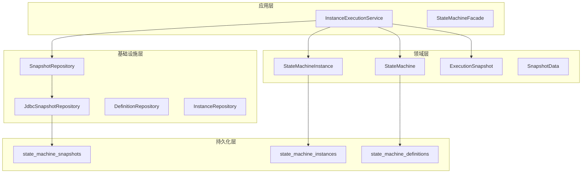
```mermaid
graph TB
subgraph "应用层"
A[InstanceExecutionService]
B[StateMachineFacade]
end
subgraph "领域层"
C[StateMachine]
D[StateMachineInstance]
E[ExecutionSnapshot]
F[SnapshotData]
end
subgraph "基础设施层"
G[SnapshotRepository]
H[JdbcSnapshotRepository]
I[DefinitionRepository]
J[InstanceRepository]
end
subgraph "持久化层"
K[state_machine_snapshots]
L[state_machine_instances]
M[state_machine_definitions]
end
A --> C
A --> D
A --> E
A --> G
G --> H
H --> K
D --> L
C --> M
```

**图表来源**
- [InstanceExecutionService.java:25-41](file://state-machine-boot-starter/src/main/java/cn/chedejun/statemachine/application/InstanceExecutionService.java#L25-L41)
- [JdbcSnapshotRepository.java:18-23](file://state-machine-boot-starter/src/main/java/cn/chedejun/statemachine/infrastructure/persistence/JdbcSnapshotRepository.java#L18-L23)
- [mysql.sql:1-19](file://state-machine-boot-starter/src/main/resources/ddl/mysql.sql#L1-L19)

**章节来源**
- [InstanceExecutionService.java:1-436](file://state-machine-boot-starter/src/main/java/cn/chedejun/statemachine/application/InstanceExecutionService.java#L1-L436)
- [JdbcSnapshotRepository.java:1-107](file://state-machine-boot-starter/src/main/java/cn/chedejun/statemachine/infrastructure/persistence/JdbcSnapshotRepository.java#L1-L107)

## 核心组件

### 快照聚合根 - ExecutionSnapshot

ExecutionSnapshot是不可变的快照聚合根，负责记录状态机执行的关键信息：

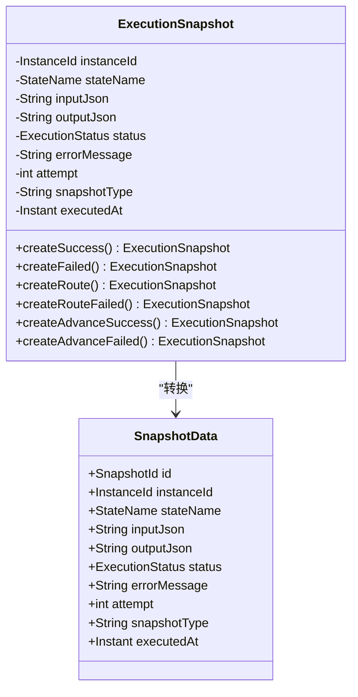
```mermaid
classDiagram
class ExecutionSnapshot {
-InstanceId instanceId
-StateName stateName
-String inputJson
-String outputJson
-ExecutionStatus status
-String errorMessage
-int attempt
-String snapshotType
-Instant executedAt
+createSuccess() ExecutionSnapshot
+createFailed() ExecutionSnapshot
+createRoute() ExecutionSnapshot
+createRouteFailed() ExecutionSnapshot
+createAdvanceSuccess() ExecutionSnapshot
+createAdvanceFailed() ExecutionSnapshot
}
class SnapshotData {
+SnapshotId id
+InstanceId instanceId
+StateName stateName
+String inputJson
+String outputJson
+ExecutionStatus status
+String errorMessage
+int attempt
+String snapshotType
+Instant executedAt
}
ExecutionSnapshot --> SnapshotData : "转换"
```

**图表来源**
- [ExecutionSnapshot.java:11-71](file://state-machine-boot-starter/src/main/java/cn/chedejun/statemachine/domain/snapshot/ExecutionSnapshot.java#L11-L71)
- [SnapshotData.java:8-54](file://state-machine-boot-starter/src/main/java/cn/chedejun/statemachine/domain/data/SnapshotData.java#L8-L54)

### 实例执行服务 - InstanceExecutionService

InstanceExecutionService是恢复机制的核心协调者，提供完整的恢复能力，**更新**：新增了advance方法支持从FAILED状态的实例推进：

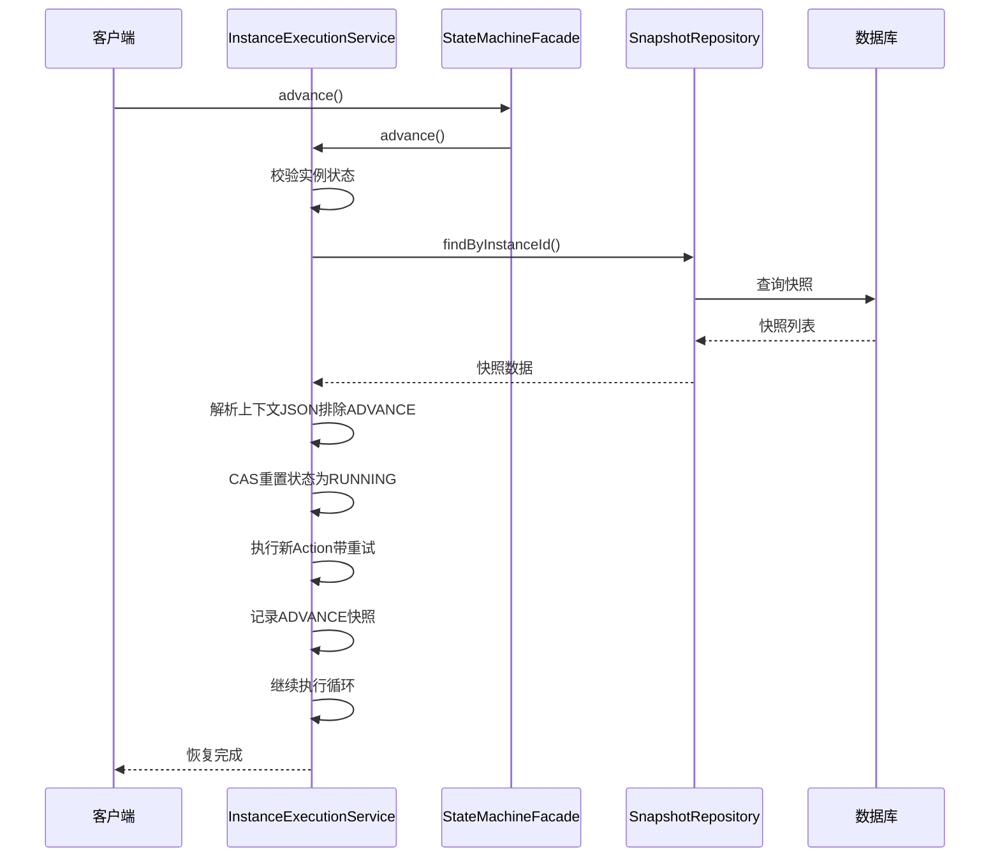
```mermaid
sequenceDiagram
participant Client as 客户端
participant Service as InstanceExecutionService
participant Facade as StateMachineFacade
participant Repo as SnapshotRepository
participant DB as 数据库
Client->>Facade : advance()
Facade->>Service : advance()
Service->>Service : 校验实例状态
Service->>Repo : findByInstanceId()
Repo->>DB : 查询快照
DB-->>Repo : 快照列表
Repo-->>Service : 快照数据
Service->>Service : 解析上下文JSON排除ADVANCE
Service->>Service : CAS重置状态为RUNNING
Service->>Service : 执行新Action带重试
Service->>Service : 记录ADVANCE快照
Service->>Service : 继续执行循环
Service-->>Client : 恢复完成
```

**图表来源**
- [InstanceExecutionService.java:126-179](file://state-machine-boot-starter/src/main/java/cn/chedejun/statemachine/application/InstanceExecutionService.java#L126-L179)

**章节来源**
- [InstanceExecutionService.java:25-436](file://state-machine-boot-starter/src/main/java/cn/chedejun/statemachine/application/InstanceExecutionService.java#L25-L436)

## 架构概览

恢复机制的整体架构遵循DDD分层原则，确保职责分离和可维护性，**更新**：新增了advance操作的架构支持：

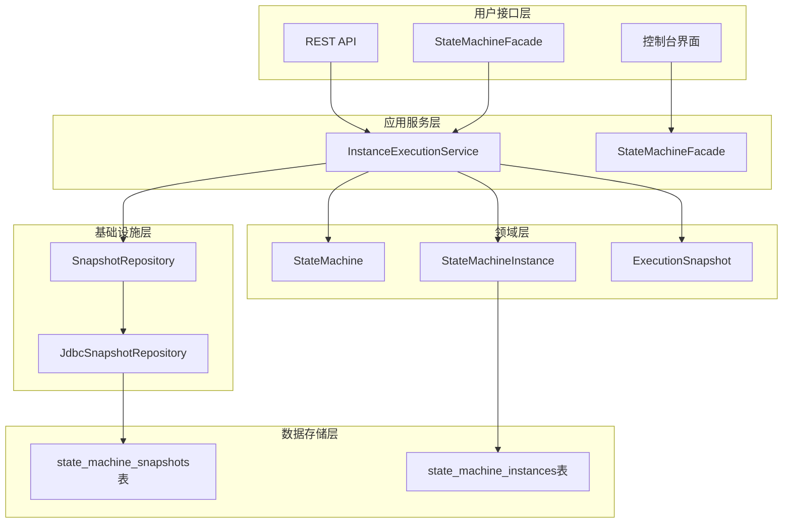
```mermaid
graph TB
subgraph "用户接口层"
A[REST API]
B[控制台界面]
C[StateMachineFacade]
end
subgraph "应用服务层"
D[InstanceExecutionService]
E[StateMachineFacade]
end
subgraph "领域层"
F[StateMachine]
G[StateMachineInstance]
H[ExecutionSnapshot]
end
subgraph "基础设施层"
I[SnapshotRepository]
J[JdbcSnapshotRepository]
end
subgraph "数据存储层"
K[state_machine_snapshots表]
L[state_machine_instances表]
end
A --> D
B --> E
C --> D
D --> F
D --> G
D --> H
D --> I
I --> J
J --> K
G --> L
```

**图表来源**
- [InstanceExecutionService.java:1-436](file://state-machine-boot-starter/src/main/java/cn/chedejun/statemachine/application/InstanceExecutionService.java#L1-L436)
- [JdbcSnapshotRepository.java:18-107](file://state-machine-boot-starter/src/main/java/cn/chedejun/statemachine/infrastructure/persistence/JdbcSnapshotRepository.java#L18-L107)

## 详细组件分析

### 恢复流程详解

#### 快照检索阶段

恢复流程的第一步是从数据库中检索相关的快照数据，**更新**：新增了对ADVANCE快照类型的排除处理：

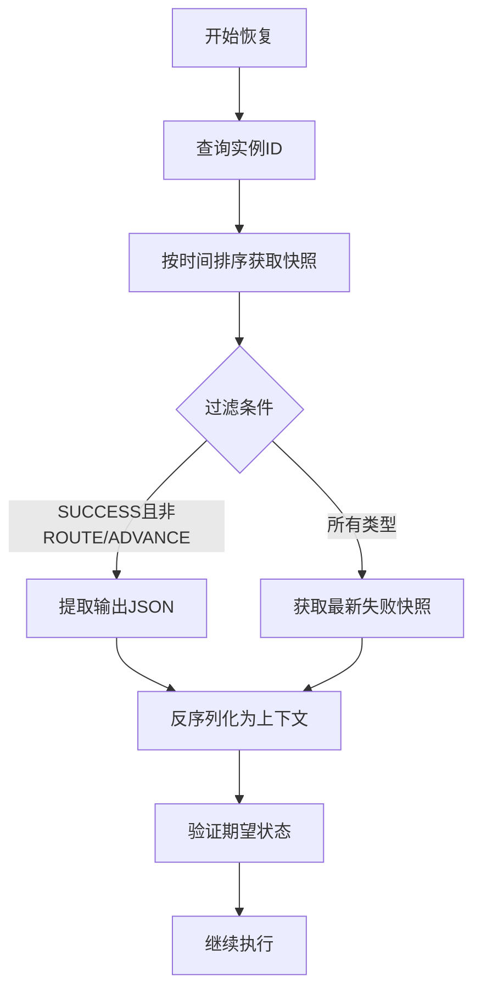
```mermaid
flowchart TD
A[开始恢复] --> B[查询实例ID]
B --> C[按时间排序获取快照]
C --> D{过滤条件}
D --> |SUCCESS且非ROUTE/ADVANCE| E[提取输出JSON]
D --> |所有类型| F[获取最新失败快照]
E --> G[反序列化为上下文]
F --> G
G --> H[验证期望状态]
H --> I[继续执行]
```

**图表来源**
- [InstanceExecutionService.java:133-143](file://state-machine-boot-starter/src/main/java/cn/chedejun/statemachine/application/InstanceExecutionService.java#L133-L143)
- [JdbcSnapshotRepository.java:26-30](file://state-machine-boot-starter/src/main/java/cn/chedejun/statemachine/infrastructure/persistence/JdbcSnapshotRepository.java#L26-L30)

#### 状态验证阶段

状态验证确保恢复操作的安全性和一致性，**更新**：新增了对FAILED状态的专门验证：

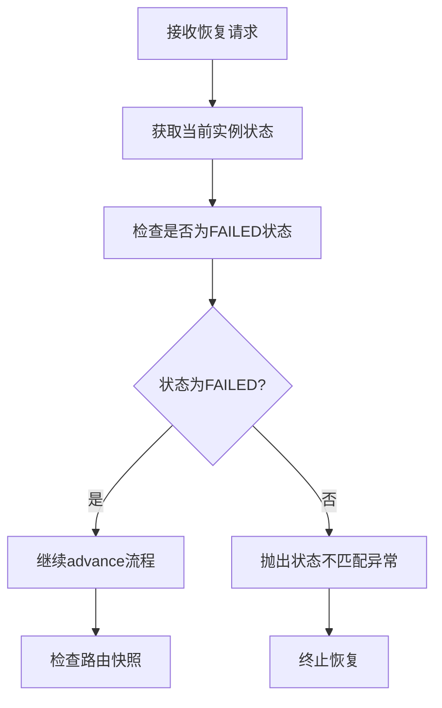
```mermaid
flowchart TD
A[接收恢复请求] --> B[获取当前实例状态]
B --> C[检查是否为FAILED状态]
C --> D{状态为FAILED?}
D --> |是| E[继续advance流程]
D --> |否| F[抛出状态不匹配异常]
E --> G[检查路由快照]
F --> H[终止恢复]
```

**图表来源**
- [InstanceExecutionService.java:129-131](file://state-machine-boot-starter/src/main/java/cn/chedejun/statemachine/application/InstanceExecutionService.java#L129-L131)

#### 上下文恢复阶段

上下文数据的准确恢复是恢复机制的关键，**更新**：新增了对ADVANCE快照类型的排除处理：

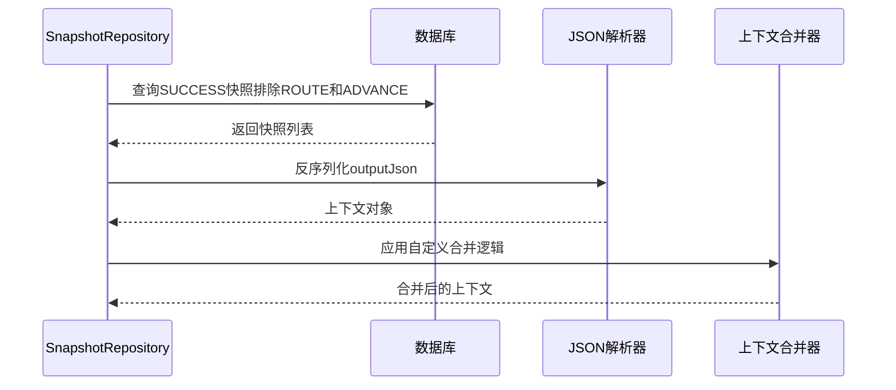
```mermaid
sequenceDiagram
participant S as SnapshotRepository
participant DB as 数据库
participant Parser as JSON解析器
participant Merger as 上下文合并器
S->>DB : 查询SUCCESS快照排除ROUTE和ADVANCE
DB-->>S : 返回快照列表
S->>Parser : 反序列化outputJson
Parser-->>S : 上下文对象
S->>Merger : 应用自定义合并逻辑
Merger-->>S : 合并后的上下文
```

**图表来源**
- [InstanceExecutionService.java:133-143](file://state-machine-boot-starter/src/main/java/cn/chedejun/statemachine/application/InstanceExecutionService.java#L133-L143)

### 不同状态下的恢复策略

#### 成功完成状态恢复

对于已完成的实例，恢复机制会直接标记为完成状态：

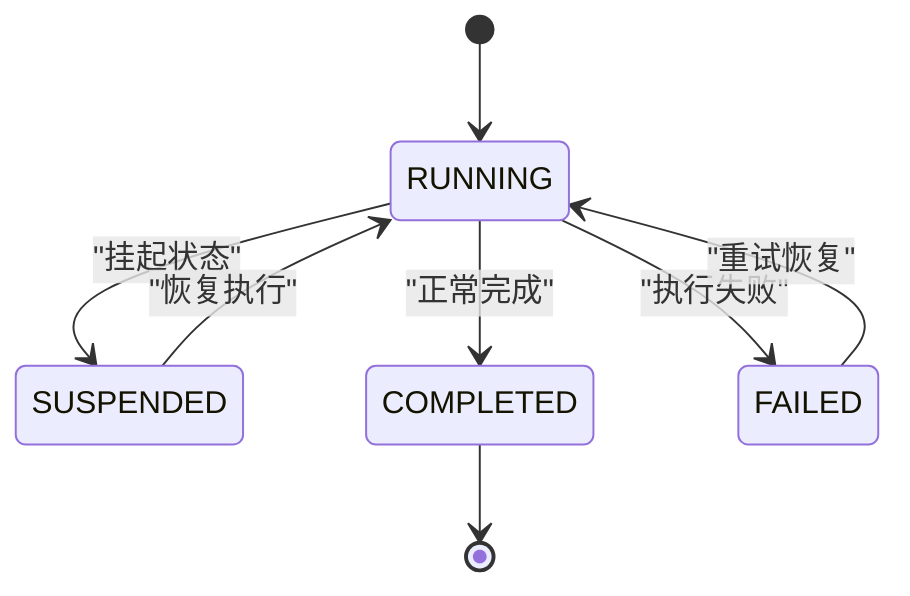
```mermaid
stateDiagram-v2
[*] --> RUNNING
RUNNING --> SUSPENDED : "挂起状态"
RUNNING --> COMPLETED : "正常完成"
SUSPENDED --> RUNNING : "恢复执行"
RUNNING --> FAILED : "执行失败"
FAILED --> RUNNING : "重试恢复"
COMPLETED --> [*]
```

**图表来源**
- [InstanceStatus.java:1-3](file://state-machine-boot-starter/src/main/java/cn/chedejun/statemachine/domain/shared/InstanceStatus.java#L1-L3)

#### 部分执行状态恢复

部分执行的实例需要精确恢复执行指针：

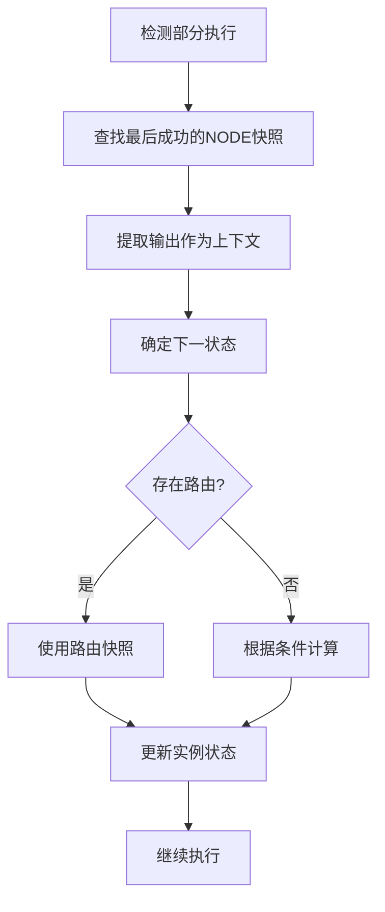
```mermaid
flowchart TD
A[检测部分执行] --> B[查找最后成功的NODE快照]
B --> C[提取输出作为上下文]
C --> D[确定下一状态]
D --> E{存在路由?}
E --> |是| F[使用路由快照]
E --> |否| G[根据条件计算]
F --> H[更新实例状态]
G --> H
H --> I[继续执行]
```

**图表来源**
- [InstanceExecutionService.java:178-184](file://state-machine-boot-starter/src/main/java/cn/chedejun/statemachine/application/InstanceExecutionService.java#L178-L184)

#### 失败重试场景

失败实例的恢复采用智能重试策略，**更新**：新增了advance操作的重试机制：

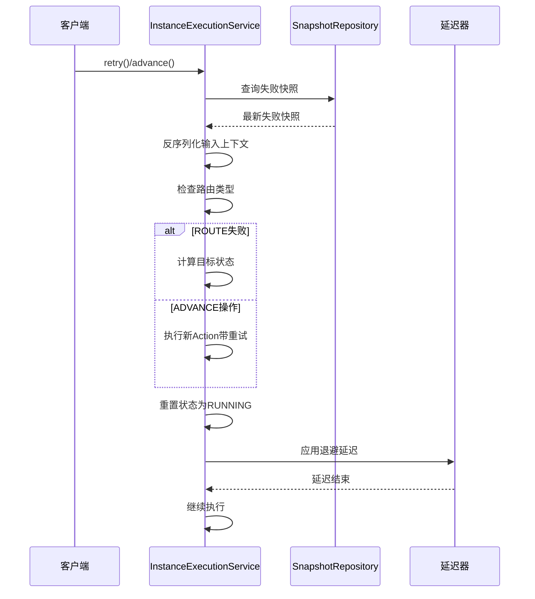
```mermaid
sequenceDiagram
participant Client as 客户端
participant Service as InstanceExecutionService
participant Repo as SnapshotRepository
participant Delay as 延迟器
Client->>Service : retry()/advance()
Service->>Repo : 查询失败快照
Repo-->>Service : 最新失败快照
Service->>Service : 反序列化输入上下文
Service->>Service : 检查路由类型
alt ROUTE失败
Service->>Service : 计算目标状态
else ADVANCE操作
Service->>Service : 执行新Action带重试
end
Service->>Service : 重置状态为RUNNING
Service->>Delay : 应用退避延迟
Delay-->>Service : 延迟结束
Service->>Service : 继续执行
```

**图表来源**
- [InstanceExecutionService.java:79-114](file://state-machine-boot-starter/src/main/java/cn/chedejun/statemachine/application/InstanceExecutionService.java#L79-L114)

#### ADVANCE推进场景

**新增**：从FAILED状态推进实例的专用流程：

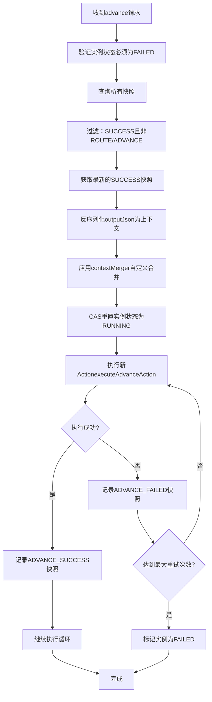
```mermaid
flowchart TD
A[收到advance请求] --> B[验证实例状态必须为FAILED]
B --> C[查询所有快照]
C --> D[过滤：SUCCESS且非ROUTE/ADVANCE]
D --> E[获取最新的SUCCESS快照]
E --> F[反序列化outputJson为上下文]
F --> G[应用contextMerger自定义合并]
G --> H[CAS重置实例状态为RUNNING]
H --> I[执行新ActionexecuteAdvanceAction]
I --> J{执行成功?}
J --> |是| K[记录ADVANCE_SUCCESS快照]
J --> |否| L[记录ADVANCE_FAILED快照]
K --> M[继续执行循环]
L --> N{达到最大重试次数?}
N --> |否| I
N --> |是| O[标记实例为FAILED]
M --> P[完成]
O --> P
```

**图表来源**
- [InstanceExecutionService.java:126-179](file://state-machine-boot-starter/src/main/java/cn/chedejun/statemachine/application/InstanceExecutionService.java#L126-L179)

### 数据一致性保证

恢复机制通过多种机制确保数据一致性，**更新**：新增了CAS操作的详细说明：

#### 原子性操作

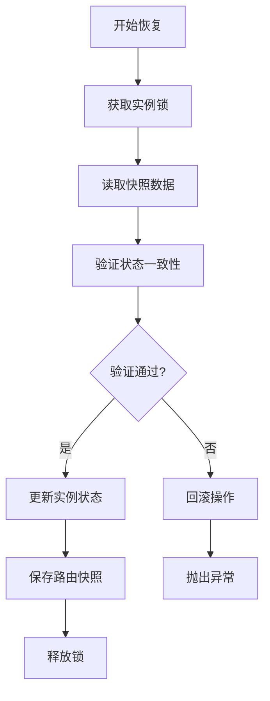
```mermaid
flowchart TD
A[开始恢复] --> B[获取实例锁]
B --> C[读取快照数据]
C --> D[验证状态一致性]
D --> E{验证通过?}
E --> |是| F[更新实例状态]
E --> |否| G[回滚操作]
F --> H[保存路由快照]
H --> I[释放锁]
G --> J[抛出异常]
```

#### 并发控制

恢复操作采用CAS（Compare-And-Swap）机制防止并发冲突，**更新**：新增了advance操作的CAS验证：

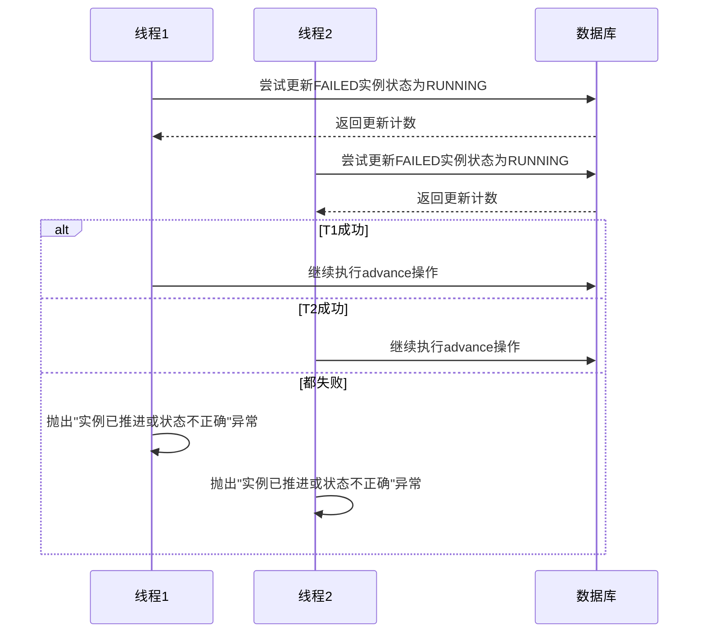
```mermaid
sequenceDiagram
participant T1 as 线程1
participant T2 as 线程2
participant DB as 数据库
T1->>DB : 尝试更新FAILED实例状态为RUNNING
DB-->>T1 : 返回更新计数
T2->>DB : 尝试更新FAILED实例状态为RUNNING
DB-->>T2 : 返回更新计数
alt T1成功
T1->>DB : 继续执行advance操作
else T2成功
T2->>DB : 继续执行advance操作
else 都失败
T1->>T1 : 抛出"实例已推进或状态不正确"异常
T2->>T2 : 抛出"实例已推进或状态不正确"异常
end
```

**图表来源**
- [InstanceExecutionService.java:146-148](file://state-machine-boot-starter/src/main/java/cn/chedejun/statemachine/application/InstanceExecutionService.java#L146-L148)

### 异常处理机制

恢复过程中采用多层次的异常处理策略，**更新**：新增了advance操作的异常处理：

#### 恢复异常分类

| 异常类型 | 触发条件 | 处理策略 |
|---------|---------|---------|
| 状态不匹配 | 期望状态与实际状态不符 | 抛出明确错误信息 |
| 快照缺失 | 无法找到必要的快照数据 | 记录错误并终止恢复 |
| 上下文反序列化失败 | JSON格式不正确 | 使用默认上下文 |
| 并发冲突 | 多线程同时恢复同一实例 | 重试或放弃 |
| **advance专用** | **实例非FAILED状态** | **抛出"只能对FAILED状态实例执行advance"异常** |
| **advance专用** | **实例已被推进** | **抛出"实例已推进或状态不正确"异常** |

#### 错误恢复流程

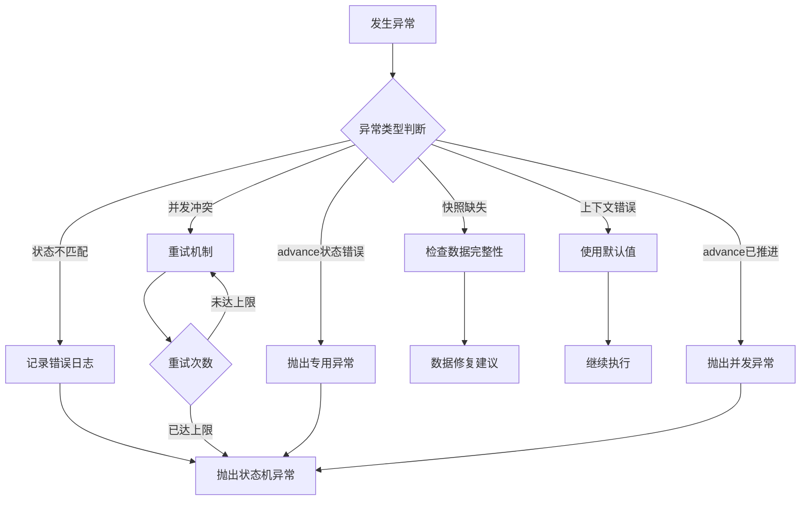
```mermaid
flowchart TD
A[发生异常] --> B{异常类型判断}
B --> |状态不匹配| C[记录错误日志]
B --> |快照缺失| D[检查数据完整性]
B --> |上下文错误| E[使用默认值]
B --> |并发冲突| F[重试机制]
B --> |advance状态错误| G[抛出专用异常]
B --> |advance已推进| H[抛出并发异常]
C --> I[抛出状态机异常]
D --> J[数据修复建议]
E --> K[继续执行]
F --> L{重试次数}
L --> |未达上限| F
L --> |已达上限| I
G --> I
H --> I
```

**图表来源**
- [InstanceExecutionService.java:129-131](file://state-machine-boot-starter/src/main/java/cn/chedejun/statemachine/application/InstanceExecutionService.java#L129-L131)
- [InstanceExecutionService.java:146-148](file://state-machine-boot-starter/src/main/java/cn/chedejun/statemachine/application/InstanceExecutionService.java#L146-L148)

**章节来源**
- [InstanceExecutionService.java:60-179](file://state-machine-boot-starter/src/main/java/cn/chedejun/statemachine/application/InstanceExecutionService.java#L60-L179)
- [JdbcSnapshotRepository.java:25-61](file://state-machine-boot-starter/src/main/java/cn/chedejun/statemachine/infrastructure/persistence/JdbcSnapshotRepository.java#L25-L61)

## 依赖分析

### 组件间依赖关系

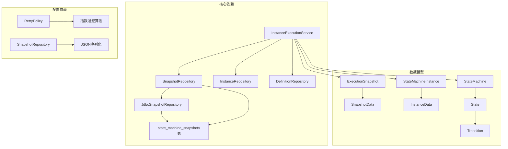
```mermaid
graph TB
subgraph "核心依赖"
A[InstanceExecutionService] --> B[SnapshotRepository]
A --> C[InstanceRepository]
A --> D[DefinitionRepository]
B --> E[JdbcSnapshotRepository]
E --> F[state_machine_snapshots表]
end
subgraph "数据模型"
G[ExecutionSnapshot] --> H[SnapshotData]
I[StateMachineInstance] --> J[InstanceData]
K[StateMachine] --> L[State]
L --> M[Transition]
end
subgraph "配置依赖"
N[RetryPolicy] --> O[指数退避算法]
P[SnapshotRepository] --> Q[JSON序列化]
end
A --> G
A --> I
A --> K
B --> F
```

**图表来源**
- [InstanceExecutionService.java:30-41](file://state-machine-boot-starter/src/main/java/cn/chedejun/statemachine/application/InstanceExecutionService.java#L30-L41)
- [JdbcSnapshotRepository.java:18-23](file://state-machine-boot-starter/src/main/java/cn/chedejun/statemachine/infrastructure/persistence/JdbcSnapshotRepository.java#L18-L23)

### 数据流分析

恢复过程中的数据流向，**更新**：新增了advance操作的数据流：

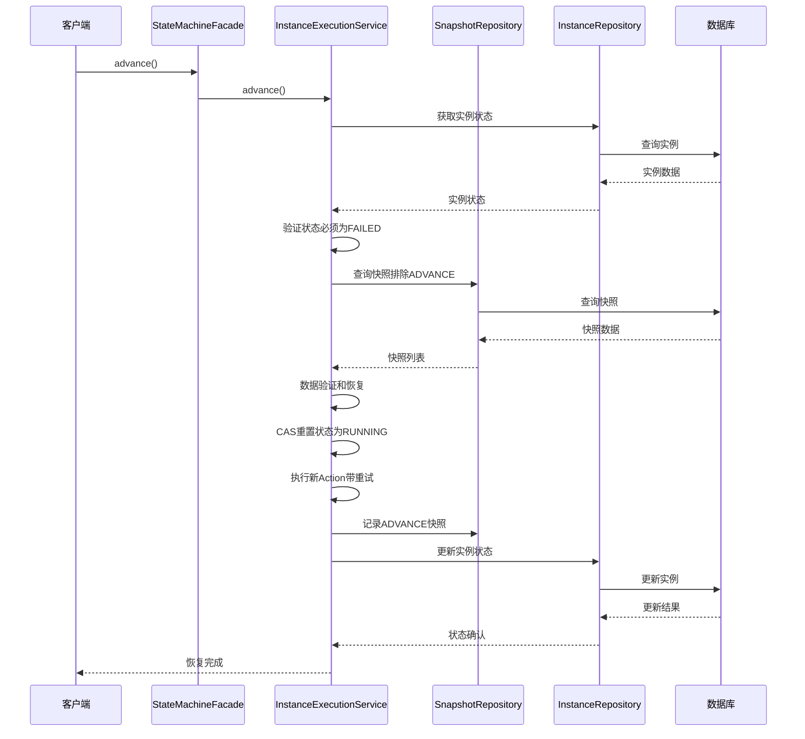
```mermaid
sequenceDiagram
participant Client as 客户端
participant Facade as StateMachineFacade
participant Service as InstanceExecutionService
participant SnapRepo as SnapshotRepository
participant InstRepo as InstanceRepository
participant DB as 数据库
Client->>Facade : advance()
Facade->>Service : advance()
Service->>InstRepo : 获取实例状态
InstRepo->>DB : 查询实例
DB-->>InstRepo : 实例数据
InstRepo-->>Service : 实例状态
Service->>Service : 验证状态必须为FAILED
Service->>SnapRepo : 查询快照排除ADVANCE
SnapRepo->>DB : 查询快照
DB-->>SnapRepo : 快照数据
SnapRepo-->>Service : 快照列表
Service->>Service : 数据验证和恢复
Service->>Service : CAS重置状态为RUNNING
Service->>Service : 执行新Action带重试
Service->>SnapRepo : 记录ADVANCE快照
Service->>InstRepo : 更新实例状态
InstRepo->>DB : 更新实例
DB-->>InstRepo : 更新结果
InstRepo-->>Service : 状态确认
Service-->>Client : 恢复完成
```

**图表来源**
- [InstanceExecutionService.java:126-179](file://state-machine-boot-starter/src/main/java/cn/chedejun/statemachine/application/InstanceExecutionService.java#L126-L179)

**章节来源**
- [SnapshotRepository.java:11-15](file://state-machine-boot-starter/src/main/java/cn/chedejun/statemachine/domain/repository/SnapshotRepository.java#L11-L15)
- [RetryPolicy.java:1-45](file://state-machine-boot-starter/src/main/java/cn/chedejun/statemachine/core/RetryPolicy.java#L1-L45)

## 性能考虑

### 恢复性能优化

#### 查询优化策略

1. **索引设计**
   - `state_machine_snapshots` 表按 `instance_id` 和 `executed_at` 建立复合索引
   - 支持快速定位特定实例的快照数据
   - **更新**：新增对 `snapshot_type` 字段的索引优化

2. **批量操作**
   - 使用流式处理减少内存占用
   - 批量查询和更新操作

#### 内存管理

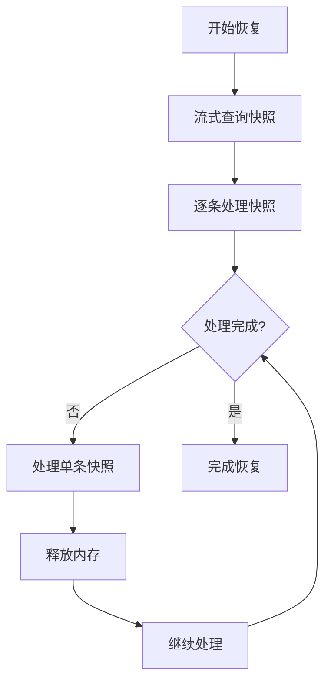
```mermaid
flowchart TD
A[开始恢复] --> B[流式查询快照]
B --> C[逐条处理快照]
C --> D{处理完成?}
D --> |否| E[处理单条快照]
E --> F[释放内存]
F --> G[继续处理]
G --> D
D --> |是| H[完成恢复]
```

### 最佳实践建议

#### 恢复操作最佳实践

1. **状态验证**
   - 在恢复前严格验证实例状态
   - 确保期望状态与实际状态一致
   - **更新**：advance操作必须确保实例状态为FAILED

2. **上下文完整性**
   - 检查上下文JSON的有效性
   - 提供默认值处理机制
   - **更新**：注意排除ADVANCE快照类型的影响

3. **并发控制**
   - 使用CAS操作防止并发冲突
   - 实施适当的重试策略
   - **更新**：advance操作的CAS验证更加严格

4. **监控和日志**
   - 记录详细的恢复日志
   - 监控恢复成功率和性能指标
   - **更新**：新增ADVANCE操作的日志记录

5. **业务场景适配**
   - **更新**：合理使用advance操作替代失败的Action
   - **更新**：确保新Action能够处理已修复的业务数据

#### 性能调优建议

1. **数据库优化**
   - 定期分析慢查询
   - 优化快照查询性能
   - **更新**：优化ADVANCE快照类型的查询

2. **缓存策略**
   - 缓存常用的机器定义
   - 实施适当的缓存失效策略

3. **资源管理**
   - 控制并发恢复实例数量
   - 实施资源限制和保护机制
   - **更新**：合理控制advance操作的并发度

## 故障排除指南

### 常见问题诊断

#### 恢复失败排查

| 问题症状 | 可能原因 | 解决方案 |
|---------|---------|---------|
| 状态不匹配异常 | 期望状态与实际状态不符 | 检查业务ID对应关系 |
| 快照缺失 | 数据库中缺少必要快照 | 检查数据完整性 |
| 上下文反序列化失败 | JSON格式错误 | 验证JSON格式 |
| 并发冲突 | 多线程同时恢复 | 实施重试机制 |
| **advance专用** | **实例状态非FAILED** | **检查实例状态为FAILED** |
| **advance专用** | **实例已被其他进程推进** | **等待或检查并发控制** |
| **advance专用** | **新Action执行失败** | **检查新Action逻辑** |

#### 调试技巧

1. **启用详细日志**
   ```bash
   # 设置日志级别
   logging.level.cn.chedejun.statemachine=DEBUG
   ```

2. **监控关键指标**
   - 恢复成功率
   - 恢复时间分布
   - 并发冲突频率
   - **更新**：新增advance操作成功率监控

3. **数据验证**
   - 检查快照数据完整性
   - 验证实例状态一致性
   - **更新**：验证ADVANCE快照类型正确性

### 故障恢复流程

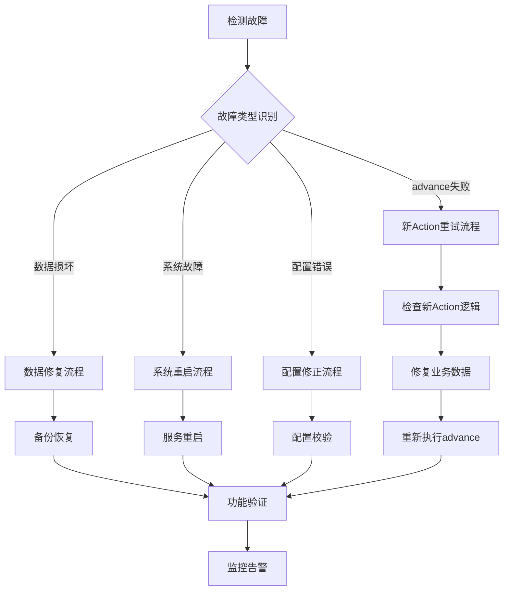
```mermaid
flowchart TD
A[检测故障] --> B{故障类型识别}
B --> |数据损坏| C[数据修复流程]
B --> |系统故障| D[系统重启流程]
B --> |配置错误| E[配置修正流程]
B --> |advance失败| F[新Action重试流程]
C --> G[备份恢复]
D --> H[服务重启]
E --> I[配置校验]
F --> J[检查新Action逻辑]
J --> K[修复业务数据]
K --> L[重新执行advance]
G --> M[功能验证]
H --> M
I --> M
L --> M
M --> N[监控告警]
```

**章节来源**
- [StateMachineIntegrationTest.java:528-602](file://state-machine-boot-starter/src/test/java/cn/chedejun/statemachine/integration/StateMachineIntegrationTest.java#L528-L602)

## 结论

状态机实例恢复机制通过精心设计的快照系统、严格的验证流程和完善的异常处理，实现了高可靠性的状态恢复能力。**更新**：新增的advance功能进一步增强了系统的灵活性和实用性，允许用户在实例失败时用新的Action替代原失败的Action执行，实现更精细的实例推进控制。

该机制的关键优势包括：

1. **数据完整性保障** - 通过不可变快照和原子操作确保数据一致性
2. **灵活的恢复策略** - 支持多种状态下的智能恢复，包括新增的advance功能
3. **高性能设计** - 优化的查询和处理流程
4. **强大的异常处理** - 多层次的错误处理和恢复机制
5. **业务场景适配** - **新增**：支持业务数据修复后的实例推进

通过遵循本文档的最佳实践和故障排除指南，可以确保状态机实例在各种异常情况下都能可靠地恢复执行，为业务系统的稳定运行提供坚实保障。**更新**：新增的advance功能特别适用于业务数据已手动修复但状态机执行失败的场景，为复杂业务流程提供了更灵活的恢复选项。