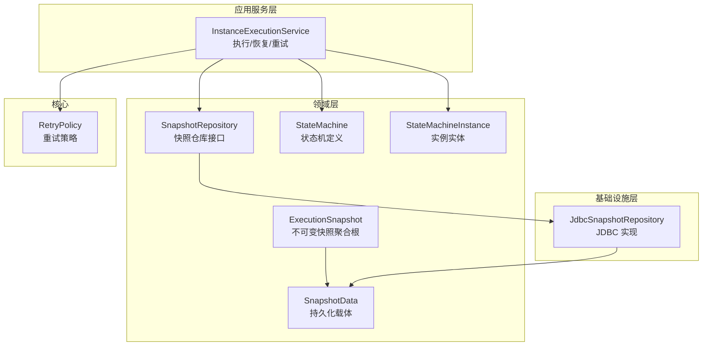
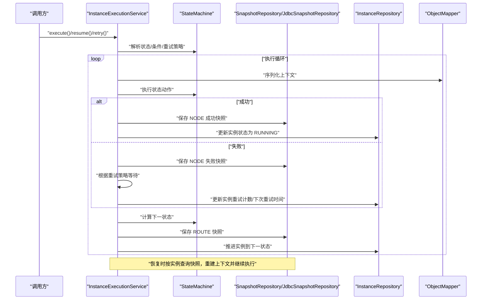
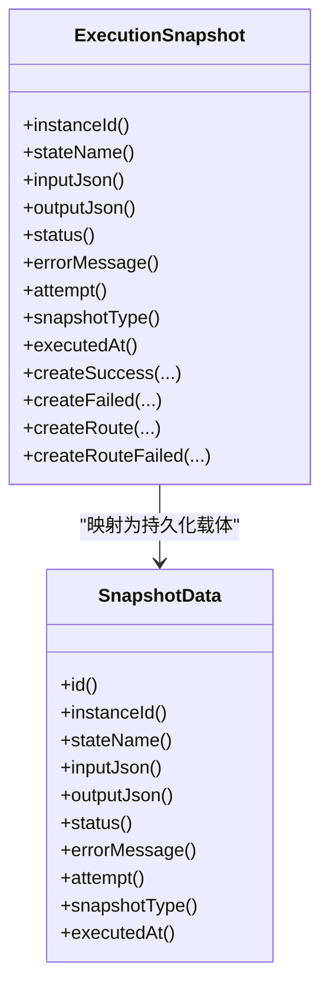
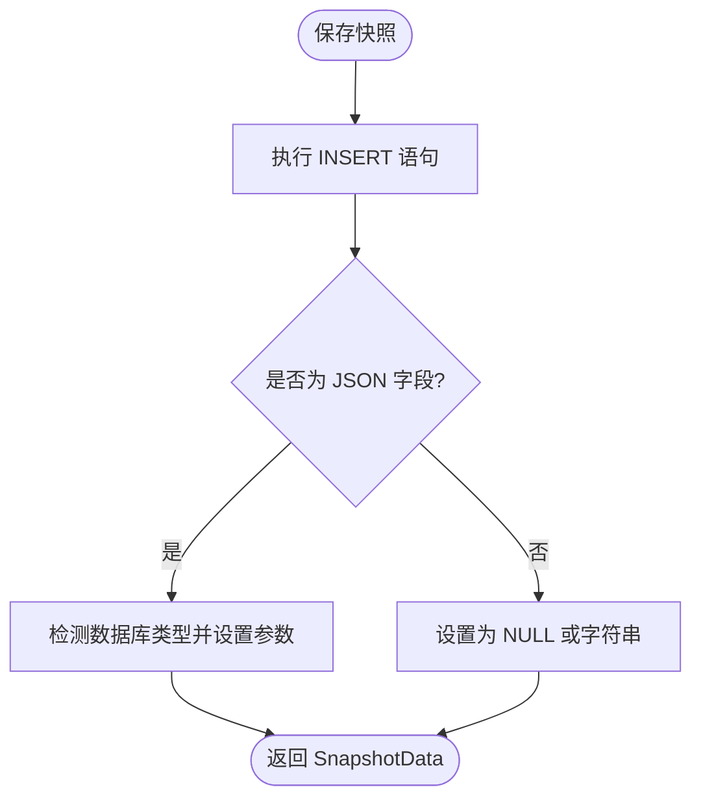
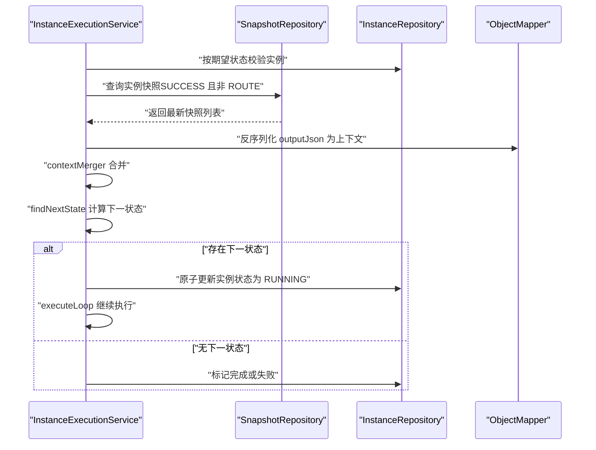
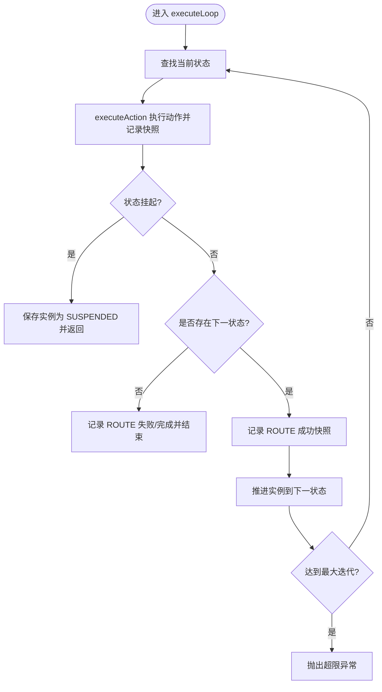
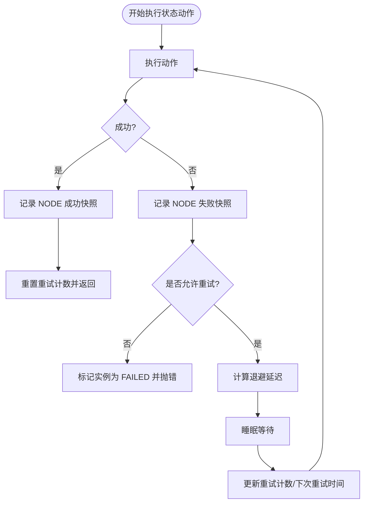
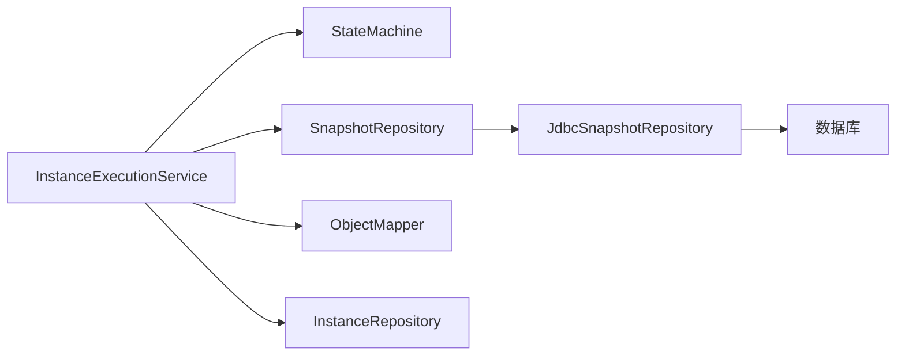

# 快照与恢复

<cite>
**本文引用的文件**
- [ExecutionSnapshot.java](file://state-machine-boot-starter/src/main/java/cn/chedejun/statemachine/domain/snapshot/ExecutionSnapshot.java)
- [SnapshotData.java](file://state-machine-boot-starter/src/main/java/cn/chedejun/statemachine/domain/data/SnapshotData.java)
- [SnapshotRepository.java](file://state-machine-boot-starter/src/main/java/cn/chedejun/statemachine/domain/repository/SnapshotRepository.java)
- [JdbcSnapshotRepository.java](file://state-machine-boot-starter/src/main/java/cn/chedejun/statemachine/infrastructure/persistence/JdbcSnapshotRepository.java)
- [InstanceExecutionService.java](file://state-machine-boot-starter/src/main/java/cn/chedejun/statemachine/application/InstanceExecutionService.java)
- [StateMachine.java](file://state-machine-boot-starter/src/main/java/cn/chedejun/statemachine/domain/engine/StateMachine.java)
- [StateMachineInstance.java](file://state-machine-boot-starter/src/main/java/cn/chedejun/statemachine/domain/instance/StateMachineInstance.java)
- [RetryPolicy.java](file://state-machine-boot-starter/src/main/java/cn/chedejun/statemachine/core/RetryPolicy.java)
- [InstanceId.java](file://state-machine-boot-starter/src/main/java/cn/chedejun/statemachine/domain/shared/InstanceId.java)
- [SnapshotId.java](file://state-machine-boot-starter/src/main/java/cn/chedejun/statemachine/domain/shared/SnapshotId.java)
- [ExecutionStatus.java](file://state-machine-boot-starter/src/main/java/cn/chedejun/statemachine/domain/shared/ExecutionStatus.java)
- [InstanceStatus.java](file://state-machine-boot-starter/src/main/java/cn/chedejun/statemachine/domain/shared/InstanceStatus.java)
- [mysql.sql](file://state-machine-boot-starter/src/main/resources/ddl/mysql.sql)
- [ExecutionSnapshotTest.java](file://state-machine-boot-starter/src/test/java/cn/chedejun/statemachine/domain/snapshot/ExecutionSnapshotTest.java)
- [RetryPolicyTest.java](file://state-machine-boot-starter/src/test/java/cn/chedejun/statemachine/core/RetryPolicyTest.java)
</cite>

## 目录
1. [引言](#引言)
2. [项目结构](#项目结构)
3. [核心组件](#核心组件)
4. [架构总览](#架构总览)
5. [详细组件分析](#详细组件分析)
6. [依赖分析](#依赖分析)
7. [性能考虑](#性能考虑)
8. [故障排查指南](#故障排查指南)
9. [结论](#结论)
10. [附录](#附录)

## 引言
本文件系统性阐述状态机引擎中的“快照与恢复”机制，重点覆盖以下方面：
- ExecutionSnapshot 的设计原理与数据结构，包括状态信息、上下文数据与元数据的存储策略
- 实例状态重建、上下文恢复与执行继续的完整流程
- 重试机制的实现细节，包括指数退避算法、最大重试次数与失败处理策略
- 快照数据格式与序列化/反序列化机制
- 故障恢复最佳实践与监控建议

## 项目结构
围绕快照与恢复的关键模块分布如下：
- 领域层
  - 快照聚合根：ExecutionSnapshot
  - 数据载体：SnapshotData
  - 仓库接口：SnapshotRepository
- 基础设施层
  - JDBC 实现：JdbcSnapshotRepository
- 应用服务层
  - 执行与恢复：InstanceExecutionService
- 领域引擎与实例
  - 状态机定义：StateMachine
  - 实例实体：StateMachineInstance
- 核心重试策略
  - RetryPolicy
- 值对象与枚举
  - InstanceId、SnapshotId、ExecutionStatus、InstanceStatus

图表来源
- [ExecutionSnapshot.java:1-73](file://state-machine-boot-starter/src/main/java/cn/chedejun/statemachine/domain/snapshot/ExecutionSnapshot.java#L1-L73)
- [SnapshotData.java:1-56](file://state-machine-boot-starter/src/main/java/cn/chedejun/statemachine/domain/data/SnapshotData.java#L1-L56)
- [SnapshotRepository.java:1-16](file://state-machine-boot-starter/src/main/java/cn/chedejun/statemachine/domain/repository/SnapshotRepository.java#L1-L16)
- [JdbcSnapshotRepository.java:1-107](file://state-machine-boot-starter/src/main/java/cn/chedejun/statemachine/infrastructure/persistence/JdbcSnapshotRepository.java#L1-L107)
- [InstanceExecutionService.java:1-296](file://state-machine-boot-starter/src/main/java/cn/chedejun/statemachine/application/InstanceExecutionService.java#L1-L296)
- [StateMachine.java:1-77](file://state-machine-boot-starter/src/main/java/cn/chedejun/statemachine/domain/engine/StateMachine.java#L1-L77)
- [StateMachineInstance.java:1-81](file://state-machine-boot-starter/src/main/java/cn/chedejun/statemachine/domain/instance/StateMachineInstance.java#L1-L81)
- [RetryPolicy.java:1-45](file://state-machine-boot-starter/src/main/java/cn/chedejun/statemachine/core/RetryPolicy.java#L1-L45)

章节来源
- [ExecutionSnapshot.java:1-73](file://state-machine-boot-starter/src/main/java/cn/chedejun/statemachine/domain/snapshot/ExecutionSnapshot.java#L1-L73)
- [JdbcSnapshotRepository.java:1-107](file://state-machine-boot-starter/src/main/java/cn/chedejun/statemachine/infrastructure/persistence/JdbcSnapshotRepository.java#L1-L107)
- [InstanceExecutionService.java:1-296](file://state-machine-boot-starter/src/main/java/cn/chedejun/statemachine/application/InstanceExecutionService.java#L1-L296)

## 核心组件
- ExecutionSnapshot：不可变快照聚合根，记录节点执行或路由决策的快照，支持成功/失败两类，并区分“NODE”和“ROUTE”两种类型。
- SnapshotData：持久化载体，用于数据库读写，字段与快照一致。
- SnapshotRepository 及 JdbcSnapshotRepository：抽象与 JDBC 实现，负责按实例查询、保存与按 ID 查询快照。
- InstanceExecutionService：核心执行与恢复服务，负责状态推进、上下文序列化/反序列化、重试与恢复。
- StateMachine：状态机定义，包含状态、转换与重试策略。
- StateMachineInstance：实例实体，维护当前状态、重试计数与错误信息等。
- RetryPolicy：指数退避重试策略，支持最大尝试次数、初始延迟、最大延迟与退避因子。

章节来源
- [ExecutionSnapshot.java:11-72](file://state-machine-boot-starter/src/main/java/cn/chedejun/statemachine/domain/snapshot/ExecutionSnapshot.java#L11-L72)
- [SnapshotData.java:8-44](file://state-machine-boot-starter/src/main/java/cn/chedejun/statemachine/domain/data/SnapshotData.java#L8-L44)
- [SnapshotRepository.java:11-15](file://state-machine-boot-starter/src/main/java/cn/chedejun/statemachine/domain/repository/SnapshotRepository.java#L11-L15)
- [JdbcSnapshotRepository.java:18-106](file://state-machine-boot-starter/src/main/java/cn/chedejun/statemachine/infrastructure/persistence/JdbcSnapshotRepository.java#L18-L106)
- [InstanceExecutionService.java:25-41](file://state-machine-boot-starter/src/main/java/cn/chedejun/statemachine/application/InstanceExecutionService.java#L25-L41)
- [StateMachine.java:19-76](file://state-machine-boot-starter/src/main/java/cn/chedejun/statemachine/domain/engine/StateMachine.java#L19-L76)
- [StateMachineInstance.java:9-80](file://state-machine-boot-starter/src/main/java/cn/chedejun/statemachine/domain/instance/StateMachineInstance.java#L9-L80)
- [RetryPolicy.java:5-44](file://state-machine-boot-starter/src/main/java/cn/chedejun/statemachine/core/RetryPolicy.java#L5-L44)

## 架构总览
下图展示从执行到快照、再到恢复与重试的整体交互：

图表来源
- [InstanceExecutionService.java:43-295](file://state-machine-boot-starter/src/main/java/cn/chedejun/statemachine/application/InstanceExecutionService.java#L43-L295)
- [JdbcSnapshotRepository.java:25-105](file://state-machine-boot-starter/src/main/java/cn/chedejun/statemachine/infrastructure/persistence/JdbcSnapshotRepository.java#L25-L105)
- [StateMachine.java:50-76](file://state-machine-boot-starter/src/main/java/cn/chedejun/statemachine/domain/engine/StateMachine.java#L50-L76)

## 详细组件分析

### ExecutionSnapshot 设计与数据结构
- 不可变性与幂等：快照一旦创建即不可修改；路由评估失败时创建新的 FAILED 快照，而非修改旧快照。
- 字段设计
  - 实例标识、状态名称、输入/输出 JSON、执行结果状态、错误信息、重试次数、快照类型（NODE/ROUTE）、执行时间戳。
- 工厂方法
  - createSuccess/createFailed：记录节点执行的输入/输出与错误信息。
  - createRoute/createRouteFailed：记录路由决策的上下文 JSON 与目标状态（或错误）。
- 时间语义：executedAt 记录快照创建时间，用于排序与恢复定位。

图表来源
- [ExecutionSnapshot.java:11-72](file://state-machine-boot-starter/src/main/java/cn/chedejun/statemachine/domain/snapshot/ExecutionSnapshot.java#L11-L72)
- [SnapshotData.java:8-44](file://state-machine-boot-starter/src/main/java/cn/chedejun/statemachine/domain/data/SnapshotData.java#L8-L44)

章节来源
- [ExecutionSnapshot.java:7-72](file://state-machine-boot-starter/src/main/java/cn/chedejun/statemachine/domain/snapshot/ExecutionSnapshot.java#L7-L72)
- [ExecutionSnapshotTest.java:12-50](file://state-machine-boot-starter/src/test/java/cn/chedejun/statemachine/domain/snapshot/ExecutionSnapshotTest.java#L12-L50)

### 快照持久化与查询（SnapshotRepository/JdbcSnapshotRepository）
- 查询
  - findByInstanceId：按实例 ID 查询快照，按执行时间与重试次数排序，便于恢复时定位最新上下文。
  - findById：按快照 ID 查询。
- 保存
  - save：插入快照记录，兼容不同数据库的 JSON 字段类型（PostgreSQL 使用 OTHER，其他使用 VARCHAR/TEXT）。
- 行映射
  - rowMapper：将数据库行映射为 SnapshotData，包含所有必要字段。

图表来源
- [JdbcSnapshotRepository.java:32-51](file://state-machine-boot-starter/src/main/java/cn/chedejun/statemachine/infrastructure/persistence/JdbcSnapshotRepository.java#L32-L51)
- [JdbcSnapshotRepository.java:63-83](file://state-machine-boot-starter/src/main/java/cn/chedejun/statemachine/infrastructure/persistence/JdbcSnapshotRepository.java#L63-L83)
- [JdbcSnapshotRepository.java:93-105](file://state-machine-boot-starter/src/main/java/cn/chedejun/statemachine/infrastructure/persistence/JdbcSnapshotRepository.java#L93-L105)

章节来源
- [SnapshotRepository.java:11-15](file://state-machine-boot-starter/src/main/java/cn/chedejun/statemachine/domain/repository/SnapshotRepository.java#L11-L15)
- [JdbcSnapshotRepository.java:18-106](file://state-machine-boot-starter/src/main/java/cn/chedejun/statemachine/infrastructure/persistence/JdbcSnapshotRepository.java#L18-L106)

### 实例状态重建与上下文恢复
- 恢复入口
  - resumeByBusinessId/resumeByInstanceId：根据业务 ID 或实例 ID 定位实例。
- 上下文重建
  - 仅取状态为 SUCCESS 且快照类型非 ROUTE 的最新快照的 outputJson 作为上下文 JSON，反序列化为上下文对象。
  - 支持通过 contextMerger 合并外部上下文。
- 执行继续
  - 计算下一状态：若存在则原子地将实例状态从 SUSPENDED 切换为 RUNNING 并继续执行；否则根据是否有出边决定完成或失败。

图表来源
- [InstanceExecutionService.java:60-152](file://state-machine-boot-starter/src/main/java/cn/chedejun/statemachine/application/InstanceExecutionService.java#L60-L152)
- [InstanceExecutionService.java:125-133](file://state-machine-boot-starter/src/main/java/cn/chedejun/statemachine/application/InstanceExecutionService.java#L125-L133)

章节来源
- [InstanceExecutionService.java:60-152](file://state-machine-boot-starter/src/main/java/cn/chedejun/statemachine/application/InstanceExecutionService.java#L60-L152)

### 执行继续与路由决策
- 执行循环
  - 在最大迭代限制内推进状态，执行动作、记录快照、推进实例状态。
- 路由决策
  - 每次状态执行后，基于当前上下文计算下一状态，并记录 ROUTE 成功/失败快照。
- 结束条件
  - 无出边且无匹配转换时，实例标记为 COMPLETED 或 FAILED。

图表来源
- [InstanceExecutionService.java:158-193](file://state-machine-boot-starter/src/main/java/cn/chedejun/statemachine/application/InstanceExecutionService.java#L158-L193)
- [InstanceExecutionService.java:178-190](file://state-machine-boot-starter/src/main/java/cn/chedejun/statemachine/application/InstanceExecutionService.java#L178-L190)

章节来源
- [InstanceExecutionService.java:158-193](file://state-machine-boot-starter/src/main/java/cn/chedejun/statemachine/application/InstanceExecutionService.java#L158-L193)

### 重试机制与指数退避
- 重试策略
  - RetryPolicy 提供指数退避：delay = initialDelay * backoffFactor^(attempt-1)，上限为 maxDelay。
  - 支持禁用重试（maxAttempts=0）。
- 执行中的重试
  - executeAction 循环中捕获异常，记录失败快照，按策略更新实例重试计数与下次重试时间，睡眠后重试。
  - 达到最大重试次数后，实例标记为 FAILED 并抛出异常。

图表来源
- [RetryPolicy.java:26-30](file://state-machine-boot-starter/src/main/java/cn/chedejun/statemachine/core/RetryPolicy.java#L26-L30)
- [InstanceExecutionService.java:200-237](file://state-machine-boot-starter/src/main/java/cn/chedejun/statemachine/application/InstanceExecutionService.java#L200-L237)

章节来源
- [RetryPolicy.java:5-44](file://state-machine-boot-starter/src/main/java/cn/chedejun/statemachine/core/RetryPolicy.java#L5-L44)
- [RetryPolicyTest.java:13-29](file://state-machine-boot-starter/src/test/java/cn/chedejun/statemachine/core/RetryPolicyTest.java#L13-L29)
- [InstanceExecutionService.java:200-237](file://state-machine-boot-starter/src/main/java/cn/chedejun/statemachine/application/InstanceExecutionService.java#L200-L237)

### 快照数据格式与序列化/反序列化
- 数据格式
  - 快照表包含：id、instance_id、state_name、input、output、status、error_message、attempt、snapshot_type、executed_at。
  - input/output 为 JSON 字段，分别存储上下文输入/输出。
- 序列化/反序列化
  - 使用 Jackson ObjectMapper 将上下文对象与 JSON 互转。
  - 反序列化失败时抛出异常，确保恢复过程的健壮性。
- 数据库兼容
  - JDBC 层自动识别 PostgreSQL 并使用 OTHER 类型写入 JSON，其他数据库使用字符串/文本类型。

章节来源
- [mysql.sql:13-18](file://state-machine-boot-starter/src/main/resources/ddl/mysql.sql#L13-L18)
- [JdbcSnapshotRepository.java:63-83](file://state-machine-boot-starter/src/main/java/cn/chedejun/statemachine/infrastructure/persistence/JdbcSnapshotRepository.java#L63-L83)
- [InstanceExecutionService.java:247-260](file://state-machine-boot-starter/src/main/java/cn/chedejun/statemachine/application/InstanceExecutionService.java#L247-L260)

### 实例状态与实体管理
- StateMachineInstance
  - 维护当前状态、实例状态（RUNNING/SUSPENDED/COMPLETED/FAILED）、重试计数与错误信息。
  - 提供状态迁移、挂起、重试记录与完成/失败标记。
- StateMachine
  - 保存状态机定义、转换规则与重试策略，提供查找下一状态的能力。

章节来源
- [StateMachineInstance.java:9-80](file://state-machine-boot-starter/src/main/java/cn/chedejun/statemachine/domain/instance/StateMachineInstance.java#L9-L80)
- [StateMachine.java:19-76](file://state-machine-boot-starter/src/main/java/cn/chedejun/statemachine/domain/engine/StateMachine.java#L19-L76)

## 依赖分析
- 组件耦合
  - InstanceExecutionService 依赖 StateMachine、SnapshotRepository、InstanceRepository、ObjectMapper。
  - SnapshotRepository 与 JdbcSnapshotRepository 之间为接口与实现分离，便于替换存储后端。
- 关键依赖链
  - 执行路径：Service -> Engine -> SnapshotRepository/JdbcSnapshotRepository -> DB。
  - 恢复路径：Service -> SnapshotRepository -> ObjectMapper -> Service -> Engine。

图表来源
- [InstanceExecutionService.java:35-41](file://state-machine-boot-starter/src/main/java/cn/chedejun/statemachine/application/InstanceExecutionService.java#L35-L41)
- [JdbcSnapshotRepository.java:18-23](file://state-machine-boot-starter/src/main/java/cn/chedejun/statemachine/infrastructure/persistence/JdbcSnapshotRepository.java#L18-L23)

章节来源
- [InstanceExecutionService.java:35-41](file://state-machine-boot-starter/src/main/java/cn/chedejun/statemachine/application/InstanceExecutionService.java#L35-L41)
- [JdbcSnapshotRepository.java:18-23](file://state-machine-boot-starter/src/main/java/cn/chedejun/statemachine/infrastructure/persistence/JdbcSnapshotRepository.java#L18-L23)

## 性能考虑
- N+1 查询规避
  - 重试循环中直接使用当前实例的 retryCount 推导 attempt，避免重复查询快照统计。
- 最大迭代限制
  - executeLoop 设置最大迭代上限，防止无限循环导致资源耗尽。
- 数据库索引与排序
  - 快照按 executed_at 与 attempt 排序，有利于快速定位最新上下文。
- JSON 写入优化
  - JDBC 层按数据库类型选择合适的数据类型，减少类型转换开销。

章节来源
- [InstanceExecutionService.java:161-161](file://state-machine-boot-starter/src/main/java/cn/chedejun/statemachine/application/InstanceExecutionService.java#L161-L161)
- [JdbcSnapshotRepository.java:27-29](file://state-machine-boot-starter/src/main/java/cn/chedejun/statemachine/infrastructure/persistence/JdbcSnapshotRepository.java#L27-L29)

## 故障排查指南
- 常见问题与定位
  - 快照缺失：恢复时未找到 FAILED 快照或无匹配的 SUCCESS 快照，检查快照表与状态机版本。
  - 上下文反序列化失败：确认上下文类与序列化版本一致，查看日志中的反序列化异常。
  - 状态不匹配：resumeByBusinessId/resumeByInstanceId 会校验期望状态，不一致需检查业务 ID 对应实例的当前状态。
  - 路由失败：当无匹配转换时会记录 ROUTE 失败快照并标记实例失败，检查状态机定义与条件。
- 日志与监控建议
  - 开启状态执行与重试的日志级别，记录实例 ID、状态名、尝试次数与错误信息。
  - 监控快照表增长速率与慢查询，关注 executed_at 排序的查询性能。
  - 监控重试延迟分布与失败率，及时调整重试策略参数。

章节来源
- [InstanceExecutionService.java:84-114](file://state-machine-boot-starter/src/main/java/cn/chedejun/statemachine/application/InstanceExecutionService.java#L84-L114)
- [InstanceExecutionService.java:121-123](file://state-machine-boot-starter/src/main/java/cn/chedejun/statemachine/application/InstanceExecutionService.java#L121-L123)
- [InstanceExecutionService.java:255-260](file://state-machine-boot-starter/src/main/java/cn/chedejun/statemachine/application/InstanceExecutionService.java#L255-L260)

## 结论
该快照与恢复机制以不可变快照为核心，结合 JSON 上下文序列化、路由决策快照与指数退避重试策略，实现了高可靠的状态机执行与恢复能力。通过明确的数据结构、严格的恢复校验与完善的监控建议，可在复杂场景下保证一致性与可观测性。

## 附录
- 快照类型说明
  - NODE：记录节点执行的输入/输出与结果。
  - ROUTE：记录路由决策的上下文与目标状态或错误。
- 值对象与枚举
  - InstanceId、SnapshotId：唯一标识生成与比较。
  - ExecutionStatus、InstanceStatus：执行与实例状态枚举。

章节来源
- [ExecutionSnapshot.java:20-21](file://state-machine-boot-starter/src/main/java/cn/chedejun/statemachine/domain/snapshot/ExecutionSnapshot.java#L20-L21)
- [ExecutionStatus.java:1-3](file://state-machine-boot-starter/src/main/java/cn/chedejun/statemachine/domain/shared/ExecutionStatus.java#L1-L3)
- [InstanceStatus.java:1-3](file://state-machine-boot-starter/src/main/java/cn/chedejun/statemachine/domain/shared/InstanceStatus.java#L1-L3)
- [InstanceId.java:6-26](file://state-machine-boot-starter/src/main/java/cn/chedejun/statemachine/domain/shared/InstanceId.java#L6-L26)
- [SnapshotId.java:6-26](file://state-machine-boot-starter/src/main/java/cn/chedejun/statemachine/domain/shared/SnapshotId.java#L6-L26)