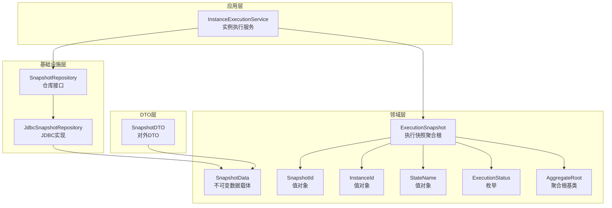
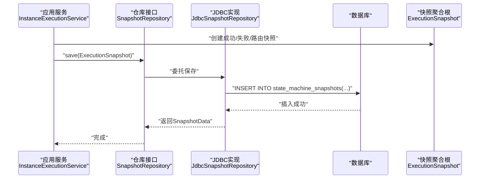
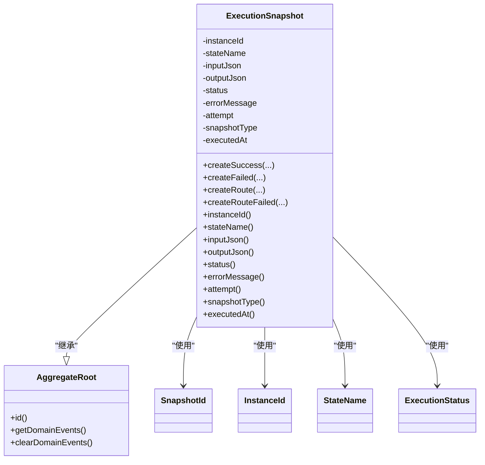
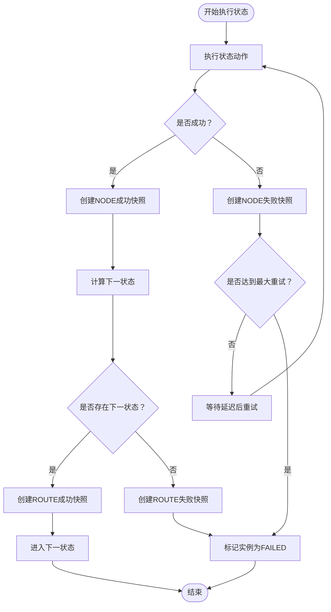
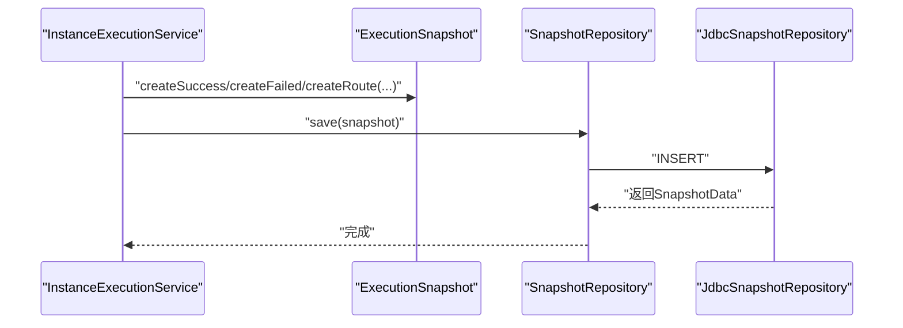
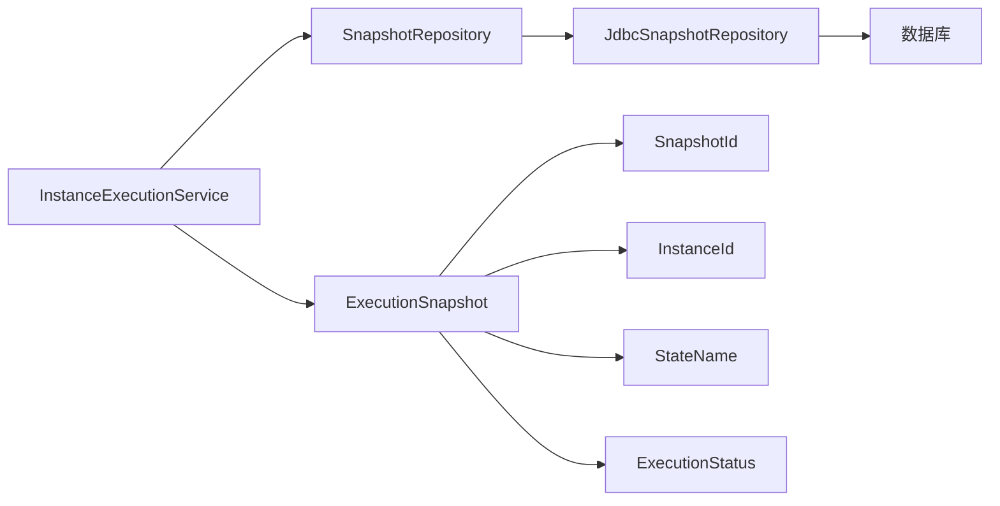

# 执行快照设计

<cite>
**本文引用的文件**
- [ExecutionSnapshot.java](file://state-machine-boot-starter/src/main/java/cn/chedejun/statemachine/domain/snapshot/ExecutionSnapshot.java)
- [SnapshotData.java](file://state-machine-boot-starter/src/main/java/cn/chedejun/statemachine/domain/data/SnapshotData.java)
- [SnapshotId.java](file://state-machine-boot-starter/src/main/java/cn/chedejun/statemachine/domain/shared/SnapshotId.java)
- [InstanceId.java](file://state-machine-boot-starter/src/main/java/cn/chedejun/statemachine/domain/shared/InstanceId.java)
- [StateName.java](file://state-machine-boot-starter/src/main/java/cn/chedejun/statemachine/domain/shared/StateName.java)
- [ExecutionStatus.java](file://state-machine-boot-starter/src/main/java/cn/chedejun/statemachine/domain/shared/ExecutionStatus.java)
- [AggregateRoot.java](file://state-machine-boot-starter/src/main/java/cn/chedejun/statemachine/domain/shared/AggregateRoot.java)
- [SnapshotRepository.java](file://state-machine-boot-starter/src/main/java/cn/chedejun/statemachine/domain/repository/SnapshotRepository.java)
- [JdbcSnapshotRepository.java](file://state-machine-boot-starter/src/main/java/cn/chedejun/statemachine/infrastructure/persistence/JdbcSnapshotRepository.java)
- [InstanceExecutionService.java](file://state-machine-boot-starter/src/main/java/cn/chedejun/statemachine/application/InstanceExecutionService.java)
- [ExecutionSnapshotTest.java](file://state-machine-boot-starter/src/test/java/cn/chedejun/statemachine/domain/snapshot/ExecutionSnapshotTest.java)
- [SnapshotDTO.java](file://state-machine-boot-starter/src/main/java/cn/chedejun/statemachine/management/dto/SnapshotDTO.java)
</cite>

## 目录
1. [引言](#引言)
2. [项目结构](#项目结构)
3. [核心组件](#核心组件)
4. [架构总览](#架构总览)
5. [详细组件分析](#详细组件分析)
6. [依赖分析](#依赖分析)
7. [性能考虑](#性能考虑)
8. [故障排查指南](#故障排查指南)
9. [结论](#结论)
10. [附录](#附录)

## 引言
本文件系统性阐述执行快照（ExecutionSnapshot）的设计与实现，重点覆盖以下方面：
- 不可变性原则与聚合根设计
- 快照字段与序列化策略
- 快照类型区分（NODE vs ROUTE）
- 成功/失败快照的创建方式
- 快照ID生成机制与生命周期
- 在状态机执行过程中的作用与重要性

## 项目结构
围绕执行快照的相关模块分布如下：
- 领域层：快照聚合根、值对象、仓库接口
- 应用层：实例执行服务，负责状态机执行、路由决策与快照落库
- 基础设施层：JDBC实现的快照仓库，负责持久化与查询
- DTO层：对外展示的快照数据传输对象

图表来源
- [ExecutionSnapshot.java:11-71](file://state-machine-boot-starter/src/main/java/cn/chedejun/statemachine/domain/snapshot/ExecutionSnapshot.java#L11-L71)
- [SnapshotData.java:8-54](file://state-machine-boot-starter/src/main/java/cn/chedejun/statemachine/domain/data/SnapshotData.java#L8-L54)
- [SnapshotId.java:6-26](file://state-machine-boot-starter/src/main/java/cn/chedejun/statemachine/domain/shared/SnapshotId.java#L6-L26)
- [InstanceId.java:6-26](file://state-machine-boot-starter/src/main/java/cn/chedejun/statemachine/domain/shared/InstanceId.java#L6-L26)
- [StateName.java:5-24](file://state-machine-boot-starter/src/main/java/cn/chedejun/statemachine/domain/shared/StateName.java#L5-L24)
- [ExecutionStatus.java:1-3](file://state-machine-boot-starter/src/main/java/cn/chedejun/statemachine/domain/shared/ExecutionStatus.java#L1-L3)
- [AggregateRoot.java:7-28](file://state-machine-boot-starter/src/main/java/cn/chedejun/statemachine/domain/shared/AggregateRoot.java#L7-L28)
- [SnapshotRepository.java:11-15](file://state-machine-boot-starter/src/main/java/cn/chedejun/statemachine/domain/repository/SnapshotRepository.java#L11-L15)
- [JdbcSnapshotRepository.java:18-106](file://state-machine-boot-starter/src/main/java/cn/chedejun/statemachine/infrastructure/persistence/JdbcSnapshotRepository.java#L18-L106)
- [InstanceExecutionService.java:25-295](file://state-machine-boot-starter/src/main/java/cn/chedejun/statemachine/application/InstanceExecutionService.java#L25-L295)
- [SnapshotDTO.java:7-51](file://state-machine-boot-starter/src/main/java/cn/chedejun/statemachine/management/dto/SnapshotDTO.java#L7-L51)

章节来源
- [ExecutionSnapshot.java:11-71](file://state-machine-boot-starter/src/main/java/cn/chedejun/statemachine/domain/snapshot/ExecutionSnapshot.java#L11-L71)
- [SnapshotRepository.java:11-15](file://state-machine-boot-starter/src/main/java/cn/chedejun/statemachine/domain/repository/SnapshotRepository.java#L11-L15)
- [JdbcSnapshotRepository.java:18-106](file://state-machine-boot-starter/src/main/java/cn/chedejun/statemachine/infrastructure/persistence/JdbcSnapshotRepository.java#L18-L106)
- [InstanceExecutionService.java:25-295](file://state-machine-boot-starter/src/main/java/cn/chedejun/statemachine/application/InstanceExecutionService.java#L25-L295)
- [SnapshotDTO.java:7-51](file://state-machine-boot-starter/src/main/java/cn/chedejun/statemachine/management/dto/SnapshotDTO.java#L7-L51)

## 核心组件
- 执行快照聚合根（ExecutionSnapshot）：不可变聚合根，封装一次状态执行或路由决策的完整信息；通过工厂方法创建成功/失败快照，以及路由快照与路由失败快照。
- 不可变数据载体（SnapshotData）：用于仓储层的数据传输对象，与ExecutionSnapshot一一对应，便于持久化与跨层传递。
- 值对象与枚举：SnapshotId、InstanceId、StateName、ExecutionStatus，保证标识与语义的强类型约束。
- 仓库接口与实现：SnapshotRepository定义查询与保存契约，JdbcSnapshotRepository基于JDBC实现持久化。
- 应用服务（InstanceExecutionService）：驱动状态机执行，记录快照，处理重试与恢复。

章节来源
- [ExecutionSnapshot.java:11-71](file://state-machine-boot-starter/src/main/java/cn/chedejun/statemachine/domain/snapshot/ExecutionSnapshot.java#L11-L71)
- [SnapshotData.java:8-54](file://state-machine-boot-starter/src/main/java/cn/chedejun/statemachine/domain/data/SnapshotData.java#L8-L54)
- [SnapshotId.java:6-26](file://state-machine-boot-starter/src/main/java/cn/chedejun/statemachine/domain/shared/SnapshotId.java#L6-L26)
- [InstanceId.java:6-26](file://state-machine-boot-starter/src/main/java/cn/chedejun/statemachine/domain/shared/InstanceId.java#L6-L26)
- [StateName.java:5-24](file://state-machine-boot-starter/src/main/java/cn/chedejun/statemachine/domain/shared/StateName.java#L5-L24)
- [ExecutionStatus.java:1-3](file://state-machine-boot-starter/src/main/java/cn/chedejun/statemachine/domain/shared/ExecutionStatus.java#L1-L3)
- [AggregateRoot.java:7-28](file://state-machine-boot-starter/src/main/java/cn/chedejun/statemachine/domain/shared/AggregateRoot.java#L7-L28)
- [SnapshotRepository.java:11-15](file://state-machine-boot-starter/src/main/java/cn/chedejun/statemachine/domain/repository/SnapshotRepository.java#L11-L15)
- [JdbcSnapshotRepository.java:18-106](file://state-machine-boot-starter/src/main/java/cn/chedejun/statemachine/infrastructure/persistence/JdbcSnapshotRepository.java#L18-L106)
- [InstanceExecutionService.java:25-295](file://state-machine-boot-starter/src/main/java/cn/chedejun/statemachine/application/InstanceExecutionService.java#L25-L295)

## 架构总览
下图展示了从应用层发起执行，到快照生成与持久化的整体流程：

图表来源
- [InstanceExecutionService.java:200-237](file://state-machine-boot-starter/src/main/java/cn/chedejun/statemachine/application/InstanceExecutionService.java#L200-L237)
- [JdbcSnapshotRepository.java:32-51](file://state-machine-boot-starter/src/main/java/cn/chedejun/statemachine/infrastructure/persistence/JdbcSnapshotRepository.java#L32-L51)
- [SnapshotRepository.java:13](file://state-machine-boot-starter/src/main/java/cn/chedejun/statemachine/domain/repository/SnapshotRepository.java#L13)

## 详细组件分析

### 执行快照聚合根（ExecutionSnapshot）
- 设计要点
  - 不可变性：所有字段均为final，构造完成后不可修改；通过静态工厂方法创建不同类型的快照。
  - 聚合根：继承AggregateRoot，具备领域事件能力（尽管当前未使用）。
  - 时间戳：executedAt在构造时写入，确保快照的时序一致性。
- 字段说明
  - instanceId：所属实例标识
  - stateName：状态名称
  - inputJson：执行前上下文JSON
  - outputJson：执行后上下文JSON（成功快照）或路由目标状态（路由快照）
  - status：执行结果（SUCCESS/FAILED）
  - errorMessage：错误信息（失败时填充）
  - attempt：重试次数（从1开始）
  - snapshotType：快照类型（"NODE" 或 "ROUTE"）
  - executedAt：执行时间戳（UTC）
- 快照类型与创建方式
  - NODE快照：普通状态节点执行
    - 成功：createSuccess(...)
    - 失败：createFailed(...)
  - ROUTE快照：路由决策
    - 成功：createRoute(...)，outputJson为目标状态的字符串包装
    - 失败：createRouteFailed(...)
- 不可变性验证
  - 测试覆盖了字段正确性与不可变性（如executedAt存在）

图表来源
- [ExecutionSnapshot.java:11-71](file://state-machine-boot-starter/src/main/java/cn/chedejun/statemachine/domain/snapshot/ExecutionSnapshot.java#L11-L71)
- [AggregateRoot.java:7-28](file://state-machine-boot-starter/src/main/java/cn/chedejun/statemachine/domain/shared/AggregateRoot.java#L7-L28)
- [SnapshotId.java:6-26](file://state-machine-boot-starter/src/main/java/cn/chedejun/statemachine/domain/shared/SnapshotId.java#L6-L26)
- [InstanceId.java:6-26](file://state-machine-boot-starter/src/main/java/cn/chedejun/statemachine/domain/shared/InstanceId.java#L6-L26)
- [StateName.java:5-24](file://state-machine-boot-starter/src/main/java/cn/chedejun/statemachine/domain/shared/StateName.java#L5-L24)
- [ExecutionStatus.java:1-3](file://state-machine-boot-starter/src/main/java/cn/chedejun/statemachine/domain/shared/ExecutionStatus.java#L1-L3)

章节来源
- [ExecutionSnapshot.java:11-71](file://state-machine-boot-starter/src/main/java/cn/chedejun/statemachine/domain/snapshot/ExecutionSnapshot.java#L11-L71)
- [ExecutionSnapshotTest.java:12-50](file://state-machine-boot-starter/src/test/java/cn/chedejun/statemachine/domain/snapshot/ExecutionSnapshotTest.java#L12-L50)

### 快照类型与创建流程
- NODE快照
  - 成功：记录输入/输出JSON与attempt
  - 失败：记录输入JSON与错误信息
- ROUTE快照
  - 成功：记录fromState、context JSON与目标toState（以字符串形式）
  - 失败：记录fromState、context JSON与错误信息
- 创建时机
  - 状态动作执行后：成功/失败快照
  - 路由决策后：成功/失败路由快照

图表来源
- [InstanceExecutionService.java:200-237](file://state-machine-boot-starter/src/main/java/cn/chedejun/statemachine/application/InstanceExecutionService.java#L200-L237)
- [InstanceExecutionService.java:158-193](file://state-machine-boot-starter/src/main/java/cn/chedejun/statemachine/application/InstanceExecutionService.java#L158-L193)
- [ExecutionSnapshot.java:38-61](file://state-machine-boot-starter/src/main/java/cn/chedejun/statemachine/domain/snapshot/ExecutionSnapshot.java#L38-L61)

章节来源
- [InstanceExecutionService.java:200-237](file://state-machine-boot-starter/src/main/java/cn/chedejun/statemachine/application/InstanceExecutionService.java#L200-L237)
- [InstanceExecutionService.java:158-193](file://state-machine-boot-starter/src/main/java/cn/chedejun/statemachine/application/InstanceExecutionService.java#L158-L193)
- [ExecutionSnapshot.java:38-61](file://state-machine-boot-starter/src/main/java/cn/chedejun/statemachine/domain/snapshot/ExecutionSnapshot.java#L38-L61)

### 快照ID生成机制与生命周期
- ID生成
  - SnapshotId采用UUID生成，保证全局唯一
  - 快照创建时由调用方传入或由服务侧生成（如executeLoop、retry等处均使用SnapshotId.generate()）
- 生命周期
  - 生成：状态执行或路由决策后立即创建
  - 持久化：通过SnapshotRepository.save写入数据库
  - 查询：按实例ID排序查询，支持恢复与重试
  - 使用：用于恢复上下文、定位最后一次失败快照、构建路由

图表来源
- [InstanceExecutionService.java:210-218](file://state-machine-boot-starter/src/main/java/cn/chedejun/statemachine/application/InstanceExecutionService.java#L210-L218)
- [InstanceExecutionService.java:186-188](file://state-machine-boot-starter/src/main/java/cn/chedejun/statemachine/application/InstanceExecutionService.java#L186-L188)
- [JdbcSnapshotRepository.java:32-51](file://state-machine-boot-starter/src/main/java/cn/chedejun/statemachine/infrastructure/persistence/JdbcSnapshotRepository.java#L32-L51)

章节来源
- [SnapshotId.java:15](file://state-machine-boot-starter/src/main/java/cn/chedejun/statemachine/domain/shared/SnapshotId.java#L15)
- [InstanceExecutionService.java:210-218](file://state-machine-boot-starter/src/main/java/cn/chedejun/statemachine/application/InstanceExecutionService.java#L210-L218)
- [InstanceExecutionService.java:186-188](file://state-machine-boot-starter/src/main/java/cn/chedejun/statemachine/application/InstanceExecutionService.java#L186-L188)
- [JdbcSnapshotRepository.java:32-51](file://state-machine-boot-starter/src/main/java/cn/chedejun/statemachine/infrastructure/persistence/JdbcSnapshotRepository.java#L32-L51)

### 数据结构与序列化格式
- 领域模型（ExecutionSnapshot）
  - 字段：id、instanceId、stateName、inputJson、outputJson、status、errorMessage、attempt、snapshotType、executedAt
  - 不可变性：全部final字段，构造后不可变
- 数据传输对象（SnapshotDTO）
  - 字段：id、stateName、input、output、status、errorMessage、attempt、snapshotType、executedAt
  - 用途：对外展示与API交互
- 仓储映射（SnapshotData）
  - 字段：id、instanceId、stateName、inputJson、outputJson、status、errorMessage、attempt、snapshotType、executedAt
  - 用途：持久化与跨层传递
- 序列化策略
  - inputJson/outputJson统一为JSON字符串
  - executedAt使用Instant（UTC）
  - JDBC适配：PostgreSQL使用Types.OTHER存储JSON，其他数据库使用VARCHAR

章节来源
- [ExecutionSnapshot.java:13-21](file://state-machine-boot-starter/src/main/java/cn/chedejun/statemachine/domain/snapshot/ExecutionSnapshot.java#L13-L21)
- [SnapshotData.java:9-18](file://state-machine-boot-starter/src/main/java/cn/chedejun/statemachine/domain/data/SnapshotData.java#L9-L18)
- [SnapshotDTO.java:8-16](file://state-machine-boot-starter/src/main/java/cn/chedejun/statemachine/management/dto/SnapshotDTO.java#L8-L16)
- [JdbcSnapshotRepository.java:63-83](file://state-machine-boot-starter/src/main/java/cn/chedejun/statemachine/infrastructure/persistence/JdbcSnapshotRepository.java#L63-L83)

### 在状态机执行过程中的作用与重要性
- 记录执行轨迹：每个状态动作与路由决策都会生成一条快照，形成完整的执行时间线
- 支持恢复与重试：通过查询最后失败快照或最近成功快照，恢复上下文并继续执行
- 路由决策依据：路由快照记录fromState与toState，便于审计与可视化
- 错误定位：失败快照包含错误信息与上下文，便于排障

章节来源
- [InstanceExecutionService.java:84-114](file://state-machine-boot-starter/src/main/java/cn/chedejun/statemachine/application/InstanceExecutionService.java#L84-L114)
- [InstanceExecutionService.java:125-131](file://state-machine-boot-starter/src/main/java/cn/chedejun/statemachine/application/InstanceExecutionService.java#L125-L131)
- [InstanceExecutionService.java:178-184](file://state-machine-boot-starter/src/main/java/cn/chedejun/statemachine/application/InstanceExecutionService.java#L178-L184)

## 依赖分析
- 组件耦合
  - ExecutionSnapshot依赖值对象与枚举，保持高内聚低耦合
  - InstanceExecutionService依赖SnapshotRepository进行快照持久化
  - JdbcSnapshotRepository实现SnapshotRepository，承担数据库访问细节
- 可能的循环依赖
  - 未发现直接循环依赖；各层职责清晰
- 外部依赖
  - JSON序列化依赖Jackson
  - 数据库访问依赖Spring JDBC模板

图表来源
- [InstanceExecutionService.java:35-41](file://state-machine-boot-starter/src/main/java/cn/chedejun/statemachine/application/InstanceExecutionService.java#L35-L41)
- [SnapshotRepository.java:11-15](file://state-machine-boot-starter/src/main/java/cn/chedejun/statemachine/domain/repository/SnapshotRepository.java#L11-L15)
- [JdbcSnapshotRepository.java:18-23](file://state-machine-boot-starter/src/main/java/cn/chedejun/statemachine/infrastructure/persistence/JdbcSnapshotRepository.java#L18-L23)
- [ExecutionSnapshot.java:11-36](file://state-machine-boot-starter/src/main/java/cn/chedejun/statemachine/domain/snapshot/ExecutionSnapshot.java#L11-L36)

章节来源
- [InstanceExecutionService.java:35-41](file://state-machine-boot-starter/src/main/java/cn/chedejun/statemachine/application/InstanceExecutionService.java#L35-L41)
- [SnapshotRepository.java:11-15](file://state-machine-boot-starter/src/main/java/cn/chedejun/statemachine/domain/repository/SnapshotRepository.java#L11-L15)
- [JdbcSnapshotRepository.java:18-23](file://state-machine-boot-starter/src/main/java/cn/chedejun/statemachine/infrastructure/persistence/JdbcSnapshotRepository.java#L18-L23)
- [ExecutionSnapshot.java:11-36](file://state-machine-boot-starter/src/main/java/cn/chedejun/statemachine/domain/snapshot/ExecutionSnapshot.java#L11-L36)

## 性能考虑
- 快照写入：每次执行与路由决策均写入快照，建议在高并发场景关注数据库写入压力
- 查询优化：findByInstanceId按时间与attempt排序，索引建议覆盖instance_id、executed_at、attempt
- JSON序列化：避免大对象频繁序列化，必要时进行上下文裁剪
- 重试策略：合理设置最大重试次数与延迟，防止快照风暴

## 故障排查指南
- 快照缺失
  - 现象：重试或恢复时报“未找到失败快照”
  - 排查：确认快照是否成功写入，检查instance_id与snapshot_type过滤条件
- 上下文恢复异常
  - 现象：deserialize失败
  - 排查：确认outputJson是否为有效JSON，检查context类型匹配
- 路由失败
  - 现象：无匹配转换
  - 排查：核对fromState与可用目标状态列表，检查条件表达式

章节来源
- [InstanceExecutionService.java:84-114](file://state-machine-boot-starter/src/main/java/cn/chedejun/statemachine/application/InstanceExecutionService.java#L84-L114)
- [InstanceExecutionService.java:125-131](file://state-machine-boot-starter/src/main/java/cn/chedejun/statemachine/application/InstanceExecutionService.java#L125-L131)
- [JdbcSnapshotRepository.java:26-30](file://state-machine-boot-starter/src/main/java/cn/chedejun/statemachine/infrastructure/persistence/JdbcSnapshotRepository.java#L26-L30)

## 结论
执行快照作为状态机执行过程中的关键证据，通过不可变设计与严格的类型约束，提供了可靠的审计、恢复与排障能力。其清晰的类型区分（NODE vs ROUTE）与完善的生命周期管理，使得复杂状态机的可观测性与可维护性得到显著提升。

## 附录
- 关键API路径
  - 快照创建：[ExecutionSnapshot.createSuccess:38-42](file://state-machine-boot-starter/src/main/java/cn/chedejun/statemachine/domain/snapshot/ExecutionSnapshot.java#L38-L42)、[ExecutionSnapshot.createFailed:44-48](file://state-machine-boot-starter/src/main/java/cn/chedejun/statemachine/domain/snapshot/ExecutionSnapshot.java#L44-L48)、[ExecutionSnapshot.createRoute:50-55](file://state-machine-boot-starter/src/main/java/cn/chedejun/statemachine/domain/snapshot/ExecutionSnapshot.java#L50-L55)、[ExecutionSnapshot.createRouteFailed:57-61](file://state-machine-boot-starter/src/main/java/cn/chedejun/statemachine/domain/snapshot/ExecutionSnapshot.java#L57-L61)
  - 快照保存：[JdbcSnapshotRepository.save:32-51](file://state-machine-boot-starter/src/main/java/cn/chedejun/statemachine/infrastructure/persistence/JdbcSnapshotRepository.java#L32-L51)
  - 快照查询：[JdbcSnapshotRepository.findByInstanceId:26-30](file://state-machine-boot-starter/src/main/java/cn/chedejun/statemachine/infrastructure/persistence/JdbcSnapshotRepository.java#L26-L30)
  - 应用服务执行循环：[InstanceExecutionService.executeLoop:158-193](file://state-machine-boot-starter/src/main/java/cn/chedejun/statemachine/application/InstanceExecutionService.java#L158-L193)
  - 应用服务动作执行：[InstanceExecutionService.executeAction:200-237](file://state-machine-boot-starter/src/main/java/cn/chedejun/statemachine/application/InstanceExecutionService.java#L200-L237)