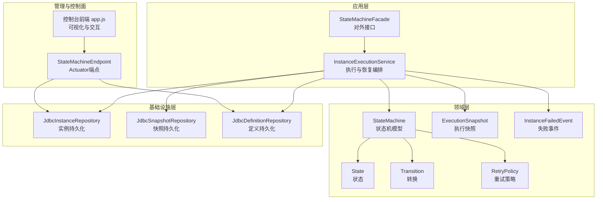
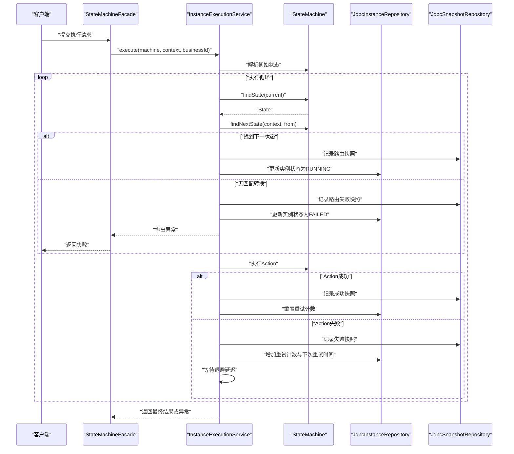
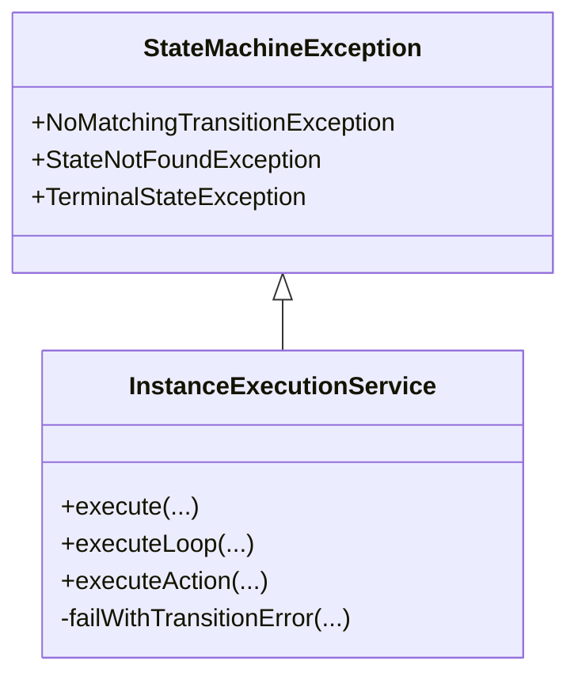
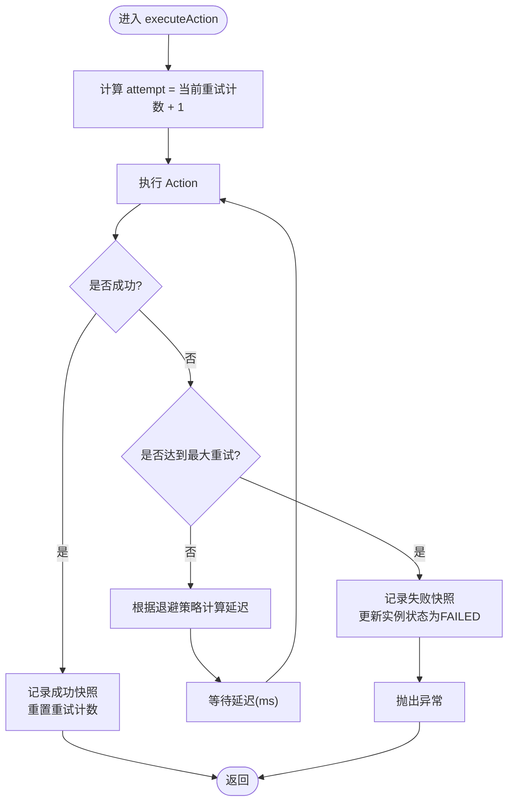
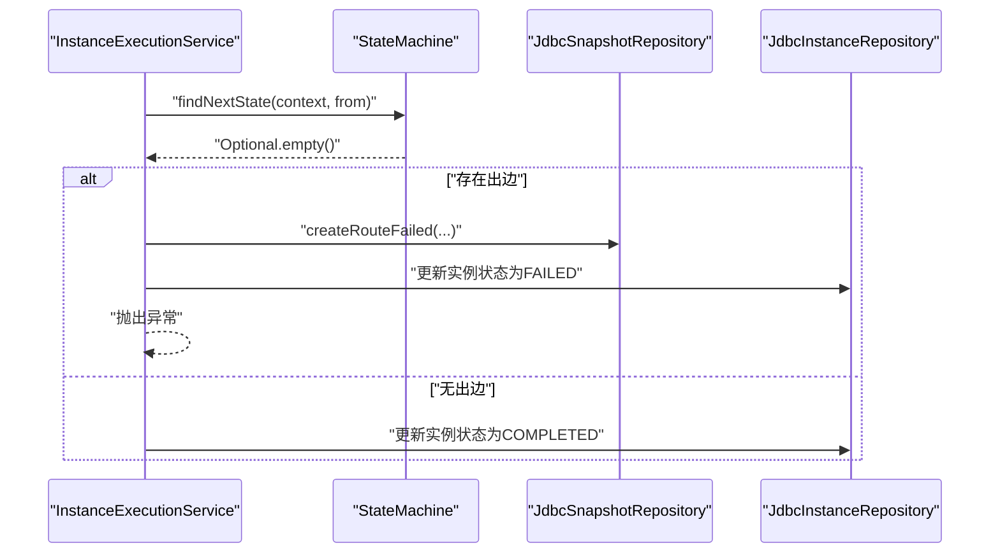
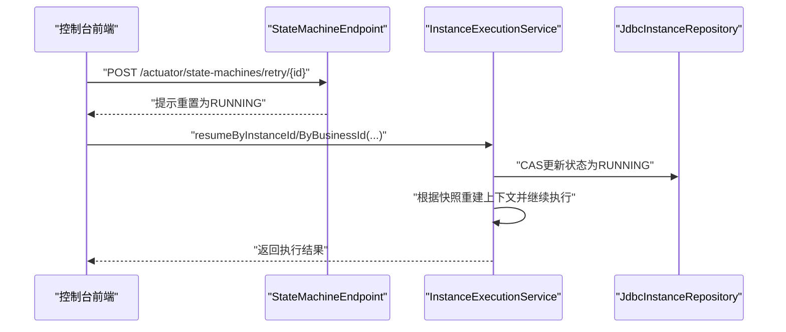
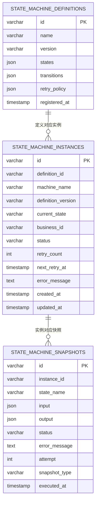
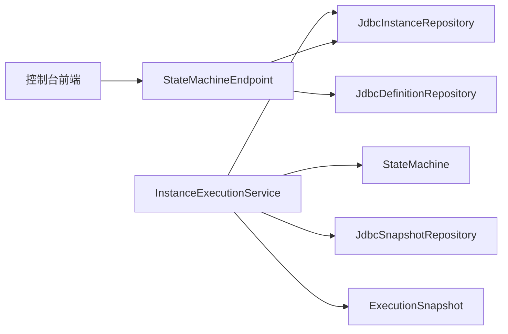

# 故障处理与监控

<cite>
**本文档引用的文件**
- [state-machine-boot-starter/src/main/java/cn/chedejun/statemachine/application/InstanceExecutionService.java](file://state-machine-boot-starter/src/main/java/cn/chedejun/statemachine/application/InstanceExecutionService.java)
- [state-machine-boot-starter/src/main/java/cn/chedejun/statemachine/core/StateMachineException.java](file://state-machine-boot-starter/src/main/java/cn/chedejun/statemachine/core/StateMachineException.java)
- [state-machine-boot-starter/src/main/java/cn/chedejun/statemachine/core/RetryPolicy.java](file://state-machine-boot-starter/src/main/java/cn/chedejun/statemachine/core/RetryPolicy.java)
- [state-machine-boot-starter/src/main/java/cn/chedejun/statemachine/domain/engine/StateMachine.java](file://state-machine-boot-starter/src/main/java/cn/chedejun/statemachine/domain/engine/StateMachine.java)
- [state-machine-boot-starter/src/main/java/cn/chedejun/statemachine/domain/snapshot/ExecutionSnapshot.java](file://state-machine-boot-starter/src/main/java/cn/chedejun/statemachine/domain/snapshot/ExecutionSnapshot.java)
- [state-machine-boot-starter/src/main/java/cn/chedejun/statemachine/domain/event/InstanceFailedEvent.java](file://state-machine-boot-starter/src/main/java/cn/chedejun/statemachine/domain/event/InstanceFailedEvent.java)
- [state-machine-boot-starter/src/main/java/cn/chedejun/statemachine/infrastructure/persistence/JdbcInstanceRepository.java](file://state-machine-boot-starter/src/main/java/cn/chedejun/statemachine/infrastructure/persistence/JdbcInstanceRepository.java)
- [state-machine-boot-starter/src/main/java/cn/chedejun/statemachine/management/StateMachineEndpoint.java](file://state-machine-boot-starter/src/main/java/cn/chedejun/statemachine/management/StateMachineEndpoint.java)
- [state-machine-boot-starter/src/main/resources/ddl/mysql.sql](file://state-machine-boot-starter/src/main/resources/ddl/mysql.sql)
- [state-machine-boot-starter/src/main/resources/console/js/app.js](file://state-machine-boot-starter/src/main/resources/console/js/app.js)
- [state-machine-boot-starter/src/test/java/cn/chedejun/statemachine/core/RetryPolicyTest.java](file://state-machine-boot-starter/src/test/java/cn/chedejun/statemachine/core/RetryPolicyTest.java)
</cite>

## 目录
1. [简介](#简介)
2. [项目结构](#项目结构)
3. [核心组件](#核心组件)
4. [架构总览](#架构总览)
5. [详细组件分析](#详细组件分析)
6. [依赖分析](#依赖分析)
7. [性能考虑](#性能考虑)
8. [故障排查指南](#故障排查指南)
9. [结论](#结论)
10. [附录](#附录)

## 简介
本文件聚焦于状态机引擎的故障处理与监控体系，涵盖异常捕获、错误分类、故障传播策略；自动重试、人工干预与故障转移机制；监控指标设计与采集；告警与通知配置；故障排查最佳实践以及故障数据的持久化与审计要求。通过代码级分析与可视化图表，帮助读者全面理解从“异常发生”到“故障恢复”的完整闭环。

## 项目结构
本项目采用分层与领域驱动设计相结合的方式组织代码：
- 应用层：负责编排执行、恢复与重试，封装业务流程控制
- 领域层：状态机模型、状态、转换、重试策略、快照与事件
- 基础设施层：数据库访问与持久化实现
- 管理与控制面：Actuator 端点与控制台前端，用于可观测性与运维操作

**图表来源**
- [state-machine-boot-starter/src/main/java/cn/chedejun/statemachine/application/InstanceExecutionService.java:1-296](file://state-machine-boot-starter/src/main/java/cn/chedejun/statemachine/application/InstanceExecutionService.java#L1-296)
- [state-machine-boot-starter/src/main/java/cn/chedejun/statemachine/domain/engine/StateMachine.java:1-77](file://state-machine-boot-starter/src/main/java/cn/chedejun/statemachine/domain/engine/StateMachine.java#L1-77)
- [state-machine-boot-starter/src/main/java/cn/chedejun/statemachine/domain/snapshot/ExecutionSnapshot.java:1-73](file://state-machine-boot-starter/src/main/java/cn/chedejun/statemachine/domain/snapshot/ExecutionSnapshot.java#L1-73)
- [state-machine-boot-starter/src/main/java/cn/chedejun/statemachine/infrastructure/persistence/JdbcInstanceRepository.java:1-164](file://state-machine-boot-starter/src/main/java/cn/chedejun/statemachine/infrastructure/persistence/JdbcInstanceRepository.java#L1-164)
- [state-machine-boot-starter/src/main/java/cn/chedejun/statemachine/management/StateMachineEndpoint.java:1-80](file://state-machine-boot-starter/src/main/java/cn/chedejun/statemachine/management/StateMachineEndpoint.java#L1-80)
- [state-machine-boot-starter/src/main/resources/console/js/app.js:1-848](file://state-machine-boot-starter/src/main/resources/console/js/app.js#L1-848)

**章节来源**
- [state-machine-boot-starter/src/main/java/cn/chedejun/statemachine/application/InstanceExecutionService.java:1-296](file://state-machine-boot-starter/src/main/java/cn/chedejun/statemachine/application/InstanceExecutionService.java#L1-296)
- [state-machine-boot-starter/src/main/java/cn/chedejun/statemachine/domain/engine/StateMachine.java:1-77](file://state-machine-boot-starter/src/main/java/cn/chedejun/statemachine/domain/engine/StateMachine.java#L1-77)
- [state-machine-boot-starter/src/main/java/cn/chedejun/statemachine/infrastructure/persistence/JdbcInstanceRepository.java:1-164](file://state-machine-boot-starter/src/main/java/cn/chedejun/statemachine/infrastructure/persistence/JdbcInstanceRepository.java#L1-164)
- [state-machine-boot-starter/src/main/java/cn/chedejun/statemachine/management/StateMachineEndpoint.java:1-80](file://state-machine-boot-starter/src/main/java/cn/chedejun/statemachine/management/StateMachineEndpoint.java#L1-80)
- [state-machine-boot-starter/src/main/resources/console/js/app.js:1-848](file://state-machine-boot-starter/src/main/resources/console/js/app.js#L1-848)

## 核心组件
- 异常与错误分类：自定义运行时异常类型，区分“无匹配转换”“状态不存在”“实例处于终止状态”等场景，便于精准处理与传播
- 重试策略：指数退避策略，支持最大尝试次数、初始延迟、最大延迟与退避因子配置
- 执行服务：封装状态机执行循环、动作执行、路由决策、快照记录与重试等待
- 数据持久化：实例、快照、定义三类表，支持原子 upsert、状态计数与过滤查询
- 监控与控制面：Actuator 端点提供机器与实例统计，控制台前端提供可视化与交互式恢复

**章节来源**
- [state-machine-boot-starter/src/main/java/cn/chedejun/statemachine/core/StateMachineException.java:1-19](file://state-machine-boot-starter/src/main/java/cn/chedejun/statemachine/core/StateMachineException.java#L1-19)
- [state-machine-boot-starter/src/main/java/cn/chedejun/statemachine/core/RetryPolicy.java:1-45](file://state-machine-boot-starter/src/main/java/cn/chedejun/statemachine/core/RetryPolicy.java#L1-45)
- [state-machine-boot-starter/src/main/java/cn/chedejun/statemachine/application/InstanceExecutionService.java:1-296](file://state-machine-boot-starter/src/main/java/cn/chedejun/statemachine/application/InstanceExecutionService.java#L1-296)
- [state-machine-boot-starter/src/main/resources/ddl/mysql.sql:1-19](file://state-machine-boot-starter/src/main/resources/ddl/mysql.sql#L1-19)
- [state-machine-boot-starter/src/main/java/cn/chedejun/statemachine/management/StateMachineEndpoint.java:1-80](file://state-machine-boot-starter/src/main/java/cn/chedejun/statemachine/management/StateMachineEndpoint.java#L1-80)
- [state-machine-boot-starter/src/main/resources/console/js/app.js:1-848](file://state-machine-boot-starter/src/main/resources/console/js/app.js#L1-848)

## 架构总览
下图展示从“外部调用”到“状态机执行与恢复”的端到端流程，包括异常捕获、重试与故障传播路径。

**图表来源**
- [state-machine-boot-starter/src/main/java/cn/chedejun/statemachine/application/InstanceExecutionService.java:158-237](file://state-machine-boot-starter/src/main/java/cn/chedejun/statemachine/application/InstanceExecutionService.java#L158-237)
- [state-machine-boot-starter/src/main/java/cn/chedejun/statemachine/domain/engine/StateMachine.java:63-71](file://state-machine-boot-starter/src/main/java/cn/chedejun/statemachine/domain/engine/StateMachine.java#L63-71)
- [state-machine-boot-starter/src/main/java/cn/chedejun/statemachine/domain/snapshot/ExecutionSnapshot.java:38-61](file://state-machine-boot-starter/src/main/java/cn/chedejun/statemachine/domain/snapshot/ExecutionSnapshot.java#L38-61)
- [state-machine-boot-starter/src/main/java/cn/chedejun/statemachine/infrastructure/persistence/JdbcInstanceRepository.java:47-86](file://state-machine-boot-starter/src/main/java/cn/chedejun/statemachine/infrastructure/persistence/JdbcInstanceRepository.java#L47-86)

## 详细组件分析

### 异常捕获与错误分类
- 自定义异常类型覆盖常见故障场景，如“无匹配转换”“状态不存在”“实例处于终止状态”，便于上层进行差异化处理
- 在执行循环与动作执行处统一捕获异常，记录失败快照并更新实例状态，确保故障可见且可追踪

**图表来源**
- [state-machine-boot-starter/src/main/java/cn/chedejun/statemachine/core/StateMachineException.java:3-18](file://state-machine-boot-starter/src/main/java/cn/chedejun/statemachine/core/StateMachineException.java#L3-18)
- [state-machine-boot-starter/src/main/java/cn/chedejun/statemachine/application/InstanceExecutionService.java:166-193](file://state-machine-boot-starter/src/main/java/cn/chedejun/statemachine/application/InstanceExecutionService.java#L166-193)

**章节来源**
- [state-machine-boot-starter/src/main/java/cn/chedejun/statemachine/core/StateMachineException.java:1-19](file://state-machine-boot-starter/src/main/java/cn/chedejun/statemachine/core/StateMachineException.java#L1-19)
- [state-machine-boot-starter/src/main/java/cn/chedejun/statemachine/application/InstanceExecutionService.java:166-193](file://state-machine-boot-starter/src/main/java/cn/chedejun/statemachine/application/InstanceExecutionService.java#L166-193)

### 重试策略与自动恢复
- 指数退避策略：支持最大尝试次数、初始延迟、最大延迟与退避因子，避免雪崩效应
- 执行循环内按当前重试计数计算延迟，睡眠等待后继续执行，直至成功或耗尽重试
- 成功后清零重试计数，失败则记录错误信息并推进实例状态至 FAILED

**图表来源**
- [state-machine-boot-starter/src/main/java/cn/chedejun/statemachine/core/RetryPolicy.java:26-30](file://state-machine-boot-starter/src/main/java/cn/chedejun/statemachine/core/RetryPolicy.java#L26-30)
- [state-machine-boot-starter/src/main/java/cn/chedejun/statemachine/application/InstanceExecutionService.java:200-237](file://state-machine-boot-starter/src/main/java/cn/chedejun/statemachine/application/InstanceExecutionService.java#L200-237)

**章节来源**
- [state-machine-boot-starter/src/main/java/cn/chedejun/statemachine/core/RetryPolicy.java:1-45](file://state-machine-boot-starter/src/main/java/cn/chedejun/statemachine/core/RetryPolicy.java#L1-45)
- [state-machine-boot-starter/src/main/java/cn/chedejun/statemachine/application/InstanceExecutionService.java:200-237](file://state-machine-boot-starter/src/main/java/cn/chedejun/statemachine/application/InstanceExecutionService.java#L200-237)
- [state-machine-boot-starter/src/test/java/cn/chedejun/statemachine/core/RetryPolicyTest.java:1-35](file://state-machine-boot-starter/src/test/java/cn/chedejun/statemachine/core/RetryPolicyTest.java#L1-35)

### 故障传播与路由失败处理
- 当状态无匹配转换且存在出边时，记录路由失败快照并更新实例状态为 FAILED，同时抛出自定义异常，确保故障向上游传播
- 控制台前端基于实例快照渲染状态图，直观显示成功/失败节点与已遍历的边，辅助定位问题

**图表来源**
- [state-machine-boot-starter/src/main/java/cn/chedejun/statemachine/application/InstanceExecutionService.java:178-184](file://state-machine-boot-starter/src/main/java/cn/chedejun/statemachine/application/InstanceExecutionService.java#L178-184)
- [state-machine-boot-starter/src/main/java/cn/chedejun/statemachine/domain/snapshot/ExecutionSnapshot.java:57-61](file://state-machine-boot-starter/src/main/java/cn/chedejun/statemachine/domain/snapshot/ExecutionSnapshot.java#L57-61)

**章节来源**
- [state-machine-boot-starter/src/main/java/cn/chedejun/statemachine/application/InstanceExecutionService.java:178-184](file://state-machine-boot-starter/src/main/java/cn/chedejun/statemachine/application/InstanceExecutionService.java#L178-184)
- [state-machine-boot-starter/src/main/resources/console/js/app.js:678-799](file://state-machine-boot-starter/src/main/resources/console/js/app.js#L678-799)

### 人工干预与故障转移
- 支持按业务ID或实例ID恢复执行，校验期望状态与实际状态一致性，合并上下文后继续执行
- 支持重试（保留上次失败上下文）与自定义上下文重试，结合路由快照与节点快照选择最优恢复路径
- 控制台提供交互式恢复对话框，支持树形编辑上下文并发起恢复

**图表来源**
- [state-machine-boot-starter/src/main/java/cn/chedejun/statemachine/management/StateMachineEndpoint.java:71-78](file://state-machine-boot-starter/src/main/java/cn/chedejun/statemachine/management/StateMachineEndpoint.java#L71-78)
- [state-machine-boot-starter/src/main/java/cn/chedejun/statemachine/application/InstanceExecutionService.java:60-114](file://state-machine-boot-starter/src/main/java/cn/chedejun/statemachine/application/InstanceExecutionService.java#L60-114)
- [state-machine-boot-starter/src/main/resources/console/js/app.js:309-361](file://state-machine-boot-starter/src/main/resources/console/js/app.js#L309-361)

**章节来源**
- [state-machine-boot-starter/src/main/java/cn/chedejun/statemachine/management/StateMachineEndpoint.java:1-80](file://state-machine-boot-starter/src/main/java/cn/chedejun/statemachine/management/StateMachineEndpoint.java#L1-80)
- [state-machine-boot-starter/src/main/java/cn/chedejun/statemachine/application/InstanceExecutionService.java:60-114](file://state-machine-boot-starter/src/main/java/cn/chedejun/statemachine/application/InstanceExecutionService.java#L60-114)
- [state-machine-boot-starter/src/main/resources/console/js/app.js:276-361](file://state-machine-boot-starter/src/main/resources/console/js/app.js#L276-361)

### 监控指标设计与采集
- 实例状态计数：通过仓库层提供的计数接口统计 RUNNING/FAILED/SUSPENDED/COMPLETED 数量，作为健康度指标
- 快照粒度：按状态与尝试次数记录成功/失败快照，支持回放与趋势分析
- 控制台可视化：基于快照渲染状态图，颜色编码节点与边，直观反映执行路径与失败位置

建议指标（基于现有实现扩展）：
- 执行成功率：成功实例数 / 总实例数
- 平均响应时间：实例完成时间 - 创建时间 的均值
- 故障率：FAILED 实例数 / 总实例数
- 平均重试次数：所有实例累计重试次数 / 成功实例数
- 路由失败率：路由失败快照数 / 路由快照总数

**章节来源**
- [state-machine-boot-starter/src/main/java/cn/chedejun/statemachine/management/StateMachineEndpoint.java:40-51](file://state-machine-boot-starter/src/main/java/cn/chedejun/statemachine/management/StateMachineEndpoint.java#L40-51)
- [state-machine-boot-starter/src/main/java/cn/chedejun/statemachine/infrastructure/persistence/JdbcInstanceRepository.java:104-111](file://state-machine-boot-starter/src/main/java/cn/chedejun/statemachine/infrastructure/persistence/JdbcInstanceRepository.java#L104-111)
- [state-machine-boot-starter/src/main/resources/console/js/app.js:646-799](file://state-machine-boot-starter/src/main/resources/console/js/app.js#L646-799)

### 告警与通知机制
- Actuator 端点：提供机器与实例统计，可用于外部监控系统拉取
- 控制台前端：提供实例详情与状态图，便于人工告警与快速处置
- 建议集成方案：Prometheus 抓取 Actuator 指标，结合告警规则（如 FAILED 实例数阈值）触发通知

**章节来源**
- [state-machine-boot-starter/src/main/java/cn/chedejun/statemachine/management/StateMachineEndpoint.java:1-80](file://state-machine-boot-starter/src/main/java/cn/chedejun/statemachine/management/StateMachineEndpoint.java#L1-80)
- [state-machine-boot-starter/src/main/resources/console/js/app.js:1-848](file://state-machine-boot-starter/src/main/resources/console/js/app.js#L1-848)

### 故障数据持久化与审计
- 定义表：存储状态机定义（状态、转换、重试策略），版本化管理
- 实例表：存储实例元数据、状态、重试计数、下次重试时间与错误信息
- 快照表：记录每个状态的输入/输出、执行结果、错误信息与尝试次数，支持审计回溯

**图表来源**
- [state-machine-boot-starter/src/main/resources/ddl/mysql.sql:1-19](file://state-machine-boot-starter/src/main/resources/ddl/mysql.sql#L1-19)

**章节来源**
- [state-machine-boot-starter/src/main/resources/ddl/mysql.sql:1-19](file://state-machine-boot-starter/src/main/resources/ddl/mysql.sql#L1-19)

## 依赖分析
- 执行服务依赖状态机模型、仓库层与快照模型，耦合集中在执行循环与状态更新
- 仓库层提供原子 upsert 与状态计数查询，降低并发竞争风险
- 控制面通过 Actuator 端点与前端交互，形成闭环运维体验

**图表来源**
- [state-machine-boot-starter/src/main/java/cn/chedejun/statemachine/application/InstanceExecutionService.java:35-41](file://state-machine-boot-starter/src/main/java/cn/chedejun/statemachine/application/InstanceExecutionService.java#L35-41)
- [state-machine-boot-starter/src/main/java/cn/chedejun/statemachine/infrastructure/persistence/JdbcInstanceRepository.java:16-20](file://state-machine-boot-starter/src/main/java/cn/chedejun/statemachine/infrastructure/persistence/JdbcInstanceRepository.java#L16-20)
- [state-machine-boot-starter/src/main/java/cn/chedejun/statemachine/management/StateMachineEndpoint.java:25-38](file://state-machine-boot-starter/src/main/java/cn/chedejun/statemachine/management/StateMachineEndpoint.java#L25-38)
- [state-machine-boot-starter/src/main/resources/console/js/app.js:1-848](file://state-machine-boot-starter/src/main/resources/console/js/app.js#L1-848)

**章节来源**
- [state-machine-boot-starter/src/main/java/cn/chedejun/statemachine/application/InstanceExecutionService.java:1-296](file://state-machine-boot-starter/src/main/java/cn/chedejun/statemachine/application/InstanceExecutionService.java#L1-296)
- [state-machine-boot-starter/src/main/java/cn/chedejun/statemachine/infrastructure/persistence/JdbcInstanceRepository.java:1-164](file://state-machine-boot-starter/src/main/java/cn/chedejun/statemachine/infrastructure/persistence/JdbcInstanceRepository.java#L1-164)
- [state-machine-boot-starter/src/main/java/cn/chedejun/statemachine/management/StateMachineEndpoint.java:1-80](file://state-machine-boot-starter/src/main/java/cn/chedejun/statemachine/management/StateMachineEndpoint.java#L1-80)
- [state-machine-boot-starter/src/main/resources/console/js/app.js:1-848](file://state-machine-boot-starter/src/main/resources/console/js/app.js#L1-848)

## 性能考虑
- 原子 upsert：实例保存采用“插入冲突则更新”的策略，避免先查后写带来的并发竞态与额外往返
- 最大迭代限制：执行循环设置上限，防止无限循环导致资源耗尽
- 退避延迟：指数退避减少抖动与瞬时峰值，保护下游系统
- 快照粒度：按状态与尝试记录，兼顾可观测性与存储开销

**章节来源**
- [state-machine-boot-starter/src/main/java/cn/chedejun/statemachine/infrastructure/persistence/JdbcInstanceRepository.java:47-86](file://state-machine-boot-starter/src/main/java/cn/chedejun/statemachine/infrastructure/persistence/JdbcInstanceRepository.java#L47-86)
- [state-machine-boot-starter/src/main/java/cn/chedejun/statemachine/application/InstanceExecutionService.java:161-193](file://state-machine-boot-starter/src/main/java/cn/chedejun/statemachine/application/InstanceExecutionService.java#L161-193)
- [state-machine-boot-starter/src/main/java/cn/chedejun/statemachine/core/RetryPolicy.java:26-30](file://state-machine-boot-starter/src/main/java/cn/chedejun/statemachine/core/RetryPolicy.java#L26-30)

## 故障排查指南
- 快速定位：通过控制台查看实例状态图，红色节点表示失败，绿色表示成功，结合路由失败快照定位问题
- 上下文重建：恢复时优先使用最后一次成功节点的输出作为上下文，必要时手动合并
- 重试策略：检查重试次数与退避参数，避免过短间隔造成级联失败
- 数据核对：确认实例表状态与快照表记录一致，必要时手工修正状态（谨慎操作）
- 日志与告警：关注执行服务日志中的重试与失败记录，结合监控指标进行告警联动

**章节来源**
- [state-machine-boot-starter/src/main/resources/console/js/app.js:678-799](file://state-machine-boot-starter/src/main/resources/console/js/app.js#L678-799)
- [state-machine-boot-starter/src/main/java/cn/chedejun/statemachine/application/InstanceExecutionService.java:214-236](file://state-machine-boot-starter/src/main/java/cn/chedejun/statemachine/application/InstanceExecutionService.java#L214-236)
- [state-machine-boot-starter/src/main/java/cn/chedejun/statemachine/management/StateMachineEndpoint.java:71-78](file://state-machine-boot-starter/src/main/java/cn/chedejun/statemachine/management/StateMachineEndpoint.java#L71-78)

## 结论
该状态机系统在异常捕获、重试策略、故障传播与人工干预方面形成了完整的闭环。通过原子持久化、可视化监控与可审计的数据模型，既保证了运行稳定性，也为运维与故障排查提供了坚实基础。建议在此基础上进一步完善指标采集与告警联动，以实现更高效的故障发现与处置。

## 附录
- 关键实现参考路径
  - [重试策略实现:1-45](file://state-machine-boot-starter/src/main/java/cn/chedejun/statemachine/core/RetryPolicy.java#L1-45)
  - [执行循环与动作执行:158-237](file://state-machine-boot-starter/src/main/java/cn/chedejun/statemachine/application/InstanceExecutionService.java#L158-237)
  - [实例持久化与原子 upsert:47-86](file://state-machine-boot-starter/src/main/java/cn/chedejun/statemachine/infrastructure/persistence/JdbcInstanceRepository.java#L47-86)
  - [快照模型与路由失败记录:38-61](file://state-machine-boot-starter/src/main/java/cn/chedejun/statemachine/domain/snapshot/ExecutionSnapshot.java#L38-61)
  - [Actuator 端点与统计:40-51](file://state-machine-boot-starter/src/main/java/cn/chedejun/statemachine/management/StateMachineEndpoint.java#L40-51)
  - [控制台可视化与恢复交互:309-361](file://state-machine-boot-starter/src/main/resources/console/js/app.js#L309-361)