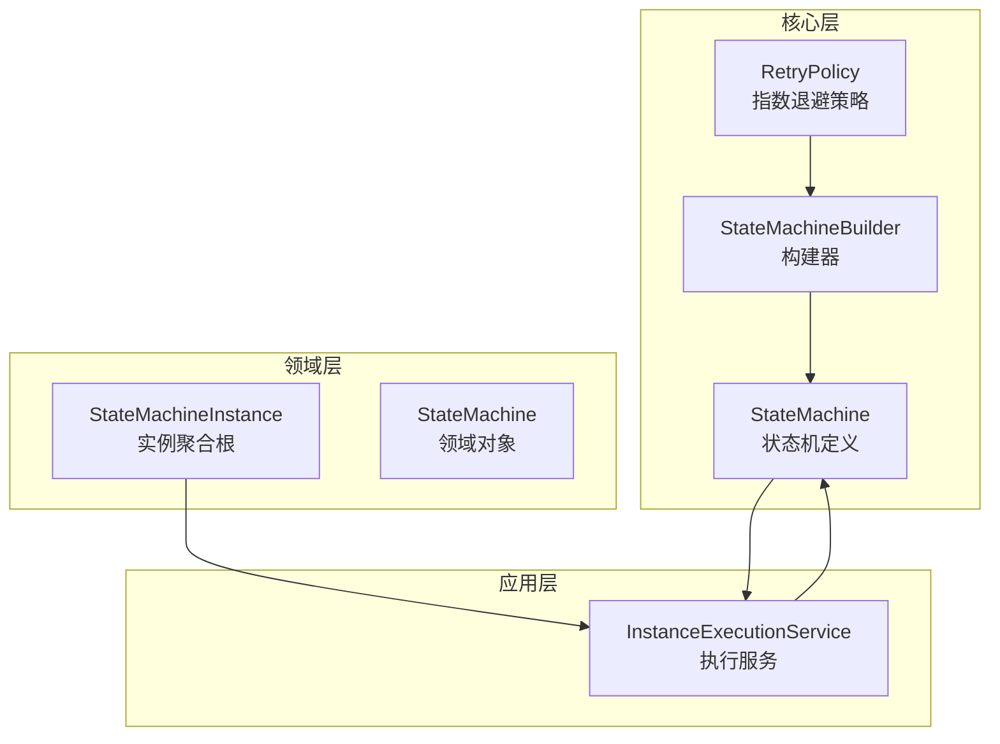
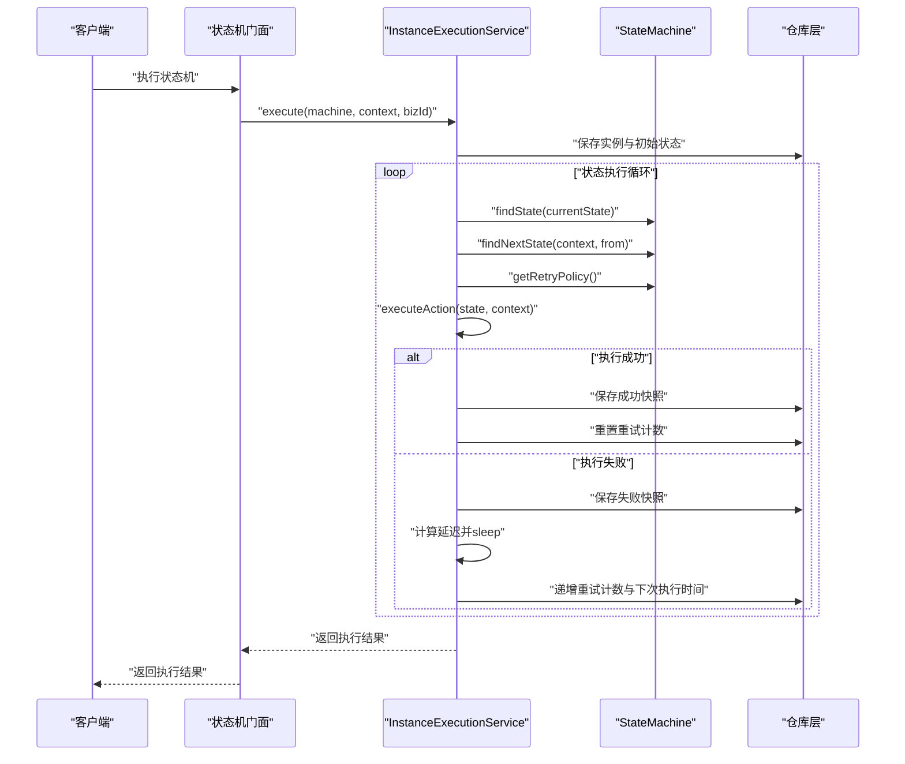
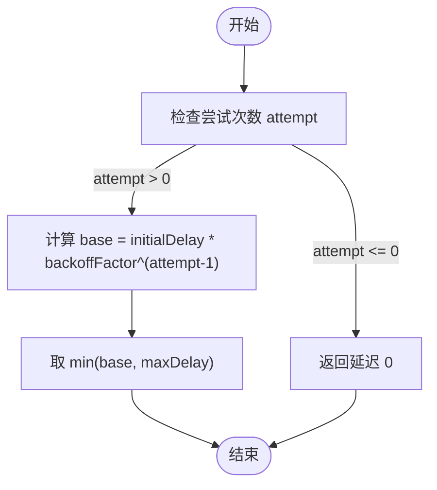
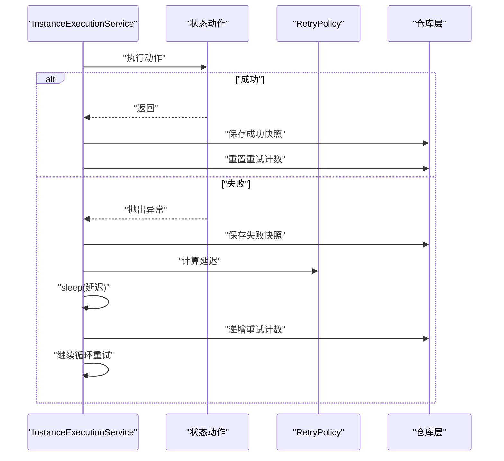
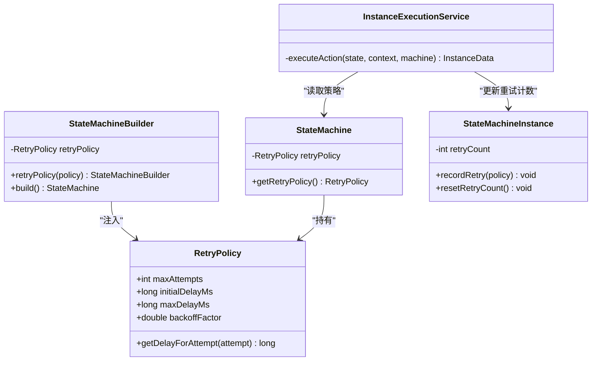

# 重试策略实现

<cite>
**本文档引用的文件**
- [RetryPolicy.java](file://state-machine-boot-starter/src/main/java/cn/chedejun/statemachine/core/RetryPolicy.java)
- [RetryPolicyTest.java](file://state-machine-boot-starter/src/test/java/cn/chedejun/statemachine/core/RetryPolicyTest.java)
- [StateMachineBuilder.java](file://state-machine-boot-starter/src/main/java/cn/chedejun/statemachine/core/StateMachineBuilder.java)
- [StateMachine.java](file://state-machine-boot-starter/src/main/java/cn/chedejun/statemachine/domain/engine/StateMachine.java)
- [StateMachineInstance.java](file://state-machine-boot-starter/src/main/java/cn/chedejun/statemachine/domain/instance/StateMachineInstance.java)
- [InstanceExecutionService.java](file://state-machine-boot-starter/src/main/java/cn/chedejun/statemachine/application/InstanceExecutionService.java)
- [StateMachineIntegrationTest.java](file://state-machine-boot-starter/src/test/java/cn/chedejun/statemachine/integration/StateMachineIntegrationTest.java)
</cite>

## 目录
1. [简介](#简介)
2. [项目结构](#项目结构)
3. [核心组件](#核心组件)
4. [架构概览](#架构概览)
5. [详细组件分析](#详细组件分析)
6. [依赖分析](#依赖分析)
7. [性能考虑](#性能考虑)
8. [故障排除指南](#故障排除指南)
9. [结论](#结论)

## 简介
本文件深入解析状态机框架中的重试策略实现，重点阐述指数退避算法的数学原理与工程实现，涵盖初始延迟、退避倍数、最大重试间隔等关键参数的计算方式；详细说明重试策略的配置选项、重试条件与失败阈值设置；解释不同错误类型的重试行为差异；提供监控指标与统计信息收集方案；并给出性能影响分析与调优建议。

## 项目结构
重试策略相关代码主要分布在以下模块：
- 核心模型与策略：cn.chedejun.statemachine.core（RetryPolicy、StateMachineBuilder、StateMachine）
- 领域模型：cn.chedejun.statemachine.domain.engine（StateMachine）、cn.chedejun.statemachine.domain.instance（StateMachineInstance）
- 应用服务：cn.chedejun.statemachine.application（InstanceExecutionService）
- 测试覆盖：core包与integration包的测试类

**图表来源**
- [RetryPolicy.java:1-45](file://state-machine-boot-starter/src/main/java/cn/chedejun/statemachine/core/RetryPolicy.java#L1-L45)
- [StateMachineBuilder.java:1-52](file://state-machine-boot-starter/src/main/java/cn/chedejun/statemachine/core/StateMachineBuilder.java#L1-L52)
- [StateMachine.java:1-77](file://state-machine-boot-starter/src/main/java/cn/chedejun/statemachine/domain/engine/StateMachine.java#L1-L77)
- [StateMachineInstance.java:1-81](file://state-machine-boot-starter/src/main/java/cn/chedejun/statemachine/domain/instance/StateMachineInstance.java#L1-L81)
- [InstanceExecutionService.java:1-296](file://state-machine-boot-starter/src/main/java/cn/chedejun/statemachine/application/InstanceExecutionService.java#L1-L296)

**章节来源**
- [RetryPolicy.java:1-45](file://state-machine-boot-starter/src/main/java/cn/chedejun/statemachine/core/RetryPolicy.java#L1-L45)
- [StateMachineBuilder.java:1-52](file://state-machine-boot-starter/src/main/java/cn/chedejun/statemachine/core/StateMachineBuilder.java#L1-L52)
- [StateMachine.java:1-77](file://state-machine-boot-starter/src/main/java/cn/chedejun/statemachine/domain/engine/StateMachine.java#L1-L77)
- [StateMachineInstance.java:1-81](file://state-machine-boot-starter/src/main/java/cn/chedejun/statemachine/domain/instance/StateMachineInstance.java#L1-L81)
- [InstanceExecutionService.java:1-296](file://state-machine-boot-starter/src/main/java/cn/chedejun/statemachine/application/InstanceExecutionService.java#L1-L296)

## 核心组件
本节聚焦重试策略的核心数据结构与接口设计，包括指数退避策略的参数化配置、延迟计算与构建器模式。

- RetryPolicy：封装最大重试次数、初始延迟、最大延迟与退避因子，并提供延迟计算方法与Builder。
- StateMachineBuilder：支持注入自定义RetryPolicy，默认采用指数退避策略。
- StateMachine：持有RetryPolicy并在执行循环中使用。
- StateMachineInstance：维护实例级重试计数与状态，提供重试校验与重置。
- InstanceExecutionService：在状态动作执行失败时根据策略进行重试与休眠。

**章节来源**
- [RetryPolicy.java:1-45](file://state-machine-boot-starter/src/main/java/cn/chedejun/statemachine/core/RetryPolicy.java#L1-L45)
- [StateMachineBuilder.java:14](file://state-machine-boot-starter/src/main/java/cn/chedejun/statemachine/core/StateMachineBuilder.java#L14)
- [StateMachine.java:25](file://state-machine-boot-starter/src/main/java/cn/chedejun/statemachine/domain/engine/StateMachine.java#L25)
- [StateMachineInstance.java:16](file://state-machine-boot-starter/src/main/java/cn/chedejun/statemachine/domain/instance/StateMachineInstance.java#L16)
- [InstanceExecutionService.java:203](file://state-machine-boot-starter/src/main/java/cn/chedejun/statemachine/application/InstanceExecutionService.java#L203)

## 架构概览
重试策略贯穿于状态机的定义、实例与执行三个层次，形成“策略注入—策略使用—策略落地”的完整链路。

**图表来源**
- [InstanceExecutionService.java:43-58](file://state-machine-boot-starter/src/main/java/cn/chedejun/statemachine/application/InstanceExecutionService.java#L43-L58)
- [InstanceExecutionService.java:158-193](file://state-machine-boot-starter/src/main/java/cn/chedejun/statemachine/application/InstanceExecutionService.java#L158-L193)
- [InstanceExecutionService.java:200-237](file://state-machine-boot-starter/src/main/java/cn/chedejun/statemachine/application/InstanceExecutionService.java#L200-L237)
- [StateMachine.java:47](file://state-machine-boot-starter/src/main/java/cn/chedejun/statemachine/domain/engine/StateMachine.java#L47)

## 详细组件分析

### 指数退避策略（RetryPolicy）
指数退避算法通过“初始延迟 × 退避因子^尝试次数”的方式计算每次重试的延迟，同时限制最大延迟，避免无限增长。

- 数学公式
  - 延迟计算：delay = min(initialDelay × backoffFactor^(attempt-1), maxDelay)
  - 当 attempt ≤ 0 时，延迟为 0
- 关键参数
  - maxAttempts：最大重试次数（超过则判定失败）
  - initialDelayMs：初始延迟（毫秒）
  - maxDelayMs：最大延迟（毫秒）
  - backoffFactor：退避倍数（>1）

**图表来源**
- [RetryPolicy.java:26-30](file://state-machine-boot-starter/src/main/java/cn/chedejun/statemachine/core/RetryPolicy.java#L26-L30)

**章节来源**
- [RetryPolicy.java:6-30](file://state-machine-boot-starter/src/main/java/cn/chedejun/statemachine/core/RetryPolicy.java#L6-L30)
- [RetryPolicyTest.java:13-29](file://state-machine-boot-starter/src/test/java/cn/chedejun/statemachine/core/RetryPolicyTest.java#L13-L29)

### 策略配置与构建
- 默认策略：StateMachineBuilder默认注入指数退避策略，最大重试次数为3
- 自定义策略：通过builder.retryPolicy(...)注入任意RetryPolicy
- 参数化构建：Builder支持设置maxAttempts、initialDelay、maxDelay、backoffFactor，并统一转换为毫秒存储

**章节来源**
- [StateMachineBuilder.java:14](file://state-machine-boot-starter/src/main/java/cn/chedejun/statemachine/core/StateMachineBuilder.java#L14)
- [StateMachineBuilder.java:36](file://state-machine-boot-starter/src/main/java/cn/chedejun/statemachine/core/StateMachineBuilder.java#L36)
- [RetryPolicy.java:32-43](file://state-machine-boot-starter/src/main/java/cn/chedejun/statemachine/core/RetryPolicy.java#L32-L43)

### 实例级重试控制（StateMachineInstance）
- 重试计数：实例聚合根维护retryCount字段
- 重试校验：仅FAILED状态可重试，且不超过策略允许的最大重试次数
- 重置：成功后重置重试计数为0

**章节来源**
- [StateMachineInstance.java:16](file://state-machine-boot-starter/src/main/java/cn/chedejun/statemachine/domain/instance/StateMachineInstance.java#L16)
- [StateMachineInstance.java:52-59](file://state-machine-boot-starter/src/main/java/cn/chedejun/statemachine/domain/instance/StateMachineInstance.java#L52-L59)
- [StateMachineInstance.java:61](file://state-machine-boot-starter/src/main/java/cn/chedejun/statemachine/domain/instance/StateMachineInstance.java#L61)

### 执行流程中的重试逻辑（InstanceExecutionService）
- 执行循环：对每个状态的动作执行进行循环，直到完成、挂起或失败
- 失败处理：捕获异常，记录失败快照，计算延迟并休眠，递增重试计数
- 成功处理：记录成功快照，重置重试计数
- 边界保护：当重试次数达到上限时，标记实例为FAILED并抛出异常

**图表来源**
- [InstanceExecutionService.java:200-237](file://state-machine-boot-starter/src/main/java/cn/chedejun/statemachine/application/InstanceExecutionService.java#L200-L237)
- [RetryPolicy.java:26-30](file://state-machine-boot-starter/src/main/java/cn/chedejun/statemachine/core/RetryPolicy.java#L26-L30)

**章节来源**
- [InstanceExecutionService.java:158-193](file://state-machine-boot-starter/src/main/java/cn/chedejun/statemachine/application/InstanceExecutionService.java#L158-L193)
- [InstanceExecutionService.java:200-237](file://state-machine-boot-starter/src/main/java/cn/chedejun/statemachine/application/InstanceExecutionService.java#L200-L237)

### 错误类型与重试行为
- 可重试错误：执行过程中抛出的异常会被视为可重试，依据RetryPolicy进行指数退避重试
- 不可重试错误：状态机定义错误（如状态不存在）或业务条件不满足导致的路由失败，不会触发重试，而是直接标记为FAILED
- 挂起状态：若状态声明为挂起状态，实例会进入SUSPENDED，需外部恢复后继续执行

**章节来源**
- [InstanceExecutionService.java:166-170](file://state-machine-boot-starter/src/main/java/cn/chedejun/statemachine/application/InstanceExecutionService.java#L166-L170)
- [InstanceExecutionService.java:178-184](file://state-machine-boot-starter/src/main/java/cn/chedejun/statemachine/application/InstanceExecutionService.java#L178-L184)
- [StateMachineInstance.java:46-50](file://state-machine-boot-starter/src/main/java/cn/chedejun/statemachine/domain/instance/StateMachineInstance.java#L46-L50)

### 监控指标与统计信息
基于现有实现，可收集以下指标：
- 每个状态的重试次数分布
- 失败快照数量与失败原因
- 成功快照数量与平均耗时
- 实例级别：总重试次数、失败率、挂起时长
- 策略级别：最大重试次数、平均延迟、最大延迟命中比例

建议扩展点：
- 在快照保存处增加埋点，记录attempt、delayMs、执行耗时
- 在状态机层面暴露统计接口或指标导出能力
- 将重试统计写入独立的度量表或监控系统

**章节来源**
- [InstanceExecutionService.java:210-218](file://state-machine-boot-starter/src/main/java/cn/chedejun/statemachine/application/InstanceExecutionService.java#L210-L218)
- [InstanceExecutionService.java:222-228](file://state-machine-boot-starter/src/main/java/cn/chedejun/statemachine/application/InstanceExecutionService.java#L222-L228)

### 配置选项与最佳实践
- 最大重试次数（maxAttempts）：根据业务容忍度与SLA设定，避免过长重试导致资源占用
- 初始延迟（initialDelay）：建议设置为较小正值，快速探测瞬时故障
- 最大延迟（maxDelay）：限制重试上限，防止雪崩效应
- 退避因子（backoffFactor）：通常取2~3，平衡恢复速度与系统压力
- 重试条件：当前实现对所有异常均重试，如需区分可扩展异常分类策略
- 失败阈值：可通过maxAttempts与maxDelay共同决定，超出即失败

**章节来源**
- [RetryPolicy.java:32-43](file://state-machine-boot-starter/src/main/java/cn/chedejun/statemachine/core/RetryPolicy.java#L32-L43)
- [StateMachineBuilder.java:14](file://state-machine-boot-starter/src/main/java/cn/chedejun/statemachine/core/StateMachineBuilder.java#L14)

## 依赖分析
重试策略在各层之间的耦合关系清晰，职责分离明确：

**图表来源**
- [RetryPolicy.java:6-30](file://state-machine-boot-starter/src/main/java/cn/chedejun/statemachine/core/RetryPolicy.java#L6-L30)
- [StateMachineBuilder.java:14](file://state-machine-boot-starter/src/main/java/cn/chedejun/statemachine/core/StateMachineBuilder.java#L14)
- [StateMachine.java:25](file://state-machine-boot-starter/src/main/java/cn/chedejun/statemachine/domain/engine/StateMachine.java#L25)
- [StateMachineInstance.java:52-59](file://state-machine-boot-starter/src/main/java/cn/chedejun/statemachine/domain/instance/StateMachineInstance.java#L52-L59)
- [InstanceExecutionService.java:200-237](file://state-machine-boot-starter/src/main/java/cn/chedejun/statemachine/application/InstanceExecutionService.java#L200-L237)

**章节来源**
- [RetryPolicy.java:1-45](file://state-machine-boot-starter/src/main/java/cn/chedejun/statemachine/core/RetryPolicy.java#L1-L45)
- [StateMachineBuilder.java:1-52](file://state-machine-boot-starter/src/main/java/cn/chedejun/statemachine/core/StateMachineBuilder.java#L1-L52)
- [StateMachine.java:1-77](file://state-machine-boot-starter/src/main/java/cn/chedejun/statemachine/domain/engine/StateMachine.java#L1-L77)
- [StateMachineInstance.java:1-81](file://state-machine-boot-starter/src/main/java/cn/chedejun/statemachine/domain/instance/StateMachineInstance.java#L1-L81)
- [InstanceExecutionService.java:1-296](file://state-machine-boot-starter/src/main/java/cn/chedejun/statemachine/application/InstanceExecutionService.java#L1-L296)

## 性能考虑
- CPU与IO开销：重试循环与快照持久化带来额外IO；建议批量写入与异步持久化
- 内存占用：实例状态与上下文序列化存储，注意上下文大小控制
- 并发安全：重试计数与状态更新需保证原子性，避免竞态
- 资源泄漏：线程sleep期间释放锁与连接，确保中断处理正确
- 调优建议：
  - 合理设置initialDelay与backoffFactor，避免过短退避造成抖动
  - 使用maxDelay限制重试上限，防止长时间阻塞
  - 对高频失败状态引入退避抑制（如指数退避+抖动）
  - 结合监控指标动态调整策略参数

[本节为通用性能指导，无需特定文件来源]

## 故障排除指南
- 重试次数超限：检查maxAttempts配置是否合理，确认异常是否可重试
- 延迟未生效：核对initialDelay与backoffFactor单位换算（Builder内部统一转毫秒）
- 状态机未重试：若状态为挂起状态，需先恢复再重试
- 快照异常：检查失败快照是否正确记录，定位具体状态与异常原因
- 中断重试：线程sleep被中断时应正确处理并终止执行

**章节来源**
- [RetryPolicy.java:39-40](file://state-machine-boot-starter/src/main/java/cn/chedejun/statemachine/core/RetryPolicy.java#L39-L40)
- [InstanceExecutionService.java:224-227](file://state-machine-boot-starter/src/main/java/cn/chedejun/statemachine/application/InstanceExecutionService.java#L224-L227)
- [StateMachineInstance.java:52-59](file://state-machine-boot-starter/src/main/java/cn/chedejun/statemachine/domain/instance/StateMachineInstance.java#L52-L59)

## 结论
本实现以简洁的指数退避策略为核心，结合状态机的执行循环与实例聚合根，提供了可靠的可重试能力。通过参数化配置与测试覆盖，系统具备良好的可调性与可观测性。建议在生产环境中结合监控指标与动态调参，持续优化重试策略以平衡可靠性与性能。