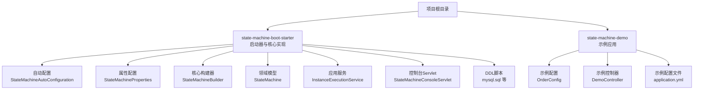
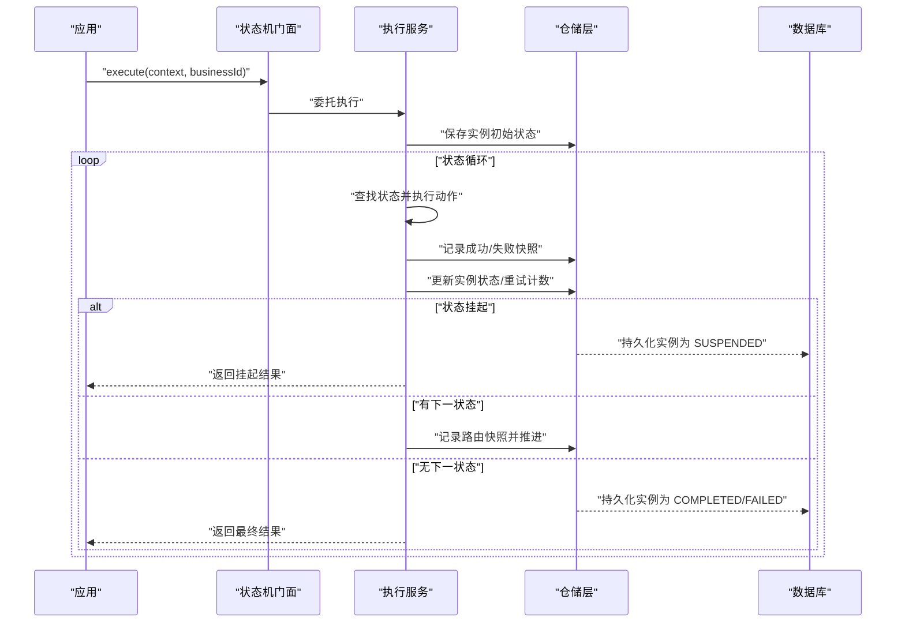
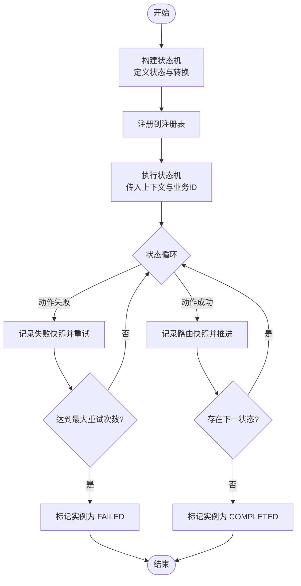
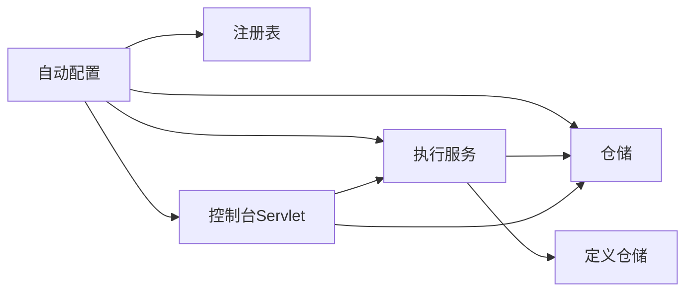

# 快速开始

<cite>
**本文引用的文件**
- [README.md](file://README.md)
- [state-machine-boot-starter/README.md](file://state-machine-boot-starter/README.md)
- [state-machine-boot-starter/pom.xml](file://state-machine-boot-starter/pom.xml)
- [state-machine-boot-starter/src/main/resources/META-INF/spring.factories](file://state-machine-boot-starter/src/main/resources/META-INF/spring.factories)
- [state-machine-boot-starter/src/main/java/cn/chedejun/statemachine/autoconfigure/StateMachineAutoConfiguration.java](file://state-machine-boot-starter/src/main/java/cn/chedejun/statemachine/autoconfigure/StateMachineAutoConfiguration.java)
- [state-machine-boot-starter/src/main/java/cn/chedejun/statemachine/autoconfigure/StateMachineProperties.java](file://state-machine-boot-starter/src/main/java/cn/chedejun/statemachine/autoconfigure/StateMachineProperties.java)
- [state-machine-boot-starter/src/main/java/cn/chedejun/statemachine/core/StateMachineBuilder.java](file://state-machine-boot-starter/src/main/java/cn/chedejun/statemachine/core/StateMachineBuilder.java)
- [state-machine-boot-starter/src/main/java/cn/chedejun/statemachine/interfaces/StateMachineFacade.java](file://state-machine-boot-starter/src/main/java/cn/chedejun/statemachine/interfaces/StateMachineFacade.java)
- [state-machine-boot-starter/src/main/java/cn/chedejun/statemachine/domain/engine/StateMachine.java](file://state-machine-boot-starter/src/main/java/cn/chedejun/statemachine/domain/engine/StateMachine.java)
- [state-machine-boot-starter/src/main/java/cn/chedejun/statemachine/application/InstanceExecutionService.java](file://state-machine-boot-starter/src/main/java/cn/chedejun/statemachine/application/InstanceExecutionService.java)
- [state-machine-boot-starter/src/main/java/cn/chedejun/statemachine/management/StateMachineConsoleServlet.java](file://state-machine-boot-starter/src/main/java/cn/chedejun/statemachine/management/StateMachineConsoleServlet.java)
- [state-machine-boot-starter/src/main/resources/ddl/mysql.sql](file://state-machine-boot-starter/src/main/resources/ddl/mysql.sql)
- [state-machine-demo/src/main/resources/application.yml](file://state-machine-demo/src/main/resources/application.yml)
- [state-machine-demo/src/main/java/cn/chedejun/demo/config/OrderConfig.java](file://state-machine-demo/src/main/java/cn/chedejun/demo/config/OrderConfig.java)
- [state-machine-demo/src/main/java/cn/chedejun/demo/controller/DemoController.java](file://state-machine-demo/src/main/java/cn/chedejun/demo/controller/DemoController.java)
- [state-machine-demo/pom.xml](file://state-machine-demo/pom.xml)
</cite>

## 目录
1. [简介](#简介)
2. [项目结构](#项目结构)
3. [核心组件](#核心组件)
4. [架构总览](#架构总览)
5. [详细组件分析](#详细组件分析)
6. [依赖关系分析](#依赖关系分析)
7. [性能考虑](#性能考虑)
8. [故障排除指南](#故障排除指南)
9. [结论](#结论)
10. [附录](#附录)

## 简介
本指南面向初学者，帮助你在最短时间内完成状态机工作流引擎的安装与上手。你将学会：
- Maven 依赖配置
- Spring Boot 自动配置原理与基本设置
- 数据库初始化与表结构
- Web 控制台与管理端点启用
- 编写第一个"Hello World"状态机：定义状态、转换、重试策略，执行并查看结果
- 常见问题与排障建议

## 项目结构
该仓库采用多模块结构，核心能力集中在 boot-starter 模块中，演示应用在 demo 模块中。

**更新** 演示应用上下文路径已从 `/state-machine-demo` 更改为 `/state-machine-demo3`

图表来源
- [state-machine-boot-starter/src/main/java/cn/chedejun/statemachine/autoconfigure/StateMachineAutoConfiguration.java:32-149](file://state-machine-boot-starter/src/main/java/cn/chedejun/statemachine/autoconfigure/StateMachineAutoConfiguration.java#L32-L149)
- [state-machine-boot-starter/src/main/java/cn/chedejun/statemachine/autoconfigure/StateMachineProperties.java:1-42](file://state-machine-boot-starter/src/main/java/cn/chedejun/statemachine/autoconfigure/StateMachineProperties.java#L1-L42)
- [state-machine-boot-starter/src/main/java/cn/chedejun/statemachine/core/StateMachineBuilder.java:1-52](file://state-machine-boot-starter/src/main/java/cn/chedejun/statemachine/core/StateMachineBuilder.java#L1-L52)
- [state-machine-boot-starter/src/main/java/cn/chedejun/statemachine/domain/engine/StateMachine.java:1-77](file://state-machine-boot-starter/src/main/java/cn/chedejun/statemachine/domain/engine/StateMachine.java#L1-L77)
- [state-machine-boot-starter/src/main/java/cn/chedejun/statemachine/application/InstanceExecutionService.java:1-296](file://state-machine-boot-starter/src/main/java/cn/chedejun/statemachine/application/InstanceExecutionService.java#L1-L296)
- [state-machine-boot-starter/src/main/java/cn/chedejun/statemachine/management/StateMachineConsoleServlet.java:1-420](file://state-machine-boot-starter/src/main/java/cn/chedejun/statemachine/management/StateMachineConsoleServlet.java#L1-L420)
- [state-machine-boot-starter/src/main/resources/ddl/mysql.sql:1-19](file://state-machine-boot-starter/src/main/resources/ddl/mysql.sql#L1-L19)
- [state-machine-demo/src/main/java/cn/chedejun/demo/config/OrderConfig.java:1-95](file://state-machine-demo/src/main/java/cn/chedejun/demo/config/OrderConfig.java#L1-L95)
- [state-machine-demo/src/main/java/cn/chedejun/demo/controller/DemoController.java:1-345](file://state-machine-demo/src/main/java/cn/chedejun/demo/controller/DemoController.java#L1-L345)
- [state-machine-demo/src/main/resources/application.yml:1-27](file://state-machine-demo/src/main/resources/application.yml#L1-L27)

章节来源
- [README.md:1-3](file://README.md#L1-L3)
- [state-machine-boot-starter/README.md:1-65](file://state-machine-boot-starter/README.md#L1-L65)

## 核心组件
- 自动配置与属性
  - 自动配置类负责在存在数据源时创建仓储、注册表、执行服务，并根据属性开启管理端点与控制台。
  - 属性类提供默认值与开关，如 DDL 自动策略、重试策略默认值、管理端点与控制台开关及映射路径。
- 核心构建器与领域模型
  - 构建器用于声明状态、转换、重试策略与上下文类型；最终生成不可变的领域对象状态机。
- 应用服务
  - 负责实例的执行、重试、恢复等流程控制，贯穿状态动作执行、路由决策与快照记录。
- 控制台与管理端点
  - 提供 Web 控制台与 REST API，便于查看状态机定义、实例列表、执行快照以及进行重试与恢复操作。

**更新** 版本已升级至 1.0.2-jdk8.release，演示应用上下文路径已更新

章节来源
- [state-machine-boot-starter/src/main/java/cn/chedejun/statemachine/autoconfigure/StateMachineAutoConfiguration.java:32-149](file://state-machine-boot-starter/src/main/java/cn/chedejun/statemachine/autoconfigure/StateMachineAutoConfiguration.java#L32-L149)
- [state-machine-boot-starter/src/main/java/cn/chedejun/statemachine/autoconfigure/StateMachineProperties.java:1-42](file://state-machine-boot-starter/src/main/java/cn/chedejun/statemachine/autoconfigure/StateMachineProperties.java#L1-L42)
- [state-machine-boot-starter/src/main/java/cn/chedejun/statemachine/core/StateMachineBuilder.java:1-52](file://state-machine-boot-starter/src/main/java/cn/chedejun/statemachine/core/StateMachineBuilder.java#L1-L52)
- [state-machine-boot-starter/src/main/java/cn/chedejun/statemachine/domain/engine/StateMachine.java:1-77](file://state-machine-boot-starter/src/main/java/cn/chedejun/statemachine/domain/engine/StateMachine.java#L1-L77)
- [state-machine-boot-starter/src/main/java/cn/chedejun/statemachine/application/InstanceExecutionService.java:1-296](file://state-machine-boot-starter/src/main/java/cn/chedejun/statemachine/application/InstanceExecutionService.java#L1-L296)
- [state-machine-boot-starter/src/main/java/cn/chedejun/statemachine/management/StateMachineConsoleServlet.java:1-420](file://state-machine-boot-starter/src/main/java/cn/chedejun/statemachine/management/StateMachineConsoleServlet.java#L1-L420)

## 架构总览
下图展示了从应用发起执行到持久化存储与控制台呈现的整体流程。

图表来源
- [state-machine-boot-starter/src/main/java/cn/chedejun/statemachine/interfaces/StateMachineFacade.java:16-52](file://state-machine-boot-starter/src/main/java/cn/chedejun/statemachine/interfaces/StateMachineFacade.java#L16-L52)
- [state-machine-boot-starter/src/main/java/cn/chedejun/statemachine/application/InstanceExecutionService.java:43-193](file://state-machine-boot-starter/src/main/java/cn/chedejun/statemachine/application/InstanceExecutionService.java#L43-L193)
- [state-machine-boot-starter/src/main/java/cn/chedejun/statemachine/domain/engine/StateMachine.java:54-76](file://state-machine-boot-starter/src/main/java/cn/chedejun/statemachine/domain/engine/StateMachine.java#L54-L76)

## 详细组件分析

### Maven 依赖与版本
- 使用 Spring Boot 版本：2.7.18
- 核心依赖：spring-boot-starter-jdbc、spring-boot-starter-web、spring-boot-starter-actuator
- 示例数据库驱动：H2、MySQL、PostgreSQL（测试范围）
- JDK 要求：1.8
- **版本更新**：boot-starter 已升级至 1.0.2-jdk8.release，demo 模块中相应依赖版本也已更新

**更新** 版本已升级至 1.0.2-jdk8.release

章节来源
- [state-machine-boot-starter/pom.xml:36-98](file://state-machine-boot-starter/pom.xml#L36-L98)
- [state-machine-demo/pom.xml:24-28](file://state-machine-demo/pom.xml#L24-L28)

### Spring Boot 自动配置
- 条件装配
  - 当存在 JdbcTemplate 且数据源可用时，自动创建 DDL 初始化器、仓储、注册表、执行服务。
  - 对 BeanPostProcessor 进行注册，将 JdbcTemplate 与注册表注入到构建器中，并将构建的状态机注册到注册表。
  - 在启用管理端点与控制台的前提下，注册管理端点与控制台 Servlet。
- 属性绑定
  - 通过前缀 state-machine 绑定配置项，如 ddl-auto、management.enabled、console.enabled、console.url-pattern。

章节来源
- [state-machine-boot-starter/src/main/resources/META-INF/spring.factories:1-3](file://state-machine-boot-starter/src/main/resources/META-INF/spring.factories#L1-L3)
- [state-machine-boot-starter/src/main/java/cn/chedejun/statemachine/autoconfigure/StateMachineAutoConfiguration.java:32-149](file://state-machine-boot-starter/src/main/java/cn/chedejun/statemachine/autoconfigure/StateMachineAutoConfiguration.java#L32-L149)
- [state-machine-boot-starter/src/main/java/cn/chedejun/statemachine/autoconfigure/StateMachineProperties.java:1-42](file://state-machine-boot-starter/src/main/java/cn/chedejun/statemachine/autoconfigure/StateMachineProperties.java#L1-L42)

### 数据库与 DDL
- 支持 MySQL、H2、PostgreSQL 的 DDL 脚本，包含三张核心表：
  - 状态机定义表：保存状态机名称、版本、状态与转换、重试策略等
  - 实例表：保存实例 ID、所属定义、当前状态、业务 ID、重试次数、错误信息等
  - 快照表：保存每个状态的输入输出、执行结果、错误信息、尝试次数等
- DDL 自动策略可通过属性配置，默认 update

章节来源
- [state-machine-boot-starter/src/main/resources/ddl/mysql.sql:1-19](file://state-machine-boot-starter/src/main/resources/ddl/mysql.sql#L1-L19)
- [state-machine-boot-starter/src/main/java/cn/chedejun/statemachine/autoconfigure/StateMachineProperties.java:7-13](file://state-machine-boot-starter/src/main/java/cn/chedejun/statemachine/autoconfigure/StateMachineProperties.java#L7-L13)

### Web 控制台与管理端点
- 控制台 Servlet
  - 提供首页与静态资源，以及一组 API：列出状态机、查询版本、分页查询实例、获取实例详情、恢复与重试
  - **更新** 默认映射路径已从 `/statemachine/*` 更改为 `/state-machine-demo3/*`
- 管理端点
  - 通过 Actuator 暴露状态机相关指标与信息，需开启管理端点开关

**更新** 控制台映射路径已更新为 `/state-machine-demo3/*`

章节来源
- [state-machine-boot-starter/src/main/java/cn/chedejun/statemachine/management/StateMachineConsoleServlet.java:63-108](file://state-machine-boot-starter/src/main/java/cn/chedejun/statemachine/management/StateMachineConsoleServlet.java#L63-L108)
- [state-machine-boot-starter/src/main/java/cn/chedejun/statemachine/management/StateMachineConsoleServlet.java:113-126](file://state-machine-boot-starter/src/main/java/cn/chedejun/statemachine/management/StateMachineConsoleServlet.java#L113-L126)
- [state-machine-boot-starter/src/main/java/cn/chedejun/statemachine/management/StateMachineConsoleServlet.java:162-245](file://state-machine-boot-starter/src/main/java/cn/chedejun/statemachine/management/StateMachineConsoleServlet.java#L162-L245)
- [state-machine-boot-starter/src/main/java/cn/chedejun/statemachine/management/StateMachineConsoleServlet.java:271-348](file://state-machine-boot-starter/src/main/java/cn/chedejun/statemachine/management/StateMachineConsoleServlet.java#L271-L348)
- [state-machine-boot-starter/src/main/java/cn/chedejun/statemachine/autoconfigure/StateMachineAutoConfiguration.java:111-124](file://state-machine-boot-starter/src/main/java/cn/chedejun/statemachine/autoconfigure/StateMachineAutoConfiguration.java#L111-L124)
- [state-machine-boot-starter/src/main/java/cn/chedejun/statemachine/autoconfigure/StateMachineProperties.java:32-40](file://state-machine-boot-starter/src/main/java/cn/chedejun/statemachine/autoconfigure/StateMachineProperties.java#L32-L40)

### Hello World 示例：第一个状态机
- 定义状态机
  - 使用构建器声明多个状态与转换，设置重试策略
  - 将构建器注册到注册表，或通过自动配置注入后由 BeanPostProcessor 注册
- 执行状态机
  - 通过门面执行，传入上下文与业务 ID，得到执行结果
  - 失败时可重试或恢复执行
- 查看结果
  - 通过控制台或管理端点查看实例与快照

图表来源
- [state-machine-boot-starter/src/main/java/cn/chedejun/statemachine/core/StateMachineBuilder.java:21-47](file://state-machine-boot-starter/src/main/java/cn/chedejun/statemachine/core/StateMachineBuilder.java#L21-L47)
- [state-machine-boot-starter/src/main/java/cn/chedejun/statemachine/domain/engine/StateMachine.java:54-76](file://state-machine-boot-starter/src/main/java/cn/chedejun/statemachine/domain/engine/StateMachine.java#L54-L76)
- [state-machine-boot-starter/src/main/java/cn/chedejun/statemachine/application/InstanceExecutionService.java:158-193](file://state-machine-boot-starter/src/main/java/cn/chedejun/statemachine/application/InstanceExecutionService.java#L158-L193)
- [state-machine-boot-starter/src/main/java/cn/chedejun/statemachine/application/InstanceExecutionService.java:200-237](file://state-machine-boot-starter/src/main/java/cn/chedejun/statemachine/application/InstanceExecutionService.java#L200-L237)

章节来源
- [state-machine-boot-starter/README.md:5-65](file://state-machine-boot-starter/README.md#L5-L65)
- [state-machine-demo/src/main/java/cn/chedejun/demo/config/OrderConfig.java:24-50](file://state-machine-demo/src/main/java/cn/chedejun/demo/config/OrderConfig.java#L24-L50)
- [state-machine-demo/src/main/java/cn/chedejun/demo/controller/DemoController.java:50-87](file://state-machine-demo/src/main/java/cn/chedejun/demo/controller/DemoController.java#L50-L87)

## 依赖关系分析
- 组件耦合
  - 自动配置类依赖数据源与 JdbcTemplate，创建仓储、注册表与执行服务
  - 执行服务依赖仓储与定义存储，负责状态机实例的生命周期管理
  - 控制台 Servlet 依赖注册表、仓储与执行服务，提供 Web 交互
- 外部依赖
  - JDBC 与数据库驱动
  - Spring Web 与 Actuator
  - Jackson 用于序列化

图表来源
- [state-machine-boot-starter/src/main/java/cn/chedejun/statemachine/autoconfigure/StateMachineAutoConfiguration.java:39-93](file://state-machine-boot-starter/src/main/java/cn/chedejun/statemachine/autoconfigure/StateMachineAutoConfiguration.java#L39-L93)
- [state-machine-boot-starter/src/main/java/cn/chedejun/statemachine/application/InstanceExecutionService.java:35-41](file://state-machine-boot-starter/src/main/java/cn/chedejun/statemachine/application/InstanceExecutionService.java#L35-L41)
- [state-machine-boot-starter/src/main/java/cn/chedejun/statemachine/management/StateMachineConsoleServlet.java:50-61](file://state-machine-boot-starter/src/main/java/cn/chedejun/statemachine/management/StateMachineConsoleServlet.java#L50-L61)

章节来源
- [state-machine-boot-starter/pom.xml:57-98](file://state-machine-boot-starter/pom.xml#L57-L98)
- [state-machine-boot-starter/src/main/java/cn/chedejun/statemachine/autoconfigure/StateMachineAutoConfiguration.java:32-149](file://state-machine-boot-starter/src/main/java/cn/chedejun/statemachine/autoconfigure/StateMachineAutoConfiguration.java#L32-L149)

## 性能考虑
- 重试策略
  - 默认指数退避重试，可通过属性调整最大尝试次数、初始延迟与最大延迟
- 快照与日志
  - 每次状态执行都会记录快照，注意数据库写入开销；可结合业务场景优化上下文大小
- 分页与查询
  - 控制台与管理端点提供分页参数，避免一次性加载过多实例

章节来源
- [state-machine-boot-starter/src/main/java/cn/chedejun/statemachine/autoconfigure/StateMachineProperties.java:18-31](file://state-machine-boot-starter/src/main/java/cn/chedejun/statemachine/autoconfigure/StateMachineProperties.java#L18-L31)
- [state-machine-boot-starter/src/main/java/cn/chedejun/statemachine/management/StateMachineConsoleServlet.java:205-207](file://state-machine-boot-starter/src/main/java/cn/chedejun/statemachine/management/StateMachineConsoleServlet.java#L205-L207)

## 故障排除指南
- 无法连接数据库
  - 检查数据源配置与驱动是否正确
  - 确认 DDL 自动策略与数据库兼容性
- 控制台无法访问
  - 确认控制台开关与映射路径
  - 检查端点暴露与安全配置
  - **更新** 访问路径已从 `/statemachine/` 更改为 `/state-machine-demo3/`
- 执行异常
  - 查看实例与快照表中的错误信息
  - 检查状态动作是否抛出异常，必要时增加重试
- 状态机未注册
  - 确认自动配置生效或手动注册到注册表

**更新** 控制台访问路径已更新

章节来源
- [state-machine-boot-starter/src/main/java/cn/chedejun/statemachine/autoconfigure/StateMachineAutoConfiguration.java:32-149](file://state-machine-boot-starter/src/main/java/cn/chedejun/statemachine/autoconfigure/StateMachineAutoConfiguration.java#L32-L149)
- [state-machine-boot-starter/src/main/java/cn/chedejun/statemachine/management/StateMachineConsoleServlet.java:113-126](file://state-machine-boot-starter/src/main/java/cn/chedejun/statemachine/management/StateMachineConsoleServlet.java#L113-L126)
- [state-machine-boot-starter/src/main/java/cn/chedejun/statemachine/application/InstanceExecutionService.java:262-275](file://state-machine-boot-starter/src/main/java/cn/chedejun/statemachine/application/InstanceExecutionService.java#L262-L275)

## 结论
通过本指南，你已经完成了依赖引入、自动配置、数据库准备、控制台与管理端点启用，并编写了第一个状态机示例。建议在生产环境中进一步完善：
- 明确重试策略与告警机制
- 规划数据库索引与监控
- 使用管理端点与控制台持续观察实例状态

**更新** 版本已升级至 1.0.2-jdk8.release，演示应用上下文路径已更新

## 附录

### 安装与设置步骤
- 引入依赖
  - 在你的 Spring Boot 项目中添加启动器依赖与对应数据库驱动
  - **更新** boot-starter 版本为 1.0.2-jdk8.release
- 配置数据源
  - 在 application.yml 中配置数据库连接信息
- 开启功能
  - 在 application.yml 中开启 state-machine 的 ddl-auto、management 与 console
- 启动应用
  - 启动后访问控制台页面与管理端点
  - **更新** 控制台访问路径为 `http://localhost:8080/state-machine-demo3/`

**更新** 版本和访问路径已更新

章节来源
- [state-machine-boot-starter/README.md:7-15](file://state-machine-boot-starter/README.md#L7-L15)
- [state-machine-demo/src/main/resources/application.yml:6-16](file://state-machine-demo/src/main/resources/application.yml#L6-L16)
- [state-machine-boot-starter/src/main/java/cn/chedejun/statemachine/autoconfigure/StateMachineProperties.java:7-13](file://state-machine-boot-starter/src/main/java/cn/chedejun/statemachine/autoconfigure/StateMachineProperties.java#L7-L13)

### Hello World 示例：定义与执行
- 定义状态机
  - 使用构建器声明状态与转换，设置重试策略
  - 将构建的状态机注册到注册表
- 执行状态机
  - 通过门面执行，传入上下文与业务 ID
  - 处理返回结果，必要时重试或恢复
- 查看结果
  - 通过控制台或管理端点查看实例与快照
  - **更新** 控制台访问路径为 `http://localhost:8080/state-machine-demo3/`

**更新** 访问路径已更新

章节来源
- [state-machine-boot-starter/README.md:17-49](file://state-machine-boot-starter/README.md#L17-L49)
- [state-machine-demo/src/main/java/cn/chedejun/demo/config/OrderConfig.java:24-50](file://state-machine-demo/src/main/java/cn/chedejun/demo/config/OrderConfig.java#L24-L50)
- [state-machine-demo/src/main/java/cn/chedejun/demo/controller/DemoController.java:50-87](file://state-machine-demo/src/main/java/cn/chedejun/demo/controller/DemoController.java#L50-L87)