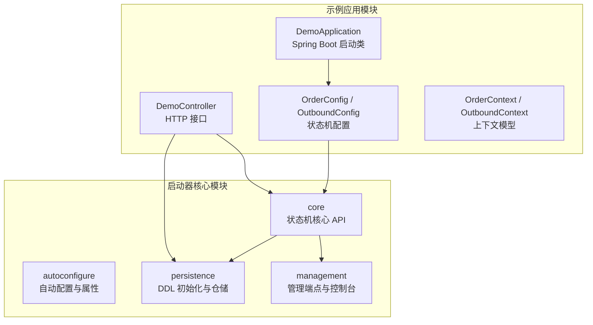
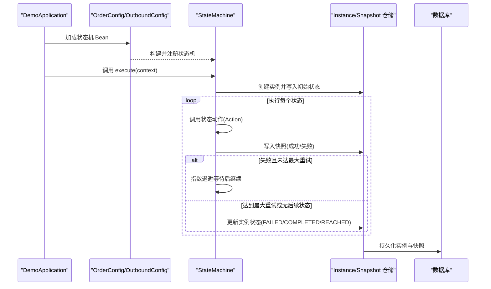
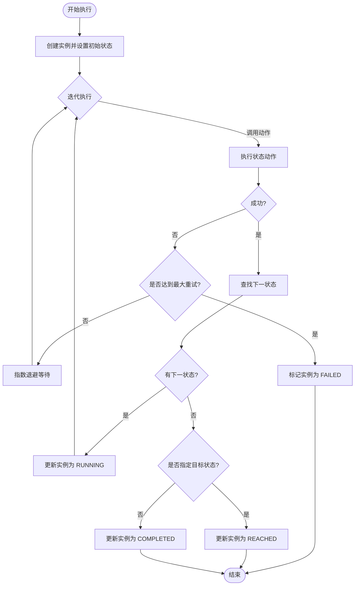
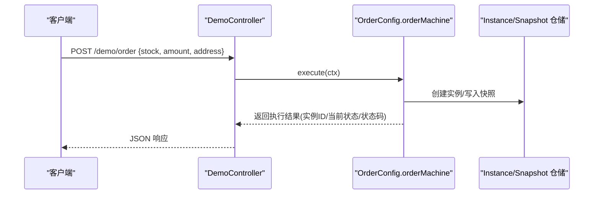
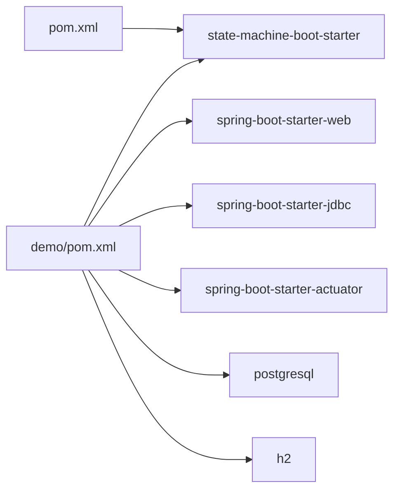

# 快速开始

<cite>
**本文引用的文件**
- [pom.xml](file://pom.xml)
- [demo/pom.xml](file://demo/pom.xml)
- [README.md](file://README.md)
- [src/main/resources/META-INF/spring/org.springframework.boot.autoconfigure.AutoConfiguration.imports](file://src/main/resources/META-INF/spring/org.springframework.boot.autoconfigure.AutoConfiguration.imports)
- [src/main/java/cn/chedejun/statemachine/autoconfigure/StateMachineAutoConfiguration.java](file://src/main/java/cn/chedejun/statemachine/autoconfigure/StateMachineAutoConfiguration.java)
- [src/main/java/cn/chedejun/statemachine/autoconfigure/StateMachineProperties.java](file://src/main/java/cn/chedejun/statemachine/autoconfigure/StateMachineProperties.java)
- [src/main/java/cn/chedejun/statemachine/core/StateMachine.java](file://src/main/java/cn/chedejun/statemachine/core/StateMachine.java)
- [src/main/java/cn/chedejun/statemachine/core/StateMachineBuilder.java](file://src/main/java/cn/chedejun/statemachine/core/StateMachineBuilder.java)
- [demo/src/main/java/cn/chedejun/demo/DemoApplication.java](file://demo/src/main/java/cn/chedejun/demo/DemoApplication.java)
- [demo/src/main/java/cn/chedejun/demo/config/OrderConfig.java](file://demo/src/main/java/cn/chedejun/demo/config/OrderConfig.java)
- [demo/src/main/java/cn/chedejun/demo/config/OutboundConfig.java](file://demo/src/main/java/cn/chedejun/demo/config/OutboundConfig.java)
- [demo/src/main/java/cn/chedejun/demo/controller/DemoController.java](file://demo/src/main/java/cn/chedejun/demo/controller/DemoController.java)
- [demo/src/main/java/cn/chedejun/demo/statemachine/OrderContext.java](file://demo/src/main/java/cn/chedejun/demo/statemachine/OrderContext.java)
- [demo/src/main/java/cn/chedejun/demo/statemachine/OutboundContext.java](file://demo/src/main/java/cn/chedejun/demo/statemachine/OutboundContext.java)
- [demo/src/main/resources/application.yml](file://demo/src/main/resources/application.yml)
</cite>

## 目录
1. [简介](#简介)
2. [项目结构](#项目结构)
3. [核心组件](#核心组件)
4. [架构总览](#架构总览)
5. [详细组件分析](#详细组件分析)
6. [依赖分析](#依赖分析)
7. [性能考虑](#性能考虑)
8. [故障排查指南](#故障排查指南)
9. [结论](#结论)
10. [附录](#附录)

## 简介
本指南面向希望快速上手“状态机启动器”的开发者，提供从 Maven 依赖配置、最小可运行示例到完整执行链路的端到端说明。你将学会：
- 如何在项目中引入状态机启动器依赖（含坐标与版本）
- 如何定义一个简单的状态机（状态、动作、转换、重试策略）
- 如何在 Spring Boot 中装配并执行状态机
- 开发环境要求（Java 17、Spring Boot 3.2.5）与 IDE 配置建议
- 常见问题与调试技巧

## 项目结构
该仓库包含两部分：
- 启动器核心模块：位于根目录，提供自动配置、核心 API、持久化与管理控制台能力
- 示例应用模块：位于 demo 目录，演示如何在业务工程中使用启动器

图表来源
- [demo/src/main/java/cn/chedejun/demo/DemoApplication.java:1-12](file://demo/src/main/java/cn/chedejun/demo/DemoApplication.java#L1-L12)
- [demo/src/main/java/cn/chedejun/demo/config/OrderConfig.java:1-85](file://demo/src/main/java/cn/chedejun/demo/config/OrderConfig.java#L1-L85)
- [demo/src/main/java/cn/chedejun/demo/config/OutboundConfig.java:1-121](file://demo/src/main/java/cn/chedejun/demo/config/OutboundConfig.java#L1-L121)
- [demo/src/main/java/cn/chedejun/demo/controller/DemoController.java:1-288](file://demo/src/main/java/cn/chedejun/demo/controller/DemoController.java#L1-L288)
- [src/main/java/cn/chedejun/statemachine/autoconfigure/StateMachineAutoConfiguration.java:1-80](file://src/main/java/cn/chedejun/statemachine/autoconfigure/StateMachineAutoConfiguration.java#L1-L80)
- [src/main/java/cn/chedejun/statemachine/core/StateMachine.java:1-196](file://src/main/java/cn/chedejun/statemachine/core/StateMachine.java#L1-L196)

章节来源
- [pom.xml:1-90](file://pom.xml#L1-L90)
- [demo/pom.xml:1-93](file://demo/pom.xml#L1-L93)

## 核心组件
- 自动配置与属性
  - 自动注册 DDL 初始化、定义仓储、状态机注册表、管理端点与控制台控制器
  - 属性前缀为 state-machine，支持 ddl-auto、重试策略、管理与控制台开关
- 状态机核心 API
  - StateMachineBuilder：以链式 API 定义状态、转换与重试策略
  - StateMachine：执行引擎，负责实例创建、状态推进、快照记录、重试与最终状态判定
- 示例应用
  - 订单流程与出库流程两个状态机，配套上下文对象与 HTTP 控制器

章节来源
- [src/main/java/cn/chedejun/statemachine/autoconfigure/StateMachineAutoConfiguration.java:1-80](file://src/main/java/cn/chedejun/statemachine/autoconfigure/StateMachineAutoConfiguration.java#L1-L80)
- [src/main/java/cn/chedejun/statemachine/autoconfigure/StateMachineProperties.java:1-35](file://src/main/java/cn/chedejun/statemachine/autoconfigure/StateMachineProperties.java#L1-L35)
- [src/main/java/cn/chedejun/statemachine/core/StateMachineBuilder.java:1-53](file://src/main/java/cn/chedejun/statemachine/core/StateMachineBuilder.java#L1-L53)
- [src/main/java/cn/chedejun/statemachine/core/StateMachine.java:1-196](file://src/main/java/cn/chedejun/statemachine/core/StateMachine.java#L1-L196)

## 架构总览
下图展示了从应用启动到状态机执行的关键交互：

图表来源
- [demo/src/main/java/cn/chedejun/demo/DemoApplication.java:1-12](file://demo/src/main/java/cn/chedejun/demo/DemoApplication.java#L1-L12)
- [demo/src/main/java/cn/chedejun/demo/config/OrderConfig.java:1-85](file://demo/src/main/java/cn/chedejun/demo/config/OrderConfig.java#L1-L85)
- [demo/src/main/java/cn/chedejun/demo/config/OutboundConfig.java:1-121](file://demo/src/main/java/cn/chedejun/demo/config/OutboundConfig.java#L1-L121)
- [src/main/java/cn/chedejun/statemachine/core/StateMachine.java:1-196](file://src/main/java/cn/chedejun/statemachine/core/StateMachine.java#L1-L196)

## 详细组件分析

### Maven 依赖与坐标
- 启动器坐标
  - groupId: cn.chedejun
  - artifactId: state-machine-boot-starter
  - version: 1.0.0-SNAPSHOT
- 在示例应用中，通过依赖该 starter 并引入 Web/JDBC/Actuator 等即可运行
- 依赖版本由 spring-boot-dependencies 统一管理，确保与 Spring Boot 3.2.5 兼容

章节来源
- [demo/pom.xml:34-40](file://demo/pom.xml#L34-L40)
- [demo/pom.xml:22-31](file://demo/pom.xml#L22-L31)
- [pom.xml:21-31](file://pom.xml#L21-L31)

### 自动配置与属性
- 自动配置入口
  - 通过 META-INF/spring 自动导入自动配置类
- 条件装配
  - 当存在 DataSource 时，初始化 DDL、定义仓储、注册表与 BeanPostProcessor
  - 当存在 Actuator 与 Web 时，按属性开关启用管理端点与控制台
- 属性说明
  - state-machine.ddl-auto：DDL 初始化策略（如 update）
  - state-machine.management.enabled：是否暴露管理端点
  - state-machine.console.enabled：是否启用控制台页面

章节来源
- [src/main/resources/META-INF/spring/org.springframework.boot.autoconfigure.AutoConfiguration.imports:1-2](file://src/main/resources/META-INF/spring/org.springframework.boot.autoconfigure.AutoConfiguration.imports#L1-L2)
- [src/main/java/cn/chedejun/statemachine/autoconfigure/StateMachineAutoConfiguration.java:22-80](file://src/main/java/cn/chedejun/statemachine/autoconfigure/StateMachineAutoConfiguration.java#L22-L80)
- [src/main/java/cn/chedejun/statemachine/autoconfigure/StateMachineProperties.java:1-35](file://src/main/java/cn/chedejun/statemachine/autoconfigure/StateMachineProperties.java#L1-L35)

### 状态机构建与执行
- 构建流程
  - 使用 StateMachineBuilder 定义状态名与动作、状态间转换与条件、重试策略
  - build() 生成 StateMachine 实例，并注册到注册表
- 执行流程
  - execute(context/startState/targetState) 创建实例、进入首状态、循环执行动作
  - 动作抛出异常则根据重试策略进行指数退避重试；达到最大次数则标记失败
  - 无后续状态或到达目标状态时更新实例状态（COMPLETED/REACHED）

图表来源
- [src/main/java/cn/chedejun/statemachine/core/StateMachine.java:83-136](file://src/main/java/cn/chedejun/statemachine/core/StateMachine.java#L83-L136)

章节来源
- [src/main/java/cn/chedejun/statemachine/core/StateMachineBuilder.java:1-53](file://src/main/java/cn/chedejun/statemachine/core/StateMachineBuilder.java#L1-L53)
- [src/main/java/cn/chedejun/statemachine/core/StateMachine.java:1-196](file://src/main/java/cn/chedejun/statemachine/core/StateMachine.java#L1-L196)

### 示例：订单状态机（Hello World）
- 定义上下文
  - OrderContext 包含订单标识、库存、金额、支付结果、收货地址等字段
- 定义状态机
  - 状态：检查库存、处理支付、发货、发送通知、缺货通知、订单失败
  - 转换：库存充足→支付；库存不足→缺货通知；支付成功→发货；支付失败→失败；发货→通知
  - 重试：指数退避，最多 3 次
- 执行与查询
  - DemoController 提供 /demo/order 与 /demo/orders 接口，触发执行并列出实例
  - 支持指定目标状态执行（REACHED 与 COMPLETED 的区分）

图表来源
- [demo/src/main/java/cn/chedejun/demo/controller/DemoController.java:38-72](file://demo/src/main/java/cn/chedejun/demo/controller/DemoController.java#L38-L72)
- [demo/src/main/java/cn/chedejun/demo/config/OrderConfig.java:18-46](file://demo/src/main/java/cn/chedejun/demo/config/OrderConfig.java#L18-L46)
- [demo/src/main/java/cn/chedejun/demo/statemachine/OrderContext.java:1-34](file://demo/src/main/java/cn/chedejun/demo/statemachine/OrderContext.java#L1-L34)

章节来源
- [demo/src/main/java/cn/chedejun/demo/config/OrderConfig.java:1-85](file://demo/src/main/java/cn/chedejun/demo/config/OrderConfig.java#L1-L85)
- [demo/src/main/java/cn/chedejun/demo/controller/DemoController.java:1-288](file://demo/src/main/java/cn/chedejun/demo/controller/DemoController.java#L1-L288)
- [demo/src/main/java/cn/chedejun/demo/statemachine/OrderContext.java:1-34](file://demo/src/main/java/cn/chedejun/demo/statemachine/OrderContext.java#L1-L34)

### 示例：出库状态机
- 状态：创建出库单、拣货、复核、打包、发货、完成、异常处理、重新拣货、退货入库
- 转换：正常流程与异常分支（拣货失败→异常处理；复核不通过→重新拣货；发货失败→退货入库）
- 执行与查询：与订单流程类似，通过 /demo/outbound 与 /demo/outbounds 接口操作

章节来源
- [demo/src/main/java/cn/chedejun/demo/config/OutboundConfig.java:1-121](file://demo/src/main/java/cn/chedejun/demo/config/OutboundConfig.java#L1-L121)
- [demo/src/main/java/cn/chedejun/demo/controller/DemoController.java:174-247](file://demo/src/main/java/cn/chedejun/demo/controller/DemoController.java#L174-L247)
- [demo/src/main/java/cn/chedejun/demo/statemachine/OutboundContext.java:1-43](file://demo/src/main/java/cn/chedejun/demo/statemachine/OutboundContext.java#L1-L43)

## 依赖分析
- 启动器模块
  - 依赖 Spring Boot Starter JDBC/Web/Actuator（可选），Jackson 用于序列化
- 示例应用模块
  - 引入启动器、Web、JDBC、Actuator、数据库驱动（PostgreSQL/H2）
  - 通过 spring-boot-maven-plugin 打包为可执行应用

图表来源
- [demo/pom.xml:34-70](file://demo/pom.xml#L34-L70)
- [pom.xml:33-67](file://pom.xml#L33-L67)

章节来源
- [demo/pom.xml:1-93](file://demo/pom.xml#L1-L93)
- [pom.xml:1-90](file://pom.xml#L1-L90)

## 性能考虑
- 指数退避重试
  - 通过重试策略限制失败状态的最大尝试次数与最大延迟，避免风暴效应
- 快照与实例持久化
  - 每次状态执行都会写入快照，便于追踪与重试；注意数据库写入开销
- 状态数量与转换复杂度
  - 状态与转换越多，执行循环次数越多；可通过目标状态执行减少不必要的推进

章节来源
- [src/main/java/cn/chedejun/statemachine/core/StateMachine.java:83-136](file://src/main/java/cn/chedejun/statemachine/core/StateMachine.java#L83-L136)
- [src/main/java/cn/chedejun/statemachine/autoconfigure/StateMachineProperties.java:18-31](file://src/main/java/cn/chedejun/statemachine/autoconfigure/StateMachineProperties.java#L18-L31)

## 故障排查指南
- 启动报错：DataSource 未找到
  - 现象：状态机未初始化，提示数据源未设置
  - 处理：确保引入 JDBC Starter 并正确配置数据源
- 执行失败：状态动作抛异常
  - 现象：实例状态变为 FAILED，快照记录错误信息
  - 处理：查看快照与实例详情接口，定位具体状态与异常堆栈
- 重试无效
  - 现象：重试后仍停留在失败状态
  - 处理：确认实例状态确为 FAILED；使用重置接口将状态改为 RUNNING 并清零重试计数
- 控制台不可用
  - 现象：无法访问管理端点或控制台页面
  - 处理：检查 state-machine.management.enabled 与 state-machine.console.enabled 是否开启，以及 Actuator 暴露配置

章节来源
- [src/main/java/cn/chedejun/statemachine/core/StateMachine.java:178-180](file://src/main/java/cn/chedejun/statemachine/core/StateMachine.java#L178-L180)
- [demo/src/main/java/cn/chedejun/demo/controller/DemoController.java:162-167](file://demo/src/main/java/cn/chedejun/demo/controller/DemoController.java#L162-L167)
- [demo/src/main/resources/application.yml:11-22](file://demo/src/main/resources/application.yml#L11-L22)

## 结论
通过本指南，你已经了解了如何在 Spring Boot 3.2.5（Java 17）环境中引入状态机启动器、定义并执行一个最小可用的状态机，并结合示例应用掌握从配置到执行再到监控的完整流程。建议在生产环境中结合数据库连接池、慢查询监控与告警策略，持续优化状态机的稳定性与可观测性。

## 附录

### 开发环境与 IDE 配置建议
- JDK：17
- Spring Boot：3.2.5
- IDE：IntelliJ IDEA（推荐启用 Lombok 插件与 Maven 视图）
- 运行方式：直接运行 DemoApplication.main，或使用 spring-boot-maven-plugin 打包后运行

章节来源
- [pom.xml:13-19](file://pom.xml#L13-L19)
- [demo/pom.xml:13-20](file://demo/pom.xml#L13-L20)
- [demo/src/main/java/cn/chedejun/demo/DemoApplication.java:1-12](file://demo/src/main/java/cn/chedejun/demo/DemoApplication.java#L1-L12)

### Hello World 示例（步骤清单）
- 步骤 1：添加启动器依赖
  - 坐标：cn.chedejun:state-machine-boot-starter:1.0.0-SNAPSHOT
- 步骤 2：定义上下文类（继承 Context）
  - 参考：[demo/src/main/java/cn/chedejun/demo/statemachine/OrderContext.java:1-34](file://demo/src/main/java/cn/chedejun/demo/statemachine/OrderContext.java#L1-L34)
- 步骤 3：在配置类中定义状态机
  - 参考：[demo/src/main/java/cn/chedejun/demo/config/OrderConfig.java:18-46](file://demo/src/main/java/cn/chedejun/demo/config/OrderConfig.java#L18-L46)
- 步骤 4：在控制器中注入并执行状态机
  - 参考：[demo/src/main/java/cn/chedejun/demo/controller/DemoController.java:26-33](file://demo/src/main/java/cn/chedejun/demo/controller/DemoController.java#L26-L33)
- 步骤 5：启动应用并调用接口
  - 参考：[demo/src/main/resources/application.yml:1-23](file://demo/src/main/resources/application.yml#L1-L23)

章节来源
- [demo/pom.xml:34-40](file://demo/pom.xml#L34-L40)
- [demo/src/main/java/cn/chedejun/demo/statemachine/OrderContext.java:1-34](file://demo/src/main/java/cn/chedejun/demo/statemachine/OrderContext.java#L1-L34)
- [demo/src/main/java/cn/chedejun/demo/config/OrderConfig.java:18-46](file://demo/src/main/java/cn/chedejun/demo/config/OrderConfig.java#L18-L46)
- [demo/src/main/java/cn/chedejun/demo/controller/DemoController.java:26-33](file://demo/src/main/java/cn/chedejun/demo/controller/DemoController.java#L26-L33)
- [demo/src/main/resources/application.yml:1-23](file://demo/src/main/resources/application.yml#L1-L23)