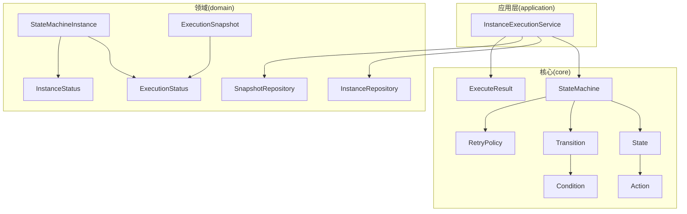
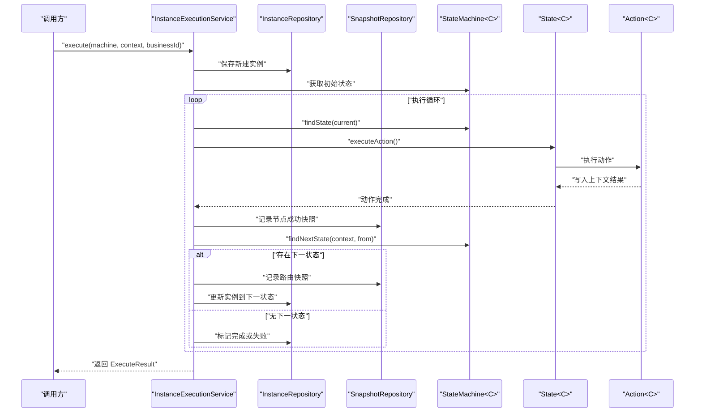
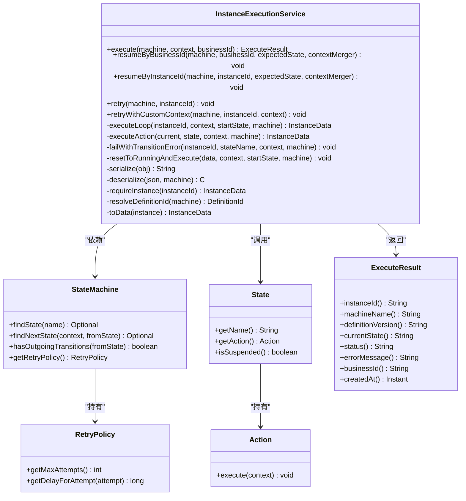
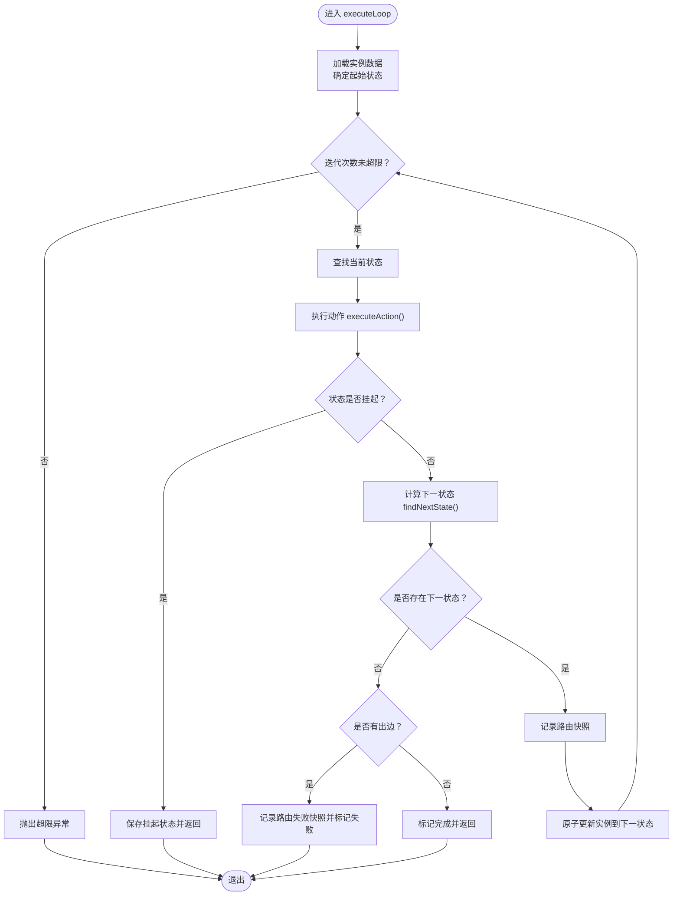
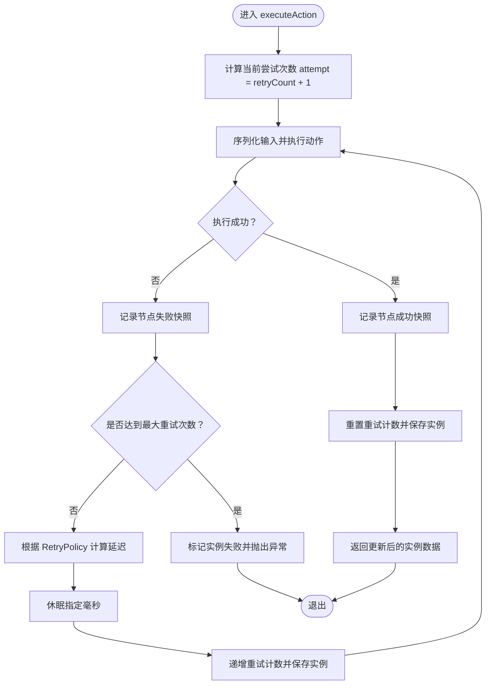
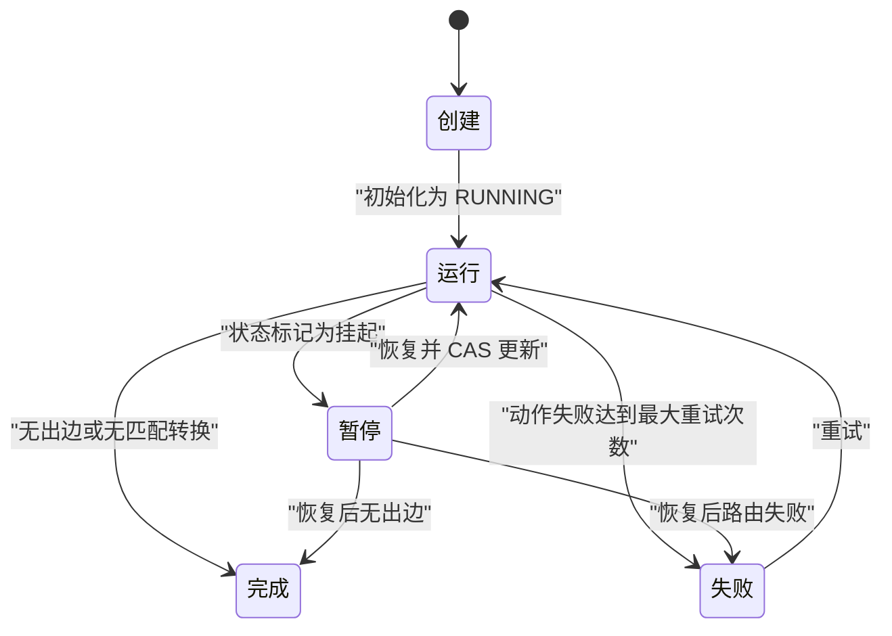
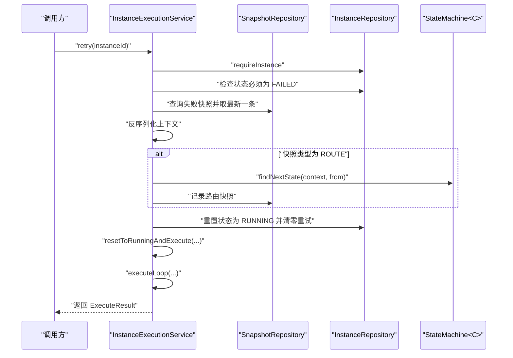
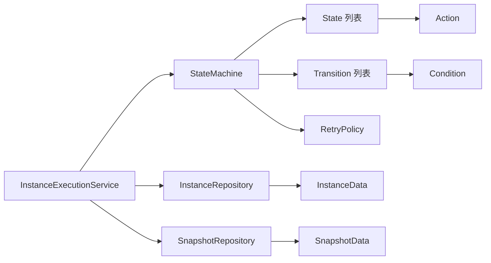

# 实例执行服务

<cite>
**本文引用的文件**
- [InstanceExecutionService.java](file://state-machine-boot-starter/src/main/java/cn/chedejun/statemachine/application/InstanceExecutionService.java)
- [ExecuteResult.java](file://state-machine-boot-starter/src/main/java/cn/chedejun/statemachine/core/ExecuteResult.java)
- [RetryPolicy.java](file://state-machine-boot-starter/src/main/java/cn/chedejun/statemachine/core/RetryPolicy.java)
- [StateMachine.java](file://state-machine-boot-starter/src/main/java/cn/chedejun/statemachine/domain/engine/StateMachine.java)
- [ExecutionSnapshot.java](file://state-machine-boot-starter/src/main/java/cn/chedejun/statemachine/domain/snapshot/ExecutionSnapshot.java)
- [StateMachineInstance.java](file://state-machine-boot-starter/src/main/java/cn/chedejun/statemachine/domain/instance/StateMachineInstance.java)
- [InstanceRepository.java](file://state-machine-boot-starter/src/main/java/cn/chedejun/statemachine/domain/repository/InstanceRepository.java)
- [SnapshotRepository.java](file://state-machine-boot-starter/src/main/java/cn/chedejun/statemachine/domain/repository/SnapshotRepository.java)
- [State.java](file://state-machine-boot-starter/src/main/java/cn/chedejun/statemachine/core/State.java)
- [Transition.java](file://state-machine-boot-starter/src/main/java/cn/chedejun/statemachine/core/Transition.java)
- [Action.java](file://state-machine-boot-starter/src/main/java/cn/chedejun/statemachine/core/Action.java)
- [Condition.java](file://state-machine-boot-starter/src/main/java/cn/chedejun/statemachine/core/Condition.java)
- [ExecutionStatus.java](file://state-machine-boot-starter/src/main/java/cn/chedejun/statemachine/domain/shared/ExecutionStatus.java)
- [InstanceStatus.java](file://state-machine-boot-starter/src/main/java/cn/chedejun/statemachine/domain/shared/InstanceStatus.java)
</cite>

## 目录
1. [简介](#简介)
2. [项目结构](#项目结构)
3. [核心组件](#核心组件)
4. [架构总览](#架构总览)
5. [详细组件分析](#详细组件分析)
6. [依赖分析](#依赖分析)
7. [性能考量](#性能考量)
8. [故障排查指南](#故障排查指南)
9. [结论](#结论)
10. [附录](#附录)

## 简介
本文件围绕实例执行服务展开，系统性阐述 InstanceExecutionService 的核心执行逻辑与生命周期管理，包括：
- 主执行入口 execute() 的创建与启动流程
- 执行循环 executeLoop() 的状态推进与路由决策
- 单状态动作执行 executeAction() 与重试机制
- 实例生命周期：创建、执行、暂停、恢复、完成与失败
- 重试策略：指数退避与最大重试次数控制
- 执行结果封装 ExecuteResult 的返回机制
- 关键执行流程图与状态转换图
- 性能优化与并发处理建议

## 项目结构
该模块采用分层与领域驱动设计结合的方式组织代码：
- application 层：对外暴露实例执行与恢复能力，协调仓库与引擎
- core 层：状态机模型、动作接口、条件接口、重试策略等核心抽象
- domain 层：领域对象（状态机、实例、快照）、仓储接口与事件
- infrastructure/persistence：数据库持久化实现（JDBC）
- interfaces/management：控制台与监控端点（可选）

图表来源
- [InstanceExecutionService.java:43-58](file://state-machine-boot-starter/src/main/java/cn/chedejun/statemachine/application/InstanceExecutionService.java#L43-L58)
- [StateMachine.java:19-77](file://state-machine-boot-starter/src/main/java/cn/chedejun/statemachine/domain/engine/StateMachine.java#L19-L77)
- [State.java:3-23](file://state-machine-boot-starter/src/main/java/cn/chedejun/statemachine/core/State.java#L3-L23)
- [Transition.java:3-20](file://state-machine-boot-starter/src/main/java/cn/chedejun/statemachine/core/Transition.java#L3-L20)
- [Action.java:8-12](file://state-machine-boot-starter/src/main/java/cn/chedejun/statemachine/core/Action.java#L8-L12)
- [Condition.java:3-7](file://state-machine-boot-starter/src/main/java/cn/chedejun/statemachine/core/Condition.java#L3-L7)
- [RetryPolicy.java:5-45](file://state-machine-boot-starter/src/main/java/cn/chedejun/statemachine/core/RetryPolicy.java#L5-L45)
- [ExecuteResult.java:16-58](file://state-machine-boot-starter/src/main/java/cn/chedejun/statemachine/core/ExecuteResult.java#L16-L58)
- [StateMachineInstance.java:9-81](file://state-machine-boot-starter/src/main/java/cn/chedejun/statemachine/domain/instance/StateMachineInstance.java#L9-L81)
- [ExecutionSnapshot.java:11-73](file://state-machine-boot-starter/src/main/java/cn/chedejun/statemachine/domain/snapshot/ExecutionSnapshot.java#L11-L73)
- [InstanceRepository.java:9-26](file://state-machine-boot-starter/src/main/java/cn/chedejun/statemachine/domain/repository/InstanceRepository.java#L9-L26)
- [SnapshotRepository.java:11-16](file://state-machine-boot-starter/src/main/java/cn/chedejun/statemachine/domain/repository/SnapshotRepository.java#L11-L16)
- [ExecutionStatus.java:1-3](file://state-machine-boot-starter/src/main/java/cn/chedejun/statemachine/domain/shared/ExecutionStatus.java#L1-L3)
- [InstanceStatus.java:1-3](file://state-machine-boot-starter/src/main/java/cn/chedejun/statemachine/domain/shared/InstanceStatus.java#L1-L3)

章节来源
- [InstanceExecutionService.java:43-58](file://state-machine-boot-starter/src/main/java/cn/chedejun/statemachine/application/InstanceExecutionService.java#L43-L58)
- [StateMachine.java:19-77](file://state-machine-boot-starter/src/main/java/cn/chedejun/statemachine/domain/engine/StateMachine.java#L19-L77)

## 核心组件
- 实例执行服务：负责创建实例、驱动执行循环、处理重试与异常、封装执行结果
- 状态机引擎：承载状态、转换规则、重试策略与上下文类型
- 状态与动作：每个状态绑定一个动作接口，执行业务逻辑并通过上下文传递结果
- 条件与转换：根据上下文决定从某状态到另一状态的路由
- 重试策略：指数退避、最大尝试次数、最大延迟限制
- 快照与实例：记录节点执行与路由决策，维护实例状态与重试计数
- 结果封装：统一输出执行结果，包含实例ID、机器名称、版本、当前状态、状态码、错误信息、业务ID与创建时间

章节来源
- [InstanceExecutionService.java:25-41](file://state-machine-boot-starter/src/main/java/cn/chedejun/statemachine/application/InstanceExecutionService.java#L25-L41)
- [ExecuteResult.java:16-58](file://state-machine-boot-starter/src/main/java/cn/chedejun/statemachine/core/ExecuteResult.java#L16-L58)
- [RetryPolicy.java:5-45](file://state-machine-boot-starter/src/main/java/cn/chedejun/statemachine/core/RetryPolicy.java#L5-L45)
- [StateMachine.java:19-77](file://state-machine-boot-starter/src/main/java/cn/chedejun/statemachine/domain/engine/StateMachine.java#L19-L77)
- [State.java:3-23](file://state-machine-boot-starter/src/main/java/cn/chedejun/statemachine/core/State.java#L3-L23)
- [Transition.java:3-20](file://state-machine-boot-starter/src/main/java/cn/chedejun/statemachine/core/Transition.java#L3-L20)
- [ExecutionSnapshot.java:11-73](file://state-machine-boot-starter/src/main/java/cn/chedejun/statemachine/domain/snapshot/ExecutionSnapshot.java#L11-L73)
- [StateMachineInstance.java:9-81](file://state-machine-boot-starter/src/main/java/cn/chedejun/statemachine/domain/instance/StateMachineInstance.java#L9-L81)

## 架构总览
下图展示实例执行服务在系统中的角色与交互：

图表来源
- [InstanceExecutionService.java:43-58](file://state-machine-boot-starter/src/main/java/cn/chedejun/statemachine/application/InstanceExecutionService.java#L43-L58)
- [InstanceExecutionService.java:158-193](file://state-machine-boot-starter/src/main/java/cn/chedejun/statemachine/application/InstanceExecutionService.java#L158-L193)
- [InstanceExecutionService.java:200-237](file://state-machine-boot-starter/src/main/java/cn/chedejun/statemachine/application/InstanceExecutionService.java#L200-L237)
- [StateMachine.java:50-71](file://state-machine-boot-starter/src/main/java/cn/chedejun/statemachine/domain/engine/StateMachine.java#L50-L71)
- [State.java:19-21](file://state-machine-boot-starter/src/main/java/cn/chedejun/statemachine/core/State.java#L19-L21)
- [Action.java:10](file://state-machine-boot-starter/src/main/java/cn/chedejun/statemachine/core/Action.java#L10)

## 详细组件分析

### 实例执行服务类图

图表来源
- [InstanceExecutionService.java:25-296](file://state-machine-boot-starter/src/main/java/cn/chedejun/statemachine/application/InstanceExecutionService.java#L25-L296)
- [StateMachine.java:19-77](file://state-machine-boot-starter/src/main/java/cn/chedejun/statemachine/domain/engine/StateMachine.java#L19-L77)
- [State.java:3-23](file://state-machine-boot-starter/src/main/java/cn/chedejun/statemachine/core/State.java#L3-L23)
- [Action.java:8-12](file://state-machine-boot-starter/src/main/java/cn/chedejun/statemachine/core/Action.java#L8-L12)
- [RetryPolicy.java:5-45](file://state-machine-boot-starter/src/main/java/cn/chedejun/statemachine/core/RetryPolicy.java#L5-L45)
- [ExecuteResult.java:16-58](file://state-machine-boot-starter/src/main/java/cn/chedejun/statemachine/core/ExecuteResult.java#L16-L58)

章节来源
- [InstanceExecutionService.java:25-296](file://state-machine-boot-starter/src/main/java/cn/chedejun/statemachine/application/InstanceExecutionService.java#L25-L296)

### 主执行方法 execute()
- 创建实例ID与定义ID解析
- 构造 StateMachineInstance 并保存至实例仓库
- 获取初始状态并进入执行循环
- 循环结束后封装 ExecuteResult 返回

章节来源
- [InstanceExecutionService.java:43-58](file://state-machine-boot-starter/src/main/java/cn/chedejun/statemachine/application/InstanceExecutionService.java#L43-L58)
- [InstanceExecutionService.java:282-294](file://state-machine-boot-starter/src/main/java/cn/chedejun/statemachine/application/InstanceExecutionService.java#L282-L294)

### 执行循环 executeLoop()
- 读取当前实例数据，设置最大迭代上限
- 查找当前状态并执行动作
- 若状态标记为挂起则立即保存并返回挂起状态
- 计算下一状态：若无匹配转换且存在出边，则记录路由失败并标记失败；否则标记完成
- 记录路由快照并原子更新实例到下一状态

图表来源
- [InstanceExecutionService.java:158-193](file://state-machine-boot-starter/src/main/java/cn/chedejun/statemachine/application/InstanceExecutionService.java#L158-L193)
- [StateMachine.java:63-71](file://state-machine-boot-starter/src/main/java/cn/chedejun/statemachine/domain/engine/StateMachine.java#L63-L71)

章节来源
- [InstanceExecutionService.java:158-193](file://state-machine-boot-starter/src/main/java/cn/chedejun/statemachine/application/InstanceExecutionService.java#L158-L193)

### 单状态动作执行 executeAction()
- 序列化输入上下文，尝试执行状态动作
- 成功：记录节点成功快照，重置重试计数并返回
- 失败：记录节点失败快照，基于重试策略计算延迟，休眠后递增重试计数并重试
- 达到最大重试次数：标记实例失败并抛出异常

图表来源
- [InstanceExecutionService.java:200-237](file://state-machine-boot-starter/src/main/java/cn/chedejun/statemachine/application/InstanceExecutionService.java#L200-L237)
- [RetryPolicy.java:26-30](file://state-machine-boot-starter/src/main/java/cn/chedejun/statemachine/core/RetryPolicy.java#L26-L30)

章节来源
- [InstanceExecutionService.java:200-237](file://state-machine-boot-starter/src/main/java/cn/chedejun/statemachine/application/InstanceExecutionService.java#L200-L237)
- [RetryPolicy.java:26-30](file://state-machine-boot-starter/src/main/java/cn/chedejun/statemachine/core/RetryPolicy.java#L26-L30)

### 状态转换算法
- 从当前状态出发，遍历所有转换，按条件过滤
- 返回第一个满足条件的目标状态作为下一状态
- 若无满足条件的转换但存在出边，记录路由失败并标记失败
- 若无出边，标记完成

章节来源
- [StateMachine.java:63-71](file://state-machine-boot-starter/src/main/java/cn/chedejun/statemachine/domain/engine/StateMachine.java#L63-L71)
- [InstanceExecutionService.java:178-184](file://state-machine-boot-starter/src/main/java/cn/chedejun/statemachine/application/InstanceExecutionService.java#L178-L184)

### 实例生命周期管理
- 创建：生成实例ID，初始化状态为 RUNNING，保存实例
- 执行：进入 executeLoop，按状态推进
- 暂停：状态标记为挂起，保存实例并返回
- 恢复：校验期望状态，合并上下文，CAS 原子更新状态为 RUNNING 并继续执行
- 完成：无出边或路由决策无匹配转换时标记完成
- 失败：状态动作失败达到最大重试次数或路由决策失败时标记失败

图表来源
- [StateMachineInstance.java:46-74](file://state-machine-boot-starter/src/main/java/cn/chedejun/statemachine/domain/instance/StateMachineInstance.java#L46-L74)
- [InstanceExecutionService.java:174-176](file://state-machine-boot-starter/src/main/java/cn/chedejun/statemachine/application/InstanceExecutionService.java#L174-L176)
- [InstanceExecutionService.java:183-184](file://state-machine-boot-starter/src/main/java/cn/chedejun/statemachine/application/InstanceExecutionService.java#L183-L184)
- [InstanceExecutionService.java:232-235](file://state-machine-boot-starter/src/main/java/cn/chedejun/statemachine/application/InstanceExecutionService.java#L232-L235)

章节来源
- [StateMachineInstance.java:19-79](file://state-machine-boot-starter/src/main/java/cn/chedejun/statemachine/domain/instance/StateMachineInstance.java#L19-L79)
- [InstanceExecutionService.java:119-152](file://state-machine-boot-starter/src/main/java/cn/chedejun/statemachine/application/InstanceExecutionService.java#L119-L152)

### 重试机制实现
- 指数退避：delay = initialDelay * backoffFactor^(attempt-1)，不超过 maxDelay
- 最大重试次数：由 RetryPolicy 控制
- 重试计数：在实例数据中维护 retryCount 字段，每次重试递增
- 延迟执行：线程休眠对应毫秒数，支持中断

章节来源
- [RetryPolicy.java:26-30](file://state-machine-boot-starter/src/main/java/cn/chedejun/statemachine/core/RetryPolicy.java#L26-L30)
- [InstanceExecutionService.java:222-228](file://state-machine-boot-starter/src/main/java/cn/chedejun/statemachine/application/InstanceExecutionService.java#L222-L228)
- [InstanceExecutionService.java:232-235](file://state-machine-boot-starter/src/main/java/cn/chedejun/statemachine/application/InstanceExecutionService.java#L232-L235)

### 执行结果封装与返回
- ExecuteResult 封装实例ID、机器名称、版本、当前状态、状态码、错误信息、业务ID与创建时间
- execute() 在执行循环结束后构建并返回 ExecuteResult

章节来源
- [ExecuteResult.java:16-58](file://state-machine-boot-starter/src/main/java/cn/chedejun/statemachine/core/ExecuteResult.java#L16-L58)
- [InstanceExecutionService.java:54-57](file://state-machine-boot-starter/src/main/java/cn/chedejun/statemachine/application/InstanceExecutionService.java#L54-L57)

### 恢复与重试流程
- 恢复：resumeByBusinessId/resumeByInstanceId 校验期望状态，合并上下文，CAS 原子更新状态为 RUNNING 后继续执行
- 重试：retry 从最新失败快照反序列化上下文，若为路由类型则选择下一状态，否则从当前状态重试；retryWithCustomContext 支持自定义上下文重试

图表来源
- [InstanceExecutionService.java:79-114](file://state-machine-boot-starter/src/main/java/cn/chedejun/statemachine/application/InstanceExecutionService.java#L79-L114)
- [InstanceExecutionService.java:262-266](file://state-machine-boot-starter/src/main/java/cn/chedejun/statemachine/application/InstanceExecutionService.java#L262-L266)

章节来源
- [InstanceExecutionService.java:79-114](file://state-machine-boot-starter/src/main/java/cn/chedejun/statemachine/application/InstanceExecutionService.java#L79-L114)
- [InstanceExecutionService.java:262-266](file://state-machine-boot-starter/src/main/java/cn/chedejun/statemachine/application/InstanceExecutionService.java#L262-L266)

## 依赖分析
- InstanceExecutionService 依赖 StateMachine、State、Action、RetryPolicy、InstanceRepository、SnapshotRepository
- StateMachine 持有状态列表、转换列表与重试策略，并提供状态查找与下一状态计算
- State 持有动作与挂起标志
- 快照与实例分别记录执行结果与实例状态，二者共同保证可观测性与可恢复性

图表来源
- [InstanceExecutionService.java:30-41](file://state-machine-boot-starter/src/main/java/cn/chedejun/statemachine/application/InstanceExecutionService.java#L30-L41)
- [StateMachine.java:23-47](file://state-machine-boot-starter/src/main/java/cn/chedejun/statemachine/domain/engine/StateMachine.java#L23-L47)
- [State.java:19-21](file://state-machine-boot-starter/src/main/java/cn/chedejun/statemachine/core/State.java#L19-L21)
- [Transition.java:16-18](file://state-machine-boot-starter/src/main/java/cn/chedejun/statemachine/core/Transition.java#L16-L18)
- [InstanceRepository.java:9-26](file://state-machine-boot-starter/src/main/java/cn/chedejun/statemachine/domain/repository/InstanceRepository.java#L9-L26)
- [SnapshotRepository.java:11-16](file://state-machine-boot-starter/src/main/java/cn/chedejun/statemachine/domain/repository/SnapshotRepository.java#L11-L16)

章节来源
- [InstanceExecutionService.java:30-41](file://state-machine-boot-starter/src/main/java/cn/chedejun/statemachine/application/InstanceExecutionService.java#L30-L41)
- [StateMachine.java:23-47](file://state-machine-boot-starter/src/main/java/cn/chedejun/statemachine/domain/engine/StateMachine.java#L23-L47)

## 性能考量
- 循环上限：通过 states.size() 与重试策略推导最大迭代次数，防止无限循环
- N+1 问题规避：重试尝试次数直接从实例数据推导，避免重复查询快照统计
- 原子更新：恢复时使用 CAS 原子更新实例状态，避免竞态
- 序列化开销：上下文序列化/反序列化为 IO 密集操作，建议控制上下文大小与复杂度
- 线程休眠：指数退避期间线程休眠，注意中断处理与线程池隔离
- 数据库写入：节点与路由快照写入频繁，建议索引优化与批量写入策略（如适用）

章节来源
- [InstanceExecutionService.java:161-161](file://state-machine-boot-starter/src/main/java/cn/chedejun/statemachine/application/InstanceExecutionService.java#L161-L161)
- [InstanceExecutionService.java:205-207](file://state-machine-boot-starter/src/main/java/cn/chedejun/statemachine/application/InstanceExecutionService.java#L205-L207)
- [InstanceExecutionService.java:139-142](file://state-machine-boot-starter/src/main/java/cn/chedejun/statemachine/application/InstanceExecutionService.java#L139-L142)

## 故障排查指南
- 状态不存在：executeLoop 中若状态缺失，会标记失败并抛出异常
- 路由失败：findNextState 无匹配转换且存在出边时，记录路由失败快照并标记失败
- 恢复状态不一致：resume 校验期望状态与实际状态，不一致则抛出异常
- 重试中断：线程休眠被中断时抛出异常，需上层处理
- 上下文反序列化失败：deserialize 对空/非法 JSON 提供兜底，失败时抛出异常

章节来源
- [InstanceExecutionService.java:167-170](file://state-machine-boot-starter/src/main/java/cn/chedejun/statemachine/application/InstanceExecutionService.java#L167-L170)
- [InstanceExecutionService.java:180-184](file://state-machine-boot-starter/src/main/java/cn/chedejun/statemachine/application/InstanceExecutionService.java#L180-L184)
- [InstanceExecutionService.java:121-123](file://state-machine-boot-starter/src/main/java/cn/chedejun/statemachine/application/InstanceExecutionService.java#L121-L123)
- [InstanceExecutionService.java:224-227](file://state-machine-boot-starter/src/main/java/cn/chedejun/statemachine/application/InstanceExecutionService.java#L224-L227)
- [InstanceExecutionService.java:255-260](file://state-machine-boot-starter/src/main/java/cn/chedejun/statemachine/application/InstanceExecutionService.java#L255-L260)

## 结论
InstanceExecutionService 以清晰的状态机模型为核心，通过执行循环与动作执行实现稳健的实例生命周期管理。其重试机制采用指数退避与最大尝试次数控制，结合快照记录与原子更新，确保可观测性与一致性。配合 ExecuteResult 的统一返回，便于上层系统集成与监控。

## 附录
- 关键接口与职责
  - StateMachine：状态与转换定义、重试策略访问
  - State：状态名、动作与挂起标志
  - Action：状态动作执行接口
  - RetryPolicy：指数退避与最大重试次数
  - ExecuteResult：执行结果封装
  - InstanceRepository/SnapshotRepository：实例与快照持久化

章节来源
- [StateMachine.java:19-77](file://state-machine-boot-starter/src/main/java/cn/chedejun/statemachine/domain/engine/StateMachine.java#L19-L77)
- [State.java:3-23](file://state-machine-boot-starter/src/main/java/cn/chedejun/statemachine/core/State.java#L3-L23)
- [Action.java:8-12](file://state-machine-boot-starter/src/main/java/cn/chedejun/statemachine/core/Action.java#L8-L12)
- [RetryPolicy.java:5-45](file://state-machine-boot-starter/src/main/java/cn/chedejun/statemachine/core/RetryPolicy.java#L5-L45)
- [ExecuteResult.java:16-58](file://state-machine-boot-starter/src/main/java/cn/chedejun/statemachine/core/ExecuteResult.java#L16-L58)
- [InstanceRepository.java:9-26](file://state-machine-boot-starter/src/main/java/cn/chedejun/statemachine/domain/repository/InstanceRepository.java#L9-L26)
- [SnapshotRepository.java:11-16](file://state-machine-boot-starter/src/main/java/cn/chedejun/statemachine/domain/repository/SnapshotRepository.java#L11-L16)