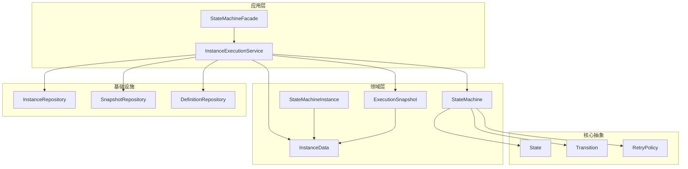
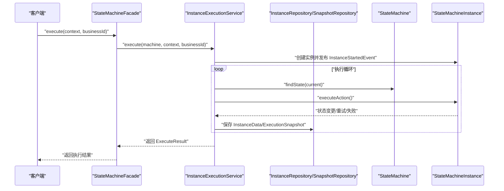
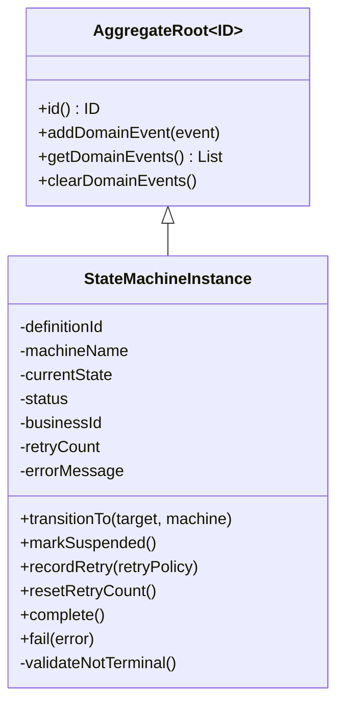
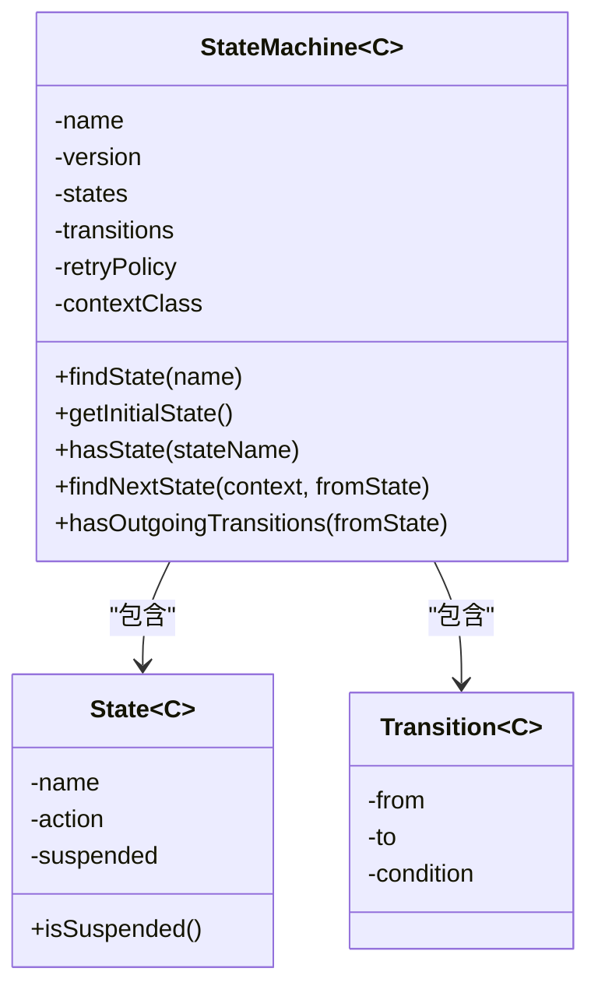
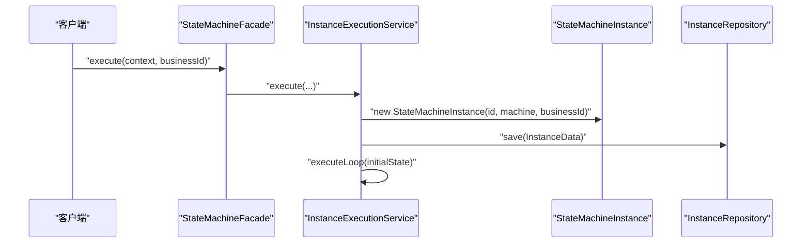
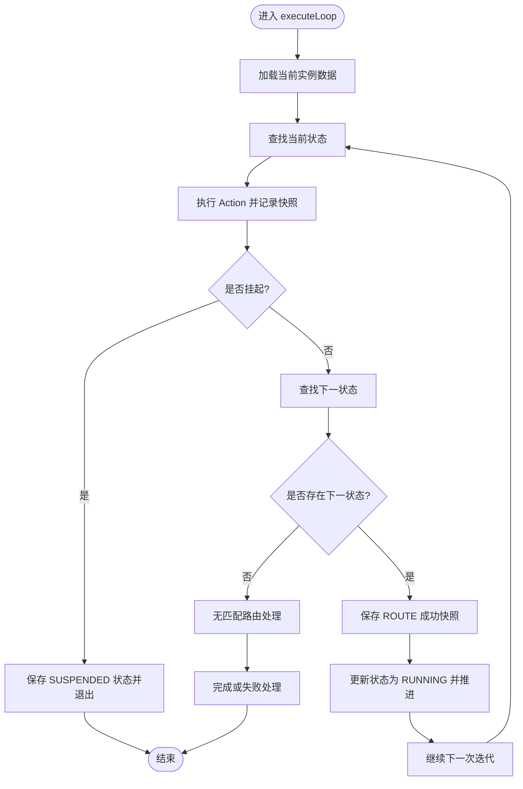
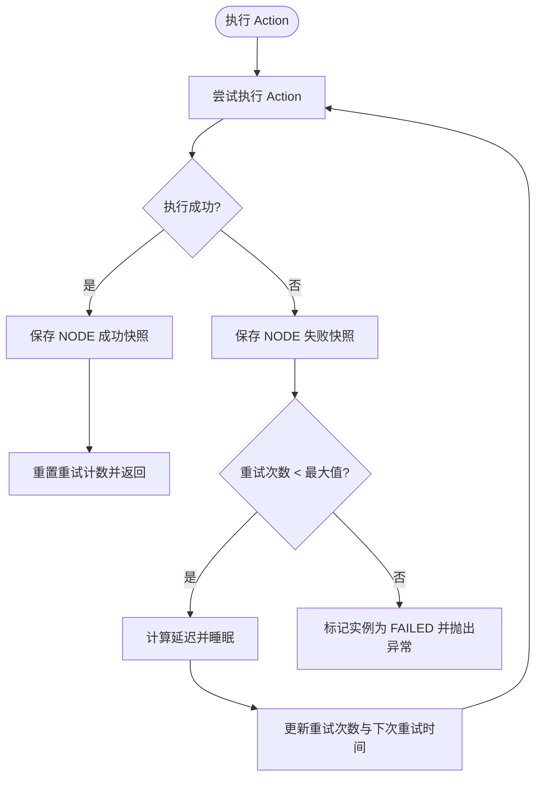
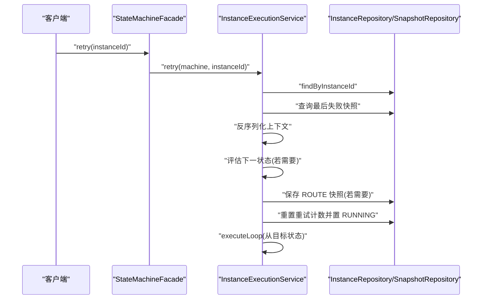
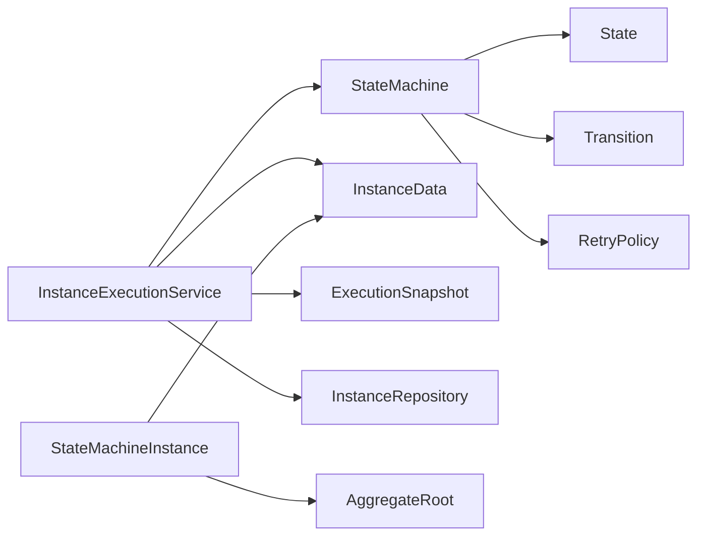
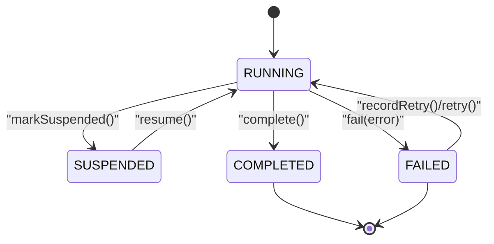

# 实例生命周期管理

<cite>
**本文引用的文件**
- [StateMachineInstance.java](file://state-machine-boot-starter/src/main/java/cn/chedejun/statemachine/domain/instance/StateMachineInstance.java)
- [InstanceStatus.java](file://state-machine-boot-starter/src/main/java/cn/chedejun/statemachine/domain/shared/InstanceStatus.java)
- [StateMachine.java](file://state-machine-boot-starter/src/main/java/cn/chedejun/statemachine/domain/engine/StateMachine.java)
- [InstanceExecutionService.java](file://state-machine-boot-starter/src/main/java/cn/chedejun/statemachine/application/InstanceExecutionService.java)
- [AggregateRoot.java](file://state-machine-boot-starter/src/main/java/cn/chedejun/statemachine/domain/shared/AggregateRoot.java)
- [InstanceRepository.java](file://state-machine-boot-starter/src/main/java/cn/chedejun/statemachine/domain/repository/InstanceRepository.java)
- [InstanceData.java](file://state-machine-boot-starter/src/main/java/cn/chedejun/statemachine/domain/data/InstanceData.java)
- [State.java](file://state-machine-boot-starter/src/main/java/cn/chedejun/statemachine/core/State.java)
- [Transition.java](file://state-machine-boot-starter/src/main/java/cn/chedejun/statemachine/core/Transition.java)
- [RetryPolicy.java](file://state-machine-boot-starter/src/main/java/cn/chedejun/statemachine/core/RetryPolicy.java)
- [ExecutionSnapshot.java](file://state-machine-boot-starter/src/main/java/cn/chedejun/statemachine/domain/snapshot/ExecutionSnapshot.java)
- [InstanceStartedEvent.java](file://state-machine-boot-starter/src/main/java/cn/chedejun/statemachine/domain/event/InstanceStartedEvent.java)
- [InstanceCompletedEvent.java](file://state-machine-boot-starter/src/main/java/cn/chedejun/statemachine/domain/event/InstanceCompletedEvent.java)
- [InstanceFailedEvent.java](file://state-machine-boot-starter/src/main/java/cn/chedejun/statemachine/domain/event/InstanceFailedEvent.java)
- [InstanceSuspendedEvent.java](file://state-machine-boot-starter/src/main/java/cn/chedejun/statemachine/domain/event/InstanceSuspendedEvent.java)
- [StateMachineFacade.java](file://state-machine-boot-starter/src/main/java/cn/chedejun/statemachine/interfaces/StateMachineFacade.java)
- [StateMachineInstanceTest.java](file://state-machine-boot-starter/src/test/java/cn/chedejun/statemachine/domain/instance/StateMachineInstanceTest.java)
</cite>

## 目录
1. [引言](#引言)
2. [项目结构](#项目结构)
3. [核心组件](#核心组件)
4. [架构总览](#架构总览)
5. [详细组件分析](#详细组件分析)
6. [依赖分析](#依赖分析)
7. [性能考虑](#性能考虑)
8. [故障排查指南](#故障排查指南)
9. [结论](#结论)
10. [附录](#附录)

## 引言
本文件围绕状态机实例生命周期管理进行系统性梳理，重点解释 StateMachineInstance 聚合根的设计与状态管理机制，覆盖实例创建、初始化、状态转换、重试与错误记录等关键流程；并基于代码实现绘制状态机图与状态转换图，给出监控与调试方法及状态不一致时的恢复策略。

## 项目结构
本项目采用分层与领域驱动设计（DDD）结合的方式组织代码：
- domain 层：定义领域模型与事件，如 StateMachineInstance、InstanceData、ExecutionSnapshot、DomainEvent 等
- application 层：应用服务 InstanceExecutionService，编排状态机执行、重试与恢复
- core 层：状态机核心抽象 State、Transition、RetryPolicy、Context 等
- interfaces 层：对外门面 StateMachineFacade，提供兼容的执行/重试/恢复入口
- repository 层：InstanceRepository、SnapshotRepository、DefinitionRepository 等接口
- management 层：控制台与端点（用于监控与调试）

图表来源
- [StateMachineFacade.java:16-51](file://state-machine-boot-starter/src/main/java/cn/chedejun/statemachine/interfaces/StateMachineFacade.java#L16-L51)
- [InstanceExecutionService.java:25-41](file://state-machine-boot-starter/src/main/java/cn/chedejun/statemachine/application/InstanceExecutionService.java#L25-L41)
- [StateMachineInstance.java:9-80](file://state-machine-boot-starter/src/main/java/cn/chedejun/statemachine/domain/instance/StateMachineInstance.java#L9-L80)
- [StateMachine.java:19-76](file://state-machine-boot-starter/src/main/java/cn/chedejun/statemachine/domain/engine/StateMachine.java#L19-L76)
- [InstanceData.java:8-78](file://state-machine-boot-starter/src/main/java/cn/chedejun/statemachine/domain/data/InstanceData.java#L8-L78)
- [ExecutionSnapshot.java:11-72](file://state-machine-boot-starter/src/main/java/cn/chedejun/statemachine/domain/snapshot/ExecutionSnapshot.java#L11-L72)
- [InstanceRepository.java:9-25](file://state-machine-boot-starter/src/main/java/cn/chedejun/statemachine/domain/repository/InstanceRepository.java#L9-L25)
- [State.java:3-22](file://state-machine-boot-starter/src/main/java/cn/chedejun/statemachine/core/State.java#L3-L22)
- [Transition.java:3-19](file://state-machine-boot-starter/src/main/java/cn/chedejun/statemachine/core/Transition.java#L3-L19)
- [RetryPolicy.java:5-44](file://state-machine-boot-starter/src/main/java/cn/chedejun/statemachine/core/RetryPolicy.java#L5-L44)

章节来源
- [StateMachineFacade.java:16-51](file://state-machine-boot-starter/src/main/java/cn/chedejun/statemachine/interfaces/StateMachineFacade.java#L16-L51)
- [InstanceExecutionService.java:25-41](file://state-machine-boot-starter/src/main/java/cn/chedejun/statemachine/application/InstanceExecutionService.java#L25-L41)
- [StateMachineInstance.java:9-80](file://state-machine-boot-starter/src/main/java/cn/chedejun/statemachine/domain/instance/StateMachineInstance.java#L9-L80)
- [StateMachine.java:19-76](file://state-machine-boot-starter/src/main/java/cn/chedejun/statemachine/domain/engine/StateMachine.java#L19-L76)
- [InstanceData.java:8-78](file://state-machine-boot-starter/src/main/java/cn/chedejun/statemachine/domain/data/InstanceData.java#L8-L78)
- [ExecutionSnapshot.java:11-72](file://state-machine-boot-starter/src/main/java/cn/chedejun/statemachine/domain/snapshot/ExecutionSnapshot.java#L11-L72)
- [InstanceRepository.java:9-25](file://state-machine-boot-starter/src/main/java/cn/chedejun/statemachine/domain/repository/InstanceRepository.java#L9-L25)
- [State.java:3-22](file://state-machine-boot-starter/src/main/java/cn/chedejun/statemachine/core/State.java#L3-L22)
- [Transition.java:3-19](file://state-machine-boot-starter/src/main/java/cn/chedejun/statemachine/core/Transition.java#L3-L19)
- [RetryPolicy.java:5-44](file://state-machine-boot-starter/src/main/java/cn/chedejun/statemachine/core/RetryPolicy.java#L5-L44)

## 核心组件
- StateMachineInstance：实例聚合根，维护当前状态、运行状态、重试次数与错误信息，并在关键事件发生时发布领域事件
- InstanceExecutionService：应用服务，负责实例创建、执行循环、状态转换、重试与恢复
- StateMachine：不可变的状态机定义，包含状态集合、转换规则与重试策略
- InstanceData：持久化载体，封装实例的持久化字段与原子更新方法
- ExecutionSnapshot：执行快照聚合根，记录节点执行与路由决策结果
- 事件模型：InstanceStartedEvent、InstanceCompletedEvent、InstanceFailedEvent、InstanceSuspendedEvent

章节来源
- [StateMachineInstance.java:9-80](file://state-machine-boot-starter/src/main/java/cn/chedejun/statemachine/domain/instance/StateMachineInstance.java#L9-L80)
- [InstanceExecutionService.java:25-295](file://state-machine-boot-starter/src/main/java/cn/chedejun/statemachine/application/InstanceExecutionService.java#L25-L295)
- [StateMachine.java:19-76](file://state-machine-boot-starter/src/main/java/cn/chedejun/statemachine/domain/engine/StateMachine.java#L19-L76)
- [InstanceData.java:8-78](file://state-machine-boot-starter/src/main/java/cn/chedejun/statemachine/domain/data/InstanceData.java#L8-L78)
- [ExecutionSnapshot.java:11-72](file://state-machine-boot-starter/src/main/java/cn/chedejun/statemachine/domain/snapshot/ExecutionSnapshot.java#L11-L72)
- [InstanceStartedEvent.java:8-24](file://state-machine-boot-starter/src/main/java/cn/chedejun/statemachine/domain/event/InstanceStartedEvent.java#L8-L24)
- [InstanceCompletedEvent.java:8-24](file://state-machine-boot-starter/src/main/java/cn/chedejun/statemachine/domain/event/InstanceCompletedEvent.java#L8-L24)
- [InstanceFailedEvent.java:8-27](file://state-machine-boot-starter/src/main/java/cn/chedejun/statemachine/domain/event/InstanceFailedEvent.java#L8-L27)
- [InstanceSuspendedEvent.java:8-24](file://state-machine-boot-starter/src/main/java/cn/chedejun/statemachine/domain/event/InstanceSuspendedEvent.java#L8-L24)

## 架构总览
下图展示从门面到应用服务、再到领域模型与基础设施的调用链路与职责边界：

图表来源
- [StateMachineFacade.java:26-28](file://state-machine-boot-starter/src/main/java/cn/chedejun/statemachine/interfaces/StateMachineFacade.java#L26-L28)
- [InstanceExecutionService.java:43-58](file://state-machine-boot-starter/src/main/java/cn/chedejun/statemachine/application/InstanceExecutionService.java#L43-L58)
- [StateMachineInstance.java:19-28](file://state-machine-boot-starter/src/main/java/cn/chedejun/statemachine/domain/instance/StateMachineInstance.java#L19-L28)
- [StateMachine.java:50-71](file://state-machine-boot-starter/src/main/java/cn/chedejun/statemachine/domain/engine/StateMachine.java#L50-L71)

## 详细组件分析

### StateMachineInstance 设计与状态管理
- 职责：作为实例聚合根，封装实例的核心状态与行为，确保状态变更的合法性与幂等性
- 关键字段：定义ID、机器名、当前状态、实例状态、业务ID、重试次数、错误信息
- 初始化：创建时设置初始状态为第一个状态，状态为 RUNNING，并发布 InstanceStartedEvent
- 状态变更：
  - transitionTo：校验非终止状态后切换当前状态
  - markSuspended：将状态置为 SUSPENDED 并发布 InstanceSuspendedEvent
  - complete：标记为 COMPLETED 并发布 InstanceCompletedEvent
  - fail：标记为 FAILED，记录错误信息并发布 InstanceFailedEvent
  - recordRetry：仅允许在 FAILED 状态下递增重试次数并回到 RUNNING
  - resetRetryCount：重置重试计数
- 终止态保护：validateNotTerminal 确保 COMPLETED/FAILED 后不再变更

图表来源
- [AggregateRoot.java:7-28](file://state-machine-boot-starter/src/main/java/cn/chedejun/statemachine/domain/shared/AggregateRoot.java#L7-L28)
- [StateMachineInstance.java:9-80](file://state-machine-boot-starter/src/main/java/cn/chedejun/statemachine/domain/instance/StateMachineInstance.java#L9-L80)

章节来源
- [StateMachineInstance.java:9-80](file://state-machine-boot-starter/src/main/java/cn/chedejun/statemachine/domain/instance/StateMachineInstance.java#L9-L80)
- [AggregateRoot.java:7-28](file://state-machine-boot-starter/src/main/java/cn/chedejun/statemachine/domain/shared/AggregateRoot.java#L7-L28)

### 状态定义与转换规则
- 状态枚举：RUNNING、SUSPENDED、COMPLETED、FAILED
- 转换来源：StateMachine 的状态集合与转换集合
- 转换条件：Transition 的条件表达式，满足则路由到目标状态
- 初始状态：StateMachine.getInitialState() 返回第一个状态
- 终止状态：COMPLETED 与 FAILED 为终止态，禁止进一步状态变更

图表来源
- [StateMachine.java:19-76](file://state-machine-boot-starter/src/main/java/cn/chedejun/statemachine/domain/engine/StateMachine.java#L19-L76)
- [State.java:3-22](file://state-machine-boot-starter/src/main/java/cn/chedejun/statemachine/core/State.java#L3-L22)
- [Transition.java:3-19](file://state-machine-boot-starter/src/main/java/cn/chedejun/statemachine/core/Transition.java#L3-L19)

章节来源
- [InstanceStatus.java:1-3](file://state-machine-boot-starter/src/main/java/cn/chedejun/statemachine/domain/shared/InstanceStatus.java#L1-L3)
- [StateMachine.java:19-76](file://state-machine-boot-starter/src/main/java/cn/chedejun/statemachine/domain/engine/StateMachine.java#L19-L76)
- [State.java:3-22](file://state-machine-boot-starter/src/main/java/cn/chedejun/statemachine/core/State.java#L3-L22)
- [Transition.java:3-19](file://state-machine-boot-starter/src/main/java/cn/chedejun/statemachine/core/Transition.java#L3-L19)

### 实例创建与初始化流程
- 生成实例ID与解析定义ID
- 创建 StateMachineInstance，设置初始状态与 RUNNING 状态
- 保存 InstanceData 至仓库
- 进入执行循环，从初始状态开始

图表来源
- [StateMachineFacade.java:26-28](file://state-machine-boot-starter/src/main/java/cn/chedejun/statemachine/interfaces/StateMachineFacade.java#L26-L28)
- [InstanceExecutionService.java:43-58](file://state-machine-boot-starter/src/main/java/cn/chedejun/statemachine/application/InstanceExecutionService.java#L43-L58)
- [StateMachineInstance.java:19-28](file://state-machine-boot-starter/src/main/java/cn/chedejun/statemachine/domain/instance/StateMachineInstance.java#L19-L28)

章节来源
- [InstanceExecutionService.java:43-58](file://state-machine-boot-starter/src/main/java/cn/chedejun/statemachine/application/InstanceExecutionService.java#L43-L58)
- [StateMachineInstance.java:19-28](file://state-machine-boot-starter/src/main/java/cn/chedejun/statemachine/domain/instance/StateMachineInstance.java#L19-L28)

### 执行循环与状态转换
- 执行循环：根据最大迭代次数限制，逐状态执行 Action
- 执行 Action：记录成功/失败快照，必要时按 RetryPolicy 延迟重试
- 路由决策：通过 StateMachine.findNextState 基于条件选择下一状态
- 状态更新：成功则更新为 RUNNING 并推进到下一状态；无可用路由则完成或失败

图表来源
- [InstanceExecutionService.java:158-193](file://state-machine-boot-starter/src/main/java/cn/chedejun/statemachine/application/InstanceExecutionService.java#L158-L193)
- [StateMachine.java:63-71](file://state-machine-boot-starter/src/main/java/cn/chedejun/statemachine/domain/engine/StateMachine.java#L63-L71)

章节来源
- [InstanceExecutionService.java:158-193](file://state-machine-boot-starter/src/main/java/cn/chedejun/statemachine/application/InstanceExecutionService.java#L158-L193)
- [StateMachine.java:63-71](file://state-machine-boot-starter/src/main/java/cn/chedejun/statemachine/domain/engine/StateMachine.java#L63-L71)

### 重试计数与错误记录
- 重试策略：指数回退，支持最大尝试次数、初始延迟、最大延迟与回退因子
- 执行 Action 失败时：
  - 记录 FAILED 快照
  - 若未耗尽重试：更新重试次数与下次重试时间，睡眠后继续
  - 若耗尽重试：标记实例为 FAILED 并抛出异常
- FAILED 实例可通过 recordRetry 或重试接口恢复

图表来源
- [InstanceExecutionService.java:200-237](file://state-machine-boot-starter/src/main/java/cn/chedejun/statemachine/application/InstanceExecutionService.java#L200-L237)
- [RetryPolicy.java:26-30](file://state-machine-boot-starter/src/main/java/cn/chedejun/statemachine/core/RetryPolicy.java#L26-L30)

章节来源
- [InstanceExecutionService.java:200-237](file://state-machine-boot-starter/src/main/java/cn/chedejun/statemachine/application/InstanceExecutionService.java#L200-L237)
- [RetryPolicy.java:26-30](file://state-machine-boot-starter/src/main/java/cn/chedejun/statemachine/core/RetryPolicy.java#L26-L30)

### 恢复与重试机制
- 恢复（resume）：
  - 校验期望状态与实际状态一致
  - 从快照中还原上下文并合并用户提供的上下文
  - 通过 CAS 原子地将 SUSPENDED 状态改为 RUNNING 并推进到下一状态
- 重试（retry）：
  - 仅 FAILED 实例可重试
  - 读取最后一次失败快照，反序列化上下文
  - 若为路由失败，评估下一状态并创建 ROUTE 快照后继续执行
  - 否则直接重放当前状态

图表来源
- [StateMachineFacade.java:30-36](file://state-machine-boot-starter/src/main/java/cn/chedejun/statemachine/interfaces/StateMachineFacade.java#L30-L36)
- [InstanceExecutionService.java:79-114](file://state-machine-boot-starter/src/main/java/cn/chedejun/statemachine/application/InstanceExecutionService.java#L79-L114)
- [InstanceExecutionService.java:262-266](file://state-machine-boot-starter/src/main/java/cn/chedejun/statemachine/application/InstanceExecutionService.java#L262-L266)

章节来源
- [StateMachineFacade.java:30-36](file://state-machine-boot-starter/src/main/java/cn/chedejun/statemachine/interfaces/StateMachineFacade.java#L30-L36)
- [InstanceExecutionService.java:79-114](file://state-machine-boot-starter/src/main/java/cn/chedejun/statemachine/application/InstanceExecutionService.java#L79-L114)
- [InstanceExecutionService.java:262-266](file://state-machine-boot-starter/src/main/java/cn/chedejun/statemachine/application/InstanceExecutionService.java#L262-L266)

### 事件与监控
- 领域事件：实例启动、完成、失败、挂起均发布对应事件
- 快照：节点执行与路由决策均有快照记录，便于审计与回溯
- 监控建议：
  - 订阅领域事件以统计实例状态变化
  - 查询快照表定位失败原因与重试轨迹
  - 使用 InstanceRepository 提供的查询接口按机器名、状态、业务ID筛选

章节来源
- [InstanceStartedEvent.java:8-24](file://state-machine-boot-starter/src/main/java/cn/chedejun/statemachine/domain/event/InstanceStartedEvent.java#L8-L24)
- [InstanceCompletedEvent.java:8-24](file://state-machine-boot-starter/src/main/java/cn/chedejun/statemachine/domain/event/InstanceCompletedEvent.java#L8-L24)
- [InstanceFailedEvent.java:8-27](file://state-machine-boot-starter/src/main/java/cn/chedejun/statemachine/domain/event/InstanceFailedEvent.java#L8-L27)
- [InstanceSuspendedEvent.java:8-24](file://state-machine-boot-starter/src/main/java/cn/chedejun/statemachine/domain/event/InstanceSuspendedEvent.java#L8-L24)
- [ExecutionSnapshot.java:38-61](file://state-machine-boot-starter/src/main/java/cn/chedejun/statemachine/domain/snapshot/ExecutionSnapshot.java#L38-L61)
- [InstanceRepository.java:9-25](file://state-machine-boot-starter/src/main/java/cn/chedejun/statemachine/domain/repository/InstanceRepository.java#L9-L25)

## 依赖分析
- 聚合根耦合：StateMachineInstance 依赖 StateMachine 以验证状态与路由
- 应用服务耦合：InstanceExecutionService 依赖仓库接口与快照聚合根，协调状态机执行
- 核心抽象：State、Transition、RetryPolicy 为状态机定义与执行提供基础能力
- 事件与数据：InstanceData 作为持久化载体，事件用于解耦外部监控

图表来源
- [StateMachine.java:19-76](file://state-machine-boot-starter/src/main/java/cn/chedejun/statemachine/domain/engine/StateMachine.java#L19-L76)
- [State.java:3-22](file://state-machine-boot-starter/src/main/java/cn/chedejun/statemachine/core/State.java#L3-L22)
- [Transition.java:3-19](file://state-machine-boot-starter/src/main/java/cn/chedejun/statemachine/core/Transition.java#L3-L19)
- [RetryPolicy.java:5-44](file://state-machine-boot-starter/src/main/java/cn/chedejun/statemachine/core/RetryPolicy.java#L5-L44)
- [InstanceExecutionService.java:25-41](file://state-machine-boot-starter/src/main/java/cn/chedejun/statemachine/application/InstanceExecutionService.java#L25-L41)
- [InstanceData.java:8-78](file://state-machine-boot-starter/src/main/java/cn/chedejun/statemachine/domain/data/InstanceData.java#L8-L78)
- [ExecutionSnapshot.java:11-72](file://state-machine-boot-starter/src/main/java/cn/chedejun/statemachine/domain/snapshot/ExecutionSnapshot.java#L11-L72)
- [InstanceRepository.java:9-25](file://state-machine-boot-starter/src/main/java/cn/chedejun/statemachine/domain/repository/InstanceRepository.java#L9-L25)
- [StateMachineInstance.java:9-80](file://state-machine-boot-starter/src/main/java/cn/chedejun/statemachine/domain/instance/StateMachineInstance.java#L9-L80)
- [AggregateRoot.java:7-28](file://state-machine-boot-starter/src/main/java/cn/chedejun/statemachine/domain/shared/AggregateRoot.java#L7-L28)

章节来源
- [StateMachine.java:19-76](file://state-machine-boot-starter/src/main/java/cn/chedejun/statemachine/domain/engine/StateMachine.java#L19-L76)
- [InstanceExecutionService.java:25-41](file://state-machine-boot-starter/src/main/java/cn/chedejun/statemachine/application/InstanceExecutionService.java#L25-L41)
- [StateMachineInstance.java:9-80](file://state-machine-boot-starter/src/main/java/cn/chedejun/statemachine/domain/instance/StateMachineInstance.java#L9-L80)

## 性能考虑
- 最大迭代限制：执行循环受状态数与最大重试次数上限约束，避免无限循环
- N+1 优化：重试计数通过当前实例数据推导，减少额外查询
- CAS 原子恢复：使用 InstanceRepository.tryMarkRunningFromSuspended 原子更新状态，降低并发冲突
- 快照写入：按需写入 NODE/ROUTE 快照，避免冗余更新

章节来源
- [InstanceExecutionService.java:161-193](file://state-machine-boot-starter/src/main/java/cn/chedejun/statemachine/application/InstanceExecutionService.java#L161-L193)
- [InstanceExecutionService.java:139-142](file://state-machine-boot-starter/src/main/java/cn/chedejun/statemachine/application/InstanceExecutionService.java#L139-L142)
- [InstanceRepository.java:14-17](file://state-machine-boot-starter/src/main/java/cn/chedejun/statemachine/domain/repository/InstanceRepository.java#L14-L17)

## 故障排查指南
- 状态不一致：
  - 使用 InstanceRepository.tryMarkRunningFromSuspended 原子恢复 SUSPENDED 到 RUNNING
  - 检查快照表确认最后一次状态与错误信息
- 无匹配路由：
  - 通过 buildTransitionError 输出可用目标状态，定位条件表达式问题
- 重试耗尽：
  - 查看最后一次失败快照的错误信息与尝试次数
  - 使用 retryWithCustomContext 传入修复后的上下文重试
- 监控与日志：
  - 订阅领域事件观察实例状态变化
  - 关注应用日志中“状态执行失败”与“重试中断”等关键信息

章节来源
- [InstanceExecutionService.java:139-151](file://state-machine-boot-starter/src/main/java/cn/chedejun/statemachine/application/InstanceExecutionService.java#L139-L151)
- [InstanceExecutionService.java:239-245](file://state-machine-boot-starter/src/main/java/cn/chedejun/statemachine/application/InstanceExecutionService.java#L239-L245)
- [InstanceExecutionService.java:214-236](file://state-machine-boot-starter/src/main/java/cn/chedejun/statemachine/application/InstanceExecutionService.java#L214-L236)
- [InstanceExecutionService.java:268-275](file://state-machine-boot-starter/src/main/java/cn/chedejun/statemachine/application/InstanceExecutionService.java#L268-L275)

## 结论
StateMachineInstance 通过清晰的聚合根职责与严格的终止态保护，配合 StateMachine 的路由规则与 RetryPolicy 的重试策略，实现了高可靠的状态机实例生命周期管理。InstanceExecutionService 将状态机定义与运行时数据解耦，借助快照与事件实现可观测与可恢复。通过 CAS 原子操作与最大迭代限制，系统在并发与稳定性方面具备良好表现。

## 附录

### 实例状态机图（概念示意）

[本图为概念示意，不直接映射具体源码文件]

### 单元测试要点（参考）
- 新建实例默认 RUNNING 且发布 InstanceStartedEvent
- transitionTo 仅在非终止态有效
- markSuspended/complete/fail 正确更新状态并发布事件
- recordRetry 仅在 FAILED 且未超限
- 终止态不可再次变更

章节来源
- [StateMachineInstanceTest.java:33-96](file://state-machine-boot-starter/src/test/java/cn/chedejun/statemachine/domain/instance/StateMachineInstanceTest.java#L33-L96)