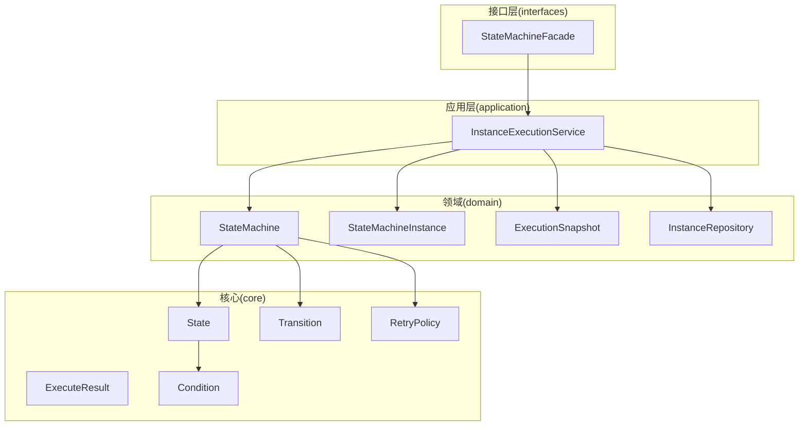
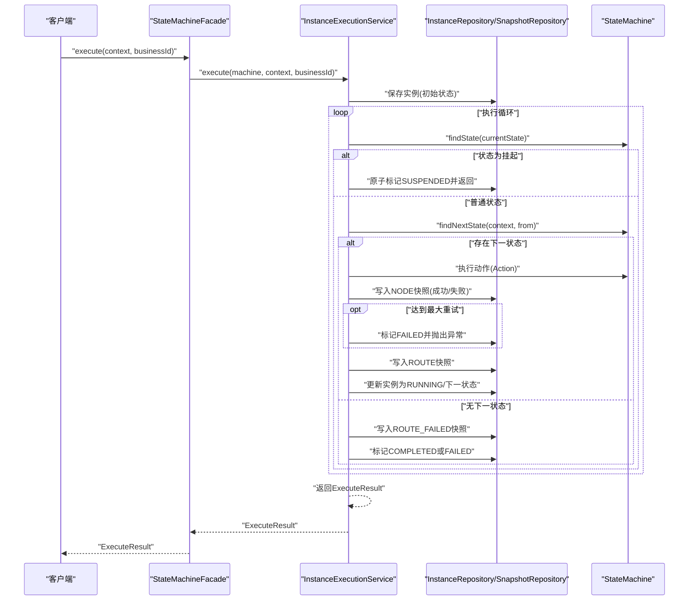
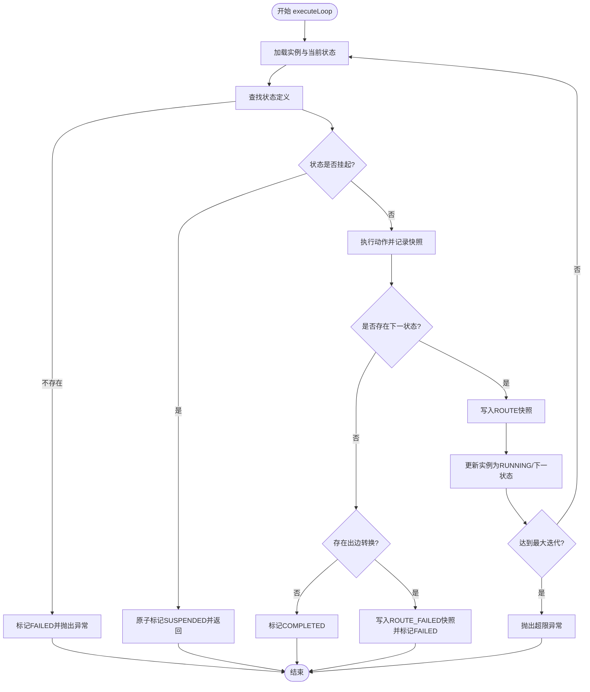
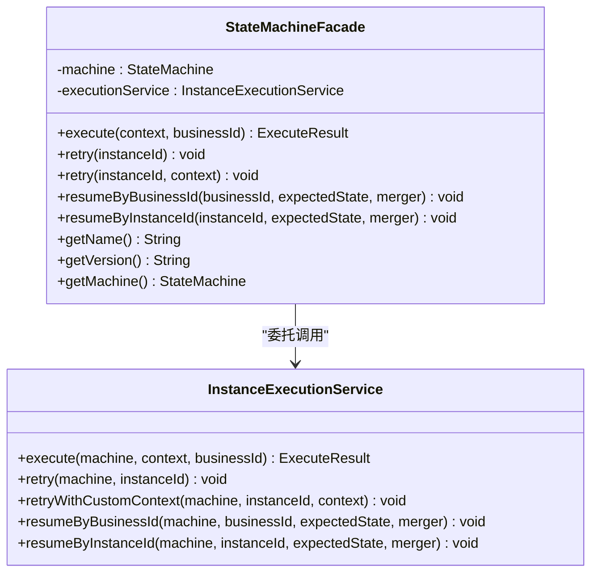
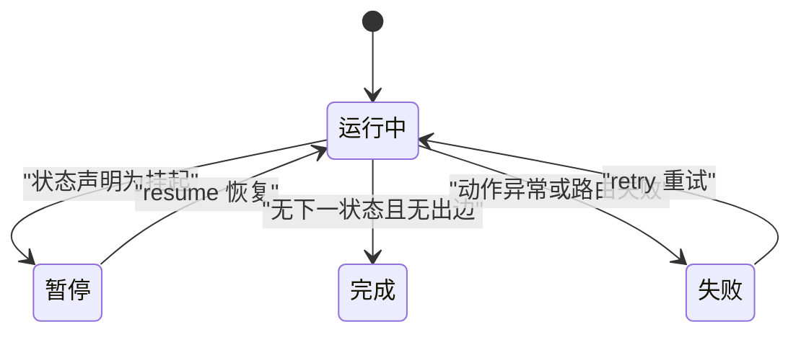
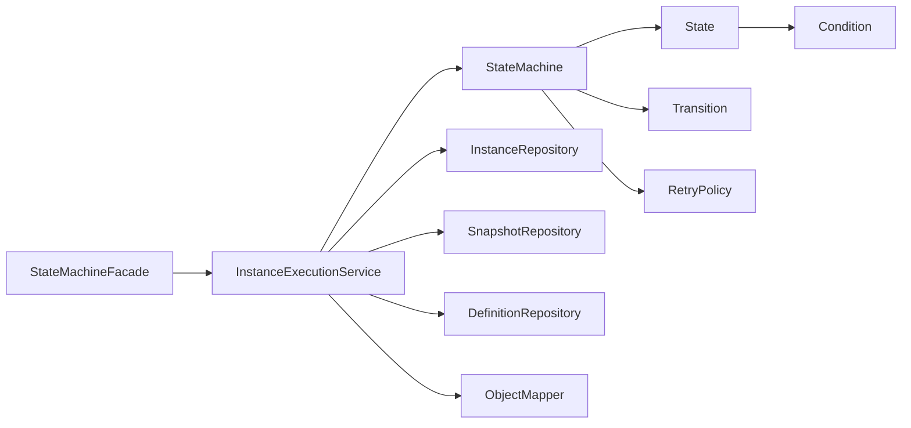

# 执行引擎

<cite>
**本文引用的文件**
- [InstanceExecutionService.java](file://state-machine-boot-starter/src/main/java/cn/chedejun/statemachine/application/InstanceExecutionService.java)
- [StateMachineFacade.java](file://state-machine-boot-starter/src/main/java/cn/chedejun/statemachine/interfaces/StateMachineFacade.java)
- [ExecuteResult.java](file://state-machine-boot-starter/src/main/java/cn/chedejun/statemachine/core/ExecuteResult.java)
- [StateMachine.java](file://state-machine-boot-starter/src/main/java/cn/chedejun/statemachine/domain/engine/StateMachine.java)
- [StateMachineInstance.java](file://state-machine-boot-starter/src/main/java/cn/chedejun/statemachine/domain/instance/StateMachineInstance.java)
- [InstanceStatus.java](file://state-machine-boot-starter/src/main/java/cn/chedejun/statemachine/domain/shared/InstanceStatus.java)
- [ExecutionSnapshot.java](file://state-machine-boot-starter/src/main/java/cn/chedejun/statemachine/domain/snapshot/ExecutionSnapshot.java)
- [State.java](file://state-machine-boot-starter/src/main/java/cn/chedejun/statemachine/core/State.java)
- [Transition.java](file://state-machine-boot-starter/src/main/java/cn/chedejun/statemachine/core/Transition.java)
- [InstanceRepository.java](file://state-machine-boot-starter/src/main/java/cn/chedejun/statemachine/domain/repository/InstanceRepository.java)
- [InstanceData.java](file://state-machine-boot-starter/src/main/java/cn/chedejun/statemachine/domain/data/InstanceData.java)
- [InstanceStartedEvent.java](file://state-machine-boot-starter/src/main/java/cn/chedejun/statemachine/domain/event/InstanceStartedEvent.java)
- [InstanceCompletedEvent.java](file://state-machine-boot-starter/src/main/java/cn/chedejun/statemachine/domain/event/InstanceCompletedEvent.java)
- [InstanceSuspendedEvent.java](file://state-machine-boot-starter/src/main/java/cn/chedejun/statemachine/domain/event/InstanceSuspendedEvent.java)
- [RetryPolicy.java](file://state-machine-boot-starter/src/main/java/cn/chedejun/statemachine/core/RetryPolicy.java)
- [Condition.java](file://state-machine-boot-starter/src/main/java/cn/chedejun/statemachine/core/Condition.java)
- [StateMachineBuilder.java](file://state-machine-boot-starter/src/main/java/cn/chedejun/statemachine/core/StateMachineBuilder.java)
</cite>

## 更新摘要
**变更内容**
- 新增 executeSuspendStateAction 方法，支持挂起状态的条件恢复逻辑
- 新增 suspendState 方法，支持带条件的挂起点定义
- 新增 Condition 接口，提供灵活的恢复条件判断
- 新增 hasResumeCondition() 方法，支持条件挂起点的状态管理
- 新增 tryMarkRunningFromSuspended 原子操作，确保恢复的线程安全
- 支持复杂的多挂起点工作流，每个挂起点可以有不同的恢复条件

## 目录
1. [简介](#简介)
2. [项目结构](#项目结构)
3. [核心组件](#核心组件)
4. [架构总览](#架构总览)
5. [详细组件分析](#详细组件分析)
6. [依赖分析](#依赖分析)
7. [性能考量](#性能考量)
8. [故障排查指南](#故障排查指南)
9. [结论](#结论)
10. [附录](#附录)

## 简介
本文件面向"执行引擎"的使用者与维护者，系统性阐述状态机执行服务的实现与设计，重点覆盖以下方面：
- InstanceExecutionService 的核心执行循环机制、状态转换算法与上下文管理
- StateMachineFacade 门面模式的设计与对外 API 接口
- 执行结果处理与错误传播策略
- 实例生命周期管理（创建、执行、暂停、恢复、完成）
- **新增**：挂起状态的条件恢复机制与多挂起点工作流支持
- 关键执行流程与时序图
- 性能优化建议与并发处理注意事项

## 项目结构
执行引擎位于 state-machine-boot-starter 模块中，采用分层与领域驱动设计（DDD）风格组织：
- application 层：应用服务，负责编排执行、持久化与错误处理
- domain 层：领域模型与聚合根，如状态机、实例、快照、事件等
- core 层：核心抽象（状态、转换、重试策略、上下文等）
- interfaces 层：对外门面接口
- repository 层：数据访问接口
- persistence 层：数据库初始化脚本与 JDBC 实现（不在本文展开）

**图表来源**
- [InstanceExecutionService.java:1-328](file://state-machine-boot-starter/src/main/java/cn/chedejun/statemachine/application/InstanceExecutionService.java#L1-L328)
- [StateMachineFacade.java:1-52](file://state-machine-boot-starter/src/main/java/cn/chedejun/statemachine/interfaces/StateMachineFacade.java#L1-L52)
- [StateMachine.java:1-77](file://state-machine-boot-starter/src/main/java/cn/chedejun/statemachine/domain/engine/StateMachine.java#L1-L77)
- [StateMachineInstance.java:1-81](file://state-machine-boot-starter/src/main/java/cn/chedejun/statemachine/domain/instance/StateMachineInstance.java#L1-L81)
- [ExecutionSnapshot.java:1-73](file://state-machine-boot-starter/src/main/java/cn/chedejun/statemachine/domain/snapshot/ExecutionSnapshot.java#L1-L73)
- [State.java:1-31](file://state-machine-boot-starter/src/main/java/cn/chedejun/statemachine/core/State.java#L1-L31)
- [Transition.java:1-20](file://state-machine-boot-starter/src/main/java/cn/chedejun/statemachine/core/Transition.java#L1-L20)
- [InstanceRepository.java:1-26](file://state-machine-boot-starter/src/main/java/cn/chedejun/statemachine/domain/repository/InstanceRepository.java#L1-L26)
- [ExecuteResult.java:1-58](file://state-machine-boot-starter/src/main/java/cn/chedejun/statemachine/core/ExecuteResult.java#L1-L58)
- [RetryPolicy.java:1-45](file://state-machine-boot-starter/src/main/java/cn/chedejun/statemachine/core/RetryPolicy.java#L1-L45)
- [Condition.java:1-7](file://state-machine-boot-starter/src/main/java/cn/chedejun/statemachine/core/Condition.java#L1-L7)

**章节来源**
- [InstanceExecutionService.java:1-328](file://state-machine-boot-starter/src/main/java/cn/chedejun/statemachine/application/InstanceExecutionService.java#L1-L328)
- [StateMachineFacade.java:1-52](file://state-machine-boot-starter/src/main/java/cn/chedejun/statemachine/interfaces/StateMachineFacade.java#L1-L52)

## 核心组件
- 执行服务：负责实例创建、执行循环、状态转换、重试与错误处理、快照记录与结果封装
- 门面接口：向后兼容的对外 API，委托给执行服务
- 领域模型：状态机、实例、快照、事件、状态与转换、重试策略
- 数据模型：实例数据对象，用于持久化与跨层传递
- **新增**：条件接口：提供灵活的恢复条件判断机制

**章节来源**
- [InstanceExecutionService.java:43-58](file://state-machine-boot-starter/src/main/java/cn/chedejun/statemachine/application/InstanceExecutionService.java#L43-L58)
- [StateMachineFacade.java:26-46](file://state-machine-boot-starter/src/main/java/cn/chedejun/statemachine/interfaces/StateMachineFacade.java#L26-L46)
- [ExecuteResult.java:16-57](file://state-machine-boot-starter/src/main/java/cn/chedejun/statemachine/core/ExecuteResult.java#L16-L57)
- [StateMachine.java:19-77](file://state-machine-boot-starter/src/main/java/cn/chedejun/statemachine/domain/engine/StateMachine.java#L19-L77)
- [StateMachineInstance.java:9-81](file://state-machine-boot-starter/src/main/java/cn/chedejun/statemachine/domain/instance/StateMachineInstance.java#L9-L81)
- [ExecutionSnapshot.java:11-73](file://state-machine-boot-starter/src/main/java/cn/chedejun/statemachine/domain/snapshot/ExecutionSnapshot.java#L11-L73)
- [State.java:3-31](file://state-machine-boot-starter/src/main/java/cn/chedejun/statemachine/core/State.java#L3-L31)
- [Transition.java:3-20](file://state-machine-boot-starter/src/main/java/cn/chedejun/statemachine/core/Transition.java#L3-L20)
- [InstanceRepository.java:9-26](file://state-machine-boot-starter/src/main/java/cn/chedejun/statemachine/domain/repository/InstanceRepository.java#L9-L26)
- [InstanceData.java:8-79](file://state-machine-boot-starter/src/main/java/cn/chedejun/statemachine/domain/data/InstanceData.java#L8-L79)
- [RetryPolicy.java:5-45](file://state-machine-boot-starter/src/main/java/cn/chedejun/statemachine/core/RetryPolicy.java#L5-L45)
- [Condition.java:3-7](file://state-machine-boot-starter/src/main/java/cn/chedejun/statemachine/core/Condition.java#L3-L7)

## 架构总览
执行引擎采用"应用服务编排 + 领域模型驱动 + 数据快照持久化"的架构：
- 外部通过 StateMachineFacade 调用执行、重试、恢复
- InstanceExecutionService 作为核心编排器，协调状态机、实例、快照与仓库
- StateMachine 定义状态与转换规则，State/Transition 描述执行单元与路由条件
- **新增**：State 支持挂起状态和恢复条件，Condition 接口提供灵活的条件判断
- 执行过程以"状态 -> 动作 -> 路由 -> 下一状态"循环推进，失败时记录快照并按重试策略退避
- **新增**：挂起状态支持条件恢复，多个挂起点可以独立配置不同的恢复条件
- 结果通过 ExecuteResult 返回，包含实例 ID、机器名称、版本、当前状态、业务 ID、创建时间等

**图表来源**
- [StateMachineFacade.java:26-28](file://state-machine-boot-starter/src/main/java/cn/chedejun/statemachine/interfaces/StateMachineFacade.java#L26-L28)
- [InstanceExecutionService.java:43-58](file://state-machine-boot-starter/src/main/java/cn/chedejun/statemachine/application/InstanceExecutionService.java#L43-L58)
- [InstanceExecutionService.java:158-193](file://state-machine-boot-starter/src/main/java/cn/chedejun/statemachine/application/InstanceExecutionService.java#L158-L193)
- [InstanceExecutionService.java:200-237](file://state-machine-boot-starter/src/main/java/cn/chedejun/statemachine/application/InstanceExecutionService.java#L200-L237)
- [ExecutionSnapshot.java:38-61](file://state-machine-boot-starter/src/main/java/cn/chedejun/statemachine/domain/snapshot/ExecutionSnapshot.java#L38-L61)
- [InstanceRepository.java:13-17](file://state-machine-boot-starter/src/main/java/cn/chedejun/statemachine/domain/repository/InstanceRepository.java#L13-L17)

## 详细组件分析

### InstanceExecutionService：执行循环、状态转换与上下文管理
- 实例创建与初始化
  - 生成实例 ID，解析定义 ID，创建实例并保存初始状态
  - 初始状态来自状态机首个状态
- 执行循环 executeLoop
  - 基于状态机状态集与重试策略计算最大迭代上限，避免无限循环
  - 每轮：定位当前状态 -> 执行动作 -> 记录快照 -> 决策下一状态
  - **新增**：若状态声明为挂起，则原子地将实例置为 SUSPENDED 并返回
  - 若无下一状态且存在出边转换，记录 ROUTE_FAILED 并标记 FAILED；否则标记 COMPLETED
- 动作执行 executeAction
  - 尝试执行状态动作，成功则记录 NODE_SUCCESS 并重置重试计数
  - 失败则记录 NODE_FAILED，并根据重试策略延时后重试；耗尽重试后标记 FAILED 并抛出异常
- **新增**：挂起状态恢复 executeSuspendStateAction
  - 执行挂起状态的动作，然后检查恢复条件
  - 条件不满足时保持 SUSPENDED 状态
  - 条件满足时进行正常路由到下一状态
- 恢复逻辑 resume
  - 校验期望状态与当前状态一致
  - 从快照中提取最近一次成功的上下文（排除 ROUTE 快照），合并用户提供的上下文
  - 使用 CAS 原子更新实例状态为 RUNNING 并进入下一状态，若无下一状态则判定完成或失败
- 重试逻辑 retry/retryWithCustomContext
  - retry：基于最后一次失败快照反序列化上下文，自动推断下一状态并重试
  - retryWithCustomContext：直接使用传入上下文重试
- 结果封装 ExecuteResult
  - 返回实例 ID、机器名、版本、当前状态、状态码、错误信息、业务 ID、创建时间

**图表来源**
- [InstanceExecutionService.java:158-193](file://state-machine-boot-starter/src/main/java/cn/chedejun/statemachine/application/InstanceExecutionService.java#L158-L193)
- [InstanceExecutionService.java:200-237](file://state-machine-boot-starter/src/main/java/cn/chedejun/statemachine/application/InstanceExecutionService.java#L200-L237)
- [ExecutionSnapshot.java:50-61](file://state-machine-boot-starter/src/main/java/cn/chedejun/statemachine/domain/snapshot/ExecutionSnapshot.java#L50-L61)
- [InstanceRepository.java:13-17](file://state-machine-boot-starter/src/main/java/cn/chedejun/statemachine/domain/repository/InstanceRepository.java#L13-L17)

**章节来源**
- [InstanceExecutionService.java:43-58](file://state-machine-boot-starter/src/main/java/cn/chedejun/statemachine/application/InstanceExecutionService.java#L43-L58)
- [InstanceExecutionService.java:60-114](file://state-machine-boot-starter/src/main/java/cn/chedejun/statemachine/application/InstanceExecutionService.java#L60-L114)
- [InstanceExecutionService.java:119-152](file://state-machine-boot-starter/src/main/java/cn/chedejun/statemachine/application/InstanceExecutionService.java#L119-L152)
- [InstanceExecutionService.java:158-193](file://state-machine-boot-starter/src/main/java/cn/chedejun/statemachine/application/InstanceExecutionService.java#L158-L193)
- [InstanceExecutionService.java:200-237](file://state-machine-boot-starter/src/main/java/cn/chedejun/statemachine/application/InstanceExecutionService.java#L200-L237)
- [ExecuteResult.java:16-57](file://state-machine-boot-starter/src/main/java/cn/chedejun/statemachine/core/ExecuteResult.java#L16-L57)

### StateMachineFacade：门面模式与对外 API
- 设计目的：保持对外 API 签名稳定，内部委托给 InstanceExecutionService
- 对外方法
  - execute(context, businessId)：启动执行
  - retry(instanceId) / retry(instanceId, context)：重试失败实例
  - resumeByBusinessId(businessId, expectedState, merger) / resumeByInstanceId(instanceId, expectedState, merger)：按业务 ID 或实例 ID 恢复
- 内部持有 StateMachine 与 InstanceExecutionService，便于统一管理

**图表来源**
- [StateMachineFacade.java:16-51](file://state-machine-boot-starter/src/main/java/cn/chedejun/statemachine/interfaces/StateMachineFacade.java#L16-L51)
- [InstanceExecutionService.java:43-114](file://state-machine-boot-starter/src/main/java/cn/chedejun/statemachine/application/InstanceExecutionService.java#L43-L114)

**章节来源**
- [StateMachineFacade.java:16-51](file://state-machine-boot-starter/src/main/java/cn/chedejun/statemachine/interfaces/StateMachineFacade.java#L16-L51)

### 执行结果处理与错误传播
- ExecuteResult
  - 封装实例 ID、机器名、版本、当前状态、状态码、错误信息、业务 ID、创建时间
  - 便于上层直接消费与展示
- 错误传播
  - 状态动作异常：记录失败快照，按重试策略退避，耗尽后标记 FAILED 并抛出异常
  - 路由失败：记录 ROUTE_FAILED 快照，标记 FAILED 并抛出异常
  - 恢复校验失败：抛出异常提示状态不匹配
  - 未找到实例/定义：抛出相应异常
  - **新增**：挂起状态条件不满足：保持 SUSPENDED 状态，等待下次恢复

**章节来源**
- [ExecuteResult.java:16-57](file://state-machine-boot-starter/src/main/java/cn/chedejun/statemachine/core/ExecuteResult.java#L16-L57)
- [InstanceExecutionService.java:167-170](file://state-machine-boot-starter/src/main/java/cn/chedejun/statemachine/application/InstanceExecutionService.java#L167-L170)
- [InstanceExecutionService.java:214-236](file://state-machine-boot-starter/src/main/java/cn/chedejun/statemachine/application/InstanceExecutionService.java#L214-L236)
- [InstanceExecutionService.java:268-275](file://state-machine-boot-starter/src/main/java/cn/chedejun/statemachine/application/InstanceExecutionService.java#L268-L275)

### 实例生命周期管理
- 创建：生成实例 ID，设置初始状态为 RUNNING，持久化
- 执行：进入执行循环，按状态机规则推进
- **新增**：挂起：状态声明为挂起，原子更新为 SUSPENDED
- **新增**：条件恢复：CAS 原子更新状态为 RUNNING 并进入挂起状态的动作执行，检查恢复条件决定是否继续流转
- 完成：无出边转换或路由成功，标记 COMPLETED
- 失败：动作异常或路由失败，标记 FAILED

**图表来源**
- [StateMachineInstance.java:46-79](file://state-machine-boot-starter/src/main/java/cn/chedejun/statemachine/domain/instance/StateMachineInstance.java#L46-L79)
- [InstanceStatus.java:1-3](file://state-machine-boot-starter/src/main/java/cn/chedejun/statemachine/domain/shared/InstanceStatus.java#L1-L3)
- [InstanceExecutionService.java:174-184](file://state-machine-boot-starter/src/main/java/cn/chedejun/statemachine/application/InstanceExecutionService.java#L174-L184)
- [InstanceExecutionService.java:142-151](file://state-machine-boot-starter/src/main/java/cn/chedejun/statemachine/application/InstanceExecutionService.java#L142-L151)

**章节来源**
- [StateMachineInstance.java:19-79](file://state-machine-boot-starter/src/main/java/cn/chedejun/statemachine/domain/instance/StateMachineInstance.java#L19-L79)
- [InstanceStatus.java:1-3](file://state-machine-boot-starter/src/main/java/cn/chedejun/statemachine/domain/shared/InstanceStatus.java#L1-L3)
- [InstanceExecutionService.java:174-184](file://state-machine-boot-starter/src/main/java/cn/chedejun/statemachine/application/InstanceExecutionService.java#L174-L184)
- [InstanceExecutionService.java:142-151](file://state-machine-boot-starter/src/main/java/cn/chedejun/statemachine/application/InstanceExecutionService.java#L142-L151)

### 上下文管理与序列化
- 上下文序列化/反序列化
  - 使用 ObjectMapper 将上下文对象与 JSON 互转
  - 反序列化时使用状态机指定的上下文类型
- 恢复时上下文合并
  - 从快照中提取最近一次成功的上下文 JSON，反序列化后由调用方合并自定义变更

**章节来源**
- [InstanceExecutionService.java:247-260](file://state-machine-boot-starter/src/main/java/cn/chedejun/statemachine/application/InstanceExecutionService.java#L247-L260)
- [InstanceExecutionService.java:127-133](file://state-machine-boot-starter/src/main/java/cn/chedejun/statemachine/application/InstanceExecutionService.java#L127-L133)

### 状态机与路由算法
- 状态与转换
  - State 定义状态名与动作，支持挂起标志和恢复条件
  - Transition 定义 from/to 与条件表达式
  - StateMachine 提供 findNextState，按顺序遍历转换并测试条件
- **新增**：挂起状态与条件恢复
  - suspendState 方法支持带条件的挂起点定义
  - executeSuspendStateAction 方法执行挂起状态动作并检查恢复条件
  - hasResumeCondition() 方法判断状态是否有恢复条件
- 路由决策
  - 优先选择满足条件的首个转换
  - 若无满足条件的转换，但存在出边，则视为路由失败

**章节来源**
- [State.java:3-31](file://state-machine-boot-starter/src/main/java/cn/chedejun/statemachine/core/State.java#L3-L31)
- [Transition.java:3-20](file://state-machine-boot-starter/src/main/java/cn/chedejun/statemachine/core/Transition.java#L3-L20)
- [StateMachine.java:63-75](file://state-machine-boot-starter/src/main/java/cn/chedejun/statemachine/domain/engine/StateMachine.java#L63-L75)
- [StateMachineBuilder.java:28-30](file://state-machine-boot-starter/src/main/java/cn/chedejun/statemachine/core/StateMachineBuilder.java#L28-L30)

### 条件接口与多挂起点支持
- Condition 接口
  - 函数式接口，提供 test(C context) 方法
  - 用于定义挂起状态的恢复条件
- 多挂起点工作流
  - 每个挂起点可以独立配置不同的恢复条件
  - 支持复杂的业务场景，如需要累计多个条件才允许恢复
  - 通过多次恢复逐步满足条件，最终完成工作流

**章节来源**
- [Condition.java:3-7](file://state-machine-boot-starter/src/main/java/cn/chedejun/statemachine/core/Condition.java#L3-L7)
- [StateMachineBuilder.java:28-30](file://state-machine-boot-starter/src/main/java/cn/chedejun/statemachine/core/StateMachineBuilder.java#L28-L30)

## 依赖分析
- 组件耦合
  - StateMachineFacade 仅依赖 StateMachine 与 InstanceExecutionService，职责清晰
  - InstanceExecutionService 依赖状态机、实例仓库、快照仓库、定义仓库与 ObjectMapper
- 外部依赖点
  - 数据持久化：通过 InstanceRepository 与 SnapshotRepository 抽象
  - 序列化：ObjectMapper
  - **新增**：条件判断：Condition 接口提供灵活的恢复条件机制
- 循环依赖
  - 未发现循环依赖，模块边界清晰

**图表来源**
- [StateMachineFacade.java:18-24](file://state-machine-boot-starter/src/main/java/cn/chedejun/statemachine/interfaces/StateMachineFacade.java#L18-L24)
- [InstanceExecutionService.java:30-41](file://state-machine-boot-starter/src/main/java/cn/chedejun/statemachine/application/InstanceExecutionService.java#L30-L41)
- [StateMachine.java:28-48](file://state-machine-boot-starter/src/main/java/cn/chedejun/statemachine/domain/engine/StateMachine.java#L28-L48)

**章节来源**
- [StateMachineFacade.java:18-24](file://state-machine-boot-starter/src/main/java/cn/chedejun/statemachine/interfaces/StateMachineFacade.java#L18-L24)
- [InstanceExecutionService.java:30-41](file://state-machine-boot-starter/src/main/java/cn/chedejun/statemachine/application/InstanceExecutionService.java#L30-L41)
- [StateMachine.java:28-48](file://state-machine-boot-starter/src/main/java/cn/chedejun/statemachine/domain/engine/StateMachine.java#L28-L48)

## 性能考量
- 执行循环上限
  - 基于状态数量与最大重试次数估算最大迭代，避免无限循环
- 重试退避
  - 使用指数退避策略，限制最大延迟，减少对下游的压力
- 快照粒度
  - NODE 快照记录动作输入/输出与尝试次数；ROUTE 快照记录路由决策
- 原子更新
  - 恢复时使用 CAS 原子更新实例状态，避免竞态
- 序列化开销
  - 上下文序列化/反序列化为 IO 密集操作，建议控制上下文大小与复杂度
- **新增**：条件检查开销
  - 挂起状态的条件检查会增加额外的计算开销
  - 建议条件逻辑尽量简单高效

**章节来源**
- [InstanceExecutionService.java:161-162](file://state-machine-boot-starter/src/main/java/cn/chedejun/statemachine/application/InstanceExecutionService.java#L161-L162)
- [RetryPolicy.java:26-30](file://state-machine-boot-starter/src/main/java/cn/chedejun/statemachine/core/RetryPolicy.java#L26-L30)
- [InstanceExecutionService.java:139-142](file://state-machine-boot-starter/src/main/java/cn/chedejun/statemachine/application/InstanceExecutionService.java#L139-L142)
- [ExecutionSnapshot.java:38-61](file://state-machine-boot-starter/src/main/java/cn/chedejun/statemachine/domain/snapshot/ExecutionSnapshot.java#L38-L61)

## 故障排查指南
- "状态不存在"
  - 现象：执行循环中找不到状态定义
  - 处理：检查状态机定义与状态名一致性
- "无匹配的转换"
  - 现象：当前状态无满足条件的转换，且存在出边
  - 处理：检查条件表达式与上下文内容
- "实例已恢复或非挂起"
  - 现象：恢复 CAS 更新失败
  - 处理：确认实例状态确为 SUSPENDED，避免并发竞争
- "重试耗尽"
  - 现象：动作异常且重试次数已达上限
  - 处理：查看失败快照与错误信息，修正业务逻辑或外部依赖
- "上下文反序列化失败"
  - 现象：反序列化抛出异常
  - 处理：检查上下文类与 JSON 结构一致性
- **新增**："挂起状态条件不满足"
  - 现象：恢复后仍然保持 SUSPENDED 状态
  - 处理：检查恢复条件逻辑，确认上下文数据是否满足条件
- **新增**："并发恢复冲突"
  - 现象：多个并发恢复请求导致状态竞争
  - 处理：利用 CAS 原子操作，确保只有一个恢复请求成功

**章节来源**
- [InstanceExecutionService.java:167-170](file://state-machine-boot-starter/src/main/java/cn/chedejun/statemachine/application/InstanceExecutionService.java#L167-L170)
- [InstanceExecutionService.java:140-142](file://state-machine-boot-starter/src/main/java/cn/chedejun/statemachine/application/InstanceExecutionService.java#L140-L142)
- [InstanceExecutionService.java:231-236](file://state-machine-boot-starter/src/main/java/cn/chedejun/statemachine/application/InstanceExecutionService.java#L231-L236)
- [InstanceExecutionService.java:255-260](file://state-machine-boot-starter/src/main/java/cn/chedejun/statemachine/application/InstanceExecutionService.java#L255-L260)

## 结论
本执行引擎以清晰的门面与应用服务为核心，结合领域模型与快照持久化，实现了高可靠的状态机执行与恢复能力。**新增的挂起状态条件恢复机制**使得系统能够支持复杂的多挂起点工作流，每个挂起点可以配置独立的恢复条件，大大增强了状态机的灵活性和适用性。通过重试策略、原子更新与严格的错误传播机制，保障了在复杂业务场景下的稳定性与可观测性。

## 附录
- 关键 API 摘要
  - StateMachineFacade.execute：启动执行
  - StateMachineFacade.retry / retryWithCustomContext：重试失败实例
  - StateMachineFacade.resumeByBusinessId / resumeByInstanceId：按业务 ID 或实例 ID 恢复
- 事件与状态
  - 实例事件：开始、完成、失败、暂停
  - 实例状态：RUNNING、SUSPENDED、COMPLETED、FAILED
- **新增**：挂起状态相关
  - suspendState：定义带条件的挂起点
  - Condition：恢复条件接口
  - executeSuspendStateAction：挂起状态条件恢复执行

**章节来源**
- [StateMachineFacade.java:26-46](file://state-machine-boot-starter/src/main/java/cn/chedejun/statemachine/interfaces/StateMachineFacade.java#L26-L46)
- [InstanceStartedEvent.java:8-24](file://state-machine-boot-starter/src/main/java/cn/chedejun/statemachine/domain/event/InstanceStartedEvent.java#L8-L24)
- [InstanceCompletedEvent.java:8-24](file://state-machine-boot-starter/src/main/java/cn/chedejun/statemachine/domain/event/InstanceCompletedEvent.java#L8-L24)
- [InstanceStatus.java:1-3](file://state-machine-boot-starter/src/main/java/cn/chedejun/statemachine/domain/shared/InstanceStatus.java#L1-L3)
- [StateMachineBuilder.java:28-30](file://state-machine-boot-starter/src/main/java/cn/chedejun/statemachine/core/StateMachineBuilder.java#L28-L30)
- [Condition.java:3-7](file://state-machine-boot-starter/src/main/java/cn/chedejun/statemachine/core/Condition.java#L3-L7)
- [InstanceSuspendedEvent.java:8-24](file://state-machine-boot-starter/src/main/java/cn/chedejun/statemachine/domain/event/InstanceSuspendedEvent.java#L8-L24)