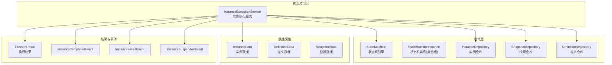
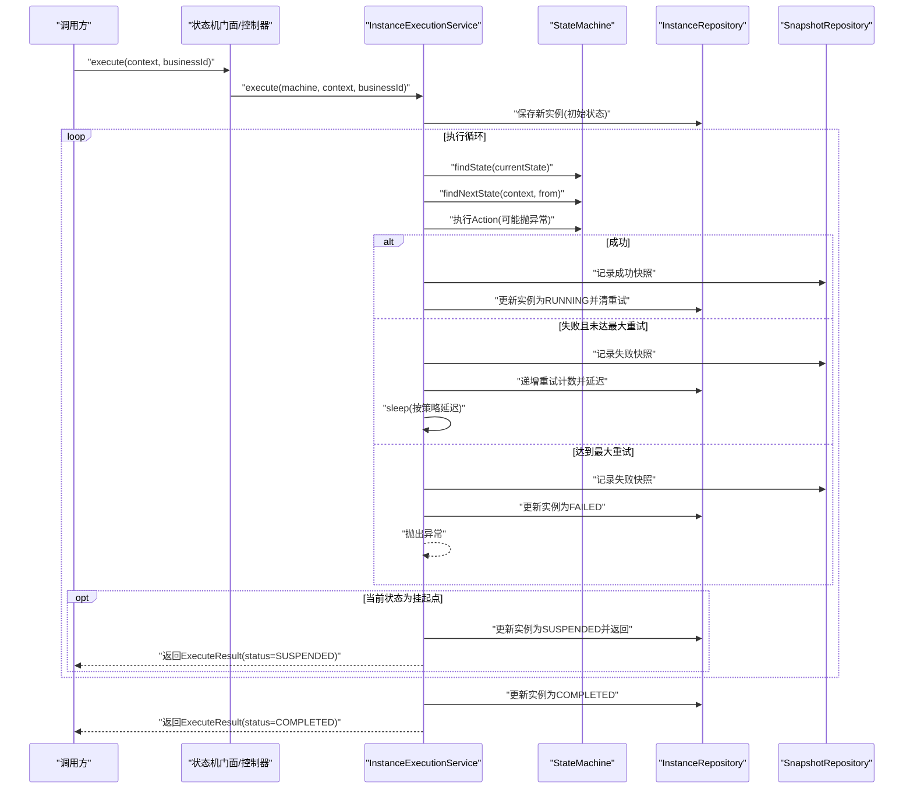
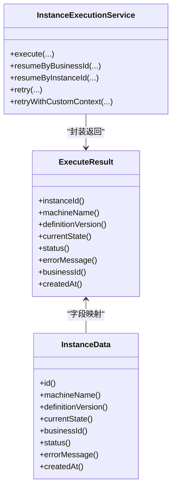

# 执行结果处理

<cite>
**本文引用的文件**
- [ExecuteResult.java](file://state-machine-boot-starter/src/main/java/cn/chedejun/statemachine/core/ExecuteResult.java)
- [InstanceExecutionService.java](file://state-machine-boot-starter/src/main/java/cn/chedejun/statemachine/application/InstanceExecutionService.java)
- [StateMachine.java](file://state-machine-boot-starter/src/main/java/cn/chedejun/statemachine/domain/engine/StateMachine.java)
- [InstanceData.java](file://state-machine-boot-starter/src/main/java/cn/chedejun/statemachine/domain/data/InstanceData.java)
- [DefinitionData.java](file://state-machine-boot-starter/src/main/java/cn/chedejun/statemachine/domain/data/DefinitionData.java)
- [InstanceId.java](file://state-machine-boot-starter/src/main/java/cn/chedejun/statemachine/domain/shared/InstanceId.java)
- [MachineName.java](file://state-machine-boot-starter/src/main/java/cn/chedejun/statemachine/domain/shared/MachineName.java)
- [InstanceStatus.java](file://state-machine-boot-starter/src/main/java/cn/chedejun/statemachine/domain/shared/InstanceStatus.java)
- [ExecutionStatus.java](file://state-machine-boot-starter/src/main/java/cn/chedejun/statemachine/domain/shared/ExecutionStatus.java)
- [InstanceCompletedEvent.java](file://state-machine-boot-starter/src/main/java/cn/chedejun/statemachine/domain/event/InstanceCompletedEvent.java)
- [InstanceFailedEvent.java](file://state-machine-boot-starter/src/main/java/cn/chedejun/statemachine/domain/event/InstanceFailedEvent.java)
- [InstanceSuspendedEvent.java](file://state-machine-boot-starter/src/main/java/cn/chedejun/statemachine/domain/event/InstanceSuspendedEvent.java)
- [StateMachineIntegrationTest.java](file://state-machine-boot-starter/src/test/java/cn/chedejun/statemachine/integration/StateMachineIntegrationTest.java)
</cite>

## 目录
1. [简介](#简介)
2. [项目结构](#项目结构)
3. [核心组件](#核心组件)
4. [架构总览](#架构总览)
5. [详细组件分析](#详细组件分析)
6. [依赖关系分析](#依赖关系分析)
7. [性能考量](#性能考量)
8. [故障排查指南](#故障排查指南)
9. [结论](#结论)
10. [附录](#附录)

## 简介
本文件聚焦于“执行结果”处理，围绕 ExecuteResult 类展开，系统性阐述其设计目的、数据结构、字段语义、封装机制以及在不同执行场景（正常完成、失败中断、挂起等待）中的生成逻辑；并结合状态机实例的状态流转与持久化快照，说明执行结果与状态机实例状态之间的对应关系及状态转换验证机制。同时提供使用示例与最佳实践，帮助读者在业务系统中正确解析与处理执行结果。

## 项目结构
本项目采用分层与领域驱动设计相结合的方式组织代码：
- 核心领域与应用服务位于 state-machine-boot-starter 模块
- domain 层包含引擎、实例、仓库接口与共享值对象
- application 层提供实例执行服务，负责状态推进、重试与结果封装
- core 层提供执行结果、状态、动作、条件等基础能力
- 测试覆盖集成测试与单元测试，验证执行流程与结果一致性

图表来源
- [InstanceExecutionService.java:43-58](file://state-machine-boot-starter/src/main/java/cn/chedejun/statemachine/application/InstanceExecutionService.java#L43-L58)
- [StateMachine.java:19-77](file://state-machine-boot-starter/src/main/java/cn/chedejun/statemachine/domain/engine/StateMachine.java#L19-L77)
- [InstanceData.java:8-79](file://state-machine-boot-starter/src/main/java/cn/chedejun/statemachine/domain/data/InstanceData.java#L8-L79)
- [DefinitionData.java:8-46](file://state-machine-boot-starter/src/main/java/cn/chedejun/statemachine/domain/data/DefinitionData.java#L8-L46)
- [ExecuteResult.java:16-58](file://state-machine-boot-starter/src/main/java/cn/chedejun/statemachine/core/ExecuteResult.java#L16-L58)

章节来源
- [InstanceExecutionService.java:24-41](file://state-machine-boot-starter/src/main/java/cn/chedejun/statemachine/application/InstanceExecutionService.java#L24-L41)
- [StateMachine.java:19-77](file://state-machine-boot-starter/src/main/java/cn/chedejun/statemachine/domain/engine/StateMachine.java#L19-L77)

## 核心组件
- ExecuteResult：封装一次状态机实例执行的最终结果，便于业务系统直接消费。包含实例标识、状态机名称与版本、当前状态、最终状态、错误信息、业务ID与创建时间等关键字段。
- InstanceExecutionService：核心执行编排器，负责实例初始化、状态推进、重试、挂起与最终结果封装。
- StateMachine：不可变领域对象，承载状态、转换规则与重试策略，用于驱动执行循环。
- InstanceData：实例持久化载体，记录实例ID、定义ID、状态机名称与版本、当前状态、业务ID、状态、重试计数、错误信息与时间戳。
- DefinitionData：状态机定义的持久化载体，记录定义ID、名称、版本与序列化的状态/转换/重试策略。
- InstanceStatus/ExecutionStatus：实例与快照的执行状态枚举，用于统一状态表达。
- 事件模型：InstanceCompletedEvent、InstanceFailedEvent、InstanceSuspendedEvent，用于领域事件发布。

章节来源
- [ExecuteResult.java:16-58](file://state-machine-boot-starter/src/main/java/cn/chedejun/statemachine/core/ExecuteResult.java#L16-L58)
- [InstanceExecutionService.java:43-58](file://state-machine-boot-starter/src/main/java/cn/chedejun/statemachine/application/InstanceExecutionService.java#L43-L58)
- [InstanceData.java:22-54](file://state-machine-boot-starter/src/main/java/cn/chedejun/statemachine/domain/data/InstanceData.java#L22-L54)
- [DefinitionData.java:17-26](file://state-machine-boot-starter/src/main/java/cn/chedejun/statemachine/domain/data/DefinitionData.java#L17-L26)
- [InstanceStatus.java:1-3](file://state-machine-boot-starter/src/main/java/cn/chedejun/statemachine/domain/shared/InstanceStatus.java#L1-L3)
- [ExecutionStatus.java:1-3](file://state-machine-boot-starter/src/main/java/cn/chedejun/statemachine/domain/shared/ExecutionStatus.java#L1-L3)

## 架构总览
下图展示从调用入口到执行结果生成的关键交互路径，涵盖状态推进、重试、挂起与最终结果封装。

图表来源
- [InstanceExecutionService.java:43-58](file://state-machine-boot-starter/src/main/java/cn/chedejun/statemachine/application/InstanceExecutionService.java#L43-L58)
- [InstanceExecutionService.java:158-193](file://state-machine-boot-starter/src/main/java/cn/chedejun/statemachine/application/InstanceExecutionService.java#L158-L193)
- [InstanceExecutionService.java:200-237](file://state-machine-boot-starter/src/main/java/cn/chedejun/statemachine/application/InstanceExecutionService.java#L200-L237)

## 详细组件分析

### ExecuteResult 设计与数据结构
- 设计目的：为上层业务提供“轻量、稳定、可序列化”的执行结果载体，屏蔽内部复杂状态推进细节，仅暴露必要字段以支持业务决策（如路由、重试、告警）。
- 字段与语义
  - 实例ID：唯一标识本次执行的实例，用于后续查询、重试与恢复。
  - 状态机名称：状态机定义名称，便于区分不同流程。
  - 定义版本：状态机定义版本号，用于追踪定义变更与兼容性。
  - 当前状态：实例在执行结束时所处的最终状态名称。
  - 最终状态：实例的最终状态（COMPLETED/FAILED/SUSPENDED）。
  - 错误信息：失败时的错误描述，便于定位问题。
  - 业务ID：业务侧唯一标识，便于业务关联与审计。
  - 创建时间：实例创建时间，用于统计与审计。
- 封装机制：ExecuteResult 为不可变值对象，通过构造函数一次性赋值，提供@JsonProperty标注的方法以便序列化/反序列化；基于实例ID进行相等性比较，保证缓存与去重的稳定性。

章节来源
- [ExecuteResult.java:16-58](file://state-machine-boot-starter/src/main/java/cn/chedejun/statemachine/core/ExecuteResult.java#L16-L58)

### 执行结果生成逻辑（三种场景）
- 正常完成（COMPLETED）
  - 场景特征：执行循环中未发生异常，且无出边条件满足导致挂起。
  - 结果封装：最终状态为 COMPLETED，当前状态为最后一个可到达状态，错误信息为空。
  - 关联验证：集成测试断言实例状态为 COMPLETED，且快照类型包含 NODE/ROUTE 的交替序列。
- 失败中断（FAILED）
  - 场景特征：状态动作抛出异常且达到最大重试次数。
  - 结果封装：最终状态为 FAILED，错误信息包含失败原因；实例状态更新为 FAILED。
  - 关联验证：集成测试断言失败实例的快照状态均为 FAILED，并保留最后一次错误信息。
- 挂起等待（SUSPENDED）
  - 场景特征：当前状态被标记为挂起点，执行遇到挂起状态则立即暂停。
  - 结果封装：最终状态为 SUSPENDED，当前状态为挂起状态；错误信息为空。
  - 关联验证：集成测试断言挂起后返回的 ExecuteResult 状态为 SUSPENDED，且恢复后继续执行直至完成。

章节来源
- [InstanceExecutionService.java:158-193](file://state-machine-boot-starter/src/main/java/cn/chedejun/statemachine/application/InstanceExecutionService.java#L158-L193)
- [InstanceExecutionService.java:174-176](file://state-machine-boot-starter/src/main/java/cn/chedejun/statemachine/application/InstanceExecutionService.java#L174-L176)
- [InstanceExecutionService.java:268-275](file://state-machine-boot-starter/src/main/java/cn/chedejun/statemachine/application/InstanceExecutionService.java#L268-L275)
- [StateMachineIntegrationTest.java:225-253](file://state-machine-boot-starter/src/test/java/cn/chedejun/statemachine/integration/StateMachineIntegrationTest.java#L225-L253)
- [StateMachineIntegrationTest.java:396-414](file://state-machine-boot-starter/src/test/java/cn/chedejun/statemachine/integration/StateMachineIntegrationTest.java#L396-L414)
- [StateMachineIntegrationTest.java:275-288](file://state-machine-boot-starter/src/test/java/cn/chedejun/statemachine/integration/StateMachineIntegrationTest.java#L275-L288)

### 执行结果与状态机实例状态的对应关系
- 实例状态（InstanceStatus）与执行结果状态（ExecuteResult.status）一一映射：
  - COMPLETED：实例最终状态为 COMPLETED。
  - FAILED：实例最终状态为 FAILED。
  - SUSPENDED：实例最终状态为 SUSPENDED。
- 实例数据（InstanceData）作为持久化载体，记录了实例的当前状态、最终状态、错误信息与时间戳，执行结果正是从该数据对象中抽取关键字段封装而来。
- 定义版本（DefinitionData.version）与状态机名称（MachineName）在执行结果中同步返回，便于业务侧进行版本追踪与定义校验。

章节来源
- [InstanceStatus.java:1-3](file://state-machine-boot-starter/src/main/java/cn/chedejun/statemachine/domain/shared/InstanceStatus.java#L1-L3)
- [InstanceData.java:46-54](file://state-machine-boot-starter/src/main/java/cn/chedejun/statemachine/domain/data/InstanceData.java#L46-L54)
- [ExecuteResult.java:54-56](file://state-machine-boot-starter/src/main/java/cn/chedejun/statemachine/core/ExecuteResult.java#L54-L56)
- [DefinitionData.java:28-30](file://state-machine-boot-starter/src/main/java/cn/chedejun/statemachine/domain/data/DefinitionData.java#L28-L30)

### 状态转换验证机制
- 转换验证：当状态无可用出边转换时，执行服务会构建错误信息并标记实例为 FAILED，确保不会出现“悬空状态”或“无法前进”的情况。
- 挂起点校验：若当前状态为挂起点，执行立即返回 SUSPENDED，避免继续推进。
- 重试上限：当达到最大重试次数仍未成功，执行服务记录失败快照并标记实例为 FAILED，防止无限重试。
- 事件发布：实例完成/失败/挂起时，系统发布相应领域事件，便于订阅方进行后续处理（如通知、补偿、监控）。

章节来源
- [InstanceExecutionService.java:178-184](file://state-machine-boot-starter/src/main/java/cn/chedejun/statemachine/application/InstanceExecutionService.java#L178-L184)
- [InstanceExecutionService.java:239-245](file://state-machine-boot-starter/src/main/java/cn/chedejun/statemachine/application/InstanceExecutionService.java#L239-L245)
- [InstanceExecutionService.java:174-176](file://state-machine-boot-starter/src/main/java/cn/chedejun/statemachine/application/InstanceExecutionService.java#L174-L176)
- [InstanceCompletedEvent.java:8-25](file://state-machine-boot-starter/src/main/java/cn/chedejun/statemachine/domain/event/InstanceCompletedEvent.java#L8-L25)
- [InstanceFailedEvent.java:8-28](file://state-machine-boot-starter/src/main/java/cn/chedejun/statemachine/domain/event/InstanceFailedEvent.java#L8-L28)
- [InstanceSuspendedEvent.java:8-25](file://state-machine-boot-starter/src/main/java/cn/chedejun/statemachine/domain/event/InstanceSuspendedEvent.java#L8-L25)

### 使用示例与最佳实践
- 解析与处理返回结果
  - 获取实例ID：用于后续查询、重试与恢复。
  - 获取最终状态：根据状态决定业务分支（如继续、告警、补偿）。
  - 获取错误信息：失败时读取错误信息进行定位与提示。
  - 获取业务ID：用于业务侧日志与审计。
  - 获取创建时间：用于统计与报表。
- 与状态机实例状态的关系
  - 若 ExecuteResult.status 为 COMPLETED，则实例最终状态也为 COMPLETED。
  - 若 ExecuteResult.status 为 FAILED，则实例最终状态也为 FAILED，错误信息可用于定位。
  - 若 ExecuteResult.status 为 SUSPENDED，则实例最终状态也为 SUSPENDED，需通过恢复接口继续执行。
- 与快照的关系
  - 成功：快照类型包含 NODE 与 ROUTE，且状态为 SUCCESS。
  - 失败：快照类型包含 NODE 与 ROUTE，且状态为 FAILED。
  - 挂起：执行在挂起点停止，实例状态为 SUSPENDED。

章节来源
- [StateMachineIntegrationTest.java:225-253](file://state-machine-boot-starter/src/test/java/cn/chedejun/statemachine/integration/StateMachineIntegrationTest.java#L225-L253)
- [StateMachineIntegrationTest.java:275-288](file://state-machine-boot-starter/src/test/java/cn/chedejun/statemachine/integration/StateMachineIntegrationTest.java#L275-L288)
- [StateMachineIntegrationTest.java:396-414](file://state-machine-boot-starter/src/test/java/cn/chedejun/statemachine/integration/StateMachineIntegrationTest.java#L396-L414)

## 依赖关系分析
- ExecuteResult 与 InstanceData 的字段映射关系清晰，前者是后者的“对外视图”，仅暴露必要字段。
- InstanceExecutionService 在执行完成后，从 InstanceData 中抽取字段构造 ExecuteResult，形成稳定的输出契约。
- StateMachine 提供状态与转换规则，驱动执行循环与状态推进。
- 事件模型与执行结果共同服务于可观测性与可运维性。

图表来源
- [ExecuteResult.java:39-46](file://state-machine-boot-starter/src/main/java/cn/chedejun/statemachine/core/ExecuteResult.java#L39-L46)
- [InstanceData.java:56-67](file://state-machine-boot-starter/src/main/java/cn/chedejun/statemachine/domain/data/InstanceData.java#L56-L67)
- [InstanceExecutionService.java:43-58](file://state-machine-boot-starter/src/main/java/cn/chedejun/statemachine/application/InstanceExecutionService.java#L43-L58)

章节来源
- [ExecuteResult.java:16-58](file://state-machine-boot-starter/src/main/java/cn/chedejun/statemachine/core/ExecuteResult.java#L16-L58)
- [InstanceData.java:8-79](file://state-machine-boot-starter/src/main/java/cn/chedejun/statemachine/domain/data/InstanceData.java#L8-L79)
- [InstanceExecutionService.java:24-41](file://state-machine-boot-starter/src/main/java/cn/chedejun/statemachine/application/InstanceExecutionService.java#L24-L41)

## 性能考量
- 执行循环上限：通过状态数量与最大重试次数计算迭代上限，避免无限循环。
- 快照写入：每个状态动作与路由均写入快照，便于回溯但带来IO开销；建议在高并发场景下合理设置重试策略与批处理。
- 序列化成本：上下文的序列化/反序列化在每次状态执行前后进行，注意上下文大小与复杂度控制。
- 延迟重试：重试采用指数退避策略，减少对下游系统的冲击。

章节来源
- [InstanceExecutionService.java:161-161](file://state-machine-boot-starter/src/main/java/cn/chedejun/statemachine/application/InstanceExecutionService.java#L161-L161)
- [InstanceExecutionService.java:222-228](file://state-machine-boot-starter/src/main/java/cn/chedejun/statemachine/application/InstanceExecutionService.java#L222-L228)

## 故障排查指南
- 状态不匹配
  - 现象：恢复时期望状态与实际状态不一致。
  - 处理：检查实例当前状态是否正确，确认挂起点与恢复点一致。
- 无可用转换
  - 现象：状态无出边转换导致失败。
  - 处理：检查状态机定义的转换条件，确保至少有一个可达目标。
- 重试耗尽
  - 现象：达到最大重试次数后失败。
  - 处理：查看失败快照与错误信息，定位问题后调整策略或人工干预。
- 挂起未恢复
  - 现象：实例处于 SUSPENDED 状态。
  - 处理：使用恢复接口传入正确的期望状态与上下文合并器，继续执行。

章节来源
- [InstanceExecutionService.java:119-152](file://state-machine-boot-starter/src/main/java/cn/chedejun/statemachine/application/InstanceExecutionService.java#L119-L152)
- [InstanceExecutionService.java:268-275](file://state-machine-boot-starter/src/main/java/cn/chedejun/statemachine/application/InstanceExecutionService.java#L268-L275)
- [InstanceExecutionService.java:81-90](file://state-machine-boot-starter/src/main/java/cn/chedejun/statemachine/application/InstanceExecutionService.java#L81-L90)

## 结论
ExecuteResult 作为状态机执行结果的对外契约，提供了简洁、稳定且可序列化的数据结构，覆盖了正常完成、失败中断与挂起等待三大执行场景。通过与 InstanceData 的字段映射、与状态机引擎的协作以及与事件模型的配合，系统实现了从执行到观测的完整闭环。在生产环境中，建议结合快照与事件进行可观测性建设，并遵循重试策略与上下文优化以提升整体性能与稳定性。

## 附录
- 关键字段一览
  - 实例ID：唯一标识，用于查询与恢复。
  - 状态机名称：流程定义名称。
  - 定义版本：流程定义版本号。
  - 当前状态：最终所在状态名称。
  - 最终状态：COMPLETED/FAILED/SUSPENDED。
  - 错误信息：失败时的错误描述。
  - 业务ID：业务侧唯一标识。
  - 创建时间：实例创建时间。