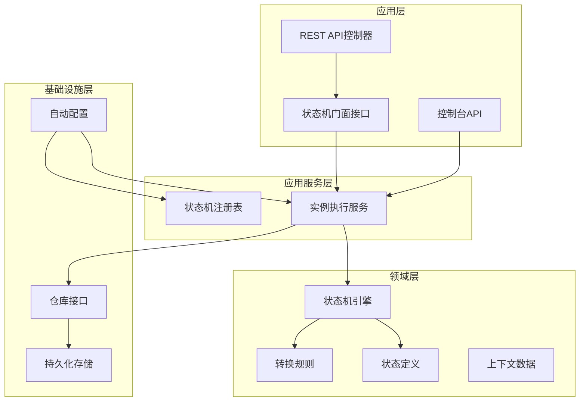
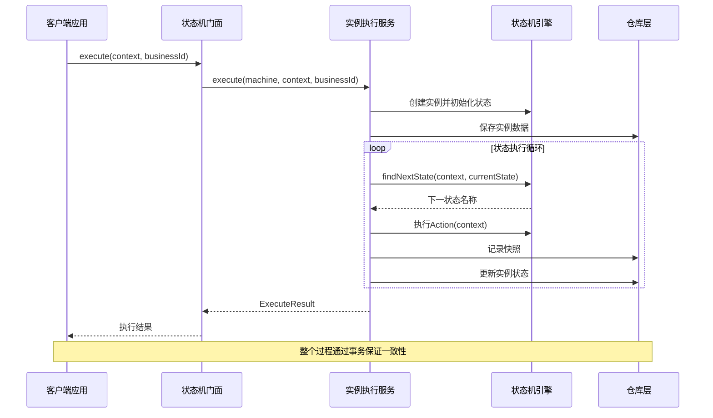
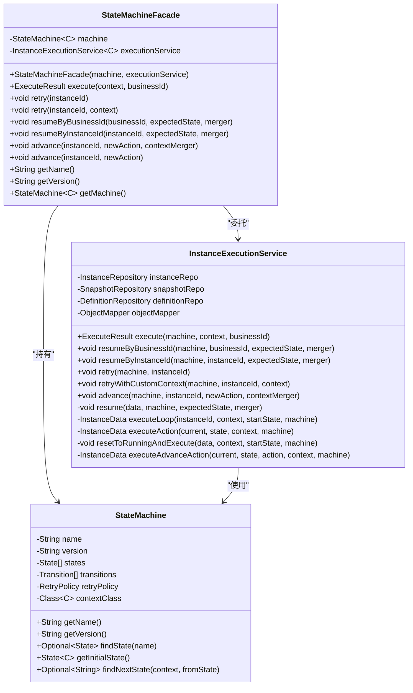
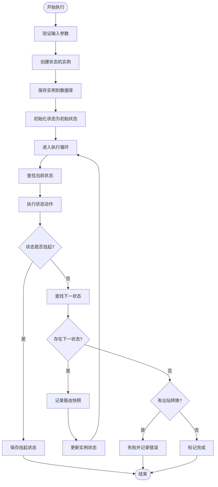
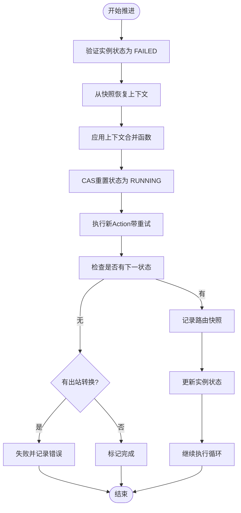
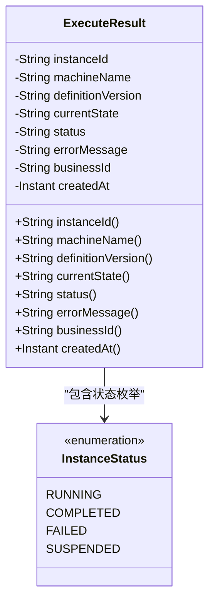
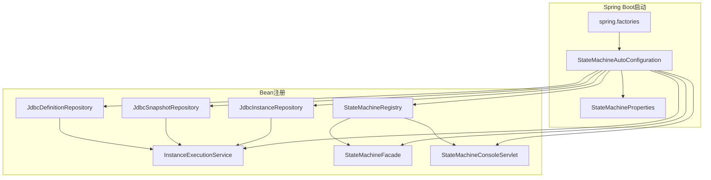

# 状态机门面接口

<cite>
**本文档引用的文件**
- [StateMachineFacade.java](file://state-machine-boot-starter/src/main/java/cn/chedejun/statemachine/interfaces/StateMachineFacade.java)
- [InstanceExecutionService.java](file://state-machine-boot-starter/src/main/java/cn/chedejun/statemachine/application/InstanceExecutionService.java)
- [ExecuteResult.java](file://state-machine-boot-starter/src/main/java/cn/chedejun/statemachine/core/ExecuteResult.java)
- [RetryPolicy.java](file://state-machine-boot-starter/src/main/java/cn/chedejun/statemachine/core/RetryPolicy.java)
- [StateMachine.java](file://state-machine-boot-starter/src/main/java/cn/chedejun/statemachine/domain/engine/StateMachine.java)
- [StateMachineAutoConfiguration.java](file://state-machine-boot-starter/src/main/java/cn/chedejun/statemachine/autoconfigure/StateMachineAutoConfiguration.java)
- [StateMachineBuilder.java](file://state-machine-boot-starter/src/main/java/cn/chedejun/statemachine/core/StateMachineBuilder.java)
- [DemoController.java](file://state-machine-demo/src/main/java/cn/chedejun/demo/controller/DemoController.java)
- [spring.factories](file://state-machine-boot-starter/src/main/resources/META-INF/spring.factories)
- [InstanceId.java](file://state-machine-boot-starter/src/main/java/cn/chedejun/statemachine/domain/shared/InstanceId.java)
- [BusinessId.java](file://state-machine-boot-starter/src/main/java/cn/chedejun/statemachine/domain/shared/BusinessId.java)
- [StateName.java](file://state-machine-boot-starter/src/main/java/cn/chedejun/statemachine/domain/shared/StateName.java)
- [StateMachineIntegrationTest.java](file://state-machine-boot-starter/src/test/java/cn/chedejun/statemachine/integration/StateMachineIntegrationTest.java)
- [StateMachineConsoleServlet.java](file://state-machine-boot-starter/src/main/java/cn/chedejun/statemachine/management/StateMachineConsoleServlet.java)
</cite>

## 目录
1. [简介](#简介)
2. [项目结构](#项目结构)
3. [核心组件](#核心组件)
4. [架构概览](#架构概览)
5. [详细组件分析](#详细组件分析)
6. [依赖关系分析](#依赖关系分析)
7. [性能考虑](#性能考虑)
8. [故障排除指南](#故障排除指南)
9. [结论](#结论)
10. [附录](#附录)

## 简介

状态机门面接口是状态机系统的核心对外API入口，采用门面模式设计，为客户端提供简洁统一的接口，同时隐藏内部复杂的执行逻辑和状态管理细节。该接口主要包含四个核心方法：`execute()`执行方法、`resume()`恢复方法、`retry()`重试方法和`advance()`推进方法，为业务系统提供了完整的状态机生命周期管理能力。

门面模式的应用使得客户端无需了解状态机的内部实现细节，只需要通过简单的API调用即可完成复杂的状态流转控制。新增的`advance()`方法专门用于处理状态机实例执行失败后的特殊情况，允许客户端用新的Action替代原有的失败Action来继续推进执行。

## 项目结构

状态机系统采用分层架构设计，主要分为以下几个层次：



**图表来源**
- [StateMachineFacade.java:1-72](file://state-machine-boot-starter/src/main/java/cn/chedejun/statemachine/interfaces/StateMachineFacade.java#L1-L72)
- [InstanceExecutionService.java:1-437](file://state-machine-boot-starter/src/main/java/cn/chedejun/statemachine/application/InstanceExecutionService.java#L1-L437)
- [StateMachineAutoConfiguration.java:1-149](file://state-machine-boot-starter/src/main/java/cn/chedejun/statemachine/autoconfigure/StateMachineAutoConfiguration.java#L1-L149)

**章节来源**
- [StateMachineFacade.java:1-72](file://state-machine-boot-starter/src/main/java/cn/chedejun/statemachine/interfaces/StateMachineFacade.java#L1-L72)
- [StateMachineAutoConfiguration.java:32-93](file://state-machine-boot-starter/src/main/java/cn/chedejun/statemachine/autoconfigure/StateMachineAutoConfiguration.java#L32-L93)

## 核心组件

### 状态机门面接口

状态机门面接口是整个系统对外的唯一入口点，采用泛型设计支持不同的上下文类型。其核心设计理念包括：

- **向后兼容性**：保持`execute/retry/resume/advance`签名不变，确保现有客户端无需修改
- **委托模式**：将具体实现委托给`InstanceExecutionService`，不直接操作聚合根
- **类型安全**：通过泛型参数确保上下文类型的编译时安全
- **功能完整性**：提供状态机生命周期管理的完整API集合

### 实例执行服务

作为门面接口的真正执行者，负责协调状态机的完整执行流程，包括实例创建、状态流转、快照记录和错误处理等复杂逻辑。新增的`advance()`方法专门处理失败实例的推进逻辑。

### 状态机引擎

承载状态定义、转换规则和重试策略的不可变领域对象，提供状态查询、转换判断和策略计算等功能。

**章节来源**
- [StateMachineFacade.java:17-71](file://state-machine-boot-starter/src/main/java/cn/chedejun/statemachine/interfaces/StateMachineFacade.java#L17-L71)
- [InstanceExecutionService.java:25-42](file://state-machine-boot-starter/src/main/java/cn/chedejun/statemachine/application/InstanceExecutionService.java#L25-L42)
- [StateMachine.java:19-77](file://state-machine-boot-starter/src/main/java/cn/chedejun/statemachine/domain/engine/StateMachine.java#L19-L77)

## 架构概览

状态机门面接口采用典型的三层架构模式，通过依赖注入实现松耦合设计：



**图表来源**
- [StateMachineFacade.java:27-29](file://state-machine-boot-starter/src/main/java/cn/chedejun/statemachine/interfaces/StateMachineFacade.java#L27-L29)
- [InstanceExecutionService.java:44-59](file://state-machine-boot-starter/src/main/java/cn/chedejun/statemachine/application/InstanceExecutionService.java#L44-L59)
- [InstanceExecutionService.java:217-252](file://state-machine-boot-starter/src/main/java/cn/chedejun/statemachine/application/InstanceExecutionService.java#L217-L252)

## 详细组件分析

### 状态机门面接口类图



**图表来源**
- [StateMachineFacade.java:17-71](file://state-machine-boot-starter/src/main/java/cn/chedejun/statemachine/interfaces/StateMachineFacade.java#L17-L71)
- [InstanceExecutionService.java:25-42](file://state-machine-boot-starter/src/main/java/cn/chedejun/statemachine/application/InstanceExecutionService.java#L25-L42)
- [StateMachine.java:19-77](file://state-machine-boot-starter/src/main/java/cn/chedejun/statemachine/domain/engine/StateMachine.java#L19-L77)

### 核心方法详细分析

#### execute() 执行方法

`execute()`方法是状态机门面的核心入口，负责启动一个新的状态机实例执行：

**参数设计**：
- `context`: 泛型上下文对象，包含执行所需的所有业务数据
- `businessId`: 业务标识符，用于关联业务系统中的实体

**返回值处理**：
- 返回`ExecuteResult`对象，包含实例ID、机器名称、版本、最终状态等关键信息
- 便于业务系统直接使用执行结果进行后续处理

**执行流程**：


**图表来源**
- [StateMachineFacade.java:27-29](file://state-machine-boot-starter/src/main/java/cn/chedejun/statemachine/interfaces/StateMachineFacade.java#L27-L29)
- [InstanceExecutionService.java:44-59](file://state-machine-boot-starter/src/main/java/cn/chedejun/statemachine/application/InstanceExecutionService.java#L44-L59)
- [InstanceExecutionService.java:217-252](file://state-machine-boot-starter/src/main/java/cn/chedejun/statemachine/application/InstanceExecutionService.java#L217-L252)

**章节来源**
- [StateMachineFacade.java:27-29](file://state-machine-boot-starter/src/main/java/cn/chedejun/statemachine/interfaces/StateMachineFacade.java#L27-L29)
- [ExecuteResult.java:16-57](file://state-machine-boot-starter/src/main/java/cn/chedejun/statemachine/core/ExecuteResult.java#L16-L57)

#### resume() 恢复方法

恢复方法提供两种重载形式，支持按业务ID或实例ID进行恢复：

**按业务ID恢复** (`resumeByBusinessId`)：
- 通过业务ID查找对应的实例
- 验证期望状态与实际状态的一致性
- 合并上下文数据后继续执行

**按实例ID恢复** (`resumeByInstanceId`)：
- 直接通过实例ID定位实例
- 进行相同的状态验证和上下文合并

**状态验证机制**：
- 恢复前必须确保实例处于挂起状态
- 验证期望状态与实例当前状态完全匹配
- 使用CAS（Compare-And-Swap）机制确保并发安全性

**章节来源**
- [StateMachineFacade.java:39-47](file://state-machine-boot-starter/src/main/java/cn/chedejun/statemachine/interfaces/StateMachineFacade.java#L39-L47)
- [InstanceExecutionService.java:61-73](file://state-machine-boot-starter/src/main/java/cn/chedejun/statemachine/application/InstanceExecutionService.java#L61-L73)
- [InstanceExecutionService.java:184-211](file://state-machine-boot-starter/src/main/java/cn/chedejun/statemachine/application/InstanceExecutionService.java#L184-L211)

#### retry() 重试方法

重试方法提供三种重载形式，满足不同的重试场景：

**基础重试** (`retry(instanceId)`)：
- 仅适用于状态为`FAILED`的实例
- 自动从最后失败的快照中恢复上下文
- 重新执行失败的状态动作

**自定义上下文重试** (`retry(instanceId, context)`)：
- 允许客户端提供新的上下文数据
- 适用于需要修改业务数据后再重试的场景

**重试策略**：
- 支持指数退避重试策略
- 最大重试次数可配置
- 每次重试间隔递增

**章节来源**
- [StateMachineFacade.java:31-37](file://state-machine-boot-starter/src/main/java/cn/chedejun/statemachine/interfaces/StateMachineFacade.java#L31-L37)
- [InstanceExecutionService.java:75-115](file://state-machine-boot-starter/src/main/java/cn/chedejun/statemachine/application/InstanceExecutionService.java#L75-L115)
- [RetryPolicy.java:5-45](file://state-machine-boot-starter/src/main/java/cn/chedejun/statemachine/core/RetryPolicy.java#L5-L45)

#### advance() 推进方法

**新增功能**：`advance()`方法是本次更新新增的核心功能，专门用于处理状态机实例执行失败后的推进操作。

**方法重载**：
- `advance(instanceId, newAction, contextMerger)`: 完整版本，支持自定义Action和上下文合并
- `advance(instanceId, newAction)`: 简化版本，不调整上下文

**参数设计**：
- `instanceId`: 失败实例的唯一标识符
- `newAction`: 新的Action实现，用于替代原有的失败Action
- `contextMerger`: 上下文合并函数，用于调整恢复后的上下文数据

**前置条件**：
- 实例状态必须为`FAILED`
- 实例必须是第一次被推进（避免重复推进）

**执行流程**：


**应用场景**：
- Action执行失败（非原子操作）后，业务数据已手动修复
- 需要用新的Action替代原失败Action来继续流转
- 控制台调试和测试场景

**章节来源**
- [StateMachineFacade.java:49-66](file://state-machine-boot-starter/src/main/java/cn/chedejun/statemachine/interfaces/StateMachineFacade.java#L49-L66)
- [InstanceExecutionService.java:126-179](file://state-machine-boot-starter/src/main/java/cn/chedejun/statemachine/application/InstanceExecutionService.java#L126-L179)
- [InstanceExecutionService.java:298-340](file://state-machine-boot-starter/src/main/java/cn/chedejun/statemachine/application/InstanceExecutionService.java#L298-L340)

### 执行结果模型

`ExecuteResult`类封装了状态机执行的关键信息，为客户端提供统一的结果格式：



**图表来源**
- [ExecuteResult.java:16-57](file://state-machine-boot-starter/src/main/java/cn/chedejun/statemachine/core/ExecuteResult.java#L16-L57)

**章节来源**
- [ExecuteResult.java:16-57](file://state-machine-boot-starter/src/main/java/cn/chedejun/statemachine/core/ExecuteResult.java#L16-L57)

## 依赖关系分析

### 自动配置机制

状态机系统通过Spring Boot自动配置实现无缝集成：



**图表来源**
- [StateMachineAutoConfiguration.java:32-93](file://state-machine-boot-starter/src/main/java/cn/chedejun/statemachine/autoconfigure/StateMachineAutoConfiguration.java#L32-L93)
- [spring.factories:1-3](file://state-machine-boot-starter/src/main/resources/META-INF/spring.factories#L1-L3)

### 依赖注入关系

状态机门面接口通过构造函数注入依赖，实现松耦合设计：

**章节来源**
- [StateMachineFacade.java:22-25](file://state-machine-boot-starter/src/main/java/cn/chedejun/statemachine/interfaces/StateMachineFacade.java#L22-L25)
- [StateMachineAutoConfiguration.java:64-93](file://state-machine-boot-starter/src/main/java/cn/chedejun/statemachine/autoconfigure/StateMachineAutoConfiguration.java#L64-L93)

## 性能考虑

### 并发控制

系统采用多种机制确保并发安全性：

1. **CAS操作**：恢复和推进操作使用数据库级别的CAS确保并发安全
2. **乐观锁**：实例状态更新采用乐观锁机制
3. **线程安全**：重试策略使用线程睡眠实现非阻塞等待
4. **状态检查**：推进操作前验证实例状态，避免重复推进

### 缓存策略

- **状态机定义缓存**：通过`StateMachineRegistry`缓存已注册的状态机定义
- **实例状态缓存**：最近使用的实例状态在内存中缓存
- **快照数据优化**：只缓存必要的上下文数据，排除ADVANCE类型快照

### 性能监控

系统内置了完善的性能监控机制：

- **执行时间统计**：记录每个状态的执行耗时
- **重试次数跟踪**：监控重试行为和成功率
- **错误率统计**：跟踪失败状态和错误类型分布
- **推进操作监控**：记录ADVANCE操作的成功率和耗时

## 故障排除指南

### 常见异常类型

**状态机异常** (`StateMachineException`)：
- 状态未找到：当状态机定义中不存在指定状态时抛出
- 实例不存在：当操作不存在的实例时抛出
- 状态不匹配：恢复时期望状态与实际状态不一致
- 非失败状态推进：只有状态为`FAILED`的实例才能执行advance操作

**推进异常**：
- 已推进实例：实例已被推进过，无法再次推进
- 非失败状态推进：实例状态不是FAILED时无法执行advance
- 快照缺失：找不到合适的快照数据进行上下文恢复

### 调试建议

1. **检查状态机定义**：确认状态和转换规则正确配置
2. **验证上下文数据**：确保传递的上下文数据符合预期
3. **监控数据库状态**：检查实例表和快照表的数据一致性
4. **查看日志输出**：关注状态机执行过程中的详细日志
5. **验证推进时机**：确保在业务数据修复后再执行advance操作

**章节来源**
- [InstanceExecutionService.java:129-148](file://state-machine-boot-starter/src/main/java/cn/chedejun/statemachine/application/InstanceExecutionService.java#L129-L148)
- [InstanceExecutionService.java:147-148](file://state-machine-boot-starter/src/main/java/cn/chedejun/statemachine/application/InstanceExecutionService.java#L147-L148)

## 结论

状态机门面接口通过精心设计的门面模式，成功地将复杂的状态机执行逻辑封装起来，为客户端提供了简洁易用的API。本次更新新增的`advance()`方法进一步完善了状态机的生命周期管理能力，专门处理执行失败后的特殊情况。

该设计的主要优势包括：

1. **简化客户端使用**：通过统一的API入口隐藏内部复杂性
2. **强类型安全**：泛型设计确保编译时类型安全
3. **灵活的扩展性**：支持不同的上下文类型和重试策略
4. **完善的错误处理**：提供详细的异常信息和恢复机制
5. **自动配置支持**：无缝集成Spring Boot生态系统
6. **功能完整性**：提供状态机生命周期管理的完整API集合
7. **特殊场景支持**：新增的advance方法专门处理失败实例的推进

该接口不仅满足了当前的功能需求，还为未来的功能扩展和性能优化奠定了良好的基础。

## 附录

### 使用示例

#### 基本执行流程

```java
// 创建状态机门面实例
StateMachineFacade<MyContext> facade = new StateMachineFacade<>(machine, executionService);

// 准备上下文数据
MyContext context = new MyContext();
context.setBusinessData("value");

// 执行状态机
ExecuteResult result = facade.execute(context, "business-id-001");

// 处理执行结果
System.out.println("实例ID: " + result.instanceId());
System.out.println("最终状态: " + result.status());
```

#### 恢复执行示例

```java
// 按业务ID恢复
facade.resumeByBusinessId("business-id-001", "wait-approval", ctx -> {
    ctx.setApprovalResult("approved");
});

// 按实例ID恢复
facade.resumeByInstanceId(result.instanceId(), "wait-approval", ctx -> {
    ctx.setApprovalResult("rejected");
    ctx.setReason("missing documents");
});
```

#### 重试机制示例

```java
// 基础重试
facade.retry("instance-id-001");

// 自定义上下文重试
MyContext newContext = new MyContext();
newContext.setBusinessData("corrected-value");
facade.retry("instance-id-001", newContext);
```

#### 推进功能示例

```java
// 使用新Action推进失败实例
facade.advance("failed-instance-id", context -> {
    // 新的Action实现，替代原有的失败Action
    // 例如：修复业务数据后重新执行
    context.setProcessed(true);
    context.setErrorMessage(null);
}, context -> {
    // 可选：调整上下文数据
    context.setRetriedCount(context.getRetriedCount() + 1);
});

// 简化版本：不调整上下文
facade.advance("failed-instance-id", context -> {
    context.setProcessed(true);
});
```

### 最佳实践

1. **合理设计状态机**：确保状态和转换规则清晰明确
2. **正确处理异常**：在业务逻辑中妥善处理状态机异常
3. **监控执行状态**：定期检查实例状态和执行性能
4. **配置合适的重试策略**：根据业务特点调整重试次数和间隔
5. **使用业务ID关联**：通过业务ID建立与业务系统的关联关系
6. **谨慎使用推进功能**：确保业务数据已修复后再执行advance操作
7. **监控推进效果**：跟踪advance操作的成功率和业务影响
8. **控制台上调试**：利用控制台API进行测试和调试