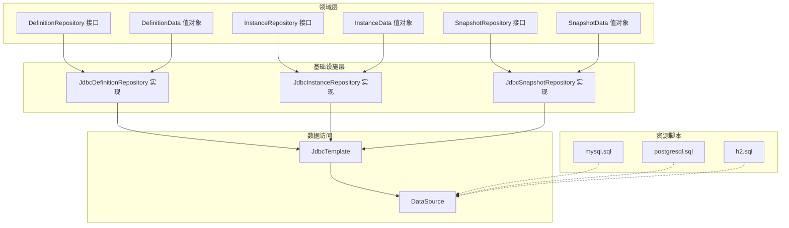
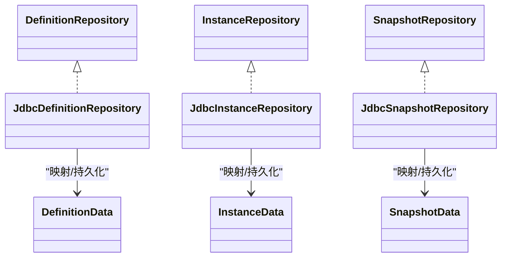
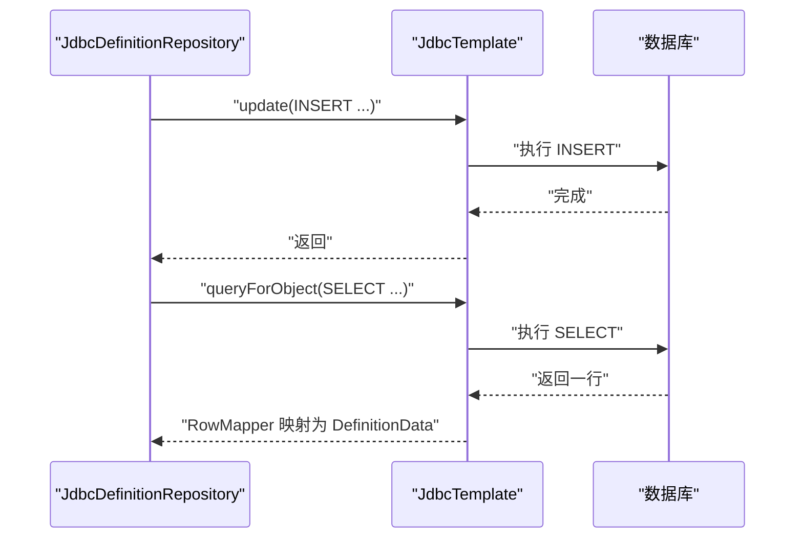
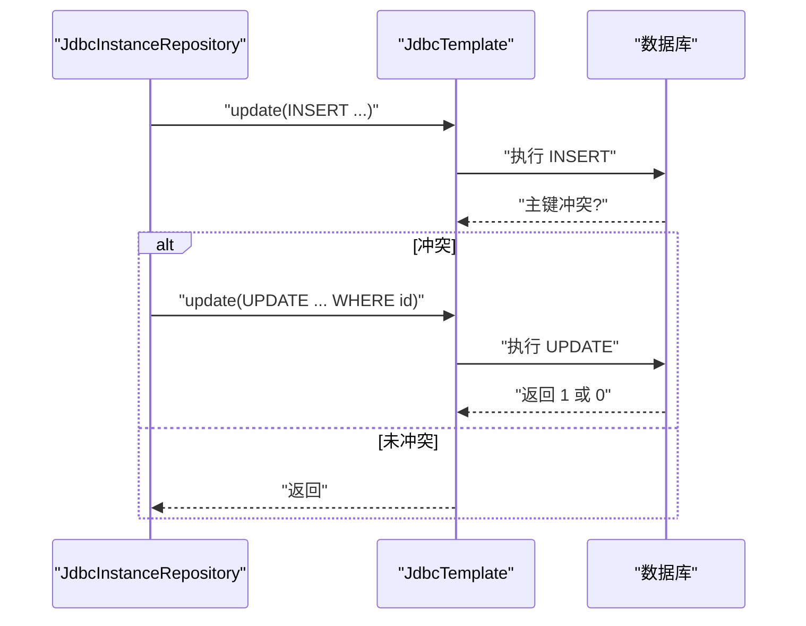
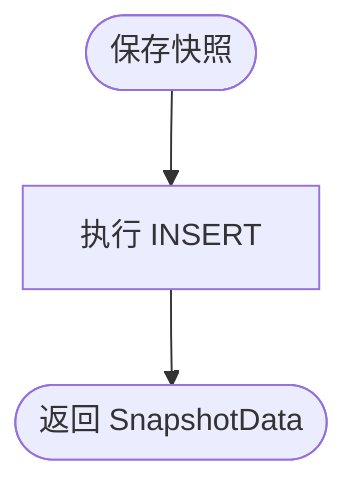
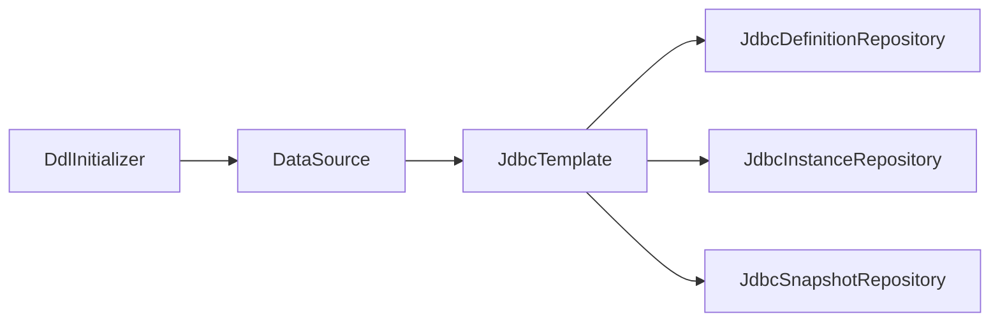

# JDBC实现

<cite>
**本文引用的文件**
- [JdbcDefinitionRepository.java](file://state-machine-boot-starter/src/main/java/cn/chedejun/statemachine/infrastructure/persistence/JdbcDefinitionRepository.java)
- [JdbcInstanceRepository.java](file://state-machine-boot-starter/src/main/java/cn/chedejun/statemachine/infrastructure/persistence/JdbcInstanceRepository.java)
- [JdbcSnapshotRepository.java](file://state-machine-boot-starter/src/main/java/cn/chedejun/statemachine/infrastructure/persistence/JdbcSnapshotRepository.java)
- [DefinitionRepository.java](file://state-machine-boot-starter/src/main/java/cn/chedejun/statemachine/domain/repository/DefinitionRepository.java)
- [InstanceRepository.java](file://state-machine-boot-starter/src/main/java/cn/chedejun/statemachine/domain/repository/InstanceRepository.java)
- [SnapshotRepository.java](file://state-machine-boot-starter/src/main/java/cn/chedejun/statemachine/domain/repository/SnapshotRepository.java)
- [DefinitionData.java](file://state-machine-boot-starter/src/main/java/cn/chedejun/statemachine/domain/data/DefinitionData.java)
- [InstanceData.java](file://state-machine-boot-starter/src/main/java/cn/chedejun/statemachine/domain/data/InstanceData.java)
- [SnapshotData.java](file://state-machine-boot-starter/src/main/java/cn/chedejun/statemachine/domain/data/SnapshotData.java)
- [mysql.sql](file://state-machine-boot-starter/src/main/resources/ddl/mysql.sql)
- [postgresql.sql](file://state-machine-boot-starter/src/main/resources/ddl/postgresql.sql)
- [h2.sql](file://state-machine-boot-starter/src/main/resources/ddl/h2.sql)
- [DdlInitializer.java](file://state-machine-boot-starter/src/main/java/cn/chedejun/statemachine/persistence/DdlInitializer.java)
- [StateMachineIntegrationTest.java](file://state-machine-boot-starter/src/test/java/cn/chedejun/statemachine/integration/StateMachineIntegrationTest.java)
- [application.yml](file://state-machine-boot-starter/src/test/resources/application.yml)
</cite>

## 目录
1. [简介](#简介)
2. [项目结构](#项目结构)
3. [核心组件](#核心组件)
4. [架构总览](#架构总览)
5. [详细组件分析](#详细组件分析)
6. [依赖关系分析](#依赖关系分析)
7. [性能考量](#性能考量)
8. [故障排除指南](#故障排除指南)
9. [结论](#结论)
10. [附录](#附录)

## 简介
本文件系统性梳理并解读基于 Spring JDBC 的状态机持久化实现，重点覆盖以下三个仓库类：
- JdbcDefinitionRepository：定义（Definition）持久化与查询
- JdbcInstanceRepository：实例（Instance）持久化、查询与状态变更
- JdbcSnapshotRepository：快照（Snapshot）持久化与查询

文档从 SQL 设计、参数绑定、结果集映射、连接与事务、异常处理、性能优化、数据类型映射与 JSON 序列化、连接池配置与数据库调优、以及故障排除等方面进行深入分析，并辅以图示帮助理解。

## 项目结构
JDBC 实现位于基础设施层，采用 Spring JdbcTemplate 进行 SQL 执行与结果映射；DDL 脚本分别提供 MySQL、PostgreSQL 与 H2 的建表语句；测试用例展示了在真实数据库上的集成验证流程。

图表来源
- [JdbcDefinitionRepository.java:1-119](file://state-machine-boot-starter/src/main/java/cn/chedejun/statemachine/infrastructure/persistence/JdbcDefinitionRepository.java#L1-L119)
- [JdbcInstanceRepository.java:1-164](file://state-machine-boot-starter/src/main/java/cn/chedejun/statemachine/infrastructure/persistence/JdbcInstanceRepository.java#L1-L164)
- [JdbcSnapshotRepository.java:1-107](file://state-machine-boot-starter/src/main/java/cn/chedejun/statemachine/infrastructure/persistence/JdbcSnapshotRepository.java#L1-L107)
- [mysql.sql:1-19](file://state-machine-boot-starter/src/main/resources/ddl/mysql.sql#L1-L19)
- [postgresql.sql:1-19](file://state-machine-boot-starter/src/main/resources/ddl/postgresql.sql#L1-L19)
- [h2.sql:1-19](file://state-machine-boot-starter/src/main/resources/ddl/h2.sql#L1-L19)

章节来源
- [JdbcDefinitionRepository.java:1-119](file://state-machine-boot-starter/src/main/java/cn/chedejun/statemachine/infrastructure/persistence/JdbcDefinitionRepository.java#L1-L119)
- [JdbcInstanceRepository.java:1-164](file://state-machine-boot-starter/src/main/java/cn/chedejun/statemachine/infrastructure/persistence/JdbcInstanceRepository.java#L1-L164)
- [JdbcSnapshotRepository.java:1-107](file://state-machine-boot-starter/src/main/java/cn/chedejun/statemachine/infrastructure/persistence/JdbcSnapshotRepository.java#L1-L107)
- [mysql.sql:1-19](file://state-machine-boot-starter/src/main/resources/ddl/mysql.sql#L1-L19)
- [postgresql.sql:1-19](file://state-machine-boot-starter/src/main/resources/ddl/postgresql.sql#L1-L19)
- [h2.sql:1-19](file://state-machine-boot-starter/src/main/resources/ddl/h2.sql#L1-L19)

## 核心组件
- JdbcDefinitionRepository：负责状态机定义的保存、更新、按名称+版本查询、按名称查询全部版本、全量查询；内部根据数据库类型选择合适的 JSON 列类型写入方式。
- JdbcInstanceRepository：负责实例的保存（含 UPSERT）、按主键与业务 ID 查询、状态变更（如从挂起恢复为运行）、分页查询与统计、带过滤条件的查询。
- JdbcSnapshotRepository：负责快照的保存与按实例 ID 查询，支持按执行时间与尝试次数排序；同样具备数据库类型感知的 JSON 写入。

章节来源
- [JdbcDefinitionRepository.java:18-119](file://state-machine-boot-starter/src/main/java/cn/chedejun/statemachine/infrastructure/persistence/JdbcDefinitionRepository.java#L18-L119)
- [JdbcInstanceRepository.java:16-164](file://state-machine-boot-starter/src/main/java/cn/chedejun/statemachine/infrastructure/persistence/JdbcInstanceRepository.java#L16-L164)
- [JdbcSnapshotRepository.java:18-107](file://state-machine-boot-starter/src/main/java/cn/chedejun/statemachine/infrastructure/persistence/JdbcSnapshotRepository.java#L18-L107)

## 架构总览
下图展示三个仓库类与领域数据模型之间的关系，以及它们如何通过 JdbcTemplate 访问数据库。

图表来源
- [DefinitionRepository.java:1-16](file://state-machine-boot-starter/src/main/java/cn/chedejun/statemachine/domain/repository/DefinitionRepository.java#L1-L16)
- [JdbcDefinitionRepository.java:18-119](file://state-machine-boot-starter/src/main/java/cn/chedejun/statemachine/infrastructure/persistence/JdbcDefinitionRepository.java#L18-L119)
- [DefinitionData.java:1-46](file://state-machine-boot-starter/src/main/java/cn/chedejun/statemachine/domain/data/DefinitionData.java#L1-L46)
- [InstanceRepository.java:1-26](file://state-machine-boot-starter/src/main/java/cn/chedejun/statemachine/domain/repository/InstanceRepository.java#L1-L26)
- [JdbcInstanceRepository.java:16-164](file://state-machine-boot-starter/src/main/java/cn/chedejun/statemachine/infrastructure/persistence/JdbcInstanceRepository.java#L16-L164)
- [InstanceData.java:1-79](file://state-machine-boot-starter/src/main/java/cn/chedejun/statemachine/domain/data/InstanceData.java#L1-L79)
- [SnapshotRepository.java:1-16](file://state-machine-boot-starter/src/main/java/cn/chedejun/statemachine/domain/repository/SnapshotRepository.java#L1-L16)
- [JdbcSnapshotRepository.java:18-107](file://state-machine-boot-starter/src/main/java/cn/chedejun/statemachine/infrastructure/persistence/JdbcSnapshotRepository.java#L18-L107)
- [SnapshotData.java:1-56](file://state-machine-boot-starter/src/main/java/cn/chedejun/statemachine/domain/data/SnapshotData.java#L1-L56)

## 详细组件分析

### JdbcDefinitionRepository 分析
- SQL 设计要点
  - 定义表包含主键 id 与唯一键 name+version，便于按机器名与版本检索与去重。
  - JSON 字段使用 JSON/JSONB/CLOB，依据数据库类型自动选择。
- 参数绑定
  - 使用 PreparedStatement 回调设置字符串与 JSON 字段；JSON 写入区分 PostgreSQL 与其他数据库。
- 结果集映射
  - RowMapper 将数据库列映射到 DefinitionData 值对象，包含注册时间等字段。
- 异常处理
  - 查询单条记录时捕获异常并返回空值，保证幂等与容错。
- 数据库类型感知
  - 首次检测数据库产品名，缓存结果，避免重复反射开销。

图表来源
- [JdbcDefinitionRepository.java:29-81](file://state-machine-boot-starter/src/main/java/cn/chedejun/statemachine/infrastructure/persistence/JdbcDefinitionRepository.java#L29-L81)
- [JdbcDefinitionRepository.java:108-117](file://state-machine-boot-starter/src/main/java/cn/chedejun/statemachine/infrastructure/persistence/JdbcDefinitionRepository.java#L108-L117)

章节来源
- [JdbcDefinitionRepository.java:18-119](file://state-machine-boot-starter/src/main/java/cn/chedejun/statemachine/infrastructure/persistence/JdbcDefinitionRepository.java#L18-L119)
- [mysql.sql:1-5](file://state-machine-boot-starter/src/main/resources/ddl/mysql.sql#L1-L5)
- [postgresql.sql:1-4](file://state-machine-boot-starter/src/main/resources/ddl/postgresql.sql#L1-L4)
- [h2.sql:1-4](file://state-machine-boot-starter/src/main/resources/ddl/h2.sql#L1-L4)

### JdbcInstanceRepository 分析
- SQL 设计要点
  - 实例表包含主键 id、外键 definition_id、机器名、当前状态、业务 ID、重试次数、下次重试时间、错误信息、创建与更新时间等。
  - 提供多种查询：按主键、按机器名+业务 ID、分页列表、按状态统计与列表、带多条件过滤的查询。
- 参数绑定
  - 使用 PreparedStatement 回调设置字符串、整型、时间戳等；对可空时间戳进行空值处理。
- 结果集映射
  - RowMapper 将数据库列映射到 InstanceData 值对象，包含状态枚举、业务 ID 可空等。
- UPSERT 逻辑
  - 先尝试插入，若主键冲突则执行更新，避免“先查后写”的并发竞态。
- 状态变更
  - 原子式状态变更：仅当实例处于特定状态时才允许切换，返回受影响行数用于判断是否成功。

图表来源
- [JdbcInstanceRepository.java:47-87](file://state-machine-boot-starter/src/main/java/cn/chedejun/statemachine/infrastructure/persistence/JdbcInstanceRepository.java#L47-L87)

章节来源
- [JdbcInstanceRepository.java:16-164](file://state-machine-boot-starter/src/main/java/cn/chedejun/statemachine/infrastructure/persistence/JdbcInstanceRepository.java#L16-L164)
- [mysql.sql:6-12](file://state-machine-boot-starter/src/main/resources/ddl/mysql.sql#L6-L12)
- [postgresql.sql:6-12](file://state-machine-boot-starter/src/main/resources/ddl/postgresql.sql#L6-L12)
- [h2.sql:6-12](file://state-machine-boot-starter/src/main/resources/ddl/h2.sql#L6-L12)

### JdbcSnapshotRepository 分析
- SQL 设计要点
  - 快照表包含主键 id、实例 id、状态名、输入输出 JSON、状态枚举、错误信息、尝试次数、快照类型、执行时间。
  - 按执行时间与尝试次数排序，便于回溯与重放。
- 参数绑定
  - JSON 字段写入遵循数据库类型感知策略；时间戳统一使用 Timestamp.from。
- 结果集映射
  - RowMapper 将数据库列映射到 SnapshotData 值对象，包含枚举与时间戳。
- 错误处理
  - 查询单条记录时捕获异常并返回空值，保证健壮性。

图表来源
- [JdbcSnapshotRepository.java:33-51](file://state-machine-boot-starter/src/main/java/cn/chedejun/statemachine/infrastructure/persistence/JdbcSnapshotRepository.java#L33-L51)
- [JdbcSnapshotRepository.java:93-105](file://state-machine-boot-starter/src/main/java/cn/chedejun/statemachine/infrastructure/persistence/JdbcSnapshotRepository.java#L93-L105)

章节来源
- [JdbcSnapshotRepository.java:18-107](file://state-machine-boot-starter/src/main/java/cn/chedejun/statemachine/infrastructure/persistence/JdbcSnapshotRepository.java#L18-L107)
- [mysql.sql:13-19](file://state-machine-boot-starter/src/main/resources/ddl/mysql.sql#L13-L19)
- [postgresql.sql:13-19](file://state-machine-boot-starter/src/main/resources/ddl/postgresql.sql#L13-L19)
- [h2.sql:13-19](file://state-machine-boot-starter/src/main/resources/ddl/h2.sql#L13-L19)

## 依赖关系分析
- 三个仓库类均依赖 JdbcTemplate，通过 Spring Boot 自动装配注入。
- DdlInitializer 在启动阶段根据数据源 URL 自动识别数据库类型并执行对应 DDL。
- 测试用例通过 Spring Boot 测试加载自动配置，验证仓库类在真实数据库中的行为。

图表来源
- [DdlInitializer.java:11-65](file://state-machine-boot-starter/src/main/java/cn/chedejun/statemachine/persistence/DdlInitializer.java#L11-L65)
- [JdbcDefinitionRepository.java:20](file://state-machine-boot-starter/src/main/java/cn/chedejun/statemachine/infrastructure/persistence/JdbcDefinitionRepository.java#L20)
- [JdbcInstanceRepository.java:18](file://state-machine-boot-starter/src/main/java/cn/chedejun/statemachine/infrastructure/persistence/JdbcInstanceRepository.java#L18)
- [JdbcSnapshotRepository.java:20](file://state-machine-boot-starter/src/main/java/cn/chedejun/statemachine/infrastructure/persistence/JdbcSnapshotRepository.java#L20)

章节来源
- [DdlInitializer.java:11-65](file://state-machine-boot-starter/src/main/java/cn/chedejun/statemachine/persistence/DdlInitializer.java#L11-L65)
- [StateMachineIntegrationTest.java:58-71](file://state-machine-boot-starter/src/test/java/cn/chedejun/statemachine/integration/StateMachineIntegrationTest.java#L58-L71)

## 性能考量
- 索引与查询优化
  - 定义表：name+version 唯一键，支持按名称与版本快速定位；查询按注册时间倒序或按名称+版本精确匹配。
  - 实例表：machine_name 上应建立索引以支撑高频按机器名查询；business_id 上可考虑索引以支持业务 ID 唯一性查询。
  - 快照表：按 instance_id 排序查询，建议在 instance_id 上建立索引；按 executed_at 与 attempt 排序，确保排序字段有合适索引。
- 批量操作
  - 当前实现以单条写入为主；对于高吞吐场景，可考虑批量插入与批量更新，减少往返与锁竞争。
- JSON 字段
  - MySQL 使用 JSON 列，PostgreSQL 使用 JSONB 列；JSONB 在查询与存储上通常更高效。
- 时间戳
  - 统一使用 Timestamp.from(Instant)，避免时区与精度差异带来的问题。
- UPSERT
  - 实例保存采用先插入后更新的策略，避免并发竞态；可结合数据库特性（如 MySQL 的 ON DUPLICATE KEY UPDATE）进一步优化。
- 连接池与事务
  - 建议使用连接池（如 HikariCP），合理设置最大连接数、空闲超时、连接生命周期等参数；JDBC 默认不开启自动提交，需在服务层显式控制事务边界。

[本节为通用性能建议，不直接分析具体文件，故无章节来源]

## 故障排除指南
- 主键冲突（DuplicateKeyException）
  - 实例保存时可能触发主键冲突，仓库内已捕获并回退为更新逻辑；若仍出现异常，检查主键生成策略与并发写入情况。
- 查询为空
  - 定义与快照的单条查询在异常时返回空值；若业务期望必须存在，应在上层进行非空校验并抛出业务异常。
- JSON 写入异常
  - 不同数据库对 JSON 列的写入方式不同：PostgreSQL 使用 setObject(Types.OTHER)，MySQL 使用 setString；若写入失败，请确认数据库类型检测逻辑与表结构一致。
- 分页与过滤
  - 实例查询支持多条件过滤与分页；若查询结果异常，检查 SQL 拼接与参数顺序，确保过滤条件与排序字段正确。
- 数据库类型识别
  - DdlInitializer 会根据数据源 URL 识别数据库类型；若识别错误，可能导致 DDL 不匹配；可通过手动指定 DDL 策略或修正 URL。

章节来源
- [JdbcInstanceRepository.java:65-87](file://state-machine-boot-starter/src/main/java/cn/chedejun/statemachine/infrastructure/persistence/JdbcInstanceRepository.java#L65-L87)
- [JdbcDefinitionRepository.java:83-93](file://state-machine-boot-starter/src/main/java/cn/chedejun/statemachine/infrastructure/persistence/JdbcDefinitionRepository.java#L83-L93)
- [JdbcSnapshotRepository.java:63-71](file://state-machine-boot-starter/src/main/java/cn/chedejun/statemachine/infrastructure/persistence/JdbcSnapshotRepository.java#L63-L71)
- [DdlInitializer.java:57-64](file://state-machine-boot-starter/src/main/java/cn/chedejun/statemachine/persistence/DdlInitializer.java#L57-L64)

## 结论
该 JDBC 实现以清晰的职责划分与良好的错误处理策略，提供了状态机定义、实例与快照的完整持久化能力。通过数据库类型感知与 RowMapper 映射，实现了跨数据库的兼容性与稳定的读写体验。建议在生产环境中配合连接池与合理的索引策略，持续监控慢查询与锁等待，以获得更佳的吞吐与延迟表现。

[本节为总结性内容，不直接分析具体文件，故无章节来源]

## 附录

### SQL 与数据模型概览
- 定义表（state_machine_definitions）
  - 主键 id，唯一键 name+version，JSON/JSONB 字段存储状态与转换定义，注册时间默认当前时间。
- 实例表（state_machine_instances）
  - 主键 id，外键 definition_id，机器名、定义版本、当前状态、业务 ID、状态枚举、重试次数、下次重试时间、错误信息、创建与更新时间。
- 快照表（state_machine_snapshots）
  - 主键 id，实例 id、状态名、输入输出 JSON、状态枚举、错误信息、尝试次数、快照类型、执行时间。

章节来源
- [mysql.sql:1-19](file://state-machine-boot-starter/src/main/resources/ddl/mysql.sql#L1-L19)
- [postgresql.sql:1-19](file://state-machine-boot-starter/src/main/resources/ddl/postgresql.sql#L1-L19)
- [h2.sql:1-19](file://state-machine-boot-starter/src/main/resources/ddl/h2.sql#L1-L19)

### 配置与测试参考
- 测试环境配置示例（application.yml）展示了 MySQL 数据源与相关属性。
- 集成测试通过 Spring Boot 自动装配加载仓库与服务，验证端到端执行流程与数据落库。

章节来源
- [application.yml:1-14](file://state-machine-boot-starter/src/test/resources/application.yml#L1-L14)
- [StateMachineIntegrationTest.java:58-71](file://state-machine-boot-starter/src/test/java/cn/chedejun/statemachine/integration/StateMachineIntegrationTest.java#L58-L71)