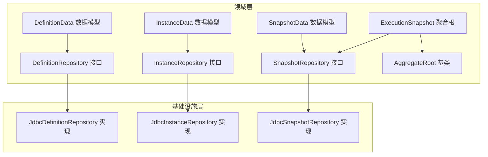
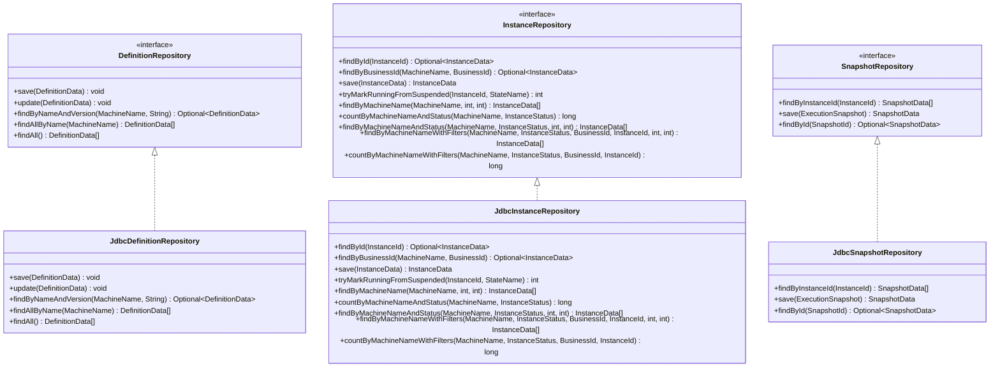
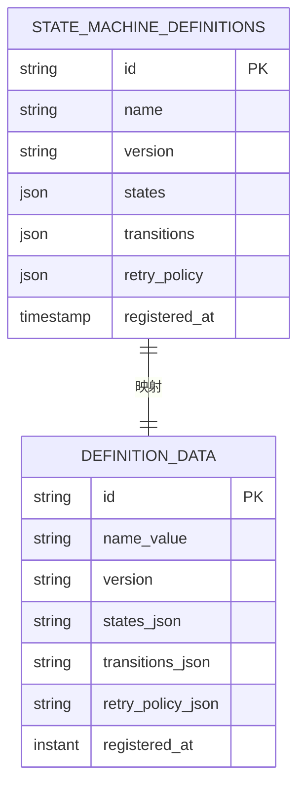
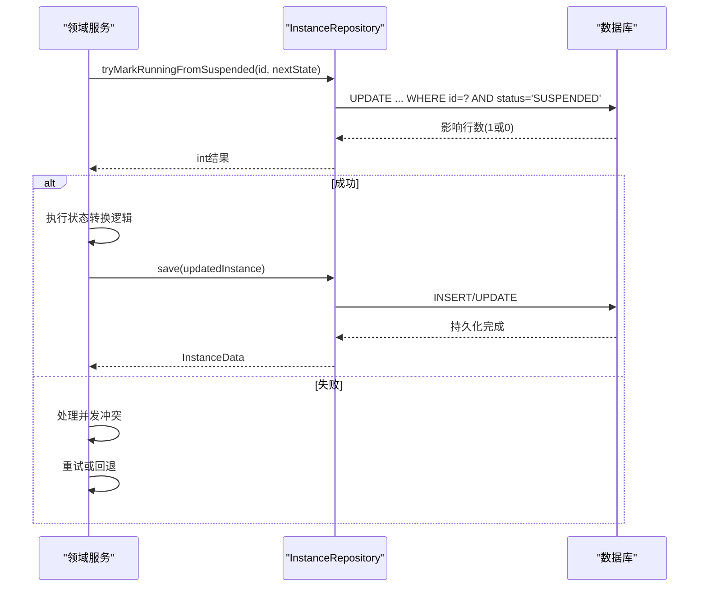
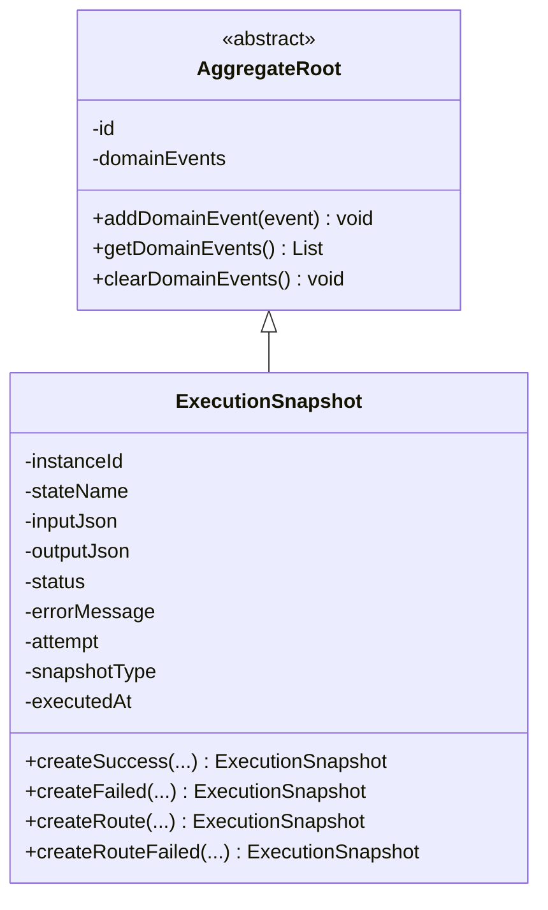
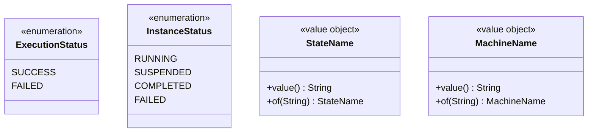
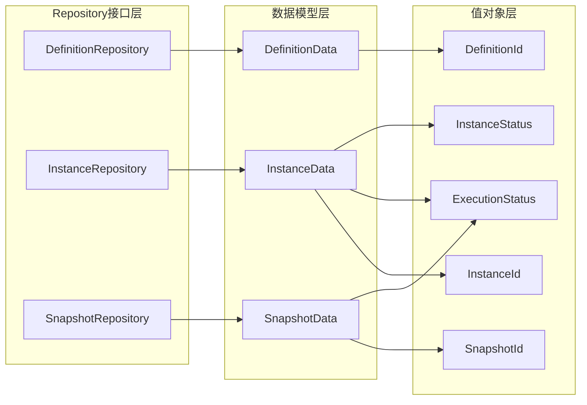

# Repository接口设计

<cite>
**本文档引用的文件**
- [DefinitionRepository.java](file://state-machine-boot-starter/src/main/java/cn/chedejun/statemachine/domain/repository/DefinitionRepository.java)
- [InstanceRepository.java](file://state-machine-boot-starter/src/main/java/cn/chedejun/statemachine/domain/repository/InstanceRepository.java)
- [SnapshotRepository.java](file://state-machine-boot-starter/src/main/java/cn/chedejun/statemachine/domain/repository/SnapshotRepository.java)
- [JdbcDefinitionRepository.java](file://state-machine-boot-starter/src/main/java/cn/chedejun/statemachine/infrastructure/persistence/JdbcDefinitionRepository.java)
- [JdbcInstanceRepository.java](file://state-machine-boot-starter/src/main/java/cn/chedejun/statemachine/infrastructure/persistence/JdbcInstanceRepository.java)
- [JdbcSnapshotRepository.java](file://state-machine-boot-starter/src/main/java/cn/chedejun/statemachine/infrastructure/persistence/JdbcSnapshotRepository.java)
- [DefinitionData.java](file://state-machine-boot-starter/src/main/java/cn/chedejun/statemachine/domain/data/DefinitionData.java)
- [InstanceData.java](file://state-machine-boot-starter/src/main/java/cn/chedejun/statemachine/domain/data/InstanceData.java)
- [SnapshotData.java](file://state-machine-boot-starter/src/main/java/cn/chedejun/statemachine/domain/data/SnapshotData.java)
- [ExecutionSnapshot.java](file://state-machine-boot-starter/src/main/java/cn/chedejun/statemachine/domain/snapshot/ExecutionSnapshot.java)
- [AggregateRoot.java](file://state-machine-boot-starter/src/main/java/cn/chedejun/statemachine/domain/shared/AggregateRoot.java)
- [DefinitionId.java](file://state-machine-boot-starter/src/main/java/cn/chedejun/statemachine/domain/shared/DefinitionId.java)
- [InstanceId.java](file://state-machine-boot-starter/src/main/java/cn/chedejun/statemachine/domain/shared/InstanceId.java)
- [SnapshotId.java](file://state-machine-boot-starter/src/main/java/cn/chedejun/statemachine/domain/shared/SnapshotId.java)
- [ExecutionStatus.java](file://state-machine-boot-starter/src/main/java/cn/chedejun/statemachine/domain/shared/ExecutionStatus.java)
- [InstanceStatus.java](file://state-machine-boot-starter/src/main/java/cn/chedejun/statemachine/domain/shared/InstanceStatus.java)
</cite>

## 目录
1. [引言](#引言)
2. [项目结构](#项目结构)
3. [核心组件](#核心组件)
4. [架构概览](#架构概览)
5. [详细组件分析](#详细组件分析)
6. [依赖分析](#依赖分析)
7. [性能考虑](#性能考虑)
8. [故障排除指南](#故障排除指南)
9. [结论](#结论)

## 引言

本文件深入解析DDD架构中Repository模式的设计理念与实现。Repository作为领域驱动设计的核心抽象，负责封装数据访问逻辑，为领域服务提供统一的聚合根持久化接口。本文档聚焦于状态机系统中的三个核心Repository接口：DefinitionRepository（状态机定义仓储）、InstanceRepository（状态机实例仓储）、SnapshotRepository（执行快照仓储），详细阐述其职责边界、设计考量、方法语义以及与基础设施层的映射关系。

## 项目结构

状态机系统的Repository接口位于domain/repository包，对应的JDBC实现位于infrastructure/persistence包。数据模型位于domain/data包，领域共享类型位于domain/shared包，执行快照聚合根位于domain/snapshot包。

**图表来源**
- [DefinitionRepository.java:1-16](file://state-machine-boot-starter/src/main/java/cn/chedejun/statemachine/domain/repository/DefinitionRepository.java#L1-L16)
- [InstanceRepository.java:1-26](file://state-machine-boot-starter/src/main/java/cn/chedejun/statemachine/domain/repository/InstanceRepository.java#L1-L26)
- [SnapshotRepository.java:1-16](file://state-machine-boot-starter/src/main/java/cn/chedejun/statemachine/domain/repository/SnapshotRepository.java#L1-L16)
- [JdbcDefinitionRepository.java:1-119](file://state-machine-boot-starter/src/main/java/cn/chedejun/statemachine/infrastructure/persistence/JdbcDefinitionRepository.java#L1-L119)
- [JdbcInstanceRepository.java:1-164](file://state-machine-boot-starter/src/main/java/cn/chedejun/statemachine/infrastructure/persistence/JdbcInstanceRepository.java#L1-L164)
- [JdbcSnapshotRepository.java:1-107](file://state-machine-boot-starter/src/main/java/cn/chedejun/statemachine/infrastructure/persistence/JdbcSnapshotRepository.java#L1-L107)

**章节来源**
- [DefinitionRepository.java:1-16](file://state-machine-boot-starter/src/main/java/cn/chedejun/statemachine/domain/repository/DefinitionRepository.java#L1-L16)
- [InstanceRepository.java:1-26](file://state-machine-boot-starter/src/main/java/cn/chedejun/statemachine/domain/repository/InstanceRepository.java#L1-L26)
- [SnapshotRepository.java:1-16](file://state-machine-boot-starter/src/main/java/cn/chedejun/statemachine/domain/repository/SnapshotRepository.java#L1-L16)

## 核心组件

### Repository接口设计理念

Repository模式在DDD中承担以下关键职责：
- **数据访问抽象**：隐藏底层存储细节，为领域服务提供统一的数据操作接口
- **聚合根生命周期管理**：负责聚合根的创建、更新、删除和查询
- **事务边界控制**：确保聚合根的完整性约束在单个事务内得到保证
- **领域语言一致性**：使用领域术语而非技术术语描述数据操作

### 三个核心Repository接口职责边界

#### DefinitionRepository（状态机定义仓储）

负责状态机定义的完整生命周期管理：
- 定义版本化管理：支持按名称和版本查询特定定义
- 多版本历史追踪：支持按名称查询所有版本的定义
- 完整定义集合：提供全量查询能力

#### InstanceRepository（状态机实例仓储）

负责状态机实例的复杂查询与状态管理：
- 基础标识查询：按实例ID和业务ID查询
- 状态原子操作：提供CAS式原子状态转换
- 高级分页查询：支持多字段过滤和分页
- 统计查询：提供按状态统计的能力

#### SnapshotRepository（执行快照仓储）

负责执行过程的不可变记录管理：
- 快照时间线：按执行时间和重试次数排序
- 快照持久化：支持成功和失败快照的保存
- 快照检索：支持按实例ID和ID查询

**章节来源**
- [DefinitionRepository.java:9-15](file://state-machine-boot-starter/src/main/java/cn/chedejun/statemachine/domain/repository/DefinitionRepository.java#L9-L15)
- [InstanceRepository.java:9-25](file://state-machine-boot-starter/src/main/java/cn/chedejun/statemachine/domain/repository/InstanceRepository.java#L9-L25)
- [SnapshotRepository.java:11-15](file://state-machine-boot-starter/src/main/java/cn/chedejun/statemachine/domain/repository/SnapshotRepository.java#L11-L15)

## 架构概览

**图表来源**
- [DefinitionRepository.java:9-15](file://state-machine-boot-starter/src/main/java/cn/chedejun/statemachine/domain/repository/DefinitionRepository.java#L9-L15)
- [InstanceRepository.java:9-25](file://state-machine-boot-starter/src/main/java/cn/chedejun/statemachine/domain/repository/InstanceRepository.java#L9-L25)
- [SnapshotRepository.java:11-15](file://state-machine-boot-starter/src/main/java/cn/chedejun/statemachine/domain/repository/SnapshotRepository.java#L11-L15)
- [JdbcDefinitionRepository.java:18-81](file://state-machine-boot-starter/src/main/java/cn/chedejun/statemachine/infrastructure/persistence/JdbcDefinitionRepository.java#L18-L81)
- [JdbcInstanceRepository.java:16-146](file://state-machine-boot-starter/src/main/java/cn/chedejun/statemachine/infrastructure/persistence/JdbcInstanceRepository.java#L16-L146)
- [JdbcSnapshotRepository.java:18-61](file://state-machine-boot-starter/src/main/java/cn/chedejun/statemachine/infrastructure/persistence/JdbcSnapshotRepository.java#L18-L61)

## 详细组件分析

### DefinitionRepository接口分析

#### 方法语义与业务含义

**save(DefinitionData)**
- 业务含义：注册新的状态机定义版本
- 参数约束：DefinitionData必须包含有效的id、name、version
- 返回值设计：void，通过异常处理错误情况
- 设计考量：幂等性处理，避免重复注册

**update(DefinitionData)**
- 业务含义：更新现有定义的配置信息
- 参数约束：基于name和version进行定位
- 返回值设计：void，内部处理更新结果
- 设计考量：原子性更新，保持数据一致性

**findByNameAndVersion(MachineName, String)**
- 业务含义：精确匹配特定版本的状态机定义
- 参数约束：name不能为空，version必须指定
- 返回值设计：Optional<DefinitionData>，优雅处理不存在的情况
- 设计考量：版本化查询，支持灰度发布场景

**findAllByName(MachineName)**
- 业务含义：获取某个状态机的所有历史版本
- 参数约束：name不能为空
- 返回值设计：List<DefinitionData>，按注册时间降序排列
- 设计考量：版本排序策略，便于版本管理

**findAll()**
- 业务含义：系统级全量查询
- 参数约束：无
- 返回值设计：List<DefinitionData>，按name和version排序
- 设计考量：性能优化，适合管理界面使用

#### 数据模型映射

**图表来源**
- [DefinitionRepository.java:9-15](file://state-machine-boot-starter/src/main/java/cn/chedejun/statemachine/domain/repository/DefinitionRepository.java#L9-L15)
- [DefinitionData.java:8-45](file://state-machine-boot-starter/src/main/java/cn/chedejun/statemachine/domain/data/DefinitionData.java#L8-L45)

**章节来源**
- [DefinitionRepository.java:9-15](file://state-machine-boot-starter/src/main/java/cn/chedejun/statemachine/domain/repository/DefinitionRepository.java#L9-L15)
- [DefinitionData.java:8-45](file://state-machine-boot-starter/src/main/java/cn/chedejun/statemachine/domain/data/DefinitionData.java#L8-L45)

### InstanceRepository接口分析

#### 方法语义与业务含义

**findById(InstanceId)**
- 业务含义：根据实例ID查询状态机实例
- 参数约束：InstanceId必须有效
- 返回值设计：Optional<InstanceData>，支持不存在场景
- 设计考量：快速定位，用于状态查询和恢复

**findByBusinessId(MachineName, BusinessId)**
- 业务含义：根据业务ID查询最新实例
- 参数约束：machineName和businessId必须有效
- 返回值设计：Optional<InstanceData>，按创建时间倒序取第一条
- 设计考量：业务关联查询，支持业务系统集成

**save(InstanceData)**
- 业务含义：实例创建和更新的统一入口
- 参数约束：包含完整的实例状态信息
- 返回值设计：InstanceData，支持upsert操作
- 设计考量：原子性upsert，避免并发竞态条件

**tryMarkRunningFromSuspended(InstanceId, StateName)**
- 业务含义：CAS式原子状态转换
- 参数约束：仅当实例状态为SUSPENDED时才允许转换
- 返回值设计：int，1表示成功，0表示失败
- 设计考量：防止并发恢复冲突，确保状态一致性

**高级查询方法**
- findByMachineName：按机器名分页查询
- findByMachineNameAndStatus：按状态过滤分页查询
- findByMachineNameWithFilters：多条件动态过滤
- countBy系列方法：提供统计查询能力

#### 状态转换流程

**图表来源**
- [InstanceRepository.java:13-17](file://state-machine-boot-starter/src/main/java/cn/chedejun/statemachine/domain/repository/InstanceRepository.java#L13-L17)
- [JdbcInstanceRepository.java:89-94](file://state-machine-boot-starter/src/main/java/cn/chedejun/statemachine/infrastructure/persistence/JdbcInstanceRepository.java#L89-L94)

**章节来源**
- [InstanceRepository.java:9-25](file://state-machine-boot-starter/src/main/java/cn/chedejun/statemachine/domain/repository/InstanceRepository.java#L9-L25)
- [JdbcInstanceRepository.java:16-146](file://state-machine-boot-starter/src/main/java/cn/chedejun/statemachine/infrastructure/persistence/JdbcInstanceRepository.java#L16-L146)

### SnapshotRepository接口分析

#### 方法语义与业务含义

**findByInstanceId(InstanceId)**
- 业务含义：获取实例的完整执行快照时间线
- 参数约束：InstanceId必须有效
- 返回值设计：List<SnapshotData>，按执行时间和重试次数排序
- 设计考量：支持审计和调试需求

**save(ExecutionSnapshot)**
- 业务含义：持久化执行快照
- 参数约束：ExecutionSnapshot包含完整的执行上下文
- 返回值设计：SnapshotData，转换为数据模型
- 设计考量：不可变快照设计，支持失败重试

**findById(SnapshotId)**
- 业务含义：根据快照ID查询特定快照
- 参数约束：SnapshotId必须有效
- 返回值设计：Optional<SnapshotData>
- 设计考量：精确定位，支持快照检索

#### 快照聚合根设计

**图表来源**
- [AggregateRoot.java:7-28](file://state-machine-boot-starter/src/main/java/cn/chedejun/statemachine/domain/shared/AggregateRoot.java#L7-L28)
- [ExecutionSnapshot.java:11-72](file://state-machine-boot-starter/src/main/java/cn/chedejun/statemachine/domain/snapshot/ExecutionSnapshot.java#L11-L72)

**章节来源**
- [SnapshotRepository.java:11-15](file://state-machine-boot-starter/src/main/java/cn/chedejun/statemachine/domain/repository/SnapshotRepository.java#L11-L15)
- [ExecutionSnapshot.java:11-72](file://state-machine-boot-starter/src/main/java/cn/chedejun/statemachine/domain/snapshot/ExecutionSnapshot.java#L11-L72)

### 数据模型与值对象

#### 值对象设计原则

所有标识符类型（DefinitionId、InstanceId、SnapshotId）均采用值对象模式：
- 不可变性：构造后不可修改
- 内聚性：封装了业务含义和验证逻辑
- 可读性：提供of()工厂方法和generate()生成器
- 类型安全：避免字符串误用导致的运行时错误

#### 状态枚举设计

**图表来源**
- [ExecutionStatus.java:1-3](file://state-machine-boot-starter/src/main/java/cn/chedejun/statemachine/domain/shared/ExecutionStatus.java#L1-L3)
- [InstanceStatus.java:1-3](file://state-machine-boot-starter/src/main/java/cn/chedejun/statemachine/domain/shared/InstanceStatus.java#L1-L3)
- [DefinitionId.java:6-26](file://state-machine-boot-starter/src/main/java/cn/chedejun/statemachine/domain/shared/DefinitionId.java#L6-L26)
- [InstanceId.java:6-26](file://state-machine-boot-starter/src/main/java/cn/chedejun/statemachine/domain/shared/InstanceId.java#L6-L26)
- [SnapshotId.java:6-26](file://state-machine-boot-starter/src/main/java/cn/chedejun/statemachine/domain/shared/SnapshotId.java#L6-L26)

**章节来源**
- [DefinitionId.java:6-26](file://state-machine-boot-starter/src/main/java/cn/chedejun/statemachine/domain/shared/DefinitionId.java#L6-L26)
- [InstanceId.java:6-26](file://state-machine-boot-starter/src/main/java/cn/chedejun/statemachine/domain/shared/InstanceId.java#L6-L26)
- [SnapshotId.java:6-26](file://state-machine-boot-starter/src/main/java/cn/chedejun/statemachine/domain/shared/SnapshotId.java#L6-L26)

## 依赖分析

### 接口继承关系

Repository接口之间没有直接的继承关系，但通过共享的值对象和数据模型形成松耦合的依赖网络：

**图表来源**
- [DefinitionRepository.java:3-7](file://state-machine-boot-starter/src/main/java/cn/chedejun/statemachine/domain/repository/DefinitionRepository.java#L3-L7)
- [InstanceRepository.java:3-7](file://state-machine-boot-starter/src/main/java/cn/chedejun/statemachine/domain/repository/InstanceRepository.java#L3-L7)
- [SnapshotRepository.java:3-6](file://state-machine-boot-starter/src/main/java/cn/chedejun/statemachine/domain/repository/SnapshotRepository.java#L3-L6)

### 组合模式应用

Repository模式体现了组合模式的核心思想：
- **聚合根组合**：Repository组合了多个值对象和数据模型
- **功能组合**：单一接口提供多种查询和操作能力
- **层次组合**：基础CRUD与高级查询方法的层次化组织

**章节来源**
- [DefinitionRepository.java:9-15](file://state-machine-boot-starter/src/main/java/cn/chedejun/statemachine/domain/repository/DefinitionRepository.java#L9-L15)
- [InstanceRepository.java:9-25](file://state-machine-boot-starter/src/main/java/cn/chedejun/statemachine/domain/repository/InstanceRepository.java#L9-L25)
- [SnapshotRepository.java:11-15](file://state-machine-boot-starter/src/main/java/cn/chedejun/statemachine/domain/repository/SnapshotRepository.java#L11-L15)

## 性能考虑

### 查询优化策略

1. **索引设计建议**
   - DefinitionRepository：name+version复合索引
   - InstanceRepository：machine_name索引，business_id索引，status索引
   - SnapshotRepository：instance_id索引，executed_at索引

2. **分页查询优化**
   - 使用LIMIT/OFFSET进行分页，避免全表扫描
   - 对高频查询建立合适的复合索引

3. **缓存策略**
   - 热点定义数据缓存
   - 最新实例查询结果缓存
   - 快照查询结果短期缓存

### 并发控制

1. **CAS操作**
   - tryMarkRunningFromSuspended使用数据库层面的条件更新
   - 防止并发恢复导致的状态不一致

2. **原子性操作**
   - save方法实现upsert的原子性
   - 避免先查后写的竞态条件

## 故障排除指南

### 常见问题诊断

**查询结果为空**
- 检查参数的有效性（空值检查）
- 验证数据库连接和权限
- 确认数据是否已正确插入

**并发冲突**
- InstanceRepository的CAS操作返回0
- 检查实例状态是否被其他进程修改
- 实现适当的重试机制

**序列化问题**
- JSON字段在不同数据库中的处理差异
- PostgreSQL使用Types.OTHER，MySQL使用Types.VARCHAR

**章节来源**
- [JdbcDefinitionRepository.java:83-106](file://state-machine-boot-starter/src/main/java/cn/chedejun/statemachine/infrastructure/persistence/JdbcDefinitionRepository.java#L83-L106)
- [JdbcInstanceRepository.java:124-146](file://state-machine-boot-starter/src/main/java/cn/chedejun/statemachine/infrastructure/persistence/JdbcInstanceRepository.java#L124-L146)
- [JdbcSnapshotRepository.java:63-83](file://state-machine-boot-starter/src/main/java/cn/chedejun/statemachine/infrastructure/persistence/JdbcSnapshotRepository.java#L63-L83)

## 结论

Repository接口设计在状态机系统中成功实现了DDD的核心理念：

1. **清晰的职责分离**：每个Repository专注于特定聚合的生命周期管理
2. **强类型约束**：通过值对象确保数据的业务有效性
3. **抽象的数据访问**：隐藏底层存储细节，提供统一的领域语言
4. **并发安全保障**：通过CAS和原子操作确保数据一致性
5. **可扩展性设计**：接口与实现分离，便于替换不同的存储后端

这种设计为状态机系统的稳定运行提供了坚实的基础，既满足了复杂的业务需求，又保持了良好的可维护性和可扩展性。