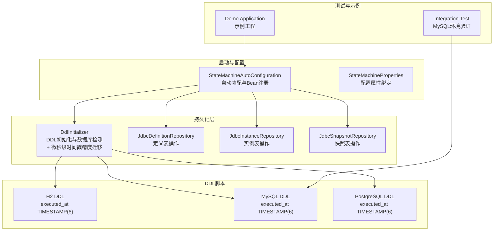
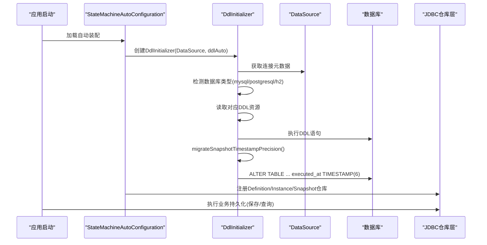
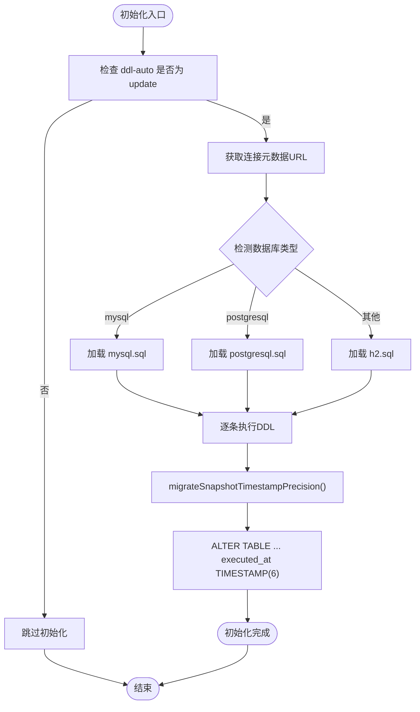
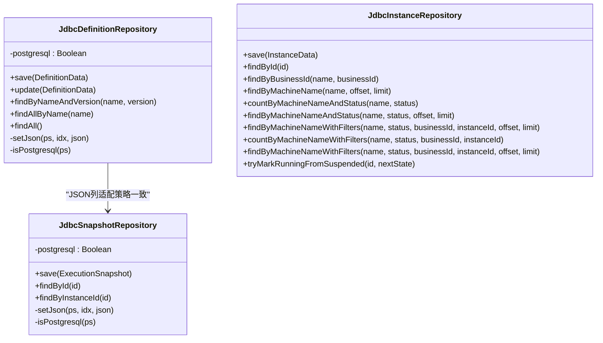
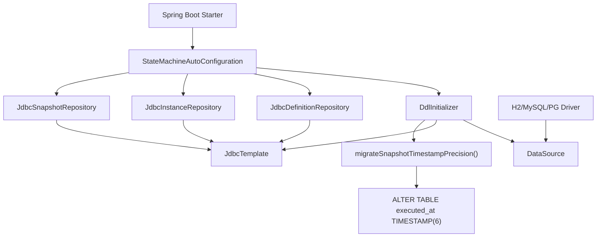

# 多数据库支持

<cite>
**本文档引用的文件**
- [DdlInitializer.java](file://state-machine-boot-starter/src/main/java/cn/chedejun/statemachine/persistence/DdlInitializer.java)
- [StateMachineAutoConfiguration.java](file://state-machine-boot-starter/src/main/java/cn/chedejun/statemachine/autoconfigure/StateMachineAutoConfiguration.java)
- [StateMachineProperties.java](file://state-machine-boot-starter/src/main/java/cn/chedejun/statemachine/autoconfigure/StateMachineProperties.java)
- [JdbcDefinitionRepository.java](file://state-machine-boot-starter/src/main/java/cn/chedejun/statemachine/infrastructure/persistence/JdbcDefinitionRepository.java)
- [JdbcInstanceRepository.java](file://state-machine-boot-starter/src/main/java/cn/chedejun/statemachine/infrastructure/persistence/JdbcInstanceRepository.java)
- [JdbcSnapshotRepository.java](file://state-machine-boot-starter/src/main/java/cn/chedejun/statemachine/infrastructure/persistence/JdbcSnapshotRepository.java)
- [h2.sql](file://state-machine-boot-starter/src/main/resources/ddl/h2.sql)
- [mysql.sql](file://state-machine-boot-starter/src/main/resources/ddl/mysql.sql)
- [postgresql.sql](file://state-machine-boot-starter/src/main/resources/ddl/postgresql.sql)
- [application.yml](file://state-machine-boot-starter/src/test/resources/application.yml)
- [StateMachineIntegrationTest.java](file://state-machine-boot-starter/src/test/java/cn/chedejun/statemachine/integration/StateMachineIntegrationTest.java)
- [pom.xml](file://state-machine-boot-starter/pom.xml)
- [demo/pom.xml](file://state-machine-demo/pom.xml)
</cite>

## 目录
1. [简介](#简介)
2. [项目结构](#项目结构)
3. [核心组件](#核心组件)
4. [架构总览](#架构总览)
5. [详细组件分析](#详细组件分析)
6. [依赖关系分析](#依赖关系分析)
7. [性能考虑](#性能考虑)
8. [故障排除指南](#故障排除指南)
9. [结论](#结论)
10. [附录](#附录)

## 简介
本技术文档围绕多数据库支持展开，重点分析H2、MySQL、PostgreSQL三种数据库在DDL脚本上的差异与兼容性处理，解释DdlInitializer的初始化机制与数据库检测逻辑，说明各数据库特有的SQL语法差异及适配策略，并提供数据库选择指南、配置建议、性能对比与优化建议、连接字符串配置与驱动程序选择、故障排除与调试技巧以及生产环境部署最佳实践。

**更新** 新增微秒级时间戳精度迁移功能，确保快照表executed_at列在不同数据库系统中的一致性和精确性。

## 项目结构
该项目采用Spring Boot自动装配与JDBC持久化的架构设计，核心模块包括：
- 自动装配与属性绑定：负责根据数据源条件加载组件、初始化DDL、注册管理端点与控制台。
- JDBC仓库层：封装对三类表的读写操作，针对不同数据库进行JSON列类型与时间戳更新策略的差异化处理。
- DDL资源：为H2、MySQL、PostgreSQL分别提供建表脚本，确保跨数据库一致性。
- 测试与示例：集成测试覆盖MySQL环境，演示DDL初始化、实例与快照持久化、重试与挂起/恢复流程。

**图表来源**
- [StateMachineAutoConfiguration.java:32-93](file://state-machine-boot-starter/src/main/java/cn/chedejun/statemachine/autoconfigure/StateMachineAutoConfiguration.java#L32-L93)
- [DdlInitializer.java:11-45](file://state-machine-boot-starter/src/main/java/cn/chedejun/statemachine/persistence/DdlInitializer.java#L11-L45)
- [DdlInitializer.java:68-94](file://state-machine-boot-starter/src/main/java/cn/chedejun/statemachine/persistence/DdlInitializer.java#L68-L94)
- [h2.sql:1-19](file://state-machine-boot-starter/src/main/resources/ddl/h2.sql#L1-L19)
- [mysql.sql:1-19](file://state-machine-boot-starter/src/main/resources/ddl/mysql.sql#L1-L19)
- [postgresql.sql:1-19](file://state-machine-boot-starter/src/main/resources/ddl/postgresql.sql#L1-L19)

**章节来源**
- [StateMachineAutoConfiguration.java:32-93](file://state-machine-boot-starter/src/main/java/cn/chedejun/statemachine/autoconfigure/StateMachineAutoConfiguration.java#L32-L93)
- [DdlInitializer.java:11-45](file://state-machine-boot-starter/src/main/java/cn/chedejun/statemachine/persistence/DdlInitializer.java#L11-L45)

## 核心组件
- DdlInitializer：在应用启动时根据数据源URL自动识别数据库类型，加载对应DDL脚本并执行，仅在配置为"update"时生效。**新增**微秒级时间戳精度迁移功能，在DDL初始化完成后自动将快照表executed_at列精度提升至TIMESTAMP(6)。
- JdbcDefinitionRepository：负责定义表的保存与查询，针对PostgreSQL使用Types.OTHER传递JSON/JSONB，其他数据库使用字符串方式避免binary charset问题。
- JdbcInstanceRepository：负责实例表的保存与查询，采用"插入失败则更新"的UPSERT策略，避免并发竞态。
- JdbcSnapshotRepository：负责快照表的保存与查询，同样针对PostgreSQL进行JSON/JSONB类型处理。
- StateMachineAutoConfiguration：基于条件注解在存在DataSource时注册上述组件，并提供管理端点与控制台Servlet。
- StateMachineProperties：绑定state-machine前缀的配置项，如ddl-auto、管理端点与控制台开关等。

**章节来源**
- [DdlInitializer.java:11-65](file://state-machine-boot-starter/src/main/java/cn/chedejun/statemachine/persistence/DdlInitializer.java#L11-L65)
- [DdlInitializer.java:68-94](file://state-machine-boot-starter/src/main/java/cn/chedejun/statemachine/persistence/DdlInitializer.java#L68-L94)
- [JdbcDefinitionRepository.java:18-118](file://state-machine-boot-starter/src/main/java/cn/chedejun/statemachine/infrastructure/persistence/JdbcDefinitionRepository.java#L18-L118)
- [JdbcInstanceRepository.java:16-163](file://state-machine-boot-starter/src/main/java/cn/chedejun/statemachine/infrastructure/persistence/JdbcInstanceRepository.java#L16-L163)
- [JdbcSnapshotRepository.java:18-106](file://state-machine-boot-starter/src/main/java/cn/chedejun/statemachine/infrastructure/persistence/JdbcSnapshotRepository.java#L18-L106)
- [StateMachineAutoConfiguration.java:32-93](file://state-machine-boot-starter/src/main/java/cn/chedejun/statemachine/autoconfigure/StateMachineAutoConfiguration.java#L32-L93)
- [StateMachineProperties.java:5-41](file://state-machine-boot-starter/src/main/java/cn/chedejun/statemachine/autoconfigure/StateMachineProperties.java#L5-L41)

## 架构总览
下图展示了从应用启动到数据库初始化与业务持久化的整体流程，包括DDL检测、脚本加载、表初始化以及JDBC仓库的数据访问路径。**更新**新增微秒级时间戳精度迁移步骤。

**图表来源**
- [StateMachineAutoConfiguration.java:39-57](file://state-machine-boot-starter/src/main/java/cn/chedejun/statemachine/autoconfigure/StateMachineAutoConfiguration.java#L39-L57)
- [DdlInitializer.java:22-45](file://state-machine-boot-starter/src/main/java/cn/chedejun/statemachine/persistence/DdlInitializer.java#L22-L45)
- [DdlInitializer.java:40-42](file://state-machine-boot-starter/src/main/java/cn/chedejun/statemachine/persistence/DdlInitializer.java#L40-L42)
- [DdlInitializer.java:68-94](file://state-machine-boot-starter/src/main/java/cn/chedejun/statemachine/persistence/DdlInitializer.java#L68-L94)

## 详细组件分析

### DdlInitializer 初始化机制与数据库检测
- 初始化触发条件：当配置项state-machine.ddl-auto为"update"时才执行DDL初始化；否则跳过。
- 数据库检测逻辑：通过JdbcTemplate获取DataSource连接元数据中的URL，按关键字匹配判断数据库类型（mysql、postgresql或postgres、默认h2）。
- 资源加载与回退：优先加载与检测到的数据库类型对应的DDL资源；若资源不存在，则回退使用H2脚本。
- 执行流程：读取DDL文本，按分号拆分逐条执行，记录成功日志；异常时记录错误并抛出运行时异常。
- **新增**微秒级时间戳精度迁移：在DDL初始化完成后，自动检测快照表executed_at列的精度，将其统一提升至TIMESTAMP(6)微秒级精度。

**图表来源**
- [DdlInitializer.java:22-45](file://state-machine-boot-starter/src/main/java/cn/chedejun/statemachine/persistence/DdlInitializer.java#L22-L45)
- [DdlInitializer.java:57-64](file://state-machine-boot-starter/src/main/java/cn/chedejun/statemachine/persistence/DdlInitializer.java#L57-L64)
- [DdlInitializer.java:68-94](file://state-machine-boot-starter/src/main/java/cn/chedejun/statemachine/persistence/DdlInitializer.java#L68-L94)

**章节来源**
- [DdlInitializer.java:11-65](file://state-machine-boot-starter/src/main/java/cn/chedejun/statemachine/persistence/DdlInitializer.java#L11-L65)
- [DdlInitializer.java:68-94](file://state-machine-boot-starter/src/main/java/cn/chedejun/statemachine/persistence/DdlInitializer.java#L68-L94)

### DDL脚本差异与兼容性处理
- 定义表（state_machine_definitions）
  - H2：使用CLOB存储JSON字段，唯一约束使用带别名的UNIQUE KEY。
  - MySQL：使用JSON类型，唯一约束使用UNIQUE KEY。
  - PostgreSQL：使用JSONB类型，唯一约束不带别名。
- 实例表（state_machine_instances）
  - H2：使用CLOB存储错误信息，时间戳默认CURRENT_TIMESTAMP。
  - MySQL：使用TEXT存储错误信息，时间戳默认CURRENT_TIMESTAMP，更新时自动设置ON UPDATE CURRENT_TIMESTAMP。
  - PostgreSQL：使用TEXT存储错误信息，时间戳默认CURRENT_TIMESTAMP。
- 快照表（state_machine_snapshots）
  - H2：使用CLOB存储输入输出JSON，新增snapshot_type列，executed_at列精度为TIMESTAMP(6)。
  - MySQL：使用JSON类型，新增snapshot_type列，executed_at列精度为TIMESTAMP(6)。
  - PostgreSQL：使用JSONB类型，新增snapshot_type列，executed_at列精度为TIMESTAMP(6)。
- 兼容性处理要点
  - H2：所有JSON字段使用CLOB，无JSON/JSONB类型，executed_at默认TIMESTAMP(6)精度。
  - MySQL：JSON列使用字符串形式，避免binary charset问题；时间戳更新策略通过ON UPDATE CURRENT_TIMESTAMP实现，executed_at默认TIMESTAMP(6)精度。
  - PostgreSQL：JSON/JSONB列使用Types.OTHER传递，避免类型不匹配；时间戳更新策略通过触发器或应用侧设置实现，executed_at默认TIMESTAMP(6)精度。

**章节来源**
- [h2.sql:1-19](file://state-machine-boot-starter/src/main/resources/ddl/h2.sql#L1-L19)
- [mysql.sql:1-19](file://state-machine-boot-starter/src/main/resources/ddl/mysql.sql#L1-L19)
- [postgresql.sql:1-19](file://state-machine-boot-starter/src/main/resources/ddl/postgresql.sql#L1-L19)

### 微秒级时间戳精度迁移功能
**新增** 为确保跨数据库系统中时间戳的精确性和一致性，系统实现了executed_at列的微秒级精度迁移功能：

- **迁移目标**：将现有快照表state_machine_snapshots的executed_at列精度统一提升至TIMESTAMP(6)微秒级。
- **迁移策略**：
  - MySQL：使用ALTER TABLE ... MODIFY COLUMN语法修改列定义为TIMESTAMP(6)
  - PostgreSQL：使用ALTER TABLE ... ALTER COLUMN ... TYPE语法转换数据类型为TIMESTAMP(6)
  - H2：使用ALTER TABLE ... ALTER COLUMN语法修改为TIMESTAMP(6)
- **幂等性保证**：通过try-catch异常处理实现幂等性，当列已是TIMESTAMP(6)精度时静默忽略。
- **执行时机**：在DDL初始化完成后自动执行，不影响正常业务流程。
- **日志记录**：成功迁移时记录INFO级别日志，迁移跳过时记录DEBUG级别日志。

**章节来源**
- [DdlInitializer.java:68-94](file://state-machine-boot-starter/src/main/java/cn/chedejun/statemachine/persistence/DdlInitializer.java#L68-L94)

### JDBC仓库层的数据库适配策略
- JSON列处理
  - PostgreSQL：使用Types.OTHER setObject(json, Types.OTHER)，避免类型不匹配。
  - 非PostgreSQL：使用setString(json)传递JSON字符串，避免binary charset问题。
- 时间戳更新策略
  - MySQL：通过ON UPDATE CURRENT_TIMESTAMP自动更新updated_at。
  - H2/PostgreSQL：由应用侧显式设置updated_at。
- UPSERT策略
  - 使用"插入失败则更新"的模式，避免并发竞态；MySQL通过DuplicateKeyException触发更新分支。

**图表来源**
- [JdbcDefinitionRepository.java:83-106](file://state-machine-boot-starter/src/main/java/cn/chedejun/statemachine/infrastructure/persistence/JdbcDefinitionRepository.java#L83-L106)
- [JdbcSnapshotRepository.java:63-83](file://state-machine-boot-starter/src/main/java/cn/chedejun/statemachine/infrastructure/persistence/JdbcSnapshotRepository.java#L63-L83)
- [JdbcInstanceRepository.java:47-86](file://state-machine-boot-starter/src/main/java/cn/chedejun/statemachine/infrastructure/persistence/JdbcInstanceRepository.java#L47-L86)

**章节来源**
- [JdbcDefinitionRepository.java:83-106](file://state-machine-boot-starter/src/main/java/cn/chedejun/statemachine/infrastructure/persistence/JdbcDefinitionRepository.java#L83-L106)
- [JdbcSnapshotRepository.java:63-83](file://state-machine-boot-starter/src/main/java/cn/chedejun/statemachine/infrastructure/persistence/JdbcSnapshotRepository.java#L63-L83)
- [JdbcInstanceRepository.java:47-86](file://state-machine-boot-starter/src/main/java/cn/chedejun/statemachine/infrastructure/persistence/JdbcInstanceRepository.java#L47-L86)

### 自动装配与Bean注册
- 条件加载：仅当存在DataSource与JdbcTemplate时才注册DdlInitializer与各Repository。
- 管理端点与控制台：根据配置启用Actuator端点与Web控制台Servlet。
- Bean后置处理器：向StateMachineBuilder注入JdbcTemplate与Registry，向StateMachine注入Registry以实现自动注册。

**章节来源**
- [StateMachineAutoConfiguration.java:32-93](file://state-machine-boot-starter/src/main/java/cn/chedejun/statemachine/autoconfigure/StateMachineAutoConfiguration.java#L32-L93)
- [StateMachineAutoConfiguration.java:95-147](file://state-machine-boot-starter/src/main/java/cn/chedejun/statemachine/autoconfigure/StateMachineAutoConfiguration.java#L95-L147)

## 依赖关系分析
- 组件耦合
  - DdlInitializer依赖DataSource与JdbcTemplate，耦合度低，职责单一。**新增**微秒级时间戳迁移功能通过JdbcTemplate执行ALTER TABLE语句。
  - JDBC仓库层依赖JdbcTemplate与ObjectMapper，面向接口编程，便于替换与扩展。
- 外部依赖
  - Spring Boot Starter JDBC/Web/Actuator用于自动装配与Web功能。
  - H2、MySQL Connector、PostgreSQL驱动用于测试与生产环境。
- 可能的循环依赖
  - 当前结构未发现循环依赖；自动装配通过条件注解避免不必要的Bean创建。

**图表来源**
- [StateMachineAutoConfiguration.java:39-57](file://state-machine-boot-starter/src/main/java/cn/chedejun/statemachine/autoconfigure/StateMachineAutoConfiguration.java#L39-L57)
- [DdlInitializer.java:13-19](file://state-machine-boot-starter/src/main/java/cn/chedejun/statemachine/persistence/DdlInitializer.java#L13-L19)
- [DdlInitializer.java:68-94](file://state-machine-boot-starter/src/main/java/cn/chedejun/statemachine/persistence/DdlInitializer.java#L68-L94)
- [pom.xml:57-98](file://state-machine-boot-starter/pom.xml#L57-L98)

**章节来源**
- [pom.xml:57-98](file://state-machine-boot-starter/pom.xml#L57-L98)
- [demo/pom.xml:49-63](file://state-machine-demo/pom.xml#L49-L63)

## 性能考虑
- UPSERT策略：JdbcInstanceRepository采用"插入失败则更新"的UPSERT模式，减少并发竞态带来的锁冲突与重复查询开销。
- JSON列类型：PostgreSQL使用JSONB类型，查询与索引效率更高；MySQL使用JSON类型，注意避免binary charset导致的性能问题。
- 时间戳更新：MySQL通过ON UPDATE CURRENT_TIMESTAMP自动更新，减少应用侧写入次数；H2/PostgreSQL需应用侧显式设置。
- **新增**微秒级时间戳精度：executed_at列统一使用TIMESTAMP(6)微秒级精度，提高时间戳分辨率，支持更精确的时间测量和排序。
- 连接池与事务：建议结合Spring Boot默认连接池与合理的事务传播行为，避免长事务与过度锁竞争。
- 索引与查询：根据高频查询条件（机器名、状态、业务ID）建立复合索引，减少全表扫描。

## 故障排除指南
- DDL初始化失败
  - 现象：初始化日志报错并抛出运行时异常。
  - 排查：确认数据库URL、用户名密码正确；检查DDL资源是否存在；确认数据库类型检测是否命中预期。
- **新增**微秒级时间戳迁移失败
  - 现象：executed_at精度迁移日志显示DEBUG级别消息，可能已是最新精度。
  - 排查：确认数据库用户具有ALTER权限；检查表是否存在executed_at列；验证数据库版本支持TIMESTAMP(6)精度。
- JSON列类型错误
  - 现象：PostgreSQL JSON/JSONB列无法正确写入或读取。
  - 排查：确认setJson方法中Types.OTHER的使用；检查ObjectMapper序列化结果格式。
- 并发写入冲突
  - 现象：实例表写入冲突或重复主键。
  - 排查：确认UPSERT逻辑是否生效；检查数据库唯一约束与索引；避免手动并发写入。
- 控制台与端点不可用
  - 现象：管理端点或控制台Servlet未注册。
  - 排查：确认state-machine.management.enabled与state-machine.console.enabled配置；确认Actuator与Web Starter依赖存在。

**章节来源**
- [DdlInitializer.java:41-44](file://state-machine-boot-starter/src/main/java/cn/chedejun/statemachine/persistence/DdlInitializer.java#L41-L44)
- [DdlInitializer.java:88-92](file://state-machine-boot-starter/src/main/java/cn/chedejun/statemachine/persistence/DdlInitializer.java#L88-L92)
- [JdbcDefinitionRepository.java:83-93](file://state-machine-boot-starter/src/main/java/cn/chedejun/statemachine/infrastructure/persistence/JdbcDefinitionRepository.java#L83-L93)
- [JdbcInstanceRepository.java:65-86](file://state-machine-boot-starter/src/main/java/cn/chedejun/statemachine/infrastructure/persistence/JdbcInstanceRepository.java#L65-L86)
- [StateMachineAutoConfiguration.java:111-147](file://state-machine-boot-starter/src/main/java/cn/chedejun/statemachine/autoconfigure/StateMachineAutoConfiguration.java#L111-L147)

## 结论
该系统通过DdlInitializer实现了对H2、MySQL、PostgreSQL的统一DDL初始化与数据库检测，配合JDBC仓库层的数据库适配策略，有效解决了JSON列类型、时间戳更新与UPSERT等跨数据库差异问题。**新增**的微秒级时间戳精度迁移功能进一步提升了系统在不同数据库平台间的时间戳一致性，确保executed_at列在所有支持的数据库中都具备TIMESTAMP(6)的精确度。结合合理的配置与性能优化建议，可在不同环境下稳定运行并满足生产需求。

## 附录

### 数据库选择指南与配置建议
- H2
  - 适用场景：开发测试、内存数据库、快速原型。
  - 配置要点：DDL使用CLOB存储JSON；executed_at默认TIMESTAMP(6)精度；无需额外驱动；适合本地开发。
- MySQL
  - 适用场景：中小型生产环境、成本敏感场景。
  - 配置要点：JSON列使用字符串传递；executed_at列精度为TIMESTAMP(6)；开启ON UPDATE CURRENT_TIMESTAMP；合理设置字符集与SSL参数。
- PostgreSQL
  - 适用场景：高并发、复杂查询、强一致要求。
  - 配置要点：JSONB列使用Types.OTHER；executed_at列精度为TIMESTAMP(6)；注意索引与查询优化；启用连接池与监控。

**章节来源**
- [h2.sql:1-19](file://state-machine-boot-starter/src/main/resources/ddl/h2.sql#L1-L19)
- [mysql.sql:1-19](file://state-machine-boot-starter/src/main/resources/ddl/mysql.sql#L1-L19)
- [postgresql.sql:1-19](file://state-machine-boot-starter/src/main/resources/ddl/postgresql.sql#L1-L19)
- [application.yml:1-14](file://state-machine-boot-starter/src/test/resources/application.yml#L1-L14)

### 连接字符串配置与驱动程序选择
- 连接字符串示例（参考测试配置）
  - MySQL：jdbc:mysql://host:port/db?useUnicode=true&characterEncoding=utf-8&useSSL=false
  - PostgreSQL：jdbc:postgresql://host:port/db
  - H2：jdbc:h2:mem:testdb 或 jdbc:h2:file:/path/to/db
- 驱动程序
  - MySQL：mysql-connector-java
  - PostgreSQL：postgresql
  - H2：h2（测试）

**章节来源**
- [application.yml:1-14](file://state-machine-boot-starter/src/test/resources/application.yml#L1-L14)
- [pom.xml:82-97](file://state-machine-boot-starter/pom.xml#L82-L97)
- [demo/pom.xml:49-63](file://state-machine-demo/pom.xml#L49-L63)

### 生产环境部署最佳实践
- 数据库准备
  - 明确生产数据库类型与版本；预创建数据库与用户；设置只读权限最小化原则。
- DDL初始化
  - 在CI/CD流水线中显式执行DDL初始化，避免运行时动态创建；生产环境可将ddl-auto设为"none"或"validate"，确保Schema变更受控。
  - **新增**确保数据库用户具有ALTER权限，以便执行executed_at列的精度迁移。
- 连接池与监控
  - 使用Spring Boot默认连接池；开启数据库慢查询与连接数监控；定期巡检连接泄漏。
- 安全与合规
  - 强制SSL连接；密钥与凭据通过环境变量或密钥管理服务注入；审计DDL与数据变更。
- 性能调优
  - 基于实际查询模式建立索引；限制单次批量写入大小；使用UPSERT减少锁竞争；合理设置事务隔离级别。
  - **新增**监控executed_at列的时间戳精度，确保所有数据库实例都保持TIMESTAMP(6)的一致性。