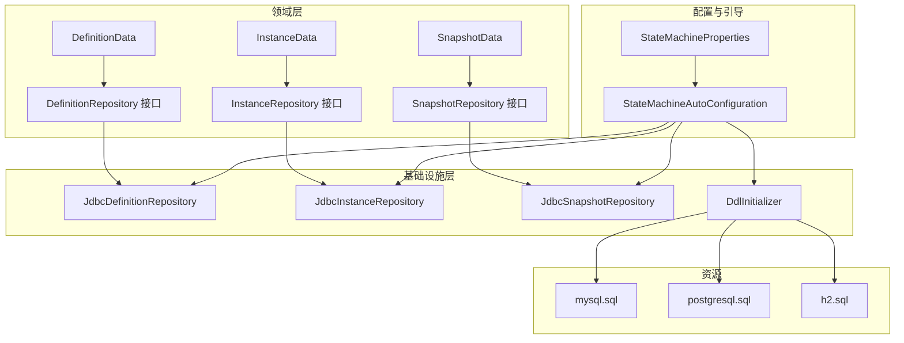
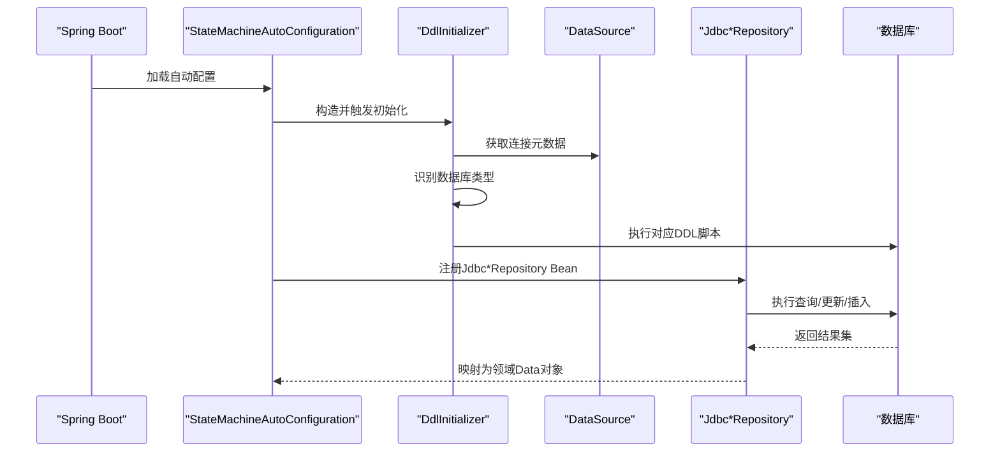
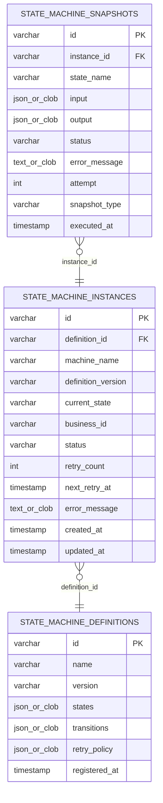
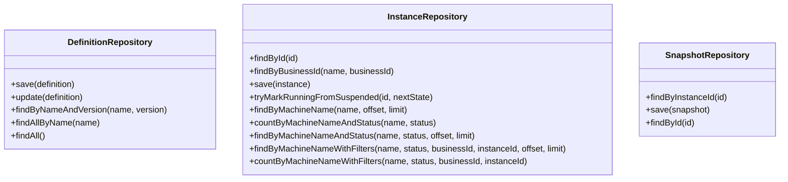
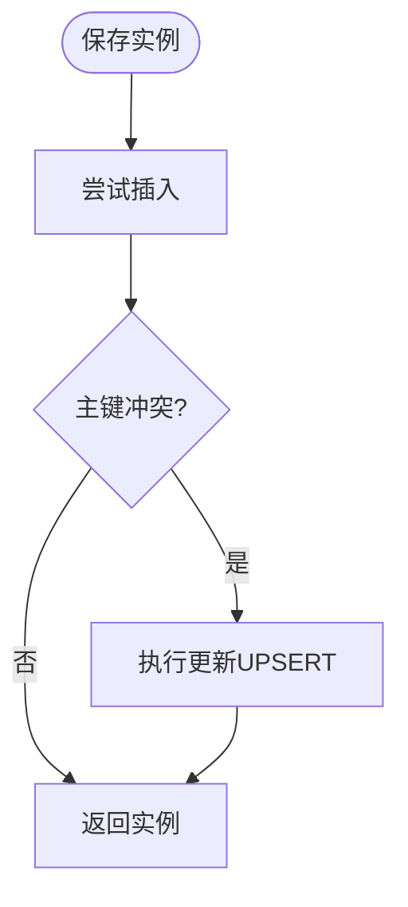
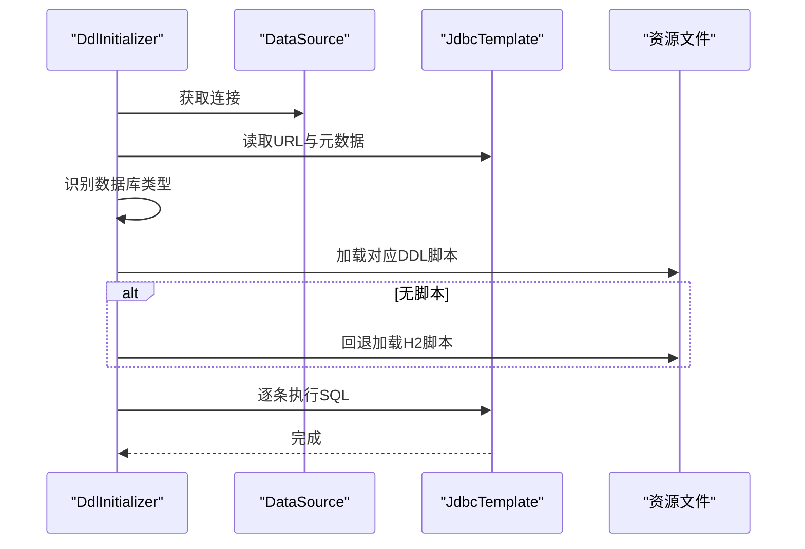
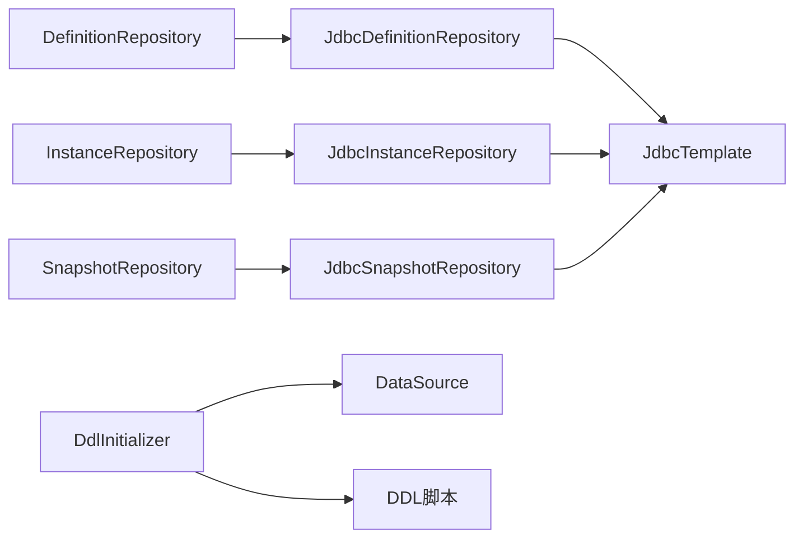

# 持久化层

<cite>
**本文引用的文件**
- [DefinitionData.java](file://state-machine-boot-starter/src/main/java/cn/chedejun/statemachine/domain/data/DefinitionData.java)
- [InstanceData.java](file://state-machine-boot-starter/src/main/java/cn/chedejun/statemachine/domain/data/InstanceData.java)
- [SnapshotData.java](file://state-machine-boot-starter/src/main/java/cn/chedejun/statemachine/domain/data/SnapshotData.java)
- [DefinitionRepository.java](file://state-machine-boot-starter/src/main/java/cn/chedejun/statemachine/domain/repository/DefinitionRepository.java)
- [InstanceRepository.java](file://state-machine-boot-starter/src/main/java/cn/chedejun/statemachine/domain/repository/InstanceRepository.java)
- [SnapshotRepository.java](file://state-machine-boot-starter/src/main/java/cn/chedejun/statemachine/domain/repository/SnapshotRepository.java)
- [JdbcDefinitionRepository.java](file://state-machine-boot-starter/src/main/java/cn/chedejun/statemachine/infrastructure/persistence/JdbcDefinitionRepository.java)
- [JdbcInstanceRepository.java](file://state-machine-boot-starter/src/main/java/cn/chedejun/statemachine/infrastructure/persistence/JdbcInstanceRepository.java)
- [JdbcSnapshotRepository.java](file://state-machine-boot-starter/src/main/java/cn/chedejun/statemachine/infrastructure/persistence/JdbcSnapshotRepository.java)
- [DdlInitializer.java](file://state-machine-boot-starter/src/main/java/cn/chedejun/statemachine/persistence/DdlInitializer.java)
- [mysql.sql](file://state-machine-boot-starter/src/main/resources/ddl/mysql.sql)
- [postgresql.sql](file://state-machine-boot-starter/src/main/resources/ddl/postgresql.sql)
- [h2.sql](file://state-machine-boot-starter/src/main/resources/ddl/h2.sql)
- [StateMachineAutoConfiguration.java](file://state-machine-boot-starter/src/main/java/cn/chedejun/statemachine/autoconfigure/StateMachineAutoConfiguration.java)
- [StateMachineProperties.java](file://state-machine-boot-starter/src/main/java/cn/chedejun/statemachine/autoconfigure/StateMachineProperties.java)
- [application.yml](file://state-machine-boot-starter/src/test/resources/application.yml)
- [StateMachineIntegrationTest.java](file://state-machine-boot-starter/src/test/java/cn/chedejun/statemachine/integration/StateMachineIntegrationTest.java)
</cite>

## 目录
1. [引言](#引言)
2. [项目结构](#项目结构)
3. [核心组件](#核心组件)
4. [架构总览](#架构总览)
5. [详细组件分析](#详细组件分析)
6. [依赖分析](#依赖分析)
7. [性能考量](#性能考量)
8. [故障排查指南](#故障排查指南)
9. [结论](#结论)
10. [附录](#附录)

## 引言
本文件系统性梳理状态机项目的持久化层，覆盖Repository接口设计与数据访问抽象、JDBC实现细节（含SQL优化与数据库差异处理）、DDL初始化机制与多数据库支持策略、数据模型设计（DefinitionData、InstanceData、SnapshotData及其关系）、数据库Schema与字段说明、数据迁移策略与版本兼容性考虑，以及针对MySQL、PostgreSQL与H2的配置示例与最佳实践。

## 项目结构
持久化层位于 boot-starter 模块中，采用“领域模型 + 领域仓库接口 + JDBC 实现 + DDL 初始化”的分层组织方式：
- 领域数据对象：定义Data类（DefinitionData、InstanceData、SnapshotData）
- 领域仓库接口：定义DefinitionRepository、InstanceRepository、SnapshotRepository
- JDBC 实现：JdbcDefinitionRepository、JdbcInstanceRepository、JdbcSnapshotRepository
- DDL 初始化：DdlInitializer，按数据库类型加载对应SQL脚本
- 自动装配：StateMachineAutoConfiguration 注册仓库与服务Bean
- Schema 脚本：resources/ddl 下提供 mysql、postgresql、h2 三套脚本

图示来源
- [StateMachineAutoConfiguration.java:32-70](file://state-machine-boot-starter/src/main/java/cn/chedejun/statemachine/autoconfigure/StateMachineAutoConfiguration.java#L32-L70)
- [DdlInitializer.java:11-45](file://state-machine-boot-starter/src/main/java/cn/chedejun/statemachine/persistence/DdlInitializer.java#L11-L45)
- [mysql.sql:1-19](file://state-machine-boot-starter/src/main/resources/ddl/mysql.sql#L1-L19)
- [postgresql.sql:1-19](file://state-machine-boot-starter/src/main/resources/ddl/postgresql.sql#L1-L19)
- [h2.sql:1-19](file://state-machine-boot-starter/src/main/resources/ddl/h2.sql#L1-L19)

章节来源
- [StateMachineAutoConfiguration.java:32-70](file://state-machine-boot-starter/src/main/java/cn/chedejun/statemachine/autoconfigure/StateMachineAutoConfiguration.java#L32-L70)
- [DdlInitializer.java:11-45](file://state-machine-boot-starter/src/main/java/cn/chedejun/statemachine/persistence/DdlInitializer.java#L11-L45)

## 核心组件
- Repository 接口设计
  - DefinitionRepository：定义定义的增删改查与按名称/版本查询能力
  - InstanceRepository：定义实例的增删改查、CAS式原子恢复、分页与过滤统计
  - SnapshotRepository：定义快照的按实例查询、保存与按ID查询
- JDBC 实现要点
  - 统一使用 JdbcTemplate 进行SQL执行与RowMapper映射
  - 对JSON列在MySQL与PostgreSQL间进行差异化处理（类型选择与参数设置）
  - 使用“插入失败则更新”的UPSERT策略，避免并发竞态
  - 在InstanceRepository中对tryMarkRunningFromSuspended提供原子状态变更
- DDL 初始化
  - 基于数据源URL识别数据库类型，优先加载对应SQL脚本；若无脚本则回退到H2脚本
  - 仅在配置为“update”时执行初始化

章节来源
- [DefinitionRepository.java:9-15](file://state-machine-boot-starter/src/main/java/cn/chedejun/statemachine/domain/repository/DefinitionRepository.java#L9-L15)
- [InstanceRepository.java:9-25](file://state-machine-boot-starter/src/main/java/cn/chedejun/statemachine/domain/repository/InstanceRepository.java#L9-L25)
- [SnapshotRepository.java:11-15](file://state-machine-boot-starter/src/main/java/cn/chedejun/statemachine/domain/repository/SnapshotRepository.java#L11-L15)
- [JdbcDefinitionRepository.java:24-118](file://state-machine-boot-starter/src/main/java/cn/chedejun/statemachine/infrastructure/persistence/JdbcDefinitionRepository.java#L24-L118)
- [JdbcInstanceRepository.java:47-162](file://state-machine-boot-starter/src/main/java/cn/chedejun/statemachine/infrastructure/persistence/JdbcInstanceRepository.java#L47-L162)
- [JdbcSnapshotRepository.java:33-105](file://state-machine-boot-starter/src/main/java/cn/chedejun/statemachine/infrastructure/persistence/JdbcSnapshotRepository.java#L33-L105)
- [DdlInitializer.java:22-44](file://state-machine-boot-starter/src/main/java/cn/chedejun/statemachine/persistence/DdlInitializer.java#L22-L44)

## 架构总览
下图展示从应用启动到数据访问的整体流程：自动装配注册仓库与服务Bean，DDL初始化根据数据库类型加载脚本，JDBC实现通过RowMapper将数据库记录映射为领域Data对象。

图示来源
- [StateMachineAutoConfiguration.java:39-70](file://state-machine-boot-starter/src/main/java/cn/chedejun/statemachine/autoconfigure/StateMachineAutoConfiguration.java#L39-L70)
- [DdlInitializer.java:22-44](file://state-machine-boot-starter/src/main/java/cn/chedejun/statemachine/persistence/DdlInitializer.java#L22-L44)
- [JdbcDefinitionRepository.java:108-118](file://state-machine-boot-starter/src/main/java/cn/chedejun/statemachine/infrastructure/persistence/JdbcDefinitionRepository.java#L108-L118)
- [JdbcInstanceRepository.java:148-162](file://state-machine-boot-starter/src/main/java/cn/chedejun/statemachine/infrastructure/persistence/JdbcInstanceRepository.java#L148-L162)
- [JdbcSnapshotRepository.java:93-105](file://state-machine-boot-starter/src/main/java/cn/chedejun/statemachine/infrastructure/persistence/JdbcSnapshotRepository.java#L93-L105)

## 详细组件分析

### 数据模型与关系
- DefinitionData：状态机定义，包含标识、名称、版本、状态与转换序列化数据、重试策略、注册时间
- InstanceData：状态机实例，包含实例标识、所属定义、机器名、定义版本、当前状态、业务标识、运行状态、重试计数与下次重试时间、错误信息、创建与更新时间
- SnapshotData：执行快照，包含快照标识、关联实例、状态名、输入输出序列化数据、执行状态、错误信息、尝试次数、快照类型、执行时间
- 关系
  - InstanceData 由 DefinitionData 派生（definition_id、definition_version）
  - SnapshotData 由 InstanceData 派生（instance_id），且按 executed_at/attempt 排序存储

图示来源
- [mysql.sql:1-19](file://state-machine-boot-starter/src/main/resources/ddl/mysql.sql#L1-L19)
- [postgresql.sql:1-19](file://state-machine-boot-starter/src/main/resources/ddl/postgresql.sql#L1-L19)
- [h2.sql:1-19](file://state-machine-boot-starter/src/main/resources/ddl/h2.sql#L1-L19)

章节来源
- [DefinitionData.java:8-45](file://state-machine-boot-starter/src/main/java/cn/chedejun/statemachine/domain/data/DefinitionData.java#L8-L45)
- [InstanceData.java:8-79](file://state-machine-boot-starter/src/main/java/cn/chedejun/statemachine/domain/data/InstanceData.java#L8-L79)
- [SnapshotData.java:8-56](file://state-machine-boot-starter/src/main/java/cn/chedejun/statemachine/domain/data/SnapshotData.java#L8-L56)

### Repository 接口设计与数据访问抽象
- 设计原则
  - 领域驱动：以领域对象（Data）作为数据载体，屏蔽底层存储细节
  - 抽象优先：通过接口定义行为契约，便于替换实现（如未来引入MyBatis/hibernate）
  - 可测试性：接口与实现解耦，便于单元测试注入Mock
- 方法职责
  - DefinitionRepository：保存、更新、按名称+版本查找、按名称查询全部版本、全量查询
  - InstanceRepository：按ID/业务ID查找、保存（UPSERT）、CAS式原子恢复、分页查询与过滤统计
  - SnapshotRepository：按实例查询快照列表、保存执行快照、按ID查询

图示来源
- [DefinitionRepository.java:9-15](file://state-machine-boot-starter/src/main/java/cn/chedejun/statemachine/domain/repository/DefinitionRepository.java#L9-L15)
- [InstanceRepository.java:9-25](file://state-machine-boot-starter/src/main/java/cn/chedejun/statemachine/domain/repository/InstanceRepository.java#L9-L25)
- [SnapshotRepository.java:11-15](file://state-machine-boot-starter/src/main/java/cn/chedejun/statemachine/domain/repository/SnapshotRepository.java#L11-L15)

章节来源
- [DefinitionRepository.java:9-15](file://state-machine-boot-starter/src/main/java/cn/chedejun/statemachine/domain/repository/DefinitionRepository.java#L9-L15)
- [InstanceRepository.java:9-25](file://state-machine-boot-starter/src/main/java/cn/chedejun/statemachine/domain/repository/InstanceRepository.java#L9-L25)
- [SnapshotRepository.java:11-15](file://state-machine-boot-starter/src/main/java/cn/chedejun/statemachine/domain/repository/SnapshotRepository.java#L11-L15)

### JDBC 实现细节与SQL优化
- JSON列处理
  - MySQL：JSON列使用字符串设置，避免binary charset问题
  - PostgreSQL：JSON/JSONB列使用Types.OTHER setObject，确保类型正确
  - 通过PreparedStatement回调动态判断数据库类型，避免硬编码
- UPSERT 策略
  - 插入主键冲突时执行更新，避免“先查后写”的并发竞态
  - 更新字段包含状态、重试信息等，保证实例一致性
- 原子状态变更
  - tryMarkRunningFromSuspended 使用条件更新，仅当状态为SUSPENDED时才恢复为RUNNING
- 动态SQL与分页
  - InstanceRepository按需拼接过滤条件，支持状态、业务ID、实例ID组合查询
  - 提供带偏移量与限制的分页查询与统计接口
- RowMapper映射
  - 将数据库字段映射为领域值对象（如枚举、时间戳），统一异常处理返回空值

图示来源
- [JdbcInstanceRepository.java:47-87](file://state-machine-boot-starter/src/main/java/cn/chedejun/statemachine/infrastructure/persistence/JdbcInstanceRepository.java#L47-L87)

章节来源
- [JdbcDefinitionRepository.java:83-106](file://state-machine-boot-starter/src/main/java/cn/chedejun/statemachine/infrastructure/persistence/JdbcDefinitionRepository.java#L83-L106)
- [JdbcInstanceRepository.java:47-87](file://state-machine-boot-starter/src/main/java/cn/chedejun/statemachine/infrastructure/persistence/JdbcInstanceRepository.java#L47-L87)
- [JdbcInstanceRepository.java:89-94](file://state-machine-boot-starter/src/main/java/cn/chedejun/statemachine/infrastructure/persistence/JdbcInstanceRepository.java#L89-L94)
- [JdbcInstanceRepository.java:124-146](file://state-machine-boot-starter/src/main/java/cn/chedejun/statemachine/infrastructure/persistence/JdbcInstanceRepository.java#L124-L146)
- [JdbcSnapshotRepository.java:63-83](file://state-machine-boot-starter/src/main/java/cn/chedejun/statemachine/infrastructure/persistence/JdbcSnapshotRepository.java#L63-L83)

### DDL 初始化机制与多数据库支持
- 自动检测
  - 通过JDBC URL关键字识别数据库类型（mysql/postgresql/postgres/h2）
  - 若无对应脚本则回退到H2脚本
- 执行流程
  - 读取SQL资源流，按分号拆分逐条执行
  - 仅在配置为“update”时执行，避免生产环境误操作
- 脚本差异
  - MySQL：JSON列、默认时间戳、唯一索引
  - PostgreSQL：JSONB列、默认时间戳、唯一约束
  - H2：CLOB列、唯一约束语法差异

图示来源
- [DdlInitializer.java:22-44](file://state-machine-boot-starter/src/main/java/cn/chedejun/statemachine/persistence/DdlInitializer.java#L22-L44)
- [mysql.sql:1-19](file://state-machine-boot-starter/src/main/resources/ddl/mysql.sql#L1-L19)
- [postgresql.sql:1-19](file://state-machine-boot-starter/src/main/resources/ddl/postgresql.sql#L1-L19)
- [h2.sql:1-19](file://state-machine-boot-starter/src/main/resources/ddl/h2.sql#L1-L19)

章节来源
- [DdlInitializer.java:22-44](file://state-machine-boot-starter/src/main/java/cn/chedejun/statemachine/persistence/DdlInitializer.java#L22-L44)

### 数据迁移策略与版本兼容
- 版本化定义
  - 通过“名称+版本”唯一标识定义，支持多版本共存与回滚
  - 更新定义时保留历史版本，避免破坏现有实例
- 快照演进
  - 新增列（如snapshot_type）时，测试用例演示了对已有表的兼容处理（添加列并设置默认值）
- 运行时兼容
  - JSON列在不同数据库间采用不同类型，避免迁移成本
  - 时间戳默认值与更新策略在各数据库脚本中保持一致

章节来源
- [DefinitionRepository.java:12-13](file://state-machine-boot-starter/src/main/java/cn/chedejun/statemachine/domain/repository/DefinitionRepository.java#L12-L13)
- [StateMachineIntegrationTest.java:47-56](file://state-machine-boot-starter/src/test/java/cn/chedejun/statemachine/integration/StateMachineIntegrationTest.java#L47-L56)

### 字段说明与Schema
- state_machine_definitions
  - id：主键，定义标识
  - name：状态机名称
  - version：版本号
  - states/transitions/retry_policy：JSON/JSONB/CLOB，序列化状态与转换、重试策略
  - registered_at：注册时间
- state_machine_instances
  - id：主键，实例标识
  - definition_id：外键，指向定义
  - machine_name/definition_version/current_state/business_id：实例维度信息
  - status/retry_count/next_retry_at/error_message：运行状态与重试信息
  - created_at/updated_at：时间戳
- state_machine_snapshots
  - id：主键，快照标识
  - instance_id：外键，指向实例
  - state_name/input/output/status/error_message：执行上下文与结果
  - attempt/snapshot_type/executed_at：尝试次数、快照类型、执行时间

章节来源
- [mysql.sql:1-19](file://state-machine-boot-starter/src/main/resources/ddl/mysql.sql#L1-L19)
- [postgresql.sql:1-19](file://state-machine-boot-starter/src/main/resources/ddl/postgresql.sql#L1-L19)
- [h2.sql:1-19](file://state-machine-boot-starter/src/main/resources/ddl/h2.sql#L1-L19)

## 依赖分析
- 组件耦合
  - JDBC实现依赖JdbcTemplate与RowMapper，面向接口编程，降低耦合
  - DdlInitializer与数据库脚本解耦，通过资源路径与URL识别实现多数据库支持
- 外部依赖
  - Spring JDBC、Jackson（JSON序列化）
  - 测试阶段使用MySQL数据库与自定义DDL执行器

图示来源
- [JdbcDefinitionRepository.java:24-27](file://state-machine-boot-starter/src/main/java/cn/chedejun/statemachine/infrastructure/persistence/JdbcDefinitionRepository.java#L24-L27)
- [JdbcInstanceRepository.java:20](file://state-machine-boot-starter/src/main/java/cn/chedejun/statemachine/infrastructure/persistence/JdbcInstanceRepository.java#L20)
- [JdbcSnapshotRepository.java:23](file://state-machine-boot-starter/src/main/java/cn/chedejun/statemachine/infrastructure/persistence/JdbcSnapshotRepository.java#L23)
- [DdlInitializer.java:13-19](file://state-machine-boot-starter/src/main/java/cn/chedejun/statemachine/persistence/DdlInitializer.java#L13-L19)

章节来源
- [StateMachineAutoConfiguration.java:39-70](file://state-machine-boot-starter/src/main/java/cn/chedejun/statemachine/autoconfigure/StateMachineAutoConfiguration.java#L39-L70)

## 性能考量
- SQL优化建议
  - 为高频查询字段建立合适索引（如machine_name、status、business_id、definition_id）
  - 分页查询使用LIMIT/OFFSET，注意大数据量场景下的排序成本
- 连接池与事务
  - 使用Spring Boot默认连接池（HikariCP），合理配置最大连接数与超时
  - 对批量写入（快照）可考虑批处理或异步提交
- JSON列性能
  - PostgreSQL JSONB通常比JSON更高效，适合复杂查询与索引
  - MySQL JSON列避免binary charset问题，但查询与索引能力有限

## 故障排查指南
- DDL初始化失败
  - 检查state-machine.ddl-auto配置是否为“update”
  - 确认数据库URL包含正确关键字（mysql/postgresql/postgres/h2）
  - 查看日志中“Failed to initialize state machine tables”定位具体异常
- JSON列写入异常
  - 确认数据库类型识别逻辑（setJson/setObject）
  - 检查JSON字符串格式与长度限制
- 并发写入冲突
  - UPSERT策略依赖主键冲突，确保实体主键唯一
  - 对高并发场景可增加重试与限流
- 原子状态变更无效
  - 确认实例状态确实为SUSPENDED
  - 检查返回的影响行数（应为1）

章节来源
- [DdlInitializer.java:41-44](file://state-machine-boot-starter/src/main/java/cn/chedejun/statemachine/persistence/DdlInitializer.java#L41-L44)
- [JdbcDefinitionRepository.java:83-106](file://state-machine-boot-starter/src/main/java/cn/chedejun/statemachine/infrastructure/persistence/JdbcDefinitionRepository.java#L83-L106)
- [JdbcInstanceRepository.java:65-87](file://state-machine-boot-starter/src/main/java/cn/chedejun/statemachine/infrastructure/persistence/JdbcInstanceRepository.java#L65-L87)
- [JdbcInstanceRepository.java:89-94](file://state-machine-boot-starter/src/main/java/cn/chedejun/statemachine/infrastructure/persistence/JdbcInstanceRepository.java#L89-L94)

## 结论
该持久化层通过清晰的领域模型与Repository接口抽象，结合JDBC实现与DDL自动初始化，实现了对MySQL、PostgreSQL与H2的多数据库支持。JSON列的差异化处理与UPSERT策略有效提升了跨数据库的一致性与性能。建议在生产环境中配合索引优化、连接池调优与监控告警，持续保障系统的稳定性与可维护性。

## 附录

### 配置示例与最佳实践
- MySQL
  - 数据源配置参考测试资源中的示例
  - 启用DDL初始化：state-machine.ddl-auto: update
- PostgreSQL
  - 数据源URL包含postgresql/postgres关键字即可自动识别
  - JSONB列具备更好性能，推荐用于复杂查询场景
- H2（开发/测试）
  - 无脚本时自动回退到H2脚本
  - CLOB类型适配文本存储

章节来源
- [application.yml:1-14](file://state-machine-boot-starter/src/test/resources/application.yml#L1-L14)
- [DdlInitializer.java:57-64](file://state-machine-boot-starter/src/main/java/cn/chedejun/statemachine/persistence/DdlInitializer.java#L57-L64)