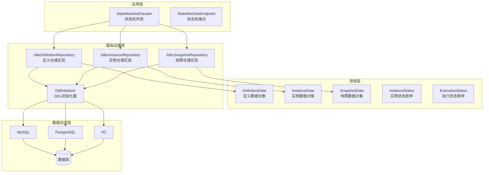
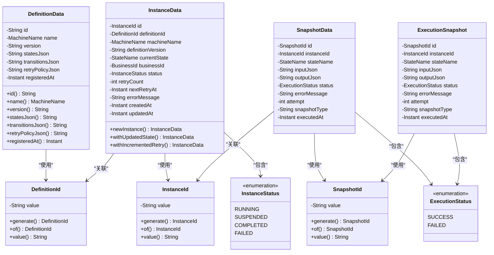
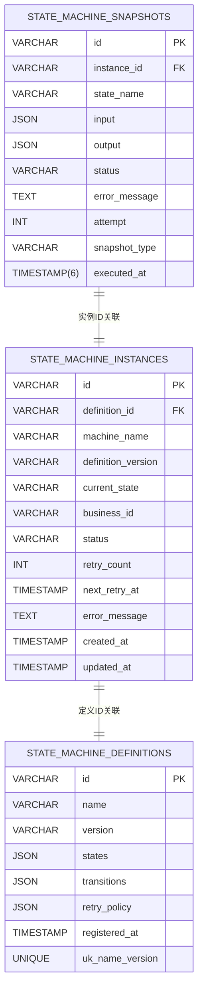
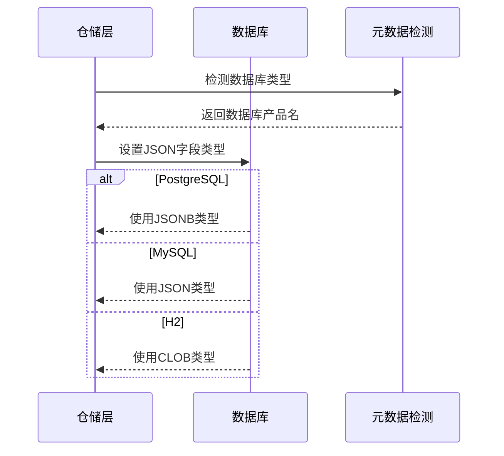
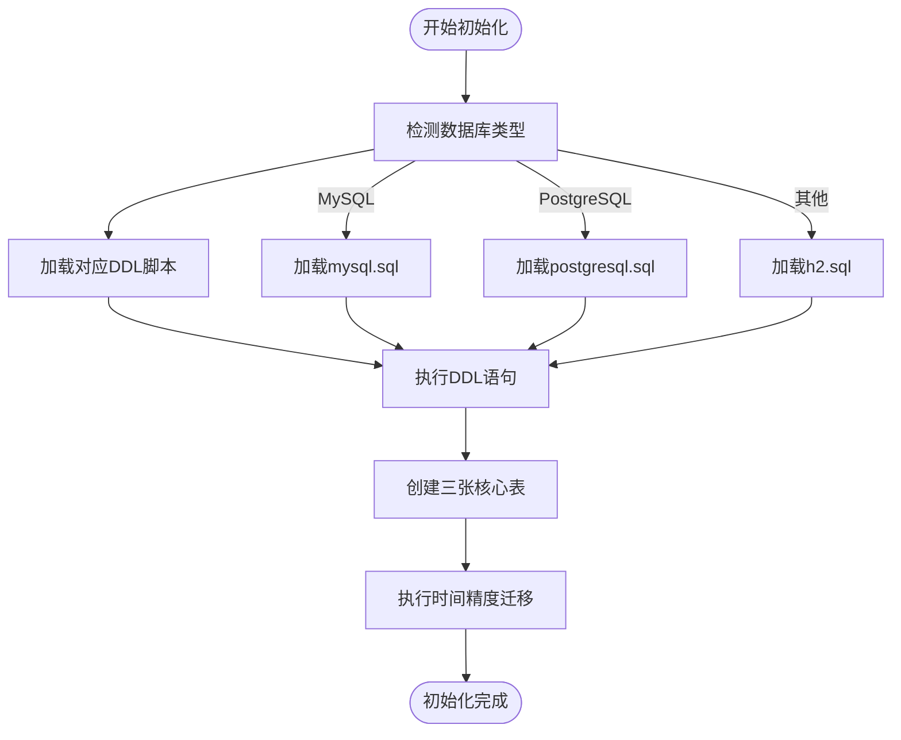
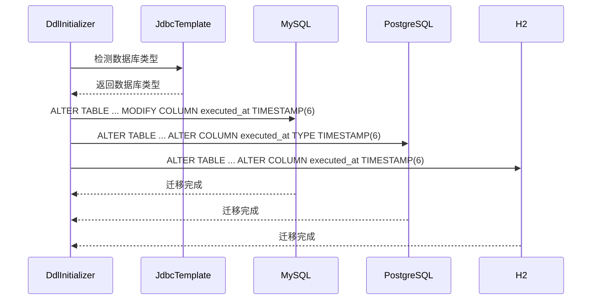
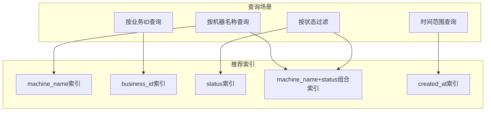
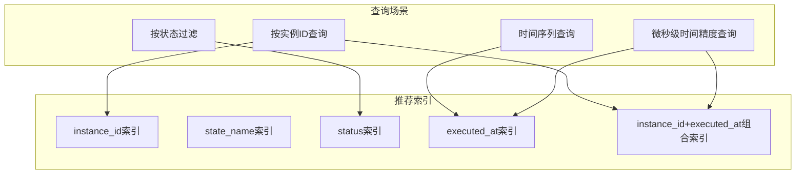
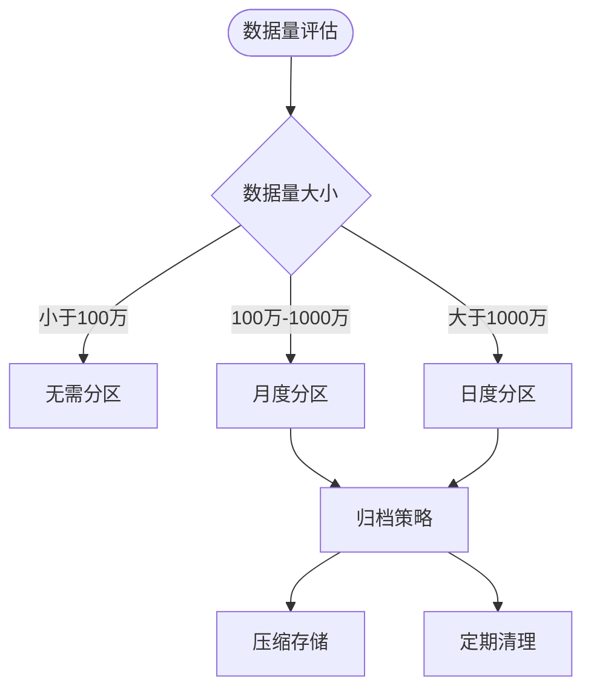

# 数据库Schema设计

<cite>
**本文档引用的文件**
- [mysql.sql](file://state-machine-boot-starter/src/main/resources/ddl/mysql.sql)
- [postgresql.sql](file://state-machine-boot-starter/src/main/resources/ddl/postgresql.sql)
- [h2.sql](file://state-machine-boot-starter/src/main/resources/ddl/h2.sql)
- [DdlInitializer.java](file://state-machine-boot-starter/src/main/java/cn/chedejun/statemachine/persistence/DdlInitializer.java)
- [JdbcDefinitionRepository.java](file://state-machine-boot-starter/src/main/java/cn/chedejun/statemachine/infrastructure/persistence/JdbcDefinitionRepository.java)
- [JdbcInstanceRepository.java](file://state-machine-boot-starter/src/main/java/cn/chedejun/statemachine/infrastructure/persistence/JdbcInstanceRepository.java)
- [JdbcSnapshotRepository.java](file://state-machine-boot-starter/src/main/java/cn/chedejun/statemachine/infrastructure/persistence/JdbcSnapshotRepository.java)
- [DefinitionData.java](file://state-machine-boot-starter/src/main/java/cn/chedejun/statemachine/domain/data/DefinitionData.java)
- [InstanceData.java](file://state-machine-boot-starter/src/main/java/cn/chedejun/statemachine/domain/data/InstanceData.java)
- [SnapshotData.java](file://state-machine-boot-starter/src/main/java/cn/chedejun/statemachine/domain/data/SnapshotData.java)
- [ExecutionSnapshot.java](file://state-machine-boot-starter/src/main/java/cn/chedejun/statemachine/domain/snapshot/ExecutionSnapshot.java)
- [DefinitionId.java](file://state-machine-boot-starter/src/main/java/cn/chedejun/statemachine/domain/shared/DefinitionId.java)
- [InstanceId.java](file://state-machine-boot-starter/src/main/java/cn/chedejun/statemachine/domain/shared/InstanceId.java)
- [SnapshotId.java](file://state-machine-boot-starter/src/main/java/cn/chedejun/statemachine/domain/shared/SnapshotId.java)
- [InstanceStatus.java](file://state-machine-boot-starter/src/main/java/cn/chedejun/statemachine/domain/shared/InstanceStatus.java)
- [ExecutionStatus.java](file://state-machine-boot-starter/src/main/java/cn/chedejun/statemachine/domain/shared/ExecutionStatus.java)
- [MachineName.java](file://state-machine-boot-starter/src/main/java/cn/chedejun/statemachine/domain/shared/MachineName.java)
- [BusinessId.java](file://state-machine-boot-starter/src/main/java/cn/chedejun/statemachine/domain/shared/BusinessId.java)
</cite>

## 目录
1. [简介](#简介)
2. [项目结构](#项目结构)
3. [核心组件](#核心组件)
4. [架构概览](#架构概览)
5. [详细组件分析](#详细组件分析)
6. [依赖分析](#依赖分析)
7. [性能考虑](#性能考虑)
8. [故障排除指南](#故障排除指南)
9. [结论](#结论)
10. [附录](#附录)

## 简介

本文档提供了状态机系统数据库Schema设计的综合文档。该系统包含三个核心表：`state_machine_definitions`（状态机定义表）、`state_machine_instances`（状态机实例表）和`state_machine_snapshots`（状态机快照表）。这些表共同构成了状态机系统的持久化层，支持状态机的定义管理、实例执行跟踪和执行快照记录。

系统采用多数据库兼容设计，支持MySQL、PostgreSQL和H2数据库，并通过自动DDL初始化机制确保在不同环境中的正确部署。每个表都经过精心设计，平衡了数据完整性、查询性能和存储效率。

**更新** 本次更新反映了快照表 `executed_at` 列的时间精度已提升至微秒级（TIMESTAMP(6)），增强了时间戳记录的精确性和兼容性。

## 项目结构

状态机系统的数据库Schema位于以下关键位置：

```mermaid
graph TB
subgraph "DDL脚本"
MYSQL[MySQL DDL脚本]
PGSQL[PostgreSQL DDL脚本]
H2[H2 DDL脚本]
end
subgraph "持久化层"
INIT[DdlInitializer<br/>DDL初始化器]
DEF_REPO[JdbcDefinitionRepository<br/>定义仓储]
INST_REPO[JdbcInstanceRepository<br/>实例仓储]
SNAP_REPO[JdbcSnapshotRepository<br/>快照仓储]
end
subgraph "领域模型"
DEF_DATA[DefinitionData<br/>定义数据对象]
INST_DATA[InstanceData<br/>实例数据对象]
SNAP_DATA[SnapshotData<br/>快照数据对象]
END
MYSQL --> INIT
PGSQL --> INIT
H2 --> INIT
INIT --> DEF_REPO
INIT --> INST_REPO
INIT --> SNAP_REPO
DEF_REPO --> DEF_DATA
INST_REPO --> INST_DATA
SNAP_REPO --> SNAP_DATA
```

**图表来源**
- [DdlInitializer.java:11-66](file://state-machine-boot-starter/src/main/java/cn/chedejun/statemachine/persistence/DdlInitializer.java#L11-L66)
- [mysql.sql:1-19](file://state-machine-boot-starter/src/main/resources/ddl/mysql.sql#L1-L19)
- [postgresql.sql:1-19](file://state-machine-boot-starter/src/main/resources/ddl/postgresql.sql#L1-L19)
- [h2.sql:1-19](file://state-machine-boot-starter/src/main/resources/ddl/h2.sql#L1-L19)

**章节来源**
- [DdlInitializer.java:11-66](file://state-machine-boot-starter/src/main/java/cn/chedejun/statemachine/persistence/DdlInitializer.java#L11-L66)
- [mysql.sql:1-19](file://state-machine-boot-starter/src/main/resources/ddl/mysql.sql#L1-L19)
- [postgresql.sql:1-19](file://state-machine-boot-starter/src/main/resources/ddl/postgresql.sql#L1-L19)
- [h2.sql:1-19](file://state-machine-boot-starter/src/main/resources/ddl/h2.sql#L1-L19)

## 核心组件

### 状态机定义表 (state_machine_definitions)

状态机定义表存储状态机的元数据和配置信息。该表是整个状态机系统的基础，定义了状态机的结构、状态转换规则和重试策略。

**表结构设计要点：**
- **主键设计**：使用VARCHAR(64)作为主键，支持UUID格式的唯一标识符
- **唯一约束**：通过(name, version)组合唯一索引确保相同名称的状态机版本唯一性
- **JSON存储**：使用JSON/JSONB/CLOB存储状态定义、转换规则和重试策略
- **时间戳**：包含注册时间戳，便于审计和版本管理

### 状态机实例表 (state_machine_instances)

状态机实例表跟踪每个状态机实例的执行状态和运行时信息。该表是状态机执行过程的核心记录表。

**表结构设计要点：**
- **主键设计**：使用VARCHAR(64)作为主键，关联到定义表
- **外键关系**：通过definition_id关联到状态机定义表
- **状态管理**：包含完整的实例状态枚举，支持运行中、暂停、完成、失败等状态
- **业务关联**：支持business_id字段与业务系统集成
- **重试机制**：内置重试计数和下次重试时间字段

### 状态机快照表 (state_machine_snapshots)

状态机快照表记录状态机执行过程中的详细快照信息。该表用于调试、审计和故障恢复。

**表结构设计要点：**
- **主键设计**：使用VARCHAR(64)作为主键，支持UUID格式
- **外键关系**：通过instance_id关联到状态机实例表
- **执行跟踪**：记录每次状态执行的输入、输出和错误信息
- **执行状态**：包含成功和失败两种执行状态
- **尝试次数**：支持多次尝试的跟踪和管理
- **时间精度**：executed_at列现已支持微秒级时间戳精度（TIMESTAMP(6)）

**章节来源**
- [DefinitionData.java:8-46](file://state-machine-boot-starter/src/main/java/cn/chedejun/statemachine/domain/data/DefinitionData.java#L8-L46)
- [InstanceData.java:8-79](file://state-machine-boot-starter/src/main/java/cn/chedejun/statemachine/domain/data/InstanceData.java#L8-L79)
- [SnapshotData.java:8-56](file://state-machine-boot-starter/src/main/java/cn/chedejun/statemachine/domain/data/SnapshotData.java#L8-L56)

## 架构概览

系统采用分层架构设计，从上到下分别为应用层、领域层、基础设施层和数据访问层：



**图表来源**
- [JdbcDefinitionRepository.java:18-119](file://state-machine-boot-starter/src/main/java/cn/chedejun/statemachine/infrastructure/persistence/JdbcDefinitionRepository.java#L18-L119)
- [JdbcInstanceRepository.java:16-164](file://state-machine-boot-starter/src/main/java/cn/chedejun/statemachine/infrastructure/persistence/JdbcInstanceRepository.java#L16-L164)
- [JdbcSnapshotRepository.java:18-107](file://state-machine-boot-starter/src/main/java/cn/chedejun/statemachine/infrastructure/persistence/JdbcSnapshotRepository.java#L18-L107)
- [DdlInitializer.java:11-66](file://state-machine-boot-starter/src/main/java/cn/chedejun/statemachine/persistence/DdlInitializer.java#L11-L66)

## 详细组件分析

### 数据模型类图



**图表来源**
- [DefinitionData.java:8-46](file://state-machine-boot-starter/src/main/java/cn/chedejun/statemachine/domain/data/DefinitionData.java#L8-L46)
- [InstanceData.java:8-79](file://state-machine-boot-starter/src/main/java/cn/chedejun/statemachine/domain/data/InstanceData.java#L8-L79)
- [SnapshotData.java:8-56](file://state-machine-boot-starter/src/main/java/cn/chedejun/statemachine/domain/data/SnapshotData.java#L8-L56)
- [ExecutionSnapshot.java:10-100](file://state-machine-boot-starter/src/main/java/cn/chedejun/statemachine/domain/snapshot/ExecutionSnapshot.java#L10-L100)
- [DefinitionId.java:6-27](file://state-machine-boot-starter/src/main/java/cn/chedejun/statemachine/domain/shared/DefinitionId.java#L6-L27)
- [InstanceId.java:6-27](file://state-machine-boot-starter/src/main/java/cn/chedejun/statemachine/domain/shared/InstanceId.java#L6-L27)
- [SnapshotId.java:6-27](file://state-machine-boot-starter/src/main/java/cn/chedejun/statemachine/domain/shared/SnapshotId.java#L6-L27)
- [InstanceStatus.java:1-3](file://state-machine-boot-starter/src/main/java/cn/chedejun/statemachine/domain/shared/InstanceStatus.java#L1-L3)
- [ExecutionStatus.java:1-3](file://state-machine-boot-starter/src/main/java/cn/chedejun/statemachine/domain/shared/ExecutionStatus.java#L1-L3)

### 表间关系和约束



**图表来源**
- [mysql.sql:1-19](file://state-machine-boot-starter/src/main/resources/ddl/mysql.sql#L1-L19)
- [postgresql.sql:1-19](file://state-machine-boot-starter/src/main/resources/ddl/postgresql.sql#L1-L19)
- [h2.sql:1-19](file://state-machine-boot-starter/src/main/resources/ddl/h2.sql#L1-L19)

### 字段定义和数据类型选择

#### 状态机定义表字段分析

| 字段名 | 数据类型 | 约束 | 描述 | 设计考量 |
|--------|----------|------|------|----------|
| id | VARCHAR(64) | 主键 | 定义唯一标识符 | UUID格式，支持分布式环境 |
| name | VARCHAR(128) | 非空 | 状态机名称 | 限制长度，便于索引优化 |
| version | VARCHAR(32) | 非空 | 版本号 | 支持版本演进和回滚 |
| states | JSON/JSONB/CLOB | 可空 | 状态定义JSON | 不同数据库使用不同类型 |
| transitions | JSON/JSONB/CLOB | 可空 | 转换规则JSON | 支持复杂状态转换逻辑 |
| retry_policy | JSON/JSONB/CLOB | 可空 | 重试策略JSON | 灵活的重试配置 |
| registered_at | TIMESTAMP | 默认值 | 注册时间戳 | 便于审计和排序 |

#### 状态机实例表字段分析

| 字段名 | 数据类型 | 约束 | 描述 | 设计考量 |
|--------|----------|------|------|----------|
| id | VARCHAR(64) | 主键 | 实例唯一标识符 | UUID格式，全局唯一 |
| definition_id | VARCHAR(64) | 外键 | 关联定义ID | 维护数据一致性 |
| machine_name | VARCHAR(128) | 非空 | 机器名称 | 业务标识，支持查询 |
| definition_version | VARCHAR(32) | 可空 | 定义版本 | 支持版本追踪 |
| current_state | VARCHAR(64) | 可空 | 当前状态 | 实时状态追踪 |
| business_id | VARCHAR(128) | 可空 | 业务ID | 与业务系统集成 |
| status | VARCHAR(16) | 非空，默认RUNNING | 实例状态 | 枚举状态管理 |
| retry_count | INT | 默认0 | 重试次数 | 失败重试统计 |
| next_retry_at | TIMESTAMP | 可空 | 下次重试时间 | 重试调度支持 |
| error_message | TEXT | 可空 | 错误信息 | 调试和监控支持 |
| created_at | TIMESTAMP | 默认值 | 创建时间 | 数据审计 |
| updated_at | TIMESTAMP | 默认值 | 更新时间 | 实时状态更新 |

#### 状态机快照表字段分析

| 字段名 | 数据类型 | 约束 | 描述 | 设计考量 |
|--------|----------|------|------|----------|
| id | VARCHAR(64) | 主键 | 快照唯一标识符 | UUID格式，精确追踪 |
| instance_id | VARCHAR(64) | 非空 | 关联实例ID | 快照归属关系 |
| state_name | VARCHAR(64) | 非空 | 状态名称 | 执行上下文标识 |
| input | JSON/JSONB/CLOB | 可空 | 输入参数JSON | 执行输入记录 |
| output | JSON/JSONB/CLOB | 可空 | 输出结果JSON | 执行结果记录 |
| status | VARCHAR(16) | 非空 | 执行状态 | 成功/失败标记 |
| error_message | TEXT | 可空 | 错误信息 | 故障诊断支持 |
| attempt | INT | 默认1 | 尝试次数 | 重试历史追踪 |
| snapshot_type | VARCHAR(16) | 非空，默认NODE | 快照类型 | 执行节点分类 |
| executed_at | TIMESTAMP(6) | 默认值 | 执行时间 | 微秒级时间戳精度 |

**更新** 快照表的 `executed_at` 列现已支持微秒级时间精度（TIMESTAMP(6)），提升了时间戳记录的精确性，特别适用于高频执行场景和精确的时间序列分析。

**章节来源**
- [mysql.sql:1-19](file://state-machine-boot-starter/src/main/resources/ddl/mysql.sql#L1-L19)
- [postgresql.sql:1-19](file://state-machine-boot-starter/src/main/resources/ddl/postgresql.sql#L1-L19)
- [h2.sql:1-19](file://state-machine-boot-starter/src/main/resources/ddl/h2.sql#L1-L19)

### 多数据库兼容性处理

系统实现了完善的多数据库兼容性，主要体现在以下几个方面：

#### JSON类型处理策略



**图表来源**
- [JdbcDefinitionRepository.java:83-106](file://state-machine-boot-starter/src/main/java/cn/chedejun/statemachine/infrastructure/persistence/JdbcDefinitionRepository.java#L83-L106)
- [JdbcSnapshotRepository.java:63-83](file://state-machine-boot-starter/src/main/java/cn/chedejun/statemachine/infrastructure/persistence/JdbcSnapshotRepository.java#L63-L83)

#### DDL初始化流程



**图表来源**
- [DdlInitializer.java:22-45](file://state-machine-boot-starter/src/main/java/cn/chedejun/statemachine/persistence/DdlInitializer.java#L22-L45)
- [DdlInitializer.java:72-93](file://state-machine-boot-starter/src/main/java/cn/chedejun/statemachine/persistence/DdlInitializer.java#L72-L93)

#### 时间精度迁移机制

**新增** 系统现在包含专门的时间精度迁移机制，用于将现有快照表的 `executed_at` 列从标准时间戳提升至微秒级精度：



**图表来源**
- [DdlInitializer.java:72-93](file://state-machine-boot-starter/src/main/java/cn/chedejun/statemachine/persistence/DdlInitializer.java#L72-L93)

**章节来源**
- [JdbcDefinitionRepository.java:83-106](file://state-machine-boot-starter/src/main/java/cn/chedejun/statemachine/infrastructure/persistence/JdbcDefinitionRepository.java#L83-L106)
- [JdbcSnapshotRepository.java:63-83](file://state-machine-boot-starter/src/main/java/cn/chedejun/statemachine/infrastructure/persistence/JdbcSnapshotRepository.java#L63-L83)
- [DdlInitializer.java:22-45](file://state-machine-boot-starter/src/main/java/cn/chedejun/statemachine/persistence/DdlInitializer.java#L22-L45)
- [DdlInitializer.java:72-93](file://state-machine-boot-starter/src/main/java/cn/chedejun/statemachine/persistence/DdlInitializer.java#L72-L93)

## 依赖分析

### 外部依赖关系

```mermaid
graph LR
subgraph "外部系统"
SPRING[Spring Framework]
JDBC[JDBC驱动]
JACKSON[Jackson JSON]
END
subgraph "内部模块"
INIT[DdlInitializer]
DEF_REPO[JdbcDefinitionRepository]
INST_REPO[JdbcInstanceRepository]
SNAP_REPO[JdbcSnapshotRepository]
end
subgraph "数据库"
MYSQL[MySQL]
PGSQL[PostgreSQL]
H2[H2]
end
SPRING --> INIT
JDBC --> INIT
JACKSON --> DEF_REPO
JACKSON --> SNAP_REPO
INIT --> MYSQL
INIT --> PGSQL
INIT --> H2
DEF_REPO --> MYSQL
DEF_REPO --> PGSQL
DEF_REPO --> H2
INST_REPO --> MYSQL
INST_REPO --> PGSQL
INST_REPO --> H2
SNAP_REPO --> MYSQL
SNAP_REPO --> PGSQL
SNAP_REPO --> H2
```

**图表来源**
- [JdbcDefinitionRepository.java:6-27](file://state-machine-boot-starter/src/main/java/cn/chedejun/statemachine/infrastructure/persistence/JdbcDefinitionRepository.java#L6-L27)
- [JdbcSnapshotRepository.java:6-23](file://state-machine-boot-starter/src/main/java/cn/chedejun/statemachine/infrastructure/persistence/JdbcSnapshotRepository.java#L6-L23)

### 内部依赖关系

系统内部各组件之间的依赖关系清晰明确，遵循单一职责原则：

- **仓储层**：每个仓储类独立负责对应表的CRUD操作
- **领域层**：数据传输对象封装业务数据和行为
- **基础设施层**：提供数据库连接和DDL初始化功能
- **共享层**：定义通用的数据类型和枚举

**章节来源**
- [JdbcDefinitionRepository.java:18-119](file://state-machine-boot-starter/src/main/java/cn/chedejun/statemachine/infrastructure/persistence/JdbcDefinitionRepository.java#L18-L119)
- [JdbcInstanceRepository.java:16-164](file://state-machine-boot-starter/src/main/java/cn/chedejun/statemachine/infrastructure/persistence/JdbcInstanceRepository.java#L16-L164)
- [JdbcSnapshotRepository.java:18-107](file://state-machine-boot-starter/src/main/java/cn/chedejun/statemachine/infrastructure/persistence/JdbcSnapshotRepository.java#L18-L107)

## 性能考虑

### 索引策略

基于表的查询模式和业务需求，建议实施以下索引策略：

#### 状态机实例表索引建议



#### 快照表索引建议



**更新** 由于 `executed_at` 列现在支持微秒级精度，建议在时间序列查询场景中充分利用这一精度优势，特别是在高频执行和精确时间分析的应用场景中。

### 分区考虑

对于大规模生产环境，建议考虑以下分区策略：

#### 基于时间的分区



#### 分区表设计

| 分区维度 | 分区策略 | 维护成本 | 查询性能 |
|----------|----------|----------|----------|
| 时间维度 | 按月/日分区 | 中等 | 高 |
| 业务维度 | 按机器名称分区 | 高 | 中等 |
| 状态维度 | 按执行状态分区 | 低 | 低 |

### 性能优化建议

#### 查询优化

1. **避免SELECT ***：只查询必要的字段
2. **合理使用LIMIT**：控制返回结果集大小
3. **索引覆盖查询**：确保常用查询走索引
4. **批量操作**：减少网络往返次数
5. **利用微秒精度**：在时间序列查询中充分利用TIMESTAMP(6)的精度优势

#### 存储优化

1. **JSON字段压缩**：对大JSON内容进行压缩存储
2. **历史数据归档**：定期清理过期数据
3. **分表策略**：根据业务特点进行水平分表

## 故障排除指南

### 常见问题及解决方案

#### DDL初始化失败

**问题症状**：应用启动时报表不存在或初始化失败

**可能原因**：
1. 数据库连接配置错误
2. DDL脚本路径不正确
3. 数据库权限不足
4. 数据库类型检测失败

**解决步骤**：
1. 检查数据库连接URL和凭据
2. 验证DDL脚本文件是否存在
3. 确认数据库用户具有CREATE权限
4. 查看日志中的具体错误信息

#### JSON字段插入失败

**问题症状**：插入状态机定义或快照时出现JSON相关错误

**可能原因**：
1. 数据库类型检测错误
2. JSON字符串格式不正确
3. 数据库字符集设置问题

**解决步骤**：
1. 检查数据库产品名检测逻辑
2. 验证JSON字符串的有效性
3. 确认数据库字符集支持JSON类型

#### 并发写入冲突

**问题症状**：实例表插入时出现主键冲突异常

**解决方案**：
系统已实现原子化upsert操作，通过DuplicateKeyException处理并发冲突。如果遇到问题，检查事务配置和锁机制。

#### 时间精度迁移失败

**问题症状**：快照表的 `executed_at` 列未达到微秒级精度

**可能原因**：
1. 数据库类型不支持TIMESTAMP(6)语法
2. 权限不足无法修改表结构
3. 表结构已被其他进程锁定

**解决步骤**：
1. 检查数据库版本是否支持微秒级时间戳
2. 验证数据库用户具有ALTER权限
3. 确认表结构未被其他进程锁定
4. 查看迁移日志中的具体错误信息

**章节来源**
- [DdlInitializer.java:41-44](file://state-machine-boot-starter/src/main/java/cn/chedejun/statemachine/persistence/DdlInitializer.java#L41-L44)
- [JdbcDefinitionRepository.java:83-106](file://state-machine-boot-starter/src/main/java/cn/chedejun/statemachine/infrastructure/persistence/JdbcDefinitionRepository.java#L83-L106)
- [JdbcInstanceRepository.java:65-87](file://state-machine-boot-starter/src/main/java/cn/chedejun/statemachine/infrastructure/persistence/JdbcInstanceRepository.java#L65-L87)
- [DdlInitializer.java:72-93](file://state-machine-boot-starter/src/main/java/cn/chedejun/statemachine/persistence/DdlInitializer.java#L72-L93)

## 结论

该状态机系统的数据库Schema设计体现了现代软件工程的最佳实践，具有以下特点：

1. **多数据库兼容性**：通过统一的接口和条件判断，支持MySQL、PostgreSQL和H2数据库
2. **灵活的数据存储**：使用JSON/JSONB/CLOB存储半结构化数据，适应状态机定义的动态特性
3. **清晰的表关系**：通过外键约束维护数据一致性，支持完整的生命周期管理
4. **性能优化考虑**：合理的字段设计和索引策略，支持高并发场景
5. **可扩展性设计**：模块化的架构便于功能扩展和维护
6. **精确的时间记录**：新增的微秒级时间戳精度提升了时间序列分析的准确性

**更新** 新增的时间精度迁移机制确保了现有系统的平滑升级，同时保持了向后兼容性。微秒级精度的引入特别适用于高频执行场景和需要精确时间测量的应用。

该设计为状态机系统的稳定运行提供了坚实的数据基础，能够满足生产环境的各种需求。

## 附录

### 数据迁移路径


### 版本演进策略

1. **向后兼容**：新版本必须支持旧版本的数据格式
2. **渐进式升级**：通过功能开关和版本控制实现平滑升级
3. **数据迁移**：提供自动化数据迁移工具和脚本
4. **回滚机制**：确保升级失败时能够快速回滚到稳定版本

### 最佳实践建议

1. **定期备份**：建立完善的数据备份和恢复机制
2. **监控告警**：实施数据库性能和可用性监控
3. **容量规划**：根据业务增长预测数据库容量需求
4. **安全加固**：实施数据库访问控制和数据加密
5. **时间精度利用**：在高频执行和精确时间分析场景中充分利用微秒级精度优势