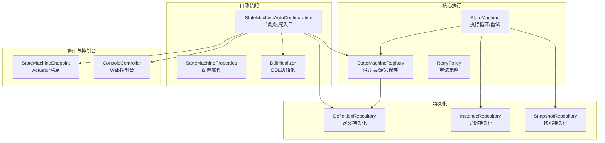
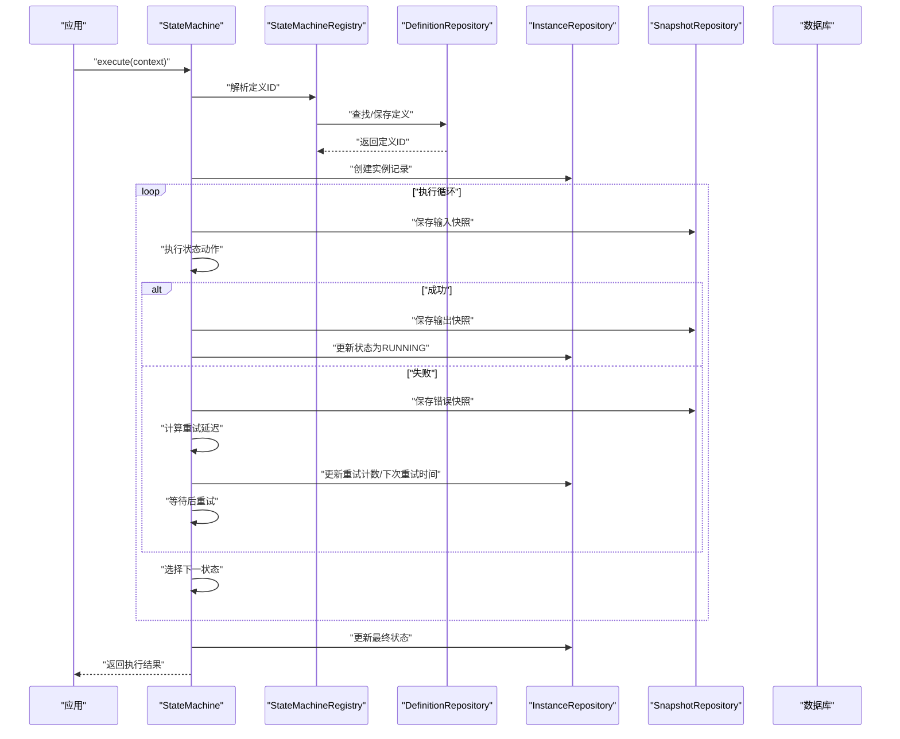
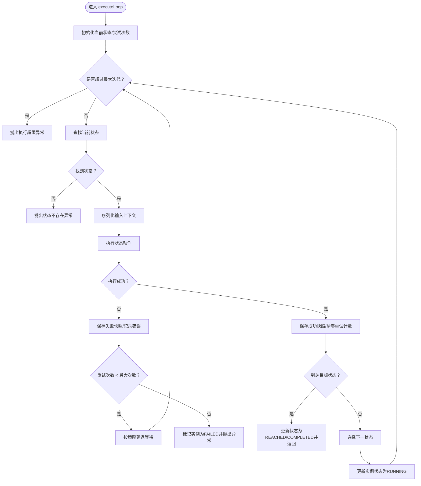
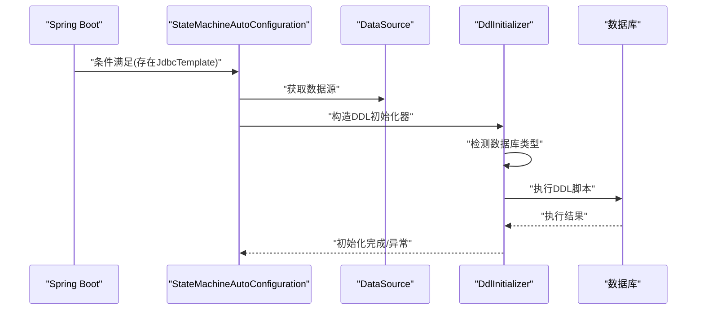
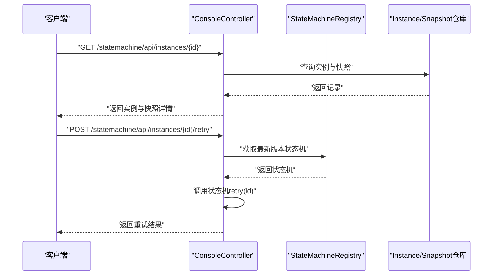
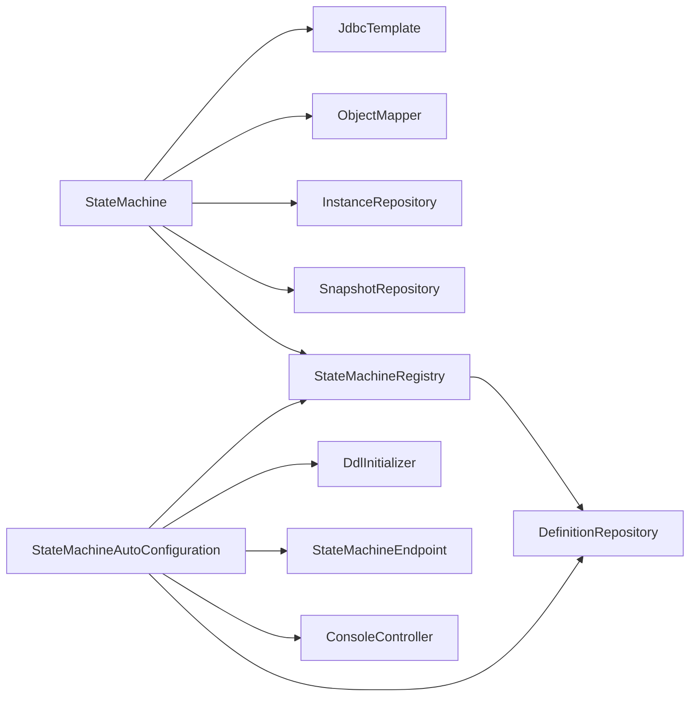

# 故障排除与FAQ

<cite>
**本文引用的文件**
- [README.md](file://README.md)
- [StateMachineAutoConfiguration.java](file://src/main/java/cn/chedejun/statemachine/autoconfigure/StateMachineAutoConfiguration.java)
- [StateMachineProperties.java](file://src/main/java/cn/chedejun/statemachine/autoconfigure/StateMachineProperties.java)
- [DdlInitializer.java](file://src/main/java/cn/chedejun/statemachine/persistence/DdlInitializer.java)
- [StateMachine.java](file://src/main/java/cn/chedejun/statemachine/core/StateMachine.java)
- [StateMachineException.java](file://src/main/java/cn/chedejun/statemachine/core/StateMachineException.java)
- [StateMachineRegistry.java](file://src/main/java/cn/chedejun/statemachine/core/StateMachineRegistry.java)
- [DefinitionRepository.java](file://src/main/java/cn/chedejun/statemachine/persistence/DefinitionRepository.java)
- [InstanceRepository.java](file://src/main/java/cn/chedejun/statemachine/persistence/InstanceRepository.java)
- [ConsoleController.java](file://src/main/java/cn/chedejun/statemachine/management/ConsoleController.java)
- [StateMachineEndpoint.java](file://src/main/java/cn/chedejun/statemachine/management/StateMachineEndpoint.java)
- [application.yml](file://demo/src/main/resources/application.yml)
- [mysql.sql](file://src/main/resources/ddl/mysql.sql)
- [postgresql.sql](file://src/main/resources/ddl/postgresql.sql)
- [StateMachineIntegrationTest.java](file://src/test/java/cn/chedejun/statemachine/integration/StateMachineIntegrationTest.java)
</cite>

## 目录
1. [简介](#简介)
2. [项目结构](#项目结构)
3. [核心组件](#核心组件)
4. [架构总览](#架构总览)
5. [详细组件分析](#详细组件分析)
6. [依赖分析](#依赖分析)
7. [性能考虑](#性能考虑)
8. [故障排除指南](#故障排除指南)
9. [结论](#结论)
10. [附录](#附录)

## 简介
本文件面向使用状态机启动器的开发者与运维人员，系统性梳理运行期常见问题与排障路径，覆盖状态机执行异常、数据库连接与DDL初始化问题、配置错误、性能诊断、日志分析与问题定位、社区支持与问题反馈渠道，以及已知问题与版本兼容性提示。内容基于仓库中的源码与集成测试进行归纳总结，帮助快速定位并解决问题。

## 项目结构
- 自动装配模块：负责在具备数据源时自动注册DDL初始化、定义持久化、状态机注册表、管理端点与控制台控制器。
- 核心执行模块：状态机定义、状态、转换、重试策略、执行循环与结果封装。
- 持久化模块：定义、实例、快照三类表的持久化与查询。
- 管理与控制台：Actuator端点与Web控制台，用于查看机器与实例、执行重试等。
- 示例与测试：演示配置、数据库脚本与集成测试用例。

图表来源
- [StateMachineAutoConfiguration.java:22-79](file://src/main/java/cn/chedejun/statemachine/autoconfigure/StateMachineAutoConfiguration.java#L22-L79)
- [StateMachine.java:11-35](file://src/main/java/cn/chedejun/statemachine/core/StateMachine.java#L11-L35)
- [DefinitionRepository.java:15-22](file://src/main/java/cn/chedejun/statemachine/persistence/DefinitionRepository.java#L15-L22)
- [InstanceRepository.java:11-13](file://src/main/java/cn/chedejun/statemachine/persistence/InstanceRepository.java#L11-L13)
- [ConsoleController.java:15-32](file://src/main/java/cn/chedejun/statemachine/management/ConsoleController.java#L15-L32)
- [StateMachineEndpoint.java:16-24](file://src/main/java/cn/chedejun/statemachine/management/StateMachineEndpoint.java#L16-L24)

章节来源
- [StateMachineAutoConfiguration.java:22-79](file://src/main/java/cn/chedejun/statemachine/autoconfigure/StateMachineAutoConfiguration.java#L22-L79)
- [README.md:1-65](file://README.md#L1-L65)

## 核心组件
- 自动装配与条件加载
  - 在存在JdbcTemplate且数据源可用时，自动注册DDL初始化、定义仓库、注册表，并通过Bean后置处理器为状态机注入JdbcTemplate与注册表。
  - 可选启用Actuator端点与Web控制台，受配置项控制。
- 状态机执行
  - 执行循环中按状态顺序执行动作，记录快照与实例状态；失败时根据重试策略延迟重试，超过最大次数则标记为失败。
  - 支持目标状态到达与终端状态判定。
- 注册表与定义持久化
  - 首次注册时将状态机定义序列化保存至定义表，后续同名同版本复用。
- 管理与控制台
  - 提供REST接口列出机器、版本、实例与详情，支持重试操作；Actuator端点提供只读查询与重置失败实例为可重试状态的能力。

章节来源
- [StateMachineAutoConfiguration.java:28-56](file://src/main/java/cn/chedejun/statemachine/autoconfigure/StateMachineAutoConfiguration.java#L28-L56)
- [StateMachine.java:40-136](file://src/main/java/cn/chedejun/statemachine/core/StateMachine.java#L40-L136)
- [StateMachineRegistry.java:20-49](file://src/main/java/cn/chedejun/statemachine/core/StateMachineRegistry.java#L20-L49)
- [ConsoleController.java:34-104](file://src/main/java/cn/chedejun/statemachine/management/ConsoleController.java#L34-L104)
- [StateMachineEndpoint.java:32-71](file://src/main/java/cn/chedejun/statemachine/management/StateMachineEndpoint.java#L32-L71)

## 架构总览
下图展示从状态机定义到执行、持久化与管理端点的关键交互：

图表来源
- [StateMachine.java:40-136](file://src/main/java/cn/chedejun/statemachine/core/StateMachine.java#L40-L136)
- [StateMachineRegistry.java:20-49](file://src/main/java/cn/chedejun/statemachine/core/StateMachineRegistry.java#L20-L49)
- [DefinitionRepository.java:24-46](file://src/main/java/cn/chedejun/statemachine/persistence/DefinitionRepository.java#L24-L46)
- [InstanceRepository.java:15-38](file://src/main/java/cn/chedejun/statemachine/persistence/InstanceRepository.java#L15-L38)
- [StateMachineEndpoint.java:62-71](file://src/main/java/cn/chedejun/statemachine/management/StateMachineEndpoint.java#L62-L71)

## 详细组件分析

### 组件A：状态机执行与重试
- 关键行为
  - 初始化校验：若未注入JdbcTemplate，抛出未初始化异常。
  - 执行循环：按状态顺序执行，记录快照；失败时按指数退避策略重试，超过最大次数则标记失败。
  - 终止条件：达到目标状态或无匹配转换时完成；迭代超限抛出异常。
- 异常类型
  - 无匹配转换、状态不存在、实例处于终止状态等。

图表来源
- [StateMachine.java:83-136](file://src/main/java/cn/chedejun/statemachine/core/StateMachine.java#L83-L136)
- [StateMachineException.java:7-17](file://src/main/java/cn/chedejun/statemachine/core/StateMachineException.java#L7-L17)

章节来源
- [StateMachine.java:40-136](file://src/main/java/cn/chedejun/statemachine/core/StateMachine.java#L40-L136)
- [StateMachineException.java:3-18](file://src/main/java/cn/chedejun/statemachine/core/StateMachineException.java#L3-L18)

### 组件B：自动装配与DDL初始化
- 自动装配条件
  - 仅当存在JdbcTemplate类且数据源可用时生效。
  - 可选启用管理端点与控制台，受配置项控制。
- DDL初始化
  - 根据数据源URL自动识别数据库类型，加载对应SQL脚本并执行；不支持的类型回退到H2脚本。
  - 初始化失败会记录错误并抛出运行时异常。

图表来源
- [StateMachineAutoConfiguration.java:28-31](file://src/main/java/cn/chedejun/statemachine/autoconfigure/StateMachineAutoConfiguration.java#L28-L31)
- [DdlInitializer.java:20-42](file://src/main/java/cn/chedejun/statemachine/persistence/DdlInitializer.java#L20-L42)

章节来源
- [StateMachineAutoConfiguration.java:22-79](file://src/main/java/cn/chedejun/statemachine/autoconfigure/StateMachineAutoConfiguration.java#L22-L79)
- [DdlInitializer.java:20-52](file://src/main/java/cn/chedejun/statemachine/persistence/DdlInitializer.java#L20-L52)

### 组件C：管理端点与控制台
- Actuator端点
  - 列出机器与版本、重置失败实例为可重试状态（需配合业务调用重试API）。
- Web控制台
  - 提供机器列表、版本详情、实例分页查询、实例详情与快照、触发重试等能力。

图表来源
- [ConsoleController.java:78-104](file://src/main/java/cn/chedejun/statemachine/management/ConsoleController.java#L78-L104)
- [StateMachineEndpoint.java:62-71](file://src/main/java/cn/chedejun/statemachine/management/StateMachineEndpoint.java#L62-L71)

章节来源
- [ConsoleController.java:34-104](file://src/main/java/cn/chedejun/statemachine/management/ConsoleController.java#L34-L104)
- [StateMachineEndpoint.java:32-71](file://src/main/java/cn/chedejun/statemachine/management/StateMachineEndpoint.java#L32-L71)

## 依赖分析
- 组件耦合
  - 状态机依赖JdbcTemplate、ObjectMapper、实例与快照仓库；通过注册表解析定义ID。
  - 注册表依赖定义仓库，首次注册时写入定义。
  - 自动装配依赖数据源与JdbcTemplate，按条件启用管理端点与控制台。
- 外部依赖
  - 数据库类型由URL推断，支持MySQL与PostgreSQL，脚本采用JSON/JSONB字段。

图表来源
- [StateMachine.java:194-195](file://src/main/java/cn/chedejun/statemachine/core/StateMachine.java#L194-L195)
- [StateMachineRegistry.java:14-18](file://src/main/java/cn/chedejun/statemachine/core/StateMachineRegistry.java#L14-L18)
- [StateMachineAutoConfiguration.java:28-78](file://src/main/java/cn/chedejun/statemachine/autoconfigure/StateMachineAutoConfiguration.java#L28-L78)

章节来源
- [StateMachine.java:11-35](file://src/main/java/cn/chedejun/statemachine/core/StateMachine.java#L11-L35)
- [StateMachineRegistry.java:9-18](file://src/main/java/cn/chedejun/statemachine/core/StateMachineRegistry.java#L9-L18)
- [StateMachineAutoConfiguration.java:22-79](file://src/main/java/cn/chedejun/statemachine/autoconfigure/StateMachineAutoConfiguration.java#L22-L79)

## 性能考虑
- 重试策略
  - 默认指数退避参数可通过配置项调整，避免频繁重试导致资源争用。
- 执行循环上限
  - 循环次数与状态数量、最大重试次数相关，过大的状态机或重试次数可能导致超限异常。
- 数据库写入
  - 快照与实例状态写入频繁，建议评估数据库性能与索引设计（如按机器名与状态查询）。
- 控制台与端点
  - 分页查询与限制每页大小，避免一次性拉取大量数据。

章节来源
- [StateMachineProperties.java:18-31](file://src/main/java/cn/chedejun/statemachine/autoconfigure/StateMachineProperties.java#L18-L31)
- [StateMachine.java:85-86](file://src/main/java/cn/chedejun/statemachine/core/StateMachine.java#L85-L86)
- [ConsoleController.java:62-76](file://src/main/java/cn/chedejun/statemachine/management/ConsoleController.java#L62-L76)

## 故障排除指南

### 一、状态机执行异常
- 症状
  - 抛出“状态不存在”“无匹配转换”“实例处于终止状态”“执行超限”等异常。
- 排查步骤
  - 确认状态机定义中包含当前状态与可到达的下一状态。
  - 若设置了目标状态，请确认条件表达式可满足。
  - 检查是否达到最大迭代次数，必要时优化状态机结构或增加重试上限。
- 相关异常类型
  - 状态不存在、无匹配转换、终止状态、执行超限。

章节来源
- [StateMachineException.java:7-17](file://src/main/java/cn/chedejun/statemachine/core/StateMachineException.java#L7-L17)
- [StateMachine.java:91-92](file://src/main/java/cn/chedejun/statemachine/core/StateMachine.java#L91-L92)
- [StateMachine.java:128-130](file://src/main/java/cn/chedejun/statemachine/core/StateMachine.java#L128-L130)
- [StateMachine.java:135-136](file://src/main/java/cn/chedejun/statemachine/core/StateMachine.java#L135-L136)

### 二、数据库连接与DDL初始化问题
- 症状
  - 启动时报DDL初始化失败或表未创建。
- 排查步骤
  - 确认数据源配置正确，驱动类名与URL匹配实际数据库。
  - 检查DDL脚本是否被加载（自动识别数据库类型，不支持类型回退到H2脚本）。
  - 确认数据库用户具备创建表权限。
- 相关实现
  - DDL初始化器根据URL识别数据库类型并执行对应脚本。
  - 脚本文件包含MySQL与PostgreSQL两种实现。

章节来源
- [DdlInitializer.java:20-42](file://src/main/java/cn/chedejun/statemachine/persistence/DdlInitializer.java#L20-L42)
- [mysql.sql:1-18](file://src/main/resources/ddl/mysql.sql#L1-L18)
- [postgresql.sql:1-18](file://src/main/resources/ddl/postgresql.sql#L1-L18)
- [application.yml:4-16](file://demo/src/main/resources/application.yml#L4-L16)

### 三、配置错误
- 症状
  - 管理端点或控制台不可用；DDL未自动创建。
- 排查步骤
  - 检查配置项：state-machine.ddl-auto、state-machine.management.enabled、state-machine.console.enabled。
  - 确认Actuator或Web依赖已引入以启用相应功能。
- 相关实现
  - 自动装配按属性开关启用管理端点与控制台。
  - 配置属性类提供默认值与访问器。

章节来源
- [StateMachineAutoConfiguration.java:58-78](file://src/main/java/cn/chedejun/statemachine/autoconfigure/StateMachineAutoConfiguration.java#L58-L78)
- [StateMachineProperties.java:5-34](file://src/main/java/cn/chedejun/statemachine/autoconfigure/StateMachineProperties.java#L5-L34)
- [application.yml:11-22](file://demo/src/main/resources/application.yml#L11-L22)

### 四、状态机未初始化（缺少数据源）
- 症状
  - 执行时报“未初始化”异常。
- 排查步骤
  - 确保数据源已配置且JdbcTemplate可用。
  - 检查自动装配是否生效（依赖条件满足）。
- 相关实现
  - 状态机在执行前检查JdbcTemplate是否注入。

章节来源
- [StateMachine.java:178-180](file://src/main/java/cn/chedejun/statemachine/core/StateMachine.java#L178-L180)
- [StateMachineAutoConfiguration.java:25-26](file://src/main/java/cn/chedejun/statemachine/autoconfigure/StateMachineAutoConfiguration.java#L25-L26)

### 五、重试失败与重试策略
- 症状
  - 多次重试后仍失败；重试间隔不合理导致资源占用。
- 排查步骤
  - 检查重试策略配置（最大次数、初始延迟、最大延迟、退避因子）。
  - 确认状态机动作幂等性，避免重复副作用。
- 相关实现
  - 执行循环中按策略计算延迟并等待；超过最大次数标记失败。

章节来源
- [StateMachine.java:104-115](file://src/main/java/cn/chedejun/statemachine/core/StateMachine.java#L104-L115)
- [StateMachineProperties.java:18-31](file://src/main/java/cn/chedejun/statemachine/autoconfigure/StateMachineProperties.java#L18-L31)

### 六、管理端点与控制台问题
- 症状
  - 访问控制台页面或调用端点返回错误。
- 排查步骤
  - 确认端点暴露与控制台开关已启用。
  - 检查实例是否存在、状态是否为FAILED（重置后才可再次重试）。
- 相关实现
  - 端点与控制台均依赖JdbcTemplate与仓库层。

章节来源
- [ConsoleController.java:78-104](file://src/main/java/cn/chedejun/statemachine/management/ConsoleController.java#L78-L104)
- [StateMachineEndpoint.java:62-71](file://src/main/java/cn/chedejun/statemachine/management/StateMachineEndpoint.java#L62-L71)

### 七、日志分析与问题定位技巧
- 关键日志位置
  - DDL初始化：初始化成功/失败与脚本路径。
  - 执行循环：每次状态执行的快照记录与错误消息。
- 定位方法
  - 通过控制台或端点查看实例状态与错误信息。
  - 结合快照记录定位具体失败状态与尝试次数。
- 测试参考
  - 集成测试展示了成功与失败场景下的数据库状态与断言。

章节来源
- [DdlInitializer.java:39-42](file://src/main/java/cn/chedejun/statemachine/persistence/DdlInitializer.java#L39-L42)
- [StateMachine.java:99-115](file://src/main/java/cn/chedejun/statemachine/core/StateMachine.java#L99-L115)
- [StateMachineIntegrationTest.java:160-182](file://src/test/java/cn/chedejun/statemachine/integration/StateMachineIntegrationTest.java#L160-L182)
- [StateMachineIntegrationTest.java:206-217](file://src/test/java/cn/chedejun/statemachine/integration/StateMachineIntegrationTest.java#L206-L217)

### 八、社区支持与问题反馈渠道
- 当前仓库未提供专门的社区支持与问题反馈渠道说明。建议：
  - 在Issue区提交问题，附带最小可复现配置与日志。
  - 提供环境信息（数据库类型、Spring Boot版本、依赖版本）。

[本节为通用建议，不直接分析具体文件]

## 结论
通过本故障排除与FAQ文档，您可以系统地定位状态机启动器在运行期遇到的常见问题：从配置与DDL初始化，到执行异常与重试策略，再到管理端点与控制台的使用与日志分析。建议在生产环境中结合分页查询、合理的重试策略与完善的监控告警，持续优化状态机的稳定性与性能。

## 附录

### A. 已知问题与版本兼容性
- 已知问题
  - 不支持的数据库类型将回退到H2脚本，可能导致DDL不符合预期。
  - 控制台与端点功能依赖外部依赖（Actuator/Web），缺失时不会报错但功能不可用。
- 版本兼容性
  - DDL脚本针对MySQL与PostgreSQL提供专用实现，其他数据库类型可能无法自动识别。
  - 配置项与自动装配逻辑基于Spring Boot条件注解，确保在合适环境下启用。

章节来源
- [DdlInitializer.java:27-33](file://src/main/java/cn/chedejun/statemachine/persistence/DdlInitializer.java#L27-L33)
- [StateMachineAutoConfiguration.java:58-78](file://src/main/java/cn/chedejun/statemachine/autoconfigure/StateMachineAutoConfiguration.java#L58-L78)
- [mysql.sql:1-18](file://src/main/resources/ddl/mysql.sql#L1-L18)
- [postgresql.sql:1-18](file://src/main/resources/ddl/postgresql.sql#L1-L18)