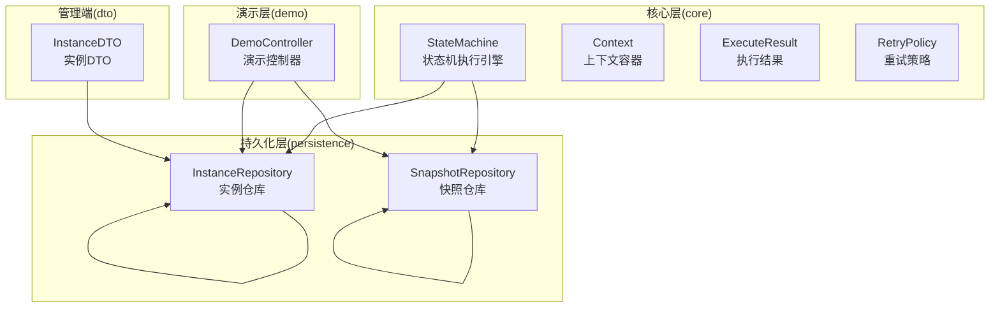
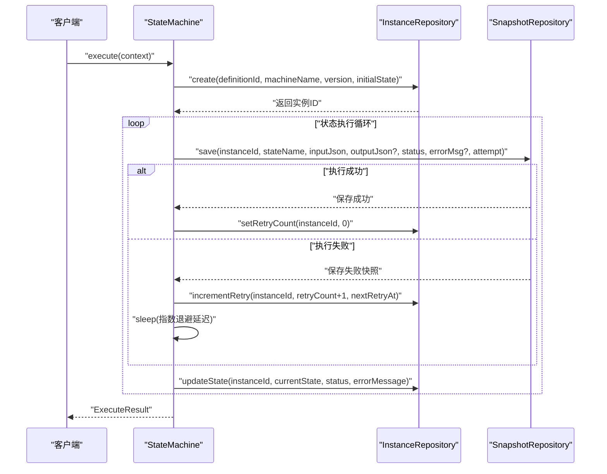
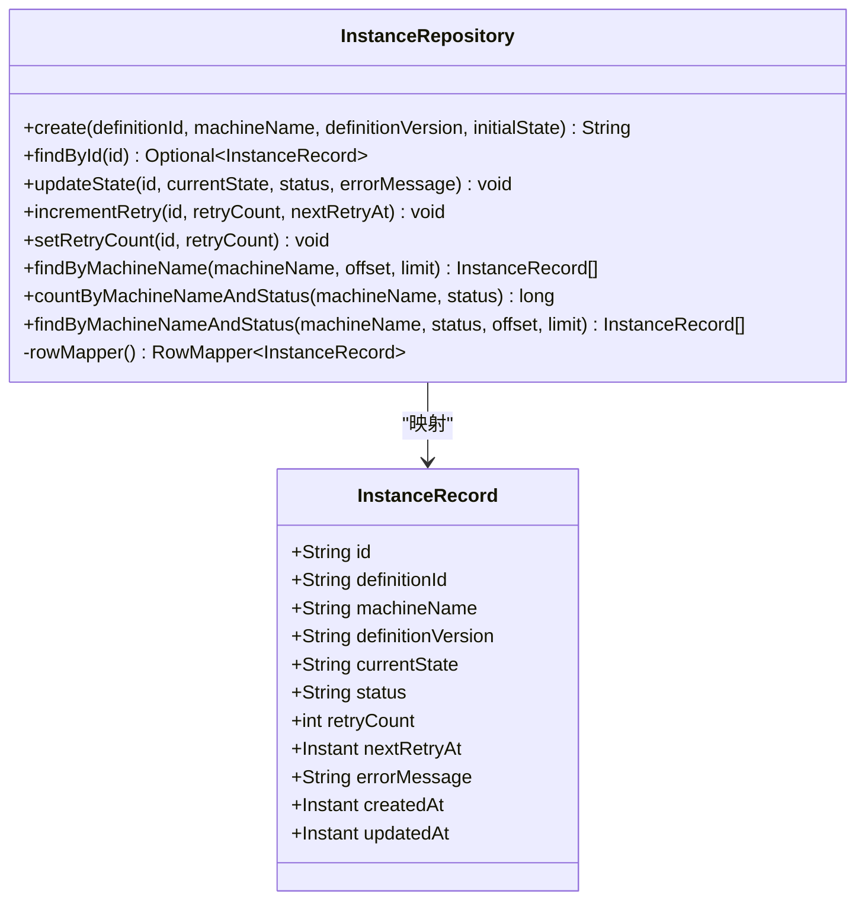
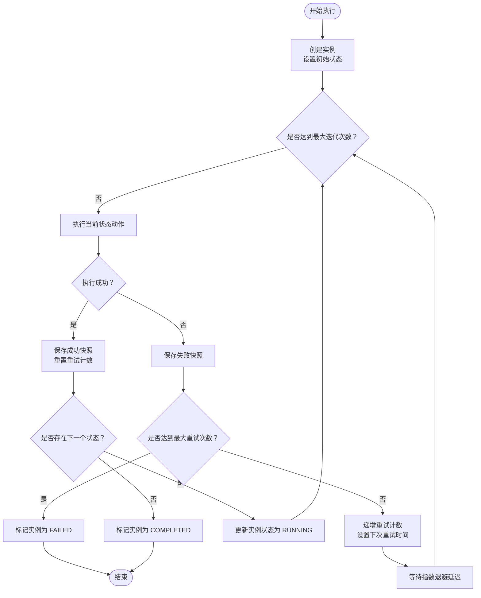
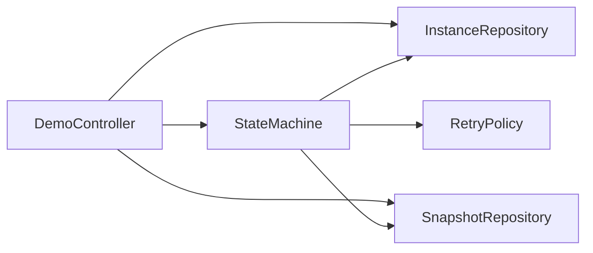

# 执行实例管理

<cite>
**本文引用的文件**
- [InstanceRepository.java](file://src/main/java/cn/chedejun/statemachine/persistence/InstanceRepository.java)
- [StateMachine.java](file://src/main/java/cn/chedejun/statemachine/core/StateMachine.java)
- [Context.java](file://src/main/java/cn/chedejun/statemachine/core/Context.java)
- [InstanceDTO.java](file://src/main/java/cn/chedejun/statemachine/management/dto/InstanceDTO.java)
- [SnapshotRepository.java](file://src/main/java/cn/chedejun/statemachine/persistence/SnapshotRepository.java)
- [ExecuteResult.java](file://src/main/java/cn/chedejun/statemachine/core/ExecuteResult.java)
- [mysql.sql](file://src/main/resources/ddl/mysql.sql)
- [DemoController.java](file://demo/src/main/java/cn/chedejun/demo/controller/DemoController.java)
- [InstanceRepositoryTest.java](file://src/test/java/cn/chedejun/statemachine/persistence/InstanceRepositoryTest.java)
- [OrderContext.java](file://demo/src/main/java/cn/chedejun/demo/statemachine/OrderContext.java)
- [RetryPolicy.java](file://src/main/java/cn/chedejun/statemachine/core/RetryPolicy.java)
</cite>

## 目录
1. [简介](#简介)
2. [项目结构](#项目结构)
3. [核心组件](#核心组件)
4. [架构总览](#架构总览)
5. [详细组件分析](#详细组件分析)
6. [依赖关系分析](#依赖关系分析)
7. [性能考虑](#性能考虑)
8. [故障排查指南](#故障排查指南)
9. [结论](#结论)

## 简介
本文件围绕执行实例管理展开，重点阐述 InstanceRepository 的核心功能与实现原理，涵盖状态机执行实例的生命周期管理、状态跟踪、上下文数据存储、实例创建与状态更新、完成标记、实例查询方法（按状态过滤、时间范围查询、批量操作）、实例数据模型字段含义与业务逻辑，以及并发控制与事务处理的最佳实践。文档同时结合测试用例与演示控制器，帮助读者快速理解并正确使用该模块。

## 项目结构
该项目采用分层架构：核心状态机逻辑位于 `core` 包，持久化层位于 `persistence` 包，管理端 DTO 位于 `management/dto` 包，DDL 定义位于资源目录，示例演示位于 `demo` 模块。InstanceRepository 作为持久化层的关键组件，负责实例表的 CRUD 与查询能力，并与 SnapshotRepository 协同记录每次状态执行的快照。

图表来源
- [StateMachine.java:11-196](file://src/main/java/cn/chedejun/statemachine/core/StateMachine.java#L11-L196)
- [InstanceRepository.java:11-66](file://src/main/java/cn/chedejun/statemachine/persistence/InstanceRepository.java#L11-L66)
- [SnapshotRepository.java:11-55](file://src/main/java/cn/chedejun/statemachine/persistence/SnapshotRepository.java#L11-L55)
- [InstanceDTO.java:1-6](file://src/main/java/cn/chedejun/statemachine/management/dto/InstanceDTO.java#L1-L6)
- [DemoController.java:17-288](file://demo/src/main/java/cn/chedejun/demo/controller/DemoController.java#L17-L288)

章节来源
- [StateMachine.java:11-196](file://src/main/java/cn/chedejun/statemachine/core/StateMachine.java#L11-L196)
- [InstanceRepository.java:11-66](file://src/main/java/cn/chedejun/statemachine/persistence/InstanceRepository.java#L11-L66)
- [SnapshotRepository.java:11-55](file://src/main/java/cn/chedejun/statemachine/persistence/SnapshotRepository.java#L11-L55)
- [InstanceDTO.java:1-6](file://src/main/java/cn/chedejun/statemachine/management/dto/InstanceDTO.java#L1-L6)
- [DemoController.java:17-288](file://demo/src/main/java/cn/chedejun/demo/controller/DemoController.java#L17-L288)

## 核心组件
- InstanceRepository：负责实例表的创建、状态更新、重试计数与查询。提供按机器名与状态的过滤查询、计数统计、以及分页查询能力。
- SnapshotRepository：负责状态执行快照的保存与查询，记录每次状态执行的输入输出、状态、错误信息与尝试次数。
- StateMachine：状态机执行引擎，协调实例创建、状态流转、重试策略、快照保存与状态更新。
- Context：通用上下文容器，支持键值存取与序列化/反序列化。
- ExecuteResult：封装执行结果，便于上层业务直接使用。
- InstanceDTO：管理端使用的实例数据传输对象。

章节来源
- [InstanceRepository.java:11-66](file://src/main/java/cn/chedejun/statemachine/persistence/InstanceRepository.java#L11-L66)
- [SnapshotRepository.java:11-55](file://src/main/java/cn/chedejun/statemachine/persistence/SnapshotRepository.java#L11-L55)
- [StateMachine.java:11-196](file://src/main/java/cn/chedejun/statemachine/core/StateMachine.java#L11-L196)
- [Context.java:6-24](file://src/main/java/cn/chedejun/statemachine/core/Context.java#L6-L24)
- [ExecuteResult.java:14-23](file://src/main/java/cn/chedejun/statemachine/core/ExecuteResult.java#L14-L23)
- [InstanceDTO.java:1-6](file://src/main/java/cn/chedejun/statemachine/management/dto/InstanceDTO.java#L1-L6)

## 架构总览
下图展示了状态机执行过程中实例与快照的协作关系，以及持久化层的职责边界。

图表来源
- [StateMachine.java:40-136](file://src/main/java/cn/chedejun/statemachine/core/StateMachine.java#L40-L136)
- [InstanceRepository.java:15-38](file://src/main/java/cn/chedejun/statemachine/persistence/InstanceRepository.java#L15-L38)
- [SnapshotRepository.java:15-31](file://src/main/java/cn/chedejun/statemachine/persistence/SnapshotRepository.java#L15-L31)

## 详细组件分析

### 实例数据模型与字段语义
实例表结构由 DDL 定义，包含以下关键字段：
- id：实例唯一标识
- definition_id：定义版本关联
- machine_name：状态机名称
- definition_version：定义版本号
- current_state：当前状态名
- status：实例状态（RUNNING/COMPLETED/REACHED/FAILED）
- retry_count：重试次数
- next_retry_at：下次重试时间
- error_message：错误信息
- created_at/updated_at：创建与更新时间戳

这些字段共同构成实例的完整生命周期视图，支撑状态跟踪、重试控制与查询统计。

章节来源
- [mysql.sql:6-12](file://src/main/resources/ddl/mysql.sql#L6-L12)

### InstanceRepository 核心功能
- 实例创建：生成随机实例ID，插入初始状态并默认 RUNNING 状态。
- 状态更新：根据执行结果更新 current_state、status、error_message，并刷新 updated_at。
- 重试控制：维护 retry_count 与 next_retry_at，配合指数退避策略；当达到最大重试次数时标记为 FAILED。
- 查询接口：
  - 按机器名分页查询：findByMachineName
  - 统计数量：countByMachineNameAndStatus（可选按状态过滤）
  - 按机器名与状态过滤：findByMachineNameAndStatus
- 数据映射：RowMapper 将数据库记录映射为 InstanceRecord 值对象。

图表来源
- [InstanceRepository.java:11-66](file://src/main/java/cn/chedejun/statemachine/persistence/InstanceRepository.java#L11-L66)

章节来源
- [InstanceRepository.java:15-51](file://src/main/java/cn/chedejun/statemachine/persistence/InstanceRepository.java#L15-L51)
- [InstanceRepository.java:53-64](file://src/main/java/cn/chedejun/statemachine/persistence/InstanceRepository.java#L53-L64)

### 状态机执行与实例生命周期
StateMachine 在执行过程中：
- 创建实例并设置初始状态
- 遍历状态，执行 Action
- 成功时保存成功快照并清零重试计数
- 失败时保存失败快照，按重试策略递增重试计数并延时重试
- 到达目标状态或无后续状态时，标记实例完成或到达

图表来源
- [StateMachine.java:83-136](file://src/main/java/cn/chedejun/statemachine/core/StateMachine.java#L83-L136)
- [SnapshotRepository.java:15-31](file://src/main/java/cn/chedejun/statemachine/persistence/SnapshotRepository.java#L15-L31)

章节来源
- [StateMachine.java:40-136](file://src/main/java/cn/chedejun/statemachine/core/StateMachine.java#L40-L136)

### 上下文数据存储与序列化
- Context 提供通用键值存储，支持从 Map 构造与导出。
- StateMachine 使用 Jackson 对上下文进行序列化/反序列化，确保状态间传递的数据可持久化。
- 快照中保存输入与输出 JSON，便于审计与回放。

章节来源
- [Context.java:6-24](file://src/main/java/cn/chedejun/statemachine/core/Context.java#L6-L24)
- [StateMachine.java:151-160](file://src/main/java/cn/chedejun/statemachine/core/StateMachine.java#L151-L160)
- [SnapshotRepository.java:15-31](file://src/main/java/cn/chedejun/statemachine/persistence/SnapshotRepository.java#L15-L31)

### 实例查询方法使用指南
- 按机器名分页查询：findByMachineName(machineName, offset, limit)
- 按机器名统计总数：countByMachineNameAndStatus(machineName, null)
- 按机器名与状态过滤：findByMachineNameAndStatus(machineName, status, offset, limit)
- 分页参数：offset 与 limit 控制结果集范围
- 排序规则：按创建时间倒序排列

章节来源
- [InstanceRepository.java:40-51](file://src/main/java/cn/chedejun/statemachine/persistence/InstanceRepository.java#L40-L51)
- [InstanceRepositoryTest.java:37-50](file://src/test/java/cn/chedejun/statemachine/persistence/InstanceRepositoryTest.java#L37-L50)

### 实例并发控制与事务处理最佳实践
- 并发控制建议：
  - 使用数据库锁或乐观锁机制避免并发更新冲突（例如在更新状态时增加版本号字段并在 WHERE 条件中校验）。
  - 对于高并发场景，建议在应用层引入队列或分布式锁，确保同一实例的并发执行串行化。
- 事务处理建议：
  - 将“创建实例 + 第一次状态执行”放入单个事务，保证一致性。
  - 快照保存与实例状态更新应尽量在同一事务内提交，避免中间态不一致。
  - 对重试场景，建议在事务中统一处理重试计数与下次重试时间的更新。
- 错误恢复：
  - 对于 FAILED 实例，提供明确的重试入口（如 DemoController 中的重试接口），先将状态重置为 RUNNING 并清零重试计数，再触发执行循环。

章节来源
- [DemoController.java:162-167](file://demo/src/main/java/cn/chedejun/demo/controller/DemoController.java#L162-L167)
- [StateMachine.java:50-79](file://src/main/java/cn/chedejun/statemachine/core/StateMachine.java#L50-L79)

## 依赖关系分析
- StateMachine 依赖：
  - InstanceRepository：创建实例、更新状态、重试计数
  - SnapshotRepository：保存快照
  - RetryPolicy：计算重试延迟
- DemoController 依赖：
  - StateMachine：执行业务流程
  - InstanceRepository/SnapshotRepository：查询与展示实例详情
- 数据模型依赖：
  - 实例表与快照表通过外键关联（DDL 中定义）

图表来源
- [StateMachine.java:19-26](file://src/main/java/cn/chedejun/statemachine/core/StateMachine.java#L19-L26)
- [DemoController.java:21-33](file://demo/src/main/java/cn/chedejun/demo/controller/DemoController.java#L21-L33)

章节来源
- [StateMachine.java:19-26](file://src/main/java/cn/chedejun/statemachine/core/StateMachine.java#L19-L26)
- [DemoController.java:21-33](file://demo/src/main/java/cn/chedejun/demo/controller/DemoController.java#L21-L33)

## 性能考虑
- 查询优化：
  - 为 machine_name 与 status 字段建立索引以提升过滤查询性能。
  - 对 created_at/updated_at 建立索引以优化排序与分页。
- 写入优化：
  - 批量写入快照时尽量减少往返次数，合并 SQL 批处理。
  - 控制重试频率，避免频繁更新导致的热点写入。
- 序列化开销：
  - 上下文序列化/反序列化成本较高时，可考虑精简上下文字段或使用二进制序列化方案。
- 并发与锁：
  - 对实例状态更新加锁，避免竞争条件导致的重复重试或状态错乱。

## 故障排查指南
- 常见问题与定位：
  - 实例状态异常：检查 SnapshotRepository 是否正确保存快照，确认状态更新逻辑是否覆盖所有分支。
  - 重试无效：核对 RetryPolicy 配置与 next_retry_at 更新逻辑，确保睡眠与重试计数递增正确。
  - 查询结果为空：确认 machine_name 与 status 参数是否匹配，检查分页 offset/limit 设置。
- 单元测试参考：
  - 创建实例默认 RUNNING：验证 create 后状态与初始状态正确性
  - 状态更新：验证 updateState 能正确变更 current_state 与 status
  - 重试计数：验证 incrementRetry 与 setRetryCount 的行为
  - 过滤查询：验证 findByMachineName 与 findByMachineNameAndStatus 的过滤效果
  - 统计计数：验证 countByMachineNameAndStatus 的计数准确性

章节来源
- [InstanceRepositoryTest.java:12-50](file://src/test/java/cn/chedejun/statemachine/persistence/InstanceRepositoryTest.java#L12-L50)

## 结论
InstanceRepository 作为状态机执行实例的核心持久化组件，提供了完整的实例生命周期管理能力，包括创建、状态跟踪、重试控制与多维度查询。结合 SnapshotRepository 的快照能力与 StateMachine 的执行引擎，系统实现了可观测、可恢复、可扩展的状态机执行体系。通过合理的并发控制与事务处理策略，可在高并发场景下保持数据一致性与性能稳定。