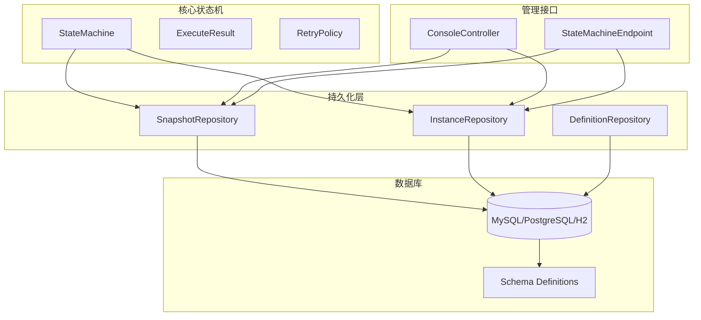
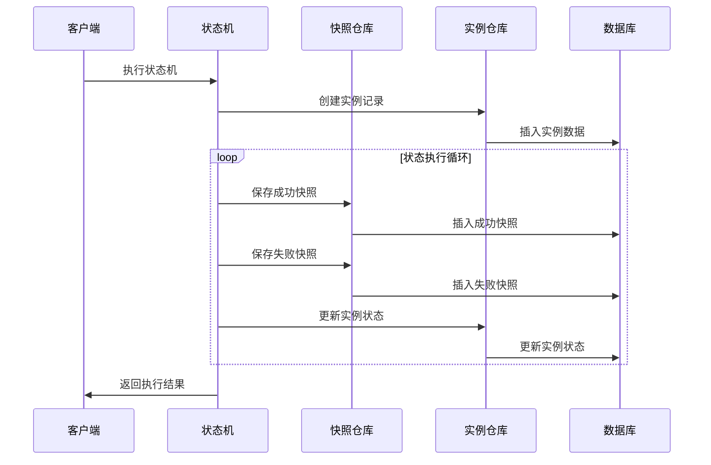
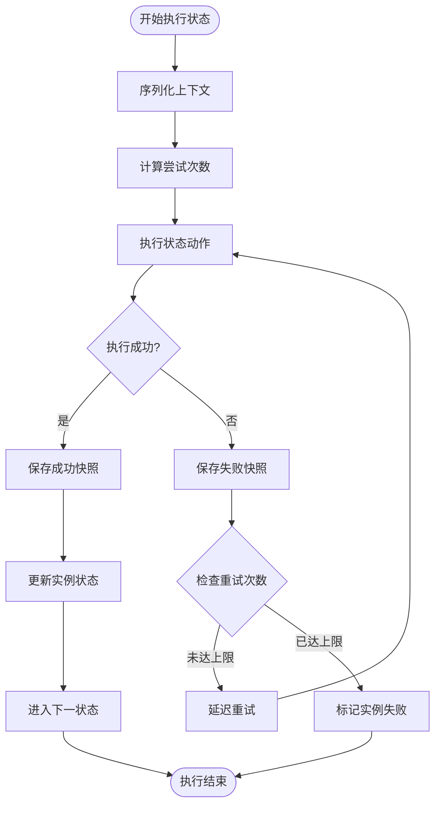
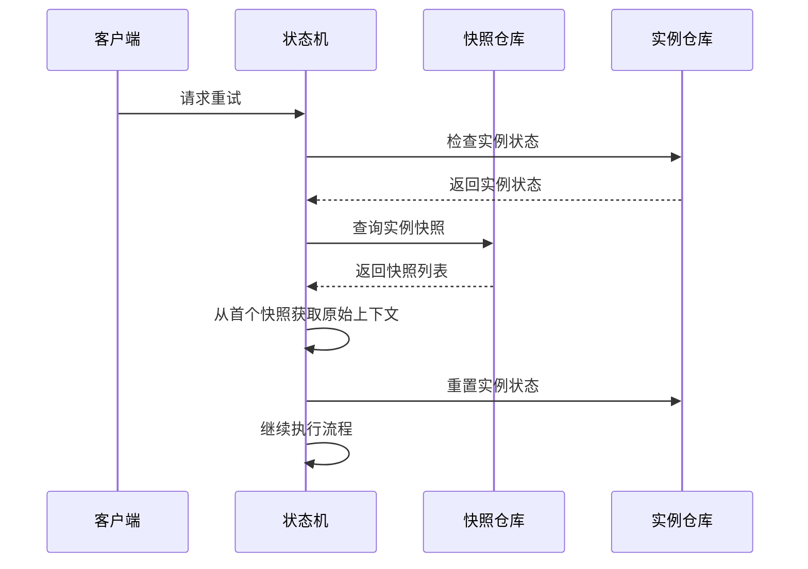
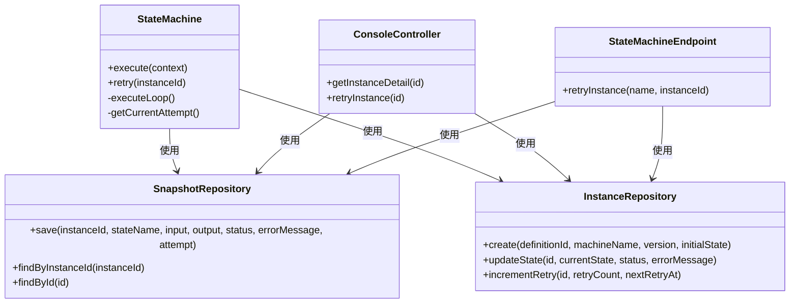

# 执行快照存储

<cite>
**本文档引用的文件**
- [SnapshotRepository.java](file://src/main/java/cn/chedejun/statemachine/persistence/SnapshotRepository.java)
- [SnapshotDTO.java](file://src/main/java/cn/chedejun/statemachine/management/dto/SnapshotDTO.java)
- [SnapshotRepositoryTest.java](file://src/test/java/cn/chedejun/statemachine/persistence/SnapshotRepositoryTest.java)
- [StateMachine.java](file://src/main/java/cn/chedejun/statemachine/core/StateMachine.java)
- [ExecuteResult.java](file://src/main/java/cn/chedejun/statemachine/core/ExecuteResult.java)
- [InstanceRepository.java](file://src/main/java/cn/chedejun/statemachine/persistence/InstanceRepository.java)
- [ConsoleController.java](file://src/main/java/cn/chedejun/statemachine/management/ConsoleController.java)
- [StateMachineEndpoint.java](file://src/main/java/cn/chedejun/statemachine/management/StateMachineEndpoint.java)
- [mysql.sql](file://src/main/resources/ddl/mysql.sql)
- [RetryPolicy.java](file://src/main/java/cn/chedejun/statemachine/core/RetryPolicy.java)
- [DdlInitializer.java](file://src/main/java/cn/chedejun/statemachine/persistence/DdlInitializer.java)
- [application.yml](file://demo/src/main/resources/application.yml)
</cite>

## 目录
1. [简介](#简介)
2. [项目结构](#项目结构)
3. [核心组件](#核心组件)
4. [架构概览](#架构概览)
5. [详细组件分析](#详细组件分析)
6. [依赖关系分析](#依赖关系分析)
7. [性能考虑](#性能考虑)
8. [故障排除指南](#故障排除指南)
9. [结论](#结论)
10. [附录](#附录)

## 简介

执行快照存储是状态机框架中用于捕获和管理状态机执行过程的关键组件。该系统通过在状态机执行的每个关键节点创建快照，记录执行状态、输入输出数据、错误信息和重试尝试次数，为状态机的调试、监控和故障恢复提供了完整的数据支持。

快照存储系统的核心目标包括：
- 捕获状态机执行过程中的关键执行点
- 提供完整的执行历史记录以便审计和调试
- 支持基于快照的故障恢复和重试机制
- 提供灵活的查询和检索功能
- 实现高效的存储管理和清理策略

## 项目结构

状态机执行快照存储系统位于持久化层，与核心状态机逻辑紧密集成。整体项目结构如下：



**图表来源**
- [StateMachine.java:1-196](file://src/main/java/cn/chedejun/statemachine/core/StateMachine.java#L1-L196)
- [SnapshotRepository.java:1-55](file://src/main/java/cn/chedejun/statemachine/persistence/SnapshotRepository.java#L1-L55)
- [InstanceRepository.java:1-66](file://src/main/java/cn/chedejun/statemachine/persistence/InstanceRepository.java#L1-L66)

**章节来源**
- [StateMachine.java:1-196](file://src/main/java/cn/chedejun/statemachine/core/StateMachine.java#L1-L196)
- [SnapshotRepository.java:1-55](file://src/main/java/cn/chedejun/statemachine/persistence/SnapshotRepository.java#L1-L55)
- [InstanceRepository.java:1-66](file://src/main/java/cn/chedejun/statemachine/persistence/InstanceRepository.java#L1-L66)

## 核心组件

### 快照仓库 (SnapshotRepository)

快照仓库是执行快照存储的核心组件，负责快照数据的创建、查询和管理。其主要职责包括：

- **快照创建**：在状态机执行过程中捕获状态变化
- **数据持久化**：将快照数据存储到数据库
- **查询检索**：提供按实例ID查询快照的功能
- **数据结构映射**：定义快照数据的内部表示

快照仓库采用Spring JDBC模板进行数据库操作，确保了良好的性能和可维护性。

**章节来源**
- [SnapshotRepository.java:11-55](file://src/main/java/cn/chedejun/statemachine/persistence/SnapshotRepository.java#L11-L55)

### 快照记录 (SnapshotRecord)

快照记录是快照数据的内部表示，包含了执行快照的所有关键信息：

- `id`: 快照唯一标识符
- `instanceId`: 关联的实例ID
- `stateName`: 执行的状态名称
- `inputJson`: 执行前的输入数据
- `outputJson`: 执行后的输出数据
- `status`: 执行状态 (SUCCESS/FAILED)
- `errorMessage`: 错误信息
- `attempt`: 尝试次数
- `executedAt`: 执行时间戳

**章节来源**
- [SnapshotRepository.java:52-53](file://src/main/java/cn/chedejun/statemachine/persistence/SnapshotRepository.java#L52-L53)

### 快照数据传输对象 (SnapshotDTO)

快照DTO用于API响应的数据传输，提供了对外暴露的快照数据结构：

- `id`: 快照ID
- `stateName`: 状态名称
- `input`: 输入数据
- `output`: 输出数据
- `status`: 执行状态
- `errorMessage`: 错误信息
- `attempt`: 尝试次数
- `executedAt`: 执行时间戳

**章节来源**
- [SnapshotDTO.java:1-5](file://src/main/java/cn/chedejun/statemachine/management/dto/SnapshotDTO.java#L1-L5)

## 架构概览

执行快照存储系统采用分层架构设计，确保了清晰的关注点分离和良好的可扩展性：



**图表来源**
- [StateMachine.java:83-136](file://src/main/java/cn/chedejun/statemachine/core/StateMachine.java#L83-L136)
- [SnapshotRepository.java:15-31](file://src/main/java/cn/chedejun/statemachine/persistence/SnapshotRepository.java#L15-L31)
- [InstanceRepository.java:28-30](file://src/main/java/cn/chedejun/statemachine/persistence/InstanceRepository.java#L28-L30)

## 详细组件分析

### 快照创建机制

快照创建是状态机执行过程中的关键环节，系统在以下时机自动创建快照：

#### 成功执行快照
当状态动作成功执行时，系统创建包含输入输出数据的成功快照：



**图表来源**
- [StateMachine.java:97-116](file://src/main/java/cn/chedejun/statemachine/core/StateMachine.java#L97-L116)
- [SnapshotRepository.java:15-31](file://src/main/java/cn/chedejun/statemachine/persistence/SnapshotRepository.java#L15-L31)

#### 失败执行快照
当状态动作执行失败时，系统创建包含错误信息的失败快照：

**章节来源**
- [StateMachine.java:97-116](file://src/main/java/cn/chedejun/statemachine/core/StateMachine.java#L97-L116)
- [SnapshotRepositoryTest.java:23-30](file://src/test/java/cn/chedejun/statemachine/persistence/SnapshotRepositoryTest.java#L23-L30)

### 快照数据结构设计

快照数据结构经过精心设计，以满足不同场景下的需求：

#### 核心字段设计
- **id**: 使用UUID确保全局唯一性
- **instance_id**: 建立与实例的关联关系
- **state_name**: 记录执行的具体状态
- **input**: JSON格式的输入数据，支持复杂对象
- **output**: JSON格式的输出数据，支持执行结果
- **status**: 执行状态枚举值
- **error_message**: 失败时的详细错误信息
- **attempt**: 尝试次数，支持重试场景
- **executed_at**: 时间戳，用于排序和查询

#### 数据类型选择
系统采用JSON字段存储输入输出数据，提供了以下优势：
- 支持任意复杂的数据结构
- 保持数据的原始格式
- 便于序列化和反序列化
- 良好的跨平台兼容性

**章节来源**
- [SnapshotRepository.java:15-31](file://src/main/java/cn/chedejun/statemachine/persistence/SnapshotRepository.java#L15-L31)
- [mysql.sql:13-17](file://src/main/resources/ddl/mysql.sql#L13-L17)

### 查询和检索API

系统提供了多种查询方式来检索快照数据：

#### 按实例ID查询
```java
public List<SnapshotRecord> findByInstanceId(String instanceId)
```
- 支持按实例ID查询所有相关快照
- 结果按执行时间和尝试次数排序
- 便于查看完整的执行历史

#### 按ID查询单个快照
```java
public SnapshotRecord findById(String id)
```
- 支持精确查询特定快照
- 用于快照详情展示和调试

#### 排序规则
查询结果按照以下规则排序：
1. 首先按执行时间升序排列
2. 然后按尝试次数升序排列
3. 确保执行历史的正确顺序

**章节来源**
- [SnapshotRepository.java:37-50](file://src/main/java/cn/chedejun/statemachine/persistence/SnapshotRepository.java#L37-L50)
- [SnapshotRepositoryTest.java:32-44](file://src/test/java/cn/chedejun/statemachine/persistence/SnapshotRepositoryTest.java#L32-L44)

### 重试机制与快照关联

快照系统与重试机制深度集成，支持基于首次快照的故障恢复：



**图表来源**
- [StateMachine.java:64-79](file://src/main/java/cn/chedejun/statemachine/core/StateMachine.java#L64-L79)
- [StateMachine.java:168-172](file://src/main/java/cn/chedejun/statemachine/core/StateMachine.java#L168-L172)

**章节来源**
- [StateMachine.java:64-79](file://src/main/java/cn/chedejun/statemachine/core/StateMachine.java#L64-L79)
- [StateMachine.java:168-172](file://src/main/java/cn/chedejun/statemachine/core/StateMachine.java#L168-L172)

## 依赖关系分析

快照存储系统与其他组件存在密切的依赖关系：



**图表来源**
- [StateMachine.java:11-35](file://src/main/java/cn/chedejun/statemachine/core/StateMachine.java#L11-L35)
- [SnapshotRepository.java:11-13](file://src/main/java/cn/chedejun/statemachine/persistence/SnapshotRepository.java#L11-L13)
- [InstanceRepository.java:11-13](file://src/main/java/cn/chedejun/statemachine/persistence/InstanceRepository.java#L11-L13)

### 组件耦合度分析

- **高内聚低耦合**：快照仓库专注于快照数据管理，职责单一明确
- **松散耦合**：通过接口和抽象类实现组件间的解耦
- **依赖注入**：通过Spring容器管理组件依赖关系
- **接口隔离**：每个组件都有清晰的公共接口

**章节来源**
- [StateMachine.java:11-35](file://src/main/java/cn/chedejun/statemachine/core/StateMachine.java#L11-L35)
- [SnapshotRepository.java:11-13](file://src/main/java/cn/chedejun/statemachine/persistence/SnapshotRepository.java#L11-L13)

## 性能考虑

### 存储优化策略

#### 数据库索引设计
- 在`instance_id`字段上建立索引，优化按实例查询性能
- 在`executed_at`字段上建立索引，支持时间范围查询
- 在`state_name`字段上建立索引，支持状态过滤查询

#### 查询优化
- 使用分页查询避免大量数据一次性加载
- 实施适当的缓存策略减少重复查询
- 优化SQL语句避免不必要的连接操作

#### 内存管理
- 控制快照数据的生命周期，及时清理过期数据
- 实施批量处理策略减少数据库连接开销
- 优化对象序列化和反序列化性能

### 性能监控指标

- **查询响应时间**：监控快照查询的平均响应时间
- **数据库连接池使用率**：监控数据库连接的使用情况
- **内存使用情况**：监控快照数据的内存占用
- **磁盘I/O性能**：监控快照数据的写入和读取性能

## 故障排除指南

### 常见问题及解决方案

#### 快照数据丢失
**问题描述**：快照数据无法查询或显示为空
**可能原因**：
- 数据库连接配置错误
- 表结构初始化失败
- 快照创建逻辑异常

**解决步骤**：
1. 检查数据库连接配置
2. 验证表结构是否正确创建
3. 查看快照创建日志
4. 确认状态机执行流程正常

#### 查询结果不完整
**问题描述**：按实例ID查询时缺少部分快照
**可能原因**：
- 查询条件设置错误
- 数据库事务未提交
- 快照创建失败

**解决步骤**：
1. 检查查询参数设置
2. 确认数据库事务状态
3. 查看快照创建日志
4. 验证数据库连接状态

#### 性能问题
**问题描述**：快照查询响应缓慢
**可能原因**：
- 缺少必要的数据库索引
- 查询条件过于复杂
- 数据量过大

**解决步骤**：
1. 添加适当的数据库索引
2. 优化查询条件
3. 实施分页查询
4. 考虑数据归档策略

**章节来源**
- [SnapshotRepositoryTest.java:13-44](file://src/test/java/cn/chedejun/statemachine/persistence/SnapshotRepositoryTest.java#L13-L44)
- [DdlInitializer.java:20-43](file://src/main/java/cn/chedejun/statemachine/persistence/DdlInitializer.java#L20-L43)

### 调试技巧

#### 日志分析
- 启用详细的执行日志
- 监控快照创建和查询操作
- 分析异常堆栈信息

#### 数据验证
- 验证快照数据的完整性
- 检查时间戳的准确性
- 确认状态转换的正确性

## 结论

执行快照存储系统为状态机框架提供了完整的执行历史记录和故障恢复能力。通过精心设计的数据结构、完善的查询接口和高效的存储机制，系统能够满足生产环境的各种需求。

系统的主要优势包括：
- **完整的执行记录**：提供状态机执行的完整历史
- **灵活的查询能力**：支持多种查询方式和过滤条件
- **强大的重试支持**：基于快照的故障恢复机制
- **良好的性能表现**：优化的存储和查询策略
- **易于扩展**：模块化的架构设计

未来可以考虑的改进方向：
- 实施更智能的快照清理策略
- 添加快照数据压缩功能
- 优化大规模数据的查询性能
- 增强快照数据的安全性和权限控制

## 附录

### API使用示例

#### 获取实例详情和快照
```http
GET /statemachine/api/instances/{id}
```

#### 重试失败的实例
```http
POST /statemachine/api/instances/{id}/retry
```

### 配置选项

#### 数据库配置
```yaml
spring:
  datasource:
    url: jdbc:mysql://localhost:3306/statemachine
    username: user
    password: password
    driver-class-name: com.mysql.cj.jdbc.Driver

state-machine:
  ddl-auto: update
  management:
    enabled: true
  console:
    enabled: true
```

**章节来源**
- [application.yml:1-23](file://demo/src/main/resources/application.yml#L1-L23)
- [ConsoleController.java:78-104](file://src/main/java/cn/chedejun/statemachine/management/ConsoleController.java#L78-L104)