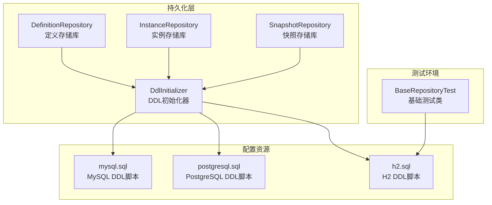
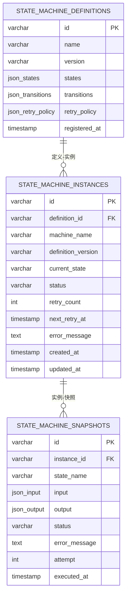
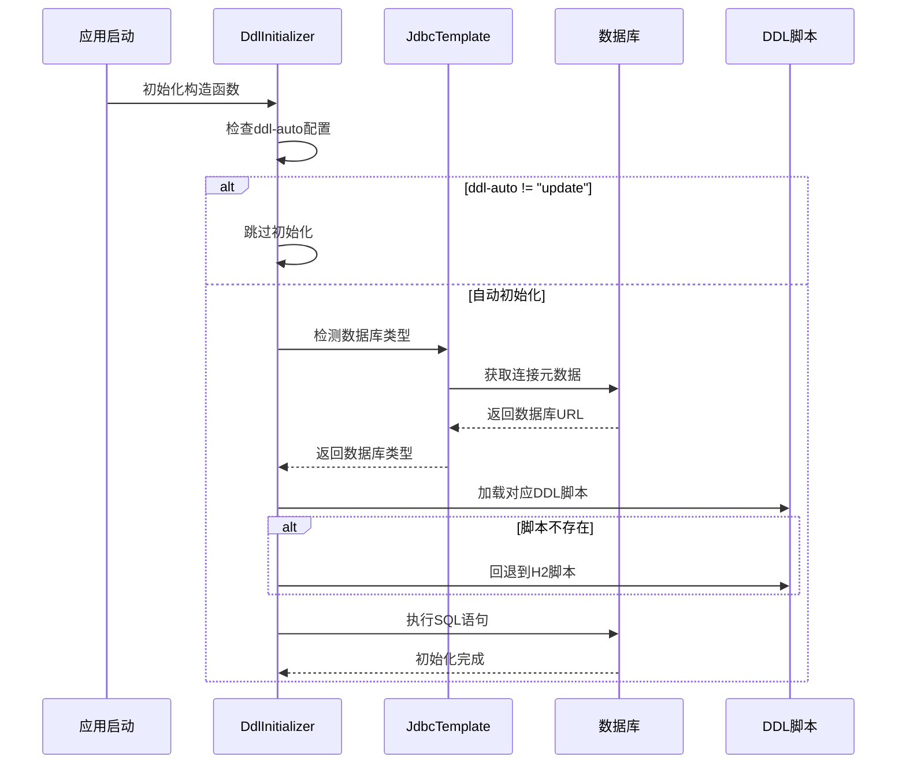
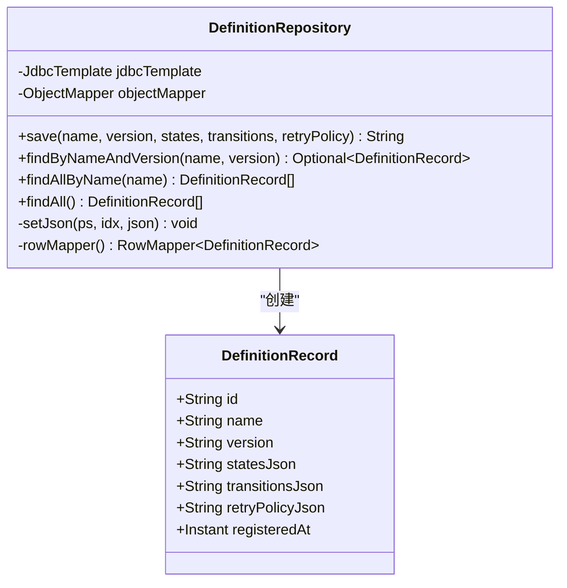
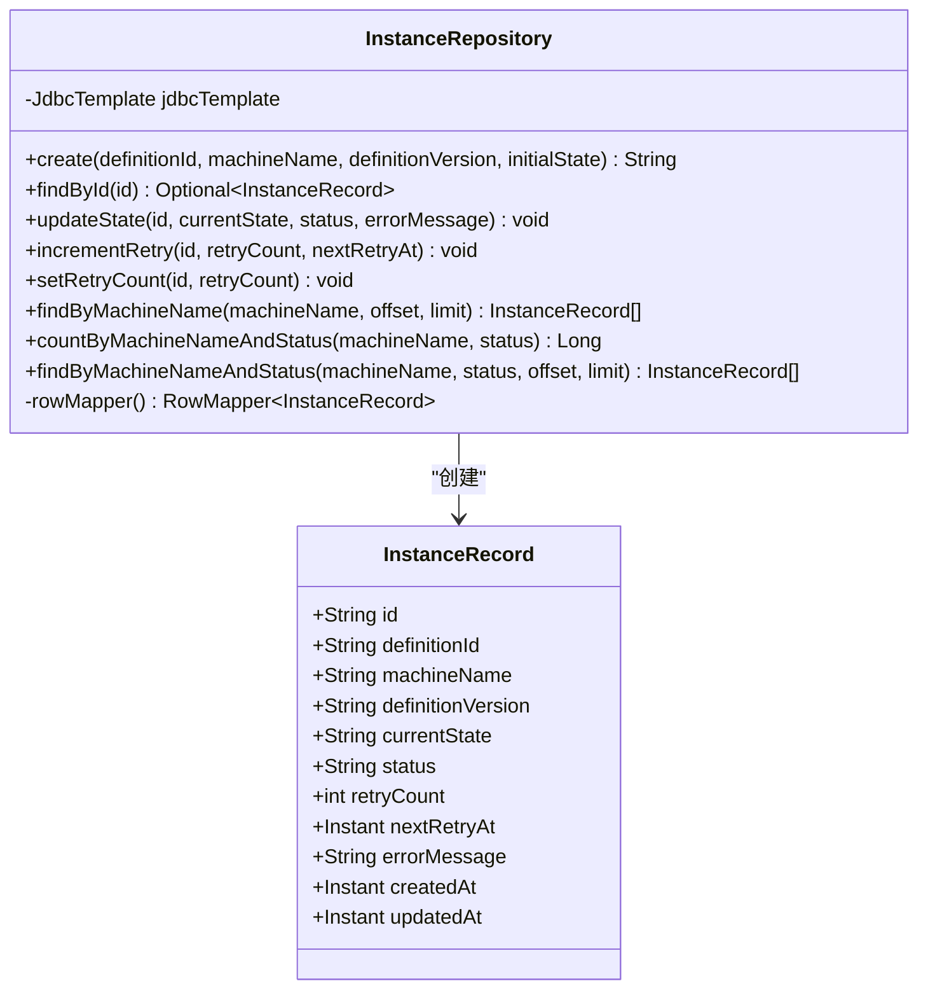
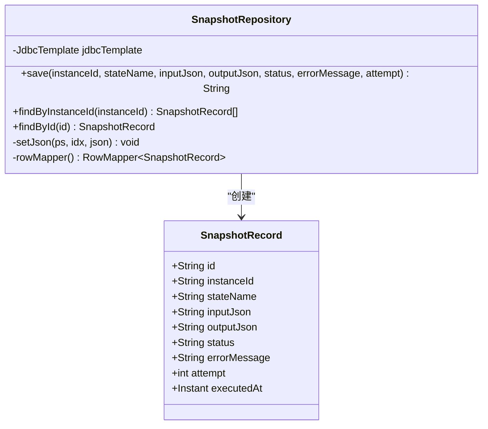
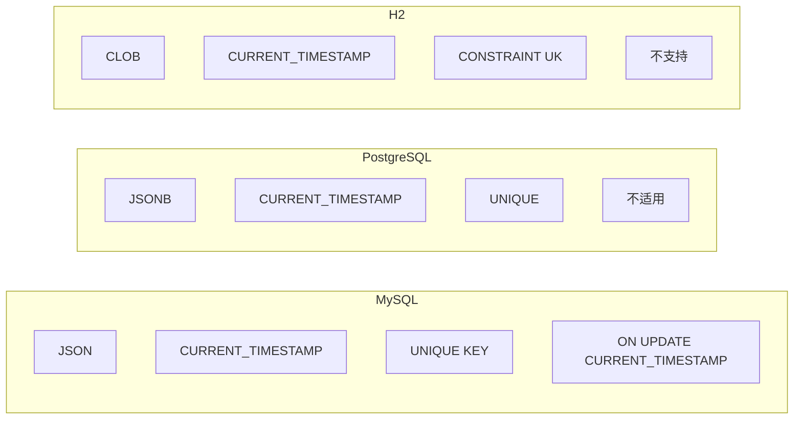

# 数据库模式设计

<cite>
**本文档引用的文件**
- [mysql.sql](file://src/main/resources/ddl/mysql.sql)
- [postgresql.sql](file://src/main/resources/ddl/postgresql.sql)
- [h2.sql](file://src/main/resources/ddl/h2.sql)
- [DdlInitializer.java](file://src/main/java/cn/chedejun/statemachine/persistence/DdlInitializer.java)
- [DefinitionRepository.java](file://src/main/java/cn/chedejun/statemachine/persistence/DefinitionRepository.java)
- [InstanceRepository.java](file://src/main/java/cn/chedejun/statemachine/persistence/InstanceRepository.java)
- [SnapshotRepository.java](file://src/main/java/cn/chedejun/statemachine/persistence/SnapshotRepository.java)
- [BaseRepositoryTest.java](file://src/test/java/cn/chedejun/statemachine/persistence/BaseRepositoryTest.java)
</cite>

## 目录
1. [简介](#简介)
2. [项目结构](#项目结构)
3. [核心表结构设计](#核心表结构设计)
4. [架构概览](#架构概览)
5. [详细组件分析](#详细组件分析)
6. [依赖关系分析](#依赖关系分析)
7. [性能考虑](#性能考虑)
8. [故障排除指南](#故障排除指南)
9. [结论](#结论)

## 简介

本文档详细分析了状态机Boot Starter项目的数据库模式设计，重点关注三张核心表：`state_machine_definitions`（状态机定义表）、`state_machine_instances`（状态机实例表）和`state_machine_snapshots`（状态机快照表）。该设计支持多种数据库系统（MySQL、PostgreSQL、H2），提供了完整的DDL初始化机制和跨数据库兼容性处理。

## 项目结构

该项目采用分层架构设计，数据库相关的核心组件分布如下：



**图表来源**
- [DdlInitializer.java:1-54](file://src/main/java/cn/chedejun/statemachine/persistence/DdlInitializer.java#L1-L54)
- [DefinitionRepository.java:1-78](file://src/main/java/cn/chedejun/statemachine/persistence/DefinitionRepository.java#L1-L78)
- [InstanceRepository.java:1-66](file://src/main/java/cn/chedejun/statemachine/persistence/InstanceRepository.java#L1-L66)
- [SnapshotRepository.java:1-55](file://src/main/java/cn/chedejun/statemachine/persistence/SnapshotRepository.java#L1-L55)

**章节来源**
- [DdlInitializer.java:1-54](file://src/main/java/cn/chedejun/statemachine/persistence/DdlInitializer.java#L1-L54)
- [mysql.sql:1-18](file://src/main/resources/ddl/mysql.sql#L1-L18)
- [postgresql.sql:1-18](file://src/main/resources/ddl/postgresql.sql#L1-L18)
- [h2.sql:1-18](file://src/main/resources/ddl/h2.sql#L1-L18)

## 核心表结构设计

### 表设计总览

三张核心表采用简洁而高效的模式设计，每个表都围绕状态机的核心概念进行组织：



**图表来源**
- [mysql.sql:1-18](file://src/main/resources/ddl/mysql.sql#L1-L18)
- [postgresql.sql:1-18](file://src/main/resources/ddl/postgresql.sql#L1-L18)
- [h2.sql:1-18](file://src/main/resources/ddl/h2.sql#L1-L18)

### state_machine_definitions 表设计

#### 字段定义与数据类型选择

| 字段名 | 数据类型 | 约束条件 | 设计原理 |
|--------|----------|----------|----------|
| id | VARCHAR(64) | 主键，唯一标识 | 使用UUID确保全局唯一性，长度适中便于索引 |
| name | VARCHAR(128) | 非空，业务标识 | 支持较长的状态机名称，便于人类可读 |
| version | VARCHAR(32) | 非空，版本控制 | 支持语义化版本控制，便于演进管理 |
| states | JSON/JSONB/CLOB | 结构化状态定义 | 存储状态机的完整状态结构，支持复杂嵌套 |
| transitions | JSON/JSONB/CLOB | 转换规则定义 | 存储状态转换逻辑，支持条件和动作 |
| retry_policy | JSON/JSONB/CLOB | 重试策略配置 | 存储重试算法参数，支持动态配置 |
| registered_at | TIMESTAMP | 默认当前时间 | 记录注册时间，用于审计和排序 |

#### 约束条件设计原理

- **主键约束**：确保每个状态机定义的唯一性
- **唯一约束**：`(name, version)` 组合确保同名状态机的不同版本隔离
- **非空约束**：关键字段强制要求，保证数据完整性

**章节来源**
- [mysql.sql:1-5](file://src/main/resources/ddl/mysql.sql#L1-L5)
- [postgresql.sql:1-5](file://src/main/resources/ddl/postgresql.sql#L1-L5)
- [h2.sql:1-5](file://src/main/resources/ddl/h2.sql#L1-L5)

### state_machine_instances 表设计

#### 字段定义与数据类型选择

| 字段名 | 数据类型 | 约束条件 | 设计原理 |
|--------|----------|----------|----------|
| id | VARCHAR(64) | 主键，实例标识 | UUID确保实例唯一性 |
| definition_id | VARCHAR(64) | 外键关联定义表 | 建立实例与定义的关联关系 |
| machine_name | VARCHAR(128) | 非空，业务标识 | 支持按业务名称查询 |
| definition_version | VARCHAR(32) | 版本跟踪 | 跟踪使用的定义版本 |
| current_state | VARCHAR(64) | 当前状态标识 | 存储实例当前状态 |
| status | VARCHAR(16) | 非空，默认RUNNING | 实例运行状态管理 |
| retry_count | INT | 默认0，重试计数 | 支持重试机制统计 |
| next_retry_at | TIMESTAMP | 可为空，下次重试时间 | 支持延迟重试策略 |
| error_message | TEXT | 错误信息存储 | 详细的错误追踪 |
| created_at | TIMESTAMP | 默认当前时间 | 实例创建时间戳 |
| updated_at | TIMESTAMP | 默认当前时间，自动更新 | 实例最后修改时间戳 |

#### 索引设计策略

- **主键索引**：自动为主键创建，支持快速定位
- **业务查询索引**：建议为 `machine_name` 和 `definition_id` 创建索引
- **状态过滤索引**：为 `status` 字段创建索引以支持状态查询

**章节来源**
- [mysql.sql:6-12](file://src/main/resources/ddl/mysql.sql#L6-L12)
- [postgresql.sql:6-12](file://src/main/resources/ddl/postgresql.sql#L6-L12)
- [h2.sql:6-12](file://src/main/resources/ddl/h2.sql#L6-L12)

### state_machine_snapshots 表设计

#### 字段定义与数据类型选择

| 字段名 | 数据类型 | 约束条件 | 设计原理 |
|--------|----------|----------|----------|
| id | VARCHAR(64) | 主键，快照标识 | UUID确保快照唯一性 |
| instance_id | VARCHAR(64) | 非空，关联实例 | 建立快照与实例的关联 |
| state_name | VARCHAR(64) | 非空，状态名称 | 标识执行的具体状态 |
| input | JSON/JSONB/CLOB | 输入参数存储 | 存储状态执行输入数据 |
| output | JSON/JSONB/CLOB | 输出结果存储 | 存储状态执行结果 |
| status | VARCHAR(16) | 非空，执行状态 | 快照执行结果状态 |
| error_message | TEXT | 错误信息存储 | 详细的错误追踪 |
| attempt | INT | 默认1，尝试次数 | 支持重试场景的多次尝试 |
| executed_at | TIMESTAMP | 默认当前时间 | 执行时间戳，支持排序 |

#### 查询优化设计

- **时间序列查询**：按 `executed_at` 排序支持状态机执行历史追踪
- **状态聚合查询**：支持按状态和尝试次数的统计分析
- **实例关联查询**：通过 `instance_id` 支持实例级别的快照聚合

**章节来源**
- [mysql.sql:13-18](file://src/main/resources/ddl/mysql.sql#L13-L18)
- [postgresql.sql:13-18](file://src/main/resources/ddl/postgresql.sql#L13-L18)
- [h2.sql:13-18](file://src/main/resources/ddl/h2.sql#L13-L18)

## 架构概览

### DDL初始化机制

系统采用智能的DDL初始化机制，支持自动检测数据库类型并应用相应的脚本：



**图表来源**
- [DdlInitializer.java:20-43](file://src/main/java/cn/chedejun/statemachine/persistence/DdlInitializer.java#L20-L43)

### 数据库类型检测机制

```mermaid
flowchart TD
Start([开始检测]) --> GetURL[获取数据库URL]
GetURL --> CheckMySQL{URL包含"mysql"?}
CheckMySQL --> |是| ReturnMySQL[返回"mysql"]
CheckMySQL --> |否| CheckPG{URL包含"postgresql"或"postgres"?}
CheckPG --> |是| ReturnPG[返回"postgresql"]
CheckPG --> |否| ReturnH2[返回"h2"]
ReturnMySQL --> End([结束])
ReturnPG --> End
ReturnH2 --> End
```

**图表来源**
- [DdlInitializer.java:45-52](file://src/main/java/cn/chedejun/statemachine/persistence/DdlInitializer.java#L45-L52)

**章节来源**
- [DdlInitializer.java:1-54](file://src/main/java/cn/chedejun/statemachine/persistence/DdlInitializer.java#L1-L54)

## 详细组件分析

### DefinitionRepository 分析

DefinitionRepository负责状态机定义的持久化操作，采用JSON序列化存储复杂的数据结构：



**图表来源**
- [DefinitionRepository.java:15-78](file://src/main/java/cn/chedejun/statemachine/persistence/DefinitionRepository.java#L15-L78)

#### JSON数据处理策略

- **序列化时机**：在保存时将Java对象序列化为JSON字符串
- **类型安全**：使用ObjectMapper确保JSON格式正确
- **存储优化**：统一使用Types.OTHER类型存储JSON数据

**章节来源**
- [DefinitionRepository.java:24-46](file://src/main/java/cn/chedejun/statemachine/persistence/DefinitionRepository.java#L24-L46)
- [DefinitionRepository.java:48-50](file://src/main/java/cn/chedejun/statemachine/persistence/DefinitionRepository.java#L48-L50)

### InstanceRepository 分析

InstanceRepository管理状态机实例的生命周期，提供完整的CRUD操作：



**图表来源**
- [InstanceRepository.java:11-66](file://src/main/java/cn/chedejun/statemachine/persistence/InstanceRepository.java#L11-L66)

#### 状态管理策略

- **状态枚举**：支持RUNNING、ERROR等状态标识
- **重试机制**：内置重试计数和下次重试时间管理
- **时间戳同步**：自动更新updated_at字段

**章节来源**
- [InstanceRepository.java:28-38](file://src/main/java/cn/chedejun/statemachine/persistence/InstanceRepository.java#L28-L38)

### SnapshotRepository 分析

SnapshotRepository记录状态机执行的历史快照，支持完整的执行追踪：



**图表来源**
- [SnapshotRepository.java:11-55](file://src/main/java/cn/chedejun/statemachine/persistence/SnapshotRepository.java#L11-L55)

#### 快照设计原则

- **执行顺序**：按executed_at和attempt排序确保执行顺序
- **状态追踪**：记录每次执行的输入输出和状态变化
- **错误恢复**：支持错误信息的完整记录

**章节来源**
- [SnapshotRepository.java:15-31](file://src/main/java/cn/chedejun/statemachine/persistence/SnapshotRepository.java#L15-L31)

## 依赖关系分析

### 数据库兼容性矩阵

| 特性 | MySQL | PostgreSQL | H2 |
|------|-------|------------|----|
| JSON存储 | JSON | JSONB | CLOB |
| 时间戳默认值 | CURRENT_TIMESTAMP | CURRENT_TIMESTAMP | CURRENT_TIMESTAMP |
| 唯一约束语法 | UNIQUE KEY | UNIQUE | CONSTRAINT UK |
| 自动更新 | ON UPDATE CURRENT_TIMESTAMP | 不支持 | 不支持 |
| 大文本类型 | TEXT | TEXT | CLOB |

### 跨数据库适配策略



**图表来源**
- [mysql.sql:1-18](file://src/main/resources/ddl/mysql.sql#L1-L18)
- [postgresql.sql:1-18](file://src/main/resources/ddl/postgresql.sql#L1-L18)
- [h2.sql:1-18](file://src/main/resources/ddl/h2.sql#L1-L18)

**章节来源**
- [mysql.sql:1-18](file://src/main/resources/ddl/mysql.sql#L1-L18)
- [postgresql.sql:1-18](file://src/main/resources/ddl/postgresql.sql#L1-L18)
- [h2.sql:1-18](file://src/main/resources/ddl/h2.sql#L1-L18)

## 性能考虑

### 索引设计建议

基于表的使用模式，建议添加以下索引以优化查询性能：

1. **state_machine_instances 表**
   - `IX_instances_machine_name` (machine_name)
   - `IX_instances_status` (status)
   - `IX_instances_definition_id` (definition_id)

2. **state_machine_snapshots 表**
   - `IX_snapshots_instance_id` (instance_id)
   - `IX_snapshots_executed_at` (executed_at)

### 查询优化技巧

1. **分页查询优化**
   ```sql
   -- 推荐：使用LIMIT和OFFSET
   SELECT * FROM state_machine_instances 
   WHERE machine_name = ? 
   ORDER BY created_at DESC 
   LIMIT ? OFFSET ?
   ```

2. **状态统计优化**
   ```sql
   -- 推荐：使用COUNT(*)和WHERE子句
   SELECT COUNT(*) FROM state_machine_instances 
   WHERE machine_name = ? AND status = ?
   ```

3. **JSON数据访问优化**
   - 在MySQL中使用JSON_EXTRACT函数进行精确查询
   - 在PostgreSQL中使用->>操作符进行文本提取
   - 在H2中使用CAST函数进行类型转换

### 分区策略建议

对于大规模部署，建议考虑以下分区策略：

1. **按时间分区**
   - 将数据按月或季度分区
   - 适用于历史数据归档和清理

2. **按业务分区**
   - 按machine_name或definition_id分区
   - 适用于多租户或多业务场景

## 故障排除指南

### 常见问题诊断

1. **DDL初始化失败**
   - 检查数据库连接URL中的数据库类型识别
   - 确认DDL脚本文件存在且可访问
   - 验证数据库用户权限

2. **JSON数据序列化错误**
   - 检查ObjectMapper配置
   - 验证JSON数据格式合法性
   - 确认数据库对JSON类型的兼容性

3. **查询性能问题**
   - 分析慢查询日志
   - 检查索引使用情况
   - 优化WHERE子句和ORDER BY子句

### 调试工具和方法

1. **数据库连接调试**
   ```java
   // 在DdlInitializer中添加调试信息
   log.debug("Database URL: {}", url);
   log.debug("Detected DB Type: {}", dbType);
   ```

2. **SQL执行监控**
   - 启用Spring JDBC SQL日志
   - 使用数据库自带的执行计划分析工具
   - 监控慢查询和锁等待

**章节来源**
- [DdlInitializer.java:39-42](file://src/main/java/cn/chedejun/statemachine/persistence/DdlInitializer.java#L39-L42)
- [BaseRepositoryTest.java:22-27](file://src/test/java/cn/chedejun/statemachine/persistence/BaseRepositoryTest.java#L22-L27)

## 结论

该数据库模式设计体现了现代状态机系统的最佳实践：

1. **跨数据库兼容性**：通过智能检测和差异化脚本实现了MySQL、PostgreSQL、H2的无缝支持
2. **数据完整性**：采用JSON存储复杂状态机定义，同时保持数据结构的灵活性
3. **性能优化**：合理的表结构设计和索引策略支持高并发场景
4. **可维护性**：清晰的职责分离和模块化设计便于后续扩展

该设计为状态机Boot Starter项目提供了坚实的数据层基础，支持从开发测试到生产环境的全生命周期需求。