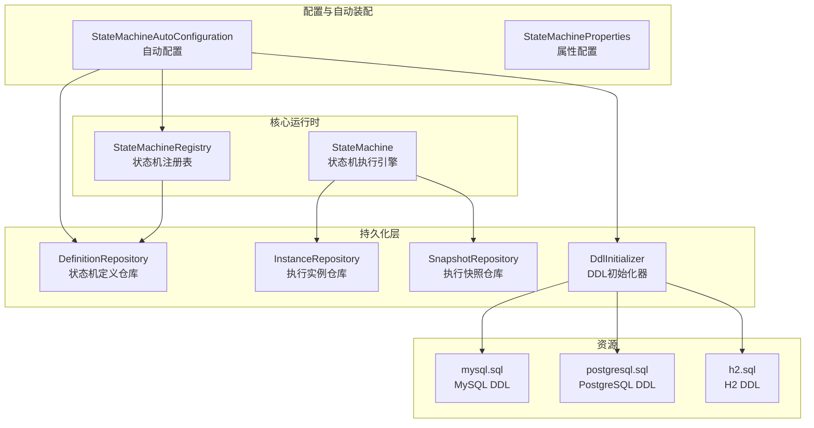
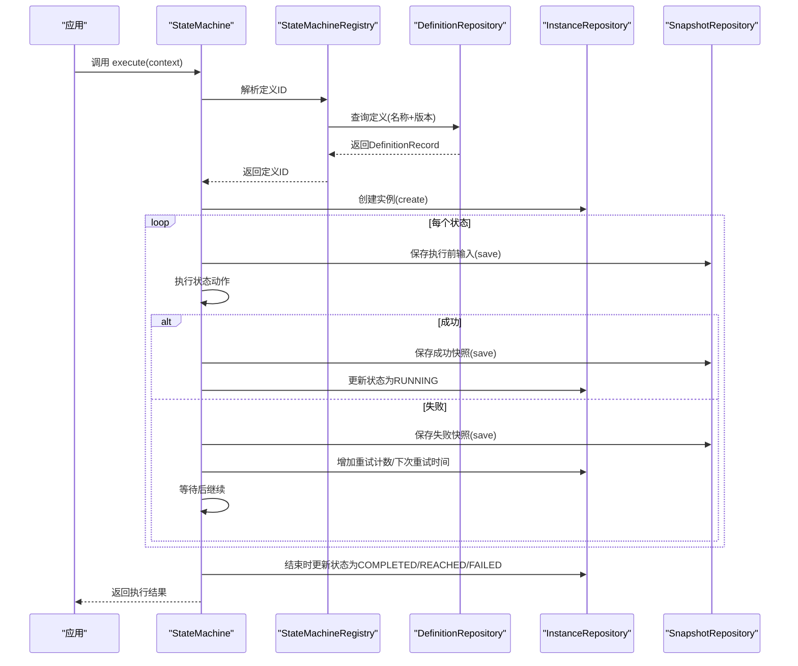
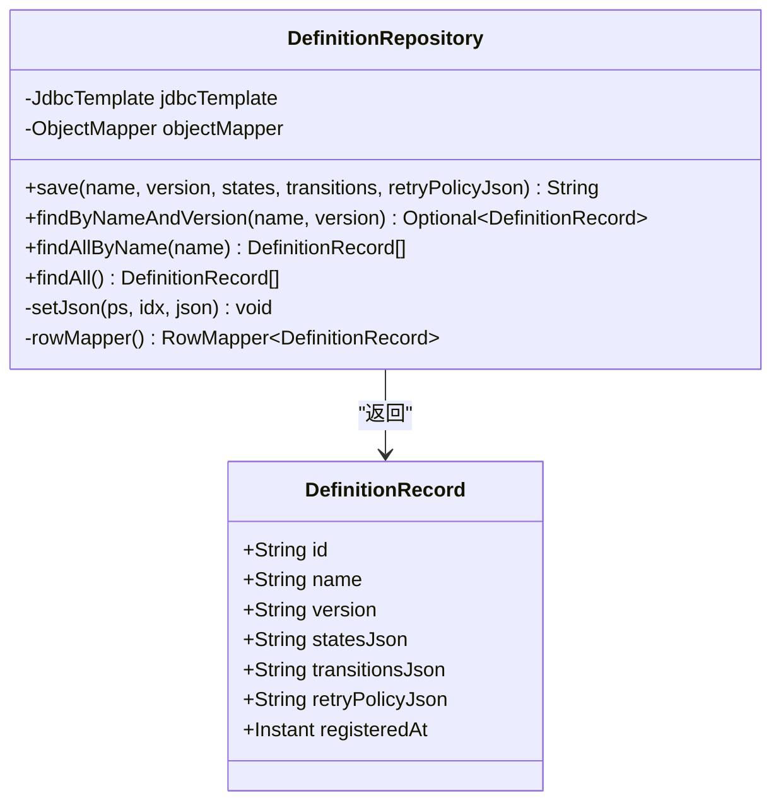
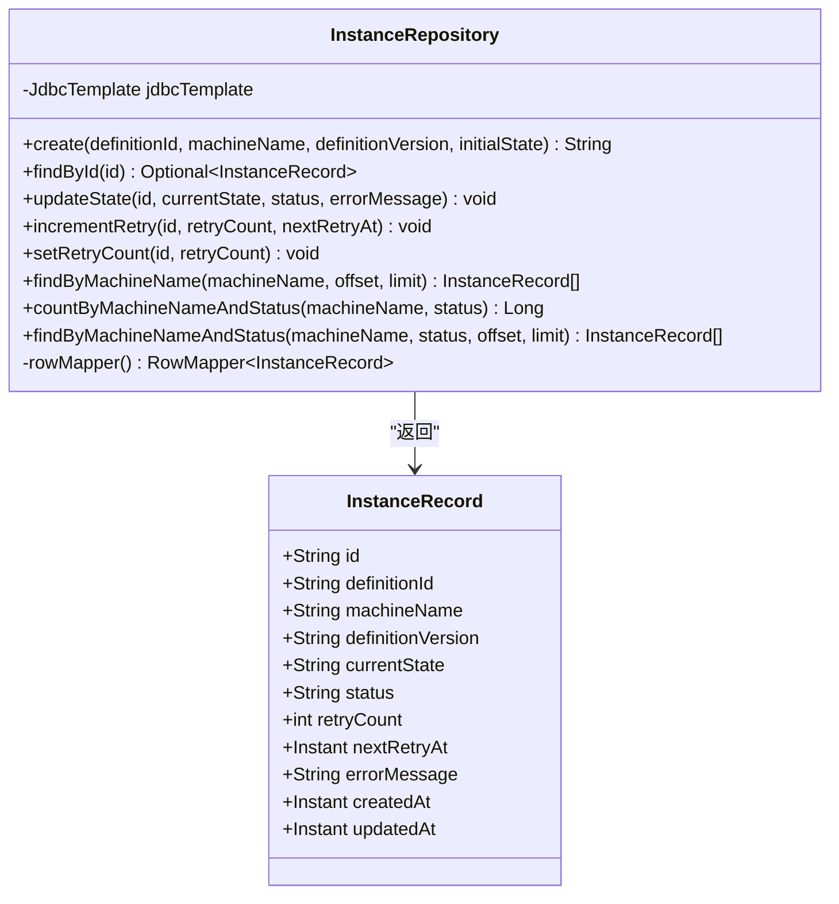
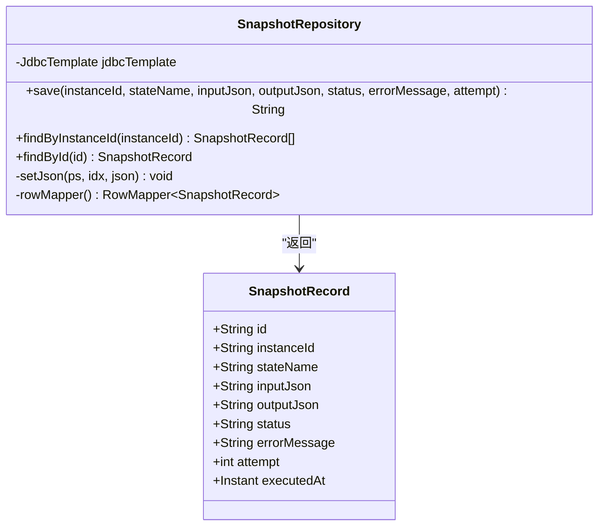
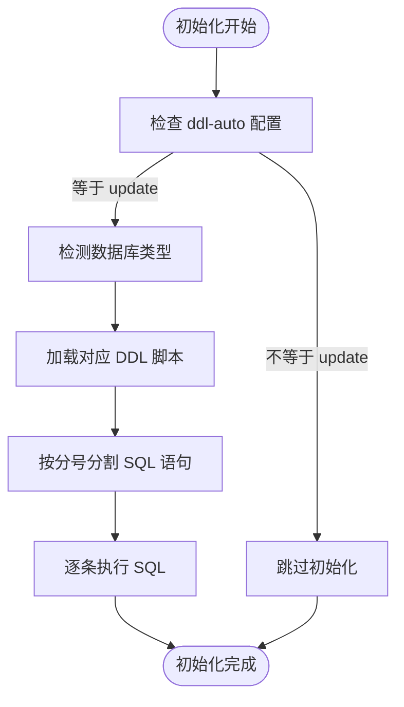
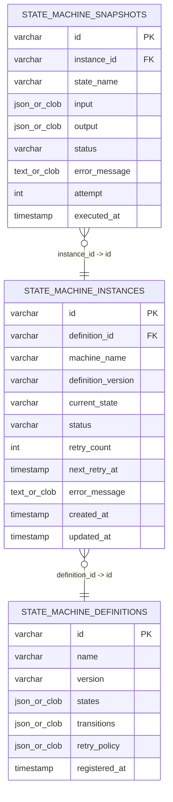
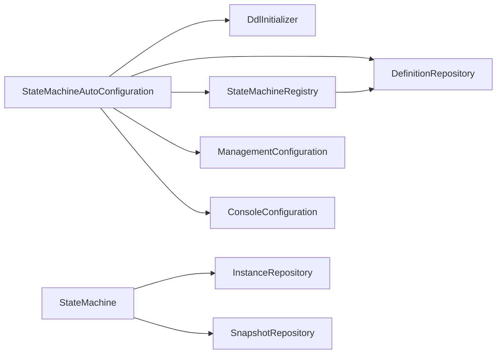

# 数据持久化

<cite>
**本文档引用的文件**
- [DefinitionRepository.java](file://src/main/java/cn/chedejun/statemachine/persistence/DefinitionRepository.java)
- [InstanceRepository.java](file://src/main/java/cn/chedejun/statemachine/persistence/InstanceRepository.java)
- [SnapshotRepository.java](file://src/main/java/cn/chedejun/statemachine/persistence/SnapshotRepository.java)
- [DdlInitializer.java](file://src/main/java/cn/chedejun/statemachine/persistence/DdlInitializer.java)
- [mysql.sql](file://src/main/resources/ddl/mysql.sql)
- [postgresql.sql](file://src/main/resources/ddl/postgresql.sql)
- [h2.sql](file://src/main/resources/ddl/h2.sql)
- [StateMachineAutoConfiguration.java](file://src/main/java/cn/chedejun/statemachine/autoconfigure/StateMachineAutoConfiguration.java)
- [StateMachineProperties.java](file://src/main/java/cn/chedejun/statemachine/autoconfigure/StateMachineProperties.java)
- [StateMachine.java](file://src/main/java/cn/chedejun/statemachine/core/StateMachine.java)
- [StateMachineRegistry.java](file://src/main/java/cn/chedejun/statemachine/core/StateMachineRegistry.java)
- [BaseRepositoryTest.java](file://src/test/java/cn/chedejun/statemachine/persistence/BaseRepositoryTest.java)
- [application.yml](file://demo/src/main/resources/application.yml)
</cite>

## 目录
1. [简介](#简介)
2. [项目结构](#项目结构)
3. [核心组件](#核心组件)
4. [架构总览](#架构总览)
5. [详细组件分析](#详细组件分析)
6. [依赖关系分析](#依赖关系分析)
7. [性能考虑](#性能考虑)
8. [故障排除指南](#故障排除指南)
9. [结论](#结论)
10. [附录](#附录)

## 简介
本文件系统性阐述状态机数据持久化的三层数据模型与Repository层实现，涵盖：
- 三层数据模型：状态机定义、执行实例、执行快照的设计与用途
- Repository层的数据访问模式与实现原理
- 多数据库支持的配置方法（MySQL、PostgreSQL、H2）
- DDL初始化机制与数据库迁移策略
- 数据模型关系图与字段说明
- 性能优化与索引设计建议

## 项目结构
该项目采用分层架构，核心持久化逻辑位于`persistence`包，自动配置在`autoconfigure`包，示例应用位于`demo`目录，DDL脚本位于`resources/ddl`。

图表来源
- [StateMachineAutoConfiguration.java:1-80](file://src/main/java/cn/chedejun/statemachine/autoconfigure/StateMachineAutoConfiguration.java#L1-L80)
- [DdlInitializer.java:1-54](file://src/main/java/cn/chedejun/statemachine/persistence/DdlInitializer.java#L1-L54)
- [DefinitionRepository.java:1-78](file://src/main/java/cn/chedejun/statemachine/persistence/DefinitionRepository.java#L1-L78)
- [InstanceRepository.java:1-66](file://src/main/java/cn/chedejun/statemachine/persistence/InstanceRepository.java#L1-L66)
- [SnapshotRepository.java:1-55](file://src/main/java/cn/chedejun/statemachine/persistence/SnapshotRepository.java#L1-L55)
- [mysql.sql:1-18](file://src/main/resources/ddl/mysql.sql#L1-L18)
- [postgresql.sql:1-18](file://src/main/resources/ddl/postgresql.sql#L1-L18)
- [h2.sql:1-18](file://src/main/resources/ddl/h2.sql#L1-L18)

章节来源
- [StateMachineAutoConfiguration.java:1-80](file://src/main/java/cn/chedejun/statemachine/autoconfigure/StateMachineAutoConfiguration.java#L1-L80)
- [DdlInitializer.java:1-54](file://src/main/java/cn/chedejun/statemachine/persistence/DdlInitializer.java#L1-L54)

## 核心组件
本节概述三层数据模型与Repository层职责：
- 状态机定义（Definition）：保存状态机的元数据（状态列表、转换规则、重试策略），用于后续实例化与执行。
- 执行实例（Instance）：记录一次状态机执行的生命周期状态、重试计数、错误信息等。
- 执行快照（Snapshot）：记录每个状态执行的输入、输出、结果与尝试次数，便于审计与重试。

Repository层职责：
- DefinitionRepository：负责定义的保存、查询与版本管理。
- InstanceRepository：负责实例的创建、状态更新、统计查询。
- SnapshotRepository：负责快照的保存与按实例查询。

章节来源
- [DefinitionRepository.java:15-78](file://src/main/java/cn/chedejun/statemachine/persistence/DefinitionRepository.java#L15-L78)
- [InstanceRepository.java:11-66](file://src/main/java/cn/chedejun/statemachine/persistence/InstanceRepository.java#L11-L66)
- [SnapshotRepository.java:11-55](file://src/main/java/cn/chedejun/statemachine/persistence/SnapshotRepository.java#L11-L55)

## 架构总览
下图展示状态机执行流程与数据持久化交互：

图表来源
- [StateMachine.java:40-136](file://src/main/java/cn/chedejun/statemachine/core/StateMachine.java#L40-L136)
- [StateMachineRegistry.java:20-49](file://src/main/java/cn/chedejun/statemachine/core/StateMachineRegistry.java#L20-L49)
- [DefinitionRepository.java:24-66](file://src/main/java/cn/chedejun/statemachine/persistence/DefinitionRepository.java#L24-L66)
- [InstanceRepository.java:15-51](file://src/main/java/cn/chedejun/statemachine/persistence/InstanceRepository.java#L15-L51)
- [SnapshotRepository.java:15-43](file://src/main/java/cn/chedejun/statemachine/persistence/SnapshotRepository.java#L15-L43)

## 详细组件分析

### 定义仓库（DefinitionRepository）
职责与实现要点：
- 使用JDBC模板进行SQL操作，JSON字段通过Types.OTHER写入数据库。
- 提供保存定义、按名称+版本查找、按名称查询所有版本、全量查询等接口。
- 使用RowMapper映射到不可变记录类型，保证线程安全与数据一致性。

图表来源
- [DefinitionRepository.java:15-78](file://src/main/java/cn/chedejun/statemachine/persistence/DefinitionRepository.java#L15-L78)

章节来源
- [DefinitionRepository.java:15-78](file://src/main/java/cn/chedejun/statemachine/persistence/DefinitionRepository.java#L15-L78)

### 实例仓库（InstanceRepository）
职责与实现要点：
- 创建实例、按ID查询、更新当前状态与错误信息、重试相关更新、分页查询与统计。
- 支持按机器名与状态组合查询，便于监控与运维。

图表来源
- [InstanceRepository.java:11-66](file://src/main/java/cn/chedejun/statemachine/persistence/InstanceRepository.java#L11-L66)

章节来源
- [InstanceRepository.java:11-66](file://src/main/java/cn/chedejun/statemachine/persistence/InstanceRepository.java#L11-L66)

### 快照仓库（SnapshotRepository）
职责与实现要点：
- 保存每次状态执行的输入、输出、状态、错误信息与尝试次数。
- 提供按实例ID查询快照列表与按ID查询单条快照。

图表来源
- [SnapshotRepository.java:11-55](file://src/main/java/cn/chedejun/statemachine/persistence/SnapshotRepository.java#L11-L55)

章节来源
- [SnapshotRepository.java:11-55](file://src/main/java/cn/chedejun/statemachine/persistence/SnapshotRepository.java#L11-L55)

### DDL初始化器（DdlInitializer）
职责与实现要点：
- 根据配置决定是否自动创建表（默认update）。
- 自动检测数据库类型（MySQL、PostgreSQL、默认H2），加载对应DDL脚本。
- 将脚本按分号分割逐条执行，确保跨数据库兼容。

图表来源
- [DdlInitializer.java:20-43](file://src/main/java/cn/chedejun/statemachine/persistence/DdlInitializer.java#L20-L43)

章节来源
- [DdlInitializer.java:1-54](file://src/main/java/cn/chedejun/statemachine/persistence/DdlInitializer.java#L1-L54)

### 数据模型关系图
三层数据模型之间的关系如下：

图表来源
- [mysql.sql:1-18](file://src/main/resources/ddl/mysql.sql#L1-L18)
- [postgresql.sql:1-18](file://src/main/resources/ddl/postgresql.sql#L1-L18)
- [h2.sql:1-18](file://src/main/resources/ddl/h2.sql#L1-L18)

## 依赖关系分析
自动配置与Bean装配关系如下：

图表来源
- [StateMachineAutoConfiguration.java:22-78](file://src/main/java/cn/chedejun/statemachine/autoconfigure/StateMachineAutoConfiguration.java#L22-L78)
- [StateMachine.java:19-194](file://src/main/java/cn/chedejun/statemachine/core/StateMachine.java#L19-L194)
- [StateMachineRegistry.java:9-49](file://src/main/java/cn/chedejun/statemachine/core/StateMachineRegistry.java#L9-L49)

章节来源
- [StateMachineAutoConfiguration.java:22-78](file://src/main/java/cn/chedejun/statemachine/autoconfigure/StateMachineAutoConfiguration.java#L22-L78)
- [StateMachine.java:19-194](file://src/main/java/cn/chedejun/statemachine/core/StateMachine.java#L19-L194)
- [StateMachineRegistry.java:9-49](file://src/main/java/cn/chedejun/statemachine/core/StateMachineRegistry.java#L9-L49)

## 性能考虑
- JSON字段存储策略
  - MySQL使用JSON类型，PostgreSQL使用JSONB类型，H2使用CLOB。JSONB通常具有更好的查询性能与存储效率。
- 索引与查询优化
  - 实例表按machine_name排序与过滤，建议在machine_name上建立索引以提升分页查询性能。
  - 快照表按instance_id排序，建议在instance_id上建立索引以加速按实例查询。
  - 定义表按name+version唯一约束，确保快速定位最新版本定义。
- 写入路径优化
  - 快照保存与实例状态更新均为单表写入，避免跨表事务，减少锁竞争。
- 连接池与并发
  - 建议结合Spring Boot的连接池配置，合理设置最大连接数与超时时间，避免高并发下的连接争用。

## 故障排除指南
- DDL初始化失败
  - 确认配置项state-machine.ddl-auto设置为update或相应值。
  - 检查数据库驱动与URL是否正确，确保能够识别数据库类型。
  - 查看日志中关于DDL脚本加载与执行的信息。
- 表不存在或列类型不匹配
  - 确保使用对应数据库的DDL脚本；若未找到匹配脚本，系统会回退到H2脚本。
- 查询异常
  - 检查RowMapper映射字段与DDL定义是否一致。
  - 对于JSON字段，确认数据库类型与序列化格式匹配（JSON vs JSONB vs CLOB）。
- 测试环境验证
  - 参考测试基类的H2内存库配置，确保表已创建且数据清理逻辑正常。

章节来源
- [DdlInitializer.java:20-43](file://src/main/java/cn/chedejun/statemachine/persistence/DdlInitializer.java#L20-L43)
- [BaseRepositoryTest.java:22-33](file://src/test/java/cn/chedejun/statemachine/persistence/BaseRepositoryTest.java#L22-L33)

## 结论
本项目通过三层数据模型与清晰的Repository层实现了状态机的可持久化执行。DDL初始化器提供了多数据库支持与自动化表创建能力，配合状态机执行引擎与注册表，形成完整的状态机生命周期管理方案。通过合理的索引与查询优化，可在生产环境中获得稳定的性能表现。

## 附录

### 多数据库配置与DDL脚本说明
- MySQL配置
  - 使用JSON类型存储状态、转换与重试策略，支持UNIQUE约束。
  - 示例配置参考演示应用的PostgreSQL配置，替换为MySQL驱动与URL即可。
- PostgreSQL配置
  - 使用JSONB类型，支持UNIQUE约束，性能优于JSON。
  - 演示应用已提供PostgreSQL配置示例。
- H2配置
  - 使用CLOB类型存储JSON数据，适用于开发与测试环境。
  - 测试基类展示了H2内存库的配置与脚本加载方式。

章节来源
- [mysql.sql:1-18](file://src/main/resources/ddl/mysql.sql#L1-L18)
- [postgresql.sql:1-18](file://src/main/resources/ddl/postgresql.sql#L1-L18)
- [h2.sql:1-18](file://src/main/resources/ddl/h2.sql#L1-L18)
- [application.yml:4-9](file://demo/src/main/resources/application.yml#L4-L9)
- [BaseRepositoryTest.java:13-27](file://src/test/java/cn/chedejun/statemachine/persistence/BaseRepositoryTest.java#L13-L27)

### 数据模型字段说明
- 状态机定义表（state_machine_definitions）
  - id：主键，UUID字符串
  - name：状态机名称
  - version：版本号
  - states：状态定义的JSON/JSONB/CLOB
  - transitions：转换规则的JSON/JSONB/CLOB
  - retry_policy：重试策略的JSON/JSONB/CLOB
  - registered_at：注册时间戳
- 执行实例表（state_machine_instances）
  - id：主键，UUID字符串
  - definition_id：外键指向定义表
  - machine_name：机器名
  - definition_version：定义版本
  - current_state：当前状态
  - status：实例状态（RUNNING/REACHED/COMPLETED/FAILED）
  - retry_count：重试次数
  - next_retry_at：下次重试时间
  - error_message：错误信息
  - created_at/updated_at：创建与更新时间戳
- 执行快照表（state_machine_snapshots）
  - id：主键，UUID字符串
  - instance_id：外键指向实例表
  - state_name：状态名称
  - input：执行前输入JSON/JSONB/CLOB
  - output：执行后输出JSON/JSONB/CLOB
  - status：快照状态（SUCCESS/FAILED）
  - error_message：错误信息
  - attempt：尝试次数
  - executed_at：执行时间戳

章节来源
- [mysql.sql:1-18](file://src/main/resources/ddl/mysql.sql#L1-L18)
- [postgresql.sql:1-18](file://src/main/resources/ddl/postgresql.sql#L1-L18)
- [h2.sql:1-18](file://src/main/resources/ddl/h2.sql#L1-L18)

### 数据库迁移策略建议
- 版本化管理
  - 为DDL脚本添加版本号前缀，如v1.0_mysql.sql、v1.1_postgresql.sql，便于追踪变更。
- 渐进式迁移
  - 在新版本中新增列时，保持向后兼容，旧版本仍可读取现有数据。
- 回滚策略
  - 保留历史DDL脚本，必要时可回滚到上一版本。
- 自动化部署
  - 结合CI/CD流水线，在部署阶段自动执行DDL更新，确保数据库结构与应用版本一致。