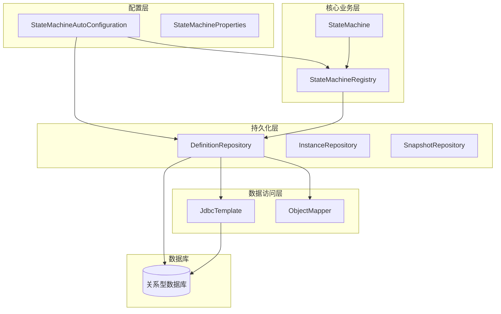
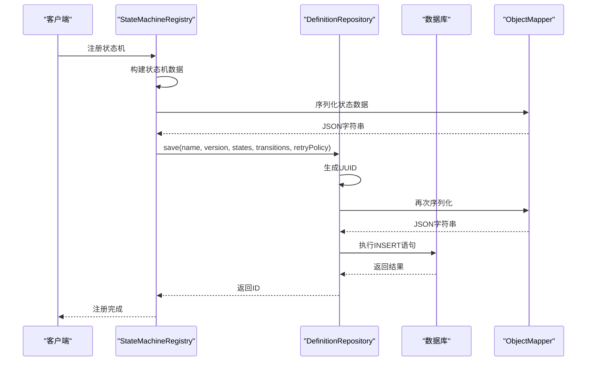
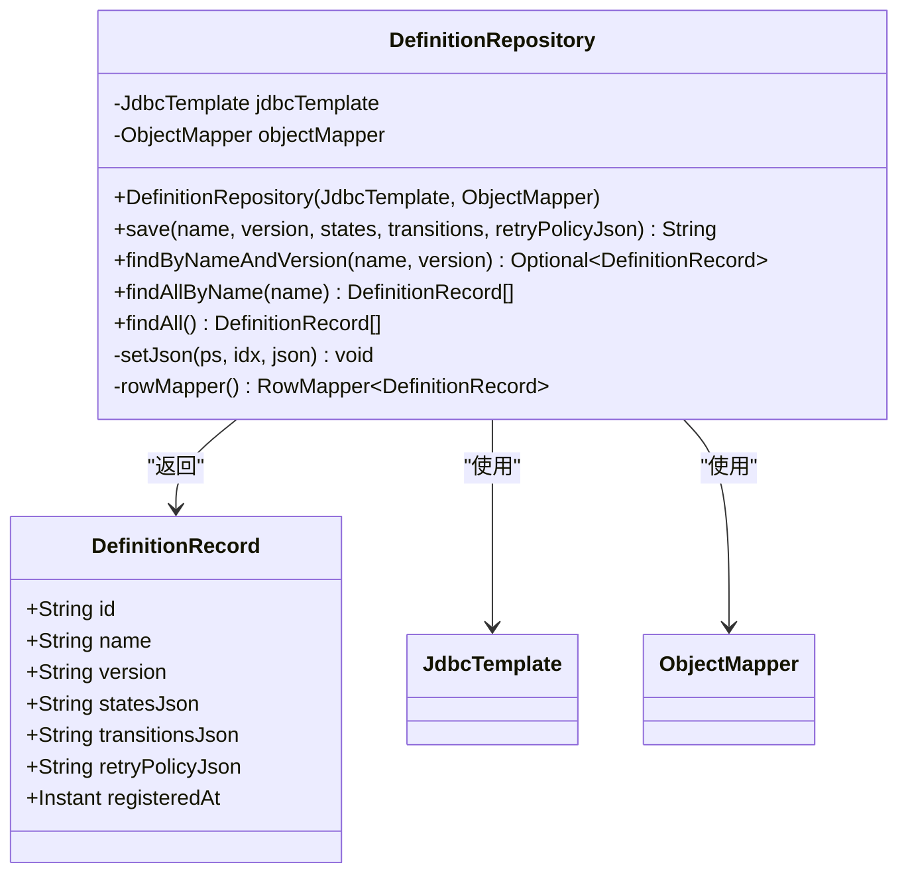
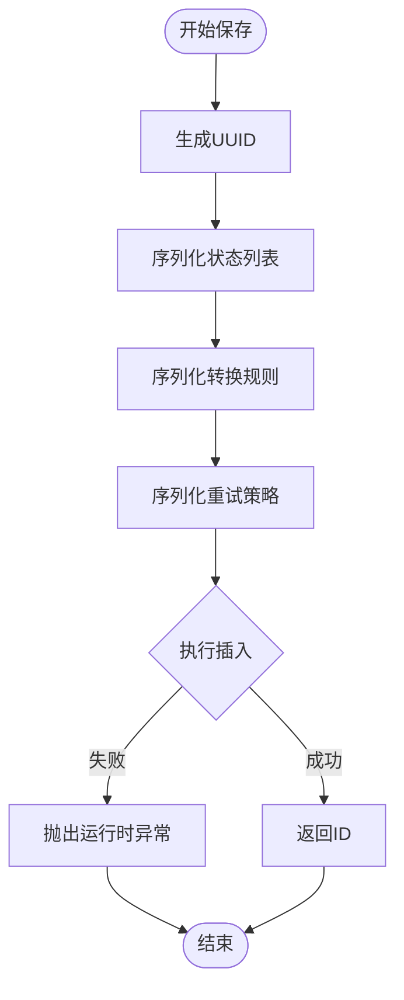
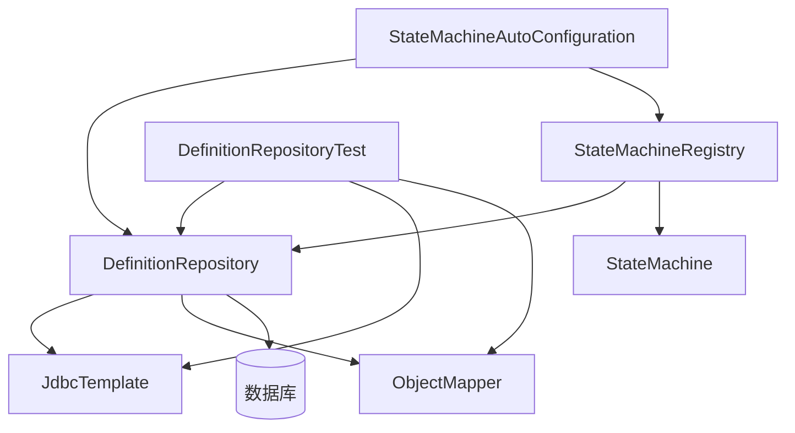

# 状态机定义存储

<cite>
**本文引用的文件**
- [DefinitionRepository.java](file://src/main/java/cn/chedejun/statemachine/persistence/DefinitionRepository.java)
- [h2.sql](file://src/main/resources/ddl/h2.sql)
- [mysql.sql](file://src/main/resources/ddl/mysql.sql)
- [postgresql.sql](file://src/main/resources/ddl/postgresql.sql)
- [DefinitionRepositoryTest.java](file://src/test/java/cn/chedejun/statemachine/persistence/DefinitionRepositoryTest.java)
- [StateMachineAutoConfiguration.java](file://src/main/java/cn/chedejun/statemachine/autoconfigure/StateMachineAutoConfiguration.java)
- [StateMachineRegistry.java](file://src/main/java/cn/chedejun/statemachine/core/StateMachineRegistry.java)
- [MachineDefinitionDTO.java](file://src/main/java/cn/chedejun/statemachine/management/dto/MachineDefinitionDTO.java)
</cite>

## 目录
1. [简介](#简介)
2. [项目结构](#项目结构)
3. [核心组件](#核心组件)
4. [架构概览](#架构概览)
5. [详细组件分析](#详细组件分析)
6. [依赖分析](#依赖分析)
7. [性能考虑](#性能考虑)
8. [故障排除指南](#故障排除指南)
9. [结论](#结论)

## 简介

本文档深入解析状态机定义存储系统，重点分析DefinitionRepository的设计原理和实现细节。该系统提供了状态机定义的持久化存储能力，支持多数据库兼容（H2、MySQL、PostgreSQL），实现了完整的版本管理机制和历史版本追踪功能。

系统采用JSON格式存储状态机定义的核心数据，通过JDBC模板进行数据库操作，并提供了完善的错误处理和性能优化策略。本文将详细说明保存流程、查询机制、数据模型设计以及版本控制策略。

## 项目结构

状态机定义存储位于持久化层，与核心业务逻辑和管理界面分离，形成清晰的分层架构：

**图表来源**
- [StateMachineAutoConfiguration.java:22-41](file://src/main/java/cn/chedejun/statemachine/autoconfigure/StateMachineAutoConfiguration.java#L22-L41)
- [DefinitionRepository.java:15-22](file://src/main/java/cn/chedejun/statemachine/persistence/DefinitionRepository.java#L15-L22)

**章节来源**
- [StateMachineAutoConfiguration.java:1-80](file://src/main/java/cn/chedejun/statemachine/autoconfigure/StateMachineAutoConfiguration.java#L1-L80)
- [DefinitionRepository.java:1-78](file://src/main/java/cn/chedejun/statemachine/persistence/DefinitionRepository.java#L1-L78)

## 核心组件

### DefinitionRepository 设计原理

DefinitionRepository是状态机定义存储的核心组件，负责状态机定义的完整生命周期管理。其设计遵循以下原则：

1. **单一职责原则**：专注于状态机定义的CRUD操作
2. **依赖注入**：通过构造函数注入JDBC模板和对象映射器
3. **类型安全**：使用泛型确保编译时类型检查
4. **异常处理**：提供明确的错误传播机制

### 数据模型设计

系统采用轻量级数据模型设计，核心字段包括：
- 唯一标识符：用于记录关联和追踪
- 名称版本：支持多版本并存的命名空间
- JSON内容：存储序列化的状态机定义
- 时间戳：记录注册时间用于排序和审计

**章节来源**
- [DefinitionRepository.java:75-77](file://src/main/java/cn/chedejun/statemachine/persistence/DefinitionRepository.java#L75-L77)
- [DefinitionRepository.java:24-46](file://src/main/java/cn/chedejun/statemachine/persistence/DefinitionRepository.java#L24-L46)

## 架构概览

系统采用分层架构设计，各层职责明确，耦合度低：

**图表来源**
- [StateMachineRegistry.java:29-49](file://src/main/java/cn/chedejun/statemachine/core/StateMachineRegistry.java#L29-L49)
- [DefinitionRepository.java:24-46](file://src/main/java/cn/chedejun/statemachine/persistence/DefinitionRepository.java#L24-L46)

**章节来源**
- [StateMachineRegistry.java:29-49](file://src/main/java/cn/chedejun/statemachine/core/StateMachineRegistry.java#L29-L49)
- [DefinitionRepository.java:15-22](file://src/main/java/cn/chedejun/statemachine/persistence/DefinitionRepository.java#L15-L22)

## 详细组件分析

### DefinitionRepository 类结构

**图表来源**
- [DefinitionRepository.java:15-77](file://src/main/java/cn/chedejun/statemachine/persistence/DefinitionRepository.java#L15-L77)

### 保存方法实现流程

save方法实现了完整的状态机定义保存流程：

#### UUID生成策略
- 使用标准UUID生成器确保全局唯一性
- 避免并发冲突和重复键问题
- 支持分布式环境下的唯一性保证

#### JSON序列化机制
- 状态列表序列化为JSON数组
- 转换规则序列化为JSON数组
- 重试策略序列化为JSON对象
- 统一的异常处理机制

#### 数据库插入操作
- 使用预编译语句防止SQL注入
- JSON字段使用Types.OTHER类型存储
- 原子性事务保证数据一致性

**图表来源**
- [DefinitionRepository.java:24-46](file://src/main/java/cn/chedejun/statemachine/persistence/DefinitionRepository.java#L24-L46)

**章节来源**
- [DefinitionRepository.java:24-46](file://src/main/java/cn/chedejun/statemachine/persistence/DefinitionRepository.java#L24-L46)

### 查询方法设计

#### findByNameAndVersion 方法
- 精确匹配名称和版本号
- 返回单个定义记录或空值
- 支持版本控制的精确查找

#### findAllByName 方法
- 按名称检索所有版本
- 按注册时间降序排列
- 支持历史版本追踪

#### findAll 方法
- 全局定义查询
- 多字段排序支持
- 性能优化的索引利用

**章节来源**
- [DefinitionRepository.java:52-66](file://src/main/java/cn/chedejun/statemachine/persistence/DefinitionRepository.java#L52-L66)

### DefinitionRecord 数据模型

DefinitionRecord是状态机定义的不可变数据传输对象，包含以下字段：

| 字段名 | 类型 | 描述 | 用途 |
|--------|------|------|------|
| id | String | 唯一标识符 | 记录关联和追踪 |
| name | String | 状态机名称 | 命名空间和版本控制 |
| version | String | 版本号 | 版本管理标识 |
| statesJson | String | 状态定义JSON | 状态机状态信息 |
| transitionsJson | String | 转换规则JSON | 状态转换逻辑 |
| retryPolicyJson | String | 重试策略JSON | 错误恢复机制 |
| registeredAt | Instant | 注册时间 | 排序和审计 |

**章节来源**
- [DefinitionRepository.java:75-77](file://src/main/java/cn/chedejun/statemachine/persistence/DefinitionRepository.java#L75-L77)

### 数据库架构设计

系统支持三种主流数据库，每种都有相应的DDL脚本：

#### H2数据库
- 使用CLOB类型存储JSON数据
- 唯一约束防止重复定义
- 时间戳默认值自动设置

#### MySQL数据库
- 使用JSON类型优化存储
- 更好的JSON查询性能
- 文本类型支持大文本

#### PostgreSQL数据库
- 使用JSONB类型提供二进制存储
- 最优的JSON查询和索引性能
- 完整的JSON操作函数支持

**章节来源**
- [h2.sql:1-5](file://src/main/resources/ddl/h2.sql#L1-L5)
- [mysql.sql:1-5](file://src/main/resources/ddl/mysql.sql#L1-L5)
- [postgresql.sql:1-5](file://src/main/resources/ddl/postgresql.sql#L1-L5)

## 依赖分析

### 组件间依赖关系

**图表来源**
- [StateMachineAutoConfiguration.java:33-41](file://src/main/java/cn/chedejun/statemachine/autoconfigure/StateMachineAutoConfiguration.java#L33-L41)
- [DefinitionRepository.java:15-22](file://src/main/java/cn/chedejun/statemachine/persistence/DefinitionRepository.java#L15-L22)

### 外部依赖分析

系统依赖的关键外部组件：
- **Spring JDBC**: 提供数据库访问抽象
- **Jackson ObjectMapper**: JSON序列化/反序列化
- **数据库驱动**: 支持多种数据库后端
- **测试框架**: JUnit 5和Spring Boot Test

**章节来源**
- [DefinitionRepository.java:3-13](file://src/main/java/cn/chedejun/statemachine/persistence/DefinitionRepository.java#L3-L13)
- [StateMachineAutoConfiguration.java:3-20](file://src/main/java/cn/chedejun/statemachine/autoconfigure/StateMachineAutoConfiguration.java#L3-L20)

## 性能考虑

### 查询性能优化

1. **索引策略**
   - 在(name, version)上建立唯一索引
   - 在name字段上建立普通索引
   - 在registered_at字段上建立索引

2. **查询优化**
   - 使用精确匹配避免全表扫描
   - 限制返回字段减少网络传输
   - 合理使用ORDER BY和LIMIT

3. **缓存策略**
   - 最新版本定义可缓存
   - 频繁查询的结果可缓存
   - 缓存失效策略需要考虑版本更新

### 存储性能优化

1. **JSON存储优化**
   - 使用合适的数据库类型
   - 避免过大的JSON文档
   - 定期清理历史版本

2. **内存使用优化**
   - 流式处理大型JSON
   - 及时释放不再使用的对象
   - 合理配置连接池参数

### 并发处理

1. **事务隔离**
   - 使用适当的隔离级别
   - 避免长时间持有锁
   - 合理处理死锁情况

2. **并发控制**
   - 唯一约束防止重复注册
   - 乐观锁处理版本冲突
   - 重试机制处理临时失败

## 故障排除指南

### 常见问题及解决方案

#### JSON序列化异常
- **症状**: 保存时抛出运行时异常
- **原因**: 状态机定义包含不可序列化对象
- **解决**: 检查状态和转换规则的序列化兼容性

#### 数据库约束冲突
- **症状**: 重复注册相同名称版本
- **原因**: 唯一约束违反
- **解决**: 使用不同的版本号或删除旧版本

#### 查询超时问题
- **症状**: 大量历史版本查询缓慢
- **原因**: 缺少适当索引
- **解决**: 添加必要的数据库索引

### 调试技巧

1. **日志记录**
   - 记录关键操作的时间戳
   - 记录异常堆栈信息
   - 记录数据库查询计划

2. **监控指标**
   - 数据库连接池使用率
   - 查询响应时间分布
   - 错误率统计

**章节来源**
- [DefinitionRepository.java:31-33](file://src/main/java/cn/chedejun/statemachine/persistence/DefinitionRepository.java#L31-L33)
- [DefinitionRepositoryTest.java:45-48](file://src/test/java/cn/chedejun/statemachine/persistence/DefinitionRepositoryTest.java#L45-L48)

## 结论

状态机定义存储系统通过DefinitionRepository实现了高效、可靠的持久化机制。系统设计充分考虑了以下关键要素：

1. **架构设计**: 清晰的分层架构和明确的职责划分
2. **数据模型**: 简洁而功能完备的数据结构设计
3. **版本管理**: 完善的版本控制和历史追踪机制
4. **性能优化**: 针对不同场景的性能优化策略
5. **错误处理**: 完善的异常处理和故障恢复机制

该系统为状态机框架提供了坚实的基础，支持多版本并存、历史版本追踪和灵活的查询能力，能够满足生产环境的各种需求。