# Clean架构+DDD+Hexagonal架构技能

<cite>
**本文档引用的文件**
- [README.md](file://README.md)
- [state-machine-boot-starter/README.md](file://state-machine-boot-starter/README.md)
- [InstanceExecutionService.java](file://state-machine-boot-starter/src/main/java/cn/chedejun/statemachine/application/InstanceExecutionService.java)
- [StateMachine.java](file://state-machine-boot-starter/src/main/java/cn/chedejun/statemachine/domain/engine/StateMachine.java)
- [DefinitionRepository.java](file://state-machine-boot-starter/src/main/java/cn/chedejun/statemachine/domain/repository/DefinitionRepository.java)
- [AggregateRoot.java](file://state-machine-boot-starter/src/main/java/cn/chedejun/statemachine/domain/shared/AggregateRoot.java)
- [StateMachineInstance.java](file://state-machine-boot-starter/src/main/java/cn/chedejun/statemachine/domain/instance/StateMachineInstance.java)
- [JdbcDefinitionRepository.java](file://state-machine-boot-starter/src/main/java/cn/chedejun/statemachine/infrastructure/persistence/JdbcDefinitionRepository.java)
- [StateMachineFacade.java](file://state-machine-boot-starter/src/main/java/cn/chedejun/statemachine/interfaces/StateMachineFacade.java)
- [StateMachineBuilder.java](file://state-machine-boot-starter/src/main/java/cn/chedejun/statemachine/core/StateMachineBuilder.java)
- [InstanceData.java](file://state-machine-boot-starter/src/main/java/cn/chedejun/statemachine/domain/data/InstanceData.java)
- [InstanceStartedEvent.java](file://state-machine-boot-starter/src/main/java/cn/chedejun/statemachine/domain/event/InstanceStartedEvent.java)
- [State.java](file://state-machine-boot-starter/src/main/java/cn/chedejun/statemachine/core/State.java)
- [Transition.java](file://state-machine-boot-starter/src/main/java/cn/chedejun/statemachine/core/Transition.java)
</cite>

## 目录
1. [引言](#引言)
2. [项目结构](#项目结构)
3. [核心组件](#核心组件)
4. [架构概览](#架构概览)
5. [详细组件分析](#详细组件分析)
6. [依赖分析](#依赖分析)
7. [性能考虑](#性能考虑)
8. [故障排除指南](#故障排除指南)
9. [结论](#结论)

## 引言

这是一个基于Clean架构、DDD（领域驱动设计）和Hexagonal架构（六边形架构）的状态机工作流引擎项目。该项目提供了一个完整的状态机解决方案，支持条件分支、步骤快照、失败重试（指数退避）和管理控制台功能。

项目采用分层架构设计，将业务逻辑与基础设施分离，实现了高度的模块化和可测试性。通过使用Spring Boot自动配置机制，开发者可以轻松集成状态机功能到现有的应用程序中。

## 项目结构

项目采用标准的Maven多模块结构，主要包含以下核心模块：

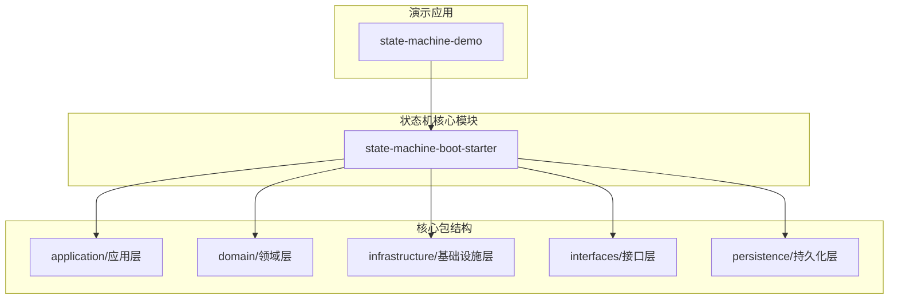

**图表来源**
- [state-machine-boot-starter/README.md:1-65](file://state-machine-boot-starter/README.md#L1-L65)

### 包层次结构分析

项目按照Clean架构原则组织代码，每个包都有明确的职责分工：

- **application层**：协调用例执行，处理业务流程编排
- **domain层**：包含核心业务逻辑和领域模型
- **infrastructure层**：提供技术实现细节
- **interfaces层**：处理外部接口交互
- **persistence层**：数据持久化相关实现

**章节来源**
- [state-machine-boot-starter/README.md:1-65](file://state-machine-boot-starter/README.md#L1-L65)

## 核心组件

### 状态机引擎核心

状态机引擎是整个系统的核心，负责状态管理和转换逻辑：

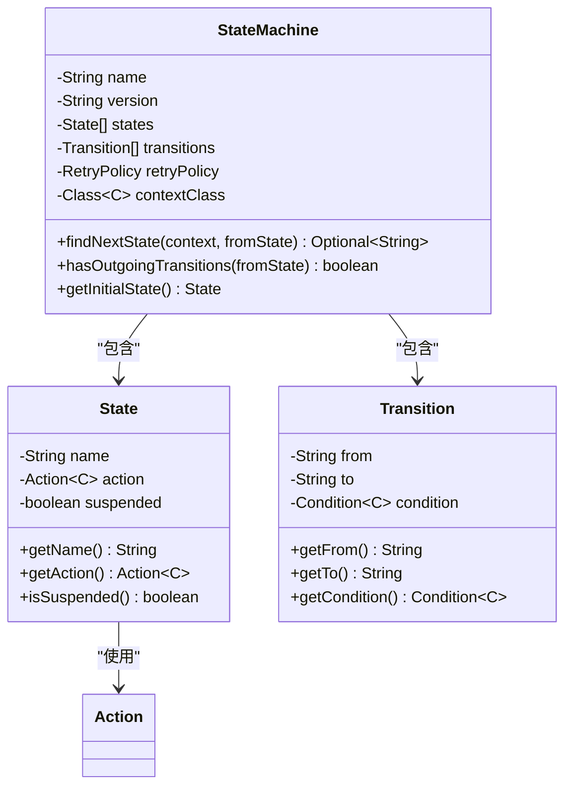

**图表来源**
- [StateMachine.java:19-77](file://state-machine-boot-starter/src/main/java/cn/chedejun/statemachine/domain/engine/StateMachine.java#L19-L77)
- [State.java:3-23](file://state-machine-boot-starter/src/main/java/cn/chedejun/statemachine/core/State.java#L3-L23)
- [Transition.java:3-20](file://state-machine-boot-starter/src/main/java/cn/chedejun/statemachine/core/Transition.java#L3-L20)

### 应用服务层

应用服务层负责协调领域逻辑和基础设施交互：

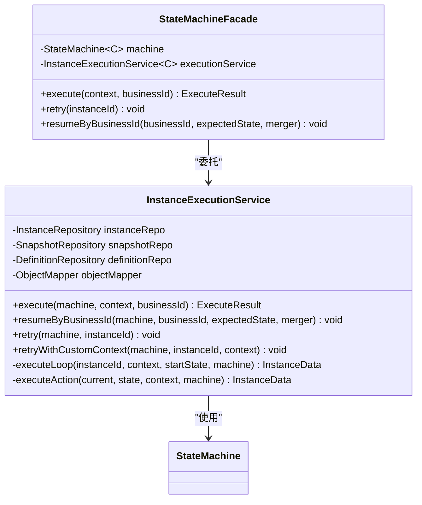

**图表来源**
- [InstanceExecutionService.java:25-296](file://state-machine-boot-starter/src/main/java/cn/chedejun/statemachine/application/InstanceExecutionService.java#L25-L296)
- [StateMachineFacade.java:16-52](file://state-machine-boot-starter/src/main/java/cn/chedejun/statemachine/interfaces/StateMachineFacade.java#L16-L52)

**章节来源**
- [InstanceExecutionService.java:1-296](file://state-machine-boot-starter/src/main/java/cn/chedejun/statemachine/application/InstanceExecutionService.java#L1-L296)
- [StateMachineFacade.java:1-52](file://state-machine-boot-starter/src/main/java/cn/chedejun/statemachine/interfaces/StateMachineFacade.java#L1-L52)

## 架构概览

项目实现了Clean架构的核心原则，通过依赖倒置和分层设计实现了高度的模块化：

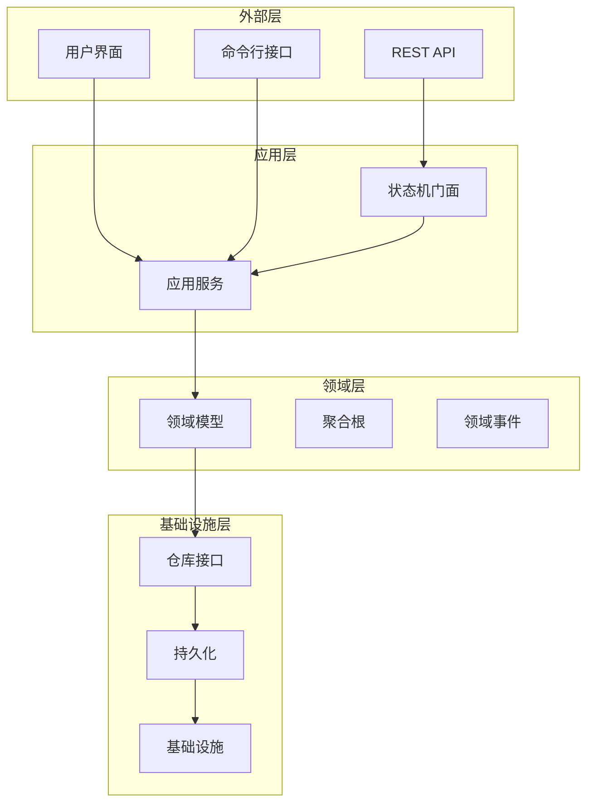

**图表来源**
- [InstanceExecutionService.java:1-296](file://state-machine-boot-starter/src/main/java/cn/chedejun/statemachine/application/InstanceExecutionService.java#L1-L296)
- [StateMachine.java:1-77](file://state-machine-boot-starter/src/main/java/cn/chedejun/statemachine/domain/engine/StateMachine.java#L1-L77)

### Hexagonal架构实现

项目采用Hexagonal架构模式，通过接口隔离技术实现：

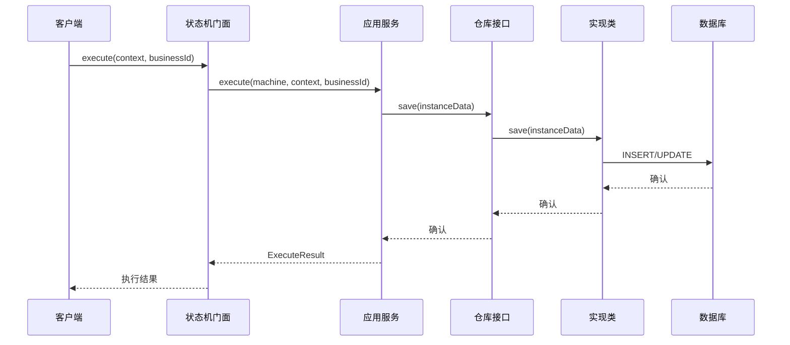

**图表来源**
- [StateMachineFacade.java:26-28](file://state-machine-boot-starter/src/main/java/cn/chedejun/statemachine/interfaces/StateMachineFacade.java#L26-L28)
- [InstanceExecutionService.java:43-58](file://state-machine-boot-starter/src/main/java/cn/chedejun/statemachine/application/InstanceExecutionService.java#L43-L58)

## 详细组件分析

### 领域模型分析

领域层包含了状态机的核心概念和业务规则：

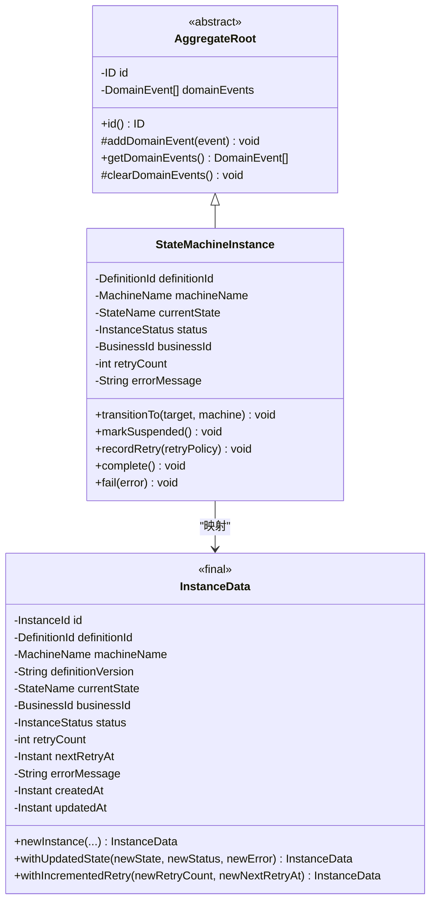

**图表来源**
- [AggregateRoot.java:7-29](file://state-machine-boot-starter/src/main/java/cn/chedejun/statemachine/domain/shared/AggregateRoot.java#L7-L29)
- [StateMachineInstance.java:9-81](file://state-machine-boot-starter/src/main/java/cn/chedejun/statemachine/domain/instance/StateMachineInstance.java#L9-L81)
- [InstanceData.java:8-79](file://state-machine-boot-starter/src/main/java/cn/chedejun/statemachine/domain/data/InstanceData.java#L8-L79)

### 仓库接口设计

项目实现了清晰的仓库模式，将数据访问抽象化：

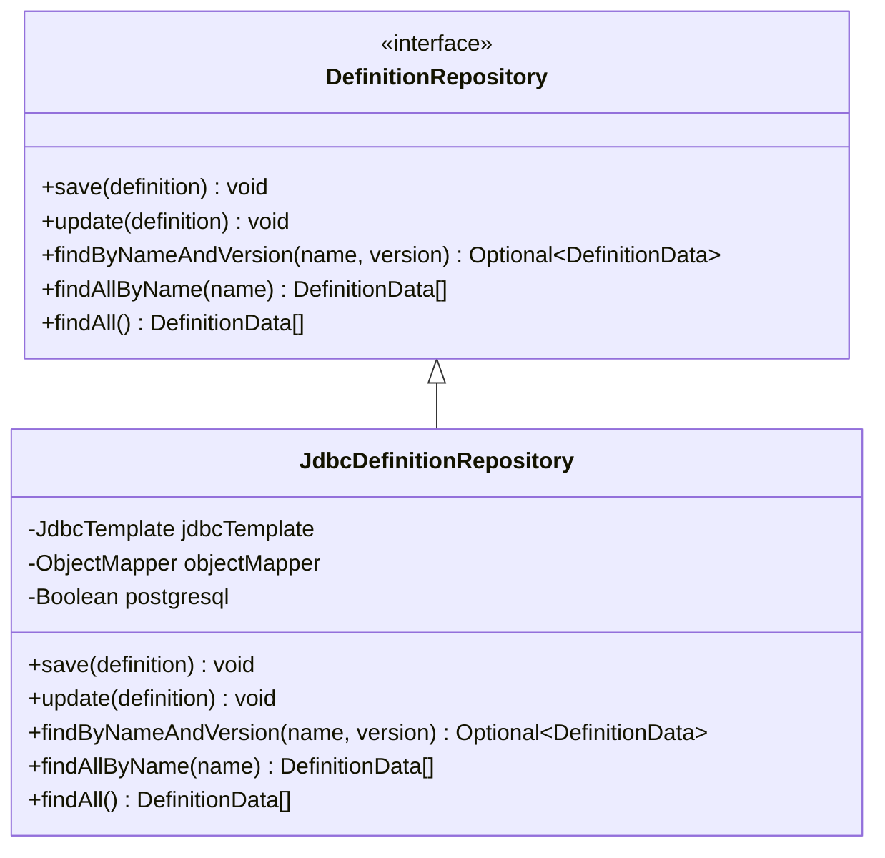

**图表来源**
- [DefinitionRepository.java:9-16](file://state-machine-boot-starter/src/main/java/cn/chedejun/statemachine/domain/repository/DefinitionRepository.java#L9-L16)
- [JdbcDefinitionRepository.java:18-119](file://state-machine-boot-starter/src/main/java/cn/chedejun/statemachine/infrastructure/persistence/JdbcDefinitionRepository.java#L18-L119)

### 应用服务执行流程

应用服务实现了复杂的状态机执行逻辑：

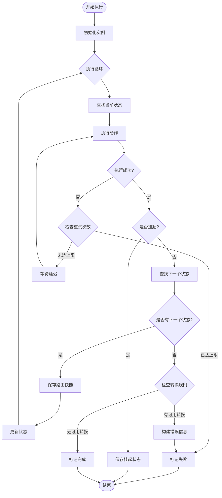

**图表来源**
- [InstanceExecutionService.java:158-193](file://state-machine-boot-starter/src/main/java/cn/chedejun/statemachine/application/InstanceExecutionService.java#L158-L193)
- [InstanceExecutionService.java:200-237](file://state-machine-boot-starter/src/main/java/cn/chedejun/statemachine/application/InstanceExecutionService.java#L200-L237)

**章节来源**
- [StateMachineInstance.java:1-81](file://state-machine-boot-starter/src/main/java/cn/chedejun/statemachine/domain/instance/StateMachineInstance.java#L1-L81)
- [InstanceExecutionService.java:1-296](file://state-machine-boot-starter/src/main/java/cn/chedejun/statemachine/application/InstanceExecutionService.java#L1-L296)

## 依赖分析

项目遵循Clean架构的依赖规则，确保依赖方向正确：

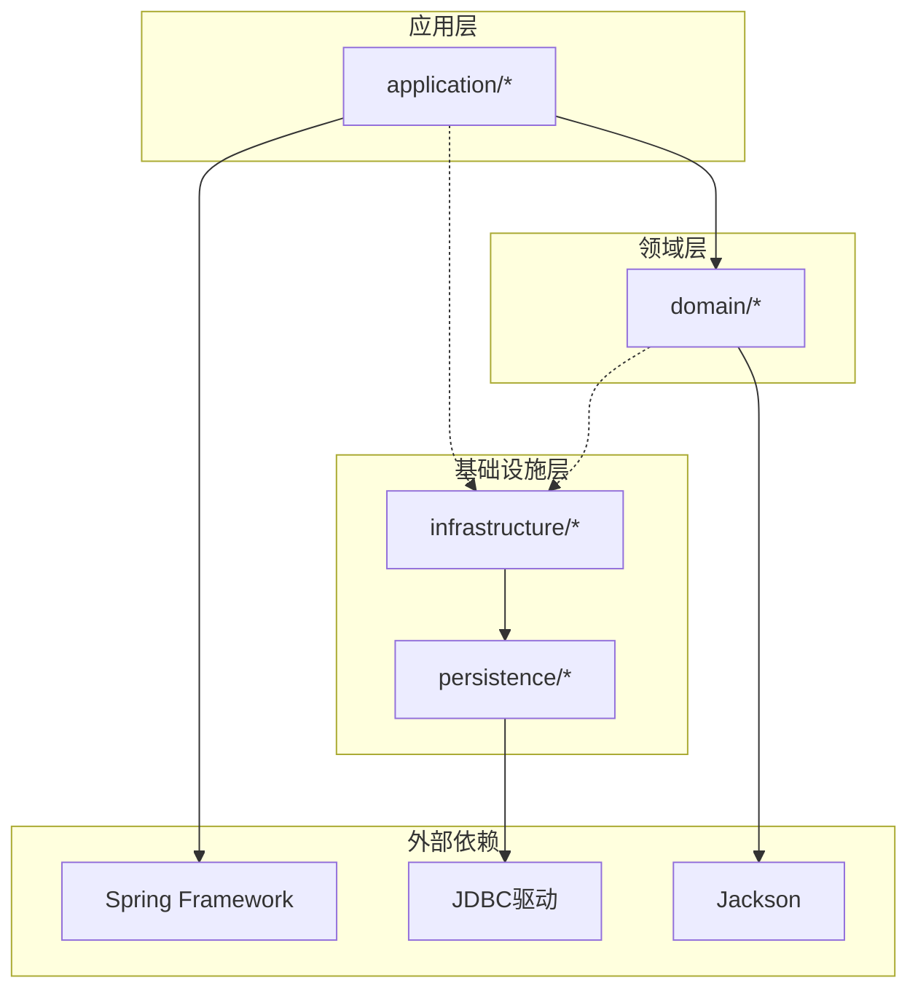

**图表来源**
- [InstanceExecutionService.java:3-17](file://state-machine-boot-starter/src/main/java/cn/chedejun/statemachine/application/InstanceExecutionService.java#L3-L17)
- [JdbcDefinitionRepository.java:6-27](file://state-machine-boot-starter/src/main/java/cn/chedejun/statemachine/infrastructure/persistence/JdbcDefinitionRepository.java#L6-L27)

### 循环依赖检测

项目通过严格的包结构避免了循环依赖：

- **应用层**不依赖基础设施层
- **领域层**不依赖应用层或基础设施层
- **基础设施层**可以依赖领域层（用于数据映射）

**章节来源**
- [AggregateRoot.java:1-29](file://state-machine-boot-starter/src/main/java/cn/chedejun/statemachine/domain/shared/AggregateRoot.java#L1-L29)
- [StateMachine.java:1-77](file://state-machine-boot-starter/src/main/java/cn/chedejun/statemachine/domain/engine/StateMachine.java#L1-L77)

## 性能考虑

### 并发控制和乐观锁

项目实现了高效的并发控制机制：

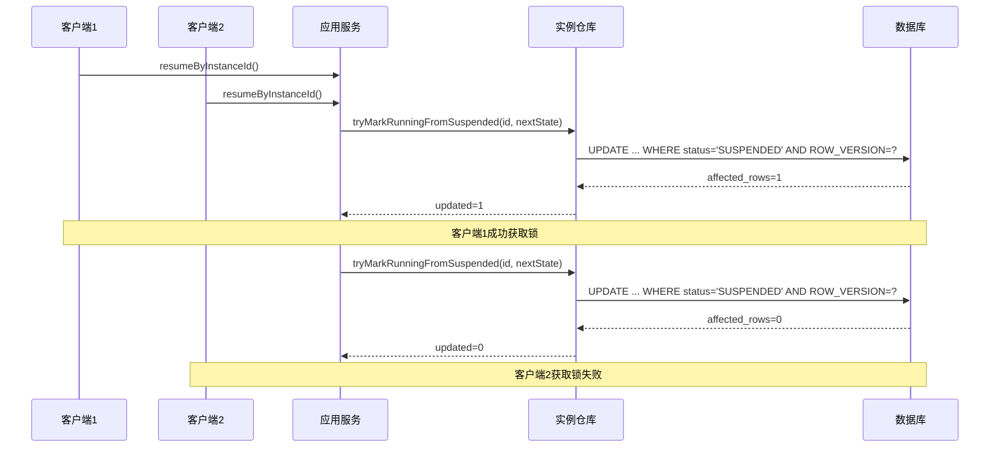

**图表来源**
- [InstanceExecutionService.java:139-142](file://state-machine-boot-starter/src/main/java/cn/chedejun/statemachine/application/InstanceExecutionService.java#L139-L142)

### 缓存策略

项目采用了智能的缓存策略来优化性能：

- **状态机定义缓存**：通过版本号和名称索引
- **实例状态缓存**：最近使用的实例状态
- **快照数据缓存**：成功执行的上下文数据

### 错误处理和重试机制

实现了完善的错误处理和重试策略：

- **指数退避算法**：避免雪崩效应
- **最大重试次数限制**：防止无限重试
- **超时控制**：避免长时间阻塞

## 故障排除指南

### 常见问题诊断

#### 状态机执行异常

当状态机执行出现异常时，系统会记录详细的错误信息：

1. **状态不存在**：检查状态名称拼写和定义
2. **转换条件失败**：验证条件函数逻辑
3. **重试次数耗尽**：检查系统资源和外部依赖

#### 数据一致性问题

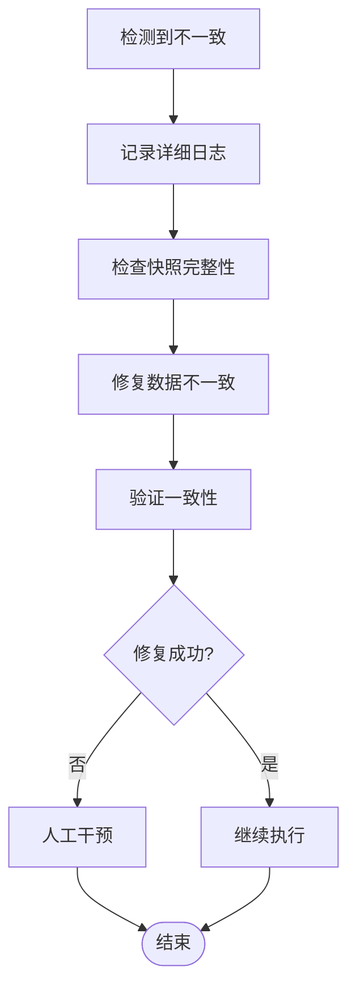

#### 性能问题排查

1. **数据库连接池监控**：检查连接数和等待时间
2. **内存使用情况**：监控堆内存和GC频率
3. **网络延迟**：检查外部服务响应时间

**章节来源**
- [InstanceExecutionService.java:214-236](file://state-machine-boot-starter/src/main/java/cn/chedejun/statemachine/application/InstanceExecutionService.java#L214-L236)
- [JdbcDefinitionRepository.java:95-106](file://state-machine-boot-starter/src/main/java/cn/chedejun/statemachine/infrastructure/persistence/JdbcDefinitionRepository.java#L95-L106)

## 结论

本项目成功实现了Clean架构、DDD和Hexagonal架构的最佳实践，提供了以下核心价值：

### 架构优势

1. **高度模块化**：清晰的分层设计使得代码易于维护和扩展
2. **业务逻辑独立**：领域模型不受技术细节影响
3. **测试友好**：依赖注入和接口抽象便于单元测试
4. **可扩展性强**：新的状态机可以在不影响现有代码的情况下添加

### 技术亮点

1. **智能重试机制**：实现了指数退避和最大重试次数控制
2. **快照持久化**：完整记录执行过程，支持故障恢复
3. **并发安全**：通过乐观锁保证数据一致性
4. **灵活的配置**：支持多种数据库和部署环境

### 应用场景

该状态机引擎适用于以下场景：

- **工作流自动化**：订单处理、审批流程等
- **业务流程编排**：复杂的多步骤业务操作
- **微服务协调**：跨服务的状态同步和协调
- **任务调度系统**：定时任务和批处理作业

通过遵循Clean架构原则，项目不仅实现了功能需求，更重要的是建立了可持续发展的技术基础，为未来的功能扩展和技术演进奠定了坚实的基础。