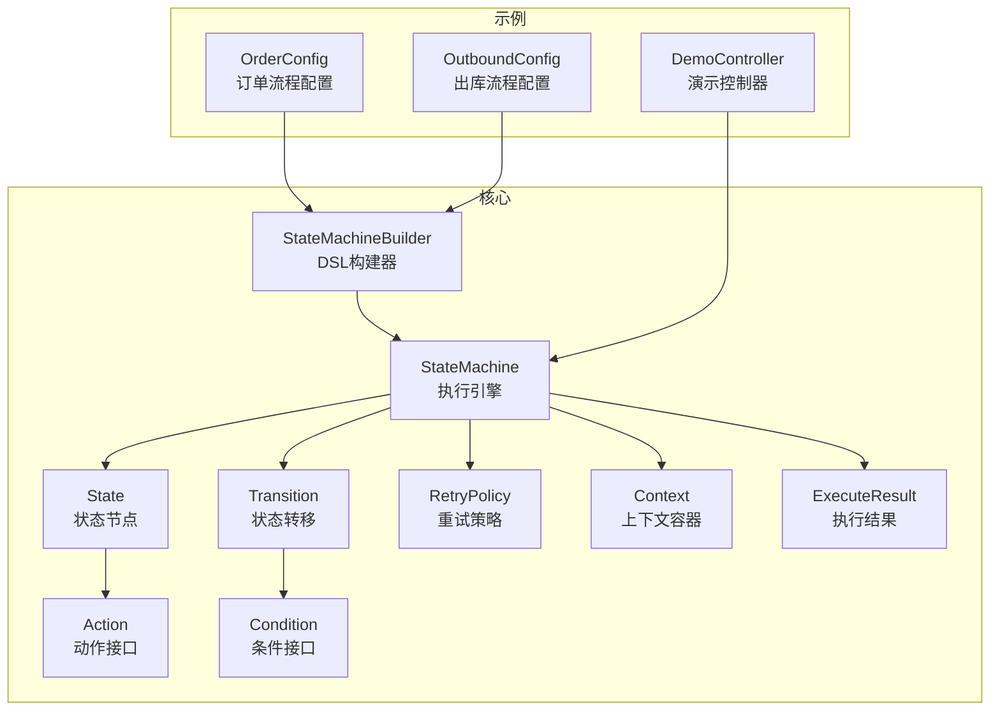
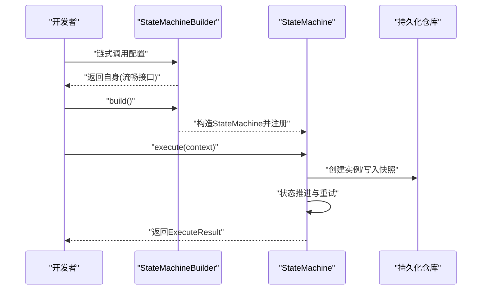
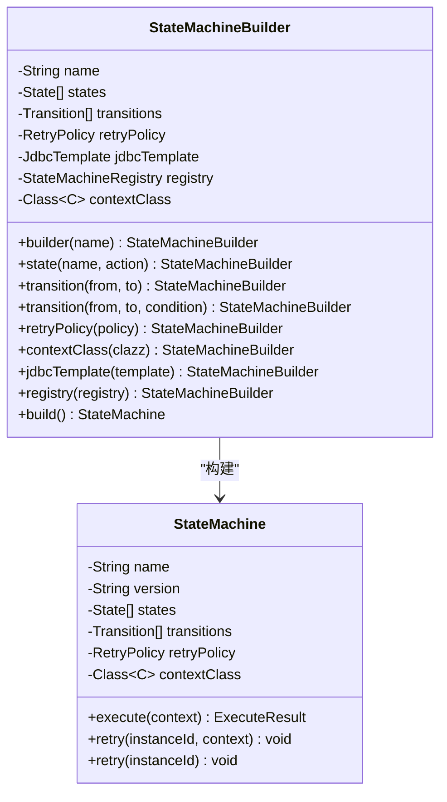
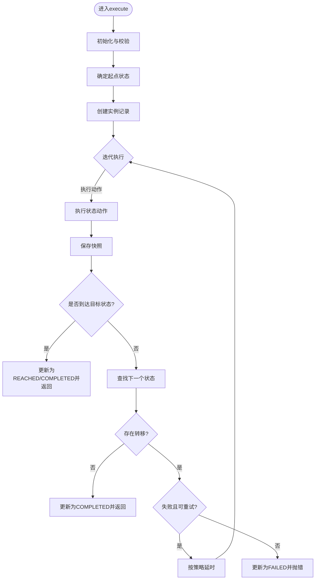
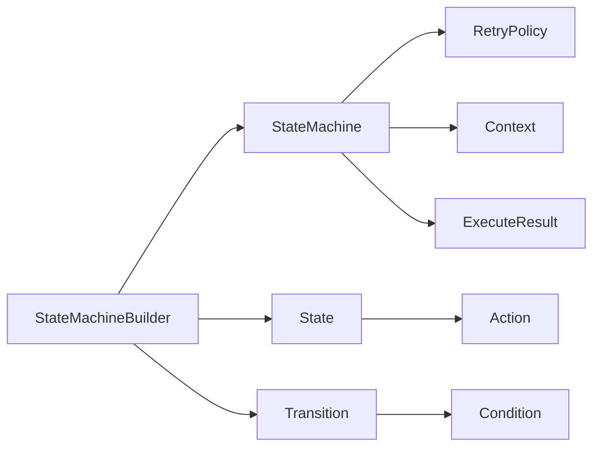

# DSL API概念

<cite>
**本文引用的文件**
- [StateMachineBuilder.java](file://src/main/java/cn/chedejun/statemachine/core/StateMachineBuilder.java)
- [StateMachine.java](file://src/main/java/cn/chedejun/statemachine/core/StateMachine.java)
- [State.java](file://src/main/java/cn/chedejun/statemachine/core/State.java)
- [Transition.java](file://src/main/java/cn/chedejun/statemachine/core/Transition.java)
- [Action.java](file://src/main/java/cn/chedejun/statemachine/core/Action.java)
- [Condition.java](file://src/main/java/cn/chedejun/statemachine/core/Condition.java)
- [RetryPolicy.java](file://src/main/java/cn/chedejun/statemachine/core/RetryPolicy.java)
- [Context.java](file://src/main/java/cn/chedejun/statemachine/core/Context.java)
- [ExecuteResult.java](file://src/main/java/cn/chedejun/statemachine/core/ExecuteResult.java)
- [OrderConfig.java](file://demo/src/main/java/cn/chedejun/demo/config/OrderConfig.java)
- [OutboundConfig.java](file://demo/src/main/java/cn/chedejun/demo/config/OutboundConfig.java)
- [DemoController.java](file://demo/src/main/java/cn/chedejun/demo/controller/DemoController.java)
- [StateMachineBuilderTest.java](file://src/test/java/cn/chedejun/statemachine/core/StateMachineBuilderTest.java)
- [README.md](file://README.md)
</cite>

## 目录
1. [引言](#引言)
2. [项目结构](#项目结构)
3. [核心组件](#核心组件)
4. [架构总览](#架构总览)
5. [详细组件分析](#详细组件分析)
6. [依赖分析](#依赖分析)
7. [性能考量](#性能考量)
8. [故障排查指南](#故障排查指南)
9. [结论](#结论)
10. [附录](#附录)

## 引言
本文件围绕状态机启动器的DSL风格API进行系统化阐述，重点解释其设计理念、建造者模式的使用与流畅接口设计，以及StateMachineBuilder的使用方法、链式调用与配置选项。我们将对比DSL与传统编程方式的差异与优势，并通过真实示例展示DSL API在不同业务场景中的应用与最佳实践。最后给出扩展性与维护性的建议，帮助读者在实际项目中高效、安全地使用该DSL。

## 项目结构
该项目采用分层+功能模块化的组织方式：
- 核心模型与运行时：位于core包，包含状态机定义、执行引擎、动作与条件等基础构件
- 自动装配与配置：位于autoconfigure包，负责Spring Boot集成
- 管理与控制台：位于management包，提供REST接口与前端控制台
- 持久化：位于persistence包，负责定义、实例与快照的存储
- 示例与演示：位于demo包，包含两个业务流程配置与控制器

图表来源
- [StateMachineBuilder.java:1-53](file://src/main/java/cn/chedejun/statemachine/core/StateMachineBuilder.java#L1-L53)
- [StateMachine.java:1-196](file://src/main/java/cn/chedejun/statemachine/core/StateMachine.java#L1-L196)
- [State.java:1-16](file://src/main/java/cn/chedejun/statemachine/core/State.java#L1-L16)
- [Transition.java:1-20](file://src/main/java/cn/chedejun/statemachine/core/Transition.java#L1-L20)
- [Action.java:1-12](file://src/main/java/cn/chedejun/statemachine/core/Action.java#L1-L12)
- [Condition.java:1-7](file://src/main/java/cn/chedejun/statemachine/core/Condition.java#L1-L7)
- [RetryPolicy.java:1-45](file://src/main/java/cn/chedejun/statemachine/core/RetryPolicy.java#L1-L45)
- [Context.java:1-24](file://src/main/java/cn/chedejun/statemachine/core/Context.java#L1-L24)
- [ExecuteResult.java:1-23](file://src/main/java/cn/chedejun/statemachine/core/ExecuteResult.java#L1-L23)
- [OrderConfig.java:1-85](file://demo/src/main/java/cn/chedejun/demo/config/OrderConfig.java#L1-L85)
- [OutboundConfig.java:1-121](file://demo/src/main/java/cn/chedejun/demo/config/OutboundConfig.java#L1-L121)
- [DemoController.java:1-288](file://demo/src/main/java/cn/chedejun/demo/controller/DemoController.java#L1-L288)

章节来源
- [StateMachineBuilder.java:1-53](file://src/main/java/cn/chedejun/statemachine/core/StateMachineBuilder.java#L1-L53)
- [StateMachine.java:1-196](file://src/main/java/cn/chedejun/statemachine/core/StateMachine.java#L1-L196)
- [OrderConfig.java:1-85](file://demo/src/main/java/cn/chedejun/demo/config/OrderConfig.java#L1-L85)
- [OutboundConfig.java:1-121](file://demo/src/main/java/cn/chedejun/demo/config/OutboundConfig.java#L1-L121)
- [DemoController.java:1-288](file://demo/src/main/java/cn/chedejun/demo/controller/DemoController.java#L1-L288)

## 核心组件
本节聚焦DSL API的关键构件及其职责：
- StateMachineBuilder：DSL构建器，提供流畅接口以声明状态、转移与策略
- State：状态节点，封装状态名与动作
- Transition：状态转移，封装起止状态与条件
- Action/Condition：函数式接口，分别承载状态动作与转移条件
- RetryPolicy：重试策略，支持指数退避与参数化配置
- Context：通用上下文容器，用于跨步骤传递数据
- ExecuteResult：执行结果载体，包含实例ID、状态与时间戳
- StateMachine：执行引擎，负责状态推进、快照、重试与持久化

章节来源
- [StateMachineBuilder.java:1-53](file://src/main/java/cn/chedejun/statemachine/core/StateMachineBuilder.java#L1-L53)
- [State.java:1-16](file://src/main/java/cn/chedejun/statemachine/core/State.java#L1-L16)
- [Transition.java:1-20](file://src/main/java/cn/chedejun/statemachine/core/Transition.java#L1-L20)
- [Action.java:1-12](file://src/main/java/cn/chedejun/statemachine/core/Action.java#L1-L12)
- [Condition.java:1-7](file://src/main/java/cn/chedejun/statemachine/core/Condition.java#L1-L7)
- [RetryPolicy.java:1-45](file://src/main/java/cn/chedejun/statemachine/core/RetryPolicy.java#L1-L45)
- [Context.java:1-24](file://src/main/java/cn/chedejun/statemachine/core/Context.java#L1-L24)
- [ExecuteResult.java:1-23](file://src/main/java/cn/chedejun/statemachine/core/ExecuteResult.java#L1-L23)
- [StateMachine.java:1-196](file://src/main/java/cn/chedejun/statemachine/core/StateMachine.java#L1-L196)

## 架构总览
DSL API通过Builder模式将状态机的“声明式”配置与“命令式”执行解耦。构建阶段仅收集元信息，执行阶段才真正落地到数据库与业务动作。

图表来源
- [StateMachineBuilder.java:40-51](file://src/main/java/cn/chedejun/statemachine/core/StateMachineBuilder.java#L40-L51)
- [StateMachine.java:40-48](file://src/main/java/cn/chedejun/statemachine/core/StateMachine.java#L40-L48)

## 详细组件分析

### DSL构建器：StateMachineBuilder
- 设计理念
  - 使用静态工厂方法与流畅接口，使状态机定义具备可读性与可维护性
  - 将状态、转移、重试策略与上下文类型在构建期集中声明
- 关键方法
  - builder(name)：创建构建器实例
  - state(name, action)：注册状态节点
  - transition(from, to) / transition(from, to, condition)：注册转移及条件
  - retryPolicy(policy)：设置重试策略
  - contextClass(clazz)：指定上下文类型
  - jdbcTemplate(template)/registry(registry)：延迟注入依赖
  - build()：生成不可变StateMachine实例
- 链式调用与错误处理
  - 构建器所有setter均返回自身，实现流畅接口
  - 对名称与状态名进行非空校验，避免无效配置
- 版本与注册
  - 构建器内部维护版本号计数器，确保每次构建产生唯一版本
  - 若提供注册表，则自动注册新定义

图表来源
- [StateMachineBuilder.java:8-51](file://src/main/java/cn/chedejun/statemachine/core/StateMachineBuilder.java#L8-L51)
- [StateMachine.java:11-35](file://src/main/java/cn/chedejun/statemachine/core/StateMachine.java#L11-L35)

章节来源
- [StateMachineBuilder.java:1-53](file://src/main/java/cn/chedejun/statemachine/core/StateMachineBuilder.java#L1-L53)

### 执行引擎：StateMachine
- 执行入口
  - execute(context) / execute(context, targetState)：支持从任意起点执行或到达目标状态即停
- 执行循环
  - 根据当前状态查找动作并执行；成功则保存快照并更新重试计数；失败则按策略延时重试
  - 当达到目标状态且无后续转移时标记为COMPLETED；否则标记为REACHED
- 重试机制
  - 基于RetryPolicy计算延迟，支持指数退避与最大尝试次数
- 上下文序列化
  - 使用ObjectMapper对上下文进行序列化/反序列化，兼容默认Context与自定义上下文类型
- 初始化约束
  - 未注入JdbcTemplate时，执行会抛出异常，确保运行环境正确

图表来源
- [StateMachine.java:40-136](file://src/main/java/cn/chedejun/statemachine/core/StateMachine.java#L40-L136)

章节来源
- [StateMachine.java:1-196](file://src/main/java/cn/chedejun/statemachine/core/StateMachine.java#L1-L196)

### DSL与传统编程方式的对比
- DSL优势
  - 声明式：以“状态-转移-条件-动作”的自然语言顺序表达流程，便于评审与维护
  - 流畅接口：链式调用减少样板代码，提升可读性
  - 组合灵活：通过Action/Condition函数式接口，将业务逻辑与流程解耦
- 传统方式劣势
  - 命令式：大量if/else或switch判断，易导致复杂度上升
  - 耦合度高：业务逻辑与流程控制混杂，难以复用与演进

章节来源
- [OrderConfig.java:18-46](file://demo/src/main/java/cn/chedejun/demo/config/OrderConfig.java#L18-L46)
- [OutboundConfig.java:21-57](file://demo/src/main/java/cn/chedejun/demo/config/OutboundConfig.java#L21-L57)

### DSL API使用场景与最佳实践
- 场景一：订单流程（条件分支）
  - 定义多个状态与动作，基于库存与支付结果进行条件转移
  - 使用RetryPolicy.exponentialBackoff配置重试策略
  - 通过Controller触发执行并返回执行结果
- 场景二：出库流程（多分支与异常处理）
  - 包含正常流程与异常路径（重新拣货、退货入库），通过条件区分
  - 使用相同的DSL风格快速搭建复杂流程
- 最佳实践
  - 明确上下文类型：通过contextClass指定强类型上下文，提升类型安全
  - 合理设置重试策略：根据外部服务稳定性调整最大尝试与初始/最大延迟
  - 目标状态控制：利用targetState实现“断点式”执行，便于调试与观测
  - 注册与版本：启用注册表以管理多版本定义，确保演进可控

章节来源
- [OrderConfig.java:18-85](file://demo/src/main/java/cn/chedejun/demo/config/OrderConfig.java#L18-L85)
- [OutboundConfig.java:21-121](file://demo/src/main/java/cn/chedejun/demo/config/OutboundConfig.java#L21-L121)
- [DemoController.java:38-118](file://demo/src/main/java/cn/chedejun/demo/controller/DemoController.java#L38-L118)
- [DemoController.java:174-247](file://demo/src/main/java/cn/chedejun/demo/controller/DemoController.java#L174-L247)

### DSL设计的扩展性与维护性建议
- 扩展性
  - 新增动作与条件：通过Action/Condition函数式接口即可扩展，无需修改核心引擎
  - 多上下文类型：通过contextClass支持不同业务上下文，隔离领域模型
  - 策略可插拔：RetryPolicy可替换为线性/固定间隔等策略
- 维护性
  - 单一职责：构建器只负责组装，执行引擎只负责推进，职责清晰
  - 不可变性：StateMachine构建后不可变，降低并发风险
  - 版本化：构建器自动分配版本号，便于灰度与回滚
  - 注释与文档：在配置类中添加流程说明注释，辅助团队协作

章节来源
- [StateMachineBuilder.java:40-51](file://src/main/java/cn/chedejun/statemachine/core/StateMachineBuilder.java#L40-L51)
- [StateMachine.java:161-166](file://src/main/java/cn/chedejun/statemachine/core/StateMachine.java#L161-L166)

## 依赖分析
DSL API的依赖关系简洁清晰，核心构件之间松耦合：
- StateMachineBuilder依赖于State、Transition、RetryPolicy与StateMachineRegistry
- State与Transition分别持有Action与Condition
- StateMachine依赖JdbcTemplate与持久化仓库，同时依赖ObjectMapper进行上下文序列化

图表来源
- [StateMachineBuilder.java:8-51](file://src/main/java/cn/chedejun/statemachine/core/StateMachineBuilder.java#L8-L51)
- [StateMachine.java:11-35](file://src/main/java/cn/chedejun/statemachine/core/StateMachine.java#L11-L35)
- [State.java:3-14](file://src/main/java/cn/chedejun/statemachine/core/State.java#L3-L14)
- [Transition.java:3-18](file://src/main/java/cn/chedejun/statemachine/core/Transition.java#L3-L18)
- [Action.java:3-11](file://src/main/java/cn/chedejun/statemachine/core/Action.java#L3-L11)
- [Condition.java:3-6](file://src/main/java/cn/chedejun/statemachine/core/Condition.java#L3-L6)
- [RetryPolicy.java:5-44](file://src/main/java/cn/chedejun/statemachine/core/RetryPolicy.java#L5-L44)
- [Context.java:6-23](file://src/main/java/cn/chedejun/statemachine/core/Context.java#L6-L23)
- [ExecuteResult.java:14-22](file://src/main/java/cn/chedejun/statemachine/core/ExecuteResult.java#L14-L22)

章节来源
- [StateMachineBuilder.java:1-53](file://src/main/java/cn/chedejun/statemachine/core/StateMachineBuilder.java#L1-L53)
- [StateMachine.java:1-196](file://src/main/java/cn/chedejun/statemachine/core/StateMachine.java#L1-L196)

## 性能考量
- 执行循环上限：为避免无限循环，执行循环设置了最大迭代次数，通常与状态数与重试次数相关
- 序列化开销：上下文的序列化/反序列化在每个状态前后发生，应尽量保持上下文精简
- 数据库写入：快照与实例记录频繁写入，建议合理配置数据库连接池与索引
- 重试延迟：指数退避可平滑外部系统压力，但需结合业务SLA权衡

章节来源
- [StateMachine.java:83-136](file://src/main/java/cn/chedejun/statemachine/core/StateMachine.java#L83-L136)
- [StateMachine.java:151-160](file://src/main/java/cn/chedejun/statemachine/core/StateMachine.java#L151-L160)

## 故障排查指南
- 未注入数据源
  - 现象：执行时报“未初始化”
  - 处理：在构建时注入JdbcTemplate或在运行时通过BeanPostProcessor注入
- 目标状态无后续转移
  - 现象：返回COMPLETED
  - 处理：确认转移定义与目标状态是否正确
- 断点式执行
  - 现象：返回REACHED
  - 处理：目标状态之后仍有未执行状态，适合调试与观测
- 重试中断
  - 现象：线程被中断
  - 处理：捕获中断并妥善处理，避免破坏流程一致性

章节来源
- [StateMachineBuilderTest.java:30-34](file://src/test/java/cn/chedejun/statemachine/core/StateMachineBuilderTest.java#L30-L34)
- [StateMachineBuilderTest.java:67-83](file://src/test/java/cn/chedejun/statemachine/core/StateMachineBuilderTest.java#L67-L83)
- [StateMachineBuilderTest.java:85-102](file://src/test/java/cn/chedejun/statemachine/core/StateMachineBuilderTest.java#L85-L102)
- [StateMachine.java:107-110](file://src/main/java/cn/chedejun/statemachine/core/StateMachine.java#L107-L110)

## 结论
DSL风格API通过Builder模式与流畅接口，将状态机的声明与执行分离，显著提升了可读性、可维护性与可扩展性。配合强类型的上下文、灵活的重试策略与完善的执行结果反馈，能够满足复杂业务流程的建模与运行需求。建议在实际项目中遵循类型安全、最小化上下文、合理重试策略与版本化管理的最佳实践，持续演进状态机定义。

## 附录
- 快速开始与示例参考
  - 在示例配置中，通过@Bean定义订单与出库流程，展示DSL的完整使用路径
  - 控制器提供HTTP接口，演示如何触发执行、查询实例与快照、以及重试

章节来源
- [README.md:17-49](file://README.md#L17-L49)
- [OrderConfig.java:18-46](file://demo/src/main/java/cn/chedejun/demo/config/OrderConfig.java#L18-L46)
- [OutboundConfig.java:21-57](file://demo/src/main/java/cn/chedejun/demo/config/OutboundConfig.java#L21-L57)
- [DemoController.java:38-118](file://demo/src/main/java/cn/chedejun/demo/controller/DemoController.java#L38-L118)
- [DemoController.java:174-247](file://demo/src/main/java/cn/chedejun/demo/controller/DemoController.java#L174-L247)