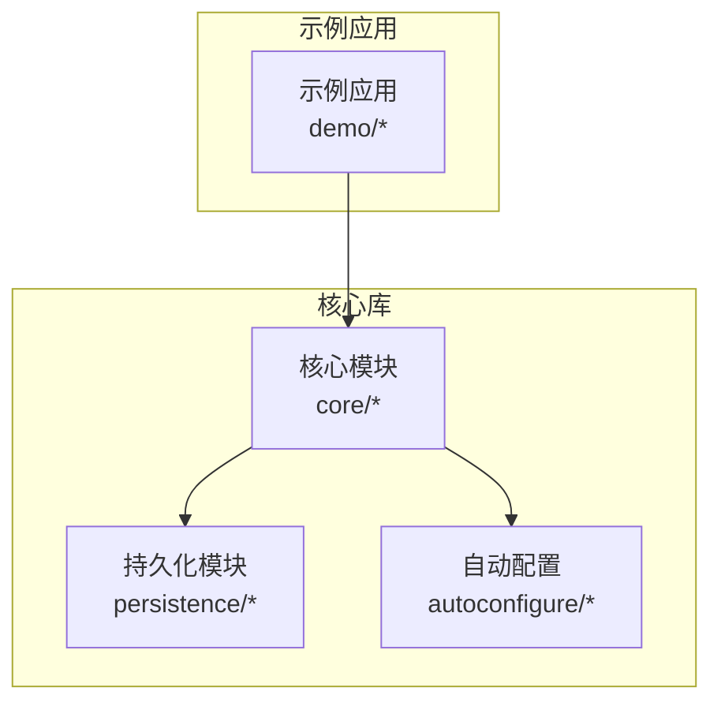
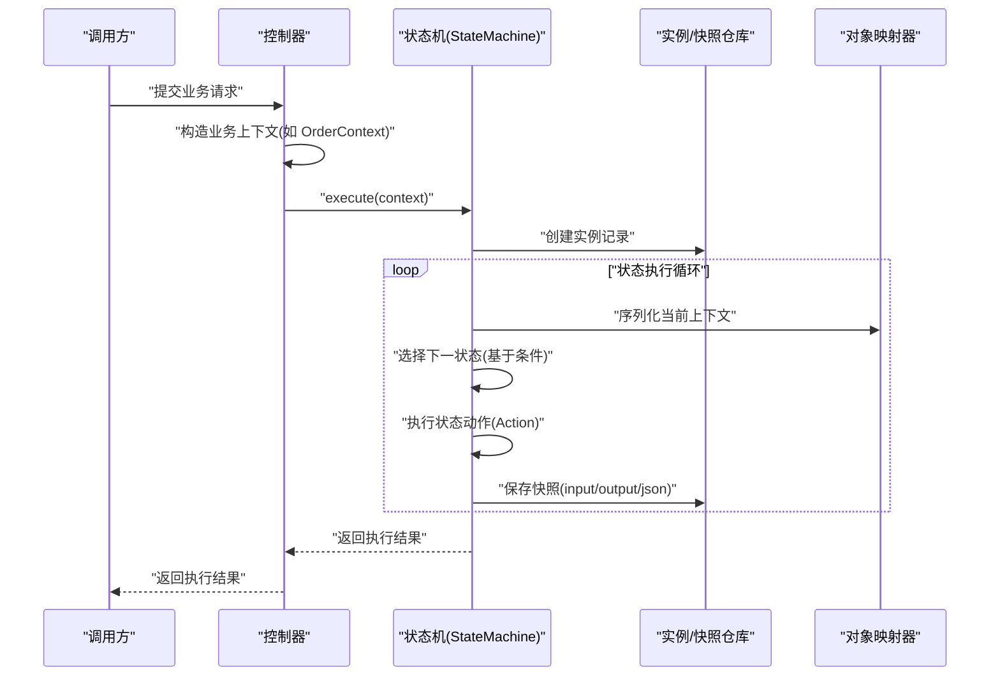
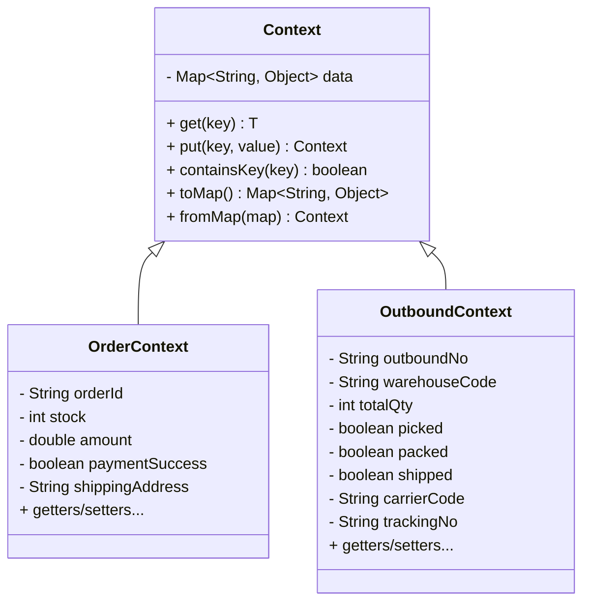
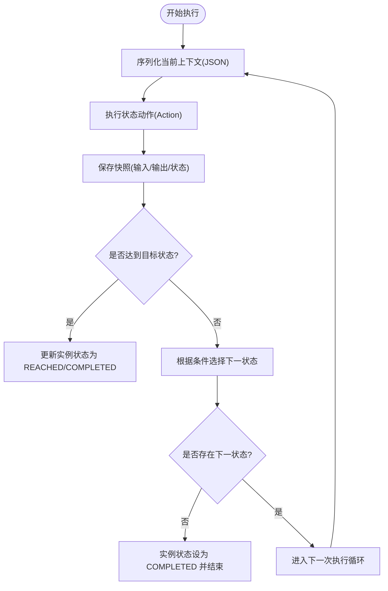
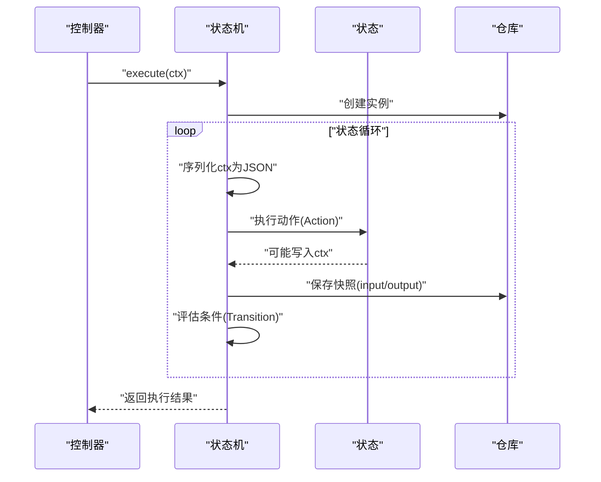
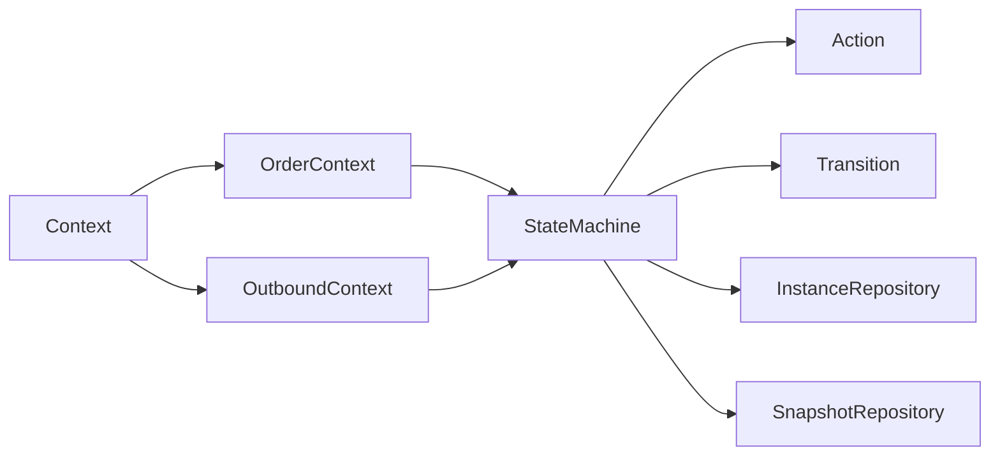

# 上下文概念

<cite>
**本文引用的文件**
- [Context.java](file://src/main/java/cn/chedejun/statemachine/core/Context.java)
- [OrderContext.java](file://demo/src/main/java/cn/chedejun/demo/statemachine/OrderContext.java)
- [OutboundContext.java](file://demo/src/main/java/cn/chedejun/demo/statemachine/OutboundContext.java)
- [StateMachine.java](file://src/main/java/cn/chedejun/statemachine/core/StateMachine.java)
- [Action.java](file://src/main/java/cn/chedejun/statemachine/core/Action.java)
- [Transition.java](file://src/main/java/cn/chedejun/statemachine/core/Transition.java)
- [StateMachineBuilder.java](file://src/main/java/cn/chedejun/statemachine/core/StateMachineBuilder.java)
- [InstanceRepository.java](file://src/main/java/cn/chedejun/statemachine/persistence/InstanceRepository.java)
- [SnapshotRepository.java](file://src/main/java/cn/chedejun/statemachine/persistence/SnapshotRepository.java)
- [DemoController.java](file://demo/src/main/java/cn/chedejun/demo/controller/DemoController.java)
- [README.md](file://README.md)
</cite>

## 目录
1. [引言](#引言)
2. [项目结构](#项目结构)
3. [核心组件](#核心组件)
4. [架构总览](#架构总览)
5. [详细组件分析](#详细组件分析)
6. [依赖分析](#依赖分析)
7. [性能考量](#性能考量)
8. [故障排查指南](#故障排查指南)
9. [结论](#结论)
10. [附录](#附录)

## 引言
本文件围绕状态机中的“上下文（Context）”概念进行系统性阐述，涵盖其作用、数据结构、传递机制、生命周期、序列化与反序列化流程，以及在状态执行中如何实现状态间的数据传递。同时提供基于仓库实际代码的使用示例路径与最佳实践建议，帮助读者在不直接阅读源码的情况下快速掌握上下文的设计与应用。

## 项目结构
该工程采用分层与功能模块结合的组织方式：
- 核心库位于 src/main/java/cn/chedejun/statemachine 下，包含状态机核心、持久化与管理端点等模块。
- 示例应用位于 demo/ 目录，演示了如何定义业务上下文类（如订单上下文、出库上下文）并将其注入状态机执行。
- README 提供了快速开始与基本用法说明，便于快速上手。

章节来源
- [README.md:1-65](file://README.md#L1-L65)

## 核心组件
- Context：通用上下文容器，提供键值存储、类型安全读取、映射转换与静态工厂方法。
- 业务上下文：如 OrderContext、OutboundContext，继承自 Context 并封装具体业务字段与访问器。
- StateMachine：状态机执行引擎，负责上下文的序列化/反序列化、状态流转、重试与持久化。
- Action：状态动作接口，通过上下文读写数据，实现状态间的共享与传递。
- Transition：状态转移条件，基于上下文判断是否允许从某状态转移到另一状态。
- StateMachineBuilder：构建器，用于装配状态机并指定上下文类型。
- 实例与快照持久化：InstanceRepository、SnapshotRepository 负责实例与执行快照的存取。

章节来源
- [Context.java:1-24](file://src/main/java/cn/chedejun/statemachine/core/Context.java#L1-L24)
- [OrderContext.java:1-34](file://demo/src/main/java/cn/chedejun/demo/statemachine/OrderContext.java#L1-L34)
- [OutboundContext.java:1-43](file://demo/src/main/java/cn/chedejun/demo/statemachine/OutboundContext.java#L1-L43)
- [StateMachine.java:1-196](file://src/main/java/cn/chedejun/statemachine/core/StateMachine.java#L1-L196)
- [Action.java:1-12](file://src/main/java/cn/chedejun/statemachine/core/Action.java#L1-L12)
- [Transition.java:1-20](file://src/main/java/cn/chedejun/statemachine/core/Transition.java#L1-L20)
- [StateMachineBuilder.java:1-53](file://src/main/java/cn/chedejun/statemachine/core/StateMachineBuilder.java#L1-L53)
- [InstanceRepository.java:1-66](file://src/main/java/cn/chedejun/statemachine/persistence/InstanceRepository.java#L1-L66)
- [SnapshotRepository.java:1-55](file://src/main/java/cn/chedejun/statemachine/persistence/SnapshotRepository.java#L1-L55)

## 架构总览
上下文贯穿状态机的定义、执行、持久化与重试恢复全过程。下图展示了上下文在状态机执行链路中的位置与交互。

图表来源
- [StateMachine.java:37-136](file://src/main/java/cn/chedejun/statemachine/core/StateMachine.java#L37-L136)
- [SnapshotRepository.java:15-31](file://src/main/java/cn/chedejun/statemachine/persistence/SnapshotRepository.java#L15-L31)
- [InstanceRepository.java:15-38](file://src/main/java/cn/chedejun/statemachine/persistence/InstanceRepository.java#L15-L38)

## 详细组件分析

### 上下文数据结构与传递机制
- Context 作为通用容器，内部以键值映射存储任意对象，提供类型安全的读取、写入与映射转换能力。它既可作为默认上下文类型，也可被业务上下文类扩展以承载领域属性。
- 业务上下文类（如 OrderContext、OutboundContext）在继承 Context 的基础上，增加强类型的业务字段与访问器，便于在状态动作中以类型安全的方式读写数据。
- 在状态机执行过程中，上下文通过 Action 接口在各状态之间传递。状态动作可读取上下文中的条件字段，并通过 put 方法写入中间或最终结果，这些变更会随执行循环被序列化并记录到快照中。

图表来源
- [Context.java:6-23](file://src/main/java/cn/chedejun/statemachine/core/Context.java#L6-L23)
- [OrderContext.java:8-33](file://demo/src/main/java/cn/chedejun/demo/statemachine/OrderContext.java#L8-L33)
- [OutboundContext.java:8-42](file://demo/src/main/java/cn/chedejun/demo/statemachine/OutboundContext.java#L8-L42)

章节来源
- [Context.java:6-23](file://src/main/java/cn/chedejun/statemachine/core/Context.java#L6-L23)
- [OrderContext.java:8-33](file://demo/src/main/java/cn/chedejun/demo/statemachine/OrderContext.java#L8-L33)
- [OutboundContext.java:8-42](file://demo/src/main/java/cn/chedejun/demo/statemachine/OutboundContext.java#L8-L42)

### 上下文生命周期与序列化/反序列化
- 生命周期：从创建业务上下文开始，经由状态机执行进入实例化阶段；随后在状态执行循环中持续更新；最终根据执行结果更新实例状态。若发生异常，可通过首次快照中保存的输入上下文 JSON 进行反序列化并重试。
- 序列化：在每次状态执行前，状态机会将当前上下文序列化为 JSON 字符串，作为快照的输入。
- 反序列化：当仅提供实例 ID 进行重试时，状态机会从首次快照读取输入 JSON，并尝试按指定上下文类型或通用 Context 类型进行反序列化，再继续执行。

图表来源
- [StateMachine.java:83-136](file://src/main/java/cn/chedejun/statemachine/core/StateMachine.java#L83-L136)
- [SnapshotRepository.java:15-31](file://src/main/java/cn/chedejun/statemachine/persistence/SnapshotRepository.java#L15-L31)

章节来源
- [StateMachine.java:94-160](file://src/main/java/cn/chedejun/statemachine/core/StateMachine.java#L94-L160)
- [SnapshotRepository.java:15-31](file://src/main/java/cn/chedejun/statemachine/persistence/SnapshotRepository.java#L15-L31)

### 状态执行中的上下文作用与状态间数据传递
- 条件驱动的状态迁移：Transition 的条件函数接收上下文，依据其中的业务字段决定是否允许状态切换。
- 动作驱动的数据写入：Action 在执行过程中读取上下文并可能写入新数据，这些变化会在下一轮循环中被序列化并持久化。
- 控制台与示例：DemoController 展示了如何在控制器中构造业务上下文并调用状态机执行，同时提供了查询实例与快照的能力。

图表来源
- [DemoController.java:38-72](file://demo/src/main/java/cn/chedejun/demo/controller/DemoController.java#L38-L72)
- [StateMachine.java:142-149](file://src/main/java/cn/chedejun/statemachine/core/StateMachine.java#L142-L149)
- [Action.java:9-11](file://src/main/java/cn/chedejun/statemachine/core/Action.java#L9-L11)

章节来源
- [Transition.java:8-18](file://src/main/java/cn/chedejun/statemachine/core/Transition.java#L8-L18)
- [Action.java:9-11](file://src/main/java/cn/chedejun/statemachine/core/Action.java#L9-L11)
- [DemoController.java:38-72](file://demo/src/main/java/cn/chedejun/demo/controller/DemoController.java#L38-L72)

### 上下文定义、使用与管理示例（路径指引）
- 定义业务上下文类
  - 订单上下文：[OrderContext.java:8-33](file://demo/src/main/java/cn/chedejun/demo/statemachine/OrderContext.java#L8-L33)
  - 出库上下文：[OutboundContext.java:8-42](file://demo/src/main/java/cn/chedejun/demo/statemachine/OutboundContext.java#L8-L42)
- 使用上下文执行状态机
  - 控制器触发订单流程：[DemoController.java:38-72](file://demo/src/main/java/cn/chedejun/demo/controller/DemoController.java#L38-L72)
  - 控制器触发出库流程：[DemoController.java:174-208](file://demo/src/main/java/cn/chedejun/demo/controller/DemoController.java#L174-L208)
- 构建状态机并指定上下文类型
  - 构建器设置上下文类型：[StateMachineBuilder.java:35](file://src/main/java/cn/chedejun/statemachine/core/StateMachineBuilder.java#L35)
  - README 中的订单状态机示例：[README.md:20-37](file://README.md#L20-L37)
- 上下文序列化/反序列化
  - 序列化与反序列化实现：[StateMachine.java:151-160](file://src/main/java/cn/chedejun/statemachine/core/StateMachine.java#L151-L160)
  - 重试时自动反序列化上下文：[StateMachine.java:64-79](file://src/main/java/cn/chedejun/statemachine/core/StateMachine.java#L64-L79)

章节来源
- [OrderContext.java:8-33](file://demo/src/main/java/cn/chedejun/demo/statemachine/OrderContext.java#L8-L33)
- [OutboundContext.java:8-42](file://demo/src/main/java/cn/chedejun/demo/statemachine/OutboundContext.java#L8-L42)
- [DemoController.java:38-72](file://demo/src/main/java/cn/chedejun/demo/controller/DemoController.java#L38-L72)
- [DemoController.java:174-208](file://demo/src/main/java/cn/chedejun/demo/controller/DemoController.java#L174-L208)
- [StateMachineBuilder.java:35](file://src/main/java/cn/chedejun/statemachine/core/StateMachineBuilder.java#L35)
- [README.md:20-37](file://README.md#L20-L37)
- [StateMachine.java:151-160](file://src/main/java/cn/chedejun/statemachine/core/StateMachine.java#L151-L160)
- [StateMachine.java:64-79](file://src/main/java/cn/chedejun/statemachine/core/StateMachine.java#L64-L79)

### 最佳实践与数据安全考虑
- 最佳实践
  - 明确区分“输入上下文”与“中间/最终上下文”，避免在状态动作中产生不可预期的副作用。
  - 将业务字段收敛在业务上下文类中，保持 Action 的职责单一，提升可维护性。
  - 利用状态机的重试机制与快照记录，确保失败可恢复且可观测。
  - 在构建状态机时显式指定上下文类型，便于编译期检查与 IDE 支持。
- 数据安全
  - 序列化/反序列化涉及敏感信息时，应避免在快照中存储明文敏感字段，必要时进行脱敏处理。
  - 对外部输入的上下文进行校验与清洗，防止恶意数据污染状态机执行。
  - 严格控制状态机的访问权限与调用入口，避免未授权的重试或状态篡改操作。

## 依赖分析
上下文在系统中的耦合关系清晰：核心状态机依赖 Jackson 进行序列化，依赖仓库进行实例与快照持久化；业务上下文通过继承 Context 与 Action/Transition 协作，形成松耦合的扩展点。

图表来源
- [Context.java:6-23](file://src/main/java/cn/chedejun/statemachine/core/Context.java#L6-L23)
- [OrderContext.java:8-33](file://demo/src/main/java/cn/chedejun/demo/statemachine/OrderContext.java#L8-L33)
- [OutboundContext.java:8-42](file://demo/src/main/java/cn/chedejun/demo/statemachine/OutboundContext.java#L8-L42)
- [StateMachine.java:11-35](file://src/main/java/cn/chedejun/statemachine/core/StateMachine.java#L11-L35)
- [Action.java:9-11](file://src/main/java/cn/chedejun/statemachine/core/Action.java#L9-L11)
- [Transition.java:8-18](file://src/main/java/cn/chedejun/statemachine/core/Transition.java#L8-L18)
- [InstanceRepository.java:15-38](file://src/main/java/cn/chedejun/statemachine/persistence/InstanceRepository.java#L15-L38)
- [SnapshotRepository.java:15-31](file://src/main/java/cn/chedejun/statemachine/persistence/SnapshotRepository.java#L15-L31)

章节来源
- [StateMachine.java:11-35](file://src/main/java/cn/chedejun/statemachine/core/StateMachine.java#L11-L35)
- [StateMachineBuilder.java:40-51](file://src/main/java/cn/chedejun/statemachine/core/StateMachineBuilder.java#L40-L51)

## 性能考量
- 序列化成本：频繁的上下文序列化/反序列化可能带来额外开销，建议在状态动作中尽量减少不必要的数据写入，避免大对象频繁进出上下文。
- 快照数量：过多的快照会增加数据库压力，应结合业务需求合理设置重试策略与保留周期。
- 状态数量与循环次数：状态机的最大迭代次数受状态数与重试次数影响，需在构建时合理配置，避免无限循环风险。

## 故障排查指南
- 执行前检查
  - 确认状态机已注入 JdbcTemplate，否则执行会抛出初始化异常。
  - 确认状态机名称与版本正确，避免找不到定义或版本不匹配。
- 执行中问题
  - 若状态动作抛出异常，状态机会记录失败快照与错误信息；可通过实例详情查看快照。
  - 若需要重试，请确认实例状态为 FAILED，否则无法重试。
- 重试与恢复
  - 仅提供实例 ID 的重试会自动从首次快照读取输入 JSON 并反序列化上下文；若反序列化失败，需检查 JSON 结构与上下文类型一致性。

章节来源
- [StateMachine.java:178-180](file://src/main/java/cn/chedejun/statemachine/core/StateMachine.java#L178-L180)
- [StateMachine.java:50-79](file://src/main/java/cn/chedejun/statemachine/core/StateMachine.java#L50-L79)
- [SnapshotRepository.java:37-43](file://src/main/java/cn/chedejun/statemachine/persistence/SnapshotRepository.java#L37-L43)

## 结论
上下文是状态机执行的核心载体，贯穿状态定义、动作执行、条件判断与持久化恢复的全生命周期。通过通用 Context 与业务上下文类的组合，既能满足灵活扩展的需求，又能保证类型安全与可维护性。配合完善的序列化/反序列化与快照机制，状态机能够在复杂业务场景中实现可靠、可观测与可恢复的流程编排。

## 附录
- 快照字段说明
  - 输入 JSON：执行前的上下文序列化结果
  - 输出 JSON：执行后的上下文序列化结果
  - 状态：SUCCESS/FAILED
  - 错误信息：异常描述
  - 重试次数：当前状态的尝试次数
- 常见问题
  - 为什么重试时报错找不到实例？请确认实例 ID 正确且状态为 FAILED。
  - 为什么快照中没有输出 JSON？通常发生在状态动作成功但未写入上下文或序列化失败时。