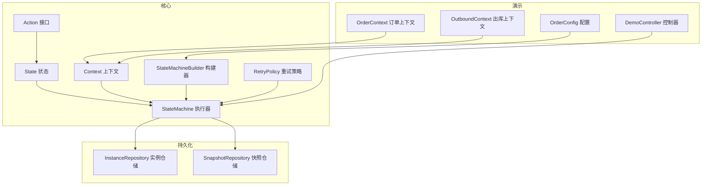
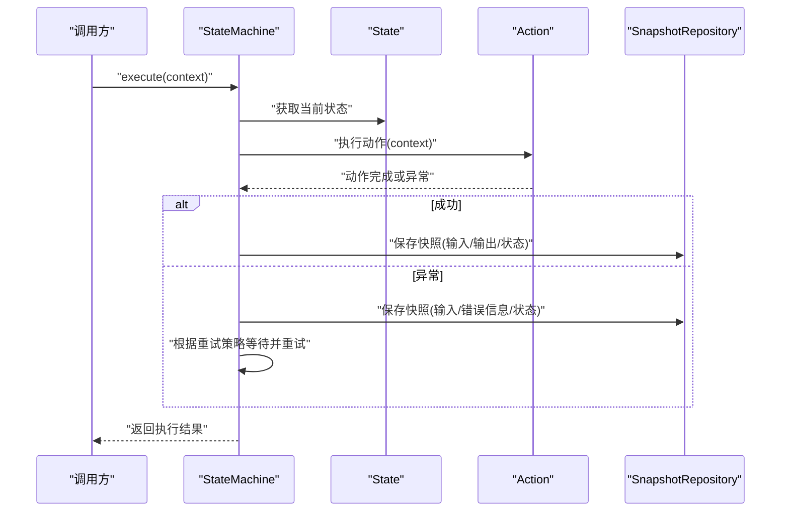
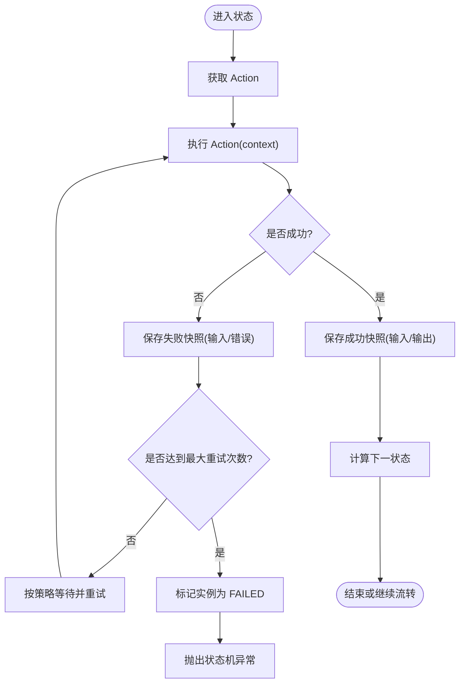
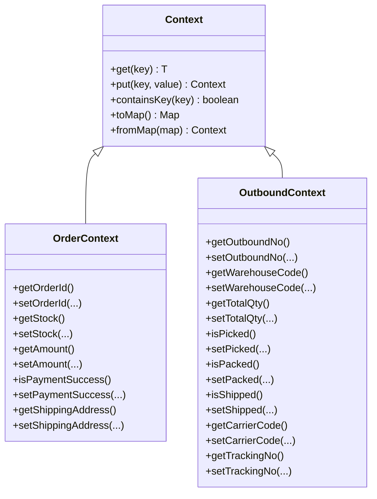
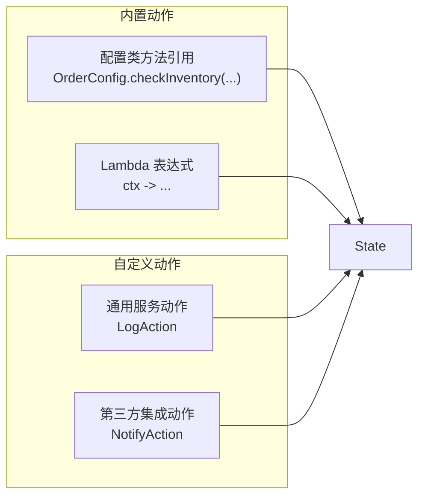
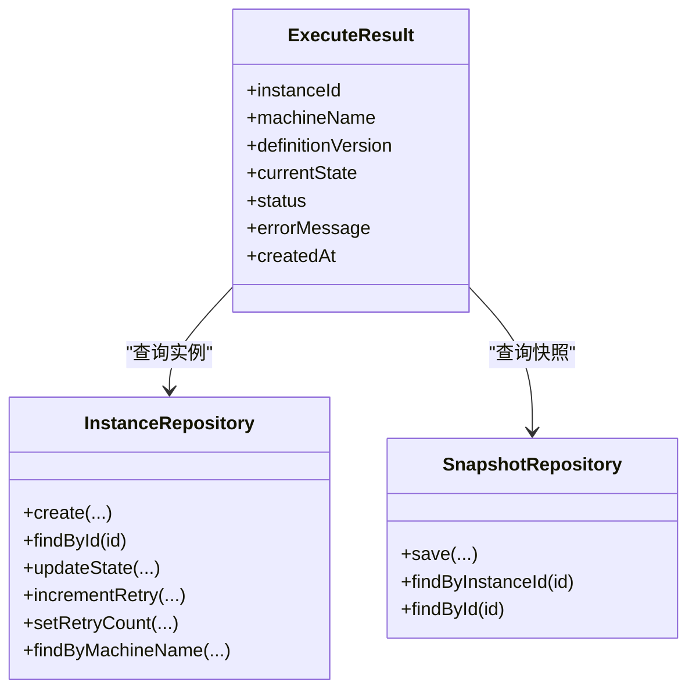
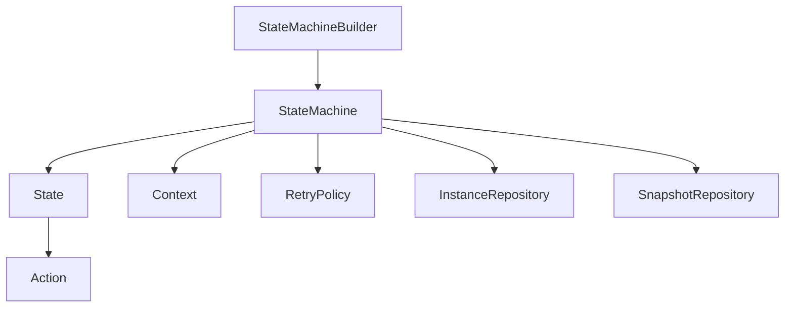

# 动作概念

<cite>
**本文引用的文件**
- [Action.java](file://src/main/java/cn/chedejun/statemachine/core/Action.java)
- [State.java](file://src/main/java/cn/chedejun/statemachine/core/State.java)
- [StateMachine.java](file://src/main/java/cn/chedejun/statemachine/core/StateMachine.java)
- [Context.java](file://src/main/java/cn/chedejun/statemachine/core/Context.java)
- [OrderConfig.java](file://demo/src/main/java/cn/chedejun/demo/config/OrderConfig.java)
- [OrderContext.java](file://demo/src/main/java/cn/chedejun/demo/statemachine/OrderContext.java)
- [OutboundContext.java](file://demo/src/main/java/cn/chedejun/demo/statemachine/OutboundContext.java)
- [DemoController.java](file://demo/src/main/java/cn/chedejun/demo/controller/DemoController.java)
- [StateMachineBuilder.java](file://src/main/java/cn/chedejun/statemachine/core/StateMachineBuilder.java)
- [RetryPolicy.java](file://src/main/java/cn/chedejun/statemachine/core/RetryPolicy.java)
- [InstanceRepository.java](file://src/main/java/cn/chedejun/statemachine/persistence/InstanceRepository.java)
- [SnapshotRepository.java](file://src/main/java/cn/chedejun/statemachine/persistence/SnapshotRepository.java)
- [README.md](file://README.md)
</cite>

## 目录
1. [引言](#引言)
2. [项目结构](#项目结构)
3. [核心组件](#核心组件)
4. [架构总览](#架构总览)
5. [详细组件分析](#详细组件分析)
6. [依赖分析](#依赖分析)
7. [性能考虑](#性能考虑)
8. [故障排查指南](#故障排查指南)
9. [结论](#结论)
10. [附录](#附录)

## 引言
本章节围绕状态机中的“动作(Action)”概念展开，系统阐述其定义、执行机制、实现方式、接口设计、执行上下文与异常处理策略，并对比内置动作与自定义动作的差异及适用场景。文档同时提供多种动作类型的实现与调用示例路径，总结最佳实践与性能优化建议，帮助读者在实际工程中高效、安全地使用状态机的动作能力。

## 项目结构
该仓库采用按领域分层的组织方式：核心模型与执行引擎位于 core 包；演示应用位于 demo 包；持久化组件位于 persistence 包；管理端点位于 management 包（本节不展开）。与动作密切相关的模块包括：
- 核心接口与模型：Action、State、Context、StateMachine、StateMachineBuilder
- 执行与重试：StateMachine、RetryPolicy
- 演示与示例：OrderConfig、OrderContext、OutboundContext、DemoController
- 持久化：InstanceRepository、SnapshotRepository

图表来源
- [Action.java:1-12](file://src/main/java/cn/chedejun/statemachine/core/Action.java#L1-L12)
- [State.java:1-16](file://src/main/java/cn/chedejun/statemachine/core/State.java#L1-L16)
- [Context.java:1-24](file://src/main/java/cn/chedejun/statemachine/core/Context.java#L1-L24)
- [StateMachine.java:1-196](file://src/main/java/cn/chedejun/statemachine/core/StateMachine.java#L1-L196)
- [StateMachineBuilder.java:1-53](file://src/main/java/cn/chedejun/statemachine/core/StateMachineBuilder.java#L1-L53)
- [RetryPolicy.java:1-45](file://src/main/java/cn/chedejun/statemachine/core/RetryPolicy.java#L1-L45)
- [OrderConfig.java:1-85](file://demo/src/main/java/cn/chedejun/demo/config/OrderConfig.java#L1-L85)
- [OrderContext.java:1-34](file://demo/src/main/java/cn/chedejun/demo/statemachine/OrderContext.java#L1-L34)
- [OutboundContext.java:1-43](file://demo/src/main/java/cn/chedejun/demo/statemachine/OutboundContext.java#L1-L43)
- [DemoController.java:1-288](file://demo/src/main/java/cn/chedejun/demo/controller/DemoController.java#L1-L288)
- [InstanceRepository.java:1-66](file://src/main/java/cn/chedejun/statemachine/persistence/InstanceRepository.java#L1-L66)
- [SnapshotRepository.java:1-55](file://src/main/java/cn/chedejun/statemachine/persistence/SnapshotRepository.java#L1-L55)

章节来源
- [README.md:1-65](file://README.md#L1-L65)

## 核心组件
本节聚焦动作(Action)相关的核心类与职责：
- Action：动作接口，定义单次状态执行的业务逻辑，接收上下文并可能抛出异常。
- State：封装状态名与对应动作，负责将动作暴露给执行器。
- Context：可扩展的键值存储，作为动作与状态间的数据载体。
- StateMachine：状态机执行器，负责驱动状态流转、调用动作、记录快照、处理重试与异常。
- StateMachineBuilder：构建器，用于声明式地定义状态、转移与重试策略。
- RetryPolicy：重试策略，提供指数退避等策略以增强动作执行的鲁棒性。
- 演示上下文：OrderContext、OutboundContext 继承 Context，承载业务数据。

章节来源
- [Action.java:1-12](file://src/main/java/cn/chedejun/statemachine/core/Action.java#L1-L12)
- [State.java:1-16](file://src/main/java/cn/chedejun/statemachine/core/State.java#L1-L16)
- [Context.java:1-24](file://src/main/java/cn/chedejun/statemachine/core/Context.java#L1-L24)
- [StateMachine.java:1-196](file://src/main/java/cn/chedejun/statemachine/core/StateMachine.java#L1-L196)
- [StateMachineBuilder.java:1-53](file://src/main/java/cn/chedejun/statemachine/core/StateMachineBuilder.java#L1-L53)
- [RetryPolicy.java:1-45](file://src/main/java/cn/chedejun/statemachine/core/RetryPolicy.java#L1-L45)
- [OrderContext.java:1-34](file://demo/src/main/java/cn/chedejun/demo/statemachine/OrderContext.java#L1-L34)
- [OutboundContext.java:1-43](file://demo/src/main/java/cn/chedejun/demo/statemachine/OutboundContext.java#L1-L43)

## 架构总览
动作在状态机中的执行路径如下：状态机在每次进入状态时，从 State 中取出 Action 并执行；执行结果写入上下文并通过 JSON 序列化保存到快照；若动作抛出异常，则根据重试策略进行延迟重试，直至达到最大尝试次数或成功。

图表来源
- [StateMachine.java:83-136](file://src/main/java/cn/chedejun/statemachine/core/StateMachine.java#L83-L136)
- [State.java:1-16](file://src/main/java/cn/chedejun/statemachine/core/State.java#L1-L16)
- [SnapshotRepository.java:1-55](file://src/main/java/cn/chedejun/statemachine/persistence/SnapshotRepository.java#L1-L55)

## 详细组件分析

### 动作接口与执行机制
- 接口定义：Action 为函数式接口，接收上下文并可能抛出异常，适合表达“一次状态步骤”的业务逻辑。
- 执行位置：StateMachine 在执行循环中，定位当前状态后调用 state.getAction().execute(context)，随后进行快照与状态更新。
- 异常处理：动作抛出的异常会被捕获，记录到快照并触发重试；超过最大尝试次数后标记实例为失败并抛出状态机异常。
- 上下文写入：动作通过上下文的键值对写入数据，这些数据会参与序列化并被持久化到快照，便于追踪与重试恢复。

图表来源
- [StateMachine.java:83-136](file://src/main/java/cn/chedejun/statemachine/core/StateMachine.java#L83-L136)
- [Action.java:1-12](file://src/main/java/cn/chedejun/statemachine/core/Action.java#L1-L12)

章节来源
- [Action.java:1-12](file://src/main/java/cn/chedejun/statemachine/core/Action.java#L1-L12)
- [StateMachine.java:83-136](file://src/main/java/cn/chedejun/statemachine/core/StateMachine.java#L83-L136)

### 执行上下文与数据传递
- Context 提供键值存储能力，支持泛型读取与链式写入，是动作与状态之间的通用数据容器。
- 演示上下文 OrderContext、OutboundContext 继承 Context，增加业务字段与 getter/setter，便于在动作中直接读写业务数据。
- 上下文在执行前后均会被序列化并写入快照，确保失败重试时能从首次快照恢复原始输入上下文。

图表来源
- [Context.java:1-24](file://src/main/java/cn/chedejun/statemachine/core/Context.java#L1-L24)
- [OrderContext.java:1-34](file://demo/src/main/java/cn/chedejun/demo/statemachine/OrderContext.java#L1-L34)
- [OutboundContext.java:1-43](file://demo/src/main/java/cn/chedejun/demo/statemachine/OutboundContext.java#L1-L43)

章节来源
- [Context.java:1-24](file://src/main/java/cn/chedejun/statemachine/core/Context.java#L1-L24)
- [OrderContext.java:1-34](file://demo/src/main/java/cn/chedejun/demo/statemachine/OrderContext.java#L1-L34)
- [OutboundContext.java:1-43](file://demo/src/main/java/cn/chedejun/demo/statemachine/OutboundContext.java#L1-L43)

### 内置动作与自定义动作
- 内置动作：指通过 StateMachineBuilder 的 state(name, action) 直接注入的动作实现，通常由配置类的方法引用或 lambda 表达式提供。
- 自定义动作：指在业务模块中独立实现的 Action 实现类或方法，可复用并在多个状态机中共享。
- 使用场景：
  - 内置动作适合与状态机定义紧密耦合的步骤，如订单流程中的“检查库存”、“处理支付”等。
  - 自定义动作适合跨流程复用的通用逻辑，如日志记录、消息推送、幂等校验等。

图表来源
- [OrderConfig.java:1-85](file://demo/src/main/java/cn/chedejun/demo/config/OrderConfig.java#L1-L85)
- [StateMachineBuilder.java:27-32](file://src/main/java/cn/chedejun/statemachine/core/StateMachineBuilder.java#L27-L32)

章节来源
- [OrderConfig.java:1-85](file://demo/src/main/java/cn/chedejun/demo/config/OrderConfig.java#L1-L85)
- [StateMachineBuilder.java:27-32](file://src/main/java/cn/chedejun/statemachine/core/StateMachineBuilder.java#L27-L32)

### 动作的实现与调用示例
以下示例展示不同动作类型的实现与调用方式（请参考相应路径以查看完整代码）：
- 订单流程动作（内置动作）：在配置类中定义动作方法，并通过 StateMachineBuilder 注册到状态。
  - 示例路径：[OrderConfig.java:18-46](file://demo/src/main/java/cn/chedejun/demo/config/OrderConfig.java#L18-L46)
- 出库流程上下文（自定义上下文）：继承 Context 并添加业务字段，用于承载动作所需数据。
  - 示例路径：[OutboundContext.java:1-43](file://demo/src/main/java/cn/chedejun/demo/statemachine/OutboundContext.java#L1-L43)
- 控制器调用：通过 Spring MVC 控制器触发状态机执行，处理成功与失败响应。
  - 示例路径：[DemoController.java:38-72](file://demo/src/main/java/cn/chedejun/demo/controller/DemoController.java#L38-L72)

章节来源
- [OrderConfig.java:18-46](file://demo/src/main/java/cn/chedejun/demo/config/OrderConfig.java#L18-L46)
- [OutboundContext.java:1-43](file://demo/src/main/java/cn/chedejun/demo/statemachine/OutboundContext.java#L1-L43)
- [DemoController.java:38-72](file://demo/src/main/java/cn/chedejun/demo/controller/DemoController.java#L38-L72)

### 执行结果与状态管理
- 执行结果：StateMachine 返回 ExecuteResult，包含实例 ID、机器名称、版本、当前状态、状态码与创建时间等。
- 状态码语义：COMPLETED（自然结束）、REACHED（到达目标状态）、FAILED（失败）。
- 实例与快照：通过 InstanceRepository 与 SnapshotRepository 持久化实例状态与每步执行快照，便于查询与重试。

图表来源
- [StateMachine.java:14-196](file://src/main/java/cn/chedejun/statemachine/core/StateMachine.java#L14-L196)
- [InstanceRepository.java:1-66](file://src/main/java/cn/chedejun/statemachine/persistence/InstanceRepository.java#L1-L66)
- [SnapshotRepository.java:1-55](file://src/main/java/cn/chedejun/statemachine/persistence/SnapshotRepository.java#L1-L55)

章节来源
- [StateMachine.java:14-196](file://src/main/java/cn/chedejun/statemachine/core/StateMachine.java#L14-L196)
- [InstanceRepository.java:1-66](file://src/main/java/cn/chedejun/statemachine/persistence/InstanceRepository.java#L1-L66)
- [SnapshotRepository.java:1-55](file://src/main/java/cn/chedejun/statemachine/persistence/SnapshotRepository.java#L1-L55)

## 依赖分析
- 耦合关系：State 持有 Action；StateMachine 依赖 State、Context、RetryPolicy、InstanceRepository、SnapshotRepository；Builder 负责装配 StateMachine。
- 依赖方向：动作通过 State 注入到状态机，状态机在运行期调用动作；上下文贯穿执行全程；重试策略影响动作的执行次数与等待时间。
- 外部依赖：JDBC 模板用于持久化；Jackson 用于上下文序列化；Spring MVC 用于演示控制器。

图表来源
- [StateMachineBuilder.java:40-51](file://src/main/java/cn/chedejun/statemachine/core/StateMachineBuilder.java#L40-L51)
- [StateMachine.java:27-35](file://src/main/java/cn/chedejun/statemachine/core/StateMachine.java#L27-L35)
- [State.java:3-11](file://src/main/java/cn/chedejun/statemachine/core/State.java#L3-L11)
- [RetryPolicy.java:1-45](file://src/main/java/cn/chedejun/statemachine/core/RetryPolicy.java#L1-L45)
- [InstanceRepository.java:1-66](file://src/main/java/cn/chedejun/statemachine/persistence/InstanceRepository.java#L1-L66)
- [SnapshotRepository.java:1-55](file://src/main/java/cn/chedejun/statemachine/persistence/SnapshotRepository.java#L1-L55)

章节来源
- [StateMachineBuilder.java:40-51](file://src/main/java/cn/chedejun/statemachine/core/StateMachineBuilder.java#L40-L51)
- [StateMachine.java:27-35](file://src/main/java/cn/chedejun/statemachine/core/StateMachine.java#L27-L35)
- [State.java:3-11](file://src/main/java/cn/chedejun/statemachine/core/State.java#L3-L11)
- [RetryPolicy.java:1-45](file://src/main/java/cn/chedejun/statemachine/core/RetryPolicy.java#L1-L45)
- [InstanceRepository.java:1-66](file://src/main/java/cn/chedejun/statemachine/persistence/InstanceRepository.java#L1-L66)
- [SnapshotRepository.java:1-55](file://src/main/java/cn/chedejun/statemachine/persistence/SnapshotRepository.java#L1-L55)

## 性能考虑
- 动作幂等性：尽量设计为幂等，避免重复执行导致副作用；必要时引入去重键或外部锁。
- 序列化成本：上下文序列化与快照写入存在 IO 成本，应避免在动作中写入过大的对象；必要时拆分上下文或仅保留关键字段。
- 重试策略：合理设置最大重试次数与退避因子，避免抖动；对瞬时性错误使用指数退避，对确定性错误避免重试。
- 数据库压力：批量查询与写入时注意事务边界与索引；对高频状态机可考虑异步落盘或批处理。
- 线程安全：动作内部避免共享可变状态；如需共享，使用线程安全的数据结构或加锁保护。

## 故障排查指南
- 动作异常：当动作抛出异常时，状态机会记录失败快照并按策略重试；可通过控制台或接口查询实例与快照详情。
  - 关联路径：[StateMachine.java:97-116](file://src/main/java/cn/chedejun/statemachine/core/StateMachine.java#L97-L116)
- 初始化问题：未注入 JDBC 模板时执行会抛出初始化异常；确保通过 Builder 设置 jdbcTemplate。
  - 关联路径：[StateMachineBuilder.java:37-41](file://src/main/java/cn/chedejun/statemachine/core/StateMachineBuilder.java#L37-L41)
  - 关联路径：[StateMachine.java:178-180](file://src/main/java/cn/chedejun/statemachine/core/StateMachine.java#L178-L180)
- 重试中断：重试等待期间线程被中断会抛出状态机异常；检查调用方线程生命周期。
  - 关联路径：[StateMachine.java:107-110](file://src/main/java/cn/chedejun/statemachine/core/StateMachine.java#L107-L110)
- 快照与实例：通过 DemoController 的接口查询实例与快照，定位失败原因与重试历史。
  - 关联路径：[DemoController.java:139-157](file://demo/src/main/java/cn/chedejun/demo/controller/DemoController.java#L139-L157)

章节来源
- [StateMachine.java:97-116](file://src/main/java/cn/chedejun/statemachine/core/StateMachine.java#L97-L116)
- [StateMachineBuilder.java:37-41](file://src/main/java/cn/chedejun/statemachine/core/StateMachineBuilder.java#L37-L41)
- [DemoController.java:139-157](file://demo/src/main/java/cn/chedejun/demo/controller/DemoController.java#L139-L157)

## 结论
动作是状态机中“一次状态步骤”的核心抽象，通过 Action 接口与 State 的组合，实现了清晰的职责分离与可扩展的执行模型。配合 Context 的数据传递、RetryPolicy 的重试保障以及 SnapshotRepository 的持久化记录，状态机能够在复杂业务场景中稳定、可观测地推进流程。建议在实践中遵循幂等性、最小化序列化开销与合理的重试策略，以获得更好的性能与可靠性。

## 附录
- 快速上手：参考 README 中的配置与执行示例，了解如何定义状态机、注册动作与执行流程。
  - 示例路径：[README.md:17-49](file://README.md#L17-L49)

章节来源
- [README.md:17-49](file://README.md#L17-L49)