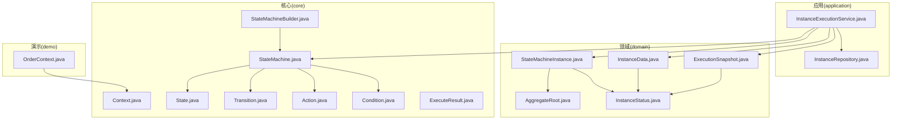
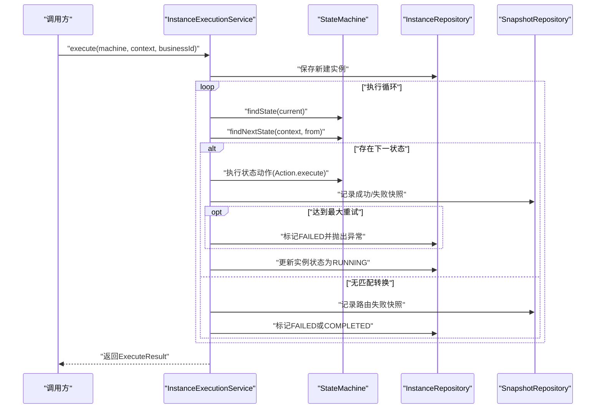
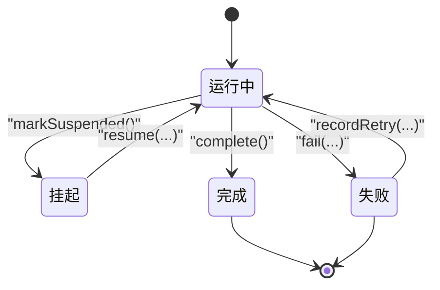
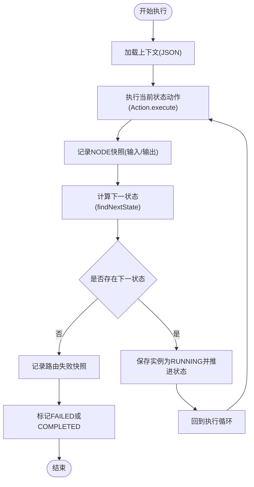
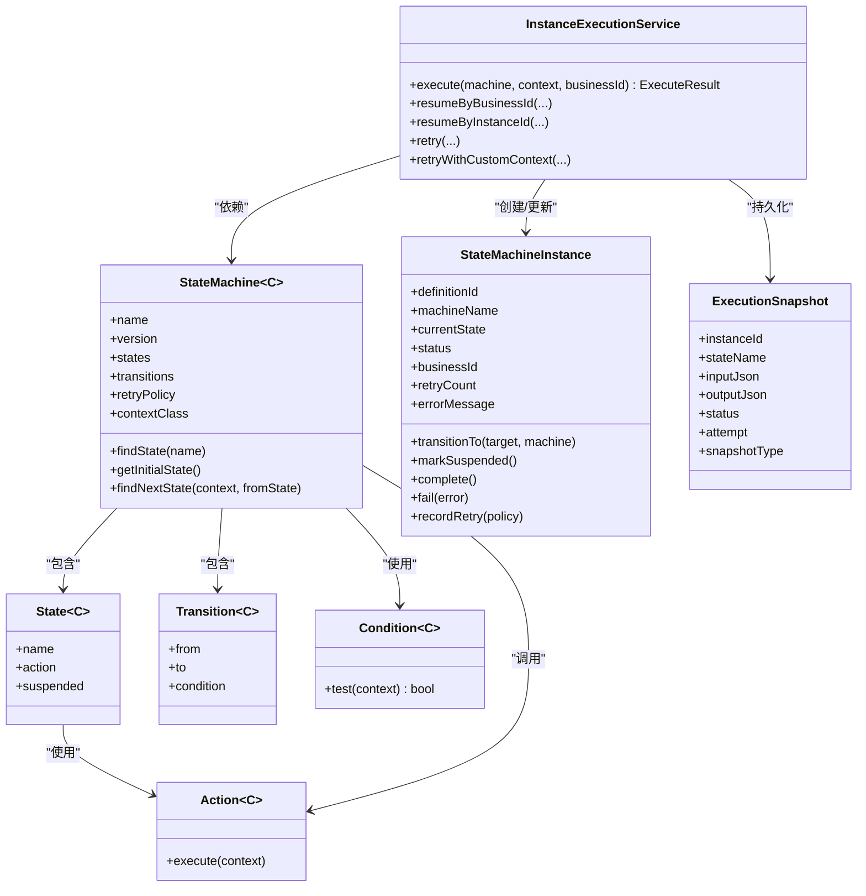

# 执行模型

<cite>
**本文引用的文件**
- [ExecuteResult.java](file://state-machine-boot-starter/src/main/java/cn/chedejun/statemachine/core/ExecuteResult.java)
- [StateMachine.java](file://state-machine-boot-starter/src/main/java/cn/chedejun/statemachine/domain/engine/StateMachine.java)
- [StateMachineInstance.java](file://state-machine-boot-starter/src/main/java/cn/chedejun/statemachine/domain/instance/StateMachineInstance.java)
- [Context.java](file://state-machine-boot-starter/src/main/java/cn/chedejun/statemachine/core/Context.java)
- [InstanceExecutionService.java](file://state-machine-boot-starter/src/main/java/cn/chedejun/statemachine/application/InstanceExecutionService.java)
- [State.java](file://state-machine-boot-starter/src/main/java/cn/chedejun/statemachine/core/State.java)
- [Transition.java](file://state-machine-boot-starter/src/main/java/cn/chedejun/statemachine/core/Transition.java)
- [InstanceStatus.java](file://state-machine-boot-starter/src/main/java/cn/chedejun/statemachine/domain/shared/InstanceStatus.java)
- [ExecutionSnapshot.java](file://state-machine-boot-starter/src/main/java/cn/chedejun/statemachine/domain/snapshot/ExecutionSnapshot.java)
- [StateMachineBuilder.java](file://state-machine-boot-starter/src/main/java/cn/chedejun/statemachine/core/StateMachineBuilder.java)
- [StateMachineInstanceTest.java](file://state-machine-boot-starter/src/test/java/cn/chedejun/statemachine/domain/instance/StateMachineInstanceTest.java)
- [OrderContext.java](file://state-machine-demo/src/main/java/cn/chedejun/demo/statemachine/OrderContext.java)
- [InstanceData.java](file://state-machine-boot-starter/src/main/java/cn/chedejun/statemachine/domain/data/InstanceData.java)
- [InstanceRepository.java](file://state-machine-boot-starter/src/main/java/cn/chedejun/statemachine/domain/repository/InstanceRepository.java)
- [Action.java](file://state-machine-boot-starter/src/main/java/cn/chedejun/statemachine/core/Action.java)
- [Condition.java](file://state-machine-boot-starter/src/main/java/cn/chedejun/statemachine/core/Condition.java)
- [StateMachineException.java](file://state-machine-boot-starter/src/main/java/cn/chedejun/statemachine/core/StateMachineException.java)
- [AggregateRoot.java](file://state-machine-boot-starter/src/main/java/cn/chedejun/statemachine/domain/shared/AggregateRoot.java)
</cite>

## 目录
1. [引言](#引言)
2. [项目结构](#项目结构)
3. [核心组件](#核心组件)
4. [架构总览](#架构总览)
5. [详细组件分析](#详细组件分析)
6. [依赖分析](#依赖分析)
7. [性能考虑](#性能考虑)
8. [故障排查指南](#故障排查指南)
9. [结论](#结论)
10. [附录](#附录)

## 引言
本文件面向开发者与架构师，系统性阐述状态机工作流引擎的“执行模型”。内容涵盖：
- 状态机执行机制与生命周期管理
- 执行结果（ExecuteResult）的设计与状态转换过程
- 状态机实例（StateMachineInstance）的创建、执行、暂停、恢复与完成
- 执行上下文（Context）在状态转换中的作用与传递机制
- 并发执行的安全性与一致性保障
- 从状态定义到实例执行的完整流程图与代码示例路径
- 最佳实践与常见问题排查

## 项目结构
该工程采用分层与领域驱动设计（DDD）结合的方式组织代码：
- core 层：状态、转换、动作、条件、构建器、执行结果、重试策略等通用模型
- domain 层：引擎（状态机）、实例、数据对象、快照、仓库接口、领域事件等
- application 层：应用服务（实例执行服务），编排状态机执行、持久化与恢复
- persistence 层：JDBC 仓库实现（定义、实例、快照）
- demo 层：演示上下文与控制器，展示如何使用

图表来源
- [StateMachine.java:19-76](file://state-machine-boot-starter/src/main/java/cn/chedejun/statemachine/domain/engine/StateMachine.java#L19-L76)
- [InstanceExecutionService.java:25-295](file://state-machine-boot-starter/src/main/java/cn/chedejun/statemachine/application/InstanceExecutionService.java#L25-L295)
- [StateMachineInstance.java:9-80](file://state-machine-boot-starter/src/main/java/cn/chedejun/statemachine/domain/instance/StateMachineInstance.java#L9-L80)
- [Context.java:6-23](file://state-machine-boot-starter/src/main/java/cn/chedejun/statemachine/core/Context.java#L6-L23)
- [ExecuteResult.java:16-57](file://state-machine-boot-starter/src/main/java/cn/chedejun/statemachine/core/ExecuteResult.java#L16-L57)
- [StateMachineBuilder.java:9-51](file://state-machine-boot-starter/src/main/java/cn/chedejun/statemachine/core/StateMachineBuilder.java#L9-L51)
- [OrderContext.java:10-98](file://state-machine-demo/src/main/java/cn/chedejun/demo/statemachine/OrderContext.java#L10-L98)

章节来源
- [StateMachine.java:19-76](file://state-machine-boot-starter/src/main/java/cn/chedejun/statemachine/domain/engine/StateMachine.java#L19-L76)
- [InstanceExecutionService.java:25-295](file://state-machine-boot-starter/src/main/java/cn/chedejun/statemachine/application/InstanceExecutionService.java#L25-L295)

## 核心组件
- 状态（State）：封装状态名称与动作；支持挂起标记
- 转换（Transition）：定义从状态到状态的路由条件
- 动作（Action）：执行业务逻辑，通过上下文写入结果
- 条件（Condition）：根据上下文判断是否允许转换
- 上下文（Context）：键值存储，支持序列化/反序列化
- 构建器（StateMachineBuilder）：声明式构建状态机定义
- 状态机（StateMachine）：不可变定义容器，提供路由决策
- 实例（StateMachineInstance）：运行时聚合根，维护状态、重试、错误信息
- 执行结果（ExecuteResult）：对外暴露的执行摘要
- 快照（ExecutionSnapshot）：记录节点执行与路由决策的不可变快照
- 应用服务（InstanceExecutionService）：编排执行、重试、恢复、持久化

章节来源
- [State.java:3-22](file://state-machine-boot-starter/src/main/java/cn/chedejun/statemachine/core/State.java#L3-L22)
- [Transition.java:3-19](file://state-machine-boot-starter/src/main/java/cn/chedejun/statemachine/core/Transition.java#L3-L19)
- [Action.java:8-11](file://state-machine-boot-starter/src/main/java/cn/chedejun/statemachine/core/Action.java#L8-L11)
- [Condition.java:3-6](file://state-machine-boot-starter/src/main/java/cn/chedejun/statemachine/core/Condition.java#L3-L6)
- [Context.java:6-23](file://state-machine-boot-starter/src/main/java/cn/chedejun/statemachine/core/Context.java#L6-L23)
- [StateMachineBuilder.java:9-51](file://state-machine-boot-starter/src/main/java/cn/chedejun/statemachine/core/StateMachineBuilder.java#L9-L51)
- [StateMachine.java:19-76](file://state-machine-boot-starter/src/main/java/cn/chedejun/statemachine/domain/engine/StateMachine.java#L19-L76)
- [StateMachineInstance.java:9-80](file://state-machine-boot-starter/src/main/java/cn/chedejun/statemachine/domain/instance/StateMachineInstance.java#L9-L80)
- [ExecuteResult.java:16-57](file://state-machine-boot-starter/src/main/java/cn/chedejun/statemachine/core/ExecuteResult.java#L16-L57)
- [ExecutionSnapshot.java:11-72](file://state-machine-boot-starter/src/main/java/cn/chedejun/statemachine/domain/snapshot/ExecutionSnapshot.java#L11-L72)
- [InstanceExecutionService.java:25-295](file://state-machine-boot-starter/src/main/java/cn/chedejun/statemachine/application/InstanceExecutionService.java#L25-L295)

## 架构总览
执行模型以“定义（StateMachine）+ 实例（StateMachineInstance）+ 应用服务（InstanceExecutionService）”为核心，配合“上下文（Context）+ 快照（ExecutionSnapshot）+ 仓库（InstanceRepository）”实现可观察、可恢复、可重试的状态机执行。

图表来源
- [InstanceExecutionService.java:43-193](file://state-machine-boot-starter/src/main/java/cn/chedejun/statemachine/application/InstanceExecutionService.java#L43-L193)
- [StateMachine.java:50-75](file://state-machine-boot-starter/src/main/java/cn/chedejun/statemachine/domain/engine/StateMachine.java#L50-L75)
- [ExecutionSnapshot.java:38-61](file://state-machine-boot-starter/src/main/java/cn/chedejun/statemachine/domain/snapshot/ExecutionSnapshot.java#L38-L61)

## 详细组件分析

### 执行结果（ExecuteResult）
- 设计目的：向业务系统提供简洁的执行摘要，包含实例ID、机器名、版本、当前状态、最终状态、错误信息、业务ID与创建时间
- 状态语义：
  - COMPLETED：流程自然结束，无后续状态
  - FAILED：执行失败，超过最大重试次数
  - SUSPENDED：流程在挂起点暂停，等待外部唤醒
- 适用场景：前端展示、监控告警、下游系统联动

章节来源
- [ExecuteResult.java:16-57](file://state-machine-boot-starter/src/main/java/cn/chedejun/statemachine/core/ExecuteResult.java#L16-L57)

### 状态机实例（StateMachineInstance）生命周期
- 创建：生成实例ID，设置初始状态为定义中的第一个状态，状态为 RUNNING，并发布“实例已启动”领域事件
- 运行中：
  - 转移：transitionTo 将当前状态切换为目标状态，校验目标状态存在于定义中且实例未处于终止态
  - 挂起：markSuspended 将状态置为 SUSPENDED，并发布“实例已挂起”事件
  - 完成：complete 将状态置为 COMPLETED，并发布“实例已完成”事件
  - 失败：fail 记录错误信息并置为 FAILED，发布“实例失败”事件
  - 重试：recordRetry 在 FAILED 时递增重试计数并回到 RUNNING；resetRetryCount 清零
- 终止态保护：一旦进入 COMPLETED 或 FAILED，禁止进一步变更

图表来源
- [StateMachineInstance.java:39-79](file://state-machine-boot-starter/src/main/java/cn/chedejun/statemachine/domain/instance/StateMachineInstance.java#L39-L79)
- [InstanceStatus.java:1-3](file://state-machine-boot-starter/src/main/java/cn/chedejun/statemachine/domain/shared/InstanceStatus.java#L1-L3)

章节来源
- [StateMachineInstance.java:9-80](file://state-machine-boot-starter/src/main/java/cn/chedejun/statemachine/domain/instance/StateMachineInstance.java#L9-L80)
- [AggregateRoot.java:7-28](file://state-machine-boot-starter/src/main/java/cn/chedejun/statemachine/domain/shared/AggregateRoot.java#L7-L28)
- [StateMachineInstanceTest.java:33-96](file://state-machine-boot-starter/src/test/java/cn/chedejun/statemachine/domain/instance/StateMachineInstanceTest.java#L33-L96)

### 执行上下文（Context）与传递机制
- 作用：作为状态动作与路由条件的共享载体，贯穿一次实例执行的全过程
- 传递链路：
  - 初始：调用方传入 Context 或自定义子类（如 OrderContext）
  - 执行：每个状态的动作通过 Context 读写数据，结果自动记录到快照
  - 恢复：从最近一次成功的 NODE 快照输出 JSON 反序列化得到上下文，再由调用方合并
- 序列化：通过 ObjectMapper 将上下文序列化为 JSON 存储，失败时记录空对象并告警

图表来源
- [InstanceExecutionService.java:158-193](file://state-machine-boot-starter/src/main/java/cn/chedejun/statemachine/application/InstanceExecutionService.java#L158-L193)
- [ExecutionSnapshot.java:38-61](file://state-machine-boot-starter/src/main/java/cn/chedejun/statemachine/domain/snapshot/ExecutionSnapshot.java#L38-L61)

章节来源
- [Context.java:6-23](file://state-machine-boot-starter/src/main/java/cn/chedejun/statemachine/core/Context.java#L6-L23)
- [OrderContext.java:10-98](file://state-machine-demo/src/main/java/cn/chedejun/demo/statemachine/OrderContext.java#L10-L98)
- [InstanceExecutionService.java:247-260](file://state-machine-boot-starter/src/main/java/cn/chedejun/statemachine/application/InstanceExecutionService.java#L247-L260)

### 状态转换与路由决策
- 路由规则：遍历定义中的转换，匹配“from=当前状态”且条件成立（或无条件），返回目标状态
- 无匹配处理：若存在出边但无匹配转换，记录路由失败快照并标记实例为 FAILED；若无出边则标记为 COMPLETED
- 挂起状态：若当前状态被标记为挂起，执行完动作后立即保存为 SUSPENDED 并停止推进

章节来源
- [StateMachine.java:63-75](file://state-machine-boot-starter/src/main/java/cn/chedejun/statemachine/domain/engine/StateMachine.java#L63-L75)
- [InstanceExecutionService.java:178-184](file://state-machine-boot-starter/src/main/java/cn/chedejun/statemachine/application/InstanceExecutionService.java#L178-L184)

### 执行服务（InstanceExecutionService）核心流程
- 执行入口：execute 创建实例、持久化、进入执行循环
- 执行循环：
  - 查找当前状态
  - 执行动作并记录快照
  - 若状态挂起，保存为 SUSPENDED 并返回
  - 计算下一状态并推进；若无下一状态，按规则标记 FAILED 或 COMPLETED
- 恢复与重试：
  - resumeByBusinessId/resumeByInstanceId：校验期望状态，合并上下文，CAS 原子恢复并继续执行
  - retry/retryWithCustomContext：从快照恢复上下文，重新执行或自定义上下文重试
- 并发控制：通过仓库提供的 CAS 操作（tryMarkRunningFromSuspended）确保并发恢复的一致性

章节来源
- [InstanceExecutionService.java:43-152](file://state-machine-boot-starter/src/main/java/cn/chedejun/statemachine/application/InstanceExecutionService.java#L43-L152)
- [InstanceExecutionService.java:158-237](file://state-machine-boot-starter/src/main/java/cn/chedejun/statemachine/application/InstanceExecutionService.java#L158-L237)
- [InstanceRepository.java:13-17](file://state-machine-boot-starter/src/main/java/cn/chedejun/statemachine/domain/repository/InstanceRepository.java#L13-L17)

### 数据模型与快照
- 实例数据（InstanceData）：不可变值对象，封装实例的标识、定义版本、当前状态、业务ID、状态、重试计数、错误信息与时间戳
- 快照（ExecutionSnapshot）：不可变聚合根，区分 NODE（节点执行）与 ROUTE（路由决策）两类快照，记录输入/输出、状态、错误、尝试次数与执行时间

章节来源
- [InstanceData.java:8-78](file://state-machine-boot-starter/src/main/java/cn/chedejun/statemachine/domain/data/InstanceData.java#L8-L78)
- [ExecutionSnapshot.java:11-72](file://state-machine-boot-starter/src/main/java/cn/chedejun/statemachine/domain/snapshot/ExecutionSnapshot.java#L11-L72)

### 并发安全与一致性
- 原子恢复：通过 tryMarkRunningFromSuspended（CAS）确保仅当实例处于 SUSPENDED 时才恢复为 RUNNING 并更新下一状态，避免竞态
- 乐观锁：实例更新均返回新值，避免脏写
- 重试幂等：动作通过上下文写入结果并记录快照，重试时基于快照恢复上下文，保证幂等性
- 事务边界：执行服务在单次执行循环内协调多个仓库操作，建议在上层事务中调用以保证一致性

章节来源
- [InstanceRepository.java:13-17](file://state-machine-boot-starter/src/main/java/cn/chedejun/statemachine/domain/repository/InstanceRepository.java#L13-L17)
- [InstanceExecutionService.java:139-142](file://state-machine-boot-starter/src/main/java/cn/chedejun/statemachine/application/InstanceExecutionService.java#L139-L142)

## 依赖分析
- StateMachine 对 State/Transition/Action/Condition/RetryPolicy 有组合依赖，负责路由决策
- InstanceExecutionService 依赖 StateMachine、InstanceRepository、SnapshotRepository、DefinitionRepository 与 ObjectMapper
- StateMachineInstance 继承 AggregateRoot，持有 InstanceStatus 与领域事件
- ExecutionSnapshot 与 InstanceData 分别承担“执行证据”和“实例视图”的职责

图表来源
- [StateMachine.java:19-76](file://state-machine-boot-starter/src/main/java/cn/chedejun/statemachine/domain/engine/StateMachine.java#L19-L76)
- [State.java:3-22](file://state-machine-boot-starter/src/main/java/cn/chedejun/statemachine/core/State.java#L3-L22)
- [Transition.java:3-19](file://state-machine-boot-starter/src/main/java/cn/chedejun/statemachine/core/Transition.java#L3-L19)
- [Action.java:8-11](file://state-machine-boot-starter/src/main/java/cn/chedejun/statemachine/core/Action.java#L8-L11)
- [Condition.java:3-6](file://state-machine-boot-starter/src/main/java/cn/chedejun/statemachine/core/Condition.java#L3-L6)
- [StateMachineInstance.java:9-80](file://state-machine-boot-starter/src/main/java/cn/chedejun/statemachine/domain/instance/StateMachineInstance.java#L9-L80)
- [InstanceExecutionService.java:25-295](file://state-machine-boot-starter/src/main/java/cn/chedejun/statemachine/application/InstanceExecutionService.java#L25-L295)
- [ExecutionSnapshot.java:11-72](file://state-machine-boot-starter/src/main/java/cn/chedejun/statemachine/domain/snapshot/ExecutionSnapshot.java#L11-L72)

## 性能考虑
- 循环上限：执行循环受状态数与最大重试次数限制，防止无限循环
- 快照粒度：NODE 快照记录输入/输出，便于审计与重放；ROUTE 快照记录路由决策，避免重复计算
- 序列化成本：上下文序列化/反序列化为 IO 密集点，建议控制上下文大小与复杂度
- 并发恢复：CAS 操作减少锁竞争，提升高并发下的吞吐
- 重试退避：指数退避策略降低瞬时故障对系统压力

## 故障排查指南
- 状态不存在：当状态机定义中找不到目标状态时，会标记实例为 FAILED 并抛出异常
- 无匹配转换：当存在出边但无满足条件的转换时，记录路由失败快照并标记 FAILED
- 终止态变更：实例处于 COMPLETED/FAILED 后再次变更会抛出异常
- 恢复状态不一致：resumeByBusinessId/resumeByInstanceId 会校验期望状态，不一致将抛出异常
- 重试次数超限：超过最大重试次数后标记 FAILED 并停止

章节来源
- [InstanceExecutionService.java:167-193](file://state-machine-boot-starter/src/main/java/cn/chedejun/statemachine/application/InstanceExecutionService.java#L167-L193)
- [InstanceExecutionService.java:268-275](file://state-machine-boot-starter/src/main/java/cn/chedejun/statemachine/application/InstanceExecutionService.java#L268-L275)
- [StateMachineInstance.java:76-79](file://state-machine-boot-starter/src/main/java/cn/chedejun/statemachine/domain/instance/StateMachineInstance.java#L76-L79)
- [StateMachineException.java:3-18](file://state-machine-boot-starter/src/main/java/cn/chedejun/statemachine/core/StateMachineException.java#L3-L18)

## 结论
该执行模型以“定义驱动、实例运行、快照审计、服务编排”为核心，提供了清晰的状态转换、完备的重试与恢复机制、以及强一致性的并发控制。通过上下文在执行全程的传递与持久化，实现了可观测、可恢复、可扩展的工作流执行能力。建议在生产环境中结合事务边界、监控告警与日志审计，确保稳定性与可运维性。

## 附录
- 代码示例路径（不展示具体代码内容）：
  - 定义状态机与状态动作：[StateMachineBuilder.java:28-47](file://state-machine-boot-starter/src/main/java/cn/chedejun/statemachine/core/StateMachineBuilder.java#L28-L47)
  - 自定义上下文（演示）：[OrderContext.java:10-98](file://state-machine-demo/src/main/java/cn/chedejun/demo/statemachine/OrderContext.java#L10-L98)
  - 执行入口与恢复/重试：[InstanceExecutionService.java:43-152](file://state-machine-boot-starter/src/main/java/cn/chedejun/statemachine/application/InstanceExecutionService.java#L43-L152)
  - 实例生命周期断言（测试）：[StateMachineInstanceTest.java:33-96](file://state-machine-boot-starter/src/test/java/cn/chedejun/statemachine/domain/instance/StateMachineInstanceTest.java#L33-L96)