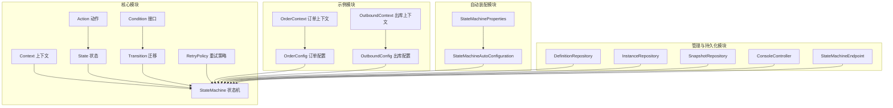
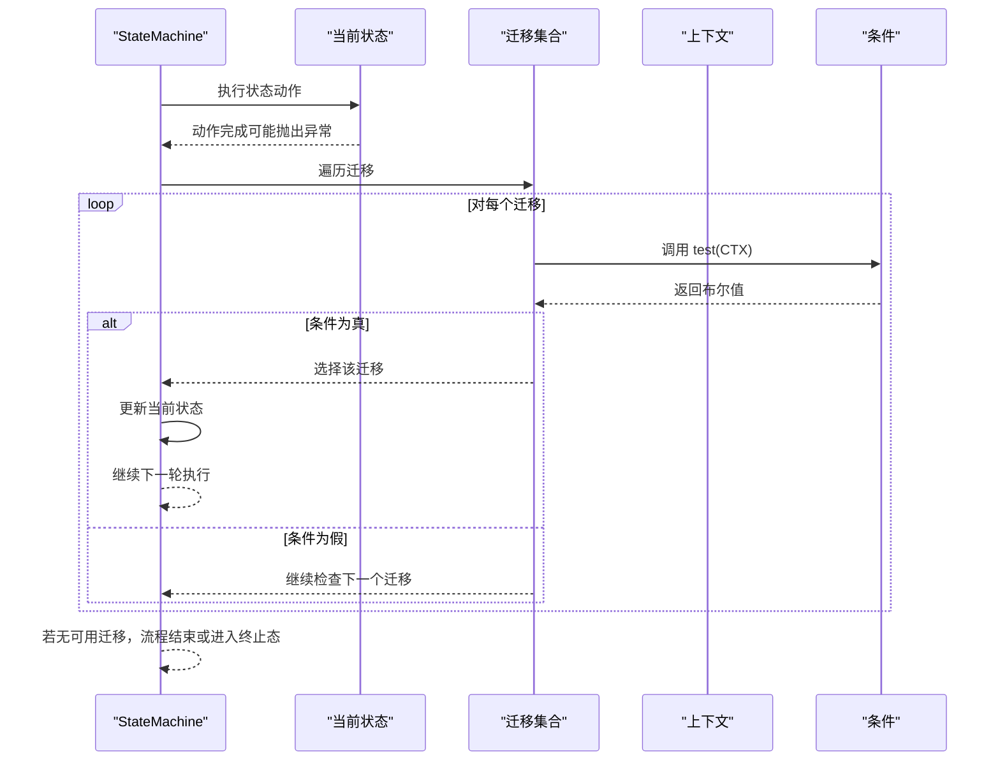
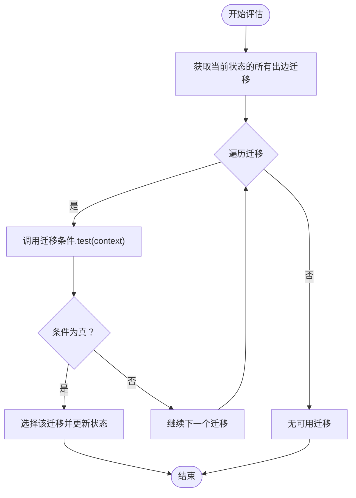
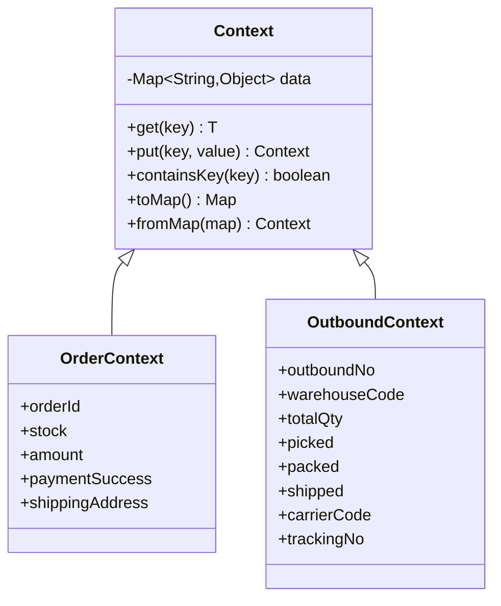
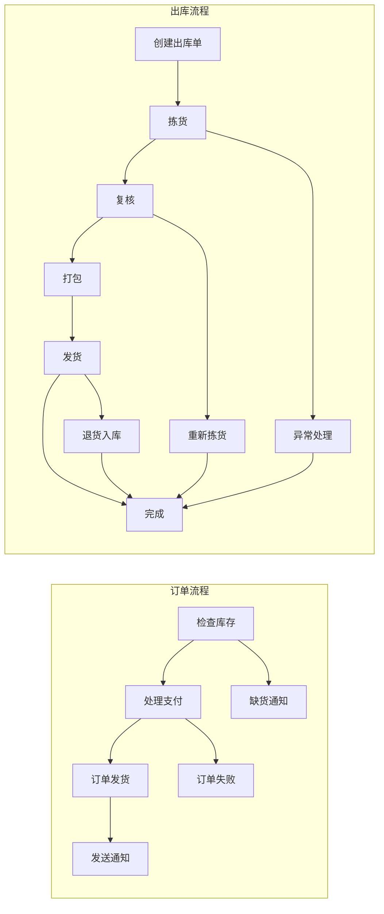
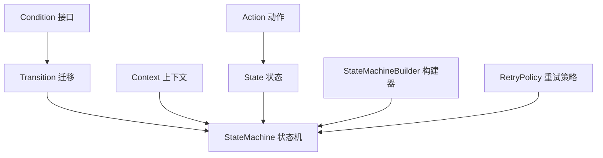

# 条件概念

<cite>
**本文引用的文件**
- [Condition.java](file://src/main/java/cn/chedejun/statemachine/core/Condition.java)
- [Context.java](file://src/main/java/cn/chedejun/statemachine/core/Context.java)
- [StateMachine.java](file://src/main/java/cn/chedejun/statemachine/core/StateMachine.java)
- [Transition.java](file://src/main/java/cn/chedejun/statemachine/core/Transition.java)
- [StateMachineBuilder.java](file://src/main/java/cn/chedejun/statemachine/core/StateMachineBuilder.java)
- [Action.java](file://src/main/java/cn/chedejun/statemachine/core/Action.java)
- [State.java](file://src/main/java/cn/chedejun/statemachine/core/State.java)
- [RetryPolicy.java](file://src/main/java/cn/chedejun/statemachine/core/RetryPolicy.java)
- [OrderConfig.java](file://demo/src/main/java/cn/chedejun/demo/config/OrderConfig.java)
- [OutboundConfig.java](file://demo/src/main/java/cn/chedejun/demo/config/OutboundConfig.java)
- [OrderContext.java](file://demo/src/main/java/cn/chedejun/demo/statemachine/OrderContext.java)
- [OutboundContext.java](file://demo/src/main/java/cn/chedejun/demo/statemachine/OutboundContext.java)
- [README.md](file://README.md)
</cite>

## 目录
1. [简介](#简介)
2. [项目结构](#项目结构)
3. [核心组件](#核心组件)
4. [架构总览](#架构总览)
5. [详细组件分析](#详细组件分析)
6. [依赖关系分析](#依赖关系分析)
7. [性能考虑](#性能考虑)
8. [故障排查指南](#故障排查指南)
9. [结论](#结论)
10. [附录](#附录)

## 简介
本节围绕状态机中的“条件”（Condition）概念展开，系统性阐述其定义、评估机制与实现方式；解释条件接口的设计、上下文参数与布尔返回值语义；说明条件表达式的编写规则、复杂条件的组合与优先级处理；并通过丰富的示例展示不同条件类型的实现与应用场景；最后给出条件设计的最佳实践与性能优化建议。

## 项目结构
该仓库采用分层+功能模块化的组织方式：
- 核心模块：定义状态机核心抽象与运行时（Condition、Context、State、Transition、StateMachine、Action、RetryPolicy 等）
- 示例模块：演示订单与出库两类典型业务流程的状态机配置与使用
- 自动装配模块：提供 Spring Boot Starter 的自动配置与属性绑定
- 管理与持久化模块：提供状态机定义与实例的持久化、快照与管理端点

图表来源
- [Condition.java:1-7](file://src/main/java/cn/chedejun/statemachine/core/Condition.java#L1-L7)
- [Context.java:1-24](file://src/main/java/cn/chedejun/statemachine/core/Context.java#L1-L24)
- [State.java:1-16](file://src/main/java/cn/chedejun/statemachine/core/State.java#L1-L16)
- [Transition.java:1-20](file://src/main/java/cn/chedejun/statemachine/core/Transition.java#L1-L20)
- [Action.java:1-12](file://src/main/java/cn/chedejun/statemachine/core/Action.java#L1-L12)
- [StateMachine.java:1-196](file://src/main/java/cn/chedejun/statemachine/core/StateMachine.java#L1-L196)
- [RetryPolicy.java:1-45](file://src/main/java/cn/chedejun/statemachine/core/RetryPolicy.java#L1-L45)
- [OrderConfig.java:1-85](file://demo/src/main/java/cn/chedejun/demo/config/OrderConfig.java#L1-L85)
- [OutboundConfig.java:1-121](file://demo/src/main/java/cn/chedejun/demo/config/OutboundConfig.java#L1-L121)
- [OrderContext.java:1-34](file://demo/src/main/java/cn/chedejun/demo/statemachine/OrderContext.java#L1-L34)
- [OutboundContext.java:1-43](file://demo/src/main/java/cn/chedejun/demo/statemachine/OutboundContext.java#L1-L43)

章节来源
- [README.md:1-65](file://README.md#L1-L65)

## 核心组件
- 条件接口（Condition）：函数式接口，接收上下文对象并返回布尔值，用于判断是否允许从某状态迁移到另一状态。
- 上下文（Context）：承载状态机执行过程中的共享数据，提供键值存取与映射转换能力。
- 状态（State）：封装状态名与对应动作（Action），动作在执行前会写入上下文，执行结果会被快照记录。
- 迁移（Transition）：定义从状态到状态的路径及可选条件，若未设置条件则默认允许迁移。
- 状态机（StateMachine）：驱动状态机执行，负责状态推进、快照记录、重试与终止条件判定。
- 构建器（StateMachineBuilder）：提供链式 API 构建状态机，支持注册上下文类型、添加状态与迁移、配置重试策略等。
- 重试策略（RetryPolicy）：指数退避策略，控制最大重试次数与延迟计算。

章节来源
- [Condition.java:1-7](file://src/main/java/cn/chedejun/statemachine/core/Condition.java#L1-L7)
- [Context.java:1-24](file://src/main/java/cn/chedejun/statemachine/core/Context.java#L1-L24)
- [State.java:1-16](file://src/main/java/cn/chedejun/statemachine/core/State.java#L1-L16)
- [Transition.java:1-20](file://src/main/java/cn/chedejun/statemachine/core/Transition.java#L1-L20)
- [StateMachine.java:1-196](file://src/main/java/cn/chedejun/statemachine/core/StateMachine.java#L1-L196)
- [StateMachineBuilder.java:1-53](file://src/main/java/cn/chedejun/statemachine/core/StateMachineBuilder.java#L1-L53)
- [RetryPolicy.java:1-45](file://src/main/java/cn/chedejun/statemachine/core/RetryPolicy.java#L1-L45)

## 架构总览
条件在状态机中的作用贯穿于状态推进与迁移决策。状态机在每个状态下执行动作后，会根据迁移列表按顺序评估条件，首个满足条件的迁移即被选择，从而决定下一个状态。

图表来源
- [StateMachine.java:142-149](file://src/main/java/cn/chedejun/statemachine/core/StateMachine.java#L142-L149)
- [Transition.java:1-20](file://src/main/java/cn/chedejun/statemachine/core/Transition.java#L1-L20)
- [Condition.java:1-7](file://src/main/java/cn/chedejun/statemachine/core/Condition.java#L1-L7)

## 详细组件分析

### 条件接口与评估机制
- 接口定义：Condition 为函数式接口，方法签名接受上下文并返回布尔值，用于表达“是否满足迁移条件”。
- 评估时机：在状态机执行循环中，当一个状态的动作完成后，遍历该状态的所有出边迁移，依次调用迁移上的条件进行评估。
- 默认行为：若迁移未设置条件，则视为总是允许（等价于返回 true）。
- 评估顺序：按迁移定义顺序进行评估，先满足者优先；因此迁移的声明顺序即为优先级顺序。
- 异常处理：条件评估本身不捕获异常；若条件逻辑抛出异常，将导致状态机执行中断并记录失败。

图表来源
- [StateMachine.java:142-149](file://src/main/java/cn/chedejun/statemachine/core/StateMachine.java#L142-L149)
- [Transition.java:1-20](file://src/main/java/cn/chedejun/statemachine/core/Transition.java#L1-L20)
- [Condition.java:1-7](file://src/main/java/cn/chedejun/statemachine/core/Condition.java#L1-L7)

章节来源
- [Condition.java:1-7](file://src/main/java/cn/chedejun/statemachine/core/Condition.java#L1-L7)
- [Transition.java:1-20](file://src/main/java/cn/chedejun/statemachine/core/Transition.java#L1-L20)
- [StateMachine.java:142-149](file://src/main/java/cn/chedejun/statemachine/core/StateMachine.java#L142-L149)

### 上下文参数与数据模型
- Context 提供通用键值存储，支持泛型读取、写入、存在性检查与映射转换。
- 在示例中，OrderContext 与 OutboundContext 扩展了 Context，以强类型字段表达业务上下文，便于条件逻辑直接读取业务状态。
- 条件函数通常通过上下文读取字段值，如库存数量、支付状态、拣货/打包/发货标记等，从而实现业务分支。

图表来源
- [Context.java:1-24](file://src/main/java/cn/chedejun/statemachine/core/Context.java#L1-L24)
- [OrderContext.java:1-34](file://demo/src/main/java/cn/chedejun/demo/statemachine/OrderContext.java#L1-L34)
- [OutboundContext.java:1-43](file://demo/src/main/java/cn/chedejun/demo/statemachine/OutboundContext.java#L1-L43)

章节来源
- [Context.java:1-24](file://src/main/java/cn/chedejun/statemachine/core/Context.java#L1-L24)
- [OrderContext.java:1-34](file://demo/src/main/java/cn/chedejun/demo/statemachine/OrderContext.java#L1-L34)
- [OutboundContext.java:1-43](file://demo/src/main/java/cn/chedejun/demo/statemachine/OutboundContext.java#L1-L43)

### 条件表达式编写规则
- 形式：Lambda 表达式或方法引用，形如 `(ctx) -> ctx.getXXX() op constant`。
- 可用操作：比较运算符（>, >=, <, <=, ==, !=）、逻辑运算符（&&, ||, !）、三元表达式等。
- 上下文访问：通过强类型上下文类提供的 getter 方法读取业务字段。
- 常见模式：
  - 数值比较：库存大于零、金额满足阈值
  - 布尔标志：已拣货、已打包、已发货
  - 组合条件：多字段联合判断（如库存充足且地址有效）

章节来源
- [OrderConfig.java:29-46](file://demo/src/main/java/cn/chedejun/demo/config/OrderConfig.java#L29-L46)
- [OutboundConfig.java:35-57](file://demo/src/main/java/cn/chedejun/demo/config/OutboundConfig.java#L35-L57)

### 复杂条件的组合与优先级处理
- 组合方式：通过逻辑运算符将多个简单条件组合为复合条件；也可将复杂条件抽取为独立方法以提升可读性。
- 优先级：迁移声明顺序即优先级顺序；先满足者优先。因此应将更具体的条件放在前面，通用条件（如恒真）放在末尾。
- 最佳实践：
  - 将“兜底”或“默认”条件置于最后，避免提前阻断后续分支。
  - 使用清晰的命名与注释，明确每条迁移的业务意图。
  - 对于互斥分支，确保条件覆盖完备，避免遗漏。

章节来源
- [StateMachineBuilder.java:29-32](file://src/main/java/cn/chedejun/statemachine/core/StateMachineBuilder.java#L29-L32)
- [OrderConfig.java:29-46](file://demo/src/main/java/cn/chedejun/demo/config/OrderConfig.java#L29-L46)
- [OutboundConfig.java:35-57](file://demo/src/main/java/cn/chedejun/demo/config/OutboundConfig.java#L35-L57)

### 条件在状态机中的应用示例
- 订单流程（OrderConfig）：
  - 库存充足 → 支付；库存不足 → 缺货通知
  - 支付成功 → 发货；支付失败 → 失败
  - 发货 → 通知
- 出库流程（OutboundConfig）：
  - 拣货成功 → 复核；拣货失败 → 异常处理
  - 复核通过 → 打包；复核不通过 → 重新拣货
  - 打包 → 发货；发货成功 → 完成；发货失败 → 退货入库

图表来源
- [OrderConfig.java:18-46](file://demo/src/main/java/cn/chedejun/demo/config/OrderConfig.java#L18-L46)
- [OutboundConfig.java:21-57](file://demo/src/main/java/cn/chedejun/demo/config/OutboundConfig.java#L21-L57)

章节来源
- [OrderConfig.java:18-46](file://demo/src/main/java/cn/chedejun/demo/config/OrderConfig.java#L18-L46)
- [OutboundConfig.java:21-57](file://demo/src/main/java/cn/chedejun/demo/config/OutboundConfig.java#L21-L57)

### 条件设计最佳实践
- 明确性：条件应直接反映业务规则，避免过度复杂的嵌套，必要时拆分为多个迁移或提取为辅助方法。
- 可测试性：将条件逻辑尽量保持纯函数特性，便于单元测试覆盖。
- 可维护性：为每条迁移添加注释说明业务背景与前置条件；统一命名风格，保持一致性。
- 性能：避免在条件中执行昂贵操作（如网络请求、数据库查询）；如需外部数据，应在状态动作中预加载到上下文中。
- 可观测性：在状态动作中记录关键上下文信息，便于调试与审计。

章节来源
- [Action.java:1-12](file://src/main/java/cn/chedejun/statemachine/core/Action.java#L1-L12)
- [Context.java:1-24](file://src/main/java/cn/chedejun/statemachine/core/Context.java#L1-L24)

## 依赖关系分析
- Condition 与 Transition：Transition 持有条件引用；StateMachine 在推进时调用 Transition 的条件进行评估。
- Context 与 StateMachine：StateMachine 在执行前后序列化/反序列化上下文，保证状态间数据传递与快照记录。
- StateMachineBuilder：负责构建状态机，设置上下文类型、迁移与重试策略，最终生成可执行的状态机实例。
- RetryPolicy：影响状态机的失败重试行为，与条件共同决定流程的鲁棒性。

图表来源
- [Condition.java:1-7](file://src/main/java/cn/chedejun/statemachine/core/Condition.java#L1-L7)
- [Transition.java:1-20](file://src/main/java/cn/chedejun/statemachine/core/Transition.java#L1-L20)
- [StateMachine.java:1-196](file://src/main/java/cn/chedejun/statemachine/core/StateMachine.java#L1-L196)
- [State.java:1-16](file://src/main/java/cn/chedejun/statemachine/core/State.java#L1-L16)
- [StateMachineBuilder.java:1-53](file://src/main/java/cn/chedejun/statemachine/core/StateMachineBuilder.java#L1-L53)
- [RetryPolicy.java:1-45](file://src/main/java/cn/chedejun/statemachine/core/RetryPolicy.java#L1-L45)

章节来源
- [StateMachine.java:1-196](file://src/main/java/cn/chedejun/statemachine/core/StateMachine.java#L1-L196)
- [StateMachineBuilder.java:1-53](file://src/main/java/cn/chedejun/statemachine/core/StateMachineBuilder.java#L1-L53)

## 性能考虑
- 条件评估成本：避免在条件中执行 IO 或高复杂度计算；将外部依赖的数据在状态动作阶段准备好。
- 迁移数量与顺序：过多的迁移会增加评估开销；合理排序，将高频分支前置，减少不必要的条件判断。
- 快照与序列化：状态机在执行前后会序列化上下文，频繁的大型对象序列化会影响性能；建议仅保存必要的上下文字段。
- 重试策略：指数退避会增加等待时间，应结合业务 SLA 设置合理的最大尝试次数与最大延迟。

章节来源
- [StateMachine.java:151-160](file://src/main/java/cn/chedejun/statemachine/core/StateMachine.java#L151-L160)
- [RetryPolicy.java:26-30](file://src/main/java/cn/chedejun/statemachine/core/RetryPolicy.java#L26-L30)

## 故障排查指南
- 条件未生效：
  - 检查迁移是否正确设置条件；若未设置，默认为恒真。
  - 确认迁移声明顺序是否符合预期优先级。
- 上下文数据缺失：
  - 确保在状态动作中正确写入上下文；可通过日志或断点验证。
  - 检查序列化/反序列化是否正常，避免丢失关键字段。
- 执行中断：
  - 条件或动作抛出异常会导致状态机失败；查看快照记录定位具体失败点。
- 重试无效：
  - 检查重试策略配置与实例状态；确认实例处于失败状态才允许重试。

章节来源
- [StateMachine.java:97-116](file://src/main/java/cn/chedejun/statemachine/core/StateMachine.java#L97-L116)
- [StateMachine.java:64-79](file://src/main/java/cn/chedejun/statemachine/core/StateMachine.java#L64-L79)

## 结论
条件是状态机实现业务分支与动态路由的关键机制。通过简洁的函数式接口与强类型的上下文模型，开发者可以以声明式的方式表达复杂的业务规则。遵循优先级排序、可测试性与性能优化原则，能够显著提升状态机的可维护性与稳定性。结合示例配置与最佳实践，可以在实际项目中高效地构建可靠的流程编排系统。

## 附录
- 快速上手参考：参见项目自述文件中的示例配置与执行步骤。
- 示例配置：
  - 订单流程：在配置类中定义状态与迁移，并在迁移上设置条件。
  - 出库流程：同样通过配置类定义状态与迁移，体现异常分支与回退路径。

章节来源
- [README.md:17-49](file://README.md#L17-L49)
- [OrderConfig.java:18-46](file://demo/src/main/java/cn/chedejun/demo/config/OrderConfig.java#L18-L46)
- [OutboundConfig.java:21-57](file://demo/src/main/java/cn/chedejun/demo/config/OutboundConfig.java#L21-L57)