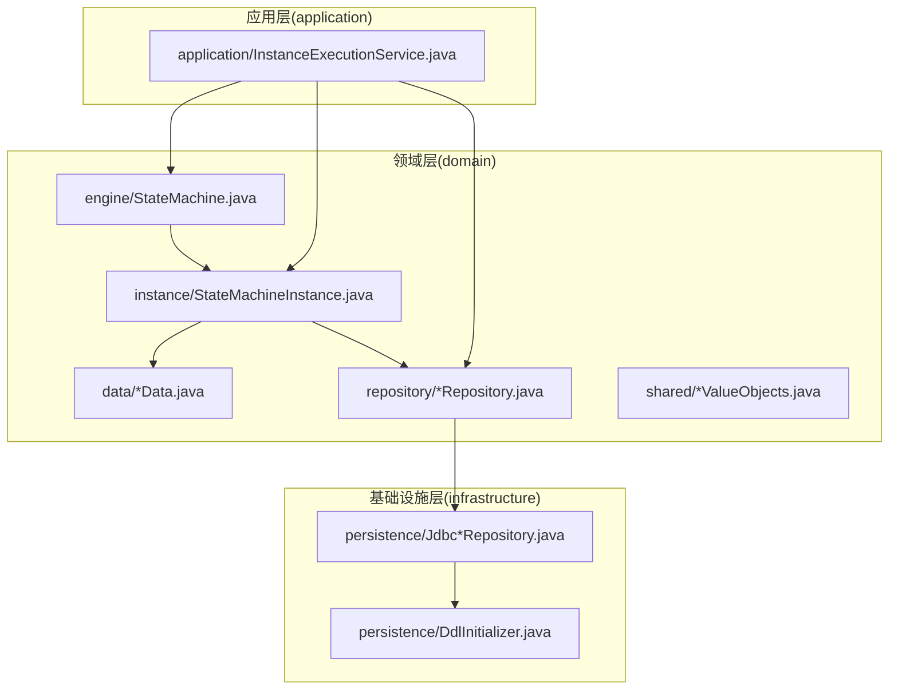
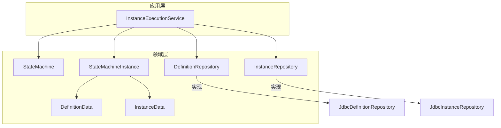
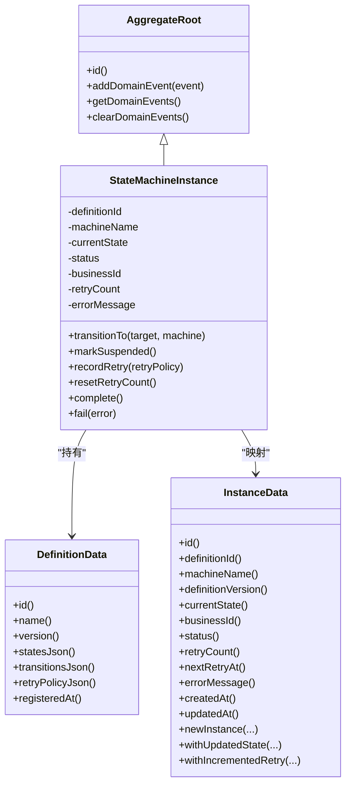
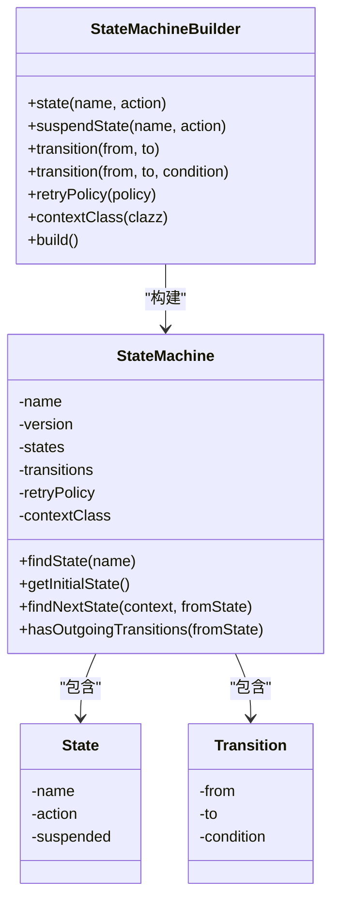
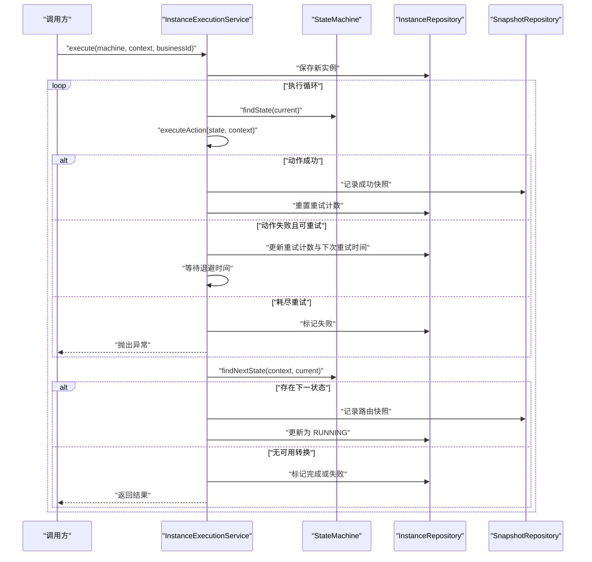
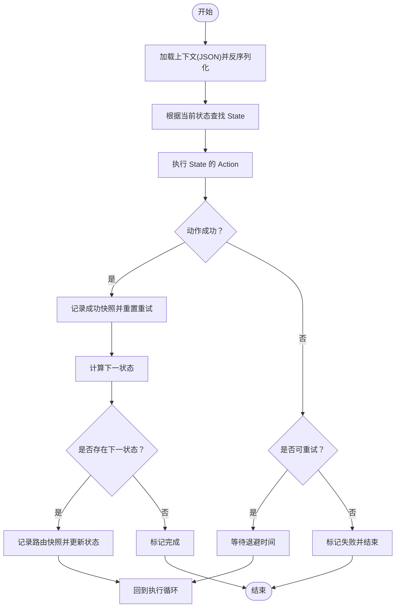
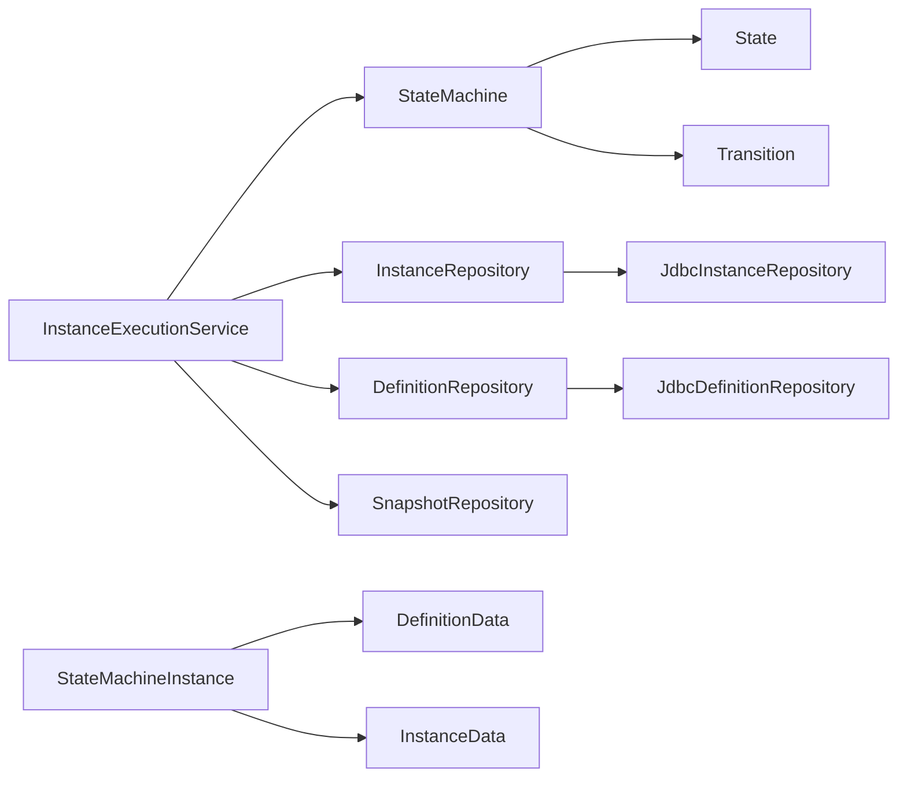

# 核心概念

<cite>
**本文引用的文件**
- [README.md](file://README.md)
- [state-machine-boot-starter/README.md](file://state-machine-boot-starter/README.md)
- [StateMachine.java](file://state-machine-boot-starter/src/main/java/cn/chedejun/statemachine/domain/engine/StateMachine.java)
- [StateMachineBuilder.java](file://state-machine-boot-starter/src/main/java/cn/chedejun/statemachine/core/StateMachineBuilder.java)
- [State.java](file://state-machine-boot-starter/src/main/java/cn/chedejun/statemachine/core/State.java)
- [Transition.java](file://state-machine-boot-starter/src/main/java/cn/chedejun/statemachine/core/Transition.java)
- [AggregateRoot.java](file://state-machine-boot-starter/src/main/java/cn/chedejun/statemachine/domain/shared/AggregateRoot.java)
- [StateMachineInstance.java](file://state-machine-boot-starter/src/main/java/cn/chedejun/statemachine/domain/instance/StateMachineInstance.java)
- [DefinitionData.java](file://state-machine-boot-starter/src/main/java/cn/chedejun/statemachine/domain/data/DefinitionData.java)
- [InstanceData.java](file://state-machine-boot-starter/src/main/java/cn/chedejun/statemachine/domain/data/InstanceData.java)
- [DefinitionRepository.java](file://state-machine-boot-starter/src/main/java/cn/chedejun/statemachine/domain/repository/DefinitionRepository.java)
- [InstanceRepository.java](file://state-machine-boot-starter/src/main/java/cn/chedejun/statemachine/domain/repository/InstanceRepository.java)
- [InstanceExecutionService.java](file://state-machine-boot-starter/src/main/java/cn/chedejun/statemachine/application/InstanceExecutionService.java)
</cite>

## 目录
1. [引言](#引言)
2. [项目结构](#项目结构)
3. [核心组件](#核心组件)
4. [架构总览](#架构总览)
5. [详细组件分析](#详细组件分析)
6. [依赖关系分析](#依赖关系分析)
7. [性能考量](#性能考量)
8. [故障排查指南](#故障排查指南)
9. [结论](#结论)
10. [附录](#附录)

## 引言
本文件面向两类读者：初学者与有经验的开发者。对于初学者，我们将以通俗语言解释状态机的核心概念（状态、转换、条件、上下文），以及领域驱动设计（DDD）在本项目中的分层实践（领域层、应用层、基础设施层）。对于有经验的开发者，我们将给出代码级的类图、序列图与流程图，帮助快速把握聚合根、不可变领域对象、仓储接口、执行服务等关键构件。

## 项目结构
该项目采用多模块结构，核心能力集中在 state-machine-boot-starter 模块中，提供 Spring Boot 启动器、自动配置、核心 API、领域模型、应用服务与持久化实现。state-machine-demo 提供示例用法与演示界面。

- 分层组织方式
  - domain（领域层）：包含领域模型、值对象、事件、数据载体与仓库接口
  - application（应用层）：编排执行、事务边界内的业务流程
  - infrastructure（基础设施层）：数据库访问实现、DDL 初始化、Spring 自动装配
  - interfaces（接口层）：对外暴露的门面与管理端点
  - persistence（持久化层）：SQL 初始化脚本与初始化器

- 关键路径
  - 领域模型：domain/engine、domain/instance、domain/data、domain/shared、domain/event、domain/repository
  - 应用服务：application/InstanceExecutionService.java
  - 核心 API：core/StateMachineBuilder.java、core/StateMachine.java、core/State.java、core/Transition.java
  - 示例与启动器：state-machine-boot-starter/README.md、demo 示例

**章节来源**
- [state-machine-boot-starter/README.md:1-65](file://state-machine-boot-starter/README.md#L1-L65)

## 核心组件
本节从 DDD 角度梳理核心构件及其职责：

- 不可变领域对象（领域层）
  - StateMachine：承载状态集合、转换集合、重试策略与上下文类型，构造时进行参数校验，提供查询与路由能力
  - State：状态节点，封装名称与动作
  - Transition：转换边，封装起点、终点与条件
  - DefinitionData、InstanceData：不可变数据载体，用于持久化与跨层传输
  - AggregateRoot：聚合根基类，统一维护领域事件
  - StateMachineInstance：聚合根，维护实例生命周期状态、重试次数与错误信息，并发布领域事件

- 应用服务（应用层）
  - InstanceExecutionService：负责实例执行主循环、动作执行与重试、路由决策、快照记录与状态更新；提供执行、恢复、重试等入口

- 仓储接口（领域层）
  - DefinitionRepository、InstanceRepository：定义对定义与实例的读写与查询契约

- 构建器与注册表（核心 API）
  - StateMachineBuilder：DSL 式构建状态机，设置状态、转换、重试策略、上下文类型与外部依赖

**章节来源**
- [StateMachine.java:15-77](file://state-machine-boot-starter/src/main/java/cn/chedejun/statemachine/domain/engine/StateMachine.java#L15-L77)
- [State.java:1-23](file://state-machine-boot-starter/src/main/java/cn/chedejun/statemachine/core/State.java#L1-L23)
- [Transition.java:1-20](file://state-machine-boot-starter/src/main/java/cn/chedejun/statemachine/core/Transition.java#L1-L20)
- [DefinitionData.java:8-46](file://state-machine-boot-starter/src/main/java/cn/chedejun/statemachine/domain/data/DefinitionData.java#L8-L46)
- [InstanceData.java:8-79](file://state-machine-boot-starter/src/main/java/cn/chedejun/statemachine/domain/data/InstanceData.java#L8-L79)
- [AggregateRoot.java:7-29](file://state-machine-boot-starter/src/main/java/cn/chedejun/statemachine/domain/shared/AggregateRoot.java#L7-L29)
- [StateMachineInstance.java:9-81](file://state-machine-boot-starter/src/main/java/cn/chedejun/statemachine/domain/instance/StateMachineInstance.java#L9-L81)
- [DefinitionRepository.java:9-16](file://state-machine-boot-starter/src/main/java/cn/chedejun/statemachine/domain/repository/DefinitionRepository.java#L9-L16)
- [InstanceRepository.java:9-26](file://state-machine-boot-starter/src/main/java/cn/chedejun/statemachine/domain/repository/InstanceRepository.java#L9-L26)
- [StateMachineBuilder.java:9-52](file://state-machine-boot-starter/src/main/java/cn/chedejun/statemachine/core/StateMachineBuilder.java#L9-L52)
- [InstanceExecutionService.java:24-296](file://state-machine-boot-starter/src/main/java/cn/chedejun/statemachine/application/InstanceExecutionService.java#L24-L296)

## 架构总览
下图展示 DDD 分层与关键交互：应用服务协调领域对象与仓储，通过不可变数据在各层之间传递；执行服务在应用层内完成状态机执行主循环与重试策略。

**图示来源**
- [InstanceExecutionService.java:24-296](file://state-machine-boot-starter/src/main/java/cn/chedejun/statemachine/application/InstanceExecutionService.java#L24-L296)
- [StateMachine.java:15-77](file://state-machine-boot-starter/src/main/java/cn/chedejun/statemachine/domain/engine/StateMachine.java#L15-L77)
- [StateMachineInstance.java:9-81](file://state-machine-boot-starter/src/main/java/cn/chedejun/statemachine/domain/instance/StateMachineInstance.java#L9-L81)
- [DefinitionRepository.java:9-16](file://state-machine-boot-starter/src/main/java/cn/chedejun/statemachine/domain/repository/DefinitionRepository.java#L9-L16)
- [InstanceRepository.java:9-26](file://state-machine-boot-starter/src/main/java/cn/chedejun/statemachine/domain/repository/InstanceRepository.java#L9-L26)

## 详细组件分析

### 不可变领域对象与聚合根
- 不可变领域对象
  - StateMachine：构造时校验状态与转换非空，提供只读视图与查询方法（如初始状态、下一状态查找）
  - DefinitionData、InstanceData：使用 final 字段与复制式更新方法（withXxx），保证线程安全与可追溯性
- 聚合根
  - AggregateRoot：统一维护领域事件列表，提供清空与只读访问
  - StateMachineInstance：继承聚合根，封装实例状态机生命周期，维护当前状态、重试计数、错误信息，并在关键状态变更时发布领域事件

**图示来源**
- [AggregateRoot.java:7-29](file://state-machine-boot-starter/src/main/java/cn/chedejun/statemachine/domain/shared/AggregateRoot.java#L7-L29)
- [StateMachineInstance.java:9-81](file://state-machine-boot-starter/src/main/java/cn/chedejun/statemachine/domain/instance/StateMachineInstance.java#L9-L81)
- [DefinitionData.java:8-46](file://state-machine-boot-starter/src/main/java/cn/chedejun/statemachine/domain/data/DefinitionData.java#L8-L46)
- [InstanceData.java:8-79](file://state-machine-boot-starter/src/main/java/cn/chedejun/statemachine/domain/data/InstanceData.java#L8-L79)

**章节来源**
- [AggregateRoot.java:7-29](file://state-machine-boot-starter/src/main/java/cn/chedejun/statemachine/domain/shared/AggregateRoot.java#L7-L29)
- [StateMachineInstance.java:9-81](file://state-machine-boot-starter/src/main/java/cn/chedejun/statemachine/domain/instance/StateMachineInstance.java#L9-L81)
- [DefinitionData.java:8-46](file://state-machine-boot-starter/src/main/java/cn/chedejun/statemachine/domain/data/DefinitionData.java#L8-L46)
- [InstanceData.java:8-79](file://state-machine-boot-starter/src/main/java/cn/chedejun/statemachine/domain/data/InstanceData.java#L8-L79)

### 状态机 DSL 与构建
- StateMachineBuilder：提供链式 API 定义状态、转换、重试策略与上下文类型；最终生成不可变的 StateMachine
- State：封装状态名与动作
- Transition：封装 from/to 与条件

**图示来源**
- [StateMachineBuilder.java:9-52](file://state-machine-boot-starter/src/main/java/cn/chedejun/statemachine/core/StateMachineBuilder.java#L9-L52)
- [StateMachine.java:19-77](file://state-machine-boot-starter/src/main/java/cn/chedejun/statemachine/domain/engine/StateMachine.java#L19-L77)
- [State.java:3-23](file://state-machine-boot-starter/src/main/java/cn/chedejun/statemachine/core/State.java#L3-L23)
- [Transition.java:3-20](file://state-machine-boot-starter/src/main/java/cn/chedejun/statemachine/core/Transition.java#L3-L20)

**章节来源**
- [StateMachineBuilder.java:9-52](file://state-machine-boot-starter/src/main/java/cn/chedejun/statemachine/core/StateMachineBuilder.java#L9-L52)
- [StateMachine.java:19-77](file://state-machine-boot-starter/src/main/java/cn/chedejun/statemachine/domain/engine/StateMachine.java#L19-L77)
- [State.java:3-23](file://state-machine-boot-starter/src/main/java/cn/chedejun/statemachine/core/State.java#L3-L23)
- [Transition.java:3-20](file://state-machine-boot-starter/src/main/java/cn/chedejun/statemachine/core/Transition.java#L3-L20)

### 执行主循环与重试策略
- 主循环：根据当前状态执行动作，记录成功/失败快照，决定是否挂起或进入下一状态；若无可用转换则完成或失败
- 重试策略：基于指数退避的重试上限；每次重试前持久化更新下次重试时间，睡眠后继续
- 恢复与重试：从快照回放上下文，CAS 原子恢复状态并继续执行

**图示来源**
- [InstanceExecutionService.java:43-193](file://state-machine-boot-starter/src/main/java/cn/chedejun/statemachine/application/InstanceExecutionService.java#L43-L193)
- [StateMachine.java:63-71](file://state-machine-boot-starter/src/main/java/cn/chedejun/statemachine/domain/engine/StateMachine.java#L63-L71)

**章节来源**
- [InstanceExecutionService.java:43-296](file://state-machine-boot-starter/src/main/java/cn/chedejun/statemachine/application/InstanceExecutionService.java#L43-L296)
- [StateMachine.java:63-71](file://state-machine-boot-starter/src/main/java/cn/chedejun/statemachine/domain/engine/StateMachine.java#L63-L71)

### 条件与上下文
- 条件（Condition）：在转换中作为谓词使用，决定是否允许从某状态转移到另一状态
- 上下文（Context）：携带执行所需的数据，支持序列化/反序列化以便持久化与重试
- 状态（State）：封装动作（Action），在执行时被调用

**图示来源**
- [InstanceExecutionService.java:158-237](file://state-machine-boot-starter/src/main/java/cn/chedejun/statemachine/application/InstanceExecutionService.java#L158-L237)
- [StateMachine.java:63-71](file://state-machine-boot-starter/src/main/java/cn/chedejun/statemachine/domain/engine/StateMachine.java#L63-L71)

**章节来源**
- [InstanceExecutionService.java:158-237](file://state-machine-boot-starter/src/main/java/cn/chedejun/statemachine/application/InstanceExecutionService.java#L158-L237)
- [StateMachine.java:63-71](file://state-machine-boot-starter/src/main/java/cn/chedejun/statemachine/domain/engine/StateMachine.java#L63-L71)

## 依赖关系分析
- 聚合根与数据载体
  - StateMachineInstance 依赖 DefinitionData 与 InstanceData 进行持久化与状态映射
- 应用服务依赖
  - InstanceExecutionService 依赖 StateMachine、InstanceRepository、SnapshotRepository、DefinitionRepository 与 ObjectMapper
- 仓储接口
  - DefinitionRepository、InstanceRepository 定义了对定义与实例的读写与查询契约，具体实现位于基础设施层

**图示来源**
- [InstanceExecutionService.java:35-41](file://state-machine-boot-starter/src/main/java/cn/chedejun/statemachine/application/InstanceExecutionService.java#L35-L41)
- [DefinitionRepository.java:9-16](file://state-machine-boot-starter/src/main/java/cn/chedejun/statemachine/domain/repository/DefinitionRepository.java#L9-L16)
- [InstanceRepository.java:9-26](file://state-machine-boot-starter/src/main/java/cn/chedejun/statemachine/domain/repository/InstanceRepository.java#L9-L26)
- [StateMachine.java:23-26](file://state-machine-boot-starter/src/main/java/cn/chedejun/statemachine/domain/engine/StateMachine.java#L23-L26)
- [StateMachineInstance.java:9-28](file://state-machine-boot-starter/src/main/java/cn/chedejun/statemachine/domain/instance/StateMachineInstance.java#L9-L28)

**章节来源**
- [InstanceExecutionService.java:35-41](file://state-machine-boot-starter/src/main/java/cn/chedejun/statemachine/application/InstanceExecutionService.java#L35-L41)
- [DefinitionRepository.java:9-16](file://state-machine-boot-starter/src/main/java/cn/chedejun/statemachine/domain/repository/DefinitionRepository.java#L9-L16)
- [InstanceRepository.java:9-26](file://state-machine-boot-starter/src/main/java/cn/chedejun/statemachine/domain/repository/InstanceRepository.java#L9-L26)
- [StateMachine.java:23-26](file://state-machine-boot-starter/src/main/java/cn/chedejun/statemachine/domain/engine/StateMachine.java#L23-L26)
- [StateMachineInstance.java:9-28](file://state-machine-boot-starter/src/main/java/cn/chedejun/statemachine/domain/instance/StateMachineInstance.java#L9-L28)

## 性能考量
- 执行循环上限：通过状态数与最大重试次数估算最大迭代次数，防止无限循环
- 快照与序列化：动作输入/输出 JSON 序列化与快照存储，注意上下文大小与序列化开销
- 重试退避：指数退避减少瞬时压力，但需关注 CPU 与 IO 抖动
- 原子更新：恢复时使用 CAS 原子更新实例状态，避免并发竞争导致的状态错乱

**章节来源**
- [InstanceExecutionService.java:161-161](file://state-machine-boot-starter/src/main/java/cn/chedejun/statemachine/application/InstanceExecutionService.java#L161-L161)
- [InstanceExecutionService.java:139-142](file://state-machine-boot-starter/src/main/java/cn/chedejun/statemachine/application/InstanceExecutionService.java#L139-L142)

## 故障排查指南
- 状态不存在：当状态机无法找到当前状态时，会标记失败并抛出异常
- 无可用转换：当从某状态出发无匹配转换时，记录路由失败并标记实例失败
- 非悬挂状态恢复：恢复前必须确保实例处于悬挂状态，否则抛出异常
- 非法重试：仅失败实例可重试，且不超过最大重试次数
- 反序列化失败：上下文反序列化失败会抛出异常，检查 JSON 结构与上下文类型

**章节来源**
- [InstanceExecutionService.java:167-170](file://state-machine-boot-starter/src/main/java/cn/chedejun/statemachine/application/InstanceExecutionService.java#L167-L170)
- [InstanceExecutionService.java:180-184](file://state-machine-boot-starter/src/main/java/cn/chedejun/statemachine/application/InstanceExecutionService.java#L180-L184)
- [InstanceExecutionService.java:121-124](file://state-machine-boot-starter/src/main/java/cn/chedejun/statemachine/application/InstanceExecutionService.java#L121-L124)
- [InstanceExecutionService.java:52-59](file://state-machine-boot-starter/src/main/java/cn/chedejun/statemachine/application/InstanceExecutionService.java#L52-L59)
- [InstanceExecutionService.java:255-260](file://state-machine-boot-starter/src/main/java/cn/chedejun/statemachine/application/InstanceExecutionService.java#L255-L260)

## 结论
本项目以 DDD 为核心指导，通过不可变领域对象与聚合根模式表达业务不变量，借助应用服务编排执行流程，结合仓储接口与基础设施实现完成持久化与可观测性。状态机 DSL 使状态与转换定义清晰直观，配合条件与上下文实现灵活的业务路由。执行服务将状态机执行、重试与快照记录整合为统一的流程，既满足初学者理解，也为资深开发者提供了可扩展的架构骨架。

## 附录
- 快速开始与示例参考：见启动器 README 中的示例片段与配置说明
- 数据模型概览：DefinitionData、InstanceData 作为不可变数据载体贯穿领域与应用层

**章节来源**
- [state-machine-boot-starter/README.md:17-65](file://state-machine-boot-starter/README.md#L17-L65)