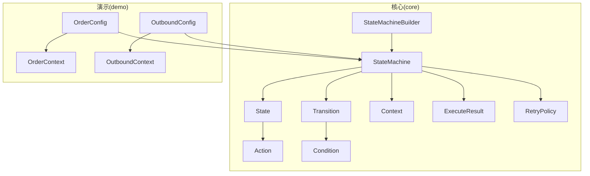
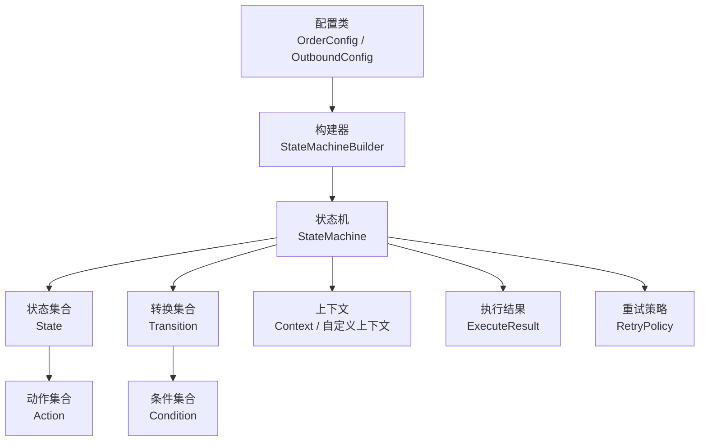
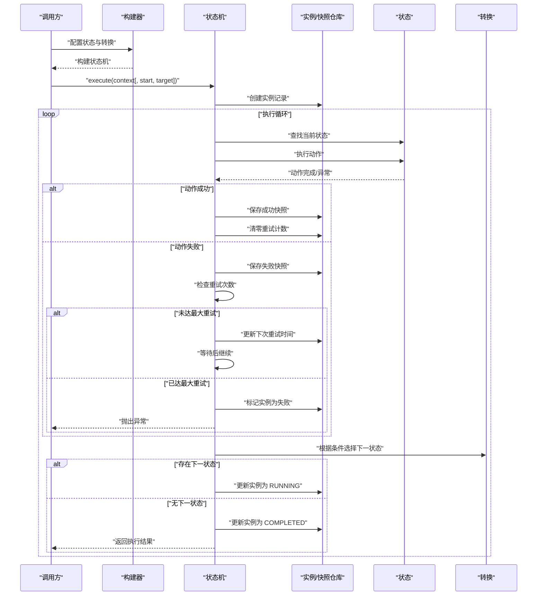
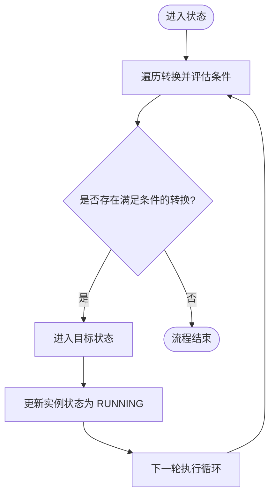
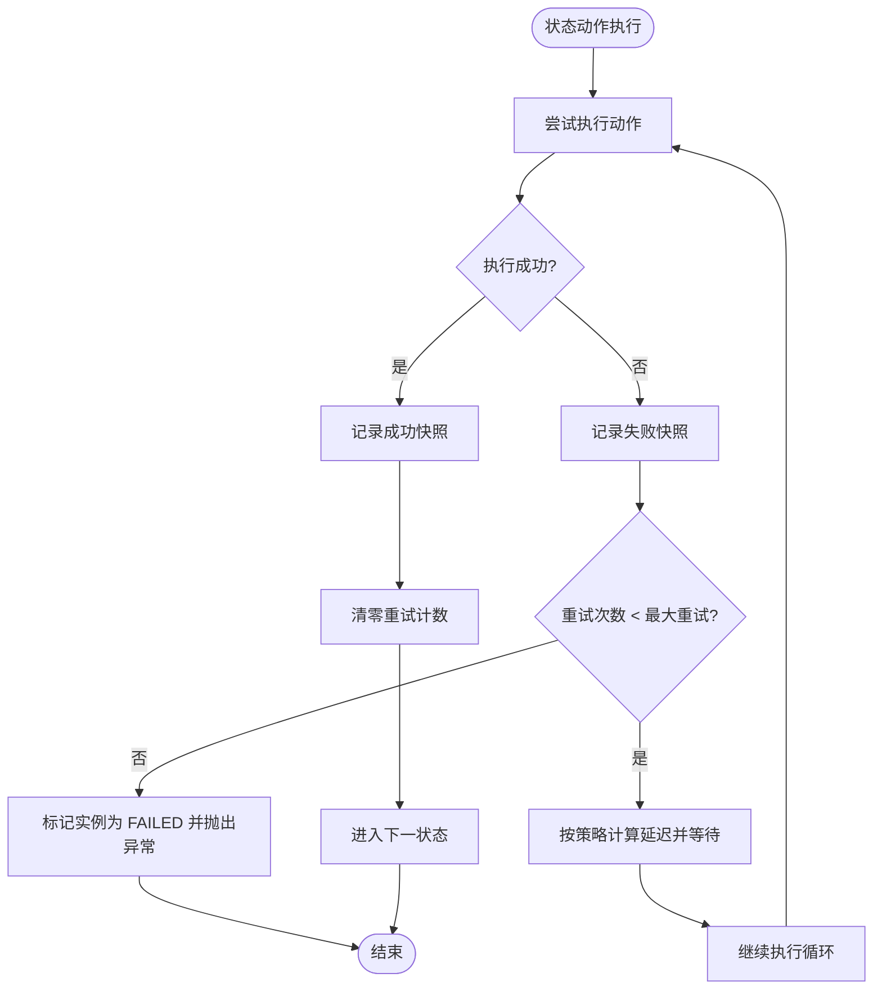
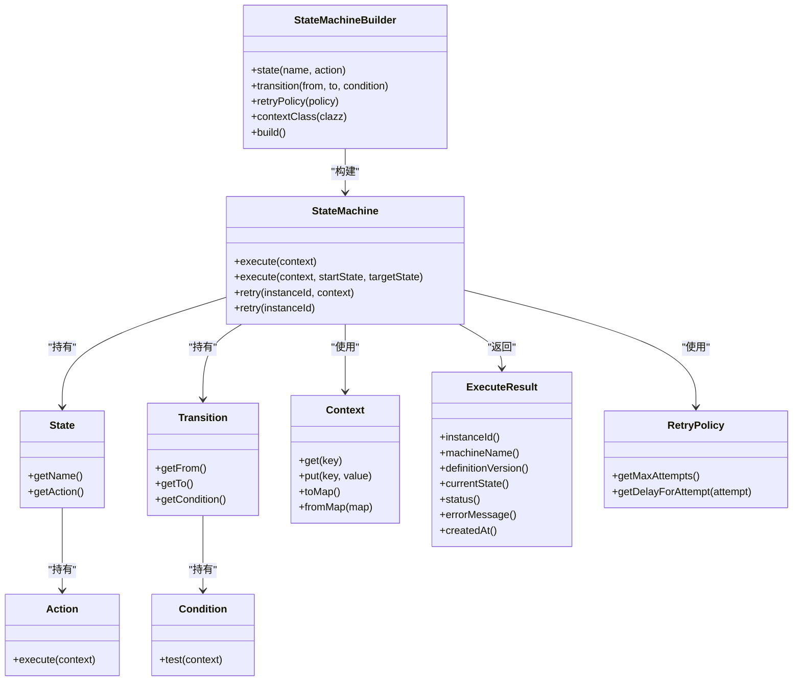

# 核心概念

<cite>
**本文引用的文件**
- [StateMachine.java](file://src/main/java/cn/chedejun/statemachine/core/StateMachine.java)
- [State.java](file://src/main/java/cn/chedejun/statemachine/core/State.java)
- [Transition.java](file://src/main/java/cn/chedejun/statemachine/core/Transition.java)
- [Context.java](file://src/main/java/cn/chedejun/statemachine/core/Context.java)
- [Action.java](file://src/main/java/cn/chedejun/statemachine/core/Action.java)
- [Condition.java](file://src/main/java/cn/chedejun/statemachine/core/Condition.java)
- [StateMachineBuilder.java](file://src/main/java/cn/chedejun/statemachine/core/StateMachineBuilder.java)
- [ExecuteResult.java](file://src/main/java/cn/chedejun/statemachine/core/ExecuteResult.java)
- [RetryPolicy.java](file://src/main/java/cn/chedejun/statemachine/core/RetryPolicy.java)
- [OrderConfig.java](file://demo/src/main/java/cn/chedejun/demo/config/OrderConfig.java)
- [OutboundConfig.java](file://demo/src/main/java/cn/chedejun/demo/config/OutboundConfig.java)
- [OrderContext.java](file://demo/src/main/java/cn/chedejun/demo/statemachine/OrderContext.java)
- [OutboundContext.java](file://demo/src/main/java/cn/chedejun/demo/statemachine/OutboundContext.java)
- [StateMachineBuilderTest.java](file://src/test/java/cn/chedejun/statemachine/core/StateMachineBuilderTest.java)
- [README.md](file://README.md)
</cite>

## 目录
1. [引言](#引言)
2. [项目结构](#项目结构)
3. [核心组件](#核心组件)
4. [架构总览](#架构总览)
5. [详细组件分析](#详细组件分析)
6. [依赖分析](#依赖分析)
7. [性能考虑](#性能考虑)
8. [故障排查指南](#故障排查指南)
9. [结论](#结论)
10. [附录](#附录)

## 引言
本节面向“状态机启动器”的核心概念，系统阐述状态机的基本理论与实现要点，包括状态、转换、上下文、动作与条件的定义与作用；解释 DSL 风格的构建 API 设计理念与使用方法；梳理状态机生命周期、执行流程与状态转换机制；并通过真实示例路径展示如何在实际业务中落地。同时总结最佳实践与常见陷阱，帮助读者快速上手并避免常见问题。

## 项目结构
该项目采用分层与功能模块结合的方式组织代码：
- core 层：状态机内核（状态、转换、动作、条件、构建器、执行结果、重试策略等）
- persistence 层：持久化相关（定义与实例仓库、DDL初始化等）
- management 层：管理端点与控制台（用于查看流程图、实例与快照）
- demo 应用：演示订单与出库两个典型业务场景

下图给出与核心概念相关的项目结构概览（仅展示与本文相关的关键模块）：

图表来源
- [StateMachine.java:11-196](file://src/main/java/cn/chedejun/statemachine/core/StateMachine.java#L11-L196)
- [StateMachineBuilder.java:8-53](file://src/main/java/cn/chedejun/statemachine/core/StateMachineBuilder.java#L8-L53)
- [State.java:3-16](file://src/main/java/cn/chedejun/statemachine/core/State.java#L3-L16)
- [Transition.java:3-20](file://src/main/java/cn/chedejun/statemachine/core/Transition.java#L3-L20)
- [Context.java:6-24](file://src/main/java/cn/chedejun/statemachine/core/Context.java#L6-L24)
- [Action.java:3-12](file://src/main/java/cn/chedejun/statemachine/core/Action.java#L3-L12)
- [Condition.java:3-7](file://src/main/java/cn/chedejun/statemachine/core/Condition.java#L3-L7)
- [ExecuteResult.java:14-23](file://src/main/java/cn/chedejun/statemachine/core/ExecuteResult.java#L14-L23)
- [RetryPolicy.java:5-45](file://src/main/java/cn/chedejun/statemachine/core/RetryPolicy.java#L5-L45)
- [OrderConfig.java:18-46](file://demo/src/main/java/cn/chedejun/demo/config/OrderConfig.java#L18-L46)
- [OutboundConfig.java:21-58](file://demo/src/main/java/cn/chedejun/demo/config/OutboundConfig.java#L21-L58)
- [OrderContext.java:8-34](file://demo/src/main/java/cn/chedejun/demo/statemachine/OrderContext.java#L8-L34)
- [OutboundContext.java:8-43](file://demo/src/main/java/cn/chedejun/demo/statemachine/OutboundContext.java#L8-L43)

章节来源
- [README.md:1-65](file://README.md#L1-L65)

## 核心组件
本节对状态机内核中的关键类进行深入解析，阐明其职责、数据结构与交互关系。

- 状态 State
  - 负责封装单个状态节点及其执行的动作。
  - 关键属性：名称、动作。
  - 约束：名称不可为空或空白。
- 转换 Transition
  - 描述从一个状态到另一个状态的迁移规则。
  - 关键属性：起始状态、目标状态、条件。
  - 约束：起始与目标状态均不可为空或空白。
- 上下文 Context
  - 提供键值存储的运行时数据容器，支持类型安全的读写与映射转换。
  - 支持从 Map 构造与导出为 Map。
- 动作 Action
  - 无参接口，负责在状态内执行业务逻辑。
  - 执行结果通过上下文写入，便于持久化与快照记录。
- 条件 Condition
  - 无参接口，用于判断是否满足状态迁移条件。
- 执行结果 ExecuteResult
  - 封装一次执行的实例标识、机器名、版本、当前状态、状态码与错误信息等。
  - 状态码取值：COMPLETED（自然结束）、REACHED（到达目标状态）、FAILED（失败）。
- 重试策略 RetryPolicy
  - 支持指数退避、最大重试次数、初始延迟、最大延迟与退避因子。
  - 提供按尝试次数计算延迟时间的方法。

章节来源
- [State.java:3-16](file://src/main/java/cn/chedejun/statemachine/core/State.java#L3-L16)
- [Transition.java:3-20](file://src/main/java/cn/chedejun/statemachine/core/Transition.java#L3-L20)
- [Context.java:6-24](file://src/main/java/cn/chedejun/statemachine/core/Context.java#L6-L24)
- [Action.java:3-12](file://src/main/java/cn/chedejun/statemachine/core/Action.java#L3-L12)
- [Condition.java:3-7](file://src/main/java/cn/chedejun/statemachine/core/Condition.java#L3-L7)
- [ExecuteResult.java:14-23](file://src/main/java/cn/chedejun/statemachine/core/ExecuteResult.java#L14-L23)
- [RetryPolicy.java:5-45](file://src/main/java/cn/chedejun/statemachine/core/RetryPolicy.java#L5-L45)

## 架构总览
状态机的执行由构建器装配状态与转换规则，运行时由状态机驱动执行循环，贯穿动作执行、条件判断、快照记录与重试控制。下图展示从配置到执行的高层架构：

图表来源
- [OrderConfig.java:18-46](file://demo/src/main/java/cn/chedejun/demo/config/OrderConfig.java#L18-L46)
- [OutboundConfig.java:21-58](file://demo/src/main/java/cn/chedejun/demo/config/OutboundConfig.java#L21-L58)
- [StateMachineBuilder.java:40-51](file://src/main/java/cn/chedejun/statemachine/core/StateMachineBuilder.java#L40-L51)
- [StateMachine.java:27-48](file://src/main/java/cn/chedejun/statemachine/core/StateMachine.java#L27-L48)

## 详细组件分析

### 状态机执行流程与生命周期
状态机的生命周期包含构建、初始化、执行、重试与完成五个阶段。执行流程如下：

图表来源
- [StateMachine.java:40-136](file://src/main/java/cn/chedejun/statemachine/core/StateMachine.java#L40-L136)
- [State.java:13-14](file://src/main/java/cn/chedejun/statemachine/core/State.java#L13-L14)
- [Transition.java:16-18](file://src/main/java/cn/chedejun/statemachine/core/Transition.java#L16-L18)

章节来源
- [StateMachine.java:40-136](file://src/main/java/cn/chedejun/statemachine/core/StateMachine.java#L40-L136)

### DSL 风格 API 设计理念与使用方法
- 设计理念
  - 以链式 API 描述状态机：先声明状态与动作，再声明转换与条件，最后构建实例。
  - 将“数据”（上下文）与“行为”（动作）解耦，通过条件驱动状态迁移。
  - 默认提供指数退避重试策略，可按需调整。
- 使用方法
  - 在配置类中通过构建器装配状态机，注入 Spring 容器作为 Bean。
  - 运行时通过状态机执行方法传入上下文，得到执行结果。
  - 对失败实例可进行重试，支持手动传入新上下文或自动从快照恢复。

示例路径（不展示具体代码内容）：
- [OrderConfig.java:18-46](file://demo/src/main/java/cn/chedejun/demo/config/OrderConfig.java#L18-L46)
- [OutboundConfig.java:21-58](file://demo/src/main/java/cn/chedejun/demo/config/OutboundConfig.java#L21-L58)
- [README.md:19-49](file://README.md#L19-L49)

章节来源
- [StateMachineBuilder.java:25-51](file://src/main/java/cn/chedejun/statemachine/core/StateMachineBuilder.java#L25-L51)
- [OrderConfig.java:18-46](file://demo/src/main/java/cn/chedejun/demo/config/OrderConfig.java#L18-L46)
- [OutboundConfig.java:21-58](file://demo/src/main/java/cn/chedejun/demo/config/OutboundConfig.java#L21-L58)
- [README.md:19-49](file://README.md#L19-L49)

### 状态转换机制与条件判断
- 转换规则
  - 从当前状态出发，遍历所有转换，匹配首个满足条件的转换，进入目标状态。
  - 若无满足条件的转换，则流程结束（COMPLETED）。
- 条件接口
  - 条件为函数式接口，接收上下文并返回布尔值。
  - 未设置条件时默认视为总是满足（true）。

图表来源
- [StateMachine.java:142-149](file://src/main/java/cn/chedejun/statemachine/core/StateMachine.java#L142-L149)
- [Transition.java:8-14](file://src/main/java/cn/chedejun/statemachine/core/Transition.java#L8-L14)
- [Condition.java:4-6](file://src/main/java/cn/chedejun/statemachine/core/Condition.java#L4-L6)

章节来源
- [StateMachine.java:142-149](file://src/main/java/cn/chedejun/statemachine/core/StateMachine.java#L142-L149)
- [Transition.java:8-14](file://src/main/java/cn/chedejun/statemachine/core/Transition.java#L8-L14)
- [Condition.java:4-6](file://src/main/java/cn/chedejun/statemachine/core/Condition.java#L4-L6)

### 重试策略与失败处理
- 重试策略
  - 指数退避：按尝试次数计算延迟，受最大延迟限制。
  - 最大重试次数：超过则标记实例为失败并抛出异常。
- 失败恢复
  - 支持手动重试：传入新上下文继续执行。
  - 支持自动重试：从首次快照恢复上下文，自动重放。

图表来源
- [StateMachine.java:97-116](file://src/main/java/cn/chedejun/statemachine/core/StateMachine.java#L97-L116)
- [RetryPolicy.java:26-30](file://src/main/java/cn/chedejun/statemachine/core/RetryPolicy.java#L26-L30)

章节来源
- [StateMachine.java:97-116](file://src/main/java/cn/chedejun/statemachine/core/StateMachine.java#L97-L116)
- [RetryPolicy.java:26-30](file://src/main/java/cn/chedejun/statemachine/core/RetryPolicy.java#L26-L30)

### 上下文与自定义上下文
- 默认上下文
  - 提供通用键值存储能力，支持从 Map 构造与导出。
- 自定义上下文
  - 通过继承默认上下文扩展业务字段，便于在动作中读写强类型数据。
- 使用建议
  - 将跨状态共享的数据放入上下文，避免通过全局变量传递。
  - 在动作中通过上下文写入结果，确保快照与后续条件判断可用。

章节来源
- [Context.java:6-24](file://src/main/java/cn/chedejun/statemachine/core/Context.java#L6-L24)
- [OrderContext.java:8-34](file://demo/src/main/java/cn/chedejun/demo/statemachine/OrderContext.java#L8-L34)
- [OutboundContext.java:8-43](file://demo/src/main/java/cn/chedejun/demo/statemachine/OutboundContext.java#L8-L43)

### 执行结果与状态码语义
- 状态码含义
  - COMPLETED：流程自然结束，无后续状态。
  - REACHED：到达指定目标状态，但仍存在后续状态。
  - FAILED：执行失败，超过最大重试次数。
- 返回值用途
  - 实例 ID：用于后续重试与查询。
  - 当前状态与创建时间：用于前端展示与审计。

章节来源
- [ExecuteResult.java:14-23](file://src/main/java/cn/chedejun/statemachine/core/ExecuteResult.java#L14-L23)
- [StateMachineBuilderTest.java:85-120](file://src/test/java/cn/chedejun/statemachine/core/StateMachineBuilderTest.java#L85-L120)

## 依赖分析
核心类之间的依赖关系如下：

图表来源
- [StateMachine.java:11-196](file://src/main/java/cn/chedejun/statemachine/core/StateMachine.java#L11-L196)
- [State.java:3-16](file://src/main/java/cn/chedejun/statemachine/core/State.java#L3-L16)
- [Transition.java:3-20](file://src/main/java/cn/chedejun/statemachine/core/Transition.java#L3-L20)
- [Context.java:6-24](file://src/main/java/cn/chedejun/statemachine/core/Context.java#L6-L24)
- [Action.java:3-12](file://src/main/java/cn/chedejun/statemachine/core/Action.java#L3-L12)
- [Condition.java:3-7](file://src/main/java/cn/chedejun/statemachine/core/Condition.java#L3-L7)
- [ExecuteResult.java:14-23](file://src/main/java/cn/chedejun/statemachine/core/ExecuteResult.java#L14-L23)
- [RetryPolicy.java:5-45](file://src/main/java/cn/chedejun/statemachine/core/RetryPolicy.java#L5-L45)
- [StateMachineBuilder.java:8-53](file://src/main/java/cn/chedejun/statemachine/core/StateMachineBuilder.java#L8-L53)

## 性能考虑
- 执行循环上限
  - 为防止无限循环，执行循环设置了基于状态数量与重试次数的上限阈值。
- 快照与序列化
  - 每次状态执行都会进行输入/输出 JSON 序列化，注意上下文体量与字段复杂度对性能的影响。
- 重试延迟
  - 指数退避会随尝试次数增长而增加等待时间，合理设置最大延迟与最大重试次数。
- 数据库写入
  - 每次状态执行与重试都会写入实例与快照表，建议在高并发场景下关注数据库性能与索引设计。

章节来源
- [StateMachine.java:85-86](file://src/main/java/cn/chedejun/statemachine/core/StateMachine.java#L85-L86)
- [StateMachine.java:151-160](file://src/main/java/cn/chedejun/statemachine/core/StateMachine.java#L151-L160)
- [RetryPolicy.java:26-30](file://src/main/java/cn/chedejun/statemachine/core/RetryPolicy.java#L26-L30)

## 故障排查指南
- 初始化未完成
  - 若未注入数据源，执行时会抛出初始化异常。请确保构建时传入 JdbcTemplate。
- 状态未找到
  - 当前状态不在已定义状态集中时，会抛出状态未找到异常。请检查状态名称拼写与顺序。
- 无法到达目标状态
  - 指定目标状态后若无后续转换，状态机可能返回 REACHED；若目标状态即为最后一个且无后续转换，则返回 COMPLETED。
- 重试失败
  - 仅当实例状态为 FAILED 时允许重试；否则会抛出状态异常。
- 快照与上下文
  - 自动重试会从首次快照恢复上下文；若快照缺失，将使用空上下文重建。

章节来源
- [StateMachineBuilderTest.java:30-34](file://src/test/java/cn/chedejun/statemachine/core/StateMachineBuilderTest.java#L30-L34)
- [StateMachine.java:91-92](file://src/main/java/cn/chedejun/statemachine/core/StateMachine.java#L91-L92)
- [StateMachine.java:118-124](file://src/main/java/cn/chedejun/statemachine/core/StateMachine.java#L118-L124)
- [StateMachine.java:54-58](file://src/main/java/cn/chedejun/statemachine/core/StateMachine.java#L54-L58)
- [StateMachine.java:72-78](file://src/main/java/cn/chedejun/statemachine/core/StateMachine.java#L72-L78)

## 结论
本文件系统性地阐述了状态机启动器的核心概念与实现细节，包括状态、转换、上下文、动作与条件的定义与作用，DSL 风格 API 的设计理念与使用方法，以及状态机的生命周期、执行流程与状态转换机制。通过订单与出库两个业务示例，展示了如何在实际工程中落地状态机。最后总结了性能与故障排查要点，帮助读者在生产环境中稳定使用。

## 附录
- 示例路径（不展示具体代码内容）
  - 订单流程配置与动作实现：[OrderConfig.java:18-46](file://demo/src/main/java/cn/chedejun/demo/config/OrderConfig.java#L18-L46)
  - 出库流程配置与动作实现：[OutboundConfig.java:21-58](file://demo/src/main/java/cn/chedejun/demo/config/OutboundConfig.java#L21-L58)
  - 执行与断言测试用例：[StateMachineBuilderTest.java:30-120](file://src/test/java/cn/chedejun/statemachine/core/StateMachineBuilderTest.java#L30-L120)
- 快速开始与管理控制台
  - 快速开始与管理控制台入口：[README.md:19-65](file://README.md#L19-L65)