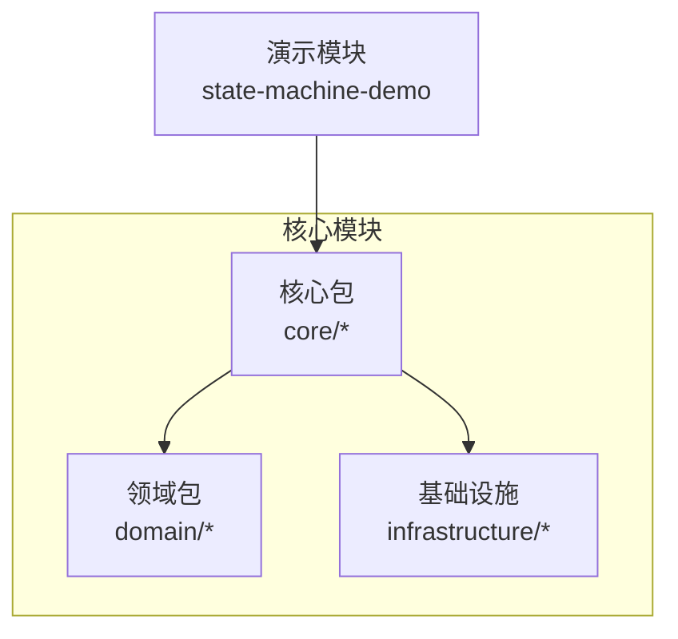
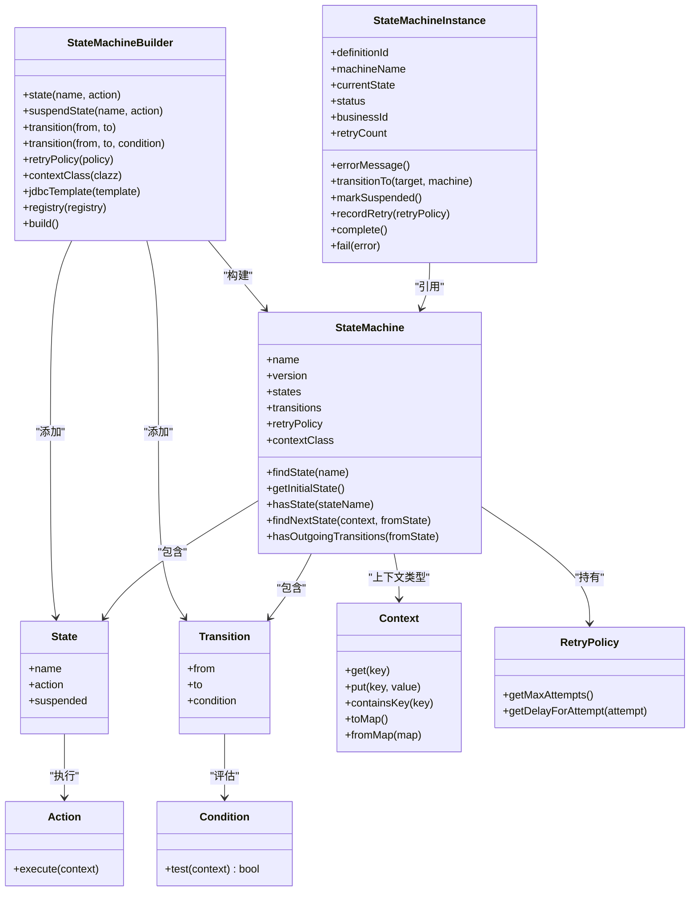
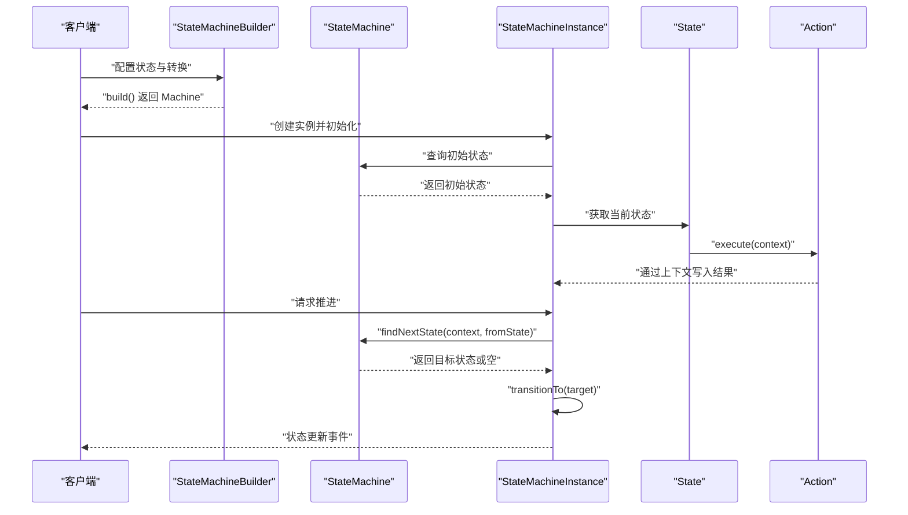
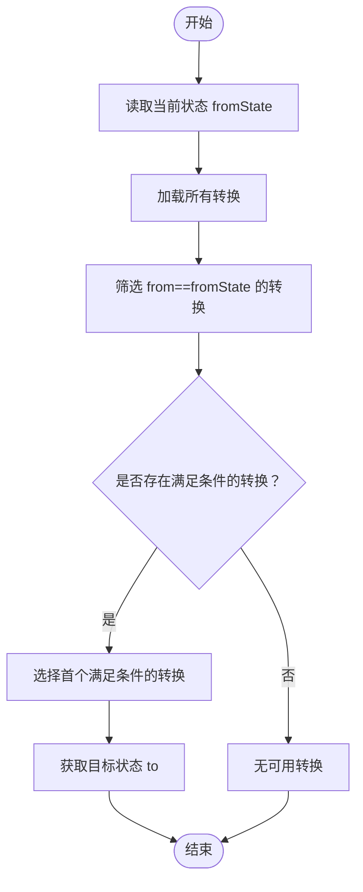
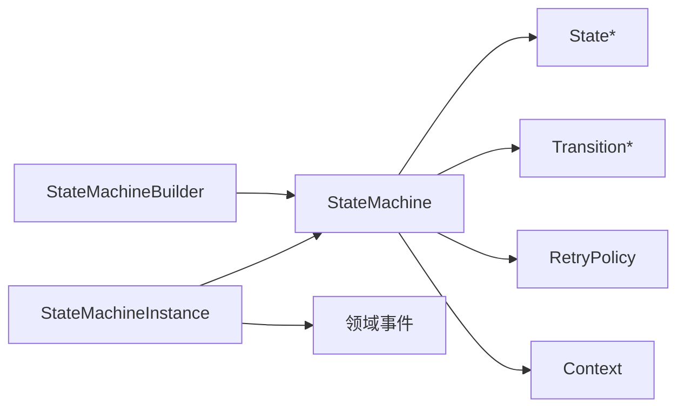

# 状态机理论基础

<cite>
**本文引用的文件**
- [State.java](file://state-machine-boot-starter/src/main/java/cn/chedejun/statemachine/core/State.java)
- [Transition.java](file://state-machine-boot-starter/src/main/java/cn/chedejun/statemachine/core/Transition.java)
- [Context.java](file://state-machine-boot-starter/src/main/java/cn/chedejun/statemachine/core/Context.java)
- [Condition.java](file://state-machine-boot-starter/src/main/java/cn/chedejun/statemachine/core/Condition.java)
- [Action.java](file://state-machine-boot-starter/src/main/java/cn/chedejun/statemachine/core/Action.java)
- [StateMachine.java](file://state-machine-boot-starter/src/main/java/cn/chedejun/statemachine/domain/engine/StateMachine.java)
- [StateMachineBuilder.java](file://state-machine-boot-starter/src/main/java/cn/chedejun/statemachine/core/StateMachineBuilder.java)
- [RetryPolicy.java](file://state-machine-boot-starter/src/main/java/cn/chedejun/statemachine/core/RetryPolicy.java)
- [StateMachineInstance.java](file://state-machine-boot-starter/src/main/java/cn/chedejun/statemachine/domain/instance/StateMachineInstance.java)
- [OrderContext.java](file://state-machine-demo/src/main/java/cn/chedejun/demo/statemachine/OrderContext.java)
- [OutboundContext.java](file://state-machine-demo/src/main/java/cn/chedejun/demo/statemachine/OutboundContext.java)
- [h2.sql](file://state-machine-boot-starter/src/main/resources/ddl/h2.sql)
- [README.md](file://state-machine-boot-starter/README.md)
- [StateMachineBuilderTest.java](file://state-machine-boot-starter/src/test/java/cn/chedejun/statemachine/core/StateMachineBuilderTest.java)
- [StateMachineInstanceTest.java](file://state-machine-boot-starter/src/test/java/cn/chedejun/statemachine/domain/instance/StateMachineInstanceTest.java)
</cite>

## 目录
1. [引言](#引言)
2. [项目结构](#项目结构)
3. [核心组件](#核心组件)
4. [架构总览](#架构总览)
5. [详细组件分析](#详细组件分析)
6. [依赖分析](#依赖分析)
7. [性能考虑](#性能考虑)
8. [故障排查指南](#故障排查指南)
9. [结论](#结论)
10. [附录](#附录)

## 引言
本文件围绕状态机工作流引擎，系统梳理有限状态机（FSM）的理论与实践，结合代码库中的核心类与示例，解释状态、转换、条件、上下文等基本概念，阐述确定性与非确定性状态机的差异，说明同步与异步状态机在该实现中的体现，并以面向对象的方式展示如何用代码表达状态机模型。文档既适合初学者建立清晰的概念框架，也为有经验的开发者提供实现细节与最佳实践参考。

## 项目结构
该工程采用模块化组织，核心能力集中在 boot-starter 模块中，demo 模块演示了订单与出库单两类业务场景。核心域对象与基础设施位于同一模块内，便于理解从定义到执行的完整链路。

**图表来源**
- [StateMachine.java:1-77](file://state-machine-boot-starter/src/main/java/cn/chedejun/statemachine/domain/engine/StateMachine.java#L1-L77)
- [OrderContext.java:1-99](file://state-machine-demo/src/main/java/cn/chedejun/demo/statemachine/OrderContext.java#L1-L99)
- [OutboundContext.java:1-43](file://state-machine-demo/src/main/java/cn/chedejun/demo/statemachine/OutboundContext.java#L1-L43)

**章节来源**
- [README.md:1-65](file://state-machine-boot-starter/README.md#L1-L65)

## 核心组件
本节聚焦状态机的四大核心要素：状态、转换、条件、上下文，并结合代码中的接口与类进行说明。

- 状态（State）
  - 表达执行单元，包含名称、动作与挂起标记。动作在执行时通过上下文写入结果，自动纳入快照。
  - 参考路径：[State.java:1-23](file://state-machine-boot-starter/src/main/java/cn/chedejun/statemachine/core/State.java#L1-L23)

- 转换（Transition）
  - 描述从状态到状态的迁移，携带来源、目标与条件。条件为空表示无条件允许。
  - 参考路径：[Transition.java:1-20](file://state-machine-boot-starter/src/main/java/cn/chedejun/statemachine/core/Transition.java#L1-L20)

- 条件（Condition）
  - 函数式接口，接收上下文并返回布尔值，决定是否允许转换。
  - 参考路径：[Condition.java:1-7](file://state-machine-boot-starter/src/main/java/cn/chedejun/statemachine/core/Condition.java#L1-L7)

- 上下文（Context）
  - 共享数据容器，提供键值存取、映射转换与工厂方法，用于在状态与转换间传递信息。
  - 参考路径：[Context.java:1-24](file://state-machine-boot-starter/src/main/java/cn/chedejun/statemachine/core/Context.java#L1-L24)

- 动作（Action）
  - 函数式接口，封装状态步骤的业务逻辑，通过上下文读写数据。
  - 参考路径：[Action.java:1-12](file://state-machine-boot-starter/src/main/java/cn/chedejun/statemachine/core/Action.java#L1-L12)

- 状态机（StateMachine）
  - 不可变领域对象，持有状态集合、转换集合、重试策略与上下文类型；提供查找状态、获取初始状态、判断下一状态等能力。
  - 参考路径：[StateMachine.java:1-77](file://state-machine-boot-starter/src/main/java/cn/chedejun/statemachine/domain/engine/StateMachine.java#L1-L77)

- 构建器（StateMachineBuilder）
  - 流式构建状态机定义，支持添加状态、挂起点、转换、重试策略与注册表集成。
  - 参考路径：[StateMachineBuilder.java:1-52](file://state-machine-boot-starter/src/main/java/cn/chedejun/statemachine/core/StateMachineBuilder.java#L1-L52)

- 实例（StateMachineInstance）
  - 领域聚合根，维护当前状态、实例状态（运行/挂起/完成/失败）、重试计数与错误信息，并发出领域事件。
  - 参考路径：[StateMachineInstance.java:1-81](file://state-machine-boot-starter/src/main/java/cn/chedejun/statemachine/domain/instance/StateMachineInstance.java#L1-L81)

- 重试策略（RetryPolicy）
  - 支持指数退避、最大尝试次数、初始延迟与最大延迟，提供按尝试次数计算延迟的方法。
  - 参考路径：[RetryPolicy.java:1-45](file://state-machine-boot-starter/src/main/java/cn/chedejun/statemachine/core/RetryPolicy.java#L1-L45)

**章节来源**
- [State.java:1-23](file://state-machine-boot-starter/src/main/java/cn/chedejun/statemachine/core/State.java#L1-L23)
- [Transition.java:1-20](file://state-machine-boot-starter/src/main/java/cn/chedejun/statemachine/core/Transition.java#L1-L20)
- [Condition.java:1-7](file://state-machine-boot-starter/src/main/java/cn/chedejun/statemachine/core/Condition.java#L1-L7)
- [Context.java:1-24](file://state-machine-boot-starter/src/main/java/cn/chedejun/statemachine/core/Context.java#L1-L24)
- [Action.java:1-12](file://state-machine-boot-starter/src/main/java/cn/chedejun/statemachine/core/Action.java#L1-L12)
- [StateMachine.java:1-77](file://state-machine-boot-starter/src/main/java/cn/chedejun/statemachine/domain/engine/StateMachine.java#L1-L77)
- [StateMachineBuilder.java:1-52](file://state-machine-boot-starter/src/main/java/cn/chedejun/statemachine/core/StateMachineBuilder.java#L1-L52)
- [StateMachineInstance.java:1-81](file://state-machine-boot-starter/src/main/java/cn/chedejun/statemachine/domain/instance/StateMachineInstance.java#L1-L81)
- [RetryPolicy.java:1-45](file://state-machine-boot-starter/src/main/java/cn/chedejun/statemachine/core/RetryPolicy.java#L1-L45)

## 架构总览
下图展示了状态机定义与运行时实例之间的关系，以及构建器、上下文、动作、条件与重试策略在整体架构中的位置。

**图表来源**
- [StateMachineBuilder.java:1-52](file://state-machine-boot-starter/src/main/java/cn/chedejun/statemachine/core/StateMachineBuilder.java#L1-L52)
- [StateMachine.java:1-77](file://state-machine-boot-starter/src/main/java/cn/chedejun/statemachine/domain/engine/StateMachine.java#L1-L77)
- [State.java:1-23](file://state-machine-boot-starter/src/main/java/cn/chedejun/statemachine/core/State.java#L1-L23)
- [Transition.java:1-20](file://state-machine-boot-starter/src/main/java/cn/chedejun/statemachine/core/Transition.java#L1-L20)
- [Context.java:1-24](file://state-machine-boot-starter/src/main/java/cn/chedejun/statemachine/core/Context.java#L1-L24)
- [Action.java:1-12](file://state-machine-boot-starter/src/main/java/cn/chedejun/statemachine/core/Action.java#L1-L12)
- [Condition.java:1-7](file://state-machine-boot-starter/src/main/java/cn/chedejun/statemachine/core/Condition.java#L1-L7)
- [RetryPolicy.java:1-45](file://state-machine-boot-starter/src/main/java/cn/chedejun/statemachine/core/RetryPolicy.java#L1-L45)
- [StateMachineInstance.java:1-81](file://state-machine-boot-starter/src/main/java/cn/chedejun/statemachine/domain/instance/StateMachineInstance.java#L1-L81)

## 详细组件分析

### 状态机的数学定义与实现映射
- 数学定义要点
  - 状态集 S，转换集 T ⊆ S × Σ × S，Σ 为输入字母表；条件 c: Ctx → 2^Σ，决定可接受的输入标签；初始状态 s0 ∈ S；终止状态集合 F ⊆ S。
- 实现映射
  - 状态集 S ↔ State 列表；转换集 T ↔ Transition 列表；条件 c ↔ Condition 接口；输入标签由上下文驱动；初始状态为第一个 State；终止状态通过无出边或完成操作判定。
- 同步与异步
  - 同步：状态机在一次调用中推进一步，等待动作完成后再决定下一步。该实现通过状态机定义与实例的状态流转体现同步特性。
  - 异步：状态机在动作执行期间可能触发外部事件或回调，后续推进基于事件或轮询。该实现未暴露显式的异步调度器，但可通过扩展动作与事件机制实现异步行为。

**章节来源**
- [StateMachine.java:54-76](file://state-machine-boot-starter/src/main/java/cn/chedejun/statemachine/domain/engine/StateMachine.java#L54-L76)
- [StateMachineInstance.java:39-79](file://state-machine-boot-starter/src/main/java/cn/chedejun/statemachine/domain/instance/StateMachineInstance.java#L39-L79)

### 确定性与非确定性状态机
- 确定性（Deterministic）
  - 对于任意状态 s 与输入 σ，最多存在一条转换 (s, σ, s')。该实现通过“首个满足条件的转换”选择策略体现确定性：遍历转换列表，遇到第一个匹配条件的转换即采用。
- 非确定性（Nondeterministic）
  - 对于同一输入可能存在多条转换，需要回溯或并行探索。该实现未提供非确定性分支的内置机制，如需可扩展条件与转换集合以支持多分支策略。

**章节来源**
- [StateMachine.java:63-71](file://state-machine-boot-starter/src/main/java/cn/chedejun/statemachine/domain/engine/StateMachine.java#L63-L71)

### 状态与动作的执行流程
以下序列图展示了从状态机定义到实例状态推进的关键步骤：

**图表来源**
- [StateMachineBuilder.java:42-47](file://state-machine-boot-starter/src/main/java/cn/chedejun/statemachine/core/StateMachineBuilder.java#L42-L47)
- [StateMachine.java:50-71](file://state-machine-boot-starter/src/main/java/cn/chedejun/statemachine/domain/engine/StateMachine.java#L50-L71)
- [StateMachineInstance.java:19-44](file://state-machine-boot-starter/src/main/java/cn/chedejun/statemachine/domain/instance/StateMachineInstance.java#L19-L44)
- [State.java:3-22](file://state-machine-boot-starter/src/main/java/cn/chedejun/statemachine/core/State.java#L3-L22)
- [Action.java:9-11](file://state-machine-boot-starter/src/main/java/cn/chedejun/statemachine/core/Action.java#L9-L11)

### 条件与上下文的决策逻辑
以下流程图描述了状态机在给定上下文时如何选择下一状态：

**图表来源**
- [StateMachine.java:63-71](file://state-machine-boot-starter/src/main/java/cn/chedejun/statemachine/domain/engine/StateMachine.java#L63-L71)
- [Transition.java:3-19](file://state-machine-boot-starter/src/main/java/cn/chedejun/statemachine/core/Transition.java#L3-L19)
- [Condition.java:4-6](file://state-machine-boot-starter/src/main/java/cn/chedejun/statemachine/core/Condition.java#L4-L6)
- [Context.java:6-23](file://state-machine-boot-starter/src/main/java/cn/chedejun/statemachine/core/Context.java#L6-L23)

### 面向对象表达状态机概念
- 抽象与封装
  - 将状态、转换、条件、动作与上下文抽象为独立类，通过组合形成状态机定义；实例作为运行时聚合根，封装状态与事件。
- 可扩展性
  - 通过自定义上下文类（如订单上下文、出库单上下文）承载业务数据；通过条件函数表达复杂业务规则；通过动作接口注入业务逻辑。
- 示例映射
  - 订单上下文与出库单上下文分别继承通用上下文，体现业务域的数据结构与语义。
  - 参考路径：
    - [OrderContext.java:10-98](file://state-machine-demo/src/main/java/cn/chedejun/demo/statemachine/OrderContext.java#L10-L98)
    - [OutboundContext.java:8-42](file://state-machine-demo/src/main/java/cn/chedejun/demo/statemachine/OutboundContext.java#L8-L42)

**章节来源**
- [OrderContext.java:1-99](file://state-machine-demo/src/main/java/cn/chedejun/demo/statemachine/OrderContext.java#L1-L99)
- [OutboundContext.java:1-43](file://state-machine-demo/src/main/java/cn/chedejun/demo/statemachine/OutboundContext.java#L1-L43)

## 依赖分析
- 组件耦合
  - StateMachineBuilder 依赖 StateMachine、State、Transition、RetryPolicy 与注册表；StateMachine 依赖 State、Transition、RetryPolicy 与 Context；StateMachineInstance 依赖 StateMachine 与领域事件。
- 外部依赖
  - 数据持久化依赖 JDBC 与 SQL DDL；管理控制台与 Spring Boot 自动装配在启动器中集成。
- 关系可视化

**图表来源**
- [StateMachineBuilder.java:1-52](file://state-machine-boot-starter/src/main/java/cn/chedejun/statemachine/core/StateMachineBuilder.java#L1-L52)
- [StateMachine.java:1-77](file://state-machine-boot-starter/src/main/java/cn/chedejun/statemachine/domain/engine/StateMachine.java#L1-L77)
- [StateMachineInstance.java:1-81](file://state-machine-boot-starter/src/main/java/cn/chedejun/statemachine/domain/instance/StateMachineInstance.java#L1-L81)

**章节来源**
- [StateMachineBuilder.java:1-52](file://state-machine-boot-starter/src/main/java/cn/chedejun/statemachine/core/StateMachineBuilder.java#L1-L52)
- [StateMachine.java:1-77](file://state-machine-boot-starter/src/main/java/cn/chedejun/statemachine/domain/engine/StateMachine.java#L1-L77)
- [StateMachineInstance.java:1-81](file://state-machine-boot-starter/src/main/java/cn/chedejun/statemachine/domain/instance/StateMachineInstance.java#L1-L81)

## 性能考虑
- 时间复杂度
  - 寻找下一状态：线性扫描转换列表，时间复杂度 O(T)，T 为从状态出发的转换数量；若频繁查询，可按来源状态建立索引以降低复杂度。
- 空间复杂度
  - 状态机定义占用 O(S + T) 空间；实例状态与快照随运行时增长，受重试与历史保留策略影响。
- 优化建议
  - 使用不可变定义减少并发修改开销；对常用条件进行缓存；限制状态与转换数量以控制内存占用；合理设置重试策略避免无限循环。

## 故障排查指南
- 常见问题与定位
  - 无法推进：检查是否存在从当前状态出发的有效转换；确认条件函数返回值与上下文数据一致。
  - 状态异常：确认实例未处于终态（完成/失败），否则禁止再次推进。
  - 重试失败：仅失败实例可重试，且不超过最大尝试次数。
- 单元测试参考
  - 构建与版本分配、挂起点、路由失败与可用转换提示等场景均有覆盖，可作为行为验证的依据。
- 参考路径
  - [StateMachineBuilderTest.java:35-162](file://state-machine-boot-starter/src/test/java/cn/chedejun/statemachine/core/StateMachineBuilderTest.java#L35-L162)
  - [StateMachineInstanceTest.java:20-97](file://state-machine-boot-starter/src/test/java/cn/chedejun/statemachine/domain/instance/StateMachineInstanceTest.java#L20-L97)

**章节来源**
- [StateMachineBuilderTest.java:66-162](file://state-machine-boot-starter/src/test/java/cn/chedejun/statemachine/core/StateMachineBuilderTest.java#L66-L162)
- [StateMachineInstanceTest.java:47-97](file://state-machine-boot-starter/src/test/java/cn/chedejun/statemachine/domain/instance/StateMachineInstanceTest.java#L47-L97)

## 结论
该状态机工作流引擎以简洁的领域对象与函数式接口为核心，提供了确定性的状态推进机制、灵活的条件与上下文模型，以及完善的重试策略与实例生命周期管理。通过构建器模式与不可变定义，系统在保证可读性的同时具备良好的扩展性。对于初学者，建议从上下文与条件入手理解业务驱动的决策；对于资深开发者，可在动作与事件扩展层面实现更复杂的异步与分布式状态机。

## 附录
- 数据模型（DDL）
  - 定义表、实例表、快照表三类核心表，支撑状态机定义的持久化与实例运行时数据存储。
  - 参考路径：[h2.sql:1-19](file://state-machine-boot-starter/src/main/resources/ddl/h2.sql#L1-L19)

- 快速开始与示例
  - 提供订单处理状态机的完整示例，包括定义、执行与重试。
  - 参考路径：[README.md:17-49](file://state-machine-boot-starter/README.md#L17-L49)