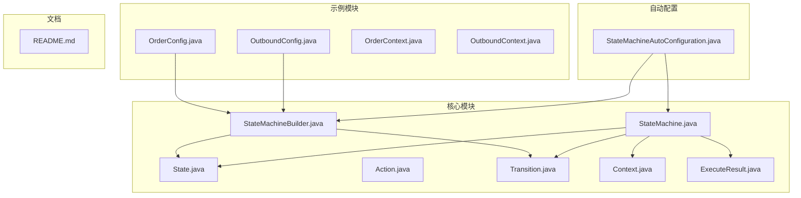
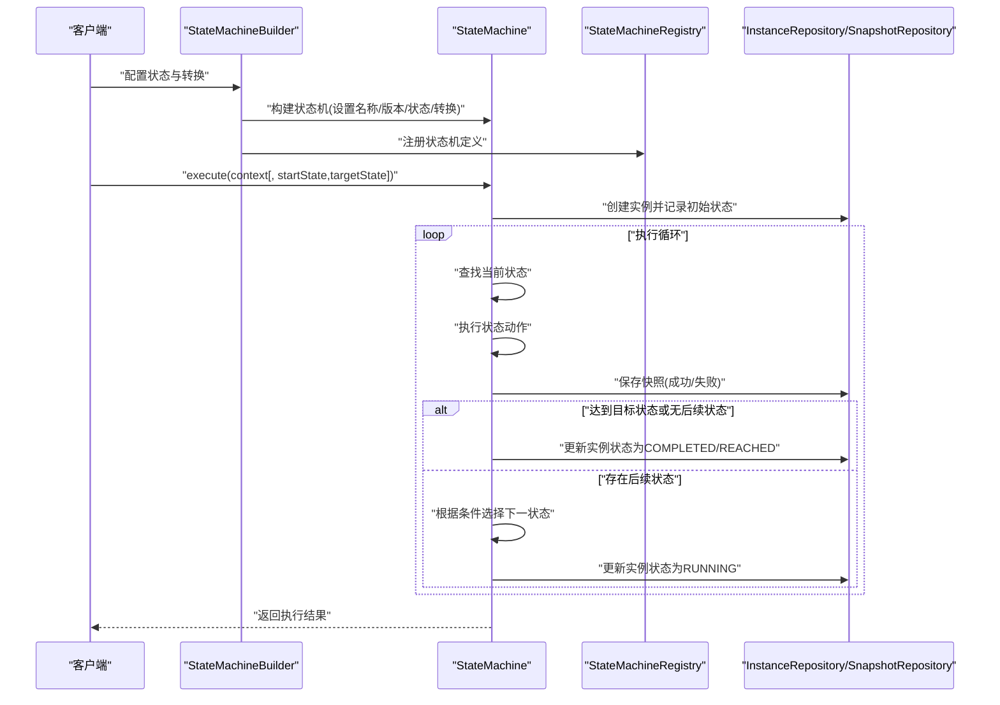
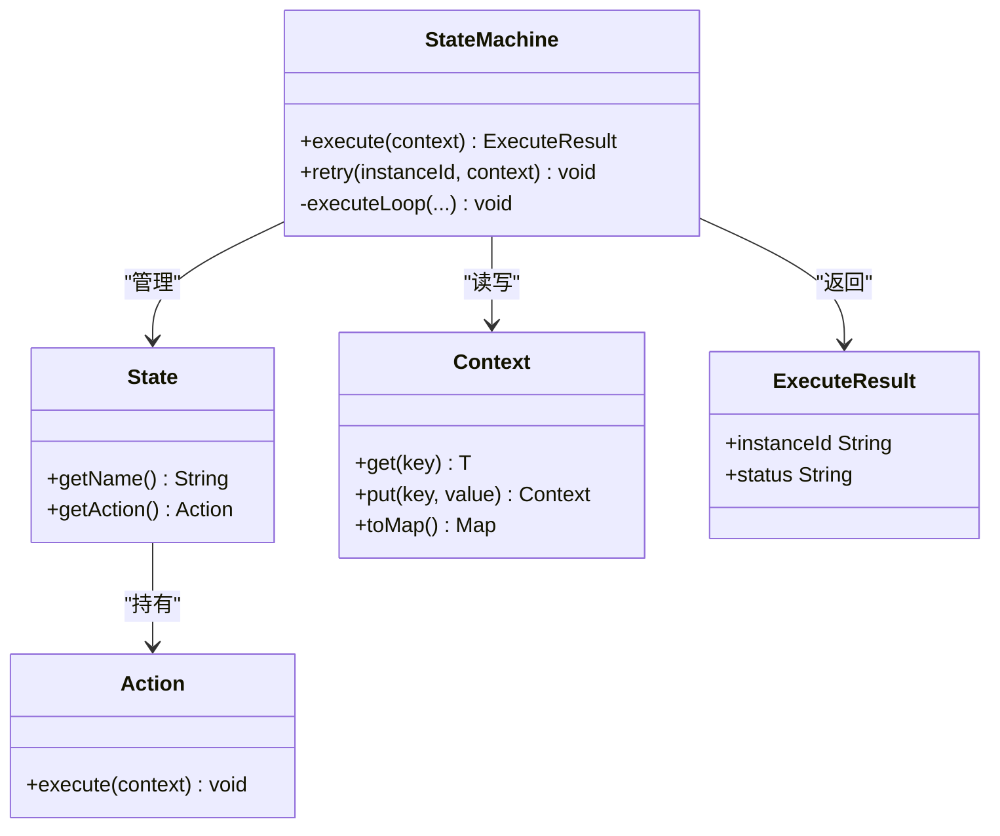
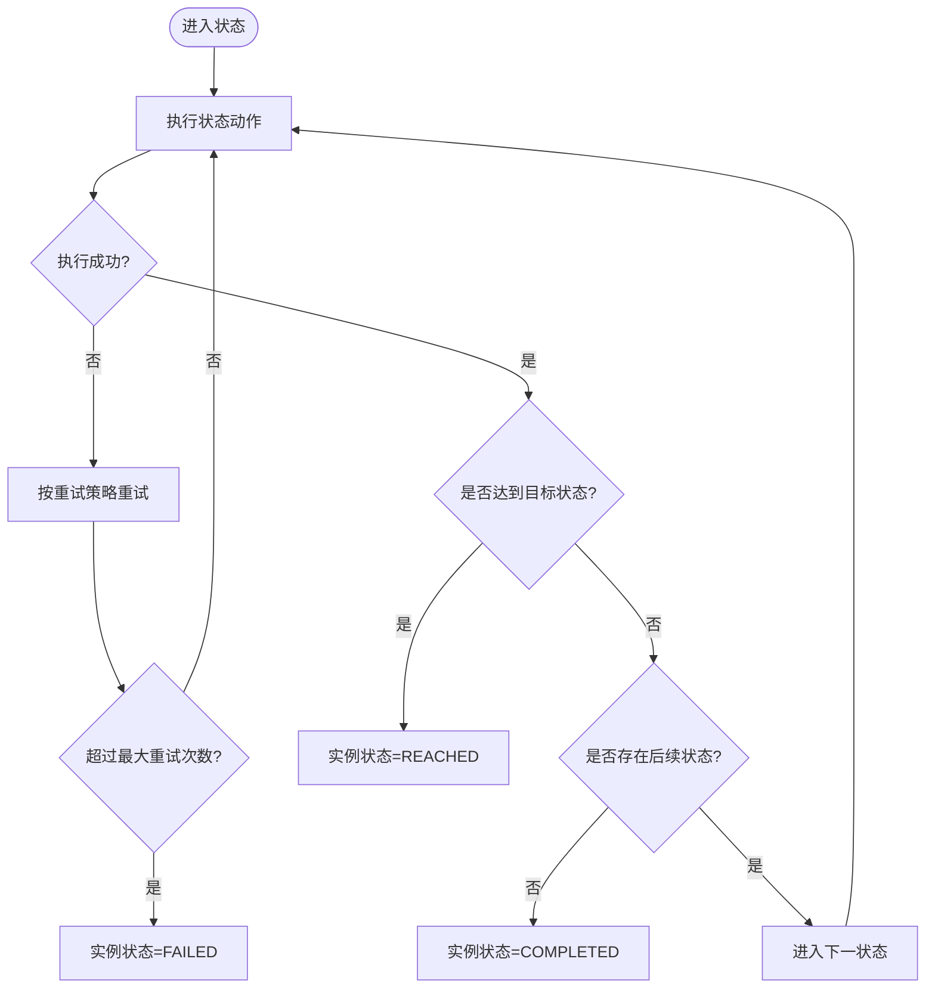
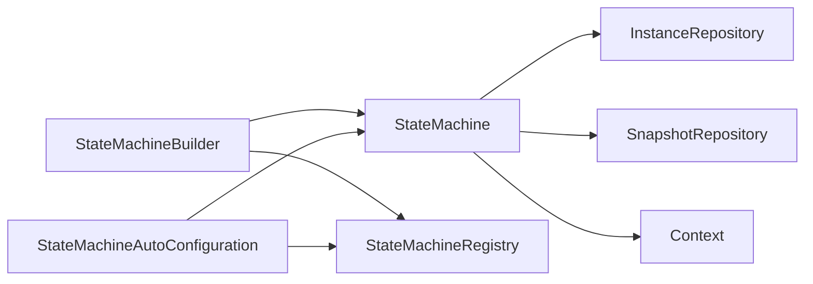

# 状态概念

<cite>
**本文引用的文件**
- [State.java](file://src/main/java/cn/chedejun/statemachine/core/State.java)
- [StateMachine.java](file://src/main/java/cn/chedejun/statemachine/core/StateMachine.java)
- [StateMachineBuilder.java](file://src/main/java/cn/chedejun/statemachine/core/StateMachineBuilder.java)
- [Action.java](file://src/main/java/cn/chedejun/statemachine/core/Action.java)
- [Transition.java](file://src/main/java/cn/chedejun/statemachine/core/Transition.java)
- [Context.java](file://src/main/java/cn/chedejun/statemachine/core/Context.java)
- [ExecuteResult.java](file://src/main/java/cn/chedejun/statemachine/core/ExecuteResult.java)
- [OrderConfig.java](file://demo/src/main/java/cn/chedejun/demo/config/OrderConfig.java)
- [OutboundConfig.java](file://demo/src/main/java/cn/chedejun/demo/config/OutboundConfig.java)
- [OrderContext.java](file://demo/src/main/java/cn/chedejun/demo/statemachine/OrderContext.java)
- [OutboundContext.java](file://demo/src/main/java/cn/chedejun/demo/statemachine/OutboundContext.java)
- [StateMachineAutoConfiguration.java](file://src/main/java/cn/chedejun/statemachine/autoconfigure/StateMachineAutoConfiguration.java)
- [README.md](file://README.md)
</cite>

## 目录
1. [引言](#引言)
2. [项目结构](#项目结构)
3. [核心组件](#核心组件)
4. [架构总览](#架构总览)
5. [详细组件分析](#详细组件分析)
6. [依赖分析](#依赖分析)
7. [性能考虑](#性能考虑)
8. [故障排查指南](#故障排查指南)
9. [结论](#结论)
10. [附录](#附录)

## 引言
本节围绕状态机中的“状态”概念展开，系统阐述状态的定义、属性与作用机制，解释状态在状态机执行过程中的生命周期、状态标识符、状态动作(Action)的绑定方式，以及状态与转换(Transition)之间的关系。同时结合实际代码示例路径，给出状态的分类（初始状态、中间状态、结束状态）、命名规范建议、最佳实践与常见陷阱，帮助读者在工程中正确设计与使用状态。

## 项目结构
该仓库采用按领域分层与功能模块划分相结合的方式组织代码：
- 核心模块：状态、状态机、构建器、动作、条件、上下文、执行结果等基础构件
- 自动配置模块：基于 Spring Boot 的自动装配与注册
- 示例模块：演示订单与出库两类业务流程的状态机配置与使用
- 测试模块：验证状态机构建、执行、重试与版本管理等行为

图表来源
- [StateMachine.java:11-35](file://src/main/java/cn/chedejun/statemachine/core/StateMachine.java#L11-L35)
- [StateMachineBuilder.java:8-51](file://src/main/java/cn/chedejun/statemachine/core/StateMachineBuilder.java#L8-L51)
- [OrderConfig.java:18-46](file://demo/src/main/java/cn/chedejun/demo/config/OrderConfig.java#L18-L46)
- [OutboundConfig.java:21-57](file://demo/src/main/java/cn/chedejun/demo/config/OutboundConfig.java#L21-L57)
- [StateMachineAutoConfiguration.java:26-56](file://src/main/java/cn/chedejun/statemachine/autoconfigure/StateMachineAutoConfiguration.java#L26-L56)

章节来源
- [README.md:1-65](file://README.md#L1-L65)

## 核心组件
本节聚焦“状态”的核心定义与关键属性，以及其在状态机中的角色与职责。

- 状态的定义与属性
  - 状态由名称与动作组成，名称用于标识状态，动作是该状态下要执行的业务逻辑单元
  - 名称必须非空且非空白，否则抛出非法参数异常
  - 动作以函数式接口形式提供，接收上下文对象并在其中写入结果，便于持久化与快照记录

- 状态的作用机制
  - 在状态机执行过程中，当前状态对应的动作会被调用
  - 动作执行成功后，状态机会根据转换规则决定下一步状态；若无后续状态或达到目标状态，则结束执行
  - 动作执行失败时，依据重试策略进行重试，并记录快照与实例状态

- 状态与上下文的关系
  - 上下文作为共享数据容器，状态动作通过读取与写入上下文数据驱动流程推进
  - 上下文可被序列化存储，以便重试时恢复现场

章节来源
- [State.java:3-15](file://src/main/java/cn/chedejun/statemachine/core/State.java#L3-L15)
- [Action.java:3-11](file://src/main/java/cn/chedejun/statemachine/core/Action.java#L3-L11)
- [Context.java:6-23](file://src/main/java/cn/chedejun/statemachine/core/Context.java#L6-L23)
- [StateMachine.java:97-136](file://src/main/java/cn/chedejun/statemachine/core/StateMachine.java#L97-L136)

## 架构总览
状态机的整体执行流程如下：构建器负责组装状态与转换，状态机负责执行与调度，自动配置负责注入数据库与注册表，示例配置定义具体业务流程。

图表来源
- [StateMachineBuilder.java:40-51](file://src/main/java/cn/chedejun/statemachine/core/StateMachineBuilder.java#L40-L51)
- [StateMachine.java:40-136](file://src/main/java/cn/chedejun/statemachine/core/StateMachine.java#L40-L136)
- [StateMachineAutoConfiguration.java:44-55](file://src/main/java/cn/chedejun/statemachine/autoconfigure/StateMachineAutoConfiguration.java#L44-L55)

## 详细组件分析

### 状态类与状态生命周期
- 状态的生命周期
  - 定义阶段：通过构建器添加状态，每个状态绑定一个动作
  - 执行阶段：状态机进入该状态并执行动作；成功则进入下一状态或结束；失败则按重试策略重试
  - 结束阶段：到达目标状态或无后续状态时，实例状态更新为完成或到达

- 状态标识符
  - 使用字符串名称标识状态，名称需唯一且语义明确
  - 状态名称在转换中作为起点或终点出现，确保流程图清晰可追踪

- 状态动作绑定
  - 动作以函数式接口形式注入，接收上下文对象并执行业务逻辑
  - 动作内部可通过上下文读写数据，实现跨状态的数据传递

图表来源
- [State.java:3-15](file://src/main/java/cn/chedejun/statemachine/core/State.java#L3-L15)
- [Action.java:9-11](file://src/main/java/cn/chedejun/statemachine/core/Action.java#L9-L11)
- [StateMachine.java:11-35](file://src/main/java/cn/chedejun/statemachine/core/StateMachine.java#L11-L35)
- [Context.java:6-23](file://src/main/java/cn/chedejun/statemachine/core/Context.java#L6-L23)
- [ExecuteResult.java:14-22](file://src/main/java/cn/chedejun/statemachine/core/ExecuteResult.java#L14-L22)

章节来源
- [State.java:3-15](file://src/main/java/cn/chedejun/statemachine/core/State.java#L3-L15)
- [Action.java:3-11](file://src/main/java/cn/chedejun/statemachine/core/Action.java#L3-L11)
- [StateMachine.java:40-136](file://src/main/java/cn/chedejun/statemachine/core/StateMachine.java#L40-L136)

### 状态分类与命名规范
- 分类
  - 初始状态：状态机执行的起始点，通常由构建器第一个添加的状态充当
  - 中间状态：在流程中起到阶段性作用的状态，可能有多个后续状态分支
  - 结束状态：无后续状态或达到目标状态时的终止状态，实例状态更新为完成

- 命名规范
  - 使用动词短语或名词短语表达状态含义，避免歧义
  - 保持一致性：如均采用“动词+名词”或“名词+动词”的组合
  - 明确边界：避免在同一流程中出现语义相近的状态名导致流程难以理解

- 示例参考
  - 订单流程：检查库存、处理支付、订单发货、发送通知、缺货通知、订单失败
  - 出库流程：创建出库单、拣货、复核、打包、发货、完成、异常处理、重新拣货、退货入库

章节来源
- [OrderConfig.java:22-27](file://demo/src/main/java/cn/chedejun/demo/config/OrderConfig.java#L22-L27)
- [OutboundConfig.java:25-33](file://demo/src/main/java/cn/chedejun/demo/config/OutboundConfig.java#L25-L33)

### 状态与转换的协作
- 转换规则
  - 转换由起点状态、终点状态与条件组成
  - 条件为空或满足时，状态机从起点转移到终点
  - 若无任何满足条件的转换，状态机结束执行

- 执行决策
  - 状态机在每次动作执行后，遍历所有转换，匹配当前状态与条件
  - 若找到满足条件的转换，进入下一状态；否则结束执行

图表来源
- [Transition.java:3-19](file://src/main/java/cn/chedejun/statemachine/core/Transition.java#L3-L19)
- [StateMachine.java:142-149](file://src/main/java/cn/chedejun/statemachine/core/StateMachine.java#L142-L149)
- [StateMachine.java:83-136](file://src/main/java/cn/chedejun/statemachine/core/StateMachine.java#L83-L136)

章节来源
- [Transition.java:3-19](file://src/main/java/cn/chedejun/statemachine/core/Transition.java#L3-L19)
- [StateMachine.java:142-149](file://src/main/java/cn/chedejun/statemachine/core/StateMachine.java#L142-L149)

### 状态机执行与结果
- 执行入口
  - 支持从任意状态开始执行，或指定目标状态提前结束
  - 返回执行结果对象，包含实例ID、机器名称、版本、当前状态、状态码与错误信息等

- 结果状态语义
  - COMPLETED：流程自然结束，无后续状态
  - REACHED：到达指定目标状态，但仍存在后续状态
  - FAILED：执行失败，超过最大重试次数

章节来源
- [ExecuteResult.java:14-22](file://src/main/java/cn/chedejun/statemachine/core/ExecuteResult.java#L14-L22)
- [StateMachine.java:37-48](file://src/main/java/cn/chedejun/statemachine/core/StateMachine.java#L37-L48)
- [StateMachine.java:118-125](file://src/main/java/cn/chedejun/statemachine/core/StateMachine.java#L118-L125)

### 示例：订单状态机与出库状态机
- 订单状态机
  - 状态：检查库存、处理支付、订单发货、发送通知、缺货通知、订单失败
  - 转换：根据库存与支付结果进行分支
  - 动作：在各状态中打印日志并修改上下文数据

- 出库状态机
  - 状态：创建出库单、拣货、复核、打包、发货、完成、异常处理、重新拣货、退货入库
  - 转换：正常流程与异常分支并存
  - 动作：模拟拣货、复核、发货等环节的随机失败场景

章节来源
- [OrderConfig.java:18-46](file://demo/src/main/java/cn/chedejun/demo/config/OrderConfig.java#L18-L46)
- [OutboundConfig.java:21-57](file://demo/src/main/java/cn/chedejun/demo/config/OutboundConfig.java#L21-L57)
- [OrderContext.java:8-33](file://demo/src/main/java/cn/chedejun/demo/statemachine/OrderContext.java#L8-L33)
- [OutboundContext.java:8-42](file://demo/src/main/java/cn/chedejun/demo/statemachine/OutboundContext.java#L8-L42)

## 依赖分析
- 组件耦合
  - 状态机依赖状态集合、转换集合、重试策略与上下文类型
  - 构建器负责组装状态机并注入外部资源（JDBC模板、注册表）
  - 自动配置在运行时为状态机注入数据源与注册表，实现零样板代码

- 外部依赖
  - Spring JDBC用于数据库操作
  - Jackson用于上下文序列化与反序列化
  - Actuator与Web用于管理端点与控制台

图表来源
- [StateMachineBuilder.java:40-51](file://src/main/java/cn/chedejun/statemachine/core/StateMachineBuilder.java#L40-L51)
- [StateMachineAutoConfiguration.java:44-55](file://src/main/java/cn/chedejun/statemachine/autoconfigure/StateMachineAutoConfiguration.java#L44-L55)
- [StateMachine.java:27-35](file://src/main/java/cn/chedejun/statemachine/core/StateMachine.java#L27-L35)

章节来源
- [StateMachineBuilder.java:8-51](file://src/main/java/cn/chedejun/statemachine/core/StateMachineBuilder.java#L8-L51)
- [StateMachineAutoConfiguration.java:26-56](file://src/main/java/cn/chedejun/statemachine/autoconfigure/StateMachineAutoConfiguration.java#L26-L56)

## 性能考虑
- 执行循环上限
  - 状态机通过迭代次数上限防止无限循环，上限与状态数、最大重试次数相关
- 快照与持久化
  - 每次动作执行都会产生快照，频繁写入数据库可能成为瓶颈；建议合理设置重试策略与日志级别
- 序列化成本
  - 上下文的序列化/反序列化开销与数据规模相关，应避免在上下文中存放过大的对象

## 故障排查指南
- 常见问题
  - 状态机未初始化：当未注入数据源时执行会抛出异常
  - 状态未找到：当前状态不在已定义状态集中会导致异常
  - 无法重试：仅失败实例允许重试，且需提供新的上下文
  - 达到目标状态但仍有后续状态：返回状态为“到达”，不会继续执行后续状态

- 排查步骤
  - 检查状态机是否通过自动配置或手动注入了数据源与注册表
  - 核对状态名称与转换的起点/终点是否一致
  - 确认目标状态是否正确，以及是否存在后续转换
  - 查看实例与快照记录，定位失败原因与重试次数

章节来源
- [StateMachine.java:178-180](file://src/main/java/cn/chedejun/statemachine/core/StateMachine.java#L178-L180)
- [StateMachine.java:91-92](file://src/main/java/cn/chedejun/statemachine/core/StateMachine.java#L91-L92)
- [StateMachine.java:50-79](file://src/main/java/cn/chedejun/statemachine/core/StateMachine.java#L50-L79)

## 结论
状态是状态机执行的基本单元，承载着业务动作与数据流转的关键职责。通过明确的状态命名、严谨的转换条件与合理的重试策略，可以构建稳定可靠的业务流程。结合自动配置与示例配置，开发者能够快速落地状态机能力，并在生产环境中安全地进行演进与维护。

## 附录
- 快速开始与示例参考
  - 参考文档中的快速开始与示例，了解如何定义状态机、执行与重试
  - 示例配置展示了订单与出库两类典型业务流程的完整实现

章节来源
- [README.md:17-49](file://README.md#L17-L49)
- [OrderConfig.java:18-46](file://demo/src/main/java/cn/chedejun/demo/config/OrderConfig.java#L18-L46)
- [OutboundConfig.java:21-57](file://demo/src/main/java/cn/chedejun/demo/config/OutboundConfig.java#L21-L57)