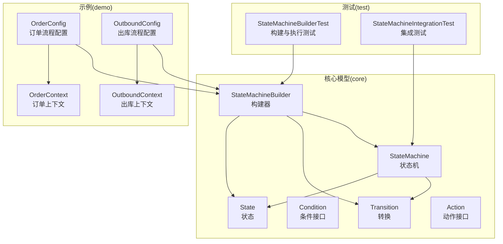
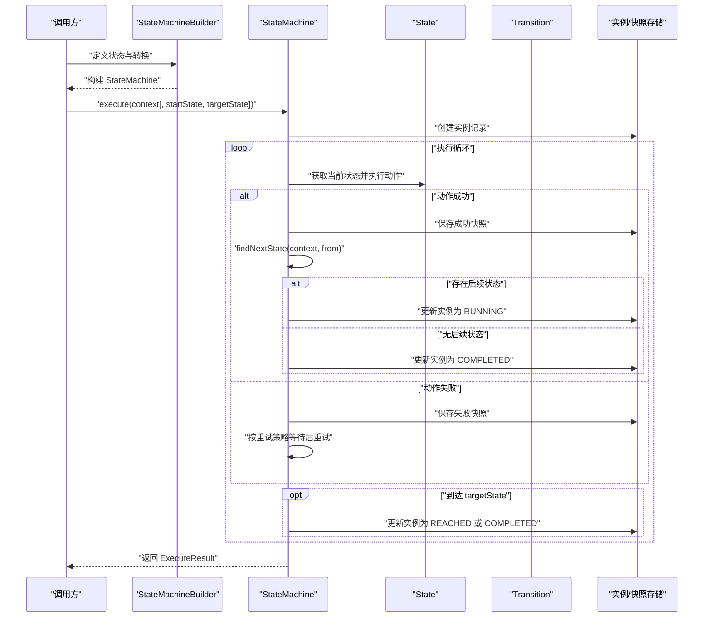
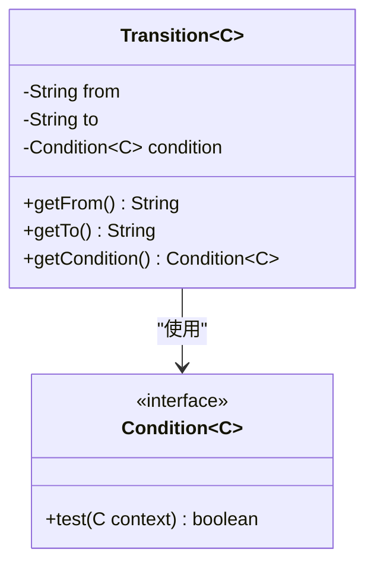
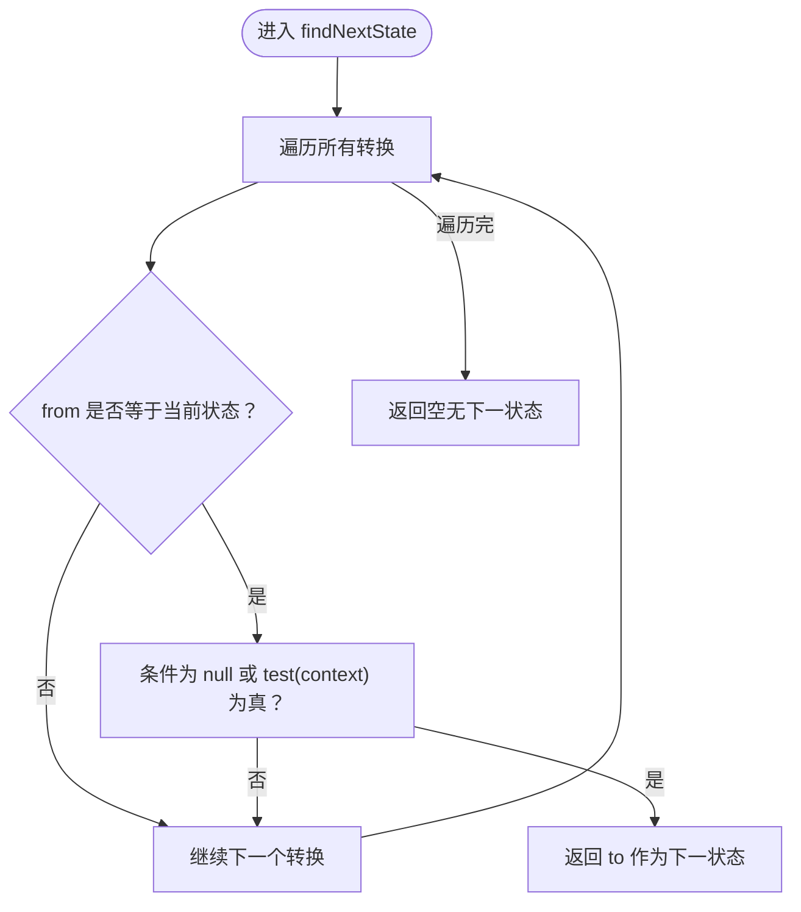
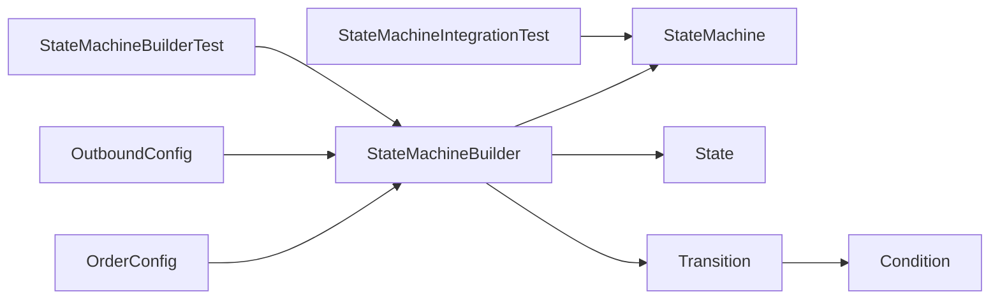

# 转换概念

<cite>
**本文引用的文件**
- [Transition.java](file://src/main/java/cn/chedejun/statemachine/core/Transition.java)
- [Condition.java](file://src/main/java/cn/chedejun/statemachine/core/Condition.java)
- [StateMachine.java](file://src/main/java/cn/chedejun/statemachine/core/StateMachine.java)
- [StateMachineBuilder.java](file://src/main/java/cn/chedejun/statemachine/core/StateMachineBuilder.java)
- [OrderConfig.java](file://demo/src/main/java/cn/chedejun/demo/config/OrderConfig.java)
- [OutboundConfig.java](file://demo/src/main/java/cn/chedejun/demo/config/OutboundConfig.java)
- [OrderContext.java](file://demo/src/main/java/cn/chedejun/demo/statemachine/OrderContext.java)
- [OutboundContext.java](file://demo/src/main/java/cn/chedejun/demo/statemachine/OutboundContext.java)
- [StateMachineBuilderTest.java](file://src/test/java/cn/chedejun/statemachine/core/StateMachineBuilderTest.java)
- [StateMachineIntegrationTest.java](file://src/test/java/cn/chedejun/statemachine/integration/StateMachineIntegrationTest.java)
- [README.md](file://README.md)
</cite>

## 目录
1. [引言](#引言)
2. [项目结构](#项目结构)
3. [核心组件](#核心组件)
4. [架构总览](#架构总览)
5. [详细组件分析](#详细组件分析)
6. [依赖分析](#依赖分析)
7. [性能考虑](#性能考虑)
8. [故障排查指南](#故障排查指南)
9. [结论](#结论)
10. [附录](#附录)

## 引言
本章节围绕状态机中的“转换（Transition）”概念展开，系统阐述其定义、触发条件与执行逻辑；明确转换的起始状态、目标状态、条件判断与转换规则；解释条件表达式编写方法与转换优先级处理方式；并通过丰富的示例路径展示不同场景下的实现思路；最后给出设计最佳实践与性能优化建议。

## 项目结构
该项目采用分层与功能模块结合的方式组织代码：
- 核心模型与执行引擎位于 core 包，包括状态、转换、条件、构建器与状态机主类等；
- 示例与演示位于 demo 包，包含订单与出库两个典型流程；
- 测试覆盖单元测试与集成测试，验证构建、执行、持久化与重试等行为；
- README 提供快速入门与基本用法说明。

图表来源
- [StateMachineBuilder.java:1-53](file://src/main/java/cn/chedejun/statemachine/core/StateMachineBuilder.java#L1-L53)
- [StateMachine.java:11-196](file://src/main/java/cn/chedejun/statemachine/core/StateMachine.java#L11-L196)
- [Transition.java:3-20](file://src/main/java/cn/chedejun/statemachine/core/Transition.java#L3-L20)
- [OrderConfig.java:18-46](file://demo/src/main/java/cn/chedejun/demo/config/OrderConfig.java#L18-L46)
- [OutboundConfig.java:22-58](file://demo/src/main/java/cn/chedejun/demo/config/OutboundConfig.java#L22-L58)

章节来源
- [README.md:1-65](file://README.md#L1-L65)

## 核心组件
- 转换（Transition）：描述从一个状态到另一个状态的迁移，包含起始状态、目标状态与条件判断。
- 条件（Condition）：函数式接口，接收上下文并返回布尔值以决定是否允许转换。
- 状态（State）：封装状态名与对应的动作（Action），动作在状态执行期间运行。
- 动作（Action）：函数式接口，负责在状态内执行业务逻辑，并通过上下文写入结果。
- 状态机（StateMachine）：承载状态集合与转换集合，驱动执行循环、重试策略与持久化。
- 构建器（StateMachineBuilder）：提供链式 API 定义状态、转换与重试策略，最终生成状态机实例。

章节来源
- [Transition.java:3-20](file://src/main/java/cn/chedejun/statemachine/core/Transition.java#L3-L20)
- [Condition.java:3-7](file://src/main/java/cn/chedejun/statemachine/core/Condition.java#L3-L7)
- [State.java:3-16](file://src/main/java/cn/chedejun/statemachine/core/State.java#L3-L16)
- [Action.java:8-12](file://src/main/java/cn/chedejun/statemachine/core/Action.java#L8-L12)
- [StateMachine.java:11-196](file://src/main/java/cn/chedejun/statemachine/core/StateMachine.java#L11-L196)
- [StateMachineBuilder.java:8-53](file://src/main/java/cn/chedejun/statemachine/core/StateMachineBuilder.java#L8-L53)

## 架构总览
状态机执行的核心流程如下：
- 构建阶段：通过构建器注册状态与转换，设置重试策略与上下文类型；
- 执行阶段：状态机根据当前状态执行对应动作，若动作抛出异常则按重试策略延迟重试；当达到目标状态或无后续转换时更新实例状态并结束；
- 持久化阶段：每次状态执行前后记录快照与实例状态，便于审计与重试恢复。

图表来源
- [StateMachineBuilder.java:40-51](file://src/main/java/cn/chedejun/statemachine/core/StateMachineBuilder.java#L40-L51)
- [StateMachine.java:40-136](file://src/main/java/cn/chedejun/statemachine/core/StateMachine.java#L40-L136)
- [StateMachine.java:142-149](file://src/main/java/cn/chedejun/statemachine/core/StateMachine.java#L142-L149)

## 详细组件分析

### 转换（Transition）定义与职责
- 定义：转换由起始状态（from）、目标状态（to）与条件（condition）三部分组成，用于描述状态之间的迁移规则。
- 触发条件：当处于某状态时，遍历所有转换，匹配 from 且 condition 为真（或 condition 为 null）时，触发该转换。
- 执行逻辑：转换本身不直接执行业务，而是作为状态机决策的一部分参与 findNextState 的选择过程。

图表来源
- [Transition.java:3-20](file://src/main/java/cn/chedejun/statemachine/core/Transition.java#L3-L20)
- [Condition.java:3-7](file://src/main/java/cn/chedejun/statemachine/core/Condition.java#L3-L7)

章节来源
- [Transition.java:3-20](file://src/main/java/cn/chedejun/statemachine/core/Transition.java#L3-L20)
- [Condition.java:3-7](file://src/main/java/cn/chedejun/statemachine/core/Condition.java#L3-L7)

### 状态机中的转换选择算法
状态机在每个状态结束后，会调用 findNextState 选择下一个状态。算法要点：
- 仅考虑 from 与当前状态一致的转换；
- 对满足条件的转换，按转换在列表中的先后顺序返回第一个可执行的目标状态；
- 若无可用转换，则流程结束。

图表来源
- [StateMachine.java:142-149](file://src/main/java/cn/chedejun/statemachine/core/StateMachine.java#L142-L149)

章节来源
- [StateMachine.java:142-149](file://src/main/java/cn/chedejun/statemachine/core/StateMachine.java#L142-L149)

### 转换的起始状态、目标状态与条件
- 起始状态（from）：必须非空且与当前状态严格匹配；
- 目标状态（to）：一旦匹配成功即为目标下一状态；
- 条件（condition）：可选；为 null 表示无条件允许转换；否则需满足 test(context) 为真。

章节来源
- [Transition.java:8-14](file://src/main/java/cn/chedejun/statemachine/core/Transition.java#L8-L14)
- [StateMachine.java:142-149](file://src/main/java/cn/chedejun/statemachine/core/StateMachine.java#L142-L149)

### 条件表达式的编写方法
- 使用 Lambda 表达式或方法引用，接收上下文对象并返回布尔值；
- 在示例中，订单流程与出库流程均通过上下文字段进行条件判断，例如库存数量、支付状态、拣货/打包/发货标记等；
- 可以组合上下文中的多个字段进行复合判断。

章节来源
- [OrderConfig.java:30-38](file://demo/src/main/java/cn/chedejun/demo/config/OrderConfig.java#L30-L38)
- [OutboundConfig.java:36-50](file://demo/src/main/java/cn/chedejun/demo/config/OutboundConfig.java#L36-L50)
- [OrderContext.java:8-34](file://demo/src/main/java/cn/chedejun/demo/statemachine/OrderContext.java#L8-L34)
- [OutboundContext.java:8-43](file://demo/src/main/java/cn/chedejun/demo/statemachine/OutboundContext.java#L8-L43)

### 转换的优先级处理
- 状态机按转换列表的先后顺序进行匹配，先匹配者优先；
- 因此，应将“高优先级”的转换（如异常分支、短路条件）置于列表靠前位置；
- 若存在多条 from 相同的转换，只有第一条满足条件的会被采用。

章节来源
- [StateMachine.java:142-149](file://src/main/java/cn/chedejun/statemachine/core/StateMachine.java#L142-L149)
- [StateMachineBuilderTest.java:85-102](file://src/test/java/cn/chedejun/statemachine/core/StateMachineBuilderTest.java#L85-L102)

### 转换设计的最佳实践
- 明确性：每个转换的 from/to 语义清晰，避免歧义；
- 排他性：同一 from 下的互斥条件应通过优先级或条件组合保证只有一条路径被选中；
- 完备性：确保从每个状态至少有一条可到达终止状态的路径，防止流程卡死；
- 可观测性：在动作中通过上下文写入关键信息，便于快照与审计；
- 可测试性：将复杂条件抽取为独立方法或使用简单布尔属性，便于单元测试。

章节来源
- [OrderConfig.java:30-38](file://demo/src/main/java/cn/chedejun/demo/config/OrderConfig.java#L30-L38)
- [OutboundConfig.java:36-50](file://demo/src/main/java/cn/chedejun/demo/config/OutboundConfig.java#L36-L50)
- [StateMachineBuilderTest.java:67-83](file://src/test/java/cn/chedejun/statemachine/core/StateMachineBuilderTest.java#L67-L83)

### 转换的执行与持久化
- 状态执行成功后，状态机记录成功快照并更新实例状态为 RUNNING；
- 若到达 targetState，且后续仍有未执行状态，则实例状态为 REACHED；否则为 COMPLETED；
- 若无后续转换，实例状态为 COMPLETED；
- 失败时按重试策略延迟重试，超过最大次数后实例状态为 FAILED。

章节来源
- [StateMachine.java:97-136](file://src/main/java/cn/chedejun/statemachine/core/StateMachine.java#L97-L136)
- [ExecuteResult.java:9-13](file://src/main/java/cn/chedejun/statemachine/core/ExecuteResult.java#L9-L13)

## 依赖分析
- 构建器（StateMachineBuilder）负责组装状态机，向状态机注入状态与转换列表；
- 状态机（StateMachine）持有状态与转换集合，提供执行入口与内部调度；
- 转换（Transition）依赖条件（Condition）进行判定；
- 示例配置（OrderConfig、OutboundConfig）通过构建器声明具体流程与条件；
- 测试（StateMachineBuilderTest、StateMachineIntegrationTest）验证构建、执行、持久化与重试行为。

图表来源
- [StateMachineBuilder.java:27-32](file://src/main/java/cn/chedejun/statemachine/core/StateMachineBuilder.java#L27-L32)
- [StateMachine.java:15-35](file://src/main/java/cn/chedejun/statemachine/core/StateMachine.java#L15-L35)
- [Transition.java:6](file://src/main/java/cn/chedejun/statemachine/core/Transition.java#L6)
- [OrderConfig.java:18-46](file://demo/src/main/java/cn/chedejun/demo/config/OrderConfig.java#L18-L46)
- [OutboundConfig.java:22-58](file://demo/src/main/java/cn/chedejun/demo/config/OutboundConfig.java#L22-L58)
- [StateMachineBuilderTest.java:36-45](file://src/test/java/cn/chedejun/statemachine/core/StateMachineBuilderTest.java#L36-L45)
- [StateMachineIntegrationTest.java:72-92](file://src/test/java/cn/chedejun/statemachine/integration/StateMachineIntegrationTest.java#L72-L92)

章节来源
- [StateMachineBuilder.java:27-32](file://src/main/java/cn/chedejun/statemachine/core/StateMachineBuilder.java#L27-L32)
- [StateMachine.java:15-35](file://src/main/java/cn/chedejun/statemachine/core/StateMachine.java#L15-L35)
- [Transition.java:6](file://src/main/java/cn/chedejun/statemachine/core/Transition.java#L6)
- [OrderConfig.java:18-46](file://demo/src/main/java/cn/chedejun/demo/config/OrderConfig.java#L18-L46)
- [OutboundConfig.java:22-58](file://demo/src/main/java/cn/chedejun/demo/config/OutboundConfig.java#L22-L58)
- [StateMachineBuilderTest.java:36-45](file://src/test/java/cn/chedejun/statemachine/core/StateMachineBuilderTest.java#L36-L45)
- [StateMachineIntegrationTest.java:72-92](file://src/test/java/cn/chedejun/statemachine/integration/StateMachineIntegrationTest.java#L72-L92)

## 性能考虑
- 转换匹配复杂度：findNextState 对转换列表进行线性扫描，时间复杂度 O(N)，其中 N 为转换数量；建议控制单个状态的转换数量，避免过长列表；
- 条件计算成本：条件表达式应在上下文中尽量使用轻量级字段判断，避免昂贵的外部调用；
- 重试策略：指数退避会增加整体耗时，应合理设置最大尝试次数与最大延迟；
- 持久化开销：快照与实例记录涉及数据库 IO，建议批量写入与合理的索引设计；
- 并发与中断：重试过程中可能阻塞线程，注意中断处理与资源释放。

## 故障排查指南
- 执行前未初始化：若未注入数据源，执行会抛出初始化异常；请确保通过构建器或外部装配设置 JdbcTemplate；
- 无下一状态：若当前状态无任何转换指向后续状态，流程将自然结束；可通过添加终止转换或调整流程设计解决；
- 到达 targetState：若指定 targetState，且其后仍有未执行状态，实例状态为 REACHED；若 targetState 为最后一个状态，状态为 COMPLETED；
- 失败重试：失败实例只能重试且超过最大次数后状态为 FAILED；可通过重试接口或管理控制台进行操作；
- 条件不生效：确认条件表达式是否正确绑定上下文字段，以及转换列表顺序是否导致优先级问题。

章节来源
- [StateMachineBuilderTest.java:30-34](file://src/test/java/cn/chedejun/statemachine/core/StateMachineBuilderTest.java#L30-L34)
- [StateMachineBuilderTest.java:67-83](file://src/test/java/cn/chedejun/statemachine/core/StateMachineBuilderTest.java#L67-L83)
- [StateMachineBuilderTest.java:85-102](file://src/test/java/cn/chedejun/statemachine/core/StateMachineBuilderTest.java#L85-L102)
- [StateMachineIntegrationTest.java:204-217](file://src/test/java/cn/chedejun/statemachine/integration/StateMachineIntegrationTest.java#L204-L217)
- [StateMachineIntegrationTest.java:296-310](file://src/test/java/cn/chedejun/statemachine/integration/StateMachineIntegrationTest.java#L296-L310)

## 结论
转换是状态机决策的核心构件，它将状态与条件结合，形成可预测的流程演进路径。通过明确的起始/目标状态、可读的条件表达式与合理的优先级排序，可以构建清晰、可维护且可测试的状态机流程。配合完善的重试与持久化机制，能够在复杂业务场景中稳定地推进流程执行并提供可观测性与可恢复能力。

## 附录
- 快速上手示例路径
  - [README.md:17-49](file://README.md#L17-L49)
- 订单流程示例路径
  - [OrderConfig.java:18-46](file://demo/src/main/java/cn/chedejun/demo/config/OrderConfig.java#L18-L46)
  - [OrderContext.java:8-34](file://demo/src/main/java/cn/chedejun/demo/statemachine/OrderContext.java#L8-L34)
- 出库流程示例路径
  - [OutboundConfig.java:22-58](file://demo/src/main/java/cn/chedejun/demo/config/OutboundConfig.java#L22-L58)
  - [OutboundContext.java:8-43](file://demo/src/main/java/cn/chedejun/demo/statemachine/OutboundContext.java#L8-L43)
- 单元测试验证路径
  - [StateMachineBuilderTest.java:67-120](file://src/test/java/cn/chedejun/statemachine/core/StateMachineBuilderTest.java#L67-L120)
- 集成测试验证路径
  - [StateMachineIntegrationTest.java:159-217](file://src/test/java/cn/chedejun/statemachine/integration/StateMachineIntegrationTest.java#L159-L217)
  - [StateMachineIntegrationTest.java:238-310](file://src/test/java/cn/chedejun/statemachine/integration/StateMachineIntegrationTest.java#L238-L310)