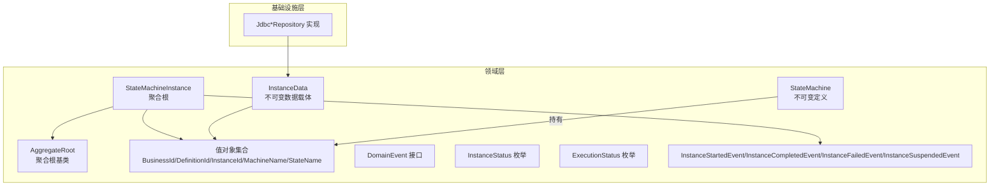
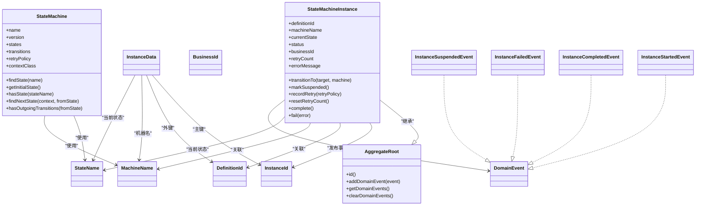
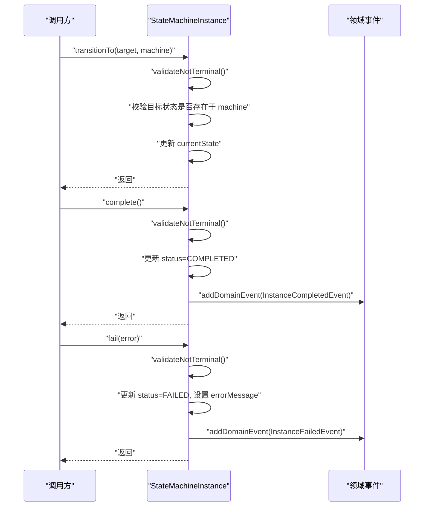
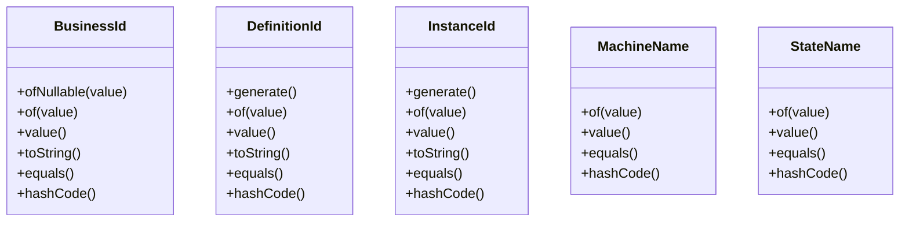
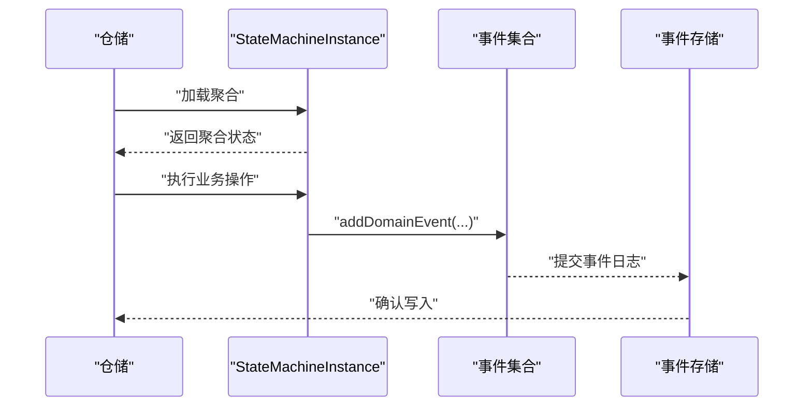
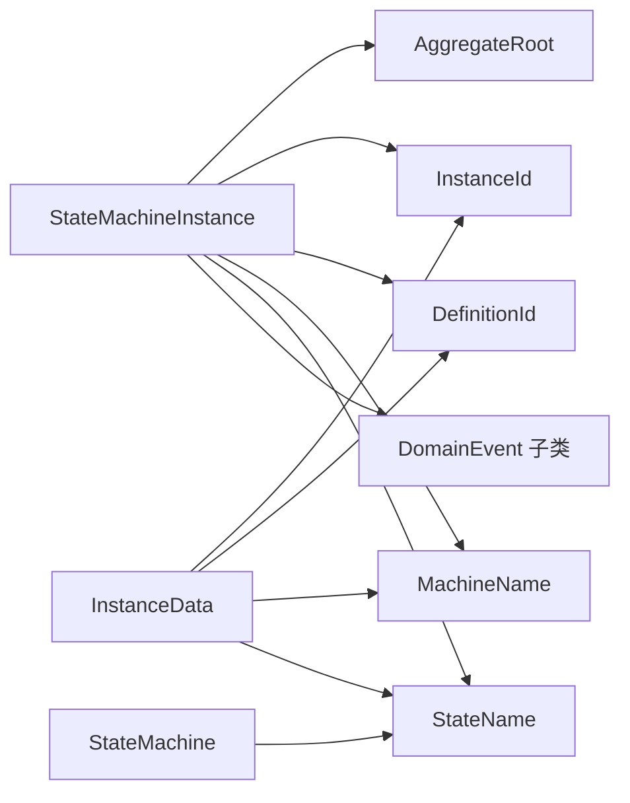

# 领域对象设计

<cite>
**本文引用的文件**
- [AggregateRoot.java](file://state-machine-boot-starter/src/main/java/cn/chedejun/statemachine/domain/shared/AggregateRoot.java)
- [DomainEvent.java](file://state-machine-boot-starter/src/main/java/cn/chedejun/statemachine/domain/shared/DomainEvent.java)
- [ExecutionStatus.java](file://state-machine-boot-starter/src/main/java/cn/chedejun/statemachine/domain/shared/ExecutionStatus.java)
- [InstanceStatus.java](file://state-machine-boot-starter/src/main/java/cn/chedejun/statemachine/domain/shared/InstanceStatus.java)
- [BusinessId.java](file://state-machine-boot-starter/src/main/java/cn/chedejun/statemachine/domain/shared/BusinessId.java)
- [DefinitionId.java](file://state-machine-boot-starter/src/main/java/cn/chedejun/statemachine/domain/shared/DefinitionId.java)
- [InstanceId.java](file://state-machine-boot-starter/src/main/java/cn/chedejun/statemachine/domain/shared/InstanceId.java)
- [MachineName.java](file://state-machine-boot-starter/src/main/java/cn/chedejun/statemachine/domain/shared/MachineName.java)
- [StateName.java](file://state-machine-boot-starter/src/main/java/cn/chedejun/statemachine/domain/shared/StateName.java)
- [StateMachine.java](file://state-machine-boot-starter/src/main/java/cn/chedejun/statemachine/domain/engine/StateMachine.java)
- [StateMachineInstance.java](file://state-machine-boot-starter/src/main/java/cn/chedejun/statemachine/domain/instance/StateMachineInstance.java)
- [InstanceStartedEvent.java](file://state-machine-boot-starter/src/main/java/cn/chedejun/statemachine/domain/event/InstanceStartedEvent.java)
- [InstanceCompletedEvent.java](file://state-machine-boot-starter/src/main/java/cn/chedejun/statemachine/domain/event/InstanceCompletedEvent.java)
- [InstanceFailedEvent.java](file://state-machine-boot-starter/src/main/java/cn/chedejun/statemachine/domain/event/InstanceFailedEvent.java)
- [InstanceSuspendedEvent.java](file://state-machine-boot-starter/src/main/java/cn/chedejun/statemachine/domain/event/InstanceSuspendedEvent.java)
- [InstanceData.java](file://state-machine-boot-starter/src/main/java/cn/chedejun/statemachine/domain/data/InstanceData.java)
</cite>

## 目录
1. 引言
2. 项目结构
3. 核心组件
4. 架构总览
5. 详细组件分析
6. 依赖分析
7. 性能考量
8. 故障排查指南
9. 结论
10. 附录

## 引言
本设计文档围绕状态机工作流引擎的领域对象进行系统化梳理，重点阐述以下主题：
- 不可变领域对象的设计原则与实现方式
- 聚合根（Aggregate Root）的概念及在状态机中的应用（以 StateMachineInstance 为例）
- 值对象（Value Object）的设计模式，涵盖 BusinessId、DefinitionId、InstanceId 等标识符对象
- 领域事件（Domain Event）的触发机制与事件溯源的潜在应用
- 具体的代码示例路径，展示如何正确设计与使用领域对象
- 领域对象的不变性保证与线程安全性考虑

## 项目结构
该模块采用清晰的分层与职责划分：
- domain.shared：领域共享基础设施（聚合根基类、值对象、领域事件接口、状态枚举）
- domain.engine：状态机定义（不可变的状态机定义对象）
- domain.instance：运行时实例（聚合根 StateMachineInstance 及其行为）
- domain.event：领域事件（实例生命周期关键事件）
- domain.data：数据传输对象（用于持久化与跨层传递）
- infrastructure.persistence：仓储实现（JDBC 仓储）

图表来源
- [AggregateRoot.java:1-29](file://state-machine-boot-starter/src/main/java/cn/chedejun/statemachine/domain/shared/AggregateRoot.java#L1-L29)
- [StateMachine.java:1-77](file://state-machine-boot-starter/src/main/java/cn/chedejun/statemachine/domain/engine/StateMachine.java#L1-L77)
- [StateMachineInstance.java:1-81](file://state-machine-boot-starter/src/main/java/cn/chedejun/statemachine/domain/instance/StateMachineInstance.java#L1-L81)
- [InstanceData.java:1-79](file://state-machine-boot-starter/src/main/java/cn/chedejun/statemachine/domain/data/InstanceData.java#L1-L79)

章节来源
- [AggregateRoot.java:1-29](file://state-machine-boot-starter/src/main/java/cn/chedejun/statemachine/domain/shared/AggregateRoot.java#L1-L29)
- [StateMachine.java:1-77](file://state-machine-boot-starter/src/main/java/cn/chedejun/statemachine/domain/engine/StateMachine.java#L1-L77)
- [StateMachineInstance.java:1-81](file://state-machine-boot-starter/src/main/java/cn/chedejun/statemachine/domain/instance/StateMachineInstance.java#L1-L81)
- [InstanceData.java:1-79](file://state-machine-boot-starter/src/main/java/cn/chedejun/statemachine/domain/data/InstanceData.java#L1-L79)

## 核心组件
本节聚焦于领域对象的核心构成及其职责边界。

- 聚合根基类（AggregateRoot）
  - 提供统一的聚合标识与领域事件收集能力，确保聚合内部的一致性与可审计性
  - 通过受保护的 addDomainEvent 方法记录事件，提供只读视图 getDomainEvents，避免外部修改
  - 清理方法 clearDomainEvents 用于事件发布后的清理

- 不可变定义（StateMachine）
  - 承载状态定义、转换规则、重试策略等“静态”信息
  - 构造阶段进行参数校验，字段全部私有且不可变（通过不可变列表包装），保证并发安全与可预测行为
  - 提供查询方法（查找状态、初始状态、是否存在出边等），不改变内部状态

- 运行时聚合根（StateMachineInstance）
  - 继承 AggregateRoot，以 InstanceId 为聚合标识
  - 聚合内维护当前状态、业务标识、重试次数、错误信息等可变属性
  - 通过受控的方法（如 transitionTo、markSuspended、complete、fail、recordRetry）改变内部状态，并在关键节点发布领域事件

- 值对象（Value Objects）
  - BusinessId、DefinitionId、InstanceId、MachineName、StateName 等均采用 final 类型，仅提供工厂方法与不可变访问器
  - 内部通过私有构造函数与严格校验（如非空、非空白）保障有效性
  - 使用 equals/hashCode 基于值语义，便于集合与缓存场景下的稳定比较

- 领域事件（Domain Events）
  - 通过 DomainEvent 接口统一抽象，具体事件封装聚合变更的关键事实
  - 事件对象保持不可变，携带必要的上下文（如实例标识、错误信息）

- 数据载体（InstanceData）
  - 作为不可变数据载体，用于持久化与跨层传递
  - 提供 withXxx 工厂方法生成“新版本”实例，体现函数式更新思想

章节来源
- [AggregateRoot.java:1-29](file://state-machine-boot-starter/src/main/java/cn/chedejun/statemachine/domain/shared/AggregateRoot.java#L1-L29)
- [StateMachine.java:1-77](file://state-machine-boot-starter/src/main/java/cn/chedejun/statemachine/domain/engine/StateMachine.java#L1-L77)
- [StateMachineInstance.java:1-81](file://state-machine-boot-starter/src/main/java/cn/chedejun/statemachine/domain/instance/StateMachineInstance.java#L1-L81)
- [BusinessId.java:1-24](file://state-machine-boot-starter/src/main/java/cn/chedejun/statemachine/domain/shared/BusinessId.java#L1-L24)
- [DefinitionId.java:1-27](file://state-machine-boot-starter/src/main/java/cn/chedejun/statemachine/domain/shared/DefinitionId.java#L1-L27)
- [InstanceId.java:1-27](file://state-machine-boot-starter/src/main/java/cn/chedejun/statemachine/domain/shared/InstanceId.java#L1-L27)
- [MachineName.java:1-25](file://state-machine-boot-starter/src/main/java/cn/chedejun/statemachine/domain/shared/MachineName.java#L1-L25)
- [StateName.java:1-25](file://state-machine-boot-starter/src/main/java/cn/chedejun/statemachine/domain/shared/StateName.java#L1-L25)
- [DomainEvent.java:1-5](file://state-machine-boot-starter/src/main/java/cn/chedejun/statemachine/domain/shared/DomainEvent.java#L1-L5)
- [InstanceStatus.java:1-3](file://state-machine-boot-starter/src/main/java/cn/chedejun/statemachine/domain/shared/InstanceStatus.java#L1-L3)
- [ExecutionStatus.java:1-3](file://state-machine-boot-starter/src/main/java/cn/chedejun/statemachine/domain/shared/ExecutionStatus.java#L1-L3)
- [InstanceData.java:1-79](file://state-machine-boot-starter/src/main/java/cn/chedejun/statemachine/domain/data/InstanceData.java#L1-L79)

## 架构总览
下图展示了领域对象之间的关系与交互，强调不可变定义与可变聚合根的分离，以及事件驱动的变更传播。

图表来源
- [AggregateRoot.java:1-29](file://state-machine-boot-starter/src/main/java/cn/chedejun/statemachine/domain/shared/AggregateRoot.java#L1-L29)
- [StateMachine.java:1-77](file://state-machine-boot-starter/src/main/java/cn/chedejun/statemachine/domain/engine/StateMachine.java#L1-L77)
- [StateMachineInstance.java:1-81](file://state-machine-boot-starter/src/main/java/cn/chedejun/statemachine/domain/instance/StateMachineInstance.java#L1-L81)
- [BusinessId.java:1-24](file://state-machine-boot-starter/src/main/java/cn/chedejun/statemachine/domain/shared/BusinessId.java#L1-L24)
- [DefinitionId.java:1-27](file://state-machine-boot-starter/src/main/java/cn/chedejun/statemachine/domain/shared/DefinitionId.java#L1-L27)
- [InstanceId.java:1-27](file://state-machine-boot-starter/src/main/java/cn/chedejun/statemachine/domain/shared/InstanceId.java#L1-L27)
- [MachineName.java:1-25](file://state-machine-boot-starter/src/main/java/cn/chedejun/statemachine/domain/shared/MachineName.java#L1-L25)
- [StateName.java:1-25](file://state-machine-boot-starter/src/main/java/cn/chedejun/statemachine/domain/shared/StateName.java#L1-L25)
- [DomainEvent.java:1-5](file://state-machine-boot-starter/src/main/java/cn/chedejun/statemachine/domain/shared/DomainEvent.java#L1-L5)
- [InstanceStartedEvent.java:1-25](file://state-machine-boot-starter/src/main/java/cn/chedejun/statemachine/domain/event/InstanceStartedEvent.java#L1-L25)
- [InstanceCompletedEvent.java:1-25](file://state-machine-boot-starter/src/main/java/cn/chedejun/statemachine/domain/event/InstanceCompletedEvent.java#L1-L25)
- [InstanceFailedEvent.java:1-28](file://state-machine-boot-starter/src/main/java/cn/chedejun/statemachine/domain/event/InstanceFailedEvent.java#L1-L28)
- [InstanceSuspendedEvent.java:1-25](file://state-machine-boot-starter/src/main/java/cn/chedejun/statemachine/domain/event/InstanceSuspendedEvent.java#L1-L25)
- [InstanceData.java:1-79](file://state-machine-boot-starter/src/main/java/cn/chedejun/statemachine/domain/data/InstanceData.java#L1-L79)

## 详细组件分析

### 不可变定义对象：StateMachine
- 设计原则
  - 构造时一次性设置所有字段，随后仅暴露查询方法，不提供修改器
  - 使用不可变列表包装内部集合，防止外部篡改
  - 在构造阶段进行参数校验，确保模型有效
- 关键行为
  - 查找状态、获取初始状态、判断状态存在性、基于条件计算下一状态、判断是否存在出边
- 并发与线程安全
  - 字段均为 final，结合不可变容器，天然具备线程安全
- 示例路径
  - [StateMachine.java:28-41](file://state-machine-boot-starter/src/main/java/cn/chedejun/statemachine/domain/engine/StateMachine.java#L28-L41)
  - [StateMachine.java:50-75](file://state-machine-boot-starter/src/main/java/cn/chedejun/statemachine/domain/engine/StateMachine.java#L50-L75)

章节来源
- [StateMachine.java:1-77](file://state-machine-boot-starter/src/main/java/cn/chedejun/statemachine/domain/engine/StateMachine.java#L1-L77)

### 聚合根：StateMachineInstance
- 聚合根定位
  - 以 InstanceId 为唯一标识，聚合内维护实例的生命周期状态与上下文信息
  - 通过受控方法改变内部状态，保证业务规则一致性
- 领域事件触发
  - 启动、完成、失败、挂起等关键动作会调用 addDomainEvent 发布事件
- 终止状态保护
  - 对终端状态（已完成/失败）进行前置校验，防止非法操作
- 示例路径
  - [StateMachineInstance.java:19-28](file://state-machine-boot-starter/src/main/java/cn/chedejun/statemachine/domain/instance/StateMachineInstance.java#L19-L28)
  - [StateMachineInstance.java:39-44](file://state-machine-boot-starter/src/main/java/cn/chedejun/statemachine/domain/instance/StateMachineInstance.java#L39-L44)
  - [StateMachineInstance.java:46-49](file://state-machine-boot-starter/src/main/java/cn/chedejun/statemachine/domain/instance/StateMachineInstance.java#L46-L49)
  - [StateMachineInstance.java:63-67](file://state-machine-boot-starter/src/main/java/cn/chedejun/statemachine/domain/instance/StateMachineInstance.java#L63-L67)
  - [StateMachineInstance.java:69-74](file://state-machine-boot-starter/src/main/java/cn/chedejun/statemachine/domain/instance/StateMachineInstance.java#L69-L74)
  - [StateMachineInstance.java:76-79](file://state-machine-boot-starter/src/main/java/cn/chedejun/statemachine/domain/instance/StateMachineInstance.java#L76-L79)

图表来源
- [StateMachineInstance.java:39-74](file://state-machine-boot-starter/src/main/java/cn/chedejun/statemachine/domain/instance/StateMachineInstance.java#L39-L74)
- [InstanceCompletedEvent.java:1-25](file://state-machine-boot-starter/src/main/java/cn/chedejun/statemachine/domain/event/InstanceCompletedEvent.java#L1-L25)
- [InstanceFailedEvent.java:1-28](file://state-machine-boot-starter/src/main/java/cn/chedejun/statemachine/domain/event/InstanceFailedEvent.java#L1-L28)

章节来源
- [StateMachineInstance.java:1-81](file://state-machine-boot-starter/src/main/java/cn/chedejun/statemachine/domain/instance/StateMachineInstance.java#L1-L81)

### 值对象：BusinessId、DefinitionId、InstanceId、MachineName、StateName
- 设计要点
  - final 类型，私有构造函数，严格校验输入（如 DefinitionId、InstanceId、MachineName、StateName 的非空/非空白）
  - 提供 of/generate 工厂方法，确保对象创建的统一入口
  - 基于值语义的 equals/hashCode，适合用作集合键或缓存键
- 示例路径
  - [BusinessId.java:8-13](file://state-machine-boot-starter/src/main/java/cn/chedejun/statemachine/domain/shared/BusinessId.java#L8-L13)
  - [DefinitionId.java:9-15](file://state-machine-boot-starter/src/main/java/cn/chedejun/statemachine/domain/shared/DefinitionId.java#L9-L15)
  - [InstanceId.java:9-15](file://state-machine-boot-starter/src/main/java/cn/chedejun/statemachine/domain/shared/InstanceId.java#L9-L15)
  - [MachineName.java:8-14](file://state-machine-boot-starter/src/main/java/cn/chedejun/statemachine/domain/shared/MachineName.java#L8-L14)
  - [StateName.java:8-14](file://state-machine-boot-starter/src/main/java/cn/chedejun/statemachine/domain/shared/StateName.java#L8-L14)

图表来源
- [BusinessId.java:1-24](file://state-machine-boot-starter/src/main/java/cn/chedejun/statemachine/domain/shared/BusinessId.java#L1-L24)
- [DefinitionId.java:1-27](file://state-machine-boot-starter/src/main/java/cn/chedejun/statemachine/domain/shared/DefinitionId.java#L1-L27)
- [InstanceId.java:1-27](file://state-machine-boot-starter/src/main/java/cn/chedejun/statemachine/domain/shared/InstanceId.java#L1-L27)
- [MachineName.java:1-25](file://state-machine-boot-starter/src/main/java/cn/chedejun/statemachine/domain/shared/MachineName.java#L1-L25)
- [StateName.java:1-25](file://state-machine-boot-starter/src/main/java/cn/chedejun/statemachine/domain/shared/StateName.java#L1-L25)

章节来源
- [BusinessId.java:1-24](file://state-machine-boot-starter/src/main/java/cn/chedejun/statemachine/domain/shared/BusinessId.java#L1-L24)
- [DefinitionId.java:1-27](file://state-machine-boot-starter/src/main/java/cn/chedejun/statemachine/domain/shared/DefinitionId.java#L1-L27)
- [InstanceId.java:1-27](file://state-machine-boot-starter/src/main/java/cn/chedejun/statemachine/domain/shared/InstanceId.java#L1-L27)
- [MachineName.java:1-25](file://state-machine-boot-starter/src/main/java/cn/chedejun/statemachine/domain/shared/MachineName.java#L1-L25)
- [StateName.java:1-25](file://state-machine-boot-starter/src/main/java/cn/chedejun/statemachine/domain/shared/StateName.java#L1-L25)

### 领域事件：触发机制与事件溯源潜力
- 触发机制
  - 聚合根在关键状态变更时通过 addDomainEvent 记录事件
  - 事件对象不可变，包含必要上下文（如实例标识、错误信息）
- 事件溯源潜力
  - 事件集合可作为历史记录，支持重放以重建聚合状态
  - 结合不可变数据载体（如 InstanceData）可实现事件存储与查询
- 示例路径
  - [AggregateRoot.java:17-27](file://state-machine-boot-starter/src/main/java/cn/chedejun/statemachine/domain/shared/AggregateRoot.java#L17-L27)
  - [StateMachineInstance.java:27](file://state-machine-boot-starter/src/main/java/cn/chedejun/statemachine/domain/instance/StateMachineInstance.java#L27)
  - [StateMachineInstance.java:49](file://state-machine-boot-starter/src/main/java/cn/chedejun/statemachine/domain/instance/StateMachineInstance.java#L49)
  - [StateMachineInstance.java:66](file://state-machine-boot-starter/src/main/java/cn/chedejun/statemachine/domain/instance/StateMachineInstance.java#L66)
  - [StateMachineInstance.java:73](file://state-machine-boot-starter/src/main/java/cn/chedejun/statemachine/domain/instance/StateMachineInstance.java#L73)
  - [InstanceStartedEvent.java:1-25](file://state-machine-boot-starter/src/main/java/cn/chedejun/statemachine/domain/event/InstanceStartedEvent.java#L1-L25)
  - [InstanceCompletedEvent.java:1-25](file://state-machine-boot-starter/src/main/java/cn/chedejun/statemachine/domain/event/InstanceCompletedEvent.java#L1-L25)
  - [InstanceFailedEvent.java:1-28](file://state-machine-boot-starter/src/main/java/cn/chedejun/statemachine/domain/event/InstanceFailedEvent.java#L1-L28)
  - [InstanceSuspendedEvent.java:1-25](file://state-machine-boot-starter/src/main/java/cn/chedejun/statemachine/domain/event/InstanceSuspendedEvent.java#L1-L25)

图表来源
- [AggregateRoot.java:17-27](file://state-machine-boot-starter/src/main/java/cn/chedejun/statemachine/domain/shared/AggregateRoot.java#L17-L27)
- [StateMachineInstance.java:27-27](file://state-machine-boot-starter/src/main/java/cn/chedejun/statemachine/domain/instance/StateMachineInstance.java#L27-L27)
- [StateMachineInstance.java:49-49](file://state-machine-boot-starter/src/main/java/cn/chedejun/statemachine/domain/instance/StateMachineInstance.java#L49-L49)
- [StateMachineInstance.java:66-66](file://state-machine-boot-starter/src/main/java/cn/chedejun/statemachine/domain/instance/StateMachineInstance.java#L66-L66)
- [StateMachineInstance.java:73-73](file://state-machine-boot-starter/src/main/java/cn/chedejun/statemachine/domain/instance/StateMachineInstance.java#L73-L73)

章节来源
- [AggregateRoot.java:1-29](file://state-machine-boot-starter/src/main/java/cn/chedejun/statemachine/domain/shared/AggregateRoot.java#L1-L29)
- [StateMachineInstance.java:1-81](file://state-machine-boot-starter/src/main/java/cn/chedejun/statemachine/domain/instance/StateMachineInstance.java#L1-L81)

### 不可变数据载体：InstanceData
- 设计原则
  - 所有字段私有且 final，提供工厂方法生成“新版本”实例，体现函数式更新
  - 支持时间戳字段（createdAt/updatedAt）与重试相关字段，便于持久化与审计
- 示例路径
  - [InstanceData.java:22-38](file://state-machine-boot-starter/src/main/java/cn/chedejun/statemachine/domain/data/InstanceData.java#L22-L38)
  - [InstanceData.java:40-44](file://state-machine-boot-starter/src/main/java/cn/chedejun/statemachine/domain/data/InstanceData.java#L40-L44)
  - [InstanceData.java:46-54](file://state-machine-boot-starter/src/main/java/cn/chedejun/statemachine/domain/data/InstanceData.java#L46-L54)

章节来源
- [InstanceData.java:1-79](file://state-machine-boot-starter/src/main/java/cn/chedejun/statemachine/domain/data/InstanceData.java#L1-L79)

## 依赖分析
- 聚合根与值对象
  - StateMachineInstance 继承 AggregateRoot 并组合多个值对象（InstanceId、DefinitionId、MachineName、StateName、BusinessId）
- 定义与实例
  - StateMachineInstance 在构造时接收 StateMachine，用于校验目标状态的存在性
- 事件与聚合
  - 聚合根在关键动作中发布领域事件，事件对象不可变且携带聚合标识
- 数据与仓储
  - InstanceData 作为不可变数据载体，支撑持久化与跨层传递

图表来源
- [StateMachineInstance.java:1-81](file://state-machine-boot-starter/src/main/java/cn/chedejun/statemachine/domain/instance/StateMachineInstance.java#L1-L81)
- [AggregateRoot.java:1-29](file://state-machine-boot-starter/src/main/java/cn/chedejun/statemachine/domain/shared/AggregateRoot.java#L1-L29)
- [StateMachine.java:1-77](file://state-machine-boot-starter/src/main/java/cn/chedejun/statemachine/domain/engine/StateMachine.java#L1-L77)
- [InstanceData.java:1-79](file://state-machine-boot-starter/src/main/java/cn/chedejun/statemachine/domain/data/InstanceData.java#L1-L79)

章节来源
- [StateMachineInstance.java:1-81](file://state-machine-boot-starter/src/main/java/cn/chedejun/statemachine/domain/instance/StateMachineInstance.java#L1-L81)
- [StateMachine.java:1-77](file://state-machine-boot-starter/src/main/java/cn/chedejun/statemachine/domain/engine/StateMachine.java#L1-L77)
- [InstanceData.java:1-79](file://state-machine-boot-starter/src/main/java/cn/chedejun/statemachine/domain/data/InstanceData.java#L1-L79)

## 性能考量
- 不可变对象的优势
  - 无需同步锁即可安全共享，降低并发开销
  - 便于缓存与复用，减少 GC 压力
- 值对象的比较成本
  - 基于值语义的 equals/hashCode 比较简单高效，适合高频比较场景
- 事件发布与存储
  - 将事件发布与持久化解耦，可在事务边界外异步处理，提升吞吐
- 状态查询
  - StateMachine 的查询方法基于集合遍历，建议在构建阶段控制规模或引入索引结构（如按名称映射）

## 故障排查指南
- 终端状态异常
  - 现象：对已完成或失败的实例再次执行动作抛出异常
  - 处理：检查实例状态，避免重复操作；必要时重置或创建新实例
  - 参考路径：[StateMachineInstance.java:76-79](file://state-machine-boot-starter/src/main/java/cn/chedejun/statemachine/domain/instance/StateMachineInstance.java#L76-L79)
- 非法状态迁移
  - 现象：目标状态不在状态机定义中导致异常
  - 处理：核对状态机定义与迁移条件；确保状态名称一致
  - 参考路径：[StateMachineInstance.java:40-44](file://state-machine-boot-starter/src/main/java/cn/chedejun/statemachine/domain/instance/StateMachineInstance.java#L40-L44)
- 重试策略违规
  - 现象：对非失败实例发起重试或超过最大尝试次数抛出异常
  - 处理：先将实例标记为失败，再按策略进行重试；监控重试计数
  - 参考路径：[StateMachineInstance.java:52-59](file://state-machine-boot-starter/src/main/java/cn/chedejun/statemachine/domain/instance/StateMachineInstance.java#L52-L59)
- 值对象校验失败
  - 现象：DefinitionId、InstanceId、MachineName、StateName 的构造参数为空或空白
  - 处理：确保传入合法值；使用工厂方法生成
  - 参考路径：[DefinitionId.java:9-12](file://state-machine-boot-starter/src/main/java/cn/chedejun/statemachine/domain/shared/DefinitionId.java#L9-L12), [InstanceId.java:9-12](file://state-machine-boot-starter/src/main/java/cn/chedejun/statemachine/domain/shared/InstanceId.java#L9-L12), [MachineName.java:8-11](file://state-machine-boot-starter/src/main/java/cn/chedejun/statemachine/domain/shared/MachineName.java#L8-L11), [StateName.java:8-11](file://state-machine-boot-starter/src/main/java/cn/chedejun/statemachine/domain/shared/StateName.java#L8-L11)

章节来源
- [StateMachineInstance.java:52-79](file://state-machine-boot-starter/src/main/java/cn/chedejun/statemachine/domain/instance/StateMachineInstance.java#L52-L79)
- [DefinitionId.java:9-12](file://state-machine-boot-starter/src/main/java/cn/chedejun/statemachine/domain/shared/DefinitionId.java#L9-L12)
- [InstanceId.java:9-12](file://state-machine-boot-starter/src/main/java/cn/chedejun/statemachine/domain/shared/InstanceId.java#L9-L12)
- [MachineName.java:8-11](file://state-machine-boot-starter/src/main/java/cn/chedejun/statemachine/domain/shared/MachineName.java#L8-L11)
- [StateName.java:8-11](file://state-machine-boot-starter/src/main/java/cn/chedejun/statemachine/domain/shared/StateName.java#L8-L11)

## 结论
本设计通过“不可变定义 + 可变聚合根 + 值对象 + 领域事件”的组合，实现了清晰的领域建模：
- 不可变定义确保规则稳定与并发安全
- 聚合根集中管理业务规则与事件发布
- 值对象以不可变方式表达领域概念，提升可读性与可维护性
- 领域事件为事件溯源提供了天然基础，便于审计与回放
在实际工程中，建议结合仓储与事件存储实现，进一步完善事件溯源与幂等处理。

## 附录
- 示例路径汇总
  - 不可变定义：[StateMachine.java:28-41](file://state-machine-boot-starter/src/main/java/cn/chedejun/statemachine/domain/engine/StateMachine.java#L28-L41)
  - 聚合根行为：[StateMachineInstance.java:39-74](file://state-machine-boot-starter/src/main/java/cn/chedejun/statemachine/domain/instance/StateMachineInstance.java#L39-L74)
  - 值对象工厂：[DefinitionId.java:15-15](file://state-machine-boot-starter/src/main/java/cn/chedejun/statemachine/domain/shared/DefinitionId.java#L15-L15), [InstanceId.java:15-15](file://state-machine-boot-starter/src/main/java/cn/chedejun/statemachine/domain/shared/InstanceId.java#L15-L15)
  - 事件发布：[AggregateRoot.java:17-27](file://state-machine-boot-starter/src/main/java/cn/chedejun/statemachine/domain/shared/AggregateRoot.java#L17-L27)
  - 不可变数据：[InstanceData.java:40-54](file://state-machine-boot-starter/src/main/java/cn/chedejun/statemachine/domain/data/InstanceData.java#L40-L54)